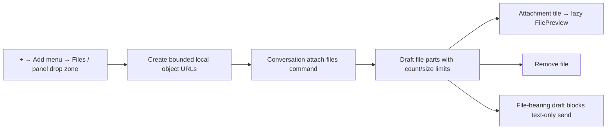

# Nessa

A menu bar agent: a transparent, floating chat panel built with Tauri 2, React 19,
TypeScript, and the [Nessa UI](https://github.com/nessalabs/nessa_ui) design system.

The window has no titlebar and no Dock icon. It lives behind the menu bar item —
click it to summon the panel, click again to
dismiss it, or press **⌘⇧A** from anywhere. Summoning it hands the caret
straight to the composer. The tab strip doubles as the titlebar — the gaps
around the tabs drag the window; everything else lives in the tray menu.

It opens in the **lower right** of whichever screen it is summoned on, the way
Nessa's panel does — a 420pt column filling the work area's height by default,
both configurable (see [Settings](#settings)). A panel shorter than the screen
sits on the bottom edge rather than hanging from the top. The frame is reapplied
on every show, so moving between displays re-fits it rather than stranding it
(`anchor_to_edge` in [src-tauri/src/panel.rs](src-tauri/src/panel.rs)).

On **Linux** the same panel is a floating window. There is no menu bar extra to
hang from, so it opens on launch, stays on the taskbar, and still summons from
the system tray and **Ctrl+Shift+A** when those exist. Frost is CSS
`backdrop-filter` rather than an `NSVisualEffectView`. The webview is pinned
the same way as on macOS so a resize does not jitter the composer.

OS-specific window behaviour is not scattered through `main`. It lives in
[`src-tauri/src/platform/`](src-tauri/src/platform) — a `Host` trait with one
implementation per OS, injected by `current()` — and in
[`src/host/`](src/host) on the shell.

## What is here

- **The iMessage-style chat surface** — `ChatMessage` / `ChatBubble` /
  `ChatMessageReceipt` / `ChatTypingIndicator` from Nessa UI: sent bubbles right,
  received left, typing dots while the agent thinks, a streamed reveal as the
  reply arrives.
- **The Markdown pill composer** — `PillComposer` / `PillComposerRow` with
  `ChatComposerMarkdownEditor`: headings, lists, links, and code blocks with a
  language picker and syntax highlighting. Enter (or Mod+Enter) submits; Shift+Enter adds a block. The voice icon remains in place while
  typing. Three rendered lines (two newline breaks) reveal an expand control; Minimize or Escape
  returns to the compact composer. Large pastes (500+ characters) become pasted-text pills.
  Click a draft or sent pill to expand the **Pasted text** viewer; it shows the
  content with Markdown formatting while preserving the original text for sending. Ordered text/pasted parts stay
  with each conversation's draft and user turns; the backend receives their
  concatenated text, including the complete pasted payload. Drafts remain
  in-memory and do not survive an app restart. Voice and stop controls retain
  their existing runtime limitations.
- **The agent's face** — `RandomAvatar`, a deterministic generative avatar
  painted from the seed `"nessa"`. The app icon is the same painting, rasterized
  (see [Regenerating the icon](#regenerating-the-icon)).
- **Tabs** — `ChatTabs`, one per conversation. Each carries its own
  `RandomAvatar`, painted from the tab's id, and a busy dot while it is
  mid-reply. A conversation is named after its opening line. Transcripts,
  phases *and drafts* belong to the conversation, not to the panel: a reply
  keeps arriving in a background tab, and switching tabs mid-sentence does not
  carry the sentence into someone else's thread.
- **Two surfaces** — the tray menu's **Transparent** item switches between the
  frosted surface, which blurs whatever the panel was summoned over, and the
  clear one, which removes the panel entirely so only the bubbles and the pill
  hang over the desktop. The frontend owns the choice and remembers it
  ([src/panel/adapters/surface.ts](src/panel/adapters/surface.ts)); the tray item only *requests* a
  toggle, and its check mark is reflected back from `set_frosted`.
- **Server-backed conversations** — the conversation tabs in
  [`src/conversation/`](src/conversation) retain local drafts while
  `@nessa/client` creates, reads, sends, steers, and controls server-owned
  conversations. On launch the panel opens a `stage=dev` session against local
  `nessa server` (`just server`) and reads authorized gateway health.

## Running it

```bash
pnpm install
just start    # one terminal — server on ws://127.0.0.1:7421, then the panel
```

**Dev and an installed Nessa run side by side.** A packaged install keeps
`127.0.0.1:7420` through a launchd background service that deliberately outlives
the app — quitting Nessa does not stop it, and killing its listener only makes
launchd start it again. So the dev stage listens on its own port, 7421. The one
stage → port table is
[protocol/defaults/gateway-ports.json](protocol/defaults/gateway-ports.json);
`nessa-server`, the desktop host, the frontend and the Vite proxy all read it,
and `NESSA_PORT` still overrides it for a single run. If something else is
holding the dev port, `just start` names the owner instead of killing it.

That is the whole setup from a clone. `just start` (and `just server` on its
own) runs `nessa server --provision-local`, which creates the dev namespace's
owner credential at `$HOME/.nessa/owner.token` and the panel's own credential at
`$HOME/.nessa/dev/auth/surfaces/nessa-panel.token` when they are absent. It never
replaces credentials that already exist, so restarting the server does not
invalidate a token you are using. No signup, no account.

**Credentials are not enough to chat, so the same loop also names an agent.**
A packaged install gets one from its bundle; a checkout has to say where its own
pieces are, and the server is deliberately not allowed to go looking for
`crates/`. So `just server` first runs
[scripts/dev-agent-config.mjs](scripts/dev-agent-config.mjs), which writes an
`agent` block into `$HOME/.nessa/dev/config.json` pointing at this checkout's
Claude ACP harness, `crates/nessa-sdk/data/models.json`, the Node running the
dev loop, a workspace at `$HOME/.nessa/dev/workspaces/default`, and
`target/debug/nessa-mcp` when it has been built. An `agent` block that is
already there is never touched, merged, or repaired — the only thing a later run
does with someone's own configuration is say so when its executables have gone
missing.

The harness itself is not vendored. On a fresh clone the script says so and the
gateway still starts; install it once with:

```bash
(cd crates/nessa-sdk/harnesses/claude-acp && npm ci --omit=dev)
```

Nothing here ever blocks the dev loop: anything missing is printed with the
command that fixes it, and the gateway starts without an agent rather than not
at all. `docs/guides/gateway-chat.md` documents the same file for a server you
configure by hand.

Use two terminals instead if you prefer (`just server`, then `just dev`). A
server you run yourself — `nessa server` without `--provision-local` — provisions
nothing; use the offline `nessa auth` commands and choose your own token paths.
See [local authentication](docs/guides/local-auth.md) for that, and
[the ADR](docs/adr/done/0010-local-authentication.md) for scoped clients,
environment isolation, and owner recovery.

If the panel says no chat credential has been provisioned, the local server is
not the one that started it: run `just server` in that same namespace
(`NESSA_DATA_DIR`, `NESSA_STAGE`, `NESSA_INSTANCE` must match).

[`just`](https://just.systems) is the entry ([justfile](justfile)). `just`
lists recipes. `just server` runs the WebSocket control plane. `just dev` is
`tauri dev` when a display is available, the browser UI (`just web`) when it
is not. `just release` is the shipping installer for `prod`; pass another
named stage as its first argument, such as `just release alpha`. `pnpm app`
resolves one dev stage for Vite and the host. The window controls no-op in the browser
(see [src/host/window.ts](src/host/window.ts)).

Install `just` with the platform's package manager (`apt install just`,
`brew install just`, `winget install --id Casey.Just --exact`).

### Linux

The server and auth library need **Rust 1.89+** (embedded Cedar). Ubuntu's packaged
`rustc` is often 1.83; install via rustup. [`rust-toolchain.toml`](rust-toolchain.toml)
pins `stable`, so `just dev` and `cargo test` pick it without an extra env var.

Build packages on Debian/Ubuntu:

```bash
bash scripts/desktop/install-linux-build-deps.sh
```

Then `just dev`. The Linux recipe refuses to start the desktop app if those
packages are missing, and it disables WebKit's DMA-BUF renderer on a VNC or
software X server that has no DRM device. To force that path on a machine
that does have `/dev/dri`:

```bash
WEBKIT_DISABLE_DMABUF_RENDERER=1 WEBKIT_DISABLE_COMPOSITING_MODE=1 just dev
```

A testing-shaped `.deb` is `just release prod fast`. A shipping `.deb` is `just release`.

### macOS

`just dev` is `tauri dev`. `just release prod fast` writes a `.app` (no dmg). `just release`
writes a `.dmg`.

### Windows

Windows recipes in the justfile have **not been run on a Windows machine yet**:
`just release prod fast` and `just release` ask Tauri for `nsis`. The justfile uses
`cmd.exe` so Git's `sh` is not required. Please verify `just dev`, `just release prod fast`,
and `just release` there.

| Command | What it does |
| --- | --- |
| `just` | List recipes |
| `just server` | Local `nessa server` (stage=dev defaults) |
| `just dev` | Desktop app in dev mode (falls back to the browser UI with no display) |
| `just web` | The UI in a browser, no Tauri |
| `just release prod fast` | Testing-shaped prod release — slow opts off (`.app` / `.deb` / NSIS) |
| `just release` | Shipping bundle — fat LTO, stripped (`.dmg` / `.deb` / NSIS) |
| `just release alpha` | Shipping-shaped bundle whose UI and host both use `alpha` |
| `pnpm app` | `tauri dev` with one validated dev stage supplied to the UI and host |
| `pnpm app:build` | Build and verify the prod shipping bundle: the macOS app and disk image, or the Linux `.deb` (`--stage alpha` selects another named stage) |
| `pnpm desktop:smoke` | On Linux, build and drive a real embedded WebKitGTK window against an isolated gateway/provider |
| `pnpm frontend:check` | Run the complete frontend/client formatting, lint, protocol, docs, type, test, and build contract |
| `pnpm sdk:check` | Run SDK formatting, Clippy, tests, and warnings-denied Rustdoc |
| `pnpm check` | Run the same frontend, Rust crate, SDK, MCP, and desktop checks composed in CI |
| `pnpm typecheck` | `tsc --noEmit` |
| `pnpm ui:check` | Confirm the vendored UI matches `nessa-ui-revision` (offline, runs before `typecheck`, `dev`, `build`, `test`) |
| `pnpm ui:types` | Reconcile the vendored UI with `nessa-ui-revision` |

### Desktop verification

A direct Cargo build embeds `dist/`; it never silently falls back to the Vite
development server. Build the matching frontend first, then build and launch the
ordinary debug executable:

```bash
VITE_NESSA_STAGE=ci pnpm build
NESSA_STAGE=ci cargo build -p nessa-app
NESSA_STAGE=ci target/debug/nessa-app
```

`pnpm app` remains the hot-reload path and points the webview at Vite. For a
focused Rust host test, disable the embedded production feature so a test does
not require `dist/` and pass test-harness flags after `--`:

```bash
cargo test -p nessa-app --no-default-features launch::tests -- --test-threads=1
```

The native window smoke requires Linux, `tauri-driver` 2.0.6,
`WebKitWebDriver`, and Xvfb on a headless machine:

```bash
xvfb-run --auto-servernum pnpm desktop:smoke
```

It launches the real WebKitGTK window, isolated gateway, and deterministic ACP
provider; verifies a connected render, message reply, and attachment tile; and
checks that every process exits. Its synthetic browser `File` drop exercises
the real page attachment and upload path, but not a physical OS drag event,
which the native host consumes. The local-auth workflow is configured to run
this proof on Linux. WKWebView has no corresponding WebDriver coverage on
macOS.

### Settings

There is no settings UI yet, so `settings.json` under the app config directory
*is* the interface. Paths are **stage-scoped** ([ADR 0005](docs/adr/done/0005-stage-scoped-local-data.md)):

Nessa creates a missing settings file with private permissions and replaces
updates atomically. Invalid JSON, invalid UTF-8, and other read failures use
in-memory defaults without overwriting the original file.

| Stage | Location (macOS example) |
| --- | --- |
| `prod` | `~/Library/Application Support/so.nessa.app/settings.json` |
| any other stage | `~/Library/Application Support/so.nessa.app/<stage>/settings.json` |
| stage + `NESSA_INSTANCE` | `…/<stage>-<instance>/settings.json` |

`NESSA_STAGE` selects the stage (debug builds default to `dev`, release to
`prod` when unset). `NESSA_INSTANCE` isolates worktrees/sandboxes on the same
stage. Only `prod` uses the bare directory.

The file is written with its defaults on first launch so the keys are
discoverable, and `serde(default)` fills in anything a later build adds or a
person deletes. A malformed file is reported and ignored rather than
overwritten — throwing away what someone was mid-way through typing is worse
than falling back.

```json
{
  "panel": {
    "width": 420,
    "height": null,
    "minWidth": 420
  },
  "stopAgentsOnQuit": false
}
```

| Key | Meaning |
| --- | --- |
| `panel.width` | The width the panel *opens* at. After that the window's own width wins, so a drag on the resize edge is not thrown away |
| `panel.height` | The height it opens at. `null` fills whatever the work area leaves once the menu bar and the Dock have taken theirs, and keeps re-filling it across displays |
| `panel.minWidth` | How narrow the resize edge may drag it |
| `stopAgentsOnQuit` | Whether quitting the desktop asks the registered gateway to close active agents; the gateway itself remains available |

A configured `width` below `minWidth` is a contradiction, so the minimum wins —
it is what the resize edge enforces anyway. Height has its own floor
(`MIN_PANEL_HEIGHT`, 320): a panel shorter than that has no transcript left.

The file is rewritten with the merged result on every load, so keys a later build
adds appear in it without resetting the values already there.

**Shortcuts** live in a sibling `shortcuts.json` under the same stage-scoped
root ([ADR 0004](docs/adr/done/0004-server-owned-keybindings.md)). The server owns
defaults (`protocol/defaults/shortcuts.v1.json`); the host caches them so
summon works before connect. Default summon is `CmdOrCtrl+Shift+D`. Focused tab
navigation uses `CmdOrCtrl+Shift+H` (previous) and `CmdOrCtrl+Shift+L` (next), on
desktop only, wrapping from either end to the other. These are configurable `panel.previousTab` and
`panel.nextTab` bindings. Existing valid `shortcuts.json` files are preserved
rather than merged with new defaults. Append the following entries to their
`bindings` array and restart the app to enable them for an existing configuration:

```json
[
  { "keys": "CmdOrCtrl+Shift+H", "action": "panel.previousTab", "scope": "focused", "surface": "desktop" },
  { "keys": "CmdOrCtrl+Shift+L", "action": "panel.nextTab", "scope": "focused", "surface": "desktop" }
]
```

The relative-tab defaults are desktop-only because Safari reserves Cmd+Shift+H for its home page. Browser bindings may be configured explicitly with a chord supported by the browser.

A shortcut
that will not parse, or that another app already owns, is reported and skipped
rather than fatal: the tray icon still opens the panel
([src-tauri/src/shortcut.rs](src-tauri/src/shortcut.rs)). Legacy
`toggleShortcut` in `settings.json` is ignored.

If you already have a flat `settings.json` from before stage scoping and you
run a **prod** build, that file is still used. Non-prod stages start fresh under
their namespace (copy manually if you want to keep values).

### Resizing an undecorated window

`decorations: false` means macOS gives the window no resize border, so
`resizable: true` on its own leaves nothing to grab — which is why dragging the
edge did nothing. The panel therefore carries its own handle: a strip down the
left edge that calls `startResizeDragging("West")`. West only, because the panel
is pinned to the right of the screen and spans the work area's height, so width
is the one dimension it owns.

`anchor_to_edge` re-fits the panel on every show, and it deliberately keeps the
window's *current* size rather than resetting it to the configured one —
otherwise a resize would be discarded the next time the panel was dismissed. The
configured geometry is applied once, at startup, by `apply_configured_size`.

## Working on a feature

Every agent starts here rather than running `git worktree` by hand:

```bash
just worktree create add-something   # branch + worktree, ready to build
just worktree isolate                # migrate an existing shared-target checkout
just worktree clean                  # rebuild this checkout's app/server crates
just worktree list
just worktree remove add-something   # the branch is kept
```

These commands use `scripts/worktree.sh` on macOS and Linux. After entering the
new checkout, run `just release prod fast` to build a fast release.

`just worktree create` starts the new branch from the locally known remote
default branch and does not configure that remote branch as its upstream. The
saved checkout may remain on any feature branch without leaking those commits
into new work. Creation does not fetch, so it remains usable offline; run
`git fetch origin main` first when the newest remote commit is required.

Each worktree owns its workspace `target/`. Cargo, Tauri, and scripts that run
`target/debug/*` therefore read artifacts produced from the same checkout as
their source. `scripts/worktree-target.test.mjs` enforces that boundary with two
worktrees containing divergent versions of the same package: after A builds,
B builds, and B runs, A's already-built executable must still report A.

The separation costs a target directory per worktree. `sccache` still shares
compiled dependencies across those directories when `RUSTC_WRAPPER=sccache` is
set, and pnpm hardlinks from its global store. `just worktree clean` runs the
package-scoped clean from the invoking checkout and refuses a symbolic target,
so it cannot empty another checkout's output. Before cleaning, it asks Cargo for
the effective target and proceeds only when that is this checkout's own
`target/`.

An explicit `CARGO_TARGET_DIR` still overrides Cargo's default and therefore
opts that command into the directory it names. Build-and-run scripts ask
`cargo metadata` for the effective directory, so they execute the artifact from
that same override instead of a stale checkout-local binary. Use a path unique
to the checkout when setting it during parallel work. The override selects where
builds and runs happen; it does not authorize `just worktree clean` to delete an
external or another checkout's target. Clean such an intentional target directly
from the process that owns it.

Worktrees made by the former recipe still have `target/` linked to the original
clone. From each such checkout, run `just worktree isolate` once. It unlinks only
that exact former link, creates an empty local directory, and leaves the original
artifacts untouched. A link to any other path is refused for manual inspection.
New worktrees are created as **siblings** of this checkout
(`../nessa-agent-<name>`) with a local target directory from the start.

Claude Code makes worktrees of its own, for background agents and for subagents
declaring `isolation: worktree`.
`.claude/settings.json` configures
[`WorktreeCreate` and `WorktreeRemove` hooks](https://code.claude.com/docs/en/worktrees)
pointing at `./scripts/worktree.sh claude-hook` and `claude-hook-remove`. The
create hook gives these worktrees the same isolated target ownership as the
manual recipe.

Replacing Claude Code's creation means owing it the behaviour it would have had.
The `WorktreeCreate` payload carries exactly one field, `name`, and it is a
worktree **slug** — not a branch and not a path — so everything else is the
hook's job to match:

| | What the hook does, and why |
| --- | --- |
| Location | `.claude/worktrees/<name>`, where Claude Code puts its own, already gitignored. Deliberately **not** the sibling directory `create` uses. Those are people's worktrees, and the two naming schemes are not the same function — a slug may contain dots, a `create` name may not — so keeping the namespaces apart is what stops an agent being handed somebody's checkout to commit to |
| Branch | `worktree-<name>`, which is what Claude Code's own default names it |
| Base | The repository's default branch, which is what `worktree.baseRef: "fresh"` means. `git worktree add -b` with no start-point instead branches from whatever the clone is sitting on, so a clone parked on a feature branch would have given every agent that branch's commits. `--no-track`, so the agent's `git push` and `git pull` don't act on main |

Note that the documented input schema for `WorktreeCreate` lists `path` and
`worktree_path` as well. Claude Code 2.1.278 sends neither; only `WorktreeRemove`
carries `worktree_path`. The hook reads what is actually sent.

The remove hook is not optional. Claude Code's periodic sweep only removes
worktrees carrying a marker it writes itself, and one a hook created has none,
so without it every worktree made this way would stay on disk for ever — the
accumulation this exists to stop. It unlinks a legacy target link before removing
the directory, leaving the link destination untouched, and deletes the branch
only when the base already contains every commit on it. That last test is
`merge-base --is-ancestor` rather than `git branch -d`, because `-d` means
"merged into whatever this clone has checked out" and would refuse to tidy up an
empty worktree branch whenever the clone sits on an unrelated branch.

One thing the hook gives up: `.worktreeinclude` is not processed when a
`WorktreeCreate` hook replaces creation. This repo has no such file, so nothing
is lost today; add the copying to the hook if one is ever introduced.

## Build

Nothing ships that the app does not reach, and the two build modes exist so
testing does not cost a shipping build.

| | Artifact | Compile | What it is |
| --- | --- | --- | --- |
| `just release prod fast` | ~9 MB `.app` / a `.deb` | ~45 s warm | `opt-level=1`, no LTO, no strip, no dmg |
| `just release` | 6.5 MB `.app` inside a `.dmg` / a `.deb` | ~2 min | `opt-level=3`, fat LTO, one codegen unit, stripped |

`just release prod fast` / `pnpm app:fast` overrides the release profile with
`CARGO_PROFILE_RELEASE_*` env vars rather than defining a second profile, so
there is one definition and no chance of the two drifting. (The Tauri CLI has
no `--profile` flag, so a real second cargo profile could not be selected
anyway.) `just release` leaves that profile alone (`opt-level=3`, fat LTO,
strip) and asks for the shipping installer (`dmg` / `nsis`); on Linux the
build makes the release's `.deb` and takes no choice of bundle. The justfile
names the bundle per OS so the Windows CLI is not asked for macOS's `app` or
`dmg`. Both are release binaries — neither carries debug assertions — so
what you test behaves like what you ship.

**sccache** caches compilation across profiles and checkouts when
`RUSTC_WRAPPER=sccache` is set in the environment. It is optional: without it
cargo uses the ordinary compiler, which is what Linux and CI need. Rebuilding
from clean went 104s → **43s** at an 85% hit rate on the machine that measured
it. `brew install sccache` or `apt install sccache`; it cannot cache
incrementally-compiled crates, so it skips this app's own crate in dev builds —
the win is the ~500 dependency crates, which is where the time goes.

Measured again on `nessa-images`, the crate whose dependencies carry the
`opt-level = 2` override, building into a target directory wiped between the
two runs: **18.5 s → 4.3 s**, 39 of 39 compilations served from the cache. That
gap is what a worktree with its own `target/`, or a stray `cargo clean`, costs
when sccache is absent. Set it once in your shell profile:

```sh
command -v sccache >/dev/null 2>&1 && export RUSTC_WRAPPER=sccache
```

The guard is the point: the variable is only set where sccache exists, so the
same profile is safe on a machine without it. It is deliberately not in
`.cargo/config.toml` — a wrapper named there fails the build outright on any
machine that has not installed it, including CI.

Dev builds use `debug = "line-tables-only"`: full debug info is the single
biggest cost in a Tauri rebuild, and line tables still give a readable backtrace.

For a full Rust workspace check, including the desktop production feature, build
the frontend first:

```sh
pnpm build
cargo check --workspace --all-targets --all-features --locked
cargo clippy --workspace --all-targets --all-features --locked -- -D warnings
cargo test --workspace --all-targets --all-features --locked
```

Tauri's `custom-protocol` feature embeds `dist/` at compile time. Direct Cargo
commands do not run Tauri's `beforeBuildCommand`, so a fresh checkout needs
`pnpm build` before enabling that feature. The ordinary development check,
`cargo check --workspace --all-targets --locked`, does not need the bundle.

### The edit cycle

Measured on this machine, with `pnpm app` running:

| Change | Cost | What happens |
| --- | --- | --- |
| Anything under `src/` | **76 ms** | Vite HMR. No Rust rebuild, no restart, React state kept |
| Anything under `src-tauri/src/` | **2.8 s** | Incremental rebuild (~1.7 s) and the app relaunches |
| A dependency version | seconds | Cargo rebuilds that crate and its dependents, not the graph |

So keep iteration in the frontend where the work allows it: that path is
sub-100ms and does not lose the conversation on screen.

There is no hot-*patching* of the Rust side, and it is not worth adding. Swapping
code into a running process means building the app as a reloadable dylib
(`hot-lib-reloader`, Dioxus's `subsecond`), which fights Tauri's runtime setup
and would cost more to maintain than the 2.8 s it saves. The relaunch is already
faster than the webview takes to paint.

### Only what we need

The frontend is **576 KB**, all of it reached — down from 7.5 MB.

The package's published bundle is a single `dist/index.js`, which hoists every
dependency to one module's top level, so `mermaid` and `katex` are *static*
imports of that one file. Rollup cannot drop them by tree-shaking the components
that use them: an app using six components shipped mermaid, cytoscape, and the
whole KaTeX font set. Two changes fix it:

1. **Bundle from the package's source, not its `dist`** (aliases in
   [vite.config.ts](vite.config.ts)) — every component is its own module again,
   so unused ones shake out.
2. **Import the component modules directly**, not the barrel. Vite emits a
   module's CSS and font assets as soon as it *transforms* it, before Rollup can
   shake it — so reaching `math-block` through the barrel shipped 1.2 MB of
   KaTeX fonts even though nothing rendered math.

**When mermaid or math are actually needed**, import them with `React.lazy` from
their own module rather than adding them to a static import. They then become
chunks fetched the first time a message contains a diagram, instead of weight
every launch pays for.

Types still come from the package's built `.d.ts`, not its source: typechecking
its source pulls in the copy of React's types under its own `node_modules`, and
two copies make identical types nominally incompatible. `pnpm ui:types` refreshes
them after changing the package. `noUnusedLocals` is off for the same reason —
consuming the design system as source puts its files in this program, and its
dead locals are not this app's to fix.

### The frosted surface is native, not CSS

The frost is an `NSVisualEffectView` behind the webview
([src-tauri/src/platform/macos/vibrancy.rs](src-tauri/src/platform/macos/vibrancy.rs)), not a CSS
`backdrop-filter`. On a transparent, undecorated macOS window the CSS filter does
not sample the behind-window content 1:1 — it stretches it into a bleed running a
few hundred points down the panel — and it stops updating when the window loses
focus, so the surface visibly changed as you clicked away. The native view does
both correctly, and `NSVisualEffectState::Active` keeps it frosted whether or not
the panel is frontmost.

Two consequences for the CSS: the panel carries only a *tint* over the native
frost, and it fills the window edge to edge, because the effect is clipped to an
18pt rounded rect of the window — any padding would leave it poking out past the
panel. Since the effect is window-level, the clear surface has to turn it off
natively too, which is what the `set_frosted` command is for.

### Working alongside other apps

The panel stays open when you click away or open Spotlight, in both development
and release builds. It appears across desktop Spaces, with macOS fullscreen
auxiliary behavior enabled to allow it alongside fullscreen apps. Use the tray
item or summon shortcut to toggle it closed.

## The Nessa UI dependency

The chat kit lives in [`nessalabs/nessa_ui`](https://github.com/nessalabs/nessa_ui)
(`packages/react`). It is not on npm yet, so `pnpm install` links it from
`.vendor/nessa_ui`. That directory is filled by `scripts/ensure-nessa-ui.mjs`
before install: a sibling `nessa_ui` (or the original imessage worktree) is
symlinked when it contains the commit in `nessa-ui-revision`; otherwise the repo
is cloned at that reviewed commit. When the pin moves, the script advances a managed
clone on its own, as long as it carries no local edits. A symlinked sibling checkout
is never switched: the script stops and says so. Update the revision file
deliberately when adopting UI changes.

pnpm skips `preinstall` when the lockfile is already satisfied, so a pull that only
moves the pin leaves `pnpm install` doing nothing. `pnpm ui:types` is the reliable
way to advance. To make a stale clone impossible to miss, `typecheck`, `dev`,
`build`, and `test` each start with `pnpm ui:check`, a single offline `git rev-parse`
against the pin. A stale or missing `.vendor` then fails with one message naming
`pnpm ui:types` instead of type errors in files nobody touched.

```
"@nessa-ui/react": "link:.vendor/nessa_ui/packages/react"
```

The composer requires the shared Markdown AST extension and on-demand math/diagram
renderers in the pinned UI revision. To reconcile a managed clone with that pin:

```bash
pnpm ui:types
```

When the package publishes, this becomes `"@nessa-ui/react": "^x.y.z"`.

### Why the app compiles the design system's CSS from source

[src/styles.css](src/styles.css) imports `@nessa-ui/react/src/app.css`, not the
package's prebuilt stylesheet. The built CSS only carries the utilities the
library's own components happen to use, so a class the *app* writes — `size-14`,
say — silently resolves to nothing. Compiling from source gives the app the full
utility set and the same tokens. It reverts to the published stylesheet once the
package ships to npm.

React is deduped in [vite.config.ts](vite.config.ts): the linked checkout carries
its own React, and without that the app and the library would each load a copy
and every hook in the library would throw.

## Regenerating the icon

`pnpm dev` serves **/icon.html** ([src/icon-preview.tsx](src/icon-preview.tsx)), a
dev-only page that renders candidate palettes at icon size *and* at menu-bar size
over a menu-bar blue — a palette that reads well at 96px can collapse into a blob
at 16px, which is how the first icon went wrong: the default hue wheel put a
near-white wash against a dark ground, and the menu bar showed a white patch. The
shipped wheel is `AGENT_HUES` in
[src/conversation/model/identity.ts](src/conversation/model/identity.ts), shared with the in-app avatar so
the two cannot drift.

### The tray icon is a different painting

The menu bar gets its own icon, [src-tauri/icons/tray-avatar.svg](src-tauri/icons/tray-avatar.svg)
→ `tray-icon.png`, compiled into the binary with `include_bytes!` so dev and
packaged builds load identical bytes with no resource-path lookup.

Same seed and hue wheel as the app icon, but `tone="vivid"` instead of
`"pastel"`. Pastel washes sit around 0.87–0.97 lightness: delicate and correct in
the Dock at 128pt, but at the 16pt the menu bar actually draws they collapse into
a pale disc that reads as a white blob on any bar. Dropping the avatar's `paper`
ground does *not* fix that — the pigment itself is near-white at that tone, so
the weight has to change, not the backing.

Regenerate it from the preview's `sorbet · vivid` tile, at 44px (the 22pt menu
bar slot at 2×). Because it is compiled in, **cargo does not notice the new
bytes on its own** — touch the file that includes it:

```bash
node scripts/render-icon.mjs src-tauri/icons/tray-avatar.svg src-tauri/icons/tray-icon.png 44 && touch src-tauri/src/tray.rs
```

The icon itself is [src-tauri/icons/nessa-avatar.svg](src-tauri/icons/nessa-avatar.svg),
lifted from the preview's `sorbet · pastel · shipped` tile — a rendered
`RandomAvatar` with `AGENT_HUES`, `AGENT_ICON_TONE`, and `ground="paper"` — with
its Tailwind blend-mode classes inlined so the file stands alone. Being pastel it
sits quietly on a dark or coloured menu bar and goes faint on a light one; a
heavier `tone` in `AGENT_ICON_TONE` trades the sorbet for contrast. To rebuild
the set:

```bash
node scripts/render-icon.mjs src-tauri/icons/nessa-avatar.svg src-tauri/icons/nessa-avatar.png 1024 && pnpm tauri icon src-tauri/icons/nessa-avatar.png
```

### Do not rasterise icons with `qlmanage`

The obvious macOS one-liner, `qlmanage -t -s 1024 -o . icon.svg`, is a QuickLook
**thumbnailer**: it composites the artwork onto white. The PNG it writes has an
alpha channel — `sips -g hasAlpha` cheerfully reports `yes` — but every pixel is
opaque, so the icon carries a white square into the menu bar and the Dock. That
check is not evidence of transparency; read a corner pixel instead.

[scripts/render-icon.mjs](scripts/render-icon.mjs) uses resvg, which renders the
SVG itself and leaves everything outside the artwork transparent. It converts the
design system's `oklch()` colours to sRGB first: resvg does not implement CSS
Color 4, and without the conversion every fill resolves to black and the avatar
comes out a solid disc.

## Next

- Drive `phase` from stream events once chat RPCs exist on a remote `ConversationGateway`.
- Make the voice control real: the design system's story streams a transcription
  into the input word by word, with hold-to-record and a live meter.
- Persist the transcript across launches.
- The rest of the chat kit — attachments, tapbacks, reply threads, chat tabs —
  is already in the design system; see its `pill-composer` Storybook story.

Gateway access uses local credentials at `/session`. The panel automatically loads
its assigned surface credential. Credentials have no expiry by default; grants and
optional expiry are configurable per surface. Namespace `config.json` controls
registry limits and session deadlines without rebuilding. See the
[local auth guide](docs/guides/local-auth.md) and [coding standards](CODING_STANDARDS.md).

## Contributing

Every change follows [CODING_STANDARDS.md](CODING_STANDARDS.md), including the
[organization gate](CODING_STANDARDS.md#organization-across-the-repository).
Inspect the owning feature before editing, and keep its source, tests, scripts,
configuration, and documentation organized together. Update module maps and links
when responsibilities move; verify the resulting layout and relevant checks.
See [codebase structure](docs/codebase-structure.md) for the repository map.

## Local panel attachments

Press **+**, then **Files** in the Add menu, to choose files, or drop files/folders anywhere on the panel. Nessa UI's
Folder traversal is sequential and stops at 20 files or 1,000 entries, rejecting
oversized trees before allocating attachments. Attachment tiles inside the composer open the shared
FilePreview sheet; remove controls remove individual files. Unsupported preview
formats retain their filename and download action. File previews load on demand. Clipboard images use the same attachment flow.
Text and links dropped on the panel enter the composer. Website image drops
fetch the explicitly dragged image when its host permits browser access; blocked
images show an error so the user can save and drop the file instead. Drops never
navigate the panel away from the app.

Attachments belong to the conversation draft and survive tab switches, but are
session-only. This feature does not upload files or send them to the text-only
backend. A draft with files cannot be submitted; remove the files to send its text.
Limits are 20 files per draft, 20 MiB per file, and 50 MiB total per draft,
with a 100 MiB retained-file budget across all conversations. Redux retains only
metadata and object URLs, never base64 file contents. URLs are revoked when files
are removed, conversations close, or an attachment command is rejected.
Local files attach synchronously without a full-file read. Text, Markdown, JSON,
and CSV over 32 KiB remain attached and downloadable, but do not mount the
whole-file inline renderer.

The native window disables Tauri's consuming drag/drop handler so HTML file drops
reach FileDropZone. The standard file input opens the operating-system picker;
no filesystem or dialog plugin is required. Native behavior needs a rebuilt app.


