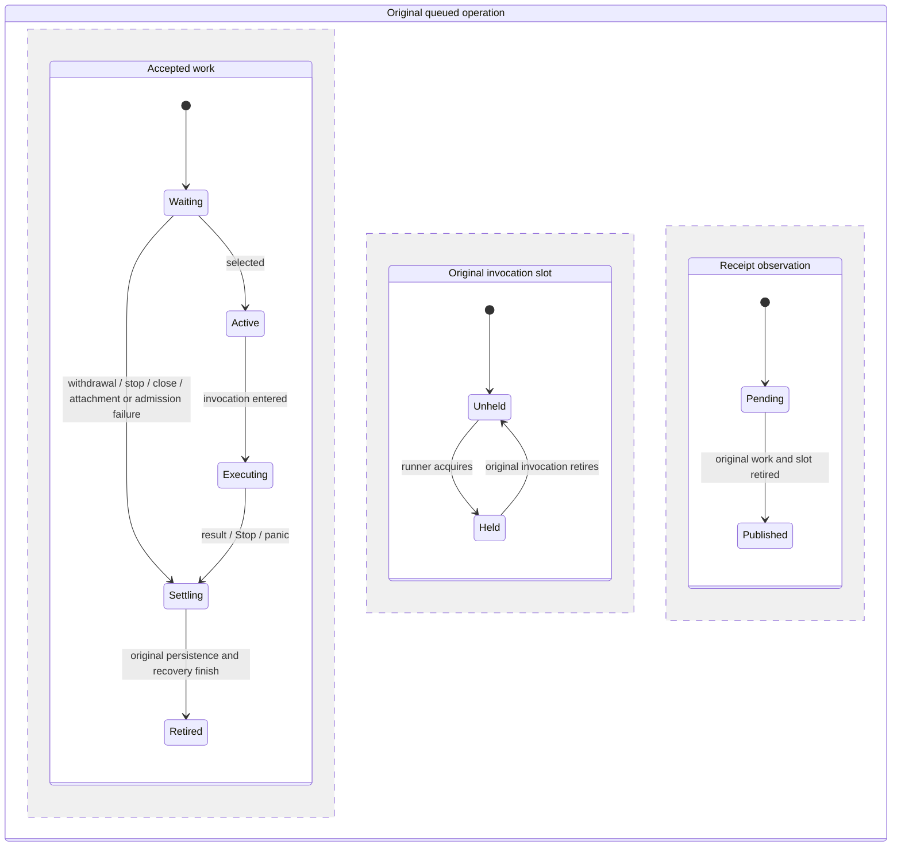

# Queueing and steering

All surfaces should address one Agent owner for a conversation. Agent clones share
one provider attachment, a bounded pending queue, hooks, and a storage lease.
Gateway authorization/routing remains separate integration work.

```text
Agent::enqueue --------> ordinary FIFO --+
Agent::enqueue_steering -> priority FIFO -+-> one invocation -> hooks -> provider
Agent::steer -----------> native injection into active invocation
                          |-> explicitly unconsumed -> priority FIFO
```

Arrows show admission and delivery. Priority work runs before ordinary pending
work, but does not interrupt an already dispatched invocation. Calls are ordered
by admission under the SDK lock, not by timestamps from different devices.

## Operation choices

| Operation | When input runs | Caller stops waiting | Retry contract |
| --- | --- | --- | --- |
| `invoke` | Immediately, or Busy | Admission, execution, and persistence continue once the invocation slot is acquired | No receipt recovery; use `enqueue` when retries are required |
| `enqueue` | FIFO after active work unless explicitly reordered | Admission and accepted work continue | Same submission returns the original receipt/result |
| `enqueue_steering` | Next invocation boundary, ahead of ordinary pending input | Admission and accepted work continue | Same submission returns the original receipt/result |
| `steer` | Native active injection; confirmed unconsumed input enters priority queue | Accepted delivery continues | Same submission returns original delivery/result |
| `remove_queued` | Only while input is pending | Await acknowledgement to know removal completed | Already removed or dispatched returns NotPending |
| `queued_ids` | Current pending dispatch order | Read-only snapshot under the scheduler lock | Refresh before a new order command |
| `reorder_queued` | Replaces the complete pending order within each priority | Accepted command continues | Unchanged order retries any outstanding evidence write |
| `close` | Stops waiting work and cleans up dispatched work | Supervised cleanup continues | Repeated close does not delete or replay history |

Submitted input and actor are saved before dispatch. Queued operations also retain
scheduling evidence and final receipt results. Immediate invocation has no queue
receipt; dropping its waiting future does not cancel SDK-owned work. A never-polled
future has no effects. Close joins settlement independently of whether the caller
still polls its invocation. Losing the wait does not mean input was rejected;
a new ID submits distinct work. Use queued submission for recoverable result receipts.

Live observations require an execution whose provider attempt was actually polled
by this Agent. Queued admission, hook/preparation failure, and explicit provider
admission rejection do not grant that authority. Late observations after a caller
abandons its wait still attach to that previously dispatched execution. A newly
opened manager does not infer live dispatch authority from imported history; the
provider resumes context without replaying old observations. Ordinary output
authority ends at the invocation observation boundary, even without a terminal
event. Later runs reject stale text, thoughts, tools, reviews, or terminal events
for that invocation. Only validated trailing permission cancellation remains
authorized. Before another provider dispatch, Agent drains and validates already-ready
observations using the same limits; buffered invalid output triggers cleanup before
the next input reaches the provider. Valid trailing cancellations are saved first.
If a storage panic interrupted draining, confirmed cleanup drains
already-ready evidence within existing bounds before retiring the owner. Stored queued or
injected records cannot contain their own provider output before dispatch.

## Calling the SDK

```rust,ignore
let first = agent.enqueue(first_request, verified_actor.clone()).await?;
let next = agent.enqueue(next_request, verified_actor.clone()).await?;
// Both are accepted and saved; execution proceeds even if these receipts drop.
let first_outcome = first.wait().await?;
let next_outcome = next.wait().await?;

// Explicitly wait for the next invocation boundary, ahead of ordinary follow-ups.
let correction = agent.enqueue_steering(correction_request, verified_actor).await?;
let outcome = correction.wait().await?;
```

`invoke` remains the immediate operation: overlapping work returns `Busy`. Use
`enqueue` when a busy Agent must accept a follow-up. There are at most 64 pending
inputs, excluding the active invocation. Admission validates capability limits
and the actual 4 MiB UTF-8 message limit independently of token estimates, then
saves exact input, actor, operation, and initial state before returning a receipt.
Admission is supervised once polled: losing the caller during a save does not
interrupt admission. A failed admission is not dispatched. A storage error may
arrive after the snapshot was replaced; the manager reads storage to reconcile
that uncertainty. A confirmed absent input can be retried; an input found in
storage, or whose presence cannot be checked, remains observed and returns
`SubmissionUnresolved` on an identical retry. Later saves preserve that evidence.

## The queue runner and direct invocation

Queued work and direct `invoke` share one invocation slot. `invoke` takes it
without waiting and returns `Busy` if it is held. The queue runner waits for it.
An attachment that completes starts the runner, and the runner loops after each
item, whether or not anything is queued. A runner with nothing queued and no
pending owner exits without taking the slot. That check, `running`,
and admission share the scheduler lock.

The unit tests drive `run_queue` on the test's own task and assert that one
poll leaves it waiting, so none of them depends on the order in which the
runtime polls tasks. Slot hand-over rests on Tokio's `Mutex` granting waiters
in the order they called `lock`.

Tests in the table are named from the crate's test roots. The unit tests are
`application::agent_execution::agents::scheduling::tests` in the library. The
integration test is
`application::agent_execution::agents::review_regressions::scheduled_panics` in
the `application` test binary.

| Runner reaches | Scheduler, read under its lock | Runner does | A direct `invoke` at that moment | Test |
| --- | --- | --- | --- | --- |
| Start | Nothing queued and no pending owner | Clears `running` and exits without the slot | Is not refused as `Busy` by the runner | `scheduling::tests::an_idle_queue_runner_leaves_the_invocation_slot_to_a_direct_invoke`, `scheduled_panics::dispatch_save_panic_does_not_inherit_previous_close_actor` |
| Start | Queued input, while a direct invocation holds the slot | Waits for the slot, then selects under the scheduler lock | The direct invocation already holds the slot | `scheduling::tests::a_runner_whose_queue_empties_while_it_waits_releases_the_slot_and_stops`, `scheduled_panics::dispatch_save_panic_does_not_inherit_previous_close_actor` |
| An admission while no runner is running | `running` is false | Admission starts a new runner under the same lock | Unaffected | `scheduling::tests::an_admission_while_no_runner_is_running_starts_one` |
| Start | An owner left in `pending` with no queue entry, after a cancellation's settlement was cut short, not yet stopped | With nothing else queued, takes the slot, passes over the owner, then clears `running` and exits. The next `cancel_pending` collects owners whether or not they are queued | `Busy` until the runner exits | `scheduling::tests::a_runner_settles_a_stopped_owner_that_is_no_longer_queued`, second runner |
| Start | The same owner, stopped | Takes the slot, releases it before the stopped-owner drain, then retires each stopped permit before publication | The stopped receipt exposes its actual lifecycle refusal rather than the runner's obsolete `Busy` | `scheduling::tests::a_runner_settles_a_stopped_owner_that_is_no_longer_queued`, third runner; `receipt_readiness::stopped_waiting_receipt_exposes_cleanup_refusal_without_runner_busy` |
| The slot, after removal or close emptied the queue while it waited | Nothing queued | Takes the slot, then clears `running` and exits: after a close it releases the empty slot before its closed-lifecycle drain | `Busy` until the runner has been polled: it held the slot for work that existed when it began waiting | `scheduling::tests::a_runner_whose_queue_empties_while_it_waits_releases_the_slot_and_stops` (removal), `scheduling::tests::close_while_a_runner_waits_leaves_it_nothing_to_run_and_both_finish` (close), `scheduling::tests::a_runner_settles_a_stopped_owner_that_is_no_longer_queued`, first runner |

### Original receipt and ownership retirement (#405)

The queue runner releases the original selected invocation slot before publishing
its receipt. `Pending::publish` consumes the original accepted-work permit before
notification; failure drains remove that same owner from the scheduler first.
Panic recovery finishes runner bookkeeping before publishing its selected result.
Preselection stopped work and automatic attachment recovery release the runner's
empty slot before their independently owned receipt settlement. A different live
invocation retains its own slot and can still make a direct invocation `Busy`.

Before this change, the runner could publish a queued item's receipt before
releasing its invocation slot. A direct `invoke` just after the receipt resolved
could therefore return stale `Busy`. The ownership contract and its public
regression cases are listed below.
Tests below are in the public `application` test binary, under
`application::agent_execution::agents::review_regressions::receipt_readiness`.

| Original receipt reaches | Required owner ordering before notification | Direct invocation at notification | Public regression |
| --- | --- | --- | --- |
| Normal selected completion, ordinary or boundary steering | Its existing persistence and recovery return, then its invocation slot and accepted-work permit retire | Admitted if no independent invocation owns the slot | `completed_queue_receipt_admits_immediate_invocation_without_stale_busy` |
| Completed selected work whose provider required cleanup | Existing physical cleanup confirms; original accepted-work permit retires so the lifecycle can apply its recovery policy | `AttachmentUnavailable(Absent)` for the retired attachment; public automatic recovery admits subsequent work | `completed_queue_receipt_retires_work_after_confirmed_attachment_cleanup` |
| Selection, dispatch-save or terminal-save panic | Existing recovery retains the panic error; terminal-save failure also retains `Completed` in `ExecutionObservation`. Runner bookkeeping finishes; original slot and work retire | `Closed` from the actual lifecycle fence; explicit recovery admits subsequent work | `panicked_queue_receipt_exposes_actual_refusal_after_original_retirement` |
| Stopped waiting work before selection | The runner owns no selected invocation; its empty slot retires before the existing stopped-owner drain, and each original permit retires before its own notification | `Closed` from unconfirmed cleanup, without an obsolete runner `Busy` | `stopped_waiting_receipt_exposes_cleanup_refusal_without_runner_busy` |
| Waiting work after failed automatic attachment | Runner releases its empty invocation slot before starting the independently owned attachment; each failed waiting permit retires before publication inside that producer | Exact `AttachmentUnavailable(Failed(Provider))`; no replacement execution | `failed_automatic_attachment_receipt_exposes_exact_attachment_refusal` |
| Failed selected invocation cancels its waiting tail | Each tail receipt retires only its own permit; the selected original retains its terminal-persistence owner | `Busy` from that independent selected invocation | `failed_invocation_tail_receipt_preserves_independent_settlement_busy` |
| Caller withdraws waiting work during a direct invocation | Original withdrawal evidence and permit retire; independent direct invocation retains its slot | `Busy` from the actual direct provider work; exact withdrawal caller retained | `withdrawn_receipt_preserves_busy_from_independent_active_invocation` |

This chart describes existing owners and their implemented coordination. `Retired`
means the original work permit is dropped, not a new runtime flag. The slot region
names that original operation's ownership; a distinct invocation can own the
shared mutex independently. Attachment startup, retained cleanup resources and
`Open`/`Stopping`/`Blocked` admission remain owned by `SessionLifecycle`.



Receipt settlement does not confirm provider cleanup or universal Agent readiness.
Tail cancellation, withdrawal, explicit close, admission failure and steering
failure may still overlap an independently owned invocation, control or cleanup.
Live submission retries join the same receipt notification; restored results have
no live original worker. The public notification tests poll only a separately
owned next invocation in the consumer's wake callback, never the original receipt
while its watch publication might retain a lock. Each receipt poll keeps that
consumer registered and forwards notifications to the actual waiting task;
awaiting the raw receipt separately would replace the registered consumer.

## Receipt notification faults

A receipt's waiter is caller code: its `Waker` runs on whichever task
publishes the result. How a panic from it is contained, and its tests, are in
[Caller wakers](lifecycle.md#caller-wakers).

## Idempotent submission retries

Retry `enqueue`, `enqueue_steering`, or `steer` with the same execution ID, exact
request, verified actor, and operation. The SDK joins the original live receipt or
returns the retained delivery/result. Concurrent retries do not repeat admission,
hooks, or provider dispatch. This also works after withdrawal or failure: retries
recover the original outcome, rather than creating new work. Native steering
retries recover the injection acknowledgement or error without injecting again.

Changing content, token budgets, attribution, or operation while retaining an ID
returns `SubmissionConflict` for that call; it does not stop the Agent or its
existing work. Keep the original ID and action context when retrying
one logical submission; a new ID deliberately creates a new submission. There is
no content-based deduplication, since sending the same message twice can be intentional.

After Agent reconstruction, confirmed saved settlement or injection can be
recovered. A `Settled` scheduling record requires a retained result on built-in
save/load and custom-storage restoration. `ExecutionSettled` additionally requires
an exact outcome in local, provider, or terminal-observation evidence.
`ExecutionFailed` records a failed attempt without a known outcome; a failed
admission write remains `DispatchFailed`. The domain chooses the cause from retained
facts for normal completion and panic recovery. Repeated result writes cannot
change one success into another or turn failure into success.
A dispatched invocation with a recorded `Cancelled` transition can retain local
`Cancelled` alongside a different eventual provider outcome: local cancellation
does not prove the provider stopped. The causal cancellation edge must precede
recording those differing facts. Inputs cancelled before dispatch still reject
provider evidence. Audit, cleanup, and provider failures require a failed local
result even when a local cancellation outcome is retained separately.
Running evidence with an already-saved result recovers that outcome even if
the final scheduling transition was not saved. Pending/running evidence with no
recorded result and no live owner returns `SubmissionUnresolved`; the SDK never risks replaying delivery that may already
have happened. Late receipt errors are retained for subsequent snapshot saves; if
storage remains unavailable through a crash, only the last persisted evidence can
be recovered, not an error response that never reached storage. No manual snapshot
inspection is required before retrying. This contract covers scheduled admission and steering; immediate `invoke` remains a
supervised operation without receipt recovery.

## Native steering

Read `agent.operation_capabilities().native_steering` to discover negotiated
support. This is a support snapshot, not a guarantee that the target is still
active; [operation capabilities](agent.md#model-capabilities-and-provider-operations)
are refreshed during restoration.

`steer(request, actor)` attempts the provider's native steering operation when an
invocation is active. `SteeringDelivery::Injected { target, evidence }` means the provider
acknowledged the additional input for that execution. Its `SteeringEvidence`
separately reports whether mandatory audit and durable delivery evidence were
acknowledged; an evidence failure does not erase the known provider acknowledgement.
Output and settlement remain
correlated with the original execution. The steering input has its own retained
identity, actor, and delivery record; injection is not an independent completed
invocation or proof of tool effects.

With no active invocation, or an explicit `PromptRequired` acknowledgement that
the input was not consumed, delivery becomes `SteeringDelivery::Queued(receipt)`
at the next priority boundary. Unsupported steering returns `Unsupported`; choose
`enqueue_steering` explicitly for a provider-independent boundary operation.
Timeouts, transport failures, and malformed replies are never converted to a new
prompt because delivery may already have happened. Ambiguous steering or evidence
failure stops waiting work with a retained `RunnerStopped` reason.

The ACP adapter negotiates native steering support during initialization and uses
`_session/steering` with host-owned idle delivery. Detached provider-started turns
are rejected. One five-second deadline covers checking ready updates, writing,
and response delivery; cancellation/close remains available. Queue admission stays in the SDK and normal prompts dispatch
at invocation boundaries, preserving the current single-execution event mapping.
A provider's internal prompt queue does not imply portable queue inspection,
editing, or per-input event correlation.

## Removing waiting input

Call `remove_queued(execution_id, verified_actor).await` for ordinary queued input
or boundary steering. `QueueRemoval::Removed` means it was withdrawn before
dispatch. Its receipt returns `Closed`, and history retains the original input,
`Withdrawn` cause, principal, surface, and action request ID. Persistence failure
still prevents dispatch and reports the storage failure to both callers. A
further failure while retaining the receipt can wrap it in `StorageAfterExecution`;
neither result authorizes dispatch of the withdrawn input.

`NotPending` means the input is unknown, already withdrawn, dispatched, or injected;
no external work was undone. Removal and dispatch share one admission lock, so
only one wins. Removing a waiting input never cancels the active invocation.

A separate queue-edit API is not implemented. To change waiting input, remove it,
then submit the revised draft with a new execution ID after `Removed` is confirmed.
The replacement enters normal queue order; it does not preserve the old position.
If removal returns `NotPending`, refresh the UI because dispatch may have started;
do not treat that as confirmation that the original input was withdrawn.

Withdrawal retains ownership of its original receipt through persistence and
cleanup, including a storage panic before or after commit. The saved `Withdrawn`
cause and caller attribution remain available, and submission retry recovers the
same result without dispatching removed work. A failed withdrawal save is reported
as a failure; it does not imply that the input remains queued.

## Hooks and lifecycle

Every dispatched queued invocation uses the normal before/after invocation hooks.
A before-hook rejection prevents dispatch and skips after hooks, as for `invoke`.
Native injection does not start a second invocation hook pair. Optional callbacks
are extension points; mandatory ordering and persistence remain scheduler rules.

Dropping a receipt or a surface subscriber does not stop accepted work. Queue
workers retain the Agent until admitted work settles or is cancelled. Keep its
Tokio runtime alive and await `Agent::close(actor)` before shutdown. Concurrent
close calls and retries retain the first shutdown cause and actor. If automatic
cleanup already owns shutdown, queued inputs retain `RunnerStopped` without
caller attribution even when a later explicit close joins. After cleanup and the
prior stop finish, a new close owns cancellation of newly queued input; it may
reuse confirmed provider cleanup without inheriting the old queue-stop actor. Closing
cancels waiting inputs using the first shutdown request, stops the current provider
attachment, and preserves available provider settlement. A later explicit input
may resume the same context after confirmed cleanup. A failed close keeps
admission unavailable until an explicit close succeeds. Close itself is supervised once polled.

Queued execution and native steering retain their SDK-owned task through provider
polling and scheduling persistence. A first task panic after admission stops new
admission, joins provider cleanup, preserves any known outcome or injection edge,
and settles recoverable receipts with the failure. Pending cancellation keeps its
owners until evidence and receipts settle, including when its first save panics.
An explicit successful close is required before admitting new work after this
recovery. Reusing an earlier confirmed provider cleanup does not reuse an old
actor for new local queue cancellations.

A save-task panic during admission has a different boundary: provider dispatch has
not started. The execution ID remains reserved as unresolved admission evidence;
retrying it does not send another input. A repeated panic during cleanup or recovery
persistence, a panic from a destructor, and destruction of the owning runtime are
outside task recovery guarantees. Ordinary returned cleanup and storage errors
remain reported and retain their existing ownership barriers.

Any queued invocation error stops the remaining queue conservatively; inputs are
not silently retried after hook, provider, or storage failure. Local cancellation
records preserve before/after stages, kind, target, cause, and known initiator.
Each edge is stored inside the affected invocation record, whose request carries
its execution ID. A `RunnerStopped` edge means the local runner stopped; the
triggering invocation retains the detailed error in its result. It is distinct
from provider-context closure, whose audit record carries the deadline, provider,
or cleanup cause. Explicit `SessionClosed` queue cancellation requires the caller.
Immediate inputs stopped before provider dispatch also retain cancellation evidence.
An explicit close records its caller; an automatic lifecycle stop records
`RunnerStopped` without inventing a caller. The stop must occur after that input's
admission: old cleanup cannot become the cause of a new input's hook failure.
Each affected work owner retains its first stop cause even if a later explicit
close arrives before evidence is saved. Recoverable provider cleanup stops active
work but preserves waiting inputs for restoration at the next invocation boundary.
Explicit close cancels waiting inputs; a failed queued invocation also cancels the
remaining queue. A hook failure retains its original error alongside any known
pre-dispatch stop.
The SDK keeps this evidence through caller loss and cancellation-save failures.
Storage failures are returned even while necessary cleanup proceeds. The separate
`ExecutionAudit` port owns provider lifecycle and permission evidence.

Snapshots retain pending/unresolved work after a runtime or process interruption;
reconstruction never automatically replays it. This is not a durable job service
or a guarantee of background execution after the host exits.

## Review and regression evidence

- [Domain ordering and bounds](../../tests/domain/agent_execution/scheduling.rs).
- [Application concurrency and evidence](../../tests/application/agent_execution/scheduling.rs).
- [Idempotent retries and receipt failures](../../tests/application/agent_execution/scheduling/retries.rs).
- [ACP native steering](../../tests/infrastructure/acp/contracts/steering.rs).
- [Storage mapping](../../src/infrastructure/session_storage/snapshot/scheduling.rs).

Tests use deterministic gates and test-only ACP handlers, without model calls.

Scheduling history validation belongs to the domain: `SchedulingTransition::validate_history`
requires admission first, continuous prior/resulting stages, and stable invocation
kind and attempted steering target. The application maps boundary records into
these values before appending observed evidence; memory and file adapters use the
same domain validator when accepting or restoring snapshots. A valid individual
transition alone does not establish a valid history.

## Validation at lifecycle boundaries

Direct and wrapped cleanup-uncertainty errors block new dispatch until cleanup is
confirmed. Failure cleanup closes admission before awaiting the provider. Native
steering rechecks its target after saving admission, so a close that overtakes
that save cannot send input to the closed context.

The SDK retains the first terminal observation and rejects duplicates or later
provider output. An exactly correlated permission cancellation may follow it to
record cleanup. A successful settlement must agree with the terminal observation.
These checks also run when restoring snapshots through custom storage adapters;
invalid saved histories are rejected before opening a provider.

Execution identities are validated domain values with a 256-byte UTF-8 limit.
`ExecutionId::new` rejects oversized input before any invocation, queue, or steering
request can be formed, copied into admission state, or persisted. The same
constructor validates restored execution identities; oversized saved identities
are corrupt history, not an alternate compatibility format.

## Changing pending order

Read `Agent::queued_ids()`, then pass the complete desired ID list and verified
`ActionContext` to `Agent::reorder_queued`. Inputs keep their original IDs, text,
receipts and priority. Steering always stays ahead of ordinary work. Changed membership
returns `QueueChanged`; crossing the priority boundary returns `PriorityConflict`.
If membership is unchanged, the latest accepted desired order wins, even if another
surface reordered the same members first. Both decisions retain their before/after evidence.
Duplicate or oversized lists are rejected before mutation. At most 64 inputs wait.

Reorders serialize with each other while the scheduler stays available to
dispatch, cancellation and close during audit I/O. A changed order is sent to the
mandatory audit port before the scheduler's admission lock is taken; audit
rejection leaves both live and saved order unchanged. The scheduler is then held
across replacement and its save, under one shared 30-second budget so those two
waits cannot compose into a longer block. Replacing the live order and retaining
that change in session history is one transition: the wait for evidence ownership
happens before either effect, so a close or that bounded wait can only leave both
unchanged, never a live order that retained history cannot replay. A close before
retention reports Closed rather than a storage fault. Writing that retained
history to storage is separate and remains interruptible. The record retains the
complete before/after order, immutable priorities, session, caller, and
`CallerRequested` cause. It records the selected local decision; the session
snapshot remains authoritative for subsequent application and persistence. Caller
loss cannot abandon the admitted transaction. An audited request whose retention
is interrupted leaves no order change; the audit records the decision, not a
completed effect.
`Applied` and `Unchanged` acknowledge persistence. A storage error can leave the new live order
applied because a write may already have committed. Refresh the queue after an
uncertain result. An unchanged retry flushes retained evidence; later dispatch
also saves it before provider work. No-op commands do not consume the separate
1,024-change history budget. Exhausting that budget leaves the queue unchanged;
admission, selection and cleanup still have their own structural audit allowance.

Snapshots retain a compact global queue history: admission, local selection,
withdrawal/stop, reordering and restoration. Each reorder records full before and
after order plus its caller. Single-input entries keep the scheduling checkpoint
and caller needed to check their cause. A local selection is saved before another
command can reorder the remaining queue; it does not claim provider dispatch.
Restoration replays these facts for validation, checks every complete before-state,
and rejects contradictory priorities, omitted members or repeated selection.
The new owner records clearing retained pending membership instead of replaying
old input. Record storage commits changed queue-history facts with their related
lifecycle decisions; the fold rejects rewriting earlier queue facts.
