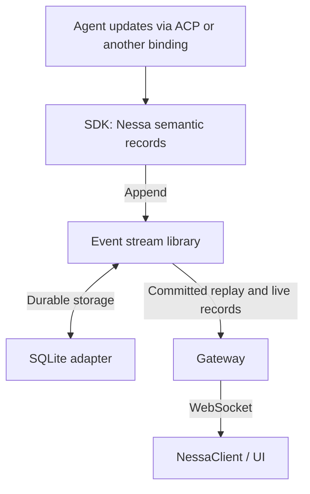

# Architecture

The map of this repository: what the pieces are, where a change goes, and what
must stay true. Read this before your first change. Update it in the same change
that invalidates it.

For *how* to think about extending it, see the `system-architect` skill
(`.claude/skills/system-architect/`). For the rules applied to this repo, see
[codebase-structure.md](codebase-structure.md).

## The problem

Nessa is a floating chat panel. On macOS it is a menu bar extra: a transparent
surface summoned from the tray or a global shortcut, with no Dock icon and no
titlebar. On Linux it is the same panel, reachable from the system tray when
the desktop provides one and from the taskbar otherwise — there is no menu bar
to hang from, and a hidden window with no taskbar entry would be undiscoverable.

The two hard parts are **the window** — placing, sizing, and re-fitting a
chromeless panel across displays without the page's contents jittering during a
resize, with a frost that can be turned off — and **the conversation surface**
— a turn list with an `idle → thinking → streaming` lifecycle that a real agent
runtime will eventually drive. Today send uses a temporary `conversation.echo`
RPC (your text comes back as the assistant reply) until real turn RPCs land.

## Code map

**Rust host** (`src-tauri/src/`) — everything that is the operating system's
opinion rather than the product's.

| File | Owns |
| --- | --- |
| `main.rs` | The composition root. Builds the app, wires the tray, shortcut, and window. It never mentions macOS or Linux: OS behaviour is injected through `platform::current()`. |
| `host.rs` | The host/shell seam: event names and the `PanelSize` payload. The frontend lists the same names in `src/host/window.ts`; a test fails if they drift. |
| `panel.rs` | The panel frame: opening size, lower-right placement, show/hide. The tray and the shortcut request a toggle; they do not fit the frame. |
| `tray.rs` | The menu bar extra (macOS) or StatusNotifierItem (Linux), and the surface-toggle request. Creating it is survivable: a desktop with no tray still launches. |
| `shortcut.rs` | Registers / re-registers the global `panel.summon` accelerator from the shortcuts cache. |
| `shortcuts.rs` | Stage-scoped `shortcuts.json` cache: seed from bundled protocol defaults. |
| `settings.rs` | The on-disk settings shape (panel geometry) and its defaults. Summon is not here — see `shortcuts.rs`. |
| `platform/` | The OS host. `Host` is the contract; `current()` injects one implementation for the compiled target. Commands `set_frosted` and `panel_size` live here too. |
| `platform/macos/` | Accessory app, `NSVisualEffectView` frost, WKWebView pin, AppKit live-resize notifications. The panel stays open when focus moves to another app and joins all desktop Spaces, with fullscreen auxiliary behavior enabled. |
| `platform/linux/` | WebKit DMA-BUF prep, GtkFixed pin, CSS frost (no-op natively), allocate-based live resize, shown on the taskbar at launch. |
| `platform/other/` | Webview fills the window; size events only. |

**Launch** ([justfile](../justfile)) — `just server` / `just dev` / `just web` / `just release fast` / `just release`. Bundle names and Linux WebKit/GTK checks live in the justfile, not a second host layer. Windows recipes are written, not yet run on a Windows box.

**React shell** (`src/`) — everything that is on screen.

| Path | Owns |
| --- | --- |
| `main.tsx`, `store.ts` | Composition root. Mounts the panel, the session lifecycle, and product projections. |
| `conversation/` | The conversation vertical. See the table below. |
| `session/` | Wire session to `nessa-server` via `@nessa/client` (S1: connect + health + dev-only ping). |
| `panel/` | The floating-window chrome. See the table below. |
| `host/` | Injected host features and the window seam (`window.ts`). |

**Conversation vertical** (`src/conversation/`) — one feature, independently testable.

| Path | Owns |
| --- | --- |
| `model/` | Shared language: `Conversation`, `Turn`, `ConversationTabs` (`conversations` + `activeId`). Discriminated turns and phases. No id mill. |
| `application/local-tabs.ts` | UI-session store shape: the shared tabs plus local id counters. A remote gateway mints its own ids and this type goes away. |
| `application/usecases/` | One file per command. Session: draft, active tab, open, close. Send/stop are no-ops until chat RPCs exist. |
| `application/ports.ts` | `ConversationGateway` — what the panel may ask the product to do. |
| `adapters/gateway/local.ts` | In-process UI-session gateway. Tomorrow this is the remote gateway. |
| `adapters/store/` | Redux projection. Reducers call the gateway; they do not contain rules. |
| `ui/` | Transcript, thinking pill, `useConversation`. Paints and dispatches. |
| `model/identity.ts` | The agent's name, seed, and hue wheel. |

**Session vertical** (`src/session/`) — WebSocket control-plane connection.

| Path | Owns |
| --- | --- |
| `model/` | `SessionPhase`, status copy for the empty state. |
| `adapters/client/` | `connectDevSession` (native credential loading, authenticated session, health; closes on probe failure) + injected session handle (live client outside Redux). |
| `adapters/store/` | Redux projection of connection status (`hello` / `health` only). |
| `adapters/lifecycle/` | Mount/reconnect effect, owned by the composition root. Subscribes `onClose` before publishing ready. |
| `ui/use-session.ts` | Hook the panel reads for status. |

Chat adapters must use `getSessionClient()` from the session barrel — do not open a second socket, and do not put `NessaClient` in Redux.

**Panel vertical** (`src/panel/`) — the floating window, not the product.

| Path | Owns |
| --- | --- |
| `model/` | `Surface` — frosted or clear. |
| `adapters/` | Host subscriptions: colour scheme, edge reveal, panel frame, frost, remembered surface, compositor flush, config-driven tab shortcuts. |
| `ui/app.tsx` | The chrome: stage, glow, resize handle, tab strip, composer. Renders; no effects. |
| `ui/waveform-icon.tsx` | The voice glyph in the composer. |

## Boundaries

Three, and they are all real:

**Host ↔ shell.** They talk over exactly one seam (`src/host/window.ts` on one side,
`host.rs` plus the command handlers on the other). Everything crossing it is an
explicit command or event, never shared state. This is what lets `pnpm dev`
open the UI in a browser with no host at all.

**Product store ↔ host subscriptions.** Conversation state is Redux, so an
agent can dispatch it. Window, pointer, frost, and clocks stay in hooks.
They do not belong in the store, and the store does not import the chrome.

**Owner of a preference.** State has one owner and one direction. The surface
choice is owned by the frontend and reflected into the tray's check mark; the
tray requests, it does not decide. New preferences point the same way, or they
get an ADR explaining why not.

## Invariants

Things that must stay true. They are invisible in the code, which is why they
are written here.

- `main.rs` is the app composition root. OS-specific hosts are injected by
  `platform::current()` — one `Host` for the compiled target. Shared modules
  never name macOS or Linux.
- The panel frame is reapplied on every show. Nothing may cache a frame across
  shows — that is the bug this design exists to prevent.
- The page's viewport does not move during a resize. The webview is pinned; the
  window moves over it; the shell is told the window's size.
- The window seam is guarded. Any new host call goes through `src/host/window.ts`
  and no-ops outside Tauri, or the browser workflow breaks silently.
- A settings file missing keys still launches. Any new key has a default.
- Failures at the edges — blur, sizing, tray, viewport — are reported and
  survivable, not fatal. The panel opening unblurred, or without a tray, beats
  the panel not opening.
- Linux is a first-class host. The panel is reachable without a menu bar: the
  taskbar is on, the window opens on launch, and close quits if there is no tray.
- On Linux the webview's grandparent is the GtkWindow. An extra widget in
  between panics inside a GTK callback and aborts the process.
- A component either renders or coordinates, never both.
- There is no `utils` module, on either side.
- Product state an agent must drive lives in the Redux store. Host, DOM, and clocks stay in adapters. See [adr/0001-redux-toolkit-for-product-state.md](adr/done/0001-redux-toolkit-for-product-state.md) and [adr/0003-panel-vertical.md](adr/done/0003-panel-vertical.md).

## Cross-cutting

- **Failure policy:** edge failures degrade the surface, they do not stop the
  launch. Log with the `[nessa]` prefix and continue.
- **Platform code** lives in `platform/{macos,linux,other}` (Rust) and
  `src/host/{macos,linux,browser,other}.ts` (shell), injected through `Host` /
  `HostFeatures`. Shared modules do not contain `cfg(target_os)` or
  `hostKind ===` branches.
- **Nothing in the shell reaches the OS directly.** It goes through the seam.
- **Frost:** native `NSVisualEffectView` on macOS; CSS `backdrop-filter` on
  Linux and in the browser. The macOS CSS path is the one that smears.

## Where to make a change

| You want to change | Go to |
| --- | --- |
| Where or how big the panel appears | `panel.rs` (`frame_on`, `apply_configured_size`) |
| What the tray menu offers | `tray.rs`, plus the frontend if it owns the state |
| The summon shortcut | `settings.rs` for the key, `shortcut.rs` for registration |
| A new persisted preference | `settings.rs` (with a default), then its owner |
| A new host event or payload | `host.rs` and `src/host/window.ts` together |
| Leftover transcript tiles on a layout compositor | `flush_compositor` in `platform/` plus `useFlushOnTurn` in `src/panel/adapters/` |
| The conversation surface (tabs, drafts, empty transcript) | `src/conversation/application/usecases/` (commands), `adapters/gateway/` (local session), `adapters/store/` (projection) |
| The transcript chrome | `src/conversation/ui/` |
| The panel chrome or composer | `src/panel/ui/app.tsx` |
| Resize jitter, the pinned webview | `platform/{macos,linux,other}/viewport.rs` |
| Native frost | `platform/macos/vibrancy.rs` |
| The border glow | `src/panel/adapters/edge-reveal.ts`, and `platform/*/live_resize.rs` |
| OS-specific window behaviour | `platform/` — add a method on `Host`, implement it in the OS folder |
| Shell behaviour that differs per OS | `src/host/` — add a field on `HostFeatures`, set it on each host |
| Anything that talks to the host | `src/host/window.ts` — and only there |
| The agent runtime, when it lands | A new context; see *Growing a new context* in [codebase-structure.md](codebase-structure.md) |

## What is deliberately not here yet

**Implemented SDK foundation:** `crates/nessa-sdk` contains the model metadata
catalog: JSON data for the current OpenAI and Claude general-purpose models,
typed loading/validation, listing, and exact provider/model selection. Pure domain
entities and value objects own invariants; application use cases map DTOs and
query the catalog; infrastructure parses JSON. Host
composition supplies a reader and owns the resulting immutable snapshot. The
[SDK guide](../crates/nessa-sdk/README.md) shows how to inspect it. The server and
UI do not consume this catalog yet. Immutable effective capabilities now combine
model facts with typed binding restrictions and configured limits, validate input
requirements locally, and expose application DTO projections. The local Claude
ACP binding uses reusable `domain/agent_execution` value objects and entities for
messages, scoped tool observations, and permission resolution, behind application-owned
execution ports. It provides typed streaming and
file-tool permissions, and Stop with restricted Unix process supervision. Its
[guide](../crates/nessa-sdk/docs/claude-acp.md) records the supported profile and
macOS live checks. Harness settings readers remain future work.

There is no Conversation coordinator, no chat RPCs, no persistence for conversations, no
settings UI. The panel already opens a `stage=dev` `@nessa/client` session for
connect/health. When chat arrives it is a remote `ConversationGateway`, not an
addition to the local session adapter. See
[adr/0002-conversation-vertical-and-gateway.md](adr/done/0002-conversation-vertical-and-gateway.md).

**Proposed direction for agent turns:** [ADR 0008](adr/todo/0008-agent-client-api.md)
adds a reusable Rust `nessa-sdk` library inside the server. One coordinator owns
each conversation's commands and state. A configured Claude ACP binding connects
it to the agent. The existing NessaClient sends commands and receives saved
records over one WebSocket.

[ADR 0009](adr/todo/0009-reusable-event-stream-crate.md) connects the external
stream library and local SQLite. Together they provide one saved history for
conversation state and command receipts. The gateway delivers records from that
history after they are saved, so live views and replay agree.

The [runtime class supplement](design/agent-runtime-classes-and-sequences.md)
shows the proposed DDD split: Conversation aggregate for invariants, application
coordinator for effects, immutable EffectiveCapabilities built from startup-parsed
model metadata JSON and declared binding/configuration facts, and host/provider
adapters. Commands validate the snapshot locally; the model catalog is plain data. The host authorizes resource
actions before SDK access; Conversation owns lifecycle rules.
[Domain events](design/agent-runtime-classes-and-sequences.md#domain-events-and-durable-records)
are mapped to committed semantic records before state is applied or effects run.
Replay rebuilds state without executing agents or tools.
[ADR 0008](adr/todo/0008-agent-client-api.md#one-canonical-turn-state) owns the sole
turn-state definition. Health observations and resource readiness do not create
another turn lifecycle.

Each kind of state has one owner:

| Concern | Owner |
| --- | --- |
| Accept turns/input, resolve interactions, change turn state, and build receipt lookups | SDK conversation coordinator |
| Save/order records, assign cursors, replay then deliver live updates, and own storage | One configured stream runtime per durable store |
| Identify callers and check product permissions | Existing auth application, used through gateway/SDK application interfaces |
| Resolve resources, translate wire messages, and deliver allowed data within limits | Gateway adapters |
| Recover a connection | Each separately configured NessaClient instance |
| Build transcript/control state from records and track the last applied cursor | One conversation view owner per client scope |
| Run the model and tools | External harness through its supported binding |
| Stop work and clean up owned processes | SDK/binding using injected host facilities; keep the binding unavailable if cleanup is uncertain |
| Translate tool arguments and results | Optional MCP/CLI adapters calling NessaClient |

[ADR 0011](adr/todo/0011-nessa-session-protocol-and-authorities.md) phase A lets
clients open a shared view by reading and subscribing. It needs no saved
attachment lease. Phase B adds messages waiting for a future turn to the same SDK
coordinator and history. Receiving a message does not automatically start work.

Waiting for a provider, tool, or socket must not block Stop and approval commands.
Reading history, reconnecting, and removing optional tools never silently start
or stop a turn.

Build the required 0009 adapter/store integration first. Then deliver the complete
0008 + 0011 phase A conversation. After that, phase B collaboration and
[0012's](adr/todo/0012-agent-harnesses-and-optional-tools.md) initial stdio read tools
can ship independently. A tool wraps an operation that already works; it cannot
be required to implement that operation. More providers, HTTP MCP, a CLI adapter,
remote pairing/navigation, and a Nessa-owned agent loop are deferred.

The [contract design](design/session-and-stream-contracts.md),
[collaboration rules](design/surfaces-and-collaboration.md), and
[sequences](design/collaboration-sequences-and-mcp.md) explain these proposed
boundaries in more detail. [ADR 0007](adr/done/0007-authentication-delivery.md)
records completed local auth coverage and measured limits. The proposed runtime
and collaboration features are not implemented yet.

**Identity/access contracts** (`crates/nessa-auth`) — reusable library, no binary.
Owns domain identities/memberships/credential metadata, boundary DTO validation,
and injected session authentication contracts. Embedded Cedar evaluates product policies through the application port. The local credential backend and guarded `/session` gateway are implemented.
See [local authentication](adr/done/0010-local-authentication.md) for setup and current limits. See the [crate guide](../crates/nessa-auth/README.md).

## Why append semantic records to the stream?

In the proposed agent runtime, a **semantic record** describes something that
happened in Nessa: a turn was accepted, text was added, a tool finished, or a turn
completed. The binding translates provider updates into Nessa's own types. The
SDK appends those records along with its decisions about turn state. Clients can
understand the history without knowing which provider produced it.

Save each record before delivering it. Live updates, reconnects, and rebuilt
conversation state then use the same committed history (records the store confirms
it saved). A client that last applied record 42 can replay records 43 onward,
then continue live without rerunning the agent. The stream and SQLite adapter are
libraries inside the server process.

SQLite stores the records. The stream library adds record ordering, cursors
(bookmarks in history), safe append retries, and replay followed by live updates.
We would otherwise need to build that behavior on database tables ourselves.
Building conversation state and command-receipt lookups from this history also
avoids separate writes drifting apart. Authentication and settings keep their
existing storage. [ADR 0008](adr/todo/0008-agent-client-api.md) defines record
meaning; [ADR 0009](adr/todo/0009-reusable-event-stream-crate.md) defines the storage
and delivery guarantees that still need to be verified.

## Gateway authorization

The running gateway mounts one authenticated product flow on `/session`. Each request checks current credential validity and membership;
product operations additionally require embedded Cedar approval for the action
on the server-resolved gateway resource at operation admission. Admitted handlers
and responses may finish after revocation; later operations read the latest
committed state. Only auth mutations serialize; network writes share no admission mutex. The HTTP `/health` probe returns
only liveness, without product state.

The panel authenticates using its distinct private surface credential loaded by
the native host. The SDK supports injected credential storage and a Node file
source. Composition loads namespace `config.json` and injects registry limits
and session deadlines. Use the
[local SDK/CLI guide](guides/local-auth.md) for gateway access and the
[adversarial review](reviews/local-auth-gateway.md) for validation and limits.
