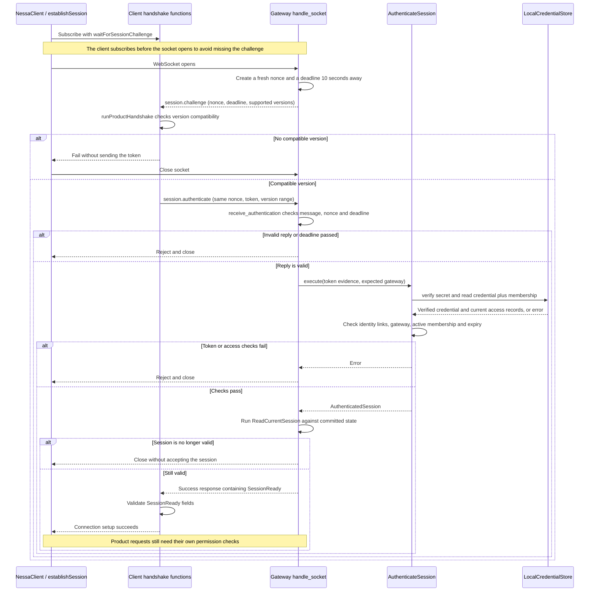
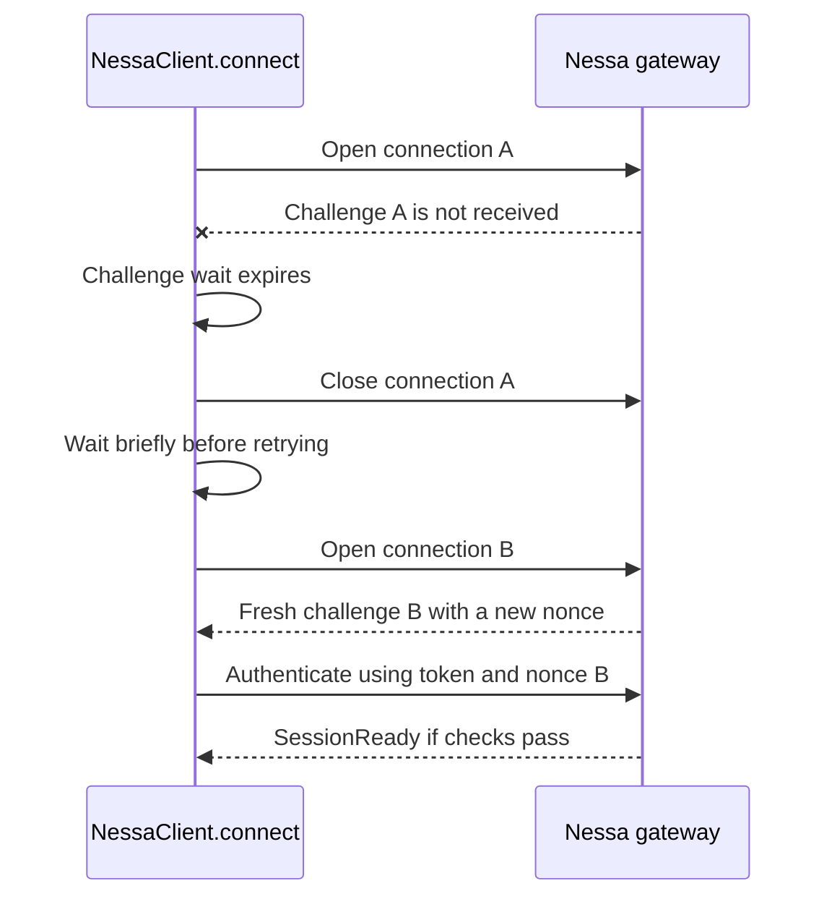
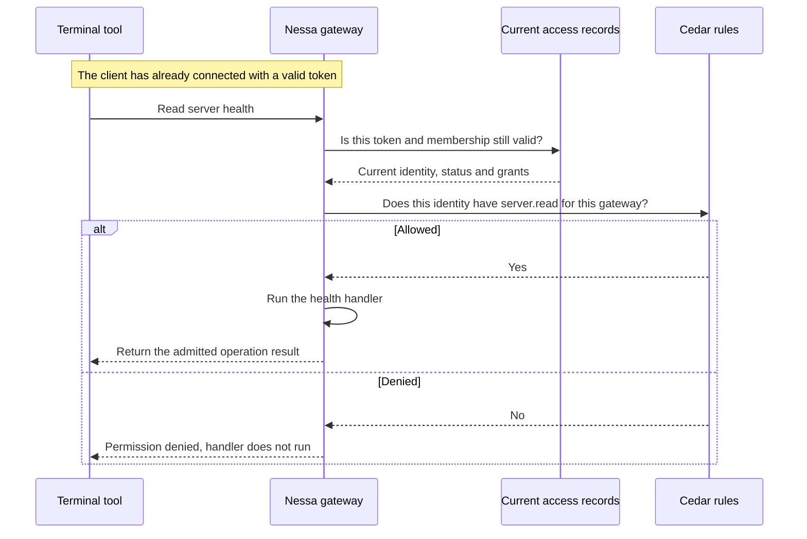
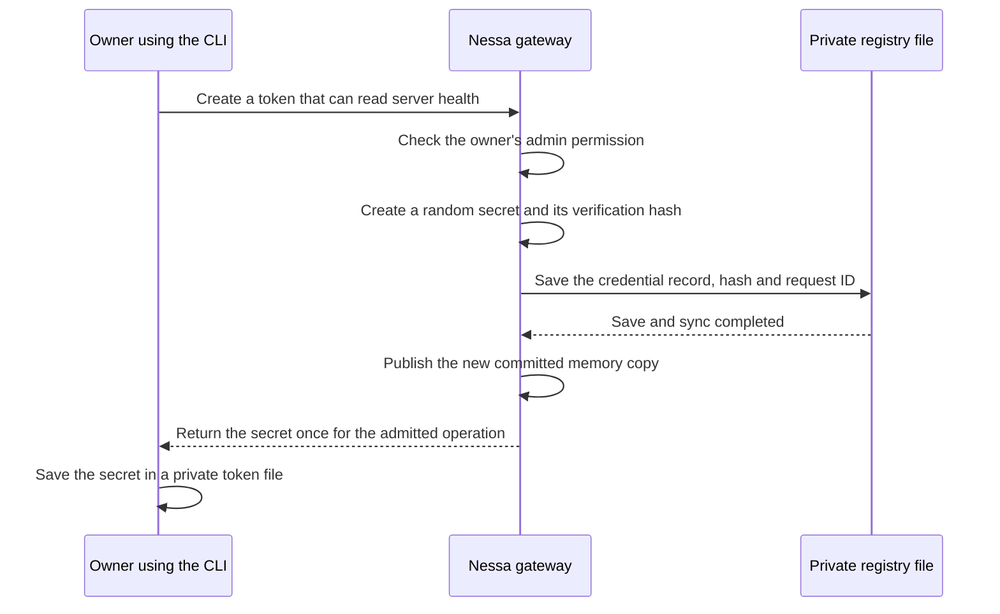
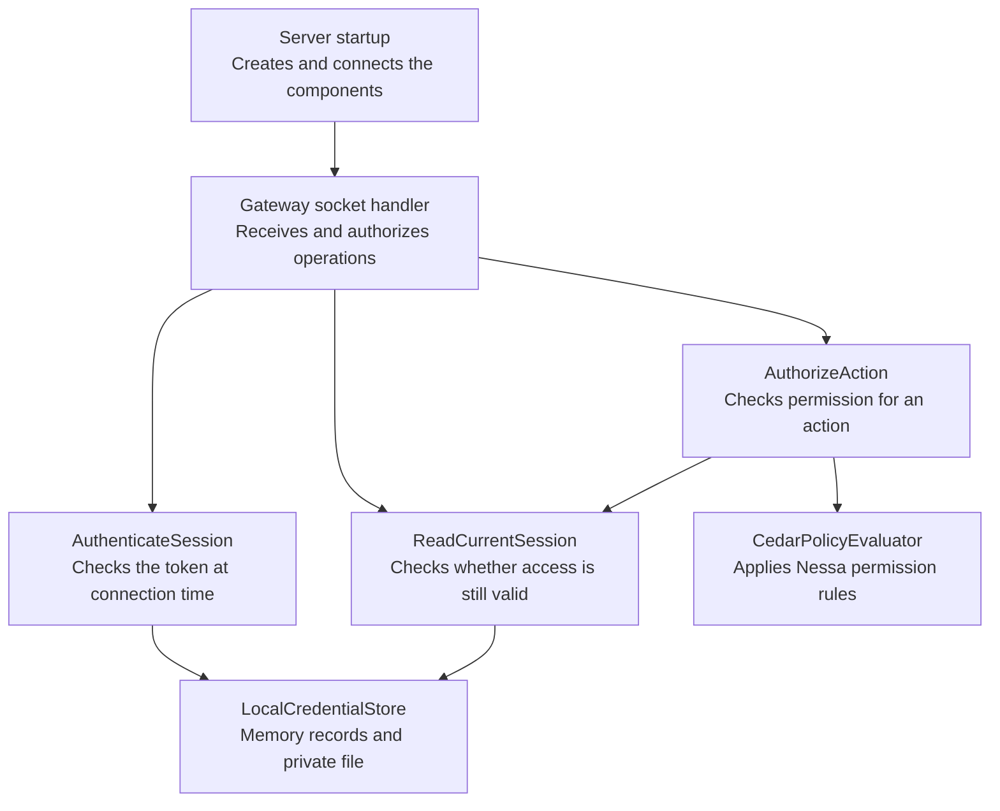

# 0010. Local authentication and gateway authorization

- **Date:** 2026-09-06
- **Status:** accepted and implemented for the local library, gateway, SDK, and command-line tool.
- **Part of:** [ADR 0007 — session protocol](../todo/0007-nessa-session-protocol-and-authorities.md).
- **Still to do:** [ADR 0011 — remaining local auth workflows](../todo/0011-authentication-delivery.md).

## What we decided

Every client must present a valid secret token before it can use the Nessa gateway.
The gateway is the server that receives client requests. After checking the token,
it checks whether that client is allowed to perform each requested action.

For example, a terminal tool can have permission to read server health without
having permission to create tokens for other tools. Connecting successfully does
not give the tool permission to do everything.

All of this runs locally. The access records are saved in a private file on the
computer. The auth system does not need the agent stream library.

For commands you can run, see the [local auth guide](../../guides/local-auth.md).

## The words used here

| Word | Meaning in Nessa | Small example |
| --- | --- | --- |
| Client | A program making requests to the gateway | A terminal tool using `NessaClient` |
| Principal | The person, agent, or integration that a token represents | `terminal-reader` |
| Token | A secret the client presents to prove which credential it holds | A long random value kept in a private token file |
| Credential record | The server's record of a token's owner, expiry, and permissions | “This token belongs to terminal-reader and expires tomorrow” |
| Organization | The ownership group used to keep access records separate | Local setup creates one personal organization |
| Membership | A principal's role and status within that organization | “terminal-reader is an active member” |
| Grant | Permission for one action on one specific resource | “May perform server.read on gateway-1” |
| Session | An authenticated client connection with an expiry time | The terminal's current connection |
| Revoke | Disable a token before its expiry time | Disable access for a tool you no longer use |

A token is a **bearer token**: anyone who obtains the secret can use its permissions.
The server checks the secret, not the client's claimed name or location.

## Two different checks

**Authentication asks: “Which identity does this token represent, and is it valid?”**
The gateway checks that the secret matches its saved record, that the token is
intended for this gateway, that it has not expired or been revoked, and that its
membership is active.

**Authorization asks: “May this identity do this particular thing?”**
Nessa uses Cedar, a policy evaluator running inside the server, to answer that
question. Cedar applies Nessa's rules to the current identity, role, and token grants.

Suppose a tool's token has this permission:

```text
Principal:  terminal-reader
Role:       member
Grant:      server.read on gateway-1

Request                           Result
Read health from gateway-1        Allowed
Create another token              Denied
Read a different gateway           Not allowed by this grant
```

The implemented request rules are:

| Request | What it requires |
| --- | --- |
| `server.health` | A valid session and an exact `server.read` grant for this gateway |
| `credential.issue`, `credential.list`, `credential.revoke` | A valid session, active admin membership, and an exact `credential.manage` grant for this gateway |
| `auth.session` | A valid session, to read that session's own identity and access information |

An admin role alone does not grant every permission. A list of available methods
in a connection response is also not permission to call those methods.
Unknown methods are rejected. If the server cannot verify access, it rejects the
request rather than guessing that access is allowed.

## What happens when a client makes a request

The client connects first. The gateway sends a temporary challenge containing a
random value and a deadline. The client replies with that value and its token.
The gateway checks the exchange and the token before accepting the connection.
The challenge ties this exchange to this connection. The token is still a secret
that must be protected.

### Connection setup, step by step

The WebSocket opens before authentication. At that point it can carry messages,
but the gateway has not yet accepted the client for product requests.
The random challenge value is called a **nonce** in the code. For example,
if this connection receives `nonce = abc123`, its reply must include `abc123`.
Copying a reply from another connection with a different nonce will fail.

The diagram follows the product connection flow. The participants use the names
of the classes, structs, and functions that do the work.



The client waits up to five seconds to receive the challenge. The gateway gives
the authentication exchange a ten-second timeout and also checks the challenge's
expiry time. A client that sends nothing is closed when the timeout expires.

**Retrying is the client's job.** The gateway closes a failed connection, but
it does not create a new connection for the client. `NessaClient.connect()` makes
up to three attempts by default when the challenge is missing, the connection drops, or a
transport timeout occurs. It closes the failed socket before trying again.
The waits increase from 125–250 milliseconds to 250–500 milliseconds. The random
variation helps clients avoid reconnecting at exactly the same time.
Each attempt waits at most five seconds for a challenge and at most ten seconds
for the authentication response (or the shorter configured request timeout).



Callers keep tuning settings in a `NessaClientConfig` object. Credentials and
client identity stay in the connection options:

```ts
import { NessaClient, NessaClientConfig, ConnectionProfile, ClientRole, SurfaceKind, ClientPlatform } from "@nessa/client"

const config = new NessaClientConfig({
  requestTimeoutMs: 30_000, // Timeout for ordinary requests after connecting.
  retry: {
    maxAttempts: 3,       // Includes the first attempt. Use 1 for no retries.
    initialDelayMs: 250,  // First delay ceiling.
    maxDelayMs: 2000,     // Backoff never exceeds this ceiling.
    jitter: true,        // Wait randomly between half and all of the ceiling.
  },
  reconnect: {
    enabled: true,
    maxAttempts: 3,      // New connection attempts after a transient close.
    initialDelayMs: 250,
    maxDelayMs: 2000,
    jitter: true,
  },
})

const client = await NessaClient.connect({
  config,
  profile: ConnectionProfile.Product,
  role: ClientRole.Surface,
  surface: { kind: SurfaceKind.Cli, instance: "terminal" },
  client: { id: "terminal", version: "1.0.0", platform: ClientPlatform.Node },
  auth: { credential }, // Loaded from the client's private token file.
})
```

These are the defaults. `new NessaClientConfig()` uses all of them. Omitting
`config` from `connect()` also uses the defaults. The class checks values when
it is constructed and keeps them immutable: changing the original settings
object later does not change a running client's behavior. One config can be
reused across independent clients without sharing their sockets or sessions.

The delay ceiling doubles after each failed attempt up to `maxDelayMs`.
With `jitter: false`, the client waits the full ceiling each time. Attempt counts
must be positive safe integers. Delays must be whole milliseconds from 0 to
2,147,483,647, and the maximum cannot be smaller than the initial delay. The normal
request timeout must be from 1 to 2,147,483,647 milliseconds. Invalid settings fail
before opening a socket. Authentication responses still have a ten-second client
limit, or the shorter configured request timeout. Increasing attempts does not
make an invalid token or incompatible protocol retryable.

Code: [NessaClientConfig](../../../packages/nessa-client/src/application/client-config.ts).

The retry starts from the beginning. It never reuses a nonce or sends the old
request on another socket. Established product sessions also reconnect after a
transient closure, using the separate `config.reconnect` policy. The same client
API and event subscriptions continue on the newly authenticated transport.
Reconnection never replays ordinary requests, including token creation. Calls
made during recovery fail immediately with `NessaSessionUnavailableError`.

The gateway sends a typed JSON close reason with `code` and `retryable`, defined
in the shared product schema. Revocation, expiry, lost authorization, rejected
authentication, and incompatible protocols are terminal. Handshake timeout and
temporary dependency failure are transient. The SDK also recognizes restart
(1012), overload (1013), and lost transport (1006). Restart and overload codes are
supported by the contract; there is no new server shutdown or load-shedding
controller in this change. Unknown close codes stop recovery.

`connectionState` reports `connected`, `reconnecting`, or `closed`.
`onConnectionStateChange` reports transitions; `onClose` reports permanent closure.
A retry budget resets only after successful authentication. Calling `close()`
cancels a pending reconnect delay or handshake. Revoked credentials never trigger
automatic reconnect when the typed close reaches the client. If a network failure
hides that close reason, fresh authentication still rejects the revoked token.

Named constants make fixed options discoverable, including `SurfaceKind.Cli`,
`ClientPlatform.Node`, `ClientRole.Surface`, and `PrincipalKind.Agent`. Caller
identifiers, names, versions, and extensible policy action names remain strings.
See the [SDK guide](../../../packages/nessa-client/README.md). Export searchable,
standalone API docs with `pnpm client:docs`, or a TypeDoc JSON model with
`pnpm client:docs:json`.

Version incompatibility, malformed replies, and explicit authentication rejection
stop immediately. Version incompatibility produces a
`NessaProtocolCompatibilityError` with code `protocol_incompatible` and both
version ranges. For example:

```text
Cannot connect: no compatible product protocol version.
Client supports 1–1; gateway supports 2–3.
Use client and gateway versions with an overlapping protocol range.
No credential was sent.
```

See [client retry policy](../../../packages/nessa-client/src/application/connect-retry.ts)
and [recovery tests](../../../packages/nessa-client/src/composition/connect-retry.test.ts).


`AuthenticatedSession` is the server's internal record of the checked identity
and its expiry time. `SessionReady` is the response sent to the client with its
identity, expiry, grants, and available method names. Neither means that every
method is allowed.

The final `ReadCurrentSession` check handles a change that happened during login.
For example, the owner might revoke the token after its secret was verified but
before the gateway was ready to accept the session.

| Code to inspect | What it does in this flow |
| --- | --- |
| [NessaClient.connect](../../../packages/nessa-client/src/presentation/nessa-client.ts) | Public client entry point, returns a client after setup succeeds |
| [establishSession](../../../packages/nessa-client/src/composition/root.ts) | Creates the socket, subscribes for the challenge, and runs the handshake |
| [waitForSessionChallenge and runProductHandshake](../../../packages/nessa-client/src/application/product-connect-flow.ts) | Receive the challenge, check versions, send the token and nonce, and validate the response |
| [handle_socket and receive_authentication](../../../crates/nessa-server/src/product/socket.rs) | Create the challenge, check the reply, enforce the timeout, and send SessionReady |
| [AuthenticateSession and ReadCurrentSession](../../../crates/nessa-auth/src/application/session.rs) | Check identity and lifetime, then check current access again |
| [LocalCredentialStore](../../../crates/nessa-auth/src/adapters/local/mod.rs) | Verify the token secret and return the saved access records |

### Requests after connection setup

After that, the following checks happen for each product action:



Authorization admits one operation against an owned, immutable access snapshot.
The snapshot read is the ordering point relative to concurrent publication: if
that snapshot passes identity, expiry, and policy checks, the operation and its
response may finish even if revocation or expiry occurs afterward. Every new
operation reads current state again. Work queued on a connection is not admitted
until it reaches this check. Idle connections still check current state and close
when invalidated; a slow write only delays that connection, up to its configured
deadline. Long-running streams, when implemented, must authorize meaningful actions
or batches at checkpoints rather than reuse a connection-wide permission.

## What is saved, and what does “committed state” mean?

The **registry** is the private file containing access records: identities,
memberships, token expiry times, permissions, and revocations. It also records
issuance requests so retries do not accidentally create another token.

A **committed change** means the server has finished saving a change to that file
and received confirmation from the operating system that the write was synced to
storage. A change being prepared or still being written is not yet committed.

The server also keeps a copy of the saved records in memory. Permission checks
read this memory copy so they do not have to open the file for every request.
After a successful save, the server replaces the memory copy with the complete
updated records. A check sees one complete version, not a mixture of old and new
fields. This is what “a coherent snapshot of committed state” meant.

For example, when the owner revokes a tool's token:

```text
Before the change
  File:        token is active
  Memory copy: token is active

1. Prepare updated records: token is revoked.
2. Save the updated records to the file and sync the write.
3. Replace the memory copy with those updated records.
4. Finish the already admitted revoke request, including self-revocation.

After the change
  File:        token is revoked
  Memory copy: token is revoked
  New request: rejected
```

Normal requests and socket writes do not share an admission mutex. Auth mutations
remain serialized inside the credential store through durable persistence and
publication. Readers briefly lock the published state to obtain one owned snapshot;
that guard is released before policy evaluation, handler execution, or socket I/O.
While a mutation is being saved, readers may still admit work from the preceding
committed revision. Reads after publication observe the new revision. A successful
revoke response therefore means all subsequent admissions see that revocation,
while previously admitted operations may finish.

A failure before replacing the registry returns an error and leaves the previous
committed state usable. The store does not automatically repeat the mutation.
If replacement succeeds but directory sync fails, the store makes one recovery
attempt: reopen the private registry, compare all bytes with the expected state,
validate it, sync the file, and sync its directory. This includes the mutation's
receipt and revision, so a matching request ID alone is not enough to prove success.
If these checks and syncs succeed, the store publishes the new state once. If they
fail, authentication and access checks stop until the store can be safely reopened.
A readable file alone does not prove that a failed sync has been resolved.

The server writes a replacement file rather than editing the existing file
piece by piece. Only one process can hold the registry open for use at a time.
This is why owner recovery requires stopping the server first.

## Creating and disabling tokens

### First setup and owner recovery

Run `auth init` explicitly to create the gateway's identity, its personal
organization, and the owner's admin membership. It creates an owner token and
writes the secret to a new private file. Simply starting the server never creates
an owner automatically.

Owner tokens have no expiry unless explicitly requested with `--expires-at`.
To replace one, stop the server and run
`auth recover-owner`. Recovery keeps the same identities and disables previous
owner tokens in the same saved change; distinct surface tokens remain separate. It does not reset the registry.

### Give a tool limited access

“Minting” or “issuing” a token means creating a new secret and its credential
record. Ordinary tokens have no expiry by default. Optional `expiresAt` uses future
Unix seconds without a forced lifetime cap. They can only receive supported,
explicit permissions. Ordinary issuance cannot create admin memberships or grant
permission to administer credentials.



The token contains a credential ID and 32 random secret bytes. The registry stores
a SHA-256 hash of those secret bytes, not the secret itself. To verify a token,
the server hashes its secret and compares the result with the saved hash. The
comparison is designed not to reveal how much of the hash matched through timing.

Each issue or revoke request includes a `requestId` (`request_id` in Rust), scoped
to the authenticated issuer. The SDK generates a UUID when omitted and returns it
in the result or in `NessaMutationError` on failure. The CLI prints an issuance ID
before sending. Save that ID with the original inputs for an explicit retry.
It is separate from the transport frame's `id`, which only matches one response
to one message, and it grants no permission. Reusing an ID with a different
operation or issuance payload is rejected. Receipts use only `requestId`; affected
local development data must be converted in place without discarding identities
or revocations. The repository does not retain compatibility readers.

For issuance:

```text
First request:  requestId = reader-1  -> create token, return secret once
Same request:   requestId = reader-1  -> return original metadata, no secret
Changed grants: requestId = reader-1  -> reject conflicting request
```

Here, **metadata** means the non-secret record, such as the credential ID and
expiry time. If the client loses the secret response, retrying cannot recover the
secret. Revoke that credential and issue a replacement with a new `requestId`.

### Remove access

The owner sends `credential.revoke` with the credential ID. The gateway checks
the owner's permission and that the target belongs to the same organization and
gateway, then saves the revocation as described above.

Further requests using that token are rejected. An idle connection is checked
every second, and a separate timer closes it when its session expires. Revocation
remains in effect after restart. If the owner revokes the token they are currently
using, the admitted revoke request returns its success response, then their connection closes.

## Where to find this in the code

These are the main pieces, with their Rust names:



Startup creates the store, rules, clocks, and administration adapter, then passes
them to the gateway. Rust interfaces, called traits, describe what each component
can ask another to do. This lets tests substitute a component without turning off
access checks. There is no global object that every module looks up on its own.

| Code | Responsibility |
| --- | --- |
| [Local composition](../../../crates/nessa-server/src/composition/local_auth.rs) | Connect the components and run file-writing administration work outside socket workers |
| [Gateway](../../../crates/nessa-server/src/product/socket.rs) | Handle connection setup, map requests to permissions, and authorize operation admission |
| [Session checks](../../../crates/nessa-auth/src/application/session.rs) | Authenticate a token and recheck an existing session |
| [Action checks](../../../crates/nessa-auth/src/application/authorization.rs) | Read current access and ask the policy evaluator for a decision |
| [Local store](../../../crates/nessa-auth/src/adapters/local/mod.rs) | Create and verify tokens, save access records, and publish the updated memory copy |
| [Cedar rules](../../../crates/nessa-auth/src/adapters/cedar/policies.cedar) | Define which roles and grants allow an action |
| [Offline commands](../../../crates/nessa-server/src/composition/auth_command.rs) | Initialize or recover owner access |

The auth clock uses the current date and time to check expiry. The health clock
only measures how long the server has been running. They have separate jobs.

## What works now, and what does not

The WebSocket endpoint `/session` requires this authentication flow.
HTTP `/health` is the one simple
exception: it returns only a status code to show that the process is running.
It does not expose the protected `server.health` result or any access records.

The SDK, CLI, and panel use authenticated sessions. The panel automatically loads
its assigned private credential through the native host. Offline `auth init`
provisions a distinct chat principal with all implemented permissions by default;
`--chat-grants` restricts it. `auth provision-surface` assigns independent grants
and optional expiry to each surface. Remote metadata cannot select authority.
Node clients automatically load their assigned surface file; other hosts inject
a `CredentialSource`. See the [local guide](../../guides/local-auth.md).

Current limits:

- Registry defaults are 1,000 credentials, 4 MiB, and 2,000 receipts per collection.
  Namespace `config.json` can raise these limits without rebuilding. Both startup
  and offline commands validate it. Capacity exhaustion can block creation/recovery.
- Socket writes default to a five-second deadline. `config.json` also configures
  handshake and current-state deadlines. Changes apply after restart.
  Writes block only their own session. Already admitted work may finish after
  revocation; future stream implementations require explicit authorization checkpoints.
- Private storage uses Unix owner/mode checks or a Windows protected DACL for the
  current SID and LocalSystem. Gateway and native desktop adapters share
  `nessa-local-storage`; the Node adapter uses a Windows PowerShell Win32 bridge.
  Existing unsafe permissions, reparse points, and hard-linked files are rejected.
  Windows, Linux, and macOS runtime checks passed in the
  [platform CI run](https://github.com/nessalabs/nessa-agent/actions/runs/34085966204),
  including Windows native and Node credential loading. Windows uses flushed files
  and write-through replacement, without claiming Unix directory-fsync semantics.

Rust tests cover identity, permissions, storage, and gateway behavior.
`pnpm auth:e2e` checks the real server, SDK, and CLI together, including issuance,
retrying, denial, revocation, expiry, restart, and owner recovery.

See the [adversarial review](../../reviews/local-auth-gateway.md) for the detailed
findings and limits. [ADR 0011](../todo/0011-authentication-delivery.md) tracks the
unfinished work.

## Connection failures covered by local tests

The client suite currently has 87 tests. The cases below were run locally on
macOS after adding configuration, typed close reasons, reconnection, and mutation request IDs. These are specific
checked behaviors, not a promise that every possible network failure is covered.

| Failure or edge case | What the test verifies |
| --- | --- |
| Socket never opens | Challenge wait expires, the opening wait is cancelled, and retries remain bounded |
| Server accepts TCP but never finishes the WebSocket upgrade | A real connection times out and closes, without an unhandled Node WebSocket error |
| Socket opens but no challenge arrives | Client closes that attempt and starts a new socket with its own challenge |
| Connection errors or closes before opening | Temporary failures retry instead of leaving setup waiting forever |
| Connection drops after sending authentication | New attempt uses a fresh socket and nonce, never the old authentication request |
| Authentication response never arrives | The client-side handshake timeout ends the attempt and permits a bounded retry |
| Sending the request throws | Pending request and timer are removed before retrying |
| Old response arrives after a failed attempt | It cannot complete the replacement session |
| Duplicate challenge arrives | Client sends authentication only once for that connection |
| Token is rejected, or gateway closes with code 4001 | No automatic retry |
| Protocol versions do not overlap | Structured compatibility error shows both ranges, with no credential sent and no retry |
| Challenge or ready response has invalid fields | Setup fails and closes its socket instead of accepting an invalid session |
| Retry budget runs out | Final failure is returned and failed sockets and timers are cleaned up |
| Caller sets one attempt | Retries are disabled |
| Caller chooses a different attempt count or delay cap | Client honors the count, exponential delay cap, and jitter setting |
| Invalid tuning values | `NessaClientConfig` rejects them before any socket is opened |
| Caller mutates the object used to construct a config | The immutable config keeps its validated values |
| Replies arrive out of order or more than once | Each request receives its own first matching reply only |
| One busy session closes | Its pending requests reject and timers are removed; another session remains usable |
| Close is reported twice | Close observers are notified once |
| A close observer throws or calls close again | Internal cleanup and other close observers still complete |
| An event arrives after local close | Removed event subscriptions are not called |
| Established session loses transport | Fresh authentication preserves the API and event subscriptions |
| Terminal or unknown close code | Recovery stops; misleading retry hints cannot override terminal codes |
| Explicit close during recovery | Backoff is cancelled and late successful transports are closed |
| Reconnect attempts fail repeatedly | The configured budget and capped backoff are honored, with one final notification |
| Server supplies an overload delay | Matching hints are honored and bounded to 60 seconds |
| Calls arrive during reconnection | They fail immediately and are not queued |
| Mutation response is lost | Generated request ID is retained in the typed error for explicit retry |

The stress tests include:

- **250 simultaneous simulated connections**, using a repeatable pseudo-random
  mixture of 13 failure scenarios. The test checks expected successes/rejections,
  correct nonce use, no duplicate authentication per socket, closed sockets, and
  no remaining timers. A fixed seed makes a failure reproducible.
- **80 simultaneous real WebSocket clients**, producing 160 connections through
  deliberate restarts, dropped authentication attempts, and rejected credentials.
  The test checks 60 successful clients, 20 rejected clients, correct per-client
  identity, fresh nonces, and closure of every server-side socket before cleanup.
- **40 established real clients**, dropping their in-flight health requests and
  reconnecting through 80 authenticated sockets with fresh nonces. Exactly 40
  health requests reach the server, proving they were not replayed.
- **500 independent clients over five interruption rounds**, using injected
  replacement transports and checking all final subscriptions are released.
- **A large pending-request batch on one closing session**, checking that another session
  keeps its own pending request/timer and can send another RPC, while shutdown does
  not leave promises waiting for their normal timeouts.

Run all client tests with `pnpm client:test`. The main coverage is in
[retry and simulated stress tests](../../../packages/nessa-client/src/composition/connect-retry.test.ts),
[real socket stress tests](../../../packages/nessa-client/src/composition/connect-stress.test.ts),
[shutdown tests](../../../packages/nessa-client/src/transport/wire-session-lifecycle.test.ts),
and [configuration tests](../../../packages/nessa-client/src/application/client-config.test.ts).
The real Rust gateway is checked separately with `pnpm auth:e2e` and
`pnpm server:smoke`.

These are bounded correctness tests, not long-running memory profiling, packet-loss
emulation, or production throughput benchmarks. They do not prove that connections
always succeed: an unavailable gateway still produces an error after the configured
attempts. There is currently no caller-provided cancellation signal for a pending
`connect()` call. Automatic reconnection is bounded; ordinary RPC replay remains
caller-controlled. The storage tests inject pre-replacement failure, one recoverable
directory-sync failure, persistent sync failure, and unexpected reconciliation
bytes. They also check receipt conflicts, saved receipt compatibility, and
idempotency after reopen. They do not simulate power loss or every filesystem error.

Session-isolation integration checks connect multiple SDK clients to the real gateway.
Closing a connection with a large pending batch leaves peers using the same token
and different tokens usable. Revoking a shared credential closes every connection
using it while other credentials continue to authorize health requests. The batch
size is a test fixture, not a session limit or the registry credential-capacity limit.

### Review corrections

Restricted offline surfaces are integration principals with member membership.
Only a surface explicitly granted `credential.manage` receives admin membership.
Reprovisioning updates that role and revokes old surface credentials atomically.
The registry records `ownerMembershipId`; recovery never chooses an arbitrary admin.
Issuance rejects empty grants. Registered method names remain descriptive metadata,
with authorization checked separately for every protected request.

Credential administration preserves conflict, capacity, and not-found errors as
`credential_conflict`, `credential_capacity`, and `credential_not_found`. They are
command rejections, distinct from `credential_store_unavailable`. Issue receipt
capacity is checked before persistence, including when credential capacity remains.

One monotonic handshake deadline covers challenge delivery and authentication.
The wire deadline uses Unix seconds rounded up from millisecond wall time; the
SDK uses it to bound its wait. Expiry is retryable `handshake_timeout` (4006).
Automatic Node credential loading accepts numeric loopback only. All remote URLs
require TLS, including development, and URL user information is rejected.
Runtime config uses the same private-file checks as credential storage.
