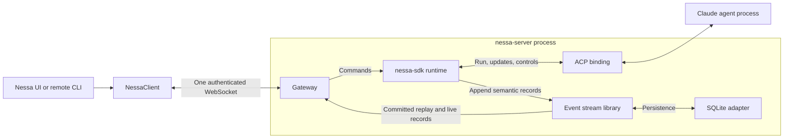
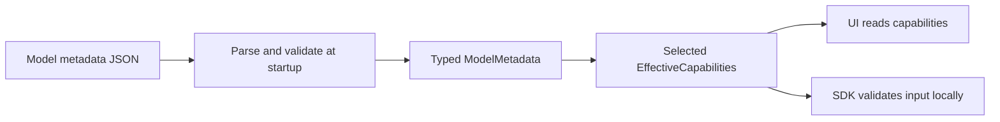
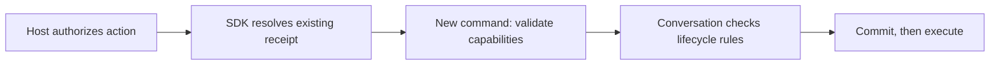
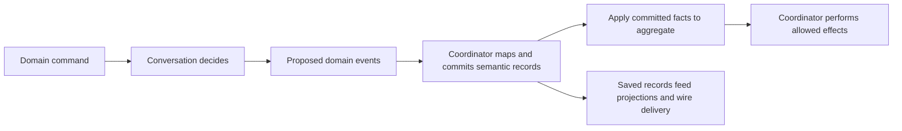
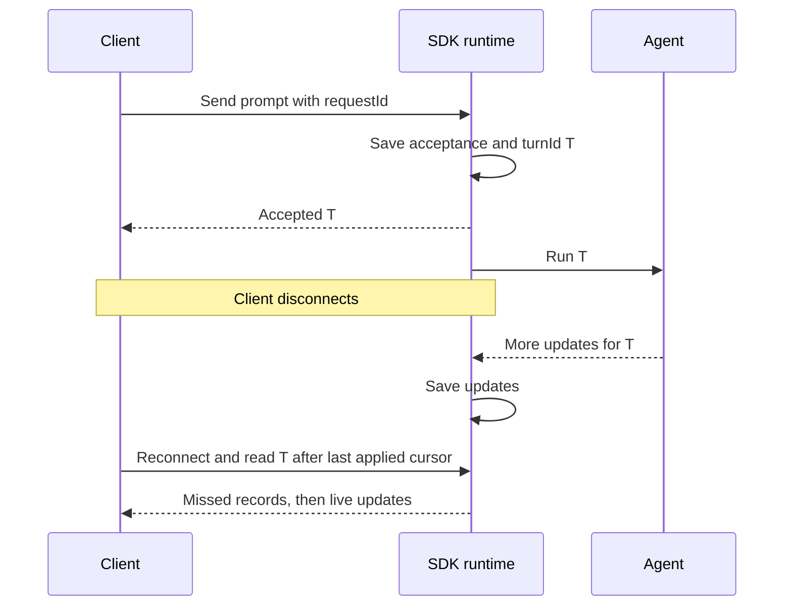
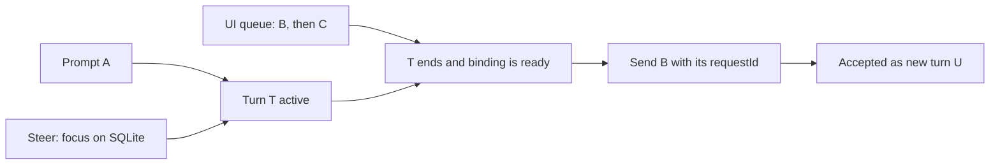
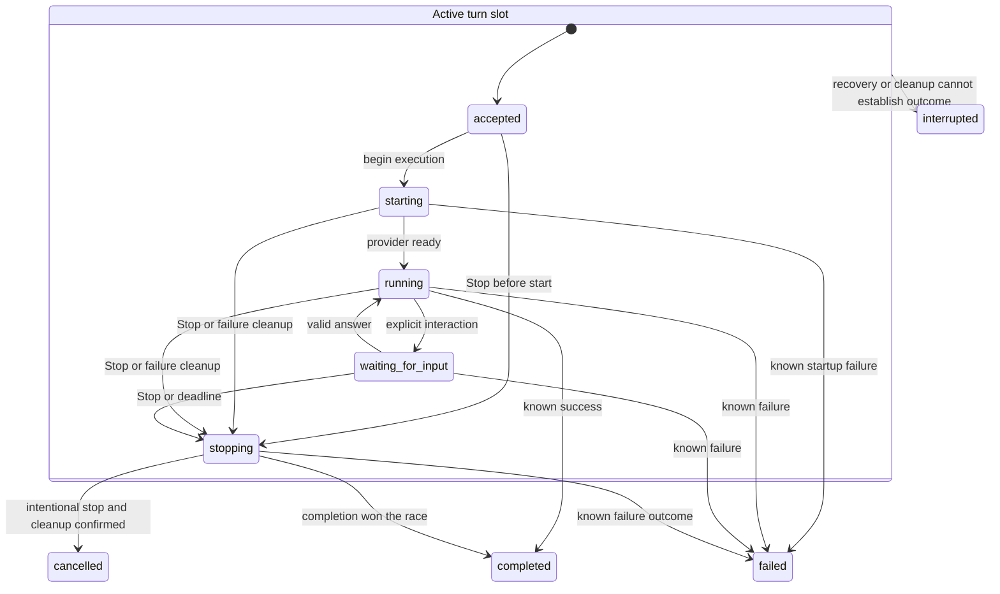
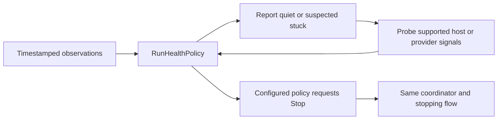
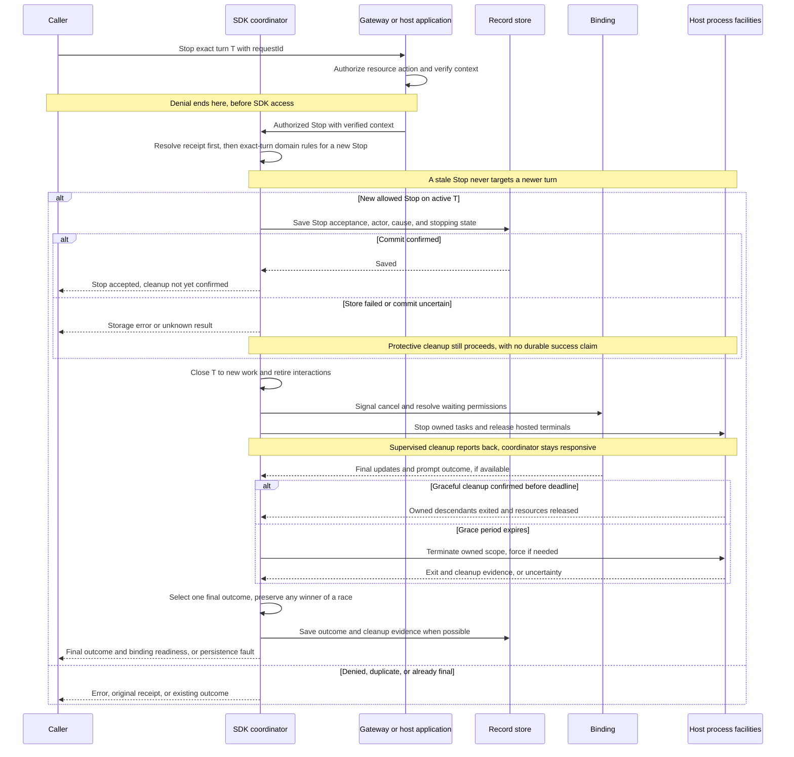

# 0008. Build nessa-sdk as the reusable Rust agent runtime

## Purpose

Build one Rust library that runs and controls agent conversations. The server
uses that library; NessaClient calls the server. The library decides which work
to accept, tracks each turn, and records who started or controlled it. Saved
records flow through the event stream and gateway back to clients.

- **Date:** 2026-09-07
- **Status:** accepted direction — model metadata, effective capabilities, and restricted Claude binding complete; Conversation coordination remains planned
- **Review supplement:** [Runtime classes and sequences](../../design/agent-runtime-classes-and-sequences.md) — proposed responsibilities, operations, and failure flows; no implementation code
- **Supporting research:** [Server runtime research](../../design/agent-sdk-shape-research.md)

## Accepted direction

Build **`nessa-sdk`, a reusable Rust library**. Nessa's server embeds it to run
and control agents. Other Rust servers, CLIs, and background applications can
use the same library without Nessa's gateway, desktop app, or TypeScript client.

The existing **NessaClient** in `packages/nessa-client` (`@nessa/client`) remains
the UI's connection and API client. There is no planned TypeScript SDK. The Rust
runtime owns conversation state on the server. The external **agent harness**
(the program that runs the model and tools) keeps its own model/tool loop.
Clients send commands and display the resulting state and events.

The first delivery is one complete local Claude conversation through ACP:
create it, send a prompt, save and display updates, answer required approvals,
interrupt work, and reconnect. It also recovers known state after restart and
records the creator and originating surface. More providers and a general workflow
engine can wait. This records the accepted architecture and scope. Model metadata is delivered
as the first slice; the complete conversation flow remains to be implemented.

## Delivery status

**Model metadata — complete (2026-09-11).** The implemented
[`nessa-sdk` catalog](../../../crates/nessa-sdk/README.md) includes:

- One editable JSON file with eight current general-purpose OpenAI/Anthropic models.
- Pure domain model entities, validated value objects, and catalog uniqueness rules,
  separated from application DTO/mapping/query code and JSON infrastructure.
- Shared Date and Url value objects backed by parsing libraries, and a closed
  model provider type for OpenAI and Anthropic.
- Strict loading, exact model selection, immutable catalog snapshots, and a local
  example that prints all metadata or a selected model without provider access.
- A pure token occupancy calculation using the window stored in TokenLimits.
- 22 passing tests across common values, domain, application, and infrastructure;
  Clippy/format checks pass. The SDK builds with its declared Rust 1.89 minimum.

**Effective capabilities — complete (2026-09-11).** The SDK now builds immutable
snapshots from selected model metadata, typed binding declarations, and validated
configured limits. Features intersect; settings exceeding model/binding ceilings
fail explicitly. Pure validation checks required modalities/features and supplied
input plus reserved output budgets. Application DTOs project that same snapshot.
All 36 SDK tests pass. The domain coverage gate requires and measures 100%
lines/functions/regions across every SDK domain context, including error
diagnostics; tests cover independent modality combinations, limits, and isolation.
Application tests verify projection isolation. No provider or settings reader is
implemented in this slice.

**Restricted Claude binding — complete (2026-09-12).** Application-owned execution
ports now support session creation, typed text/file-tool observations, once-only
permissions, and Stop. The pinned Claude ACP adapter verifies exact model/default
mode, bounds protocol work, and owns one Unix process group per opened binding.
Stop closes that binding, cancels interactions, and verifies cleanup before
reporting cancellation. The [binding guide](../../../crates/nessa-sdk/docs/claude-acp.md)
records live macOS checks and fixture tests. File tools are supported; shell,
delegation, MCP, extended context, and Windows execution are rejected/not exposed
until their stronger host/configuration contracts are implemented. This is not the
Conversation aggregate or its durable control flow.

**Remaining:** host startup/server/UI wiring, harness settings readers, additional
execution profiles/providers, conversation aggregates/coordinators, record
persistence/replay, and durable controls/recovery. The catalog's context window is
still the published model ceiling, not a Codex default or discovered runtime limit.
The complete ADR stays in `todo` until its conversation delivery is implemented.

## Context and current behavior

Nessa needs an agent runtime reusable outside its server, and a convenient remote
API for its UI. Putting execution rules into gateway handlers would tie them to
Nessa's transport. Putting them into the TypeScript client would make each client
responsible for server behavior and leave no reusable server library.

Today the authenticated WebSocket gateway and NessaClient connection exist. The
temporary `conversation.echo()` operation returns the supplied text. The Rust crate
implements model metadata, capability admission, and a standalone restricted
Claude ACP execution binding. Durable conversation/turn operations and their
coordinator remain planned features. WebSocket communication already works; the stream
integration adds durable history and replay after reconnect.

## Architecture and ownership



This diagram shows how data moves. The stream library and SQLite adapter run
inside the server process. The SDK appends through a small records interface
owned by its application module. The gateway reads the same saved records through
an adapter that checks access. Commands, replies, and subscriptions all use the
existing WebSocket. See [why we append semantic records](../../ARCHITECTURE.md#why-append-semantic-records-to-the-stream)
for the reason behind this choice and a smaller diagram.

Startup code chooses and passes in the agent binding, record store, and
host facilities. A **binding** translates between the SDK and an agent interface
such as ACP. These are dependencies supplied to the runtime, not three extra
steps on the network path. Another Rust host can create the same SDK and read its
records without a gateway or socket. The generic stream library has no knowledge
of agents or WebSocket.

| Component | Owns |
| --- | --- |
| `nessa-sdk` | Choose/check the configured binding; create conversation/turn IDs; accept commands; change turn state; handle approvals and Stop; define records and receipts; decide recovery |
| `nessa-server` | Authenticate callers, enforce Nessa access policy, provide trusted caller information, translate wire messages, deliver subscriptions, and wire SDK dependencies |
| Agent binding adapters | Translate ACP or another interface; map native sessions to Nessa work; report supported features; normalize provider events and errors |
| External event-stream library | Save records in order; handle append retries, cursors, read/subscription limits, and replay followed by live updates through its store |
| SQLite adapter | Store records locally, with transactions and ownership guarantees verified under ADR 0009 |
| Host composition (startup/shutdown wiring) | Choose bindings, policy, storage, and credentials; supply process facilities and limits; start, drain, and close resources |
| Existing `NessaClient` | Connect and recover the authenticated connection; make typed calls; retain command IDs; resume subscriptions from the last record the consumer applied |
| Client projection and UI | Build transcript/control state from records and keep its cursor; own local drafts, queues, navigation, and presentation |

The gateway authenticates callers, authorizes each action on its target resource,
and verifies surface attribution before calling the SDK. It uses Nessa's existing
auth application for commands, receipt access, reads, and subscription batches.
The SDK is a trusted library: it receives host-verified action context, not grants,
membership rules, or a gateway authorization interface. Direct Rust hosts enforce
their own access policy at their application entry points. Internal server actions
use that same host boundary. Local use needs no hosted signup; choosing a different
provider cannot bypass the host's access checks.

One **SDK coordinator** owns the decisions and state changes for each conversation.
The gateway and client read its saved results; they do not keep competing turn
state machines or send a separate live transcript from provider callbacks. The
first version gives one process exclusive ownership of the durable store, as
required by ADR 0009. Sharing ownership across processes is outside this design.

The coordinator processes command acceptance and saved state changes one at a
time. Provider execution runs in separately supervised tasks and reports results
with the IDs of the work that produced them. It must not hold the coordinator
while waiting for the agent, an approval, a tool, or a socket write.

For example, an agent waiting for permission must still be stoppable. If the
coordinator waited for that entire turn to finish before reading another command,
it could never process the Stop or approval needed to finish the turn.

Set finite limits on queues and buffers, and test that Stop and approvals remain
responsive even when provider output fills them. A queue size limit alone does
not prove that. Unrelated conversations must not share a global command lock.
The host follows ADR 0010's access rule: check current permission when accepting each
operation. Later revocation does not undo an operation already allowed.

### Resolve capabilities once, validate against the snapshot

Keep three boundaries: the host decides whether this caller may act on a resource;
capabilities describe what the configured agent/model can do; Conversation decides
whether the action is valid now. The SDK has no gateway access-policy dependency.

Keep model capabilities in one editable **JSON metadata file**, keyed by provider
and exact model ID. Parse and validate it into typed internal objects at startup.
The selected entry supplies the model's capabilities. No capability discovery,
provider metadata overrides, source precedence, or unknown capability state.





#### A small model metadata catalog

Use boolean feature fields: `true` means supported and `false` means unsupported.
Require the fields in each entry so missing values are configuration errors, not
another support state. Reject duplicate provider/model keys and malformed entries.
Selecting a model without an entry returns a configuration error asking for that
entry to be added. It does not trigger a lookup or discovery process.

For example, this abbreviated entry illustrates the feature fields using a
fictional model (see the implemented catalog below for all required metadata):

```json
{
  "models": [
    {
      "provider": "example",
      "modelId": "example-text-vision",
      "input": { "text": true, "image": true, "audio": false },
      "output": { "text": true, "image": false, "audio": false },
      "toolUse": true
    }
  ]
}
```

Adding a model or correcting its capabilities means editing this file. Keep it
as data; provider request formatting and quirks stay in adapters. Add explicit
limits or further feature fields only when an integration needs them. The example
is illustrative, not a real model claim. The first implemented slice is
[`nessa-sdk` model metadata](../../../crates/nessa-sdk/README.md), with the current
catalog in [`data/models.json`](../../../crates/nessa-sdk/data/models.json).
`maxContextWindowTokens` describes the published model ceiling; it is not the
configured/default window of a Codex or other harness binding. Local config and
user settings belong to the binding's execution configuration and can narrow the
effective window. The implemented effective capability factory accepts typed
limits; reading harness settings remains the binding/composition responsibility.

`ModelMetadata` is the parsed entry. `EffectiveCapabilities` is the small immutable
object used internally for the selected execution configuration. Build it with a
simple factory from that entry and the binding's declared support and agent
settings. No separate CapabilityResolver class is needed. Binding restrictions
can disable a feature, but cannot enable one marked false in the file. Controls
such as steering come from the binding implementation, not model metadata.
For example, image support in the file plus a text-only adapter still rejects
images. An unsupported input produces an explicit error before turn acceptance;
never silently drop content or substitute a model.

#### Snapshot lifetime and changes

Load the metadata file at startup; edits take effect on restart. No file watcher,
automatic refresh, discovery, or capability negotiation is added. Required provider
protocol setup remains the binding's job; it does not populate or override the
model catalog. If the configured integration cannot deliver an advertised feature,
report the setup/execution error rather than searching for replacement metadata.

When selecting a different configured model or agent settings, build the internal
capability object from the already parsed data. Install it with that configuration
at a serialized command boundary. Keep the configuration stable for an accepted
turn; changes apply to future work. Each SDK instance receives its own immutable
data through composition, without a mutable global catalog.

The UI reads this object; the SDK's pure `validate` method checks new commands
against it locally. There is no metadata lookup over the network on a command.
The host checks access first. An identical accepted retry returns its original
receipt before new capability/state checks. New commands still require binding
readiness and valid Conversation state. Persist the accepted configuration as
already required for traceability; no extra catalog revision system is needed.

Stop retains its host-cleanup path even when graceful protocol cancellation is
unsupported. Capability flags cannot disable required cleanup.
See the [class diagram and method guide](../../design/agent-runtime-classes-and-sequences.md#classes-and-their-roles).

### Domain events describe the aggregate's decisions

Conversation returns typed domain events such as TurnAccepted, SteeringAccepted,
StopRequested, and TurnCompleted. These are proposed facts until committed. The
coordinator maps them into semantic records, confirms persistence, applies them
to the aggregate, and explicitly performs allowed effects. Events themselves do
not launch agents or tools. Replaying records rebuilds state without effects.



Domain events, durable semantic records, wire records, and provider updates have
separate types and owners, but do not create separate sources of truth. Keep one
saved stream and a small typed event family. The generic stream library handles
persistence/delivery, not domain decisions. No mediator or event-handler framework
is needed. See [domain events and durable records](../../design/agent-runtime-classes-and-sequences.md#domain-events-and-durable-records)
for examples, the commit sequence, atomicity, and replay/failure rules.

## Rust library boundary and reuse

Put the proposed library in `crates/nessa-sdk` and use it from `crates/nessa-server`
as a Cargo workspace dependency. Follow the existing domain/application/adapters
layout and add modules only when needed. Reuse in another Rust host is the reason
for a separate crate. WebSocket support alone would not require one. Publishing
the crate or promising a stable public API is a separate release decision.

Use a `Conversation` domain aggregate as the consistency boundary. It owns the
single active-turn rule, Turn entities, and valid controls/interactions. The SDK
coordinator is the application service that loads state, asks for domain decisions,
commits them, and calls injected effects. EffectiveCapabilities validates input against resolved agent/model
and binding support; Conversation owns the lifecycle rules. Host authorization
happens before the SDK call.
Keep the aggregate focused on runtime decisions, not the whole transcript.
See [DDD boundaries](../../design/agent-runtime-classes-and-sequences.md#ddd-boundaries-without-extra-machinery)
for the class responsibilities and what we deliberately avoid adding.

The application layer defines typed commands, results, errors, and **ports**:
small interfaces for the effects it needs. Domain rules use domain types. They
do not import application DTOs (data-transfer objects), wire messages, providers,
databases, or UI code. Adapters translate those outside types into application
and domain types. Shared wire schemas remain the source for remote payloads;
they are translated into SDK commands.

Use typed constructors/factories following [the existing DI pattern](../../design/dependency-injection.md).
Pass bindings, durable records, clocks, and ID generators to the code that
needs them. Pass process, credential, and filesystem facilities directly to their
adapters; the runtime does not need to forward every host dependency. Define only
the ports required by the first conversation. Do not add global registries,
service locators, mutable process-wide runtimes, or empty future subsystems.
The SDK does not depend on NessaClient, WebSocket handlers, React, Redux, or Tauri.

A second Rust application must be able to:

1. Create its own adapters and SDK instance.
2. Enforce its access policy before SDK calls and supply verified action context.
3. Create/load a conversation, send input, read events/results, and control a
   supported turn through typed Rust calls without a gateway socket.
4. Shut down and clean up its resources independently of another SDK instance.

Finalize Rust export names and signatures during implementation. The behavior
below must work without a particular transport. A direct Rust host supplies
stable IDs for commands that change state. A convenience wrapper may use an
injected ID generator, but it must retain those IDs to check uncertain results
and retry the same command safely.

## Conversation and turn contract

A **turn** is one accepted run of the agent. A command can be accepted before the
work finishes, so its initial reply and final result mean different things.

| First-delivery operation | Planned behavior |
| --- | --- |
| Describe configured agent/models | Show whether the configured Claude ACP binding is available, which models/settings can be chosen, and what it supports in the caller's allowed workspace/profile |
| Create a conversation | Resolve the binding/model, check availability and configuration, and return a saved conversation ID and supported features |
| Load a conversation/turn | Rebuild state from saved records by ID, so reconnecting clients find existing work |
| List conversations | Return allowed conversations with creator/surface details and the origin filter described below |
| Send input | Accept one new turn and return its ID; work continues independently of the connection that sent it |
| Interrupt a turn | Stop that exact turn and clean up its tasks, tools, terminals, and child processes. The first reply confirms the request was accepted; the final outcome reports whether stopping and cleanup succeeded |
| Observe status/events/result | Return progress, typed interactions, and a final outcome tied to the correct turn; allow saved history to be replayed |
| Answer an interaction | Apply an allowed answer to the exact outstanding approval/input request; reject stale answers and conflicting duplicates |

Startup code configures the first binding. A dynamic provider catalog can wait.
When creating a conversation, the SDK resolves its binding revision, workspace,
profile, and required settings. The host rechecks access and the SDK rechecks
capabilities/configuration even if the client checked earlier. Missing or ambiguous choices produce typed errors.
Callers can select from configured bindings; they cannot install infrastructure,
provide arbitrary launch commands, or call arbitrary provider methods. A failed
setup check or unsupported configuration must clean up any partially created
native session.

The coordinator allows only one active turn per conversation. If two callers try
to start work together, only one can succeed; the other receives `turn_busy`.
A draft waiting in the UI has no accepted turn ID. Stop can arrive just as a turn
finishes. The saved final outcome decides what happened. Closing a socket or event
iterator does not cancel the turn.

Another turn also needs a binding confirmed ready for a new prompt. Follow the
[interruption and cleanup contract](#interruption-and-resource-cleanup) below.
Tag callbacks with the turn that produced them before queueing them. Late output,
or output whose turn is unknown, must never be attached to the next turn.

The external harness owns its agent/tool loop. The binding reports its observable
progress and translates Nessa controls into provider calls; Nessa does not add
another tool loop around ACP. A future Nessa-owned agent could use model/tool
adapters behind this boundary, but that is outside the first delivery.

Report only the controls and content features verified for the chosen release.
**Steering** means giving new guidance to the currently running turn. Add it only
when the binding proves support and its behavior is specified. It must target the
exact active turn, without quietly starting another turn or stopping/restarting it.
Unsupported operations fail explicitly. Add typed support for attachments,
structured output, subagents, forks, and provider extensions only when a real
integration needs them. Do not expose raw provider SDK objects or arbitrary
method/options calls. Resume, replay, fork, and restart remain separate operations.

### Connection lifetime, queueing, and steering

Once acceptance is saved, the runtime owns the turn. Losing the sending socket
only loses that client's view. The following assumes the server stays running:



An explicit Stop can end work. So can an execution failure, shutdown, or an
allowed timeout/resource policy. A client disconnect alone does not. If the
server itself crashes, use recovery rules; a desktop restart that also kills its
server is not merely a socket reconnect.

| User intent | What happens |
| --- | --- |
| Send now | Try to accept a new turn; return `turn_busy` if one is active |
| Queue | Keep a future prompt in the UI; it has no `turnId` until the server accepts it |
| Steer | Add guidance to the exact active turn, only when supported; keep its `turnId` |
| Stop-and-send | Stop the current turn, wait for its final outcome and binding readiness, then try the queued prompt |



The queue belongs to that surface, not the server. Do not promise it survives UI
closure unless that surface saves drafts. Reconnect reconciles the current turn
before dispatching. Two clients can race to send the next turn; `turn_busy` keeps
the losing draft local, without an automatic retry loop. A lost send reply uses
the same `requestId` to find whether its item already became a turn. Steer cannot
silently become queue, Stop, or a new prompt.

#### Record steering as an action

No steering wire schema exists today. The proposal is a distinct **`turn.steer`**
semantic acceptance record in the same conversation stream. It carries message
content but explicitly means guidance for an existing turn. A display tag alone
cannot define its execution, retry, and trace behavior. This specifies the future
contract; it does not claim that the first Claude ACP binding supports steering.

| Field group | Proposed contents and purpose |
| --- | --- |
| Record envelope | Existing stream ID, event ID, schema ID, cursor, and recorded time |
| Action | `turn.steer`, `requestId`, target `conversationId` and exact `turnId` |
| Input | The accepted guidance content in the shared, size-limited content schema |
| Attribution | Verified action actor/surface and cause, as defined below |
| Receipt | Original accepted response, recovered from this same record on identical retry |

The host verifies resource permission. The current EffectiveCapabilities snapshot validates
steering support and guidance content, and Conversation validates the exact turn state. Initially allow it only for `running`; a binding must explicitly support
any later extension to `waiting_for_input`. Save acceptance before forwarding.
Correlate provider delivery evidence to that record's event ID: confirmed,
rejected, or unknown. Acceptance does not prove the model used the guidance.
If completion wins before acceptance, reject the steer. If forwarding loses the
race after acceptance, retain the record and report its delivery outcome. Never
retarget it, erase it, or automatically resend after a crash. Ordinary prompt
records and steer records remain distinguishable in history and analytics.

### One canonical turn state

The SDK owns this proposed `TurnState` definition and its transitions. Generate
the wire/client representation from the agreed product schema and translate it at
the domain boundary. UI, recovery, tracing, and tools read that same state.
The current UI's [idle/thinking/streaming model](../../../src/conversation/model/types.ts)
is a presentation model, not an existing server turn enum. Replace its authority
with the server model when implemented; display labels may be derived from it.

| State | Exact meaning |
| --- | --- |
| `accepted` | Acceptance is committed and `turnId` exists; provider execution has not started |
| `starting` | The accepted turn is being started in its selected binding; separate from conversation creation |
| `running` | The provider is working, including ordinary tool execution |
| `waiting_for_input` | Progress needs a recorded approval or explicit external answer; waiting reason and interaction IDs explain which. A normal long tool call stays `running` |
| `stopping` | The runtime is stopping work and cleaning up after Stop, policy action, or a failure |
| `completed` | A successful provider turn outcome is established |
| `cancelled` | An intentional stop succeeded and owned cleanup is confirmed |
| `failed` | An unsuccessful outcome is established, with its reason |
| `interrupted` | The attempt cannot safely continue and its execution or stop outcome cannot be established |



All five non-final states occupy the one active-turn slot. Rejected commands have
no new turn. The diagram's failure edges also cover a failed start with no process
to clean up. Every active state may become `interrupted` during recovery. Final
states have no outgoing transitions; late callbacks cannot reopen them. A stored
final outcome is written at most once. Each change is saved before it is published.

**Binding readiness is a separate resource fact, not another turn lifecycle.** A
known `completed` or `failed` result does not prove all owned resources were
released. Keep the binding unavailable until that cleanup and provider context
are verified. `cancelled` requires confirmed cleanup. If a final result already
won a race, record subsequent cleanup evidence without rewriting that result.
These facts are owned by the coordinator/host facilities and shared by all views.

### Health observations and configurable recovery

Quiet output does not prove a stuck or stopped turn. A live PID does not prove a
healthy agent, and a dead parent PID does not prove its children stopped. Confirm
stopping using the owned execution scope, provider outcome where available,
child exits, and released resources. Missing remote evidence means unknown.

Keep `TurnState` unchanged while inspecting health. A shared **RunHealthPolicy**
derives `healthy`, `quiet`, `suspected_stuck`, or `unknown` from timestamped
observations: meaningful provider/tool progress, supported heartbeats, process
and child liveness, optional CPU/memory data, and expected approval/input waits.
Unavailable signals stay unknown. CPU activity or heartbeats alone do not prove
useful progress. The UI displays the server's assessment; it does not run its own
inactivity timer to change turn state.

Users configure quiet/probe/stop thresholds and whether suspected inactivity
should only be reported or request Stop. Defaults report/probe silence without
automatically killing work. Expected input waits use their explicit interaction
deadlines. Host resource ceilings and cleanup deadlines remain enforced; a user
cannot disable required cleanup through a health setting. Record the effective
policy/revision and the evidence causing an automatic action. Numeric defaults
are a delivery decision to test, not guessed guarantees in this ADR.



Health does not add `stuck`, `inactive`, or `recovering` turn states. A supervisor
such as Shepherd could supply observations behind the host port if selected;
there is no Shepherd dependency or CPU-stall detector implemented or required here.
An automatic Stop records the server as actor and the policy decision as cause.
It never silently replays an uncertain prompt or tool action. After cleanup,
another attempt requires a new, explicitly authorized command and request ID.

### Interruption and resource cleanup

Stop must end the turn's work and release its resources. Sending a cancel message,
dropping an async task, closing a pipe, or seeing the main process exit does not
prove its child processes stopped. The SDK coordinator owns the decision and final
outcome. The binding sends protocol controls and uses the injected host process
facilities for cleanup. Use the same cleanup path after failed startup, execution
failure, and shutdown.

Give each conversation its own process supervision scope in the first local
binding. This lets the host force-stop its work without killing another
conversation or application instance. Track ownership when each resource is
created: provider tasks, tools, Nessa-hosted terminals, child shells, background
commands, and delegated work all belong to a turn. The first delivery does not
allow turn work to detach and become ownerless. An idle harness may remain alive
for its conversation. Supporting a long-lived user service needs a separate,
explicit owner and lifetime first.

Stopping follows these steps, with deadlines and safe repeated requests:

1. Save acceptance of Stop for the exact turn. Close that turn to new tool work
   and approvals, then signal cancellation. If resource creation races with Stop,
   reject it or register it for cleanup before it can run.
2. Ask the harness to stop using its supported protocol. Close pending
   interactions and answer waiting provider permission requests as cancelled.
   Stop and release Nessa-hosted terminals/tasks even if the agent never asks to
   release them. Read final updates for that turn within a deadline. Keep the
   coordinator free to process other controls.
3. If the grace period or cleanup deadline expires, terminate the owned work and
   use forced termination if needed. Wait for exit, reap owned child processes
   (collect their exit status and release OS resources), and close handles and
   readers. Check descendants too: killing only the harness PID is insufficient.
   Use platform facilities that keep ownership of the processes. A process group
   alone is insufficient if children can detach from it. Disable unsupported
   execution modes or reject the binding configuration if required cleanup cannot
   be enforced.
4. Save one final outcome with evidence of cleanup. Report `cancelled` only after
   confirming that owned work stopped and resources were released. Record whether
   force was needed. If stopping or cleanup is still uncertain, report
   `interrupted` with the cleanup error and keep the binding unavailable.
   A successful completion may already have won the race; finish cleanup without
   rewriting that final outcome or stopping a later turn.



The check and receipt branch never forwards another cancellation for a final
turn. Cleanup reports carry the original turn and execution-scope identity.
Failed final writes remain explicit persistence faults; recovery must reconcile
them before new work. If completion already won, append cleanup evidence instead
of a second final turn outcome.

For example, a shell may exit while a background command it launched keeps
running. Stop is not confirmed until that command is stopped too.

Show cleanup errors and current binding availability in inspection results and
saved records. A final turn outcome alone does not mean the binding is ready.
Verify cleanup and valid provider context before allowing reuse. Launching a new
harness does not remove the responsibility to stop an old surviving process.
Keep unrelated conversations available. The gateway, client, and tool adapter
must not add their own cleanup state machines. Stop does not undo completed
external effects or work accepted independently by another conversation.

ACP v1's [cancellation contract](https://agentclientprotocol.com/protocol/v1/prompt-turn#cancellation)
uses `session/cancel`, a notification that has no reply of its own. The agent is
expected to abort current work, send pending updates, and then answer the original
`session/prompt` with `cancelled`. The client must answer pending permission
requests with a cancelled outcome. This helps identify the protocol's stopping
point, but does not prove the chosen harness stopped every OS descendant.

If Nessa advertises ACP [terminal support](https://agentclientprotocol.com/protocol/v1/terminals),
Nessa owns that client-side terminal lifecycle. Stopping a command and releasing
its terminal resources are separate steps. Test both the pinned adapter's native
tools/background processes and Nessa-hosted terminals; they may run through
different paths.

## Creator and surface provenance

**Provenance** means recording who started or controlled work, and from which
surface. Include it in the first implementation. Allowed surfaces, plugins, and
direct Rust hosts create normal conversations with recorded origin. Clients can
use it to list or group work. Start with explicitly configured mappings from
callers to surfaces; a dynamic plugin registry is unnecessary.

| Field | Meaning and source |
| --- | --- |
| `createdByPrincipalId` | Who created the conversation or turn, derived from the authenticated/trusted caller; callers cannot choose another identity |
| `surfaceId` | Stable origin of this action, checked against the surfaces its actor may use; creation stores it as conversation origin |
| `surfaceInstanceId` | Optional ID of a particular registered surface instance; separate from its stable surface ID and temporary connection |

A conversation's origin never changes. Each turn, Stop, interaction answer, and
supported steering action records its own caller and surface. For example, the
panel can create a conversation, a plugin can send a prompt, and another surface
can stop it. The panel remains the recorded origin. Ownership, organization, and
access come from authorization checks, not from creator or surface strings.

`SurfaceId` is a validated string-backed domain type, open to new names rather
than a closed enum. Define its format in the product protocol. Generate matching
Rust/TypeScript wire types, validation, and constants for actual Nessa surfaces.
The SDK adapter translates wire values; domain code does not import wire DTOs.

Reserve `nessa.*` for Nessa-owned surfaces. The proposed catalog below names the
initial origins. Finalize the grammar and length limits with the schema. Preserve allowed custom IDs when reading and writing;
do not force them into a closed catalog or rename them to a known Nessa surface.

Host composition supplies caller-to-surface/namespace mappings to its application
entry points. The gateway gets them from explicit provisioning. Host policy checks
reserved namespaces and impersonation before calling the SDK; the reusable SDK
validates the value's format and records the verified origin. A name prefix grants
no permission. A plugin can use multiple names within its allowed namespace.

### Valid surfaces and attribution on every action

Today's [connection schema](../../../protocol/schemas/v1/common.json) defines
`SurfaceKind` values `panel`, `web`, `desktop`, and `cli`. They describe a connection
and do not prove its origin or permissions. There is no implemented trusted
`SurfaceId` catalog yet. Use this proposed starting catalog when 0008 lands:

| Proposed surface ID | Meaning |
| --- | --- |
| `nessa.panel` | Nessa floating panel |
| `nessa.web` | Nessa web surface |
| `nessa.desktop` | Nessa full desktop surface |
| `nessa.cli` | Nessa CLI caller |
| `nessa.server` | A server-owned timeout, recovery, cleanup, or other automatic action |
| `nessa.background` | An explicitly configured Nessa background job |
| `plugin.<registered-plugin-id>.<surface-name>` | A provisioned plugin surface within its allowed namespace |
| Other explicitly provisioned names | Custom direct-host/integration surfaces, subject to format and policy checks |

This catalog names origins; it does not implement each surface. Keep the open
validated `SurfaceId` type. A third-party Rust host uses its provisioned namespace,
not an unverified claim to `nessa.server` or another reserved name.

Every accepted action gets an **ActionContext**, including prompts, steering,
Stop, approval answers, and server-triggered actions. Creation keeps its original
context forever; later actions keep their own. Record the acting `principalId`,
`surfaceId`, optional `surfaceInstanceId`, and a cause reference when another
request/event/policy decision triggered it. Use the action's `requestId` and the
record's time/event ID. Keep credentials out of the context.

For automatic actions, composition supplies a trusted server actor and restricted
policy context. Do not impersonate the human who started the turn or bypass policy.
For example, a timeout Stop records actor `nessa.server`, its server principal,
and the triggering policy/cause reference. Preserve the original prompt's actor
on its own record. Provider output remains provider output tied to its owning turn;
do not relabel it as a human or server command. Required system cleanup still runs
on storage failure, while reporting that a durable action record is unavailable.

```text
Conversation created: panel caller / nessa.panel
  Turn started:      CLI caller / nessa.cli
  Guidance accepted: plugin caller / plugin.reviewer.chat
  Timeout Stop:      server actor / nessa.server / cause = policy decision
```

Direct Rust hosts enforce their own policy and supply verified actor/surface context.
A background job needs an explicit identity too. Existing credential provisioning
uses principal labels such as `surface:nessa-panel`; see
[local auth provisioning](../../guides/local-auth.md#assign-each-surface-its-own-credential).
Configure the mapping rather than rename the credential:

```text
principalId: surface:nessa-panel
    configured allowed origin → surfaceId: nessa.panel
    optional current window   → surfaceInstanceId: panel-window-17
```

The optional instance registration is short-lived, but the recorded attribution
survives its disappearance. Window 17 closing does not erase the record or stop
the turn. It is not an execution lease, permanent presence tracker, or attachment
state. The gateway verifies this context from provisioning; payload strings and
connection metadata cannot manufacture trusted authorship.

### Resource access is separate from presentation

The UI chooses where work appears. Do not add server-side `visibility`, `hidden`,
or presentation `scope` fields to control UI placement. A principal may be granted
particular actions on specific **resources**. Every read, subscription, and
mutation checks the target resource. Listing returns only permitted resources,
with checks before pagination. Authentication alone grants no server-wide access.
Resource-level operations are proposed here; the existing auth application is
reused when those operations are implemented.

```text
Plugin A's policy grants
  R1: read and subscribe    allowed
  R2: read only             allowed
  R3: no grant              denied
  R4: no grant              denied
```

Plugin A cannot mutate R1 just because it can read it, subscribe to R2 without
that action grant, or list/read/subscribe to/mutate R3 or R4 without an explicit
policy grant. Keep this model generic as more resource types appear.

```text
origin / surface metadata → where the action came from
resource policy          → which actions its actor may perform on which resources
```

Creation, read, and list results, plus relevant events, return origin information
to allowed callers. Listing supports an exact origin `surfaceId` filter. Apply
access checks and that filter before pagination. Keep unknown surfaces distinct.
Loading, replaying, and attaching preserve origin. Retries include the validated
caller/surface information and reject conflicting attribution. This delivery has
no existing durable conversation records to migrate.

## Identity, durability, and failure behavior

| Identity | Meaning |
| --- | --- |
| `conversationId` | One saved Nessa conversation; it survives a connection change and is separate from the provider's native session ID |
| `turnId` | One accepted turn; its messages, tools, interactions, and events refer to it |
| `requestId` | One command that changes state; reuse it when checking an uncertain result or retrying the same command |
| Replay cursor | A position in one committed stream incarnation (one lifetime of that stream); separate from a temporary socket's event sequence |

A command that changes state is also called a **mutation**. NessaClient generates
its `requestId` once, including for creation, sending, Stop, and interaction
answers. Advanced callers can supply one. The RPC envelope's `id` identifies each
network attempt. Keep `requestId` as the single mutation-ID name in SDK and wire
contracts, and do not embed one ID inside another.

### One durable record source

Use the external stream library and its verified local adapter for saved
conversation state changes, transcript content, and command receipts. A **commit**
means the store confirms that the record was saved. The SDK defines record meaning
and recovery rules. The library handles committed order, duplicate append checks,
cursors, and replay followed by live delivery.

Conversation state, listing indexes, and receipt lookups are **projections**:
views rebuilt by applying saved records in order. Keep these based on one record
source. Do not independently write a conversation database, a receipt database,
and an event stream, or add another journal/cursor allocator. Existing auth and
host-settings storage remain unchanged.

The coordinator processes these acceptance steps one at a time per conversation:

1. Validate the caller, operation, and origin information. Look up `requestId`
   within that principal, operation, and target before allocating IDs or checking
   whether a new turn can start. A **receipt** is the saved acceptance response.
   An identical retry returns it. Different canonical input (input in the agreed
   standard form) or different attribution fails. A caller cannot retrieve
   another caller's receipt.
2. Check turn state and allocate `turnId` for a new accepted prompt. Append one
   record containing the canonical command, validated origin, allocated IDs, and
   acceptance response. The adapter must save the whole record or none of it.
   Keep its event ID unchanged on append retries.
3. Apply the saved record to runtime state, reply with acceptance, and start the
   provider. The commit authorizes execution. Work proceeds even if the reply
   never reaches the caller.

For example, a connection may drop after a prompt was saved but before its reply
arrived. Retrying the same `requestId` returns the original `turnId` and receipt.
It does not start the prompt again.

If a write times out, first establish whether it committed. Keep affected new
commands paused and check the store using the same event ID and input. A timeout
does not prove rejection. During recovery, if acceptance was saved but the provider
attempt's outcome cannot be established, mark that attempt `interrupted`. If the
store cannot establish whether acceptance was saved, keep affected commands
blocked. Do not invent a final record or repeat an external action to guess the
answer.

The acceptance record is also the recoverable receipt, so there is only one write.
Later lifecycle and normalized provider records use the same stream. Save
interaction decisions and normal Stop requests before forwarding them to the
binding. If storage fails, protective stop/cleanup must still run within a deadline;
it cannot depend on a successful write. Do not claim a saved cancellation or final
outcome when the commit failed or is uncertain. The SDK's ordered command handling
resolves acceptance and interaction races; duplicate-record detection alone cannot.

Creation needs a record before the conversation's own stream exists. Process
creation requests one at a time per principal. Save acceptance, allocated IDs,
and unchanging origin in that principal's **control stream** before initializing
the provider. Rebuild the conversation index from these records. Later turn and
provider records go in the conversation's **primary stream**.

Save creation progress and outcome too, so retries find the same pending or
finished creation instead of initializing another provider. Control records are
internal and do not appear in public transcripts. Both streams use the same record
infrastructure, but there is no transaction or ordering across them. Restore
creation state before accepting work after restart.

[ADR 0009](0009-reusable-event-stream-crate.md) must verify this behavior using a
pinned library revision and the real durable adapter. An existing implementation
or a memory-only test is insufficient. Fix missing guarantees in the library
before declaring this integration complete.

### Delivery and recovery

The gateway delivers saved conversation records only to allowed callers. It keeps
their IDs and cursors so clients can replay them. Save before publishing. A storage
failure must never switch the transcript to unsaved live events. Limit buffered
provider output; slow the producer where supported, or cancel if storage cannot
keep up. Connection errors may be reported outside the stream, but must not be
presented as saved conversation outcomes.

On reconnect, use the original command IDs and replay cursors. Never quietly
resend an uncertain prompt with a new ID. Advance a client's cursor only after
applying the record to its view. Saving a cursor is useful only if the matching
view is saved too. The initial UI keeps its view in memory, so a reload replays
from the beginning. Show missing history, gaps, and slow-consumer errors explicitly,
and keep the view marked out of date until recovery catches up. Snapshots and
history retention rules are deferred.

The record store cannot recover provider output it never saved. It also cannot
promise automatic agent resumption after a crash or exactly-once external tool
effects. At restart, replay saved commands, receipts, and state changes before
accepting work. If an accepted/running attempt has no confirmed provider outcome,
save `interrupted`. An identical retry returns that attempt without running it
again. A new turn needs a new command and usable provider context. Replaying Nessa
history does not prove that the provider's native session can resume.

SDK shutdown stops new commands and coordinates finishing/cancelling work and
cleanup through host-owned facilities, with deadlines. Handle abrupt host death
too: use a verified way to stop owned processes when their parent dies, or check
and clean up survivors before making the affected bindings available on restart.
An async destructor alone cannot do this. Before killing a survivor, verify its
ownership and process identity. Its executable name or an old saved PID alone is
unsafe because the OS may have reused that PID for another process.

Permission to execute and process isolation are separate requirements. The first
ACP binding must document its actual file/tool access, cancellation limits, and
cleanup behavior. The host must enforce required isolation or reject the operation.
Do not claim sandboxing that is not implemented. A general isolation platform is
outside this first delivery.

## Server API and NessaClient

Gateway adapters expose these operations as server APIs with access checks.
NessaClient sends requests and subscribes to records over its existing authenticated
WebSocket. Under ADR 0011, the gateway checks access when opening a subscription
and throughout delivery, including after revocation. NessaClient handles the
connection and request bookkeeping; the SDK owns execution and turn
state. Finalize the API payloads and client methods with the server protocol during
implementation.

To **attach** a view, ADR 0011 uses `conversation.get` followed by a subscription.
One client owner builds the view and keeps the last applied cursor. There is no
separate attachment lifecycle. These shared reads and updates are phase A and
part of the first working conversation. Phase B collaboration comes later.

The UI uses its injected conversation gateway/effects interface. Keep connections
outside Redux, and provider credentials and process execution on the server.
The UI chooses whether a follow-up waits or stops the current turn before starting
another. Steering is available only when supported.

For stop-and-send, wait for the server's final outcome **and** confirmation that
the binding is ready. If cleanup failed, keep the draft and show the error; do not
keep retrying. The runtime does not silently queue start requests. Collaboration
input marked `next_turn` can wait in an inbox, but it does not grant permission
to start a future turn.

## Delivery plan after approval

1. **Verify the two dependencies.** Pin one Claude ACP adapter release and one
   stream-library revision with its local SQLite adapter. Test the required
   controls, cleanup of child processes (including forced termination), saving
   whole acceptance records and retrying them, and reads after restart. Record
   capability and durability limits before building on them.
2. **Deliver one complete conversation.** Add the Rust operations/ports needed
   to create, send, save/read records, answer required interactions, interrupt,
   and retrieve work. Connect real storage, gateway access checks, the existing
   NessaClient, generated schemas, and the panel's injected gateway. Include
   unchanging origin, allowed listing/filtering, configured surface identities,
   and saved event delivery. Replace echo and demonstrate the local agent flow.
3. **Finish recovery and reuse checks.** Test reconnect/replay, crash recovery,
   lost replies, races, storage failures, slow subscribers, and shutdown. Prove
   direct Rust embedding, replacement adapters, and two isolated SDK instances.
   Complete supported-platform checks and UI follow-up behavior before calling
   the delivery complete.

Binding evaluation and stream verification can proceed independently. Each stage
contributes to the same working flow. An empty framework or large provider catalog
alone is not a deliverable. Design recovery into the records from the start, even
if some failure tests finish in stage 3. Test adapters help check isolation; the
real agent and production storage integration still need their own tests.

Keep a single owner for each contract:

- This ADR owns runtime behavior, records, origin information, and the first
  working agent conversation.
- ADR 0009 owns integrating and verifying the external stream library.
- [ADR 0011](0011-nessa-session-protocol-and-authorities.md) owns shared access,
  subscriptions, and later collaboration.
- [ADR 0012](0012-agent-harnesses-and-optional-tools.md) owns optional harness tools.

Shared transcript subscriptions are required here. Peer messaging and inboxes are
later work. Supporting designs and research must follow these decisions instead
of defining alternate client/setup APIs or command identities.

Finalize wire names and payloads through the existing schema generation workflow.
Update current callers, fixtures, documentation, and local development data
together. Remove `conversation.echo()` when real operations land. Do not add
aliases, compatibility shims, mixed-version support, or unnecessary protocol,
schema, or package version bumps. A version transition needs an explicit user
request.

## Acceptance criteria

- A Rust host can use the SDK without Nessa's server, TypeScript, a socket, or
  Tauri. Two SDK instances keep their state, clocks, credentials, and adapters
  separate.
- Replacing SDK binding/storage adapters or host authorization adapters preserves the application
  contract. Denied operations stay denied for remote and directly embedded callers.
- A real local Claude ACP binding creates a conversation, completes a turn,
  returns events/results tied to that turn, handles its required interactions,
  and cleans up. Advertise only tested features; reject unsupported steering.
- Concurrent sends allow only one active turn. Test repeated command IDs,
  conflicting input or author information, stale interaction answers, and Stop
  arriving at the same time as completion.
- Late provider callbacks cannot change a later turn. Uncertain cleanup prevents
  binding reuse. Stop and approvals stay responsive under heavy provider output.
- Process tests cover Stop during a command, pending approval, and child creation;
  children that ignore graceful termination; background/delegated descendants;
  agent exit before its children; repeated Stop; cleanup failure; storage failure
  during Stop; shutdown; and abrupt host death. Verify actual exit, collected child
  exit status, released resources, and no further owned work after confirmed
  cancellation. Unrelated conversations and processes must survive.
- Lost creation/turn replies and crashes before/after a commit recover the same
  IDs and receipts. Rebuilt state and indexes agree with saved records. Uncertain
  attempts become `interrupted` without another prompt or tool execution.
  Duplicate interaction answers cannot cause a second provider action.
- Disconnect, slow-consumer, replay/live changeover, crash, and restart tests show
  what survives and what remains unknown, without repeating prompt/tool execution.
- The real SQLite path sends no transcript record before commit. Live delivery
  and full replay build the same view, including text additions and pending
  interactions. A reload cannot apply a saved cursor to an empty view.
- NessaClient reconnects and finds existing work. Views show gaps and out-of-date
  state. A queued follow-up starts only after the final outcome and confirmed
  binding readiness. Failed cleanup keeps the draft and shows the error.
- Test process and storage behavior on supported platforms. Unavailable features
  return clear errors instead of silently choosing a fallback.
- Origin tests cover creation by one surface, a turn from another, and control
  by a third. Derive the creator from trusted caller information and keep origin
  unchanged. Reject reserved/foreign namespace spoofing; preserve allowed custom
  IDs; verify matching generated Rust/TypeScript contracts. Origin filters must
  preserve access checks and pagination. Retries/replay preserve attribution.
  Test UI listing rules independently of server access policy.

Additional review gates for these clarified contracts:

- Pure aggregate decisions return domain events without performing effects or
  mutating committed state. Failed/uncertain writes cannot start a provider.
  Replay rebuilds the same state and receipts with zero agent/tool calls. Related
  facts in one transition commit atomically, including acceptance and its receipt.
- Discovery and command validation use the same EffectiveCapabilities snapshot.
  Test JSON parsing, required boolean fields, duplicate entries, missing-model
  errors, binding restrictions, and model/configuration changes.
  Commands perform no discovery or negotiation. Preserve per-instance isolation
  and selected-model/format/limit checks. Unsupported input
  cannot slip through a direct SDK call. Host tests separately verify every entry
  point authorizes resource actions before SDK access, including receipt retries.
- Every allowed/forbidden transition in the canonical TurnState table is tested.
  Recovery and UI projection use that same contract. Final states never reopen.
- Queue, lost-reply, multi-client send, steer/completion, and Stop/steer races retain
  the correct request/turn IDs. Supported steering records acceptance and delivery
  evidence separately; unsupported steering starts no replacement work.
- Replay preserves action actors, surfaces, and causes, including server policy
  actions and expired surface-instance registrations. Spoofed actor/cause fields
  cannot become trusted context. Resource/action grants isolate R1/R2 from R3/R4.
- Silent legitimate work, input waits, dead parent/live child, missing health
  signals, and changing user thresholds exercise RunHealthPolicy with a fake
  clock. Automatic Stop follows the same cleanup path; no uncertain work is rerun.

## Deferred scope and remaining implementation choices

A TypeScript SDK is not planned. The first delivery excludes a Nessa-owned tool
loop, more provider adapters, a dynamic provider/plugin registry, unsupported
steering, peer messaging/inboxes, hosted signup, snapshots/history retention,
cloud replication, multiple writer processes, a general workflow/queue engine,
and public package release. Add these when a real integration needs them.
Extensible surface IDs and basic origin information remain in scope.

Before declaring the relevant stage complete, record the chosen stream revision
and features, tested commit/retry/recovery behavior, Claude ACP adapter version
and controls, Rust API signatures, configured surface rules and constants, wire
schemas, and timeout/resource limits. These choices are still to be made and
verified. Findings that change ownership, durability, policy, or first-delivery
scope require an ADR update for review.

## Alternatives and consequences

Putting execution in gateway handlers would tie it to Nessa's server. A client-only
SDK would not provide the reusable Rust runtime we need. Separate Rust and
TypeScript runtimes would duplicate turn rules. Exposing raw provider APIs would
make every caller handle provider differences. This design gives those decisions
one home while keeping remote calls convenient.

The cost is maintaining typed adapters, feature mappings, recovery rules, and the
client/wire mapping. Rebuilding state from records takes replay work and requires
rebuildable indexes; optimize that when measurements justify it. The benefit is
one testable execution owner that serves Nessa and other Rust hosts. Provider
limits remain explicit, and the UI keeps its own interaction choices.
