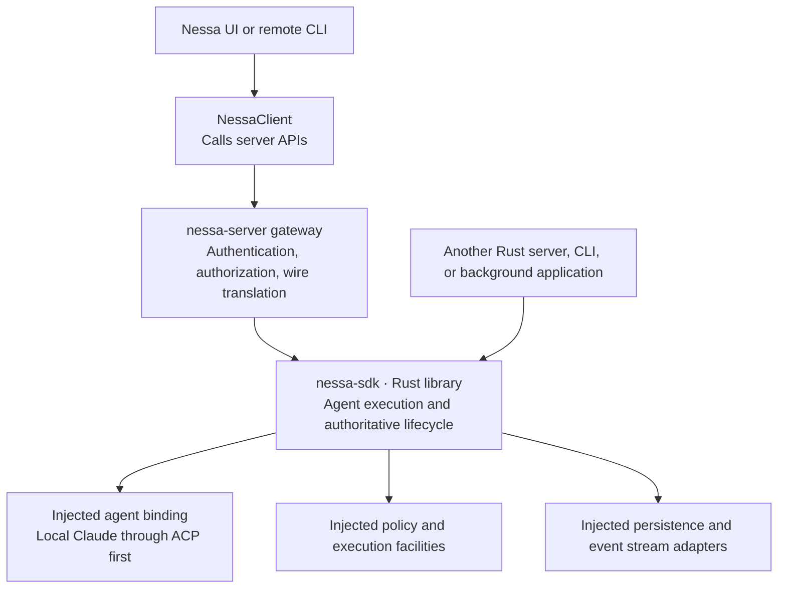

# 0008. Build nessa-sdk as the reusable Rust agent runtime

## Purpose

Build one reusable Rust agent runtime that the server embeds to execute and
control agent conversations. NessaClient calls server APIs; the runtime owns
execution, lifecycle, and creator/surface provenance.

- **Date:** 2026-09-07
- **Status:** proposed — awaiting review and approval; implementation has not started
- **Supporting research:** [Server runtime research](../../design/agent-sdk-shape-research.md)

## Proposal for approval

Build one reusable agent SDK: **`nessa-sdk`, a Rust library**. Nessa's server
embeds it to run and control agents. Other Rust servers, CLIs, and background
applications can embed the same library without Nessa's gateway, desktop app,
or TypeScript client.

**NessaClient calls the server API.** The existing `packages/nessa-client`
(`@nessa/client`) remains the connection and API client used by the UI.
There is no planned TypeScript SDK. Agent execution, orchestration, and
lifecycle authority run on the server through the Rust `nessa-sdk` and its
bindings. The client sends commands and displays returned state and events.

The first working integration is a local Claude agent through ACP. Additional
agent harnesses, SDK workers, services, and model adapters follow when needed.
Approval covers this architecture and the staged delivery scope below; the ADR
remains proposed until reviewed. This document change does not authorize starting
implementation before that approval.

## Context and current behavior

Nessa needs an agent runtime reusable outside its server, and a convenient remote
API for its UI. Putting execution rules into gateway handlers would tie them to
Nessa's transport. Putting them into the TypeScript client would make each client
responsible for server behavior and leave no reusable server library.

Today the authenticated gateway and NessaClient connection exist. The temporary
`conversation.echo()` operation returns the supplied text. The new Rust crate,
agent execution, and durable conversation/turn operations in this ADR are planned features, not existing functionality.

Agent integrations have different responsibilities. A complete harness can own
its agent loop, tools, and native sessions. A model API alone supplies none of
those. Nessa should expose useful capabilities honestly, including tools,
approvals, structured output, and native controls, without pretending every
binding supports the same behavior.

## Architecture and ownership

| Component | Owns |
| --- | --- |
| `nessa-sdk` | Agent selection/preflight, effective run configuration, conversation and turn identities, admission and state transitions, execution coordination, steering/interruption, typed interactions, normalized events/results, mutation deduplication and recovery semantics |
| `nessa-server` | Authentication, Nessa product authorization, trusted caller context, wire adapters, subscription delivery, and composition of SDK dependencies |
| Agent binding adapters | Translation to/from ACP or another integration, native session mapping, supported capabilities, provider event normalization, and integration-specific failures |
| Host composition | Concrete binding/policy/storage choices, credentials, process facilities, resource limits, startup, draining, and shutdown |
| Existing `NessaClient` | Authenticated connection and recovery, request-ID generation, API calls, event subscriptions, reconciliation, and explicitly stale client projections |
| UI or orchestration layer | Presentation and follow-up input policy: queue, steer, or interrupt then send; queue editing, ordering, and persistence |

The gateway maps authenticated requests into SDK application commands. The SDK
checks injected policy and lifecycle contracts before admitting work; direct
embedding must supply an authorized host policy context too. Neither selecting a
provider nor choosing local use bypasses policy. Local use stays independent of
hosted signup.

One SDK coordinator owns admission and authoritative state for a conversation.
The server and client do not maintain competing state machines. The first version
uses exclusive ownership of its durable store as required by ADR 0009; this is
not a plan for multiple processes concurrently owning the same conversation.

## Rust library boundary and reuse

Proposed home: `crates/nessa-sdk`, consumed as a Cargo workspace library by
`crates/nessa-server`. Its initial internal structure follows the repository's
existing domain/application/adapters boundaries and grows only as needed.
Publishing a public crate or promising a stable external API is a separate release
decision; reuse does not require publishing first.

The SDK application defines typed commands, results, errors, and narrow ports.
Domain rules depend on domain types, not application DTOs, wire payloads,
providers, databases, or UI. Adapters translate outside types inward. Shared wire
schemas remain the source for remote payloads; they are mapped to SDK commands
rather than becoming the runtime's domain model.

Construction uses typed constructor/factory injection following
[the existing DI pattern](../../design/dependency-injection.md). Inject binding,
policy, durable records/events, clocks, ID generation, and content or process
facilities where a real operation needs them. Do not create a global registry,
service locator, mutable process-wide runtime, or speculative empty subsystems.
The SDK does not depend on NessaClient, WebSocket handlers, React, Redux, or Tauri.

A second Rust application must be able to:

1. Construct its own concrete adapters and SDK instance.
2. Supply trusted caller context and an explicit policy implementation.
3. Create/load a conversation, send input, observe events/results, and control a
   supported turn through typed Rust operations without opening a gateway socket.
4. Shut down and drain its resources explicitly, independently of another instance.

Rust export names and signatures will be finalized during implementation. The
contract is a transport-independent runtime with the operations below. A direct Rust host supplies
stable mutation IDs through its caller boundary; a convenience facade can use an
injected generator, but must retain IDs for reconciliation and identical retries.

## Conversation and turn contract

| Operation | Planned behavior |
| --- | --- |
| Discover agents/models | Return catalog choices and actual binding capabilities in the authorized workspace/profile context |
| Create a conversation | Resolve the selected binding/model, perform preflight, validate effective configuration, and return its durable identity and capabilities |
| Load a conversation/turn | Read authoritative persisted state by identity so a new client can reconnect without creating new work |
| Send input | Admit one new turn, then return its identity; execution continues independently of the initiating connection |
| Steer a turn | Submit input to that exact active turn at a supported boundary; return a typed rejection when unsupported or no longer active |
| Interrupt a turn | Request that exact turn stop; acknowledgement is distinct from terminal completion |
| Observe status/events/result | Expose correlated progress, typed interactions, and a terminal outcome; support durable replay under the stream contract |
| Answer an interaction | Apply an authorized, turn-correlated response to an outstanding approval or input request, rejecting stale or duplicate conflicting answers |

Creation resolves catalog entry, binding revision, workspace/profile, and required
settings inside the SDK. Missing or ambiguous context is a typed error. Caller
input selects among composed bindings; it cannot install infrastructure, supply
arbitrary launch commands, or invoke arbitrary provider methods. Failed preflight
or unsupported configuration cleans up any partial native session.

The coordinator atomically permits one active turn per conversation. Competing
new sends receive `turn_busy`. A queued UI draft has no admitted turn identity.
Steering must not silently start a new turn or interrupt/restart an existing one.
An interrupt can race with successful completion; the committed terminal outcome
is authoritative. Closing a socket or event iterator does not cancel execution.

An external harness retains its own loop and tool ownership. Nessa normalizes
its observable lifecycle and controls through the binding; it does not wrap an
ACP harness in a second tool loop. A future Nessa-owned agent may use model/tool
adapters behind the same boundary, but implementing that loop is outside the first
delivery scope.

Capabilities determine support for controls, attachments, structured output,
tools, approvals, subagents, resume/fork, and extensions. Common operations must
have explicit semantics; provider-specific operations use named, validated types.
Unsupported capabilities fail explicitly. No raw provider SDK object or arbitrary
method/options tunnel is exposed. Resume, replay, fork, and restart remain distinct.

## Creator and surface provenance

Include provenance in the first conversation/turn implementation. Authorized
plugins, surfaces, and other Rust hosts use the same conversation operations;
plugin-created work is an ordinary durable conversation with recorded origin.
The client uses that metadata to decide which conversations to list or group.

| Field | Meaning and source |
| --- | --- |
| `createdByPrincipalId` | Creator of a conversation or turn, derived from authenticated/trusted caller context; callers cannot set another principal |
| `surfaceId` | Stable identity of the surface that submitted creation, validated against the caller's allowed surface identities |
| `surfaceInstanceId` | Optional reference to the specific registered surface instance when available; distinct from the stable surface identity and disposable connection |

Conversation creation records its creator and surface immutably. Each new turn
records its own creator and surface rather than inheriting the conversation's
creator. Steering, interruption, and interaction responses also retain their own
actor/surface provenance in committed action records. For example, a panel may
create a conversation, a plugin may submit a turn, and another authorized surface
may interrupt it; the original conversation provenance remains unchanged.
Conversation ownership/organization remains a separately resolved authorization
fact, not something inferred from its creator or surface string.

`SurfaceId` is an open, validated string-backed domain type, not a closed enum.
The shared product protocol defines its canonical format and a catalog of
well-known Nessa surface IDs. Extend the existing protocol generation workflow
to emit matching Rust and TypeScript wire types/constants and validators or
validation constraints. Generated TypeScript here is the existing API contract,
not a TypeScript SDK. The SDK adapter maps wire values into its domain type;
domain code does not import transport DTOs.

Reserve `nessa.*` for Nessa-owned surfaces; plugin/user namespaces allow additional
IDs without regenerating a closed list. Names such as `nessa.panel` and
`plugin.<registered-plugin-id>.<surface-name>` illustrate the proposed convention;
the exact grammar, length bounds, and initial catalog are finalized with the
schema. Add constants only for actual Nessa surfaces in the approved delivery.
An unknown but well-formed authorized custom ID is valid and must round-trip
without being coerced to a known Nessa surface.

A client-supplied surface ID is a claim until validated. Host composition supplies
explicit caller-to-surface/namespace bindings through the SDK policy seam; Nessa's
gateway resolves them from trusted registration or provisioning. Plugins may
create multiple surface names within their authorized namespace. A prefix alone
proves neither plugin identity nor permission: plugins cannot impersonate Nessa
or another plugin by choosing its prefix. Direct Rust hosts supply equivalent
trusted provenance and policy. A background caller uses an explicitly provisioned
surface identity rather than borrowing a UI identity. Existing local provisioning
labels such as `surface:<label>` are principal IDs, not the new surface catalog;
map them explicitly and do not rename existing credentials as part of this field.

Do not add server-side `visibility`, `hidden`, or presentation `scope` fields.
The UI decides whether to show plugin work in normal chats, keep it in a particular
surface, or present it elsewhere. Surface provenance alone does not restrict
access: actual confidentiality and control use the existing resource/policy
boundary. A surface filter cannot grant access or substitute for authorization.

Creation/read/list results and relevant committed events expose provenance to
authorized consumers. Conversation listing supports an optional exact origin
`surfaceId` filter applied together with authorization before pagination; clients
can also implement their own presentation rules from returned metadata. An
unknown surface stays distinguishable so the client can apply its own fallback.
Loading, replaying, or attaching from another surface never rewrites origin.
Mutation deduplication includes the validated initiating provenance: retrying an
ID with conflicting surface/actor context must not change attribution or expose
another caller's receipt. If older durable records need migration, preserve an
explicit unknown origin rather than inventing a creator.

## Identity, durability, and failure behavior

| Identity | Meaning |
| --- | --- |
| `conversationId` | One durable Nessa conversation, independent of a connection or native provider session |
| `turnId` | One admitted turn; its messages, tools, interactions, and events refer to it |
| `requestId` | One logical mutation, retained across reconciliation and identical retries |

NessaClient generates a request ID once per mutation. Sending, steering,
interrupting, and answering an interaction each have their own request ID.
Advanced callers can supply one explicitly. IDs are not embedded in one another.
The SDK scopes deduplication to the authorized operation context: an identical
retry returns the recorded receipt; reusing an ID with a conflicting payload
fails. Admission and its recoverable receipt must be committed coherently before
successful admission is acknowledged.

The SDK owns semantic records and recovery rules. The external stream dependency
from [ADR 0009](0009-reusable-event-stream-crate.md) owns committed ordering,
append deduplication, cursors, and replay-to-live delivery. Nessa integrates its
real API through injected adapters; it does not implement a competing stream
runtime or assume an opaque event append alone provides mutation transactions.
Integration must establish the atomicity required for admission and receipts.

Durable committed records are the source of truth. Live events and client caches
are projections. Reconnection uses recorded mutation identity and replay cursors;
it never silently resends an uncertain prompt with a new ID. History loss,
stream gaps, and slow consumers produce explicit recovery/error behavior. Client
state remains marked stale until reconciled.

Durability does not promise recovery of provider output never committed, automatic
resumption after a process crash, or exactly-once external tool effects. Recovery
must reconcile native sessions where supported and report an explicit unknown or
failed outcome where it cannot establish what happened. It must not rerun side
effects to guess. SDK shutdown stops admission and coordinates bounded draining
and binding cleanup through host-owned facilities.

Execution permissions and process isolation are separate concerns. The first ACP
binding must declare its actual filesystem/tool access, cancellation limits, and
cleanup behavior. Required isolation must be enforced by host facilities or the
operation rejected; the SDK must not silently claim sandboxing it does not provide.
A general-purpose isolation platform is not part of this first implementation.

## Server API and NessaClient

The server exposes authorized operations for discovery, conversation creation and
retrieval, turn submission, steering, interruption, interaction responses, and
state/event retrieval. Gateway adapters translate these requests into Rust SDK
operations and return their results. All agent loops and execution coordination
run on the server side, either in nessa-sdk for a Nessa-owned agent or in a
server-managed harness binding for an external agent.

NessaClient sends those API requests through its existing authenticated connection
and receives results/events. It handles transport bookkeeping and reconnection;
it does not execute agents or own lifecycle decisions. This ADR proposes no new
TypeScript SDK package or SDK-specific handle API. Exact API payloads and client
methods are defined with the server protocol during implementation.

The UI consumes its injected conversation gateway/effects seam. Connections stay
outside Redux. Provider credentials and process execution stay on the server.
The UI chooses whether a follow-up steers, waits, or interrupts then starts a new
turn. For stop-and-send it waits for the server's terminal outcome before sending
new input. The runtime does not silently queue new-turn requests. This is separate
from the collaboration design's peer inbox: `next_turn` delivery does not authorize
starting a future turn.

## Delivery plan after approval

| Stage | Deliverable and completion gate |
| --- | --- |
| 1. Runtime boundary | Add the Rust crate and typed operations/ports needed for the first binding; prove direct embedding with substituted adapters and two isolated runtime instances |
| 2. Durable lifecycle | Integrate the actual external stream crate and local durable adapter; establish admission/receipt atomicity, immutable creator/surface records, replay, reconciliation, restart behavior, and explicit shutdown |
| 3. First real agent | Select and test a concrete Claude ACP adapter release; implement discovery, configuration, send, events/results, required interactions, interruption, and honest capability reporting |
| 4. Server and client integration | Compose the SDK in nessa-server, add authorized wire adapters, shared provenance schemas/generated surface constants, and origin filtering, connect the existing NessaClient to those APIs, and connect the UI through its injected gateway |
| 5. End-to-end acceptance | Verify a real local Claude conversation, supported controls, reconnect/restart behavior, policy denial, failure cleanup, and UI follow-up dispatch; replace the temporary echo path |

Discovery and binding evaluation can proceed while the existing stream dependency is being
reviewed and integrated. Durable delivery cannot be declared complete until its real dependency
and atomicity contracts are available. Test adapters are allowed for isolation
checks; they are not substitutes for a production durable integration.

Update affected protocol/design documentation as each stage lands. This ADR
supersedes earlier manual-preflight/client-only API sketches in
[ADR 0011](0011-nessa-session-protocol-and-authorities.md) and supporting research.
It locates conversation execution authority in the SDK behind the gateway while
preserving gateway authentication/product policy, external stream ownership, and
[ADR 0012's harness boundary](0012-agent-harnesses-and-optional-tools.md).
Wire operation names and payloads are finalized with schema changes. Replace singular `conversation.echo()` callers
when real operations land without keeping competing aliases.

## Acceptance criteria

- A Rust host uses the SDK without Nessa server, TypeScript, a socket, or Tauri.
  Two composed instances isolate state, clocks, credentials, and adapters.
- Substituting binding/storage/policy adapters preserves the application contract;
  policy denial remains enforced for remote and directly embedded callers.
- A real local Claude ACP binding creates a conversation, completes a turn, emits
  correlated events/results, handles its required interactions, and cleans up.
  Unsupported steering is rejected honestly if that release cannot support it.
- Concurrent sends admit only one active turn. Tests cover duplicate mutation IDs,
  conflicting payloads, stale interactions/steering, and interrupt/completion races.
- Disconnect, slow-consumer, replay/live handoff, crash, and restart tests establish
  what is durable and what remains unknown without duplicate prompt/tool execution.
- NessaClient reconnects and retrieves existing work; projections expose gaps and
  staleness. The UI dispatches a queued follow-up only after terminal completion.
- Platform-sensitive process and storage behavior is checked on supported platforms;
  unavailable capabilities produce clear errors, not silent fallback.

- Provenance tests cover conversation creation by one surface, a turn by another,
  and control by a third; creator identity is derived and origins remain immutable.
  Reserved/foreign namespace spoofing is rejected, authorized custom IDs round-trip,
  and generated Rust/TypeScript contracts agree. Origin filters preserve permission
  checks and pagination; retries/replay preserve attribution. UI listing rules are
  independently testable without changing server access policy.

## Deferred scope and remaining implementation choices

A TypeScript SDK is not planned. The first delivery does not include a Nessa-owned
tool loop, every provider adapter, hosted signup, cloud replication, multi-process
writers, a general workflow/queue engine, or public package release. Future
capabilities are added when a real integration requires them.

Implementation must record the external stream package/version and transaction
contract, concrete Claude ACP adapter version and supported controls, Rust public
signatures, surface namespace/provisioning rules and initial catalog, wire schemas, and bounded timeout/resource defaults before declaring
their stages complete. These are explicit implementation choices; this ADR does
not treat them as already verified. Any finding that changes the ownership,
durability, policy, or first-delivery scope requires an ADR update for review.

## Alternatives and consequences

Keeping execution inside gateway handlers would prevent independent embedding.
A client-only SDK would not meet the server reuse requirement. Separate agent
runtimes in Rust and TypeScript would duplicate lifecycle rules. Passing through
provider APIs would expose their differences to every caller. The chosen design
centralizes runtime semantics while retaining a convenient remote client.

The cost is maintaining typed adapters, capability mappings, recovery contracts,
and the client/wire mapping. The benefit is one testable execution authority that
can serve Nessa and other Rust hosts. Provider differences remain explicit, and
the UI retains control of its interaction policy.
