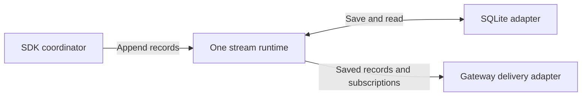

# 0009. Integrate the standalone event-stream library

## Purpose

Let the runtime and gateway read the same saved conversation history. That history
also records which commands were accepted, so a lost reply does not cause work to
run twice. Connect the existing stream library through a small adapter.
ADR 0008 owns conversation behavior; ADR 0011 owns delivery to clients.

- **Date:** 2026-09-04; revised 2026-09-07
- **Status:** proposed Nessa integration — external implementation exists; Nessa integration remains
- **Library:** [nessalabs/event-stream](https://github.com/nessalabs/event-stream)
- **Related:** [0008 — runtime](0008-agent-client-api.md),
  [0011 — shared access](0011-nessa-session-protocol-and-authorities.md),
  [0005 — local data roots](../done/0005-stage-scoped-local-data.md)

## Current state

Checked 2026-09-07: the upstream [README](https://github.com/nessalabs/event-stream#readme)
describes a memory runtime, optional SQLite adapter using bundled `rusqlite`,
cursor tokens, and replay/live subscriptions. Its
[manifest](https://github.com/nessalabs/event-stream/blob/main/Cargo.toml) identifies
unpublished package `event-stream` 0.1.0. Release and performance checks are still
incomplete. Nessa's manifests and lockfile do not yet include the library. The
requirements below still need to be tested in Nessa.

## One instance, one record source

The server's startup code opens the local storage adapter and creates one stream
runtime for that store. It passes the SDK and gateway small interfaces defined by
their application modules. Both use the same runtime. Conversations and subscribers
share it instead of reopening the same files. Separate application instances get
separate stores and dependencies.

For example, two windows watching one conversation should see the same saved
record 43. Opening the second window must not start another writer or another
agent. See [why we use semantic records](../../ARCHITECTURE.md#why-append-semantic-records-to-the-stream)
for the reason to put this API above SQLite.

| Owner | Responsibility |
| --- | --- |
| External library and store adapter | Save each record completely or not at all; handle append retries, record order, cursor checks, read/subscription limits, replay followed by live updates, and opening/closing the store |
| `nessa-sdk` under 0008 | Define what records mean; accept commands; build state and receipt lookups from records; translate provider updates; decide how to recover |
| Nessa composition | Choose the stage/instance path, adapter, and limits; create dependencies and shut them down in the right order |
| Gateway under 0011 | Check access, translate records to wire messages, limit socket delivery, and close subscriptions |

The Nessa adapter translates types and errors using the library's actual public
API. The library already owns cursor allocation, replay buffering, its write-ahead
log, and subscription scheduling; do not implement those again in Nessa. Keep
Nessa conversation, policy, provider, UI, and WebSocket types out of the generic
library. Expose only the operations the runtime and gateway need.

The first production store is local SQLite under ADR 0005's stage/instance root.
Only one runtime may own that store at a time. Use memory storage to test replacing
adapters. Other stores, replication, snapshots, history retention rules, raw-input
capture, and generic decoders wait for a real need. The ACP binding already parses
its protocol; do not parse its decoded records again.

## Commit and read contract

ADR 0008 defines one record for each accepted command. It contains the input in
its standard form, verified information about who sent it, the allocated IDs, and
the acceptance response. A **commit** means storage confirms that the whole
record was saved. Commit before starting work or replying that it was accepted.

That record is also the **receipt**: proof of what Nessa accepted. State and receipt
indexes are views rebuilt from the records. Saving acceptance and its receipt in
one record avoids coordinating separate writes to separate databases.

For example, Nessa may save a prompt and start the agent just before the socket
disconnects. Retrying with the same `requestId` retrieves the saved acceptance;
it does not start a second turn.

The integration must demonstrate:

- Retrying an append with the same event ID and bytes returns the original record
  and cursor. Different bytes with that ID fail. Keep both unchanged on retries.
  An event ID identifies one record; `requestId` identifies one product command
  that changes state. Preventing duplicate records does not enforce the SDK's
  rules for accepting commands.
- Reads and subscriptions use saved records. A live notification tells readers
  to check the store; it does not carry a separate authoritative copy. Never send
  a provider update to the transcript before saving it.
- A **cursor** marks a position in one stream. Subscriptions return records after
  that position, then keep delivering new records in order, with no gap between
  replay and live updates. Let the library handle that changeover.
- Return specific errors for a cursor from another stream incarnation (a different
  lifetime of the stream), a cursor ahead of saved history, missing history, or a
  subscriber that falls behind. Socket sequence numbers are not saved-history
  cursors. The creation control stream and conversation streams have no shared
  ordering or transaction.
- Keep receipts and duplicate-detection history for the store's lifetime in this
  delivery. If storage reaches its limit, return a typed error. Do not silently
  delete history or make earlier retry IDs stop working.

Pin a reviewed library revision and test these requirements. Fix missing behavior
in the library or revise the architecture before relying on it. Do not build a
competing local implementation. Other features on the library's roadmap do not
need to finish before this Nessa integration can ship.

## Failure and lifecycle boundaries

| Condition | Required Nessa behavior |
| --- | --- |
| Append definitely rejected | Return a typed error; do not return a success receipt or start the provider for that command |
| Unsure whether the record was saved | Keep the same event ID and input. Pause affected new commands and check the store before starting or retrying work. A timeout alone does not prove the write failed |
| Storage unavailable during execution | Limit buffered output, slow the producer where supported, then stop and clean up affected work within a deadline. Cleanup must run even if writes fail; never claim a final outcome was saved when it was not |
| Slow subscriber | Close its subscription when it exceeds the limit. It can resume from its last applied cursor. Its socket must not delay the producer or other clients |
| Process restart | Load saved records and rebuild indexes. Let the SDK save recovery decisions for uncertain attempts before accepting new work |
| Another owner opens the same store | Fail startup clearly; never silently create a second writer or switch to memory |

If a failure affects one stream, block that conversation's coordinator. If it
affects the whole store, block all writers to that store. The adapter must prove
which case applies. Reads can continue only if it can still return valid saved
records. Do not add a global network or command lock to hide these boundaries.

The server's startup/shutdown code owns this shutdown order:

1. Stop accepting new work.
2. Let SDK coordinators finish or cancel provider tasks and clean up their
   processes within a deadline, following
   [ADR 0008](0008-agent-client-api.md#interruption-and-resource-cleanup).
3. Save the outcomes that can be confirmed, then stop record producers.
4. Flush pending writes, close the stream runtime, and release the store.

Closing subscriptions and sockets has a deadline too. Cleanup must still run if
storage fails. If cleanup cannot be confirmed, report the failure and prevent
reuse of the affected binding. Releasing a store lock does not prove old processes
have exited. If an outcome could not be saved, check it during startup recovery;
do not report that it was saved. The SDK, binding, and host facilities supervise
processes. The generic stream library handles records.

Test each durability claim separately. Surviving a process restart does not prove
survival after a power loss. The store cannot recover output it never saved, and
it cannot guarantee that an external tool action happened exactly once. Record
the tested platform/storage guarantees and limits.

## Delivery and completion

1. Pin the dependency and enabled features. Review its public APIs and durability
   evidence. Give the local adapter explicit limits and an owner that closes it.
2. Implement Nessa's small record/read adapters. Through real SQLite, test saving
   a whole acceptance record, recovering control and primary streams (including
   pending or empty creations), identical append retries, cursor errors, writes
   during the replay/live changeover, and exclusive store ownership.
3. Verify lost acknowledgements, storage failures, slow subscribers, restart and
   shutdown, and independent application/store isolation on supported platforms.
   Measure performance with Nessa's expected workload and record the limits.

This ADR can finish with a small test producer and subscriber in Nessa. A live
Claude binding, collaboration inbox, and MCP package are not required. The library
tests its general algorithms; Nessa tests that its adapter preserves the behavior
Nessa needs. ADR 0008's real conversation tests and ADR 0011's gateway/client replay
tests then check the full path. They need not repeat the entire library test suite.

Keep this ADR in `todo/` until that integration evidence exists. Supporting
[session/stream requirements](../../design/session-and-stream-contracts.md) refine
these requirements; their API sketches are not a second library to implement.

## Consequences

Saving one set of records avoids keeping two independent stores in sync and
building replay twice. We still need to verify the dependency, design records
that can rebuild SDK state, and handle failures within clear limits. This is enough
to support the first conversation without waiting for the library's whole roadmap.
