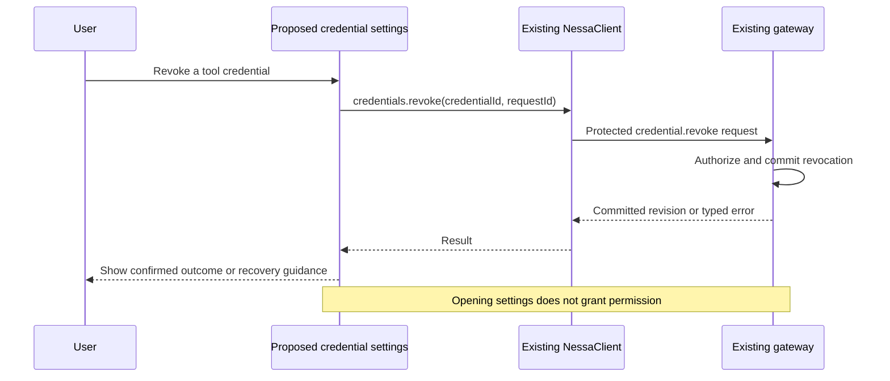

# 0011. Remaining local authentication workflows

- **Date:** 2026-09-06
- **Status:** proposed; the workflows below are not implemented yet.
- **Builds on:** [0010 — local authentication](../done/0010-local-authentication.md).
- **Scope reviewed against:** [PR #18](https://github.com/nessalabs/nessa-agent/pull/18).

## What this decision is about

Local authentication already works. The gateway checks tokens and permissions,
the panel loads its own token, and the command-line tools can create and revoke
credentials. Windows, Linux, and macOS have passed the platform integration tests.

The remaining work is to make these operations easier to use from the app and to
measure how the local gateway behaves under heavier use. We should build on the
existing auth system, not create another login or permission path.

For example, if a tool loses access, the user should be able to understand why and
manage that tool's credential from settings. Today the underlying operations exist,
but the user generally needs the command-line tools to perform them.

## The words used here

| Word | Meaning | Example |
| --- | --- | --- |
| Credential | The server's record of a token and its permissions | A tool may read server health but cannot create other tokens |
| Revoke | Stop a credential from authorizing new operations | Remove access from a tool you no longer use |
| Recovery | Restore access after a token is missing, expired, or revoked | Reprovision the panel's token through trusted local setup |
| Registry | The private file holding access records and mutation receipts | Records survive a gateway restart |
| Capacity | How much the configured registry can hold | A maximum number of credential records |

## What PR #18 already finished

These are no longer items to implement in this ADR:

| Completed behavior | Where it is explained or verified |
| --- | --- |
| Panel uses the authenticated product protocol and loads its assigned token through the native host | [Local setup and surface credentials](../../guides/local-auth.md) |
| Owner and ordinary credentials have no expiry by default, with optional expiry and separate grants per surface | [ADR 0010](../done/0010-local-authentication.md) |
| SDK handles typed close reasons, bounded reconnect, and cleanup of pending requests | [SDK guide](../../../packages/nessa-client/README.md) |
| Registry capacities and connection deadlines are configurable without rebuilding | [Runtime settings](../../guides/local-auth.md#configure-limits-without-rebuilding) |
| Normal requests and socket writes have no global admission mutex; admitted work may finish after revocation | [Operation admission](../../guides/local-auth.md#operation-admission-and-revocation) |
| Closing one session does not close its peers; revoking a shared credential affects its sessions but not unrelated credentials | [Gateway/SDK integration test](../../../scripts/smoke-auth.mjs) |
| Private Windows ACL storage and platform lifecycle checks work | [Passing Windows, Linux, and macOS CI run](https://github.com/nessalabs/nessa-agent/actions/runs/34085966204) |
| Legacy shared-token access and protocol fallbacks were removed | [Current gateway contract](../../reviews/local-auth-gateway.md) |

Platform checks must keep passing as the code changes. That is ongoing regression
coverage, not an unimplemented Windows support task.

## What remains

### 1. Explain access problems and guide recovery in the app

The SDK already distinguishes a temporary disconnect from expired, revoked, or
invalid access. The app needs a clear user-facing flow built on those results.

For example, “Your panel token was revoked” should explain the next local setup
step. It should not repeatedly retry that token or silently replace it with an
owner credential. A normal permission denial should explain the missing action
without pretending that the whole connection is broken.

This is complete when missing-token, expired-token, revoked-token, permission-denied,
and temporarily-unavailable cases have understandable messages and working next
steps, tested through the app. The existing command-line recovery path remains
available. Any future in-app recovery operation needs the same trusted OS boundary
as offline recovery; an unauthenticated gateway caller cannot grant itself access.

### 2. Manage credentials from settings

Provide a settings flow for viewing credentials, creating a restricted credential,
and revoking one. Use the existing SDK administration APIs and server permission
checks. Do not infer administrative access from a client name or a visible button.

The user should see who a credential belongs to, what it can do, and whether it
expires. A newly issued secret is delivered once to protected storage. Later
listings show metadata, not the secret. Delivery failures must explain that the
credential may already exist and how to revoke/reissue it; they must not blindly
repeat issuance with a new request ID.

The following is a proposed settings interaction. The SDK and gateway operations
already exist; the settings screen does not.

This is complete when an authorized user can perform those operations from settings,
an unauthorized user cannot bypass the server checks, and failure cases preserve
the existing one-time-secret and explicit-retry behavior.

### 3. Make large registries manageable

The former hardcoded capacity problem is fixed: users can raise limits in
`config.json` and restart. Capacity exhaustion does not automatically close healthy
sessions. Automatic cleanup and paginated listings are separate, unfinished work.

Start by measuring listing size and response time with realistic larger registries.
If paging is needed, define and test it across the store, protocol, SDK, and settings
screen. If old records are to be removed, first define how long revocations and
request receipts must be retained. Deleting them must not revive access or make an
old request silently create another credential.

This is complete when larger supported registries have a tested listing path and
a documented retention decision. Keeping bounded records with configurable capacity
is a valid outcome; automatic compaction is not required without evidence that it
is needed. Errors must continue to point users to the working capacity/recovery path.

### 4. Measure load and decide which additional bounds are needed

Slow-socket isolation is already tested. What is still unknown is the gateway's
latency and resource use with many connections or frequent credential mutations.

Measure those cases with the real authorization and persistence paths. Use the
results to choose supported operating bounds and, if necessary, connection or work
quotas. Requests rejected by a quota must not affect unrelated sessions or bypass
authorization. Avoid selecting another concurrency architecture before measuring
the current one.

This is complete when the supported load and failure behavior are documented and
any required bounds have regression coverage. The existing per-connection write
timeouts and admission-time authorization remain in place.

## What is outside this ADR

- **Hosted login and broader tenancy:** these need a separate provider decision.
  [Identity research](../../design/auth/identity-tenancy-and-cloud.md) records
  possibilities; local authentication does not depend on selecting one.
- **Live policy reload:** embedded policies already work. Reload is not a local-auth
  requirement unless we decide users need to change policies without a restart.
- **Push-based idle invalidation:** polling is implemented and configurable. The
  revision notification port could reduce delay, but integrating it is an optional
  improvement, not a second unfinished revocation system.
- **Authorization for future streams and terminals:** add action/batch checkpoints
  when those operations exist, under [ADR 0007](0007-nessa-session-protocol-and-authorities.md).
  One admission must not grant an unlimited stream of future actions.
- **MCP packaging and agent harnesses:** those stay in
  [ADR 0009](0009-agent-harnesses-and-optional-tools.md).

## How this record becomes complete

Keep this record in `todo/` while its remaining workflows are proposals. Finish or
explicitly narrow the four areas above, link their implementation and tests, then
move this same record to `done/` and update the index. Do not require completed
platform work or unrelated future providers to be implemented again.

[ADR 0010](../done/0010-local-authentication.md) describes the working auth system.
The [local guide](../../guides/local-auth.md) explains how to use it today, and the
[gateway review](../../reviews/local-auth-gateway.md) records its current limits.
