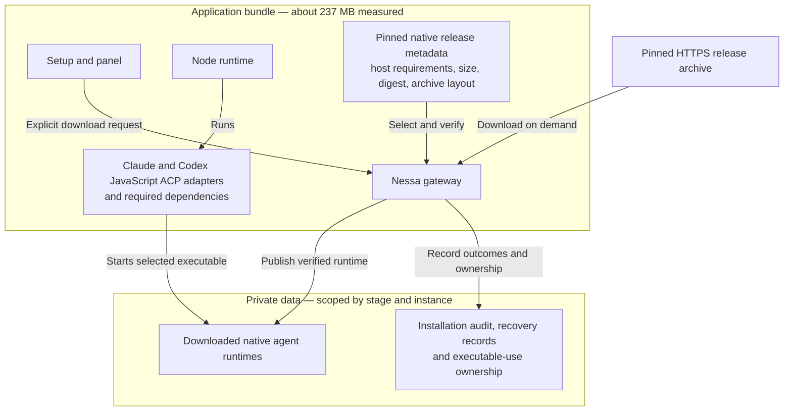
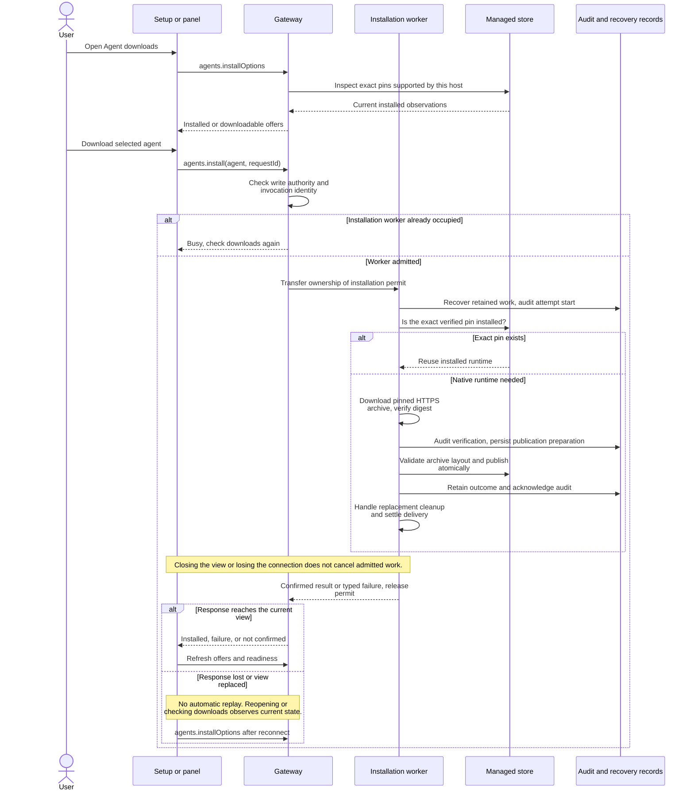
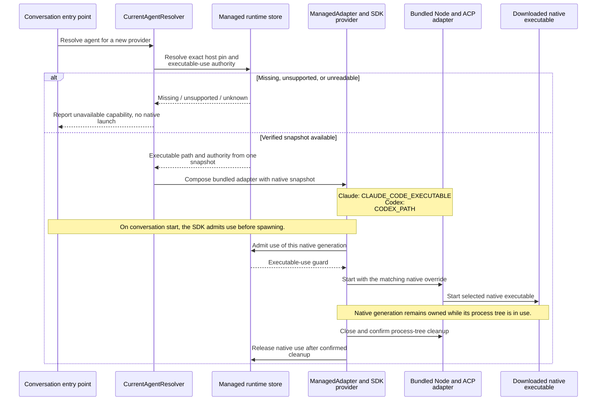
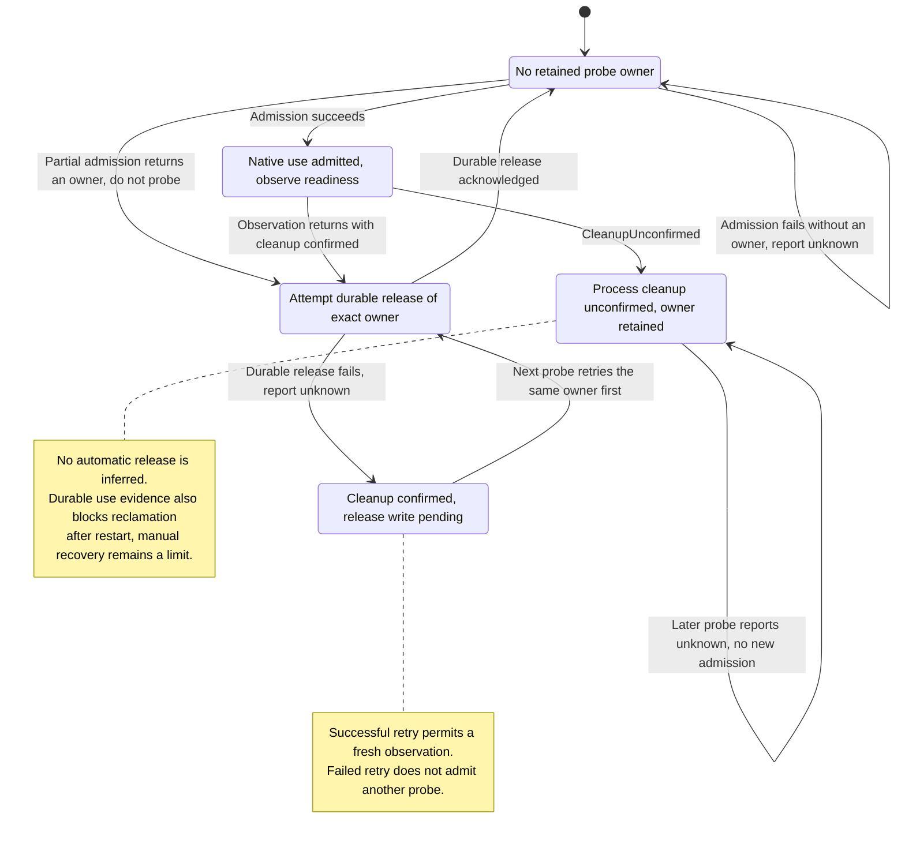

# 173. Download native agent runtimes on demand

- **Issue:** [173](https://github.com/nessalabs/nessa-agent/issues/173)
- **Decision:** implemented; local macOS arm64 verification complete
- **Scope confirmed:** 2026-09-27. Download native runtimes; keep Node and the
  JavaScript adapters and their required dependencies bundled.

## Problem and decision

The measured installed macOS application contains 760.43 MB of files. Native
Claude and Codex binaries account for approximately 489 MB. Node and the small
JavaScript ACP adapters remain application resources. Packaging installs the
locked adapters with optional native packages omitted and install scripts disabled.
The native releases remain pinned to the versions in those same lockfiles.

Nessa offers explicit downloads in setup and the panel's Agent downloads view.
The authenticated gateway chooses the release for its host, downloads it into
its private stage/instance namespace, verifies the digest and archive layout,
and publishes through the existing audited installer. No URL, destination, or
executable path is accepted from the surface. Closing the view does not cancel
the worker. A disconnected or timed-out caller sees an unconfirmed result and
can check the installed state before trying again.

An exact managed installation is reused. Discovering arbitrary executables on
PATH, supported version ranges, downloading Node or adapters, and automatic
background updates are outside this decision. The earlier proposed version-range
and adapter-directory design is superseded by this explicitly selected scope.

## What ships and what downloads

The app remains able to start before an agent is installed. The download lives
in the gateway's private data namespace, outside the application bundle.

This removes approximately 489 MB of bundled native packages. Users still need
the agent's own sign-in; installing its executable does not authenticate it.
OpenCode uses the existing native installer too, but is not part of the newly
removed Claude/Codex bundle weight.

## Download sequence and lost responses

This diagram summarizes the gateway path; the existing installer owns the
lower-level publication and recovery transitions. The CLI uses that same
installer and OS account ownership. Its exclusion is enforced by the store,
while the gateway additionally limits itself to one installation worker.

The sequence shows a successful fresh publication. Failures can interrupt any
step: download/verification failures do not claim installation, while uncertain
publication or audit delivery returns **not confirmed**. The refreshed installed
flag is an observation of the runtime on disk, not an acknowledgement of the
previous request's audit. Another invocation uses the installer's retained
recovery evidence before proceeding. Cleanup warnings can accompany a confirmed
installation; they do not mean the new runtime is missing.

## Ownership and launch

`agent_install/application/gateway.rs` owns the surface's installation port.
Composition provides the existing installer, pinned releases and verified OS
account. `product/agent_install.rs` checks authenticated write authority through
the existing dispatcher. It retains one installation permit inside the blocking
worker through publication and audit, independently of the waiting connection.

The OS account remains the installation/reclamation owner shared with the CLI.
Gateway invocation identity is a structured JSON tuple of the gateway tag,
agent, authenticated organization/principal/credential, and client invocation.
This preserves exact caller attribution without changing ownership when a
credential rotates. Domain validation allows a larger invocation identity than
an account identity to accommodate the authenticated tuple.

`CurrentAgentResolver` resolves Claude and Codex from the managed store on
readiness, cold opening, model/mode changes and session deletion. A live
conversation retains its existing provider. `ManagedAdapter` derives both the
native environment override and the hosted Node launch authority from one
verified native snapshot. Claude receives `CLAUDE_CODE_EXECUTABLE`; Codex receives
`CODEX_PATH`. Existing SDK process-use admission protects that native dependency
until ACP process-tree cleanup completes.

### Launching an installed runtime

A new provider resolves the current native snapshot. An already running
conversation retains its provider and native generation; an installation does
not switch the executable underneath it.

Admission failure prevents launch. Uncertain cleanup does not authorize release;
the SDK owns conversation-process cleanup, while readiness retains ownership as
shown in the following state diagram.

### Readiness probe cleanup states

Readiness's restricted Codex login-status command owns a process group. Cleanup
keeps the root unreaped while it signals the group once, then observes a finite
interval. The unreaped root prevents group-ID reuse before that signal.
Unknown cleanup retains its exact
native-use guard and blocks further status probes for that agent in this
process; durable evidence prevents reclamation after restart too. Failed durable
release after confirmed cleanup retains the guard for the next probe to retry.
An uncertain process is never reported as released. Resolving such retained
unknown cleanup across process restart remains a manual recovery limitation of
the existing durable executable-use mechanism.

The state machine below describes managed readiness probes, including Codex's
status subprocess, rather than the separate installation worker. Retained
ownership is handled before looking up the current runtime: a failed release
can be retried even if that runtime is now missing or unreadable. Native lookup
is omitted from the diagram; it must succeed before fresh admission. The
retained guard belongs to the exact admission, not merely to an agent name.

The enforcers are [the authenticated gateway dispatcher](../../../crates/nessa-server/src/product/agent_install.rs),
[the shared installer](../../../crates/nessa-server/src/agent_install/application/install.rs),
[managed adapter composition](../../../crates/nessa-server/src/composition/managed_adapter.rs),
[the current-agent resolver](../../../crates/nessa-server/src/composition/current_agent.rs),
and [Codex status-process cleanup](../../../crates/nessa-server/src/agents/infrastructure/codex.rs).
The following table connects these diagrams' failure orderings to regression evidence.

## States and ordering

| State / event | Result and owner | Regression evidence |
| --- | --- | --- |
| Fresh packaged launch, native missing | Gateway starts; readiness says missing; download offered | managed adapter missing/install/removal test; native download smoke |
| Exact pin already installed | Reuse; no network download | installer tests; native download smoke |
| Successful explicit download | Verified publication and audit precede success; refresh readiness | installer tests; gateway/UI tests |
| Runtime present, sign-in absent | Installation and authentication remain separate | readiness tests; native download smoke |
| Offline / corrupt / disk failure | Typed failure; no claimed success | installer boundary tests; gateway/UI mappings |
| Two clicks or competing connections | UI coalesces; gateway admits one worker | download UI and lost-waiter tests |
| Caller disappears after admission | Worker keeps permit through completion; no cancellation claim | lost install waiter test |
| Interrupted install / restart | Existing delivery recovery and atomic publication apply | installer delivery/recovery tests |
| Replacement with active agent | Native use authority protects superseded artifact | managed adapter authority and SDK cleanup tests |
| Unsupported platform | No offered pin; no invented fallback | pin and installed-launch tests |
| Changed model / mode / deletion | Fresh managed resolution; existing conversation remains pinned | current-agent tests |
| Store unreadable | Unknown, not missing | managed adapter store-failure test |
| Probe admission partly fails | No spawn; exact pre-spawn owner retained if release fails | managed_probe_failure_transitions_retain_the_admitted_owner_until_its_release |
| Probe process cleanup unconfirmed | One retained owner; no new probe for that agent | managed_probe_failure_transitions_retain_the_admitted_owner_until_its_release; status_cleanup_removes_descendants_after_root_exit_and_after_timeout |
| Durable probe release fails | Retry same owner on next probe before admitting another | managed_probe_failure_transitions_retain_the_admitted_owner_until_its_release; managed_probe_retries_the_same_release_before_observing_another_runtime |
| Source changes while UI waits | Late result cannot mutate replacement view | download UI tests |

## Verification and limits

Native archives are measured, not copied from release metadata. Pins describe
platform, libc and processor requirements. This macOS arm64 workspace can run
that target end to end; other target archives can be verified structurally here,
but their executable behavior requires their native CI runners.

The browser client API supports downloads to the gateway host. The download
controls are composed into the desktop setup and panel. Standalone gateways
with explicitly configured launch commands do not expose the managed-download
capability, since installing a managed binary would not change those commands.

Local verification on 2026-09-27 measured the new app at 236.91 MB versus the
installed 760.43 MB (file bytes, about 69% smaller). Omitting the native packages
accounts for 489.24 MB; other release-binary differences account for the remaining
reduction. The app bundle passed fingerprint and ad-hoc signature verification.
The local build disabled updater artifacts through a command-line configuration;
distribution signing/notarization and updater signing still require release CI.

`scripts/agents/smoke-native-downloads.mjs` passed for both agents using the
rebuilt bundle's slim adapters: fresh downloads, verified publication, CLI reuse,
native `--version`, ACP initialization, and installed state after gateway restart.
It uses an isolated home and namespace and makes no model request. The full
server suite and targeted UI/client, protocol, packaging, architecture, type,
lint and documentation checks passed. Deliberately removing admission/cleanup
retention, native authority/override wiring, UI lifetime/coalescing, or native
package omission caused the corresponding regression tests to fail before the
production code was restored. Native visual UI and non-arm64 execution remain
unverified in this workspace.
