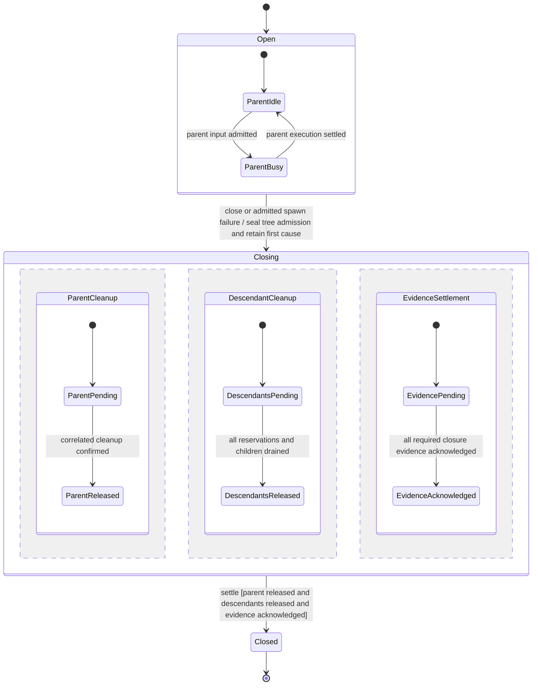
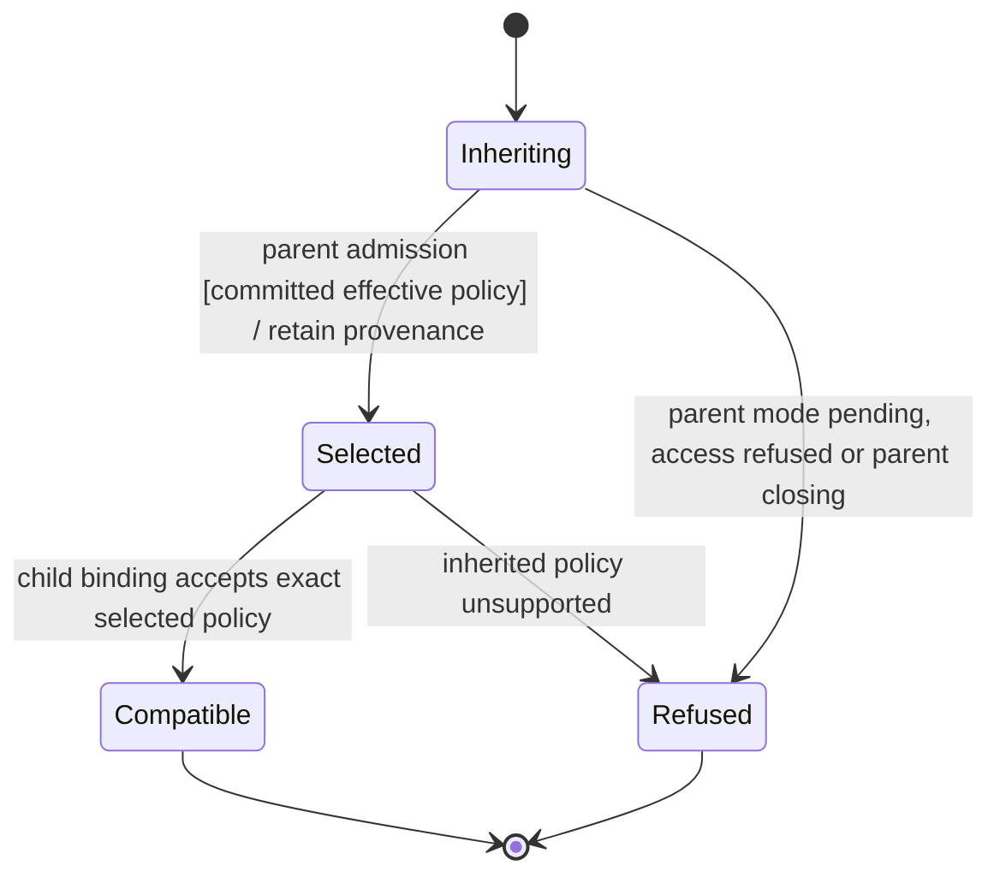
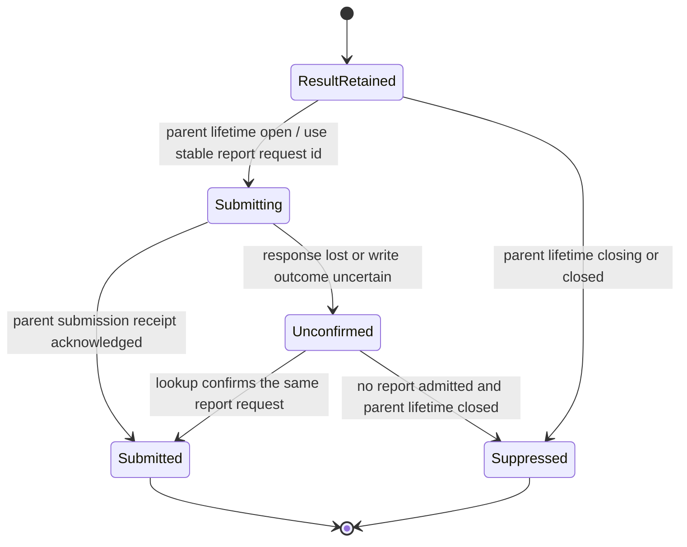
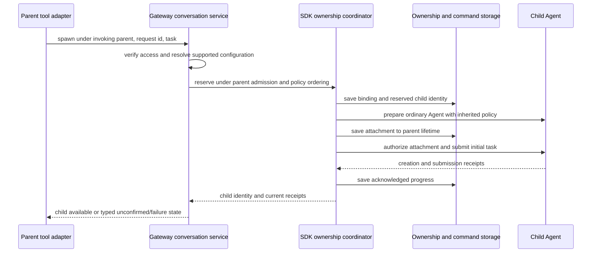
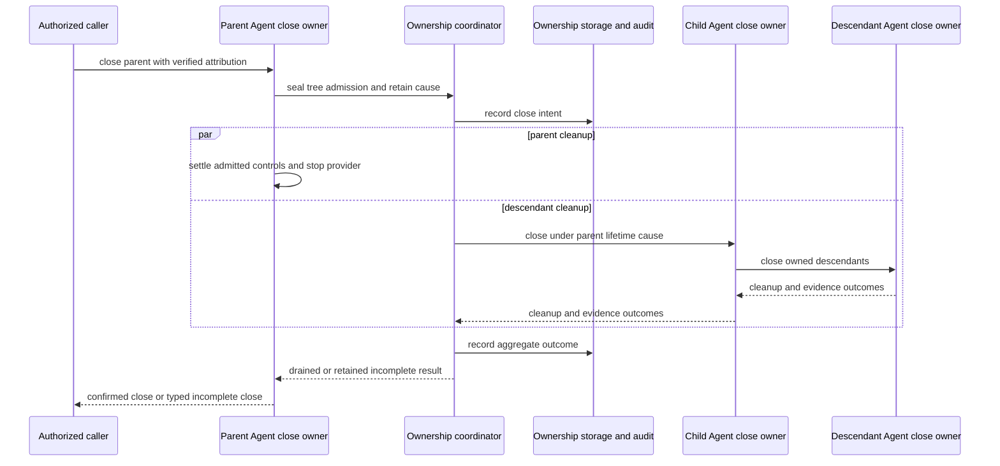
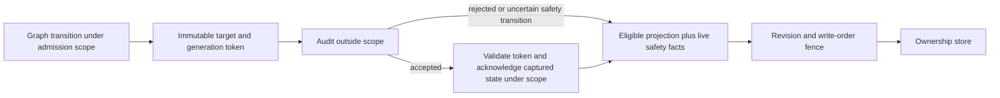

# 329. Subagents use ordinary Agents with parent ownership

## Purpose

A conversation can delegate work to other agents. Each child uses the ordinary SDK
`Agent`, has its own conversation and history, and records which parent created
it. Parent ownership adds approval-policy inheritance, child discovery, result
delivery and recursive closure.

The desktop groups these children under their parent through one subagents
vertical. Experiments can consume that vertical without owning a second agent
runtime or transcript renderer.

- **Date:** 2026-09-30
- **Runtime direction recorded:** 2026-10-05
- **Status:** proposed implementation design. The parent-ownership, recursive
  closure and default approval-inheritance decisions below were specified by the
  product owner. Implementation recommendations remain proposed until their
  slices land.
- **Tracking:** #329; existing desktop slices #330–#332; experiment adapter #337.

## Decisions

1. **A subagent is an ordinary Agent with a parent relationship.** It uses the
   existing provider, scheduling, permission, storage and cleanup contracts. The
   relationship belongs to a running conversation, not to a reusable agent
   definition, display name or selected workspace pane.
2. **Closing a parent closes its descendants.** The owning coordinator fences
   child creation, requests recursive cleanup and joins completion. Children may
   work concurrently and across parent turns while the parent remains open.
   There is no detach operation that lets children outlive their parent.
3. **Children inherit the parent's effective approval policy by default.**
   Creation asks the existing configuration owner for that policy. Child approval
   answers and audit use the ordinary Agent permission machinery.
4. **Presentation and execution are separate.** A child is a real conversation
   even when the workspace groups it beneath its parent instead of listing it
   as an independent root. Its transcript uses the ordinary conversation view.
5. **Each behavior has one owner.** Agent schedules an individual conversation;
   the ownership coordinator coordinates relationships and tree cleanup. The
   gateway authenticates and authorizes access. The desktop consumes projections
   and submits commands.

## Current foundation

The implemented [Agent guide](../../../crates/nessa-sdk/docs/agent_execution/agent.md)
and [permission guide](../../../crates/nessa-sdk/docs/agent_execution/permissions.md)
describe the current single-conversation contract. Agent clones share one
scheduler and provider context. The session manager retains an exclusive storage
lease. Confirmed physical cleanup and acknowledged audit delivery are separate
facts. Durable creation receipts, queued submissions, steering and permission
answers already exist.

The gateway's `ConversationService` resolves one shared Agent for each authorized
conversation. Metadata owns the principal, organization, provider selection,
model and approval mode. Approval-mode changes are serialized with turn
admission. `conversation_session` is the one mapping from product
`ConversationId` to SDK `SessionId`.

The desktop widget host, id encoder and transcript views exist. The read-only
subagents vertical exists as a sample panel. Live parent-child integration is
not implemented. The earlier
prototype (`exp-prototype` at `5bfaa225`) is a visual reference; implementation
follows the owning modules on current `main`.

The ownership contracts below are proposed. Existing single-Agent durability
alone does not implement them.

## Ownership and module boundaries

```text
authenticated client / Nessa tool adapter
                    |
                    v
gateway conversation use cases -- access, owner metadata, product mapping
                    |
                    v
SDK ownership coordinator -- child creation, relationships, tree close, recovery
                    |
             +------+------+
             v             v
       parent Agent    child Agent -- its own scheduler, session and provider
                           |
                           v
                  ordinary session records

desktop SubagentSource <-- gateway relationship/read projection
desktop transcript    <-- ordinary ConversationView for the selected child
```

Arrows are commands or reads. The coordinator composes ordinary Agents; it does
not execute another model loop or schedule their individual turns.

| Owner | Responsibility | Proposed location |
| --- | --- | --- |
| SDK domain | Parent binding, lifetime identity, legal relationship/close transitions and bounded tree rules | `crates/nessa-sdk/src/domain/agent_execution/subagents/` |
| SDK application | Spawn supervision, ownership persistence, admission ordering, recursive close and recovery through ports | `crates/nessa-sdk/src/application/agent_execution/subagents/` |
| SDK infrastructure | Ownership records and leases using the shared SQLite runtime | Feature child under `crates/nessa-sdk/src/infrastructure/session_storage/` |
| Agent lifecycle | Individual invocation, controls and provider cleanup; common stop transition used by tree closure | Existing `application/agent_execution/agents/` |
| Gateway conversation | Current access, metadata, configuration selection and product mapping of SDK relationships | Existing `crates/nessa-server/src/conversation/` layers |
| Product protocol/client | Current typed command/read shapes and generated vocabulary | `protocol/product/v1.json`, `nessa-protocol`, `packages/nessa-client` |
| Nessa tool adapter | Model-facing delegation over authenticated gateway operations | Feature module under `crates/nessa-mcp/src/` |
| Desktop | Joined source, selection, panel and parent-header accessory | `src/desktop/subagents/` |

Add module maps with implementation and mirror feature vocabulary in tests. Domain
code performs no clock, process or storage effects. Infrastructure owns codecs.
Composition injects storage, clocks, factories and audit ports using the existing
[typed dependency injection](../../design/dependency-injection.md) pattern.

### Coordinator integration with Agent

The existing Agent lifecycle remains the authority for individual work admission.
Today `Agent::close` cleans up a provider attachment and allows later invocation;
automatic stop can also recover queued work. Ownership lifetime closure therefore
needs a typed disposition at that authority, not an unconditional hook on every
attachment stop. The proposed dispositions are `AttachmentOnly` and
`EndOwnedLifetime`, selected before effects and retained with the stop operation.

`AttachmentOnly` covers ordinary recoverable provider cleanup: it fences that
attachment through the existing controller, preserves the ownership lifetime and
children, and permits the existing confirmed cleanup/recovery path. Explicit
owned-parent close, actual terminal lifetime failure, final owning-handle disposal,
delete and gateway retirement select `EndOwnedLifetime`. That selection seals
spawning and descendant work and supplies the tree drain through the same
lifecycle authority. A concurrent lifetime-ending close upgrades lifetime
admission to sealed even if attachment cleanup began as recoverable; it does not
replace the attachment's earlier physical cause or lose already-observed results.

Gateway approval-mode recovery currently explicitly closes and replaces its Agent.
For the first implementation it selects `EndOwnedLifetime` and drains that tree
before replacement. The reopened root uses the last committed policy and a new
ownership lifetime; preserving children across this explicit retirement is outside
this first design. A successful idle mode change that needs no retirement does
not end the lifetime and follows the snapshot-inheritance recommendation below.

For an Agent carrying ownership, `maybe_reopen`, immediate invocation, queued
admission and attachment authorization consult this typed lifetime disposition.
After `EndOwnedLifetime`, an existing clone cannot admit work against the sealed
identity just because physical cleanup finished. A root may acquire a new lifetime
through an explicit host-authorized reopen at the ownership coordinator; a closed
child cannot renew its sealed relationship. Bare Agents without owned relationships
keep their current close/reopen behavior. Register this participation once during
construction so SDK and gateway paths share the decision instead of relying on
caller discipline.

The tree domain owns attached relationships and creation reservations. It does
not keep another independently writable copy of the parent's execution state.
Reservation and parent closure share one admission ordering. A closing ancestor
excludes new work anywhere below it; child command admission consults that owner
and acquires the ordinary child work permit in the same short ordered decision.
There is no check-then-enqueue gap. The implementing SDK slice establishes one
tree-admission scope for these decisions: acquire it before an individual
lifecycle permit and release it before awaiting effects or acquiring a semantic
writer lease. No individual lifecycle lock waits for tree admission. Gateway mode
admission precedes tree admission when selecting policy. Child commands and
ancestor close use that same scope, including restored Agents and existing
clones; a gateway-only precheck cannot enforce this contract.

Avoid strong reference cycles: the participant must not retain its parent in a
way that prevents the parent's lifetime from ending. Use the existing lifecycle
owner and non-owning upward notifications. The coordinator retains child cleanup
owners until settlement, independently of UI subscribers or waiting callers.

### Authoritative data and integration seams

These are the contracts the implementation must expose, not a second scheduler.
Type names other than `AgentLifetimeId` and the stop variants remain choices for
their owning slice. Publish one SDK contract and map it at the gateway boundary.

| Fact or seam | Authority and required content |
| --- | --- |
| Ownership binding | SDK immutable child/parent lifetime and session identities, spawn request binding, typed verified origin and selected configuration/provenance; the ownership store alone writes this graph. |
| Lifetime admission | SDK tree transition owner supplies the ancestor fence; `SessionLifecycle` issues individual work permits and owns the typed stop selection. Construction registers participation before attachment authorization. |
| Spawn progress | Ownership operation retains reservation and references to ordinary creation/attachment/submission receipts. Those receipt owners remain authoritative for their milestones; no copied provider readiness or queue state. |
| Child factory port | SDK application consumes a prepare-only factory returning an ordinary Agent or the ordinary initialization failure with retained cleanup ownership. Gateway composition supplies provider/configuration, metadata and session mapping; attachment is authorized only after ownership acknowledgement. |
| Ownership storage port | SDK application requests acknowledged binding, progress, close intent and settlement writes under a bounded writer lease, plus bounded reads. SQLite implements it on the shared record runtime; custom adapters face the same restoration validation. |
| Close outcome | Existing individual cleanup reports retain attachment cause, physical release and audit outcome. The tree owner adds lifetime cause/initiator, target obligations and aggregate settlement without relabelling those reports. |
| Product identity/configuration | Gateway metadata and `conversation_session` own access, recorded provider/model/approval selection and `ConversationId` to `SessionId` mapping. Root/child lifetime identity comes from the SDK publication. |
| Result/read projection | Ordinary child history owns task outcome; relationship reads reference it. Foreground tool response and optional asynchronous report retain their distinct delivery owners. Desktop ids and activity are projections. |

A restored child requires the matching parent lifetime and its own admitted
configuration binding before its lifecycle grants a permit. A factory result and
every later effect carry their original session/lifetime/operation/attempt correlation. A result
cannot supply missing authority needed to validate itself.

## Identities and durable relationships

A child receives a fresh `ConversationId` and corresponding SDK `SessionId`. Its
provider context, execution ids, queue, reviews and history belong to that child.
Construction uses the ordinary factory for a new session. Sharing the parent's
Agent inner state or session id would merge scheduling and permission authority.

The immutable binding records:

- Child SDK session and child lifetime identity.
- Parent SDK session and owning lifetime identity.
- Originating parent execution and tool identity when created by a tool.
- Stable spawn request identity and immutable request binding.
- Effective child configuration and inherited-policy provenance at admission.

Reuse existing identity types where their meaning matches. `AgentLifetimeId` is
the proposed additional identity for distinct openings of one saved conversation.
Mint it when ownership begins; retain it across recovery of that lifetime. A
completed close seals it. Reopening the same conversation starts a new lifetime
and does not adopt the old lifetime's children. Provider attachment generations
and turn ids are separate identities.

Roots also have a lifetime record so restoration can prove that a child's named
parent lifetime exists. The SDK ownership store owns the relationship. Product
metadata and desktop sources consume its publication, rather than writing another
parent graph. Lookup indexes are derived atomically from these bindings.

Reparenting is outside this design. Nested spawning attaches a fresh child to the
actual invoking child. Restoration validates matching owner lifetimes, unique
request bindings, tree bounds, absence of self-parenting and absence of cycles.
Invalid ownership refuses dispatch without rewriting retained history. Names,
avatars and tags are attributes, not cleanup or execution identities.

### Ownership state machine

The proposed lifetime states are `Open`, `Closing` and `Closed`. Physical cleanup
and evidence delivery are retained per target alongside that state; a single
boolean cannot represent both. The tree transition owner enforces this table,
while ordinary Agent controllers continue to enforce their own execution states.

| State | Event | Next state and effect |
| --- | --- | --- |
| Open | Admitted spawn | Open; retain one reservation under its stable request binding |
| Open | Close from caller, terminal lifetime failure or final owner disposal | Closing; seal admission and retain the first cause before asynchronous effects |
| Closing | Constructor returns a child | Closing; attach it to the drain, without dispatch permission |
| Open | Constructor returns a child whose own lifetime is already closing or closed | Parent stays Open; do not dispatch, and do not report that refusal as the parent closing. The child's own close owns cleanup |
| Closing | A target reports cleanup/evidence | Closing; apply only correlated results and retain unresolved obligations |
| Closing | All parent/descendant resources released and required evidence acknowledged | Closed; publish the aggregate receipt |
| Closing | Waiter leaves, deadline passes, or one target fails | Closing; retain supervision and return an incomplete result when observed |
| Closing or Closed | Another close | Join/read the original operation; preserve its cause and prior evidence |
| Closed | Request to reopen the saved conversation | No transition on this lifetime; create a new root lifetime through ordinary host admission |

Spawn progress retains the reservation, prepared child, tree attachment and
initial-submission reference. These are relationship facts, not another provider
attachment state machine. Existing creation/attachment/submission receipts supply
their authoritative progress. Uncertain startup retains its reservation and
cleanup ownership. An initial rejected publication never starts the factory and
returns its unused live slot; the retained binding still identifies the original
attempt. A later Prepared, Attached or TaskAdmitted publication failure retains
actual cleanup ownership and any provider-acknowledged task receipt; capacity
remains held until actual physical Released evidence. A rejected startup with no
cleanup owner records `Ended` and returns its unused slot, while the admitted
child lifetime is sealed `Closing` under row 38. Neither `Ended` nor a returned
slot proves absence or `Closed`; actual rejection absence and Completion settle
through the [owned-settlement table](#owned-settlement-and-supervision-625-646-649). Uncertain initial publication retains its slot.

## Statechart design contract

Apply the [statechart authoring guide](../../state/authoring.md) to four linked
owners: an Agent ownership lifetime, a spawn operation, approval selection and a
child-result delivery. The relationship graph connects instances. It does not
make every child a nested state of its parent's execution machine.

These charts are proposed specifications. The existing Agent still owns each
conversation's execution/attachment states; the ownership coordinator consumes
those facts and their correlated outcomes. Transition tables below are the
regression source, and the diagrams summarize their composition.

### Ownership lifetime and concurrent cleanup

`Open` can contain different parent activities without repeating closure rules.
One enclosing close transition seals admission regardless of activity. Children
have their own linked Agent charts and can remain working while the parent is
idle. Starting/attachment detail stays in the existing Agent owner rather than
being copied into the tree domain.



`--` denotes separately evolving facts, not separate threads. The aggregate
checks its settlement guard after each relevant outcome and when entering
Closing, including an empty child set. Required final evidence depends on the
cleanup results it describes; progress is concurrent but completion order must
respect that dependency. An uncertain cleanup/audit leaves its region pending
with a retained typed failure. It is not a successful final state.

Repeated close is handled internally by joining the original owner, not an
external self-transition that restarts cleanup. A late constructor is handled by
the descendant drain with no dispatch authority. Reopening is a new chart
instance/lifetime, not a transition from Closed back to Open on this identity.

### Spawn operation

```mermaid
stateDiagram-v2
    [*] --> Checking
    Checking --> Refused: access, parent, policy or room refused
    Checking --> Admitted: reserve and acknowledge immutable binding
    state Admitted {
        [*] --> Reserved
        Reserved --> Prepared: child prepared with owned startup evidence
        Prepared --> Attached: ownership attachment acknowledged
        Attached --> TaskAdmitted: original submission receipt acknowledged
    }
    Admitted --> Draining: ancestor close, the child lifetime is not open, or stop dispatch
    Admitted --> StartupFailed: rejected startup still holds a cleanup owner
    StartupFailed --> Ended: that owner reports physical release
    Admitted --> Ended: rejected startup held no cleanup owner
    Admitted --> Unconfirmed: uncertain publication or interrupted original attempt
    Unconfirmed --> TaskAdmitted: lookup confirms original child and submission
    Unconfirmed --> Draining: closing lifetime or retained failed attempt
    Draining --> Ended: dispatch was refused; physical release may still be pending
    TaskAdmitted --> [*]
    Refused --> [*]
    Ended --> [*]
```



The linked lifetime chart owns sealing independently of this spawn progress.
Canonical row 38 synchronously seals an admitted child's actual shared gate and
lifetime on typed failure before fallback evidence awaits. Joining an existing
close preserves its first cause; lookup conflicts and pre-admission failures do
not revoke another attempt's child. This does not imply physical release.

Completion of this spawn chart means its admission operation settled, not that
its child's task finished. Refusing dispatch records `Draining` and then `Ended`
even when physical release is still pending; the child lifetime stays `Closing`
until that release is confirmed. Creation and submission receipts remain separate.
An unchanged retry finds the same binding; it does not re-enter Checking to pick
another policy. Unconfirmed has no automatic edge that repeats provider dispatch.
Actual creation progress may confirm only a partial milestone; lookup updates
those authoritative receipts without synthesizing TaskAdmitted.

### Approval selection



This is one selection operation. Its snapshot recommendation is defined in
[approval inheritance](#approval-inheritance). Parent policy and child selection
share admission ordering; a selected snapshot is immutable while normal policy
owners continue to enforce applicable live access constraints. An automatic
approval is still a normal child's permission decision with its own attribution.

### Result delivery

The asynchronous report path has its own operation chart. Foreground tool replies
continue through their existing tool-response owner; this chart does not replace
that owner's wire-delivery or retry semantics.



Submitted means admitted into ordinary parent scheduling, not model consumption.
If lookup confirms a report was admitted before closure, retain that fact and its
normal cancellation/result receipt even if the parent has since closed. Closure
cannot relabel accepted work as never sent. No report creates a new ownership
lifetime or reopens a sealed parent.

### Event selection and effect supervision

| Owner | Event and ordering contract | Refusal, deferral and effect contract |
| --- | --- | --- |
| Ownership lifetime | Serialize spawn reservation, child attachment and lifetime close under one admission authority. Existing Agent mode/turn admission supplies its own coherent facts. | An ancestor fence refuses new work. Close seals admission before effects; repeated closes join the first cause. |
| Spawn | Stable request binding selects one original attempt. A closing lifetime takes every already-owned reservation into its drain, including a same-poll constructor success. | False access/policy/capacity guards return typed refusals. Uncertain saved progress stays owned for lookup/reconciliation, with no blind dispatch retry. |
| Approval selection | Read one committed effective selection under parent mode ordering; correlate the selection with its spawn/lifetime. | Pending/uncertain mode refuses this spawn rather than queuing behind an unbounded policy update. Unsupported binding refuses before attachment. |
| Result delivery | Parent report admission races closure at the normal submission owner; the receipt decides whether work was accepted. | Close suppresses a not-yet-admitted report. An uncertain prior admission must be looked up before deciding suppression or retry. |

Complete a local state decision before admitting another event to that owner.
The decision returns correlated effect requests; storage, provider, audit and
child-cleanup effects run through ports outside that critical section and return
outcomes tagged with lifetime/operation/attempt identity. Keep their supervisors
alive after caller loss. This does not claim one atomic transaction across
ownership storage, semantic storage, audit and provider processes.

Do not infer a universal priority from nesting. For this design, ancestor closure
wins future admission once its fence is selected; already-admitted decisions and
already-observed results retain their established meaning. Same-poll readiness
and both arrival orders belong in S5/S8 and C3/C7/C12. Stale outcomes cannot
advance a new lifetime. Retain their original owner/evidence; conflicting outcomes
for the same attempt are typed failures, not silently ignored updates.

No unbounded deferred event queue is introduced. Spawn/refused operations return
immediately; ordinary child submissions use the existing bounded scheduler.
Supervised uncertain effects and close drains have explicit ownership/bounds and
remain distinguishable from deferred user input. Pure domain types enforce legal
configurations; application owners perform effects and acknowledgement.

## Approval inheritance

### Selection at creation

Creation obtains the parent's committed effective approval configuration under
the same admission ordering used for parent mode changes. This includes the
binding's actual approval mode and permission-offer policy supplied to the child
adapter. Existing host rules, where implemented, remain evaluated by their owner
and scope. This design adds no separate rule engine.

**Recommended first implementation:** capture that configuration at child
admission, record its provenance and apply it through the child's ordinary
provider factory. New children use the parent's current committed configuration.
A pending or uncertain parent mode change refuses spawning until its owner settles
it. An idempotent retry retains the originally selected policy.

This recommendation provides default inheritance at creation. It does not claim
live propagation to existing children. A parent mode change leaves existing
children at their recorded modes; the interface shows those actual modes. A
future tree-wide policy-change command needs its own ordering table for busy
children, concurrent spawning and partial application.

Inheritance copies configuration, not previous answers. Allow Once belongs to
its original review. A stored rule applies to a child only when its existing
owner says the scope covers that child. Parent credentials, permission handles
and request-specific grants are not duplicated as child authority.

### Overrides and provider support

The first model-facing spawn command exposes no approval override. An explicit
host-authorized override can be added through the same policy/configuration
owner. Do not invent a strictness ordering over provider mode names or infer
policy equivalence from labels.

A provider that cannot implement the inherited mode or offer policy returns a
typed unsupported-policy outcome before attachment. There is no silent substitute.
Provider/model selection passes normal capability and readiness validation; it
does not grant broader access.

### Reviews and attribution

Child permission requests use the existing Agent controller and audit port. Their
session, execution, tool and permission identities remain the child's. The gateway
adds parent context to the read projection so the person can identify the
requesting delegation. The answering actor remains the verified person or
policy actor; the parent agent does not supply human consent.

Parent closure invokes each child's normal review-cancellation path. Preserve
both the child target and root closure cause/initiator. Answers already admitted
before closure follow the ordinary sealed-control drain. Resolved reviews are
not relabelled cancelled. Cancellation evidence does not prove that a tool effect
was rolled back or a provider process terminated.

## Configuration and context handoff

Default provider, model, committed approval configuration and workspace come from
the parent. An explicit supported model/provider selection is resolved through
the normal catalog. A different model can keep inherited approval behavior when
its binding supports that policy.

Build the delegated prompt through the existing immutable prompt representation.
Supply the task, applicable instructions and bounded explicit context references.
The first implementation begins an independent child history. Whole-history
handoff, selected-context handoff and provider-native fork are distinct
capabilities; cloning an opaque provider context is not assumed.

Use normal MCP composition for each child. Tools/apps use that child's upstream
sessions, relay grant and SDK identity. A parent does not lend its relay token or
app mount to a child. Composition owns executable launch configuration; the model
cannot select arbitrary launch commands through spawn.

Acquire image holds for the child through the existing authorized attachment
owner before admitting their references. Copying a reference alone creates no
hold. Non-image filesystem paths continue to follow the current local file-link
contract; a named path does not grant permission to read it.

## Spawn sequence and retries

Provide one SDK-owned spawn operation, consumed by the gateway after host access
admission. The request names the parent lifetime, verified origin, stable request id,
delegated prompt/context, and optional supported model/provider choice. The model
cannot supply a parent credential: the host resolves the parent from its verified
invocation binding.

Use a typed origin: a parent execution, with the observed tool identity when
available, or an explicit host command with verified caller attribution. An idle
parent can receive a host-authorized spawn; it does not need a fabricated running
execution. For model-originated calls, composition/relay supplies trusted session
binding and the gateway validates execution correlation. Model-provided parent,
execution or tool fields cannot establish that correlation. If a binding cannot
provide the necessary trusted correlation, refuse model-originated spawning until
the adapter supplies it. The current shell MCP adapter does not implement that
delegation context; adding its propagation is part of the tool slice.

1. Check current access and the parent lifetime/execution, then resolve supported
   configuration through its existing owner.
2. Reserve creation capacity under parent admission. Closure and reservation
   have one winner. Select committed effective policy in that same ordering.
3. Persist the immutable spawn binding and reserved child identity; acknowledge
   required audit intent before a provider can be dispatched.
4. Create child metadata and prepare an ordinary Agent using current creation
   and attachment contracts. The reservation owns provisional startup, including
   failed constructors with uncertain resource cleanup.
5. Attach the prepared child to its parent before first provider dispatch. If
   closure won meanwhile, hand the child to the closing owner instead.
6. Submit the initial task through the ordinary durable submission operation with
   an id bound to the spawn request. Retain creation and task receipts separately.
7. Publish progress after the corresponding storage acknowledgement. Return
   identities and receipts that distinguish preparation, attachment and task
   admission from task completion.



The sequence is proposed. Extend the consuming creation composition deliberately:
current durable creation does not attach a child atomically to its parent. Calling
`create_command` and recording a parent afterward leaves an unowned-child window.
The child factory must not dispatch before the binding is acknowledged.

A repeated request with the same immutable binding finds the same child and
receipts. Changing the task, configuration or parent lifetime under that id is a
conflict. Retries preserve the first policy selection and child identity, even
if the parent policy changed after admission.

Lost responses do not prove failed creation. Retain unconfirmed progress until
lookup/reconciliation supplies evidence. Follow the current creation contract:
an interrupted provider attempt is not automatically repeated because its response
was lost. Caller disappearance does not submit another task. A retained initial
submission is recovered by its existing identity.

## Controls and result delivery

Expose thin operations for spawn, list/status, read, send/steer, wait and close.
Their exact product/tool names belong to the implementing slice. Sends use the
ordinary submission contract; steering uses the supported native operation or
existing boundary steering. Wait observes a child submission receipt and grants
no additional execution authority.

The first delegation slice can ship spawn, read/wait and explicit child close.
Messaging and proactive reports follow once those foundations pass their tables.
The first desktop slice can remain read-only without creating a special execution
runtime for children.

Result delivery retains the child session, exact submission and terminal result
reference. Foreground delegation returns through the originating parent tool call.
A later answer may enter the parent's normal follow-up queue only while the named
parent lifetime remains open. Its durable delivery id is bound to the stable child
result; reconnect/recovery does not create another independent report.

A late answer after parent closure stays in child history. It does not reopen the
parent or create a new parent turn. A child failure is visible to its parent but
does not automatically close siblings.

Provider-native subagents are a separate observation capability. Treat them as
controllable children only when the adapter establishes identity, inherited policy
and recursive closure semantics. A tool title or nested output is insufficient.
The first runtime creates Nessa-owned child Agents through composition.

## Parent lifetime and closure

### What closure means

The decision applies to the actual parent Agent lifetime. Explicit conversation
close, terminal failure that selects `EndOwnedLifetime`, final owning-handle
disposal, deletion, approval-mode recovery retirement and gateway retirement
enter the common ownership-close path. Their typed disposition is selected at
the existing lifecycle authority as defined above.

Turn completion, ordinary idle state and exact-turn Stop do not end the lifetime.
Children may finish work across parent turns. Closing a pane/tab/socket currently
detaches a view; it does not close the Agent. Archive changes catalogue visibility.
A recoverable stop classified `AttachmentOnly` does not close the ownership
lifetime or its children when the normal Agent remains eligible for recovery.
This differs from the explicit approval-mode recovery retirement defined above.

### Common close sequence

1. The normal Agent close owner seals parent admission and, in the same ordering,
   fences child creation and new descendant work. Retain the first cause and
   initiator for this lifetime.
2. Persist closing intent and its ownership scope. Include reserved/prepared
   children; a live-only snapshot would miss an in-flight constructor.
3. Stop the parent's active work and request each child's ordinary close. Each
   child recursively seals and closes its descendants. Parent cleanup proceeds
   alongside descendant cleanup, so a parent waiting for child output cannot
   deadlock the drain.
4. Join constructors and admitted controls through their existing supervisors.
   A child produced after the fence shares its sealed admission gate; a
   substitute submission-port call is not runnable permission. A failed
   reservation that held a cleanup owner returns capacity only after actual
   physical Released evidence. Initial rejected publication never starts the
   factory and returns unused capacity; later publication failure retains actual
   cleanup ownership and any acknowledged task receipt until physical release.
   Rejected startup with no cleanup owner records Ended and returns unused
   capacity, but its admitted child is already sealed Closing by row 38. The
   retained binding is not absence or Closed proof; settlement uses the
   [owned-settlement table](#owned-settlement-and-supervision-625-646-649).
5. Retain each child's physical cleanup, review/queue settlement and audit result.
   Failure on one child does not suppress cleanup attempts for the rest.
6. Report aggregate success only after parent and descendants confirm cleanup
   and required evidence acknowledgement. Partial failures retain closing
   ownership and a repeatable cleanup path.



The sequence is proposed. Carry one absolute physical-cleanup deadline through
the subtree rather than granting a full new timeout at every depth. Mandatory
audit delivery retains its own documented bounded attempts; an earlier timeout
must not silently consume later children's evidence attempts.

If the response deadline expires, expose incomplete closure while the supervisor
continues draining. Dropping a waiter does not abandon cleanup. Confirmed physical
termination may release its capacity despite unacknowledged audit; audit failure
still prevents an audited-success response. Unconfirmed physical cleanup retains
provider/storage ownership and accounted capacity under the ordinary Agent
contract.

A direct child close closes only its subtree. Repeated parent close joins the
existing drain without overwriting causes or duplicating decisions. Closure
results distinguish stopped resources from saved/acknowledged evidence.

### History, reopening and deletion

Close ends execution and releases live resources; it does not delete history.
Closed children remain readable under current access policy, but cannot be opened
for work under their sealed parent lifetime. Reopening the parent begins a new
lifetime with an empty active child set. Older children remain historical
relationships; new children receive new identities.

Parent deletion first runs the same tree fence/cleanup. Once cleanup permits
erasure, finish descendant deletions through current tombstone, provider-session
eraser, attachment and audit owners. Persist recoverable tree-deletion intent,
finish children before completing parent erasure, and retain audit records.
Tree deletion is a host-authorized scope, not an authority inferred merely from
receiving a parent id.

## Persistence and recovery

Use the shared record database and injected storage/lease machinery. Add bounded
ownership records for bindings, spawn progress, close intent and cleanup
settlement. Child content remains in its ordinary semantic stream. Ownership
records refer to sessions and receipts; they do not copy transcripts or entire
snapshots on each update.

An ownership lease serializes competing relationship writers. Agent retains each
semantic writer lease. Specify lock acquisition before implementation: make short
admission decisions, perform provider effects outside the in-memory admission
critical section, then apply correlated results. Avoid a semantic-lease holder
waiting for a tree lease while the tree owner waits for that semantic lease.
Publication across stores uses retained progress and reconciliation, rather than
claiming an atomic transaction across unrelated stores. Within one process, each
snapshot copy takes its revision with the copy. After a newer copy is
acknowledged, an older copy is not written. The store still replaces one body.
A newer write that fails does not record that acknowledgement, so an older copy
can still be written afterward.

### SDK audit eligibility and owned root delivery (#628)

The SDK implementation uses one live `OwnershipGraph`. Application publication
metadata selects durable identities and the last audit-acknowledged affirmative
spawn/report state. Snapshot writers copy this projection and its revision under
the admission scope; audit and store ports run outside that scope. The existing
write fence orders copied projections. This SDK behavior does not implement the
proposed gateway child composition above.

```mermaid
stateDiagram-v2
  [*] --> Private: owned root transaction admits
  Private --> Removed: definite rejection with no retained safety/dependents
  Private --> RetainedClosing: audit uncertainty
  Private --> Eligible: audit acceptance
  Eligible --> Delivered: caller claims delivery ticket before returning Ready
  Eligible --> RetainedClosing: failed store or unclaimed ticket
  RetainedClosing --> ClosingEvidenceFailed: never-bound absence audit rejects
  ClosingEvidenceFailed --> RetainedClosing: explicit close retry
  RetainedClosing --> RetainedClosing: binding wins scoped absence decision; drain reinspects actual owner
  RetainedClosing --> ClosingSafety: exact observation debts acknowledged and physical/provider proof ready
  ClosingSafety --> Completion: covering Closing snapshot acknowledged
  Completion --> Closed: exact aggregate Completion audit acknowledged
  Closed --> Closed: final snapshot retry only
```





Closing/Closed lifetime rows, physical release, and nonrunnable spawn safety
states override pending permission milestones. A safety state's KnownMilestone
preserves a returned task receipt and actual physical preparation; an unaudited
Attached permission retains Prepared in the nonrunnable shape. Normal pending
affirmative rows retain their last eligible milestone. These milestones do not
assert resource absence. Transferred resources retain their actual cleanup owner.
The absence of any recorded transfer, together with the domain's root identity
check, permits an atomic never-bound absence claim. Binding a resource owner or
handing out an eligible participation gate records possible transfer and blocks
that claim. A prior claim refuses later external transfers and usable gate
handoffs. Private lifetimes cannot confer transfer or descendant admission
authority; eligibility includes the retained ancestor chain. Refused restored
history may expose only its already-sealed inspection gate. Active child flights
refuse public transfers; their accepted PrepareRequest supplies the remembered
child gate directly to the factory. Preparation Err seals attachment authority
before fallible publication, without manufacturing Closed or physical release.
The same graph/gate revocation applies to every typed error after this invocation
admits its own child, before fallback evidence awaits or definite slot return.
It preserves earlier close cause, factual ownership/receipts and the original
failure. Lookup, conflict and pre-admission errors cannot revoke another child.
Restore derives that seal from retained nonrunnable progress. The claim's actual
audit result controls settlement.
A queued successful send does not transfer root ownership; claiming its internal
delivery ticket when `open_root` returns Ready does. Eligible or uncertain IDs
remain retained; only a definite preeligible audit rejection removes its target.

The table shares ordering requirements with the
[owned-settlement supervision](#owned-settlement-and-supervision-625-646-649).
#628 established rejected and uncertain-port containment; the coupled settlement
implementation also contains construction, poll and destruction faults.

| # | Ordering | Required result |
|---|---|---|
| 1 | A inserts private root; A audit held; B root audit accepts and stores | B completes; durable view includes B, excludes A and A dependents. |
| 2 | Row 1; A audit rejects; restart | Remove only private A; restart has no A ghost; opening A succeeds. B and unrelated history unchanged. |
| 3 | A private reservation audit held; B unrelated commit | No private reservation/child/dependents appear in B snapshot; factory A has not run. |
| 4 | A Prepared acknowledged; Attached audit held; B commits | A snapshot remains Prepared, retains A child/resource relation. |
| 5 | A Attached acknowledged; TaskAdmitted audit held; B commits | A snapshot remains Attached; no unaudited affirmative task receipt. |
| 6 | A transition audit accepts after close has sealed A | Token may acknowledge captured eligibility, but projection cannot restore runnable permission and the sealed lifetime remains Closing/Closed. The factory-installed Agent shared gate owns attachment/submission admission; this does not claim a substitute InitialSubmit port is never called. |
| 7 | A close intent mutates graph; its audit rejects; B or A stores | Coherent Closing rows/cause/operation persist; no new open/reservation permission leaks. |
| 8 | Cleanup reports Released; cleanup audit/store rejects or is uncertain | Physical Released recorded and capacity reconciled before fallible ports; close evidence may remain failed/pending, never fake acknowledgement. |
| 9 | Initial root audit accepts; store definitively rejects | ID already eligible: preserve ID, seal/reconcile root; return Store(Rejected). Do not delete eligible ID. |
|10 | Initial root store writes then returns Uncertain; later reconcile/restart | Preserve same ID, seal/reconcile and persist conservative close state; never erase uncertain landed ID. |
|11 | Initial root audit is Uncertain | No affirmative Open grant; preserve identity in conservative Closing retention; return typed audit uncertainty and own reconciliation. |
|12 | Caller drops while root audit held; audit later rejects | Owned transaction completes; definitely preeligible private target removed only; no root ghost. |
|13 | Caller drops while root audit held; audit later accepts/store succeeds | Owner detects unclaimed result and seals/reconciles eligible ID on its originating live runtime, even if the caller moves to and drops on a thread without Tokio context. No orphan Open root. |
|14 | Success queued, caller drops before claiming delivery | Delivery-ticket Drop schedules the same reconciliation using the originating live runtime capability, independent of the dropping thread context. Successful send alone does not transfer ownership; runtime shutdown is outside this live-runtime guarantee. |
|15 | Caller drops during eligible root store/reconciliation | Root owner remains alive and keeps/reconciles eligible ID; other sessions can complete. |
|16 | Older copied snapshot waits; newer eligible snapshot writes; older resumes | Existing revision fence skips older write; eligible IDs and last acknowledged progress were included in newer projection. |
|17 | Older token completes after target settled or newer transition generation exists | Token cannot overwrite newer metadata or graph lifecycle; no reopening or stale progress substitution. |
|18 | Resource-free root was never bound, needs reconciliation | Explicit unbound-root transition proves absent resources, performs truthful settlement audit, and settles only with actual evidence acknowledgement. A child or stale close operation refuses before mutating physical/evidence facts; a matching token cannot acknowledge against refused restored history. Empty drain is not success. |
|19 | Row 18 settlement audit rejects | Root remains nonrunnable Closing with honest physical absence/evidence failure; eligible root lookup enables explicit retry. No fabricated ResourceReport. |
|20 | Restore snapshots containing neighbors/history/private rejection cleanup | Preserve previous report states, close operations and spawn milestones; no incidental recovery changes to unrelated live graph caused by removal. |
|21 | Never-bound absence claim wins admission scope; resource binding arrives while its audit is held or rejected | Reject binding and return the unchanged physical owner to the caller. Keep the absence claim through failure and evidence-only retry. |
|22 | Drain sees no owner and no bound fact; resource binding then wins admission scope before the scoped absence decision | Skip absence and let the existing drain inspect again, retain the accepted owner and once-bound fact, and close that owner without a caller retry, including unclaimed-root reconciliation. No never-bound proof may be inferred. A gate-only handoff at the same boundary retains Closing/Incomplete because it supplies no cleanup owner. |
|23 | Binding names unknown/Closed/released lifetime, or replaces an occupied resource slot | Return typed refusal plus the rejected owner; preserve any previous owner. Restored Closing may bind only before physical release or absence claim. |
|24 | Initial root audit rejects after another operation sealed it, or eligible publication fails after a cleanup owner transferred | Targeted deletion refuses safety history; retain and reconcile the same identity and its real ownership facts. Private external transfers are refused by row 28. |
|25 | Task submission returned its receipt; TaskAdmitted audit is held; close seals/settles child and stores before audit accepts or rejects | Domain-derived nonrunnable Unconfirmed retention includes the actual receipt while its permission is pending. Preserve Closing/Closed cause, terminal safety progress, and the receipt through resume without prepare or resubmit. |
| 26 | Admitted lifetime gate is handed out before absence is claimed; caller drops or close audit rejects | Record possible ownership transfer under admission scope. Seal the held gate and retain Closing until real external attachment evidence; gate handoff does not prove physical existence or absence. |
| 27 | Never-bound absence claim wins before gate handoff | Refuse a new usable participation gate while audit is held/rejected and after closure; preserve already-held gates and their seals. |
| 28 | Private reservation/root identity is visible through reads/audit; external bind or participation is requested | Binding returns UnpublishedLifetime plus the unchanged owner; participation is absent. Read visibility confers no transfer authority. Accepted admission subsequently permits normal transfer. |
| 29 | Root admission audit held; its observed ID is used as spawn parent | Refuse UnpublishedParent before capacity reservation, graph rows, or factory effect. Acceptance permits a later spawn; rejection leaves no descendants. |
| 30 | Unconfirmed/StartupFailed/Ended safety transition audit rejects or is uncertain; graph is already nonrunnable | Use the shared safety writer. Persist the actual safety fact even when a same-state mark_unconfirmed transition is unnecessary or refused. |
| 31 | Report is suppressed by a closed parent; suppression audit rejects | Persist suppression as a safety fact and return the actual audit failure. Do not turn a rejected Submitted admission into suppression without a domain close. |
| 32 | Initial reservation audit is uncertain | Retain request/binding/child identity as Unconfirmed and seal its child lifetime. No runnable external gate or affirmative Reserved grant; retain capacity until authoritative release. |
| 33 | Accepted reservation; factory future held; external binding or participation arrives | The existing admitted child flight owns the transfer slot. Refuse external binding with its unchanged owner and refuse a new external gate. Success and failure.cleanup retain the factory's actual owner; caller drop does not end the owned transaction. Restored vacant children have no replaying flight and permit cleanup binding. |
| 34 | Accepted reservation/store invokes factory with its typed gate; close races preparation | PrepareRequest carries the already remembered OwnedLifetime gate with the same scope/seal. Record possible transfer under the admission scope; parent close seals the actual installed Agent gate. Public participation cannot bypass the flight. |
| 35 | Factory returns preparation Err after receiving a gate; safety audit rejects/uncertain; restart | Revoke attachment authority synchronously through that gate before audit/store awaits. Preserve startup progress and cleanup ownership; revocation alone proves no physical release or Closed lifecycle. Rejected+None promises no outstanding attachment/cleanup; Some retains unfinished cleanup. Restore derives the seal from retained nonrunnable startup/safety progress without another durable boolean. |
| 36 | Restored rooted history is contradictory but its IDs remain retained | Return RefusedHistory with the supplied cleanup owner. Only existing sealed inspection gates remain readable; no new transfer/dispatch authority or snapshot rewriting. Save/reload preserves the exact refusal evidence. |
| 37 | Initial root audit is uncertain, or publication fails after eligibility | Seal the actual root and retain its identity in one admission scope, before retained eligibility becomes observable. Preserve first cause and bound ownership; persist evidence and start the existing drain outside the scope. No retained eligible Open frame may confer attachment or spawn authority. Closing cleanup binding remains legal. |
| 38 | This invocation admitted a child; initial or milestone publication, factory, or submission returns a typed error | Revoke graph and actual child/descendant gates with TerminalFailure/Runtime synchronously before fallback audit/store awaits, definite slot return, or flight release. Join preserves the first cause and exact original failure. Preserve actual owners/receipts and private rejection exclusion; no physical release or completion inference. Lookup/conflict/pre-admission errors do not revoke another child. Closing vacant cleanup binding remains legal until actual settlement; legacy restored Open+Ended Reserved still refuses transfer. |

Enforcers: the public coordinator tests in
`tests/application/agent_execution/subagents/publication.rs` name rows 1–15,
18–19, 21–36 and 38. `rejected_close_intent_is_persisted_before_cleanup_can_complete`
adds the held-cleanup boundary for row 7. The library's
`row_14_queued_root_drop_without_tokio_context_uses_original_live_runtime`
enforces row 14 after queued success moves to a thread without Tokio context,
while the originating runtime remains live; the stored Closed/Released/
Acknowledged facts and same-session reopening are observed before runtime exit.
`an_older_snapshot_does_not_replace_a_newer_seal` enforces row 16;
`publication::tests::row_17_tokens_acknowledge_captured_progress_once_and_refuse_stale_generation`
and the domain's `unbound_absence_token_refuses_child_closed_history_and_stale_completion`
enforce row 17. Domain
`unbound_absence_admission_refuses_child_and_stale_operation_without_mutating_history` and
`unbound_absence_completion_refuses_restored_history_despite_matching_token`
enforce row 18's admission correlation and receiving-graph authority, including rejection after failed evidence and refused restored history.
Domain `row_20_private_root_discard_preserves_neighbors_closed_history_reports_and_recovery`
checks targeted removal without re-running recovery. Library
`row_37_retained_root_is_sealed_at_the_admission_scope_boundary` checks
the retained identity and actual gate at the first observable scope boundary. Row38
checks admitted typed-error revocation across publication/factory/submission,
held fallback evidence, original error priority, and non-admitted conflicts.
Library `row_38_error_revocation_joins_preserve_first_cause_and_actual_gates_without_new_evidence`
checks Closing/Closed joins and the first cause without a new first-close audit.
Library `row_22_binding_between_absence_inspections_is_drained_without_caller_retry`
holds the boundary after the speculative owner/bound inspection and before the
admission-scoped absence decision; public binding supplies the actual owner and
unclaimed reconciliation closes it once with durable provider acknowledgement.
`row_22_gate_between_absence_inspections_retains_closing_incomplete` holds the same
boundary but hands out only a participation gate; it cannot invent settlement.
Domain `sealed_progress_retains_actual_receipt_without_inventing_permission_or_terminal_changes`
checks the direct unknown/Open/sealed/terminal receipt projection boundaries. Publication's
`retained_projection_preserves_valid_history_and_referential_closure` checks
valid Closed history and prevents child identity retention without its eligible ancestor.
`row_30_already_safety_reconciliation_still_writes_current_fact` checks
same-state safety reconciliation; the restored cycle test preserves sealed
inspection-only gates and refuses transfer/dispatch across save/reload.
The real Agent factory tests `row_34_factory_gate_installs_on_real_agent_and_shared_close_refuses_attachment`
and `row_35_failed_factory_revokes_stale_real_agent_attachment_authority` enforce
the accepted typed gate and attachment revocation. `row_35_restored_unfinished_cleanup_accepts_vacant_binding_but_keeps_attachment_sealed`
preserves cleanup recovery. Legacy restored Open + Ended { known: Reserved } completed-startup history refuses new transfer;
current failed startup revokes to Closing and conservatively permits vacant
cleanup binding until authoritative absence/release settlement through the
[owned-settlement table](#owned-settlement-and-supervision-625-646-649). Closing
+ Ended Reserved alone does not prove absence: draining after preparation can
emit it while cleanup is Failed/Pending.
Ended Prepared/TaskAdmitted facts do not prove physical absence; their sealed
identities accept a vacant cleanup owner. Closing with unfinished physical
cleanup remains recoverable. Factory inflight
ownership remains the existing admitted transaction, not a progress-string flag.

Row 8 proves release/capacity ordering. Outcome-specific audit/storage debt and
owned supervision are enforced by the
[owned-settlement table](#owned-settlement-and-supervision-625-646-649). Report admission uses independently held audit in
`private_report_does_not_leak_through_unrelated_commit`. These SDK tests do not
claim the proposed gateway wiring is implemented.

Validate retained ownership before allowing child dispatch on startup:

- An acknowledged child of an open parent lifetime can become eligible for normal
  recovery after fresh host access checks. Eligibility does not authorize replay
  of an interrupted provider effect.
- A closing parent resumes draining; its children do not restore into runnable
  admission.
- A sealed parent leaves its children closed, including after that saved parent
  is reopened under a new lifetime.
- A reserved child with missing creation outcome stays unconfirmed until retained
  creation/resource evidence settles it. The same request does not mint a
  replacement child.
- Missing, corrupt, foreign or contradictory parent evidence fences child
  dispatch and reports a typed failure without erasing prior evidence.

A process crash is interruption, not proof of completed parent closure. Orderly
gateway shutdown records closure and joins the tree drain through its existing
shutdown report before storage stops. If storage/audit failure prevented saving
close intent, recovery reports that gap rather than treating process disappearance
as durable closure. Already-required physical cleanup proceeds despite a failed
intent/evidence write and is reported as unacknowledged.

## Audit and failure outcomes

The ownership application submits immutable records to an injected mandatory
audit port. Each consequential record identifies the parent lifetime, child
target, spawn/close operation, prior and resulting meaning, lifecycle cause and
known initiator. Record child creation/configuration selection, attachment,
refusal, closure intent and physical/evidence outcomes. Normal child permission
and execution records remain owned by their existing audit path; reference them
instead of emitting competing decisions.

Explicit commands carry host-verified attribution. Cascaded child closure retains
the root command's initiator and cause without inventing a fresh human action at
each level. Automatic lifetime failure/disposal records a runtime cause. Preserve
the first close decision through repeated draining; an independently observed
provider failure remains additional evidence, not a replacement cause.

Keep exact sensitive evidence in controlled audit/session storage where required.
General diagnostics contain identities, bounded typed causes and counts, not raw
prompts, tool arguments, credentials or tokens. Semantic persistence, audit
acknowledgement and UI publication have distinct receipts. Event-queue loss cannot
suppress mandatory audit. A failed audit prevents audited success but still
permits required resource cleanup.

Expose typed outcomes for parent closing/closed, request conflict, current access
refusal, unsupported policy/provider, capacity/tree bound, startup failure,
unconfirmed creation, storage/audit failure and incomplete cleanup. Retain compound
startup/provider/cleanup/audit errors rather than selecting one by string parsing.
The owning domain/application publishes this vocabulary; product generation and
UI mappings consume it without reimplementing the decision.

## Access and capacity

Derive child organization and conversation ownership from verified parent
metadata and invoking binding. Spawn/read/answer/control requests still pass
current authentication and authorization. An SDK parent relationship is not a
credential. Credential revocation follows current admission behavior and does
not remove the resource owner's ability to perform required cleanup.

Each child consumes existing global live-conversation capacity. Count creating,
starting and physically unconfirmed closing children. Reject a spawn with no
room instead of waiting while the parent occupies the slots its children need.
Reserve before startup; two racing spawns cannot spend the same remaining slot.

Publish finite direct-child and depth limits, retained request limits and child
read-page bounds in the implementing runtime slice. Their precise defaults remain
an implementation choice. Prompt/context/report byte limits consume existing
input and wire owners. Publish new limits once through configuration/generated
values; tests cover the exact bound and one past it. Tool and desktop adapters
must not maintain independent constants for the same rule.

Status reads paginate historical children and summarize live state without
opening providers. Close/control admission remains available under ordinary
request saturation. Subscriber lifetime and backpressure do not own capacity or
delay cleanup. Physical capacity accounting and retained historical relationships
have separate lifetimes.

## Desktop implementation

The read-only sample panel is the desktop slice that can be seen: the model,
the joined source, the list, and one child's conversation (`#330`, `#331`).
It does not spawn, close, or message a child, and it does not draw a
parent-header accessory (`#332`). A window whose workspace is not the sample
keeps the source unread and does not register the plugin, so the sample does
not stand in for a source that has not been read. This decision stays proposed.

`src/desktop/subagents/` owns model, port, panel and session accessory. It imports
workspace transcript exports and the widget contract. Workspace imports no
subagents; experiments imports this vertical's barrel. The existing
`desktop-verticals.mjs` architecture check holds that direction.

### Model and joined source

Retain the existing visual fields: identity, name, avatar seed, tags as data,
headline, activity, time, optional model and measured progress when available.
Tag hue is `1 | 2 | 3 | 4 | 5`. Stable seed-derived taglines are decoration and
say nothing about runtime status.

The visual list order remains `working`, `planning`, `stuck`, `idle`, with
measured progress ordering working children when present. A live adapter shows
planning/stuck only from supported facts; silence is not evidence for either.
Keep starting/open/closing/closed lifecycle and incomplete operations separate
from activity, so a closed child is not shown merely as idle. Terminal outcomes
come from the normal conversation projection.

`SubagentSource.forSession` answers `unread`, `ready(subagents, unreadable)` or
`failed(reason)` and supports subscription. The gateway adapter combines the
parent's relationship read with ordinary child views. Samples exist in labelled
sample mode and do not fill missing gateway data.

`joinSubagentSources([{ key, source }, ...])` rejects repeated keys before building
lookup state. `joinedSubagentId` uses the existing id encoder for presentation ids;
canonical child conversation/session ids remain distinct and are used for commands.
A display id never becomes execution authority.

Stay unread while any non-failed source is unread. Once those sources are ready,
show readable children with failed-source keys named beneath the list. Drop a
repeated id from one source during update admission, retain its first copy and
log once per update. Repeated reads neither choose again nor log again. Share
counts/plurals in desktop pure modules and extend workspace-owned time labels
rather than creating another formatter.

### Panel and parent header

The native `subagents` widget is keyed by parent conversation. Preserve the host
answer order: preview off, missing parent after index read, unread index/source,
then ready. Use shared EmptyState when there are no children, and honest notices
for incomplete reads or cleanup failures.

Rows show avatar, name/tags, optional model, headline, supported activity and
progress. Selecting a child reads its ordinary transcript. Selection belongs to
each parent, clears if the child leaves the source, and uses Breadcrumb/Escape
to return to the list. Follow new transcript content only while the person has
not scrolled away.

The plugin's SessionAccessory uses AvatarStack in the parent header and opens
the panel beside the parent. Draw nothing for no children or preview off. Other
consumers use `useOpenSubagent(host)` with parent/source identifiers; they do not
import private panel selection state.

The first UI slice can remain read-only. When real child messaging is added,
reuse the workspace's stable message-id and sent/refused/unknown/retry/discard
behavior. Extract shared pure behavior when both consumers need it. Offer a
composer only when the live source publishes that child's writable capability.
Closing a child view detaches it. Closing the child Agent is a separate command
that communicates its subtree effect.

Keep the preview under Settings > Advanced > Experimental as a window preference
owned by the settings catalogue/preferences layer. It controls whether the view
is offered, not whether the backend executes or closes children. Preview-off
cannot disable required cleanup.

Linux process cleanup acceptance and its before/after-init ordering table live in
the [canonical cleanup state](../../state/services/sdk/runtime/stop-cancels-owned-work-and-confirms-process-cleanup.md#linux-container-acceptance-630).
They exercise existing physical cleanup, not recursive child-Agent ownership.

## Portable fixtures and live boundary evidence

The capture/replay tooling is
[`scripts/subagent-contracts/`](../../../scripts/subagent-contracts/README.md).
Its checked-in Codex ACP fixture records a direct local-provider probe in an
empty workspace: `spawnAgent`, `wait` and `closeAgent` are ordinary ACP tool
updates carrying collaboration sender/receiver identities and agent states.
The probe observed no dedicated native subagent lifecycle update. Its selected
parent mode is read-only; it received no permission requests. This does not
establish inheritance of a child's approval policy.

The direct probe is separate from the current Nessa binding, which restricts
native subagent tools. A provider's reported completed child and an ACP parent
close reply are protocol observations, not proof of recursive Nessa closure or
OS process termination. Preserve that distinction when mapping future adapter
capabilities. The fixture manifest records versions, prompt/scenario, source
hashes, identifier normalization and the excluded account/credential/path data.

Cloud entry points require Node and no provider installation or credentials:

```sh
node scripts/subagent-contracts/verify.mjs
node --test scripts/subagent-contracts/*.test.mjs
```

The replay checks correspondence between recorded tool input, collaboration
metadata, sender/receiver ids and returned agent states, including contradictory
and valid neighboring fixtures. These checks define the observed ACP boundary;
they do not implement the proposed ownership machine. Runtime slices add their
domain/storage tests and signed-out gateway scenarios from the tables below.
Live capture remains a separate, opt-in command documented beside the fixture.

| Evidence input | Consuming regression and limit |
| --- | --- |
| Retained `codex-native.json` tool updates | Fixture replay validates sender/receiver/state agreement. If native-child observation is later implemented, feed these frames through its actual ACP decoder and projection; no current slice turns them into owned children. |
| Contradictory and valid neighboring fixture inputs | Keep decoder/identity rejection and positive counterparts at that provider boundary. These inputs do not substitute for ownership-store corruption tests (R5). |
| Scripted ordinary provider and public Agent commands | S1–S13, C1–C18 and R1–R6 require deterministic admission, failure and recovery tests using the new contracts and ordinary receipts. Scripted ACP processes additionally prove actual descendant process-group release for C1/C4/C5/C13. |
| Exact child open configuration and its own review | Gateway/provider-boundary tests establish S8–S10 and C2/C3/C17, including mode/offer mapping, snapshot provenance and ordinary child audit. The live fixture's zero reviews establishes none of these. |
| Real gateway, signed out of model providers | Extend the existing scripted desktop scenarios for the relationship source, child transcript/review and recursive close (R7–R10). Samples only establish the sample UI path. |

## State tables and regression evidence

Each row is a proposed behavioral contract and needs a regression before that
behavior ships. Case names below describe required tests, not tests already
implemented.

### Creation and approval

| Row | State or ordering | Required result | Regression case |
| --- | --- | --- | --- |
| S1 | Open parent, supported configuration and room | One identity reserved/bound before dispatch; initial task admitted once | Spawn with inherited configuration |
| S2 | Identical retry, including lost response | Existing child and original receipts | Retry after attachment/submission |
| S3 | Same id with changed task/configuration/lifetime | Conflict; original binding retained | Conflicting retry neighbors |
| S4 | Close wins before reservation | Refused; no child provider | Close before spawn admission |
| S5 | Reservation wins; close during factory | Reservation joins drain; late child cannot dispatch | Gated factory and simultaneous close |
| S6 | Startup fails with resources held | Startup cause retained with cleanup owner/capacity | Uncertain constructor cleanup |
| S7 | Waiter/socket disappears after admission | Supervisor retains attempt; retry finds same child | Drop during save/startup |
| S8 | Parent mode change races spawn | One committed policy or explicit pending/uncertain refusal | Both orders and same-poll readiness |
| S9 | Parent approved another review once | Child receives its own review | Request scope is not inherited consent |
| S10 | Child binding cannot honor inherited policy | Refused before attachment | Unsupported same/cross-provider policy |
| S11 | Two spawns share last slot; tree bound reached | Only fitting admission; no lost reservations | Exact bound and one past it |
| S12 | Foreign parent, execution or organization | Refused before effects | Cross-owner invocation forgery |
| S13 | Binding save or intent audit rejects/fails ambiguously | No unowned dispatch; uncertain write retained | Rejection and uncertain-save failpoints |

### Closure and controls

| Row | State or ordering | Required result | Regression case |
| --- | --- | --- | --- |
| C1 | Parent with siblings and grandchild closes | Whole tree sealed; all cleanup attempted/joined | Recursive close across depth |
| C2 | Child waiting for review during parent close | Exact child target and root cause/initiator retained | Child cancellation audit |
| C3 | Answer before/after close or both ready | Normal sealed-control ordering; decision not rewritten | Answer/close matrix |
| C4 | One cleanup fails, another succeeds | Continue attempts and retain all typed failures | Mixed subtree cleanup |
| C5 | Process terminated; audit rejects | Physical accounting reflects release; audited close fails | Cleanup/audit cross-product |
| C6 | Close deadline/waiter ends | Drain remains owned; incomplete result observable | Drop/timeout through gateway |
| C7 | Repeated/competing close | Join one drain; retain first cause | Duplicate/second-caller close |
| C8 | Child closed directly | Child subtree ends; parent/siblings stay open | Targeted child close |
| C9 | Turn ends, Stop, view closes or archive | No ownership close inferred | View/turn/lifetime distinction |
| C10 | Terminal lifetime failure/final owner disposal | Same tree drain as explicit close | Automatic exit coverage |
| C11 | Descendant send/spawn after ancestor fence | Refused before scheduler admission | Ancestor close versus nested control |
| C12 | Result ready before close or arriving after it | Result retained; no parent reopening/late new turn | Both orders and simultaneous readiness |
| C13 | Delete/shutdown during spawn/close | Same retained drain; erasure/storage stop ordered after cleanup | Deletion/shutdown integration |
| C14 | Close intent cannot be saved/audited | Required physical cleanup still attempted; failure/gap retained | Storage/audit failure during tree close |
| C15 | Recoverable provider failure with a working child | AttachmentOnly cleanup/recovery preserves lifetime and child; no duplicate owner | Recoverable stop followed by queued restoration |
| C16 | Explicit owned close followed by invoke/enqueue/attachment on an existing clone | Sealed identity refuses; only host-authorized root reopen mints a new lifetime | Clone admission after confirmed cleanup |
| C17 | Gateway approval-mode recovery retires the root | EndOwnedLifetime drains descendants, then replacement starts a new root at last committed mode | Mode-recovery retirement and uncertain cleanup |
| C18 | Lifetime-ending close joins recoverable attachment stop | Seal lifetime once, preserve earlier attachment cause/result, drain children | Stop disposition upgrade and simultaneous readiness |

### Recovery and presentation

| Row | Retained state or ordering | Required result | Regression case |
| --- | --- | --- | --- |
| R1 | Crash after binding, before creation outcome | Same reservation; no replacement or blind provider retry | Spawn boundary failpoints |
| R2 | Crash after task acceptance, before response | Original submission found; no duplicate task | Creation/submission receipt recovery |
| R3 | Crash during closure | Closing intent resumes drain; no child dispatch | Restart at every close boundary |
| R4 | Closed parent reopened | New lifetime; old children closed/readable | No adoption on reopen |
| R5 | Cyclic/missing/foreign/conflicting graph | Dispatch refused; history preserved | Adversarial restoration |
| R6 | Result-report response lost/recovered | Same parent submission or explicit unconfirmed state | Report identity/retry |
| R7 | One source fails, another ready | Readable children plus incomplete-source notice | Partial source failure |
| R8 | Selected child removed/closed | Correct selection and truthful transcript/outcome | Panel terminal projection |
| R9 | Child review displayed/answered, parent closes | Child attribution correct; stale answer refused | Gateway-backed review/close UI |
| R10 | Duplicate source keys/ids or encoded separators | Keys refused; updates deduplicated; real command id preserved | Join and command mapping |

Use barriers, injected failures and clocks to force races. Cross-check parent/child
identity, policy provenance, receipts, causes and physical/audit outcomes together
in live and restored histories. A fake close that always succeeds cannot prove
resource ownership. At least one real-process test proves child provider groups
end on parent closure; extend it for every shipped binding's promised behavior.

Unit/integration evidence covers domain transitions, application orchestration,
SQLite reload, current authorization, generated wire/client mapping and capacity.
Desktop checks belong under `verification/desktop/`. Extend the planned
`subagents.mjs` for panel/header, Escape, focus, narrow/short layouts and scrolling.
Add gateway-backed scripted scenarios for creation, reviews and recursive close.
Run Chromium and WebKit and publish measured geometry/focus/error counts and the
scripted verdict. Sample checks prove presentation; real gateway scenarios prove
runtime integration.

## Implementation sequence

Keep #329 as the decision owner. Update #330–#332 when implementation starts:
their earlier sample/read-only acceptance cases remain useful, but they are not
the complete runtime feature. File runtime slices under #329 before creating
branches. Do not silently widen #330 into a backend implementation.

Each row is an implementation handoff with an owned diff and an observable exit.
The row references below allocate the existing behavioral tables; they do not
create another checklist or weaken a later integration test of the same rule.

| Slice and prerequisites | Source owners | Required behavior and exit evidence |
| --- | --- | --- |
| A. Ownership values and storage; first | Proposed SDK domain/application `agent_execution/subagents/`; feature child of `infrastructure/session_storage/`; matching layer tests | Immutable identities, graph validation, bounded reservations and acknowledged progress/close records. Test the storage/graph aspects of S3/S11/S13 and R1–R5 at the pure domain and real SQLite reload boundary, including custom storage input; B supplies their end-to-end operation cases. Select/publish finite defaults and accounting here. Inert infrastructure: no product/tool spawn is exposed. |
| B. Agent participation and owned spawn/close; after A | Existing SDK `agents/lifecycle.rs`, `agent.rs`, `coordination.rs`, attachment and scheduling owners; new subagents application factory/supervisor | Install the admission scope and typed `AttachmentOnly`/`EndOwnedLifetime` selection before work can start. Compose ordinary Agents and retain initialization failures; cover S1–S7/S11/S13, C1–C12/C14–C16/C18 and R1–R5 through public APIs. Enumerate automatic stop paths at this head and test their typed classification. Disposal hands its drain to an independent supervisor without retaining a strong parent cycle. Exit includes sibling/grandchild cleanup, clone refusal, recoverable attachment reopening, both result orders, real-process cleanup and SQLite restart. |
| C. Gateway ownership, policy and retirement; after B | `conversation/application/service.rs` and feature use cases beside `service/creation.rs`/`mutation.rs`; metadata, attachments and audit adapters; `composition/agent.rs` and `root.rs` | Host-authorized spawn/read/close over the SDK publication; exact configuration selection and product identity mapping. S8–S10/S12/S13 and C2/C3/C6/C13/C14/C17 at the real service/storage boundary; rerun SDK admission races through this consumer. Root/child direct close, deletion and shutdown share the drain. Mode recovery drains the retired tree before a new root at the last committed mode. Exit includes empty-child compatibility and current access/revocation with no model credentials. |
| D. Product protocol and client; after C's contract | `protocol/product/v1.json`, existing product generator and `nessa-protocol` DTOs; server `product/`; `packages/nessa-client` application/presentation/validation | Publish the single relationship/command/outcome contract and map it without a second parent graph or scheduler. Round-trip compound receipts, lifetime/policy provenance and physical/audit outcomes; reject foreign identities, malformed values and stale control targets. Generated checks and real authenticated socket tests cover S2/S3/S12, C3/C6/C16 and R2/R4/R5. No version bump or legacy path. |
| E. Nessa delegation tools; after D | Feature-first module in `crates/nessa-mcp/src/`; gateway MCP relay/invocation-binding composition; matching tool/relay tests | Propagate trusted execution/tool correlation, then expose spawn, read/status/wait and child close. Refuse model-originated spawn when correlation is unavailable. Scripted ACP → MCP → gateway → ordinary child → foreground tool result exercises S1/S2/S5/S12 and C1/C2/C6/C12. Exit includes caller loss and parent close while waiting, with no blind replay. Provider-native observation/control stays excluded. |
| F. Read-only desktop; samples can start earlier, live source after D | #330 model/source/join/settings preview; #331 widget/panel/ordinary transcript; #332 parent accessory; `src/desktop/subagents/`, desktop composition and `verification/desktop/` | R7–R10, readable closed history and actual inherited modes. Real commands retain canonical ids. Extend the signed-out scripted runner and checklist for parent/child selection, review attribution and cascade outcomes in both engines; samples stay labelled. A read-only live view completes this UI milestone without a child composer. |
| G. Messaging, asynchronous reports and experiment adapter; after E/F | Ordinary SDK/gateway submission owners; client commands; shared desktop outbox behavior; #337 source through the subagents barrel | Enable send/steer only from writable capability; R6 and C11/C12 cover report identity, uncertain admission and suppression without reopening. Experiment code consumes the source and ordinary commands. This extension is outside the first runtime milestone and does not block A–F. |

Separate structural extraction from behavior where the existing owner needs it.
A–B may be split further, but no runnable child is published until B's creation
fence and cleanup ownership are present. D can author its schema/tests against
C's settled contract; live routing waits for C. Sample F work can proceed against
its port, while its live adapter waits for D. This dependency order allows useful
cloud work without shipping an unowned-child window.

### Owned settlement and supervision (#625, #646, #649)

The ownership graph retains three immutable resource observations per target:
first actual Pending, Failed and Released, with monotonic physical knowledge.
Each exact record has its own mandatory coordinator audit acknowledgement and
an outcome-scoped provider witness. Coarse settlement evidence is derived from
all outstanding coordinator debt and the retained physical outcome's provider
witness; a single domain derivation also supplies aggregate readiness and restore validation. It cannot say Acknowledged while exact audit debt remains. The SQLite
`contradictory_resource_debt_is_rejected_without_sqlite_rewrite` test enforces
this relationship. Failed acknowledgement cannot acknowledge
release; repeated facts join the existing slot. Latest attempt failures remain
failures even when older evidence can enable a later reconciliation.

Actual absence is typed separately: NeverTransferredRoot, observed preparation
Rejected with no cleanup owner correlated to its request, or THIS admitted
invocation's observed AdmissionFailedBeforeFactory. The latter is installed in
one admission/graph critical section while its flight still excludes binding,
after validating request/child, no owner, no bound handoff and unrefused history.
Uncertain results, panic, Ended, missing resources and restore do not prove absence.
Durable absence itself excludes later binding/gate transfer after resume.

Physical/absence facts and exact debt are installed, Released capacity returned,
then effect future destruction contained. An acknowledged Closing snapshot of
actual proof/debt precedes explicit root-only aggregate Completion. Completion
has its own exact audit token; report acknowledgement cannot complete a close.
Completion acknowledgement changes only lifetimes owned by that first operation;
final snapshot rejection stays a Store failure, with writer-only explicit retry.
No stored field acknowledges the snapshot that contains it.

First close ownership is derived from existing cascade ancestry. Independently
Closing children retain cause/actor/operation, and parents join their current
drain generation outside locks. A failed generation terminates its parent attempt;
only explicit later retry starts fresh child evidence work. Each generation tries
each exact debt once and publishes one immutable terminal result. Confirmed
Released targets never repeat physical cleanup. Unknown/missing work is Incomplete.

Effect construction, poll and Drop are separate contained boundaries. Ready
owners, failure cleanup, receipts, absence and resource facts enter their existing
authoritative owners before Drop. An actually captured Ready Err remains the primary
returned and cached typed failure when future destruction faults; the destructor
fault is independently contained and diagnosed. Ready success followed by a Drop
fault and constructor/poll faults without output remain Uncertain. Outer workers terminalize even when recovery
faults; admitted request results are cached with binding validation, while
preadmission NoRoom remains retriable. Owned drains register before fallible
intent publication. Caller waker destruction is contained in the same boundary: its fault payload
is not handed to the SDK publisher task or runtime for destruction.
Caller cancellation/waker/panic-payload faults do not erase
terminal results. Runtime shutdown and process abort are outside unwind recovery.

| Ordering | Required observable outcome / regression enforcer |
|---|---|
| Ready preparation Rejected+None then parent close | Actual absence/first child cause retained, parent closes; `rejected_startup_without_owner_then_parent_close_settles`. |
| Released+provider Ack then coordinator observation rejects | Physical count one/capacity free, Audit(Rejected), Closing; `released_child_with_rejected_coordinator_observation_is_not_closed`. |
| Actual never-bound absence, acknowledged Closing safety, final Closed store rejects, resume | Honest Store(Rejected), proof survives, explicit recovery closes/reopens; `never_bound_root_terminal_store_rejection_recovers_after_resume`. |
| First Failed audit debt A, later Released debt B | Preserve both exact records; cleanup is not blocked by A; retry A once without re-closing B. `failed_observation_debt_survives_release_and_is_retried_once_per_generation`. |
| Pending -> Failed -> Released, all audits reject | Maximum three immutable physical debts; capacity returns only on actual Released. `three_first_observations_survive_rejected_audits_and_release_advancement`. |
| Failed+provider Ack -> Released+provider Failed | Failure witness cannot acknowledge release; Incomplete despite coordinator Ack. `failed_provider_witness_cannot_acknowledge_release_and_legitimate_improvement_keeps_record`. |
| Legitimate later Released+Ack report | Improve release witness without replacing first observation or physically replaying. `failed_provider_witness_cannot_acknowledge_release_and_legitimate_improvement_keeps_record`; `mixed_close_debt_and_later_release_witness_survive_sqlite_reopen`. |
| Report token presented as Completion / foreign request, cause or operation | StaleOutcome; no coarse after-state authority. `absence_proof_rejects_foreign_request_and_restored_contradictions_without_repair` and contradictory SQLite cases. |
| Closing safety write rejects vs final Closed write rejects | Former prevents Completion; latter allows only honest writer retry/recovery. `rejected_safety_write_blocks_completion_and_final_rejection_retries_only_writer`. |
| Saved absence/mixed outstanding debts, resume | Validate exact correlation, retry retained records without factory/physical replay. Malformed or empty Resource proof with Completion retains its original history but refuses dispatch; derived readiness remains total while inspecting refused history. Structural refusal precedes ancestry-dependent proof/Completion validation, so cyclic history returns its first typed refusal without traversal or repair. Repair of an interrupted cascade occurs only after every retained relationship is accepted. The SQLite codec rejects undecodable shapes but returns decoded refused history for sealed, read-only coordinator inspection; refused resume never audits or persists recovery. Acknowledged Completion requires every lifetime sharing that first close owner to be Closed; a partly Closing group is contradictory, unlike a genuinely independent close owner. `mixed_close_debt_and_later_release_witness_survive_sqlite_reopen`, `restored_completion_cannot_borrow_authority_from_a_nonresource_observation`, `restored_completion_with_empty_resource_proof_is_refused_without_repair`, `cyclic_restored_ancestry_keeps_its_first_refusal_and_returns_with_completion`, `acknowledged_completion_refuses_a_partly_reopened_owned_group_without_repair`, `public_sqlite_refuses_a_partly_closed_completed_cascade_without_rewrite`, `refused_proof_keeps_interrupted_cascade_original_rows_and_no_recovery`, `refused_sqlite_history_remains_readable_without_recovery_writes`; recovery anchor above. |
| Independent child audit held/rejected while parent joins; ancestor closes before descendant end or gate join | Derive the first close owner for generation registration and lookup. Independent child keeps its own operation; cascaded descendant joins the ancestor result and explicitly retries that original operation after failure. The requested descendant’s external-attachment choice cannot skip the ancestor’s physical cleanup. `parent_joins_failed_independent_child_and_preserves_its_first_close_owner`, `cascaded_child_gate_joins_first_owner_failed_generation`, `cascaded_child_close_retries_first_owner_completion_without_physical_replay`, `cascaded_child_external_close_does_not_skip_first_owner_physical_cleanup`. |
| Parent overtakes factory/submit output | No reopening/dispatch; Ready owner/receipt survives before future Drop. Definite startup failure hands installed proof/owner to the registered first-owner drain and removes only its completed preparation flight before joining; there is no local parallel reconciliation or post-terminal startup writer. |
| Initial publication fails before factory with concurrent bind | Live flight and same graph scope validate/install exclusion; persist the newly installed proof in Closing before returning the immutable failure; no restored inference. `eligible_store_rejection_keeps_live_flight_until_durable_absence_excludes_binding` checks concurrent live and restored bind exclusion; `row_38_publication_error_matrix_seals_actual_gate_preserves_owner_receipt_and_restore` checks retained actual exclusion. |
| Constructor/poll panic; Ready then Drop panic; recovery faults | Captured Ready Err preserves its primary failure; absent output or Ready Ok plus Drop fault gives cached typed uncertainty; retain observed owner/receipt/report, no inferred release. `ready_factory_outputs_survive_effect_future_drop`, `ready_submit_rejection_survives_future_drop_and_is_cached`, `ready_audit_rejection_survives_future_drop`, `ready_store_rejection_survives_future_drop`, submit/resource transfer tests, `audit_constructor_poll_and_ready_drop_preserve_exact_observation_authority`, `store_constructor_poll_and_ready_drop_keep_completion_and_writer_only_retry`, `recovery_audit_fault_does_not_strand_original_publication_failure`, `escaping_ready_handle_drop_and_recovery_fault_still_publish_cached_terminal_result`. |
| Two close waiters/caller loss/waker or payload faults | All existing waiters settle same immutable result; later explicit retry differs without rewriting. `joined_close_waiters_keep_failed_generation_after_successful_retry_and_caller_loss`; `released_ready_drop_preserves_failed_old_waiter_after_successful_retry`; `panicking_caller_waker_and_payload_do_not_strand_other_close_waiters`; `panicking_caller_waker_drop_does_not_strand_registered_close_waiters` observes destruction in the SDK publisher task and prevents secondary payload destruction. |
| NoRoom then capacity available; identical/conflicting admitted retry | Nonadmitted retry can run; admitted retry returns cached result; changed binding conflicts. `no_room_request_can_admit_after_another_child_releases_capacity`; `dropped_spawn_caller_and_two_joiners_receive_one_cached_factory_failure`. |
| Concurrent intent publication and terminal store rejection | Registered generation owns intent persistence before cleanup; no later independent intent writer publishes Closed after that generation's final refusal. |
| End/host/root/disposal intent audit/store fault | Seal and owned drain precede fault; cleanup still executes under supervision. |
| Owned physical close calls real Agent close, which reports attachment progress | Report callback installs the actual fact and registers/notifies its owner without waiting for that same generation; explicit public/gate joins retain typed results. `row_34_factory_gate_installs_on_real_agent_and_shared_close_refuses_attachment`, `row_35_failed_factory_revokes_stale_real_agent_attachment_authority`. |
| SDK-issued participation gate joins a pending owned generation with a faulting caller waker | `join_descendants` registers notification through the common caller-waker owner; observation and Completion publication retain their outcomes when the caller's last waker destructor faults. The SDK forgets that destructor's fault payload; retrying the faulty wake is not promised. `panicking_gate_join_waker_drop_is_contained_in_owned_publisher`. |

Current ownership JSON requires typed settlement proof and explicit Completion.
Proofless old settlement bodies return PortFailure::Rejected (Store(Rejected) on
resume), unchanged on disk. No migration, defaults-to-Ack, dual reader, schema
version bump or compatibility aliases. SQLite remains user_version=1. Valid
no-settlement bodies depend on the current DTO's required shape, tested directly. All-null Resource proof is refused despite matching Pending summary by `empty_resource_proof_is_rejected_unchanged_with_matching_pending_summary`; `private_child_completion_is_excluded_while_eligible_neighbor_completion_remains` enforces Completion projection alongside its exact eligible control.

### Cloud checks and supported environments

Portable fixture inspection runs on bare Node 24, without `node_modules`, provider
installation or account credentials. Rust ownership/storage and gateway contract
tests run with the repository's Rust toolchain on Linux, macOS and Windows using
controlled providers. Physical subprocess/ACP cascade and the Nessa MCP tool
milestone initially target Linux and macOS; `check-mcp.mjs` explicitly skips
Windows native supervision. A portable test pass is not a Windows tool-support
claim. Chromium and WebKit checks require installed Playwright browsers and the
repository frontend dependencies; Linux cloud workers use a display/virtual
display as required by the runner. Native macOS WKWebView and live account-bound
provider checks remain separate evidence, with exclusions recorded on the slice.

Run from the checkout root. The fixture commands above are independent of the
runtime; the commands below are current entry points for the corresponding
slices, not claims that their proposed subagent cases exist yet:

```sh
# A/B: lint before tests; documentation links and domain coverage remain gates.
cargo fmt --all -- --check
cargo clippy -p nessa-sdk --all-targets -- -D warnings
cargo test -p nessa-sdk
node scripts/check-sdk-docs.mjs
bash scripts/check-sdk-domain-coverage.sh

# C/D: CI package selection also checks unified dependency features.
cargo clippy -p nessa-local-storage -p nessa-auth -p nessa-server -p nessa-protocol -p nessa-client-core -p nessa-sdk --all-targets -- -D warnings
node scripts/cargo-test-parallel.mjs --concurrency 2 -- -p nessa-local-storage -p nessa-auth -p nessa-server -p nessa-protocol -p nessa-client-core -p nessa-sdk
pnpm protocol:check
pnpm client:typecheck
pnpm client:test

# E: Linux/macOS process boundary. F and wire/client changes use frontend checks.
node scripts/check-mcp.mjs
pnpm frontend:check
pnpm test:e2e:scripted -- --mode prod --evidence /tmp/subagents-scripted
```

The coverage command needs `cargo-llvm-cov`/LLVM tools as in the existing CI job;
the pnpm commands need the locked dependencies and configured UI checkout. Add
the new deterministic cases to these owning suites and the subagent scenario to
the existing scripted aggregate. A command that skips its required environment
is reported as unverified. Do not require cloud workers to run live capture or
install signed-in provider harnesses to validate the runtime contract.

Each slice handoff records its base/head, owned paths, table rows with actual test
names, commands/environment/results and remaining capability exclusions. The
review uses the canonical [local gate](../../../CODING_STANDARDS.md#local-code-review-gate).
Update SDK guides/module maps and product/desktop maps as their implementations
land. The plan PR itself changes no runtime authority and advertises no new live
capability.

## Completion and scope limits

The first working runtime milestone is a parent that starts ordinary children
under its effective approval configuration, exposes real histories/outcomes and
closes the complete owned tree. Durable retries and recovery preserve ownership.
It completes A–F: a trusted tool can create and observe a child, the live read-only
desktop shows its ordinary history and reviews, and parent close drains siblings,
grandchildren and in-flight constructors. The state-table tests assigned to those
slices, reload/failure cases and gateway-backed evidence accompany the desktop
cases. Every shipped binding declares exact inherited-mode support and proves
physical tree cleanup; an unsupported binding returns the typed refusal.

Detached children, reparenting, live tree-wide policy changes, copied approval
grants, opaque provider-context cloning and universal control of provider-native
subagents are outside the first implementation. Numerical defaults for new tree
limits are selected and published by the runtime slice.

A sample panel is a valid UI slice; it does not complete runtime subagents. This
proposed design and named regression cases are not implementation evidence.
