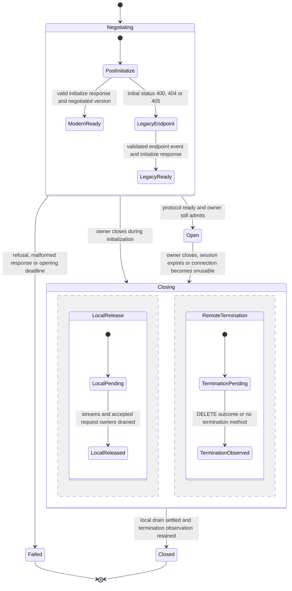
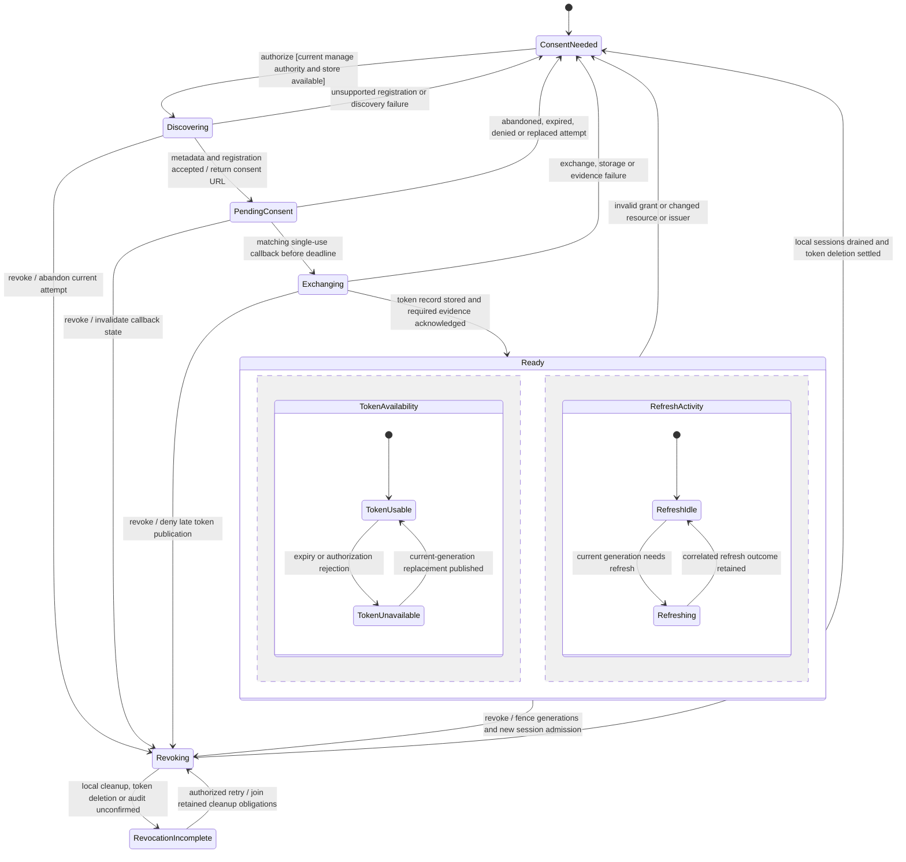

# 392. Remote MCP connections and authorization have explicit lifecycle owners

## Purpose and status

The gateway reaches remote MCP servers through an HTTP transport seam and owns
their authorization. A harness continues to use `nessa mcp-relay`, so its tools
and the desktop's apps share one upstream session for that harness opening.
Connection lifetime, token availability, consent and evidence settlement are
separate stateful concerns with explicit synchronization.

- **Date:** 2026-10-03
- **Statechart revision:** 2026-10-05
- **Status:** proposed. This record refines the local transport draft and the
  design on #392; it does not claim remote gateway support is implemented.
- **Tracking:** #392. Existing configuration work #391 is merged. The local
  `392-remote-mcp` branch retains three transport/test-server/design commits based
  on `bc2448f3`; this planning change does not merge its SDK/gateway code.

Use the [statechart authoring guide](../../state/authoring.md) and the canonical
[gates](../../../CODING_STANDARDS.md#gates). Existing stdio session and grant
behavior remains described in [MCP connections](../../design/mcp-connections.md).
The proposed remote state tables live here, rather than being independently
maintained in that implemented guide and issue comments.

## Decisions and scope

1. SDK connection logic consumes a transport port: send, receive and close.
   Stdio keeps its bounded framing. HTTP protocol logic consumes an SDK-owned
   `HttpExchange` port; gateway composition supplies the async HTTP adapter.
2. Remote configuration has stable server identity, display name and validated
   URL beside stdio definitions. Extend the existing stored-server owner and
   `mcpServers.list/save/remove/inspect`; retain enabled state, optimistic
   revision, audit and one live-set publication contract. Do not restore the
   older branch's parallel configuration reader over the merged #391 owner.
3. Each harness opening has its own logical remote MCP session. No two
   conversations share `Mcp-Session-Id`. A remote server can omit that header;
   retain the local connection identity regardless.
4. The relay grant remains the ownership boundary. Revocation or conversation
   closure fences openings and closes owned local sessions, including those
   initializing. Remote transport does not enter the provider restoration
   fingerprint; consume the existing restoration-identity publication.
5. Support Streamable HTTP and the explicitly scoped 2024-11-05 HTTP+SSE
   fallback requested by #392. Fallback follows only initial POST statuses
   400/404/405. Authentication, malformed responses and unrelated failures do
   not trigger a different transport.
6. OAuth is gateway-owned: protected-resource/authorization-server discovery,
   PKCE S256, resource binding and client registration when supported. Tokens
   stay in the injected private credential store, never in settings, prompts,
   diagnostics, tool arguments or browser URLs.
7. The native host opens the returned consent URL. The gateway receives the
   loopback callback, bound to a single-use state and pending attempt deadline.
   An unavailable private token writer returns an honest unsupported outcome.
8. Authorization/refresh/revoke require correlated durable audit. Failed audit
   prevents audited success and cannot prevent necessary local cleanup or
   fencing token use.
9. Client registration without dynamic registration is outside the first OAuth
   slice. Expose `registration_unsupported` rather than claiming a server can
   be authorized. Resource/issuer/endpoint changes require new explicit consent.
10. Apps continue through the existing resource/tool/review gateway owners.
    Proposed server-level CSP consent is bound to the declared domain-set digest
    and asks again when that set changes. It is separate from OAuth consent.

A successful local close does not prove a remote tool stopped. DELETE may be
refused or unconfirmed, and a dropped stream is not a cancellation receipt.
Retain those meanings in typed outcomes and evidence.

## Current ownership and proposed changes

| Owner | Current responsibility | Proposed extension |
| --- | --- | --- |
| SDK `infrastructure::mcp::Connection` | Correlation, bounded frames, replies and connection end | Transport port; HTTP JSON/SSE decoding with the same correlation and bounds |
| SDK `McpServers`/`McpOwner` | Live configured set and sessions owned by SDK session/relay grant | Remote descriptors; owned initialization and local close |
| Gateway `mcp_servers` | Relay admission, live set, stored edits, inspection and app access | Async HTTP adapter and current stored-server remote variant |
| Gateway new `mcp_authorization` context | Not implemented | Per-server consent/token-generation/refresh/revoke domain; ports and orchestration; private-store and HTTP adapters |
| Existing credentials composition | Reads agent secrets; desktop writes agent credentials | Gateway-owned token-record writer through an explicit port; OS adapter capability reported honestly |
| Product protocol/client | Existing `mcpServers.*` and app methods | Remote shape and typed authorization/revoke status, generated from one schema |
| Desktop settings/host | Stored-server management and native link opening | Remote form, authorization/revoke actions and factual consent/connection status |

The SDK sees Nessa-owned HTTP request/response/stream values, not reqwest types.
Domain code owns token-generation and transition validity; effects stay behind
application ports. Each module gets its feature/layer map and corresponding tests.
Composition owns actual endpoint/network/storage adapters and their startup/drain.

## Identity and event contract

A configured server UUID is durable; rename does not rotate it. A definition
revision binds its resource URL and relevant configuration. Each authorization
attempt, refresh and revoke has its own identity. Token generation is monotonically
advanced under the per-server owner, and each remote session retains its own
local session/relay grant identity and negotiated upstream session/version.

Events name the server, definition revision, local session and owning attempt or
token generation as appropriate. A late callback or HTTP completion cannot
change a replacement definition, revoked generation or another conversation's
session. Presentation names and URLs are attributes, not operation identities.

Local transition selection is serialized by the owning session or per-server
coordinator. No global lock spans all servers. Effects carry their selected
identity/generation through the injected port and return as correlated events.
Slow HTTP, keychain and audit work runs outside the local decision. Their
supervisors retain accepted work and resource accounting after a caller leaves.

Closing/revoking seals future admission before effects. Results already observed
keep their original meaning; fencing cannot rewrite a successful request as never
sent. A stale generation cannot publish new tokens or admit another retry.
Duplicate callback state is rejected, duplicate close joins its owner, and
conflicting current-generation outcomes remain typed failures.

Requests waiting for a valid token are bounded by existing request/capacity and
phase deadlines. The first OAuth slice refuses consent-required requests rather
than storing an unbounded offline queue. A refresh waiter waits on one current
refresh owner and may retry its original request once only when its recorded
outcome establishes authorization rejection; interrupted side-effecting requests
are not replayed from transport ambiguity.

## Connection statechart

This chart follows one local upstream MCP session. Token readiness belongs to
the separate authorization owner. `Negotiating` contains modern and legacy
transport selection; one outer close handles either branch.



The Failed outcome is delivered only after startup's local resources are released
or their unresolved cleanup is handed to the same close owner. TerminationObserved
is an observation, including refused/unconfirmed DELETE; it does not assert remote
process termination. Repeated close does not re-enter Closing or send an unbounded
series of DELETEs. No-session-id and legacy cases record not-applicable rather
than fabricate a successful DELETE.

Follow the [Streamable HTTP specification](https://modelcontextprotocol.io/specification/2025-11-25/basic/transports)
for request/response negotiation and headers. The implementation must publish the
versions it actually negotiates; reading this current specification does not
silently upgrade the local draft's protocol support.

- Each JSON-RPC message is its own POST with required Accept/content headers.
  A notification/response acceptance is 202 with no payload; request replies
  accept JSON or SSE. Validate headers and correlation through typed parsing.
- Keep bounded event framing across chunks, UTF-8 and delimiter boundaries.
  Count before buffering past a bound. Skip valid SSE keepalive/priming events
  without interpreting them as JSON-RPC responses.
- Optional GET stream is separately owned. A 405 there means GET is unsupported,
  not that POST session initialization failed or needs legacy fallback.
- A stream can carry notices/requests before its matching response. Deliver
  each to the existing connection owner; do not reorder or misroute responses
  between a POST stream and an unrelated GET stream.
- An upstream session 404 expires the old session. Any later reconnection sends
  a fresh initialize without the expired id. The old request reports its own
  result/uncertainty and is not silently replayed into that new session. The
  first slice ends the old relay; a subsequent owner-authorized opening performs
  the new session initialization. This limits transparent session recovery.
- A disconnected stream does not itself cancel a remote request. Optional stream
  resumability is distinct from session reinitialization and command retry. The
  first slice reports an unconfirmed pending request and ends its local session;
  supporting server-directed polling/resumption requires correlated event ids,
  bounded retry intervals and further rows before claiming that capability.

DELETE/local drain share the owning close deadline, including fallback paths.
Expired deadlines retain the observation and release confirmed local resources;
remote uncertainty remains visible rather than reserving fictional remote-process
ownership. Mandatory audit has its own documented bounded delivery attempts.

## Authorization statechart

One configured server owns consent and a reusable token record across its sessions.
Its Ready state has separately evolving token availability and refresh activity.
Refresh is not another independent authorization grant.



The per-server domain synchronizes the Ready regions. TokenUnavailable blocks new
token-backed requests while one refresh owner works. A network refresh failure
can leave the old token usable only before its known expiry and without known
rejection. A successful response alone does not enter TokenUsable: validate it,
write the record and acknowledge required evidence before publishing the new
generation. If publication fails, retain the candidate/recovery obligation and
block use instead of forgetting a refresh token that may have rotated.

A server needing no authorization can connect without entering this chart.
Availability/status reads report current facts; they do not trigger browser
consent. The [MCP authorization specification](https://modelcontextprotocol.io/specification/2025-11-25/basic/authorization)
sets discovery, resource, PKCE and token-handling requirements. The first slice
supports dynamic registration where offered and honestly refuses other client
registration mechanisms; it does not claim universal server compatibility.

### Consent and callback

Record authorization intent before discovery/registration effects. Bind state,
PKCE verifier, resource, issuer, client registration, definition revision and a
10-minute injected deadline to one attempt. State is unpredictable and consumed
once under that attempt owner, before exchanging a code. Wrong/unknown/replayed
state is rejected without replacing another pending attempt. Callback pages do
not echo codes, credentials or account details.

A replaced attempt invalidates its old callback and records abandonment. Changed
redirect port/URI requires supported re-registration during explicit authorize,
not silent registration on refresh. Gateway restart abandons unsaved browser
attempts; a callback cannot recreate authority from its query string.

Validate resource and issuer bindings and the allowed URL scheme/origin policy at
one owning boundary. Resource bearer tokens are not sent to discovery/registration
endpoints or forwarded across arbitrary redirects. The legacy endpoint event must
resolve to the configured MCP origin for this first slice. OAuth authorization
servers may differ from the resource origin, but their metadata/endpoint binding
is established through discovery, not by accepting arbitrary model URLs.

### Refresh and revoke ordering

Concurrent callers at generation n join one refresh. Capture generation before
dispatch; if another caller published n+1 meanwhile, reuse that known replacement
instead of starting a second refresh. Correlated 401s can retry once under n+1;
a lost POST answer cannot establish that retry is safe. invalid_grant retires use
and closes affected sessions through their common owner.

```mermaid
sequenceDiagram
    participant C as Conversations A and B
    participant O as Server authorization owner
    participant S as Private token store and audit
    participant R as Authorization server
    C->>O: authorization rejection under generation n
    O->>S: record refresh intent
    O->>R: one refresh for n
    R-->>O: candidate replacement or typed failure
    alt same generation and definition still admit publication
        O->>S: store replacement and record required outcome
        O-->>C: publish n+1; each eligible rejected call may retry once
    else revoke or definition change won
        O->>O: retain rejected late outcome; do not publish or retry
    end
```

Revoke first seals token/session admission and invalidates browser attempts. Local
sessions drain regardless of remote revocation availability. Attempt advertised
RFC 7009 revocation with a bounded result, delete the private record, and record
actual outcomes. A 2xx response is an observed remote acknowledgement; absent
endpoint/network failure is unconfirmed. Both leave local token use fenced.

A refresh completion racing revoke must not rewrite a deleted credential item.
Per-server effect publication and store deletion serialize their ownership:
retain the generation compare through candidate publication, without holding an
admission mutex across network I/O. A pending write that cannot be cancelled
remains owned and must be joined/reconciled before deleting its record. Failure
of deletion is RevocationIncomplete and does not re-enable the retained token.
Stored generation/fence evidence governs restart; token presence alone is not
proof of usable authorization.

## Configuration and app integration

Integrate with the current #391 stored-server owner. It mints/preserves remote
UUIDs, serializes config edits at the current revision, validates the complete
live list through the SDK publication, and exposes redacted remote status. Env
values and tokens are not returned in a list response. Changing a resource URL
under an existing id fences its old token/attempt generation and requires new
consent; renaming alone preserves authorization.

Existing conversations keep their per-open stand-ins. New openings use the
current live set, consistent with the existing restoration-identity rule. A stale
stand-in digest is refused by the relay. Extend the existing digest owner with
remote identity/definition data rather than introducing another check in settings.

The app bridge remains scoped to that conversation's own upstream session.
App-origin visibility, destructive-tool review, tickets and release use current
owners. OAuth readiness does not grant an app permission to invoke hidden tools.
Server-level CSP consent binds to the inspected declared domain-set digest;
changed declarations require renewed consent before activation. Desktop reads
inspect/list outcomes and shows unauthorized, consent needed, token expired,
refresh failing, unreachable and incomplete revoke as distinguishable facts.

## Regression tables and fixture contract

Rows are proposed runtime acceptance cases. Checked-in protocol/server fixtures
exercise boundaries today; they are not proof that the proposed gateway adapter,
OAuth storage or desktop controls already satisfy these rows.

### Connection

| Row | Ordering or input | Required result |
| --- | --- | --- |
| C1 | Initialize JSON or SSE, with/without session id | Own one local session; retain negotiated id/version and apply required subsequent headers |
| C2 | Initial POST 400/404/405 versus 401/5xx/malformed | Only the first group enters legacy endpoint discovery; typed refusal otherwise |
| C3 | Optional modern GET returns 405 | Continue supported POST operations without legacy fallback |
| C4 | Notices/requests precede response, split chunks or keepalive events | Preserve bounded framing, order and request correlation |
| C5 | Session 404 with calls in flight | Expire old session; preserve uncertainty; next admitted opening initializes fresh without replay |
| C6 | Stream disconnect before or after reply; optional polling advertised | Do not infer cancellation; retain observed reply or explicit pending uncertainty; report unsupported resumption accurately |
| C7 | Two conversations use same server; one closes | Separate ids/grants and cleanup; other session remains usable |
| C8 | Close during initialize, caller loss or late HTTP result | Fence dispatch, drain owned startup and accepted requests; ignore late readiness for current admission |
| C9 | DELETE acknowledged, refused 405, fails or times out | Local drain still runs; remote observation remains distinct from physical confirmation |
| C10 | Oversize/malformed UTF-8/event/header/frame | Reject before buffering past bounds; release local stream/request ownership |
| C11 | Same close twice, server definition edited or grant revoked | Join close, preserve first cause and refuse stale openings |

### Authorization

| Row | Ordering or input | Required result |
| --- | --- | --- |
| A1 | No auth required or no token writer | Unauthenticated server works; needed OAuth returns explicit store-unavailable refusal |
| A2 | Valid discovery/registration versus unsupported/changed issuer/resource | Bind exact metadata or refuse; no silent credential forwarding |
| A3 | Correct, wrong, duplicate, late or replaced callback | One current state consumed; retain denial/abandonment and reject stale callback |
| A4 | Code exchange succeeds, token-store or outcome-audit fails | Do not publish usable authorization; retain rotated-token/recovery obligation |
| A5 | Concurrent 401s at n, refresh already published n+1 | One refresh owner; eligible rejected requests retry once with n+1 |
| A6 | Refresh network failure before/after expiry or invalid_grant | Retain valid old generation only while usable; otherwise block requests/require consent |
| A7 | Refresh/revoke/definition change/callback simultaneously ready | Generation fence prevents late publication, store resurrection and new requests |
| A8 | Remote revoke unsupported/fails; private deletion fails | Local token use remains fenced; actual remote/local outcomes are retained |
| A9 | Audit unavailable, UI gone or response lost | Required cleanup continues; no success without evidence; caller loss does not abandon owner |
| A10 | Restart with usable, closing or incomplete token record | Revalidate binding; resume cleanup/fenced state; presence of a token does not grant dispatch |

### Apps and current configuration

| Row | Ordering or input | Required result |
| --- | --- | --- |
| U1 | Remote save/edit/remove with current/stale revision | Existing config owner publishes or refuses once; stdio/env behavior remains intact |
| U2 | Rename versus resource URL change | Preserve durable id; authorization stays for rename and fences/reconsents for resource change |
| U3 | Two conversations mount same server app | Each uses its own upstream session and existing visibility/review/resource policy |
| U4 | CSP declaration changes, denied consent or stale inspection | Activation uses acknowledged current domain-set digest; honest consent/refusal state |
| U5 | Authorize/revoke/mount close under narrow layouts | Reachable controls and factual pending/failure outcomes in Chromium and WebKit |

Use a dependency-free local HTTP MCP fixture and sanitized captured ACP frames
for cloud replay. Record versions, scenario/prompt, capture method, normalized
identities and exact source provenance. Keep synthetic error cases explicitly
synthetic. Never commit complete recordings, account status, real tokens or local
credential paths. Fixture tests must assert actual protocol/correlation/cleanup
behavior and valid neighboring cases; a JSON file that merely repeats this table
is not regression evidence.

The planning PR's current cloud entry points are documented in
[`scripts/mcp-test-server/README.md`](../../../scripts/mcp-test-server/README.md):

```sh
node --test scripts/mcp-test-server/http-server.test.mjs
node --test scripts/subagent-contracts/*.test.mjs
```

The developer HTTP fixture imports the current stdio server's tool/resource
answers, while its transport tests use real loopback sockets. It does not install
remote transport into the product. Sanitized ACP evidence is owned by
[`scripts/subagent-contracts/`](../../../scripts/subagent-contracts/README.md),
with capture provenance and a separate credential-free verifier. This distinguishes
live provider boundary evidence from local deterministic server scenarios.

OAuth needs a separate deterministic authorization-server/private-store fixture
in its implementing slice: rejected consent, replayed state, short expiry,
rotating refresh tokens, invalid_grant, slow/failed storage/audit and unavailable
registration/revocation. Manual live verification then exercises one consenting
real remote server with UI; cloud correctness checks use local substitutes and
sanitized recordings without the owner's credentials.

## Implementation sequence

1. **Planning and fixtures:** recover only bounded developer fixture work from
   the local branch; publish this statechart record and inspect current ACP
   recordings. Validate diagrams, provenance and cloud replay. Do not advertise
   a planned gateway capability from those fixtures.
2. **Transport seam:** reconcile the old draft with merged #391 storage/env/live
   set owners. Add the SDK transport/HTTP port and gateway adapter, generated
   remote configuration, both scoped protocol eras and C1–C11 tests. Run stdio
   neighbors and actual local socket/session-isolation cases.
3. **OAuth owner:** implement per-server domain transitions, store/audit ports,
   callback and single-flight refresh/revoke. Complete A1–A10 with deterministic
   effects and save/restart/generation races. Keep unsupported platforms honest.
4. **Desktop and apps:** extend current settings/client shapes and native URL
   opening, add CSP consent and U1–U5 evidence. Run scripted gateway checks in
   Chromium/WebKit, then the real remote app interoperability check.

Each implementation PR names #392 and the rows it completes. SDK/public API,
module maps, generated contracts and guides change with the owning implementation.
The design receives one Astra medium review round; implementation follows the
canonical bounded code-review loop on its actual diff.

## Alternatives and remaining decisions

Direct harness HTTP connections would split tool/app sessions and multiply token
owners. Shared upstream sessions would couple unrelated conversations. OAuth in
the desktop would make refresh depend on a window. These alternatives remain
rejected in favor of gateway-owned sessions and authorization.

Transparent stream resumption, pre-registered/client-metadata registration,
unrestricted legacy endpoint origins and portable OS keychain adapters are
separate capabilities. Publish supported protocol versions and finite HTTP/SSE,
request, metadata and operation limits in their owning implementation slices.
No additional compatibility readers or schema version bump is implied by this
record. The two protocol eras are the explicit transport scope of #392.
