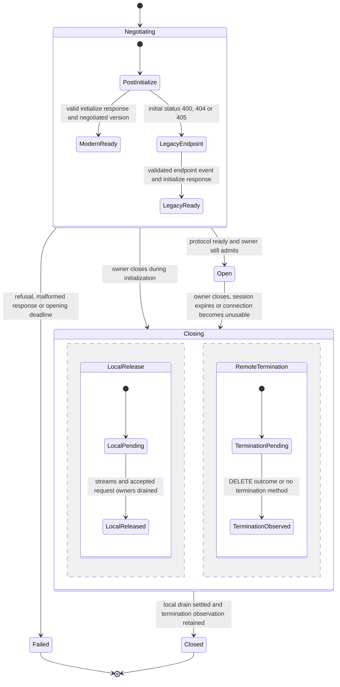
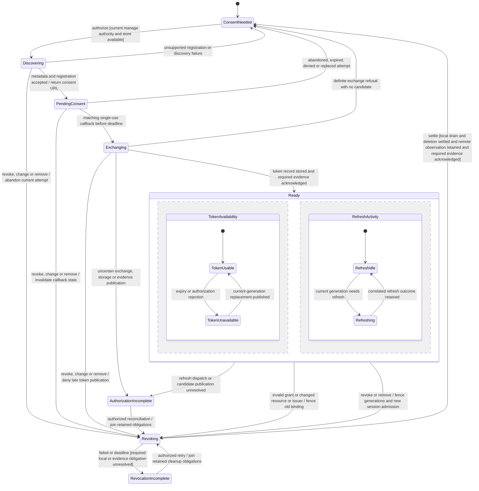
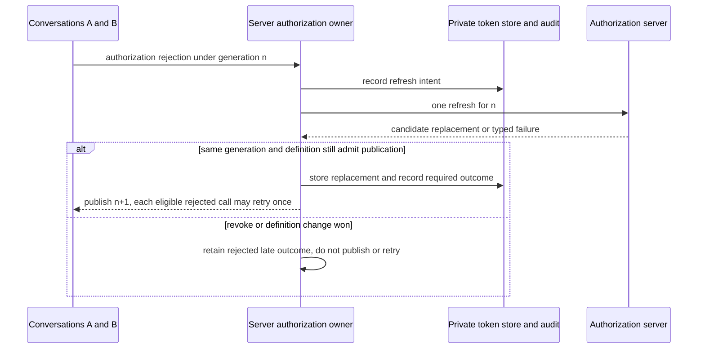

# 392. Remote MCP connections and authorization have explicit lifecycle owners

## Purpose and status

The gateway reaches remote MCP servers through an HTTP transport seam and owns
their authorization. A harness continues to use `nessa mcp-relay`, so its tools
and the desktop's apps share one upstream session for that harness opening.
Connection lifetime, token availability, consent and evidence settlement are
separate stateful concerns with explicit synchronization.

- **Date:** 2026-10-03
- **Statechart revision:** 2026-10-05
- **Status:** proposed. This record refines the local transport draft and the
  design on #392; it does not claim remote gateway support is implemented.
- **Tracking:** #392. Existing configuration work #391 is merged. The local
  `392-remote-mcp` branch retains three transport/test-server/design commits based
  on `bc2448f3`; this planning change does not merge its SDK/gateway code.

Use the [statechart authoring guide](../../state/authoring.md) and the canonical
[gates](../../../CODING_STANDARDS.md#gates). Existing stdio session and grant
behavior remains described in [MCP connections](../../design/mcp-connections.md).
The proposed remote state tables live here, rather than being independently
maintained in that implemented guide and issue comments.

## Decisions and scope

1. SDK connection logic consumes a transport port: send, receive and close.
   Stdio keeps its bounded framing. HTTP protocol logic consumes an SDK-owned
   `HttpExchange` port; gateway composition supplies the async HTTP adapter.
2. Remote configuration has stable server identity, display name and validated
   URL beside stdio definitions. Extend the existing stored-server owner and
   `mcpServers.list/save/remove/inspect`; retain enabled state, optimistic
   revision, audit and one live-set publication contract. Do not restore the
   older branch's parallel configuration reader over the merged #391 owner.
3. Each harness opening has its own logical remote MCP session. No two
   conversations share the gateway's upstream session/streams. If a server
   returns an id already held by another opening at that MCP endpoint, refuse
   the collision before readiness and release only this opening's local work;
   DELETE of the other opening's id is not cleanup. A server can omit that
   header; retain the local connection identity regardless. The gateway cannot
   promise that a remote server internally isolates its own application state.
4. The relay grant remains the ownership boundary. Revocation or conversation
   closure fences openings and closes owned local sessions, including those
   initializing. Remote transport does not enter the provider restoration
   fingerprint; consume the existing restoration-identity publication.
5. Support Streamable HTTP and the explicitly scoped 2024-11-05 HTTP+SSE
   fallback requested by #392. Fallback follows only initial POST statuses
   400/404/405. Authentication, malformed responses and unrelated failures do
   not trigger a different transport.
6. OAuth is gateway-owned: protected-resource/authorization-server discovery,
   PKCE S256, resource binding and client registration when supported. Tokens
   stay in the injected private credential store, never in settings, prompts,
   diagnostics, tool arguments or browser URLs.
7. The native host opens the returned consent URL. The gateway receives the
   loopback callback, bound to a single-use state and pending attempt deadline.
   An unavailable private token writer returns an honest unsupported outcome.
8. Authorization/refresh/revoke require correlated durable audit. Failed audit
   prevents audited success and cannot prevent necessary local cleanup or
   fencing token use.
9. Client registration without dynamic registration is outside the first OAuth
   slice. Expose `registration_unsupported` rather than claiming a server can
   be authorized. Resource/issuer/endpoint changes require new explicit consent.
10. Apps continue through the existing resource/tool/review gateway owners.
    Proposed server-level CSP consent is bound to the declared domain-set digest
    and asks again when that set changes. It is separate from OAuth consent.

A successful local close does not prove a remote tool stopped. DELETE may be
refused or unconfirmed, and a dropped stream is not a cancellation receipt.
Retain those meanings in typed outcomes and evidence.

## Current ownership and proposed changes

| Owner | Current responsibility | Proposed extension |
| --- | --- | --- |
| SDK `infrastructure::mcp::Connection` | Correlation, bounded frames, replies and connection end | Transport port; HTTP JSON/SSE decoding with the same correlation and bounds |
| SDK `McpServers`/`McpOwner` | Live configured set and sessions owned by SDK session/relay grant | Remote descriptors; owned initialization and local close |
| Gateway `mcp_servers` | Relay admission, live set, stored edits, inspection and app access | Async HTTP adapter and current stored-server remote variant |
| Gateway new `mcp_authorization` context | Not implemented | Per-server consent/token-generation/refresh/revoke domain; ports and orchestration; private-store and HTTP adapters |
| Existing credentials composition | Reads agent secrets; desktop writes agent credentials | Gateway-owned token-record writer through an explicit port; OS adapter capability reported honestly |
| Product protocol/client | Existing `mcpServers.*` and app methods | Remote shape and typed authorization/revoke status, generated from one schema |
| Desktop settings/host | Stored-server management and native link opening | Remote form, authorization/revoke actions and factual consent/connection status |

The SDK sees Nessa-owned HTTP request/response/stream values, not reqwest types.
Domain code owns token-generation and transition validity; effects stay behind
application ports. Each module gets its feature/layer map and corresponding tests.
Composition owns actual endpoint/network/storage adapters and their startup/drain.

### Published contracts to extend

The current #391 implementation is **stdio and name-addressed**. Its stored
shape is `{name, command, args?, enabled?, env?}`; remote identities are proposed
here, not already present. Extend
[`configured_server.rs`](../../../crates/nessa-server/src/mcp_servers/domain/configured_server.rs),
[`stored_servers.rs`](../../../crates/nessa-server/src/mcp_servers/infrastructure/stored_servers.rs)
and the existing `LiveServerSet` port together. Preserve stdio's absent-field
defaults, duplicate-env detection, kept-value semantics, base/per-server env
composition, managed `nessa` reservation and name-based save/remove/inspect.

The new stored variant is `{kind: "remote", id, name, url, enabled}`. The settings
owner mints `id` on creation and preserves it when an existing entry is saved or
renamed. Public remote save input is `{kind: "remote", name, url, enabled}` under
the current revision/`previousName` envelope; it cannot choose a new UUID for an
existing entry. Remote list entries publish `id`, definition revision, URL and
redacted authorization facts. Remote entries accept no executable, args, env, bearer or arbitrary header
fields. OAuth records are not part of `agents.mcpServers`. The stored remote
variant and public schema change together, without a second reader or version bump.

The SDK descriptor owns remote URL validation: HTTPS, or HTTP for an explicitly
configured loopback MCP resource; no userinfo or fragment. Gateway settings asks
that owner through the complete live-set validation, and frontend early refusal
consumes the resulting publication. Redirect handling belongs to the HTTP adapter
and consumes this URL policy; resource credentials do not follow an unvalidated
redirect. A model tool argument cannot select a URL, executable or credential item.
Stored UUID syntax and uniqueness join complete-set validation; a hand-edited
URL/id cannot bypass restored token resource/issuer binding or select a private
item outside the trusted namespace.

Extend [`protocol/product/v1.json`](../../../protocol/product/v1.json) and its
generator for remote variants, authorization commands and typed outcomes. Keep
`x-mcpServerRules`, `x-mcpServerInspect`, config/frame limits and
`McpServerLaunch::problem_in` as their current owners; introduce remote-only bounds
there or at their new HTTP/OAuth owner and publish them, rather than retyping
validators in settings, clients or UI. Reuse `INITIALIZE_TIMEOUT`,
`REQUEST_TIMEOUT`, `MAX_IN_FLIGHT` and `MAX_FRAME_BYTES` from SDK MCP; forwarded
requests still have no SDK-owned request timeout. HTTP envelope/SSE/metadata,
effect and callback limits are new constants settled by their implementing
slices, with tests at and beyond each bound. The callback window here is ten
minutes. None requires live-server credentials to choose or test.

Config publication retains current `applied`, durability and `liveSet`
replaced/withdrawn/kept meanings, including caller loss, shutdown and removal from
a hand-edited invalid list. Remote URL edits must serialize with authorization
fencing before the replacement live definition admits an opening. The settings
and authorization coordinators acknowledge that handoff; a failed handoff leaves
the new definition unavailable with a typed outcome, rather than a usable new URL
under the old token. Rename alone preserves the authorization binding.
Remote removal also fences the removed UUID and joins its authorization cleanup;
config `applied/live` and pending/incomplete secret cleanup remain distinct facts.
Disable keeps the saved UUID/consent and removes future openings through current
live-set publication; already-admitted sessions remain owned until their normal
close or explicit revoke. Cleanup must not read a removed definition by name:
its accepted operation retains the old identity/binding it needs.

## Identity and event contract

A configured server UUID is durable; rename does not rotate it. A definition
revision binds its transport/resource configuration, excluding display name
and enabled state; the whole stored-list revision still changes on those edits.
Discovered issuer/client/scopes bind the authorization record separately. Each authorization
attempt, refresh and revoke has its own identity. Token generation is monotonically
advanced under the per-server owner, and each remote session retains its own
local session/relay grant identity and negotiated upstream session/version.

Events name the server, definition revision, local session and owning attempt or
token generation as appropriate. A late callback or HTTP completion cannot
change a replacement definition, revoked generation or another conversation's
session. Presentation names and URLs are attributes, not operation identities.

Local transition selection is serialized by the owning session or per-server
coordinator. No global lock spans all servers. Effects carry their selected
identity/generation through the injected port and return as correlated events.
Slow HTTP, keychain and audit work runs outside the local decision. Their
supervisors retain accepted work and resource accounting after a caller leaves.

Closing/revoking seals future admission before effects. Results already observed
keep their original meaning; fencing cannot rewrite a successful request as never
sent. A stale generation cannot publish new tokens or admit another retry.
Duplicate callback state is rejected, duplicate close joins its owner, and
conflicting current-generation outcomes remain typed failures.

The owning implementation selects one local decision at a time, then supervises
its effects. An event accepted before close may establish its observed result;
close admitted first seals readiness/token publication. There is no implicit
priority based on Mermaid nesting or network arrival. Correlation checks precede
state changes; compatible region changes form one local decision and the enclosing
settle guard is rechecked after entry and each outcome.

| Event | Selection and observable outcome |
| --- | --- |
| Open/authorize | Validate current grant/manage authority, definition and capacity; refuse typed closed/stale/busy/store-unavailable before dispatch |
| HTTP/store/audit completion | Validate operation and epoch/generation; retain matching observation, then select publication/cleanup; stale completion cannot publish but its owned resources/candidate still join cleanup |
| Duplicate close/revoke | Join retained operation and first cause; do not re-enter state or create another unbounded effect series |
| Callback | Consume only matching pending state once; wrong/replayed/expired state is a typed refusal with no replacement of another attempt |
| Deadline/caller loss | Deadline fences the affected operation and retains uncertainty/cleanup obligations; caller loss detaches its waiter while the supervisor finishes accepted work |
| Conflicting same-operation evidence | Typed conflict blocks publication and retains both observations for reconciliation; it does not replace an acknowledged outcome |

Private-store results distinguish acknowledged, refused-before-write and
publication-unknown. Durable records retain resource/issuer/client binding,
generation, dispatch fence and unresolved operation facts. Deletion removes
secret material; non-secret fence/settlement evidence remains durable, so a
restart cannot infer authorization from an orphaned item. Credential item targets
are derived from the trusted runtime namespace and server UUID; adapter results
must match that target before publication. Store/audit ports acknowledge these
facts independently. Before exchanging a consumed code or sending a refresh,
persist its operation/generation intent; a restart with an unresolved dispatched
refresh does not repeat a potentially rotating exchange. Audit intent acknowledgement
precedes new consent/token effects, while local fencing/drain remains available
when audit fails. The OAuth slice tests interrupted writes and restart at each
effect/acknowledgement boundary, rather than assuming a network/store transaction.

Requests waiting for a valid token are bounded by existing request/capacity and
phase deadlines. The first OAuth slice refuses consent-required requests rather
than storing an unbounded offline queue. A refresh waiter waits on one current
refresh owner and may retry its original request once only when its recorded
outcome establishes authorization rejection; interrupted side-effecting requests
are not replayed from transport ambiguity.

## Connection statechart

This chart follows one local upstream MCP session. Token readiness belongs to
the separate authorization owner. `Negotiating` contains modern and legacy
transport selection; one outer close handles either branch.



The Failed outcome is delivered only after startup's local resources are released
or their unresolved cleanup is handed to the same close owner. TerminationObserved
is an observation, including refused/unconfirmed DELETE; it does not assert remote
process termination. Repeated close does not re-enter Closing or send an unbounded
series of DELETEs. No-session-id and legacy cases record not-applicable rather
than fabricate a successful DELETE.

Follow the [Streamable HTTP specification](https://modelcontextprotocol.io/specification/2025-11-25/basic/transports)
for request/response negotiation and headers. The implementation must publish the
versions it actually negotiates; reading this current specification does not
silently upgrade the local draft's protocol support.

Source review is pinned to MCP repository
[`8e12bf3c8f01f374146acfa19b8ece0018bfc86c`](https://github.com/modelcontextprotocol/modelcontextprotocol/tree/8e12bf3c8f01f374146acfa19b8ece0018bfc86c/docs/specification):
the 2025-11-25 transport/authorization pages and 2024-11-05 transport page.
The current SDK `wire.rs` publishes 2025-06-18, 2025-03-26 and 2024-11-05;
the transport slice consumes that publication and tests each advertised version.
Adding 2025-11-25 support is a deliberate owning change, not implied by these
references. Resumption/polling remains an explicit limitation of the first slice.

- Each JSON-RPC message is its own POST with required Accept/content headers.
  A notification/response acceptance is 202 with no payload; request replies
  accept JSON or SSE. Validate headers and correlation through typed parsing.
- Keep bounded event framing across chunks, UTF-8 and delimiter boundaries.
  Count before buffering past a bound. Skip valid SSE keepalive/priming events
  without interpreting them as JSON-RPC responses.
- Optional GET stream is separately owned. A 405 there means GET is unsupported,
  not that POST session initialization failed or needs legacy fallback.
- A stream can carry notices/requests before its matching response. Deliver
  each to the existing connection owner; do not reorder or misroute responses
  between a POST stream and an unrelated GET stream.
- An upstream session-bound 404 expires the old local session epoch and starts
  bounded fresh initialization without the expired id while its relay-grant owner
  still admits recovery, as the transport specification requires. Preserve each
  old request's observed result or uncertainty; initialization is not permission
  to replay a failed tool call. Retire old streams/handles and invalidate cached
  app/session resources before publishing the replacement session identity. The
  replacement is a new instance of this connection chart, coordinated by the
  same server-opening owner, rather than an Open transition on an expired id.
  If close/revoke/definition change wins, it fences startup; a late initialized
  replacement joins cleanup and cannot publish readiness. One recovery attempt
  uses the remaining operation/opening budget and retains failure if it cannot
  establish the replacement. A harness need not initiate another relay to trigger
  this recovery. Subsequent admitted calls resolve the current replacement;
  already-admitted calls against the retired epoch retain their own outcome.
- A disconnected stream does not itself cancel a remote request. Optional stream
  resumability is distinct from session reinitialization and command retry. The
  first slice reports an unconfirmed pending request and ends its local session;
  supporting server-directed polling/resumption requires correlated event ids,
  bounded retry intervals and further rows before claiming that capability.

DELETE/local drain share the owning close deadline, including fallback paths.
Expired deadlines retain the observation and release confirmed local resources;
remote uncertainty remains visible rather than reserving fictional remote-process
ownership. Mandatory audit has its own documented bounded delivery attempts.

## Authorization statechart

One configured server owns consent and a reusable token record across its sessions.
Its Ready state has separately evolving token availability and refresh activity.
Refresh is not another independent authorization grant.



The per-server domain synchronizes the Ready regions. TokenUnavailable blocks new
token-backed requests while one refresh owner works. A failure known not to have
dispatched a refresh can leave the old token usable only before its known expiry
and without known rejection. A lost refresh reply may have rotated its secret;
it enters AuthorizationIncomplete instead of repeating that exchange. A successful
response alone does not enter TokenUsable: validate it,
write the record and acknowledge required evidence before publishing the new
generation. If publication fails, retain the candidate/recovery obligation and
block use instead of forgetting a refresh token that may have rotated.

AuthorizationIncomplete fences dispatch and owns the candidate or unknown remote
grant plus pending store/evidence obligations. Explicit reconciliation enters
Revoking; no fresh consent is admitted until those obligations settle. This is
distinct from a definite refusal with no candidate and from incomplete revoke.
The accepted operation also authorizes necessary cleanup after caller loss or
restart; reconciliation does not wait for a window to return. Definition change
or removal fences active consent as well as Ready, invalidates callback
state and joins cleanup under this same owner. Fresh attempts use the replacement
definition only after the handoff acknowledges its fence.

Gateway shutdown separately seals process/session admission, abandons pending
browser attempts and drains accepted HTTP/store/audit effects. It preserves
settled reusable authorization rather than treating every restart as revoke.
An outcome acknowledged during shutdown may settle its durable record but cannot
publish a live session. Unresolved dispatched exchange/refresh and cleanup facts
remain fenced on restart; a durable Ready record is revalidated before use.

A server needing no authorization can connect without entering this chart.
Availability/status reads report current facts; they do not trigger browser
consent. The [MCP authorization specification](https://modelcontextprotocol.io/specification/2025-11-25/basic/authorization)
sets discovery, resource, PKCE and token-handling requirements. The first slice
supports dynamic registration where offered and honestly refuses other client
registration mechanisms; it does not claim universal server compatibility.

### Consent and callback

Record authorization intent before discovery/registration effects. Bind state,
PKCE verifier, resource, issuer, client registration, definition revision and a
10-minute injected deadline to one attempt. State is unpredictable and consumed
once under that attempt owner, before exchanging a code. Wrong/unknown/replayed
state is rejected without replacing another pending attempt. Callback pages do
not echo codes, credentials or account details.

Discovery parses Bearer challenges, follows `resource_metadata` when present,
otherwise uses the path-specific/root protected-resource metadata order. It tries
the specified OAuth metadata/OIDC endpoints for each selected issuer and verifies
exact issuer/resource binding and advertised PKCE S256 before registration. All
authorization-server endpoints use HTTPS; the loopback callback uses its exact
registered URI. A cloud authorization-server fake therefore uses a test TLS
listener/trust adapter, rather than making production OAuth accept HTTP.

Bind requested/granted scopes to the attempt and token record. The current
challenge's scope set is authoritative; it need not be a subset of
`scopes_supported`. Without a challenge scope, use protected-resource
`scopes_supported`, or omit scope when absent. A 403 `insufficient_scope` returns
typed scope-required facts for explicit renewed consent. It does not refresh/replay
the tool automatically or open a browser from status/list. This is the first
slice's deliberate handling of step-up authorization. Token audience validation
is the resource server's duty; the gateway binds its opaque token to discovered
resource/issuer and does not claim to inspect an opaque token's audience.

A replaced attempt invalidates its old callback and records abandonment. Changed
redirect port/URI requires supported re-registration during explicit authorize,
not silent registration on refresh. Gateway restart abandons unsaved browser
attempts; a callback cannot recreate authority from its query string.

Validate resource and issuer bindings and the allowed URL scheme/origin policy at
one owning boundary. Resource bearer tokens are not sent to discovery/registration
endpoints or forwarded across arbitrary redirects. The legacy endpoint event must
resolve to the configured MCP origin for this first slice. OAuth authorization
servers may differ from the resource origin, but their metadata/endpoint binding
is established through discovery, not by accepting arbitrary model URLs.

### Refresh and revoke ordering

Concurrent callers at generation n join one refresh. Capture generation before
dispatch; if another caller published n+1 meanwhile, reuse that known replacement
instead of starting a second refresh. Correlated 401s can retry once under n+1;
a lost POST answer cannot establish that retry is safe. invalid_grant retires use
and closes affected sessions through their common owner.



Revoke first seals token/session admission and invalidates browser attempts. Local
sessions drain regardless of remote revocation availability. Attempt advertised
RFC 7009 revocation with a bounded result, delete private credential material
while retaining the durable fence, and record actual outcomes. A 2xx response
is an observed remote acknowledgement; absent
endpoint/network failure is unconfirmed. Both leave local token use fenced.

A refresh completion racing revoke must not rewrite a deleted credential item.
Per-server effect publication and store deletion serialize their ownership:
retain the generation compare through candidate publication, without holding an
admission mutex across network I/O. A pending write that cannot be cancelled
remains owned and must be joined/reconciled before deleting its record. Failure
of deletion is RevocationIncomplete and does not re-enable the retained token.
Late exchanged/refreshed candidates join this cleanup, including an advertised
revocation attempt where available; discarded local bytes do not prove their
remote grant ended. An unknown exchange/refresh response retains remote
uncertainty rather than inventing a token to revoke.
Stored generation/fence evidence governs restart; token presence alone is not
proof of usable authorization. While effects/observations remain pending, stay
Revoking. Enter ConsentNeeded only after confirmed local drain, settled private
deletion, retained remote revocation observation and required audit acknowledgement.
The remote observation can be acknowledged, unsupported or unconfirmed; keep that
qualified outcome visible. If bounded settlement fails with a local/evidence
obligation unresolved, enter RevocationIncomplete. Successful deletion with failed
outcome audit therefore has only the incomplete transition enabled.

## Configuration and app integration

Extend the current #391 stored-server owner to mint/preserve remote
UUIDs. It already serializes config edits at the current revision and validates
the complete live list through the SDK publication; the extension exposes
redacted remote status. Env
values and tokens are not returned in a list response. Changing a resource URL
under an existing id fences its old token/attempt generation and requires new
consent; renaming alone preserves authorization.

Existing conversations keep their per-open stand-ins. New openings use the
current live set, consistent with the existing restoration-identity rule. A stale
stand-in digest is refused by the relay. Extend the existing digest owner with
remote identity/definition data rather than introducing another check in settings.

The app bridge remains scoped to that conversation's own upstream session.
App-origin visibility, destructive-tool review, tickets and release use current
owners. OAuth readiness does not grant an app permission to invoke hidden tools.
Server-level CSP consent binds to the inspected declared domain-set digest;
changed declarations require renewed consent before activation. Desktop reads
inspect/list outcomes and shows unauthorized, consent needed, token expired,
refresh failing, unreachable and incomplete revoke as distinguishable facts.

The generated product API adds `mcpServers.authorize` and `mcpServers.revoke`,
addressed by remote UUID and current definition revision under existing server
management authority. Authorization returns an operation/attempt identity and
pending-consent URL/deadline, already-ready facts, or typed refusal. Revoke returns
its operation and separate local drain, secret deletion, remote observation and
evidence facts; pending/incomplete does not become success because a caller left.
`list` reports redacted authorization facts independently from connection facts;
`inspect` uses an already-ready token or returns consent/scope/store-required facts,
without initiating consent. SDK HTTP outcomes distinguish authorization rejection,
scope requirement, session expiry, definite dispatch failure and unknown request
result; adapters never derive these by parsing error strings. Product/client
mapping preserves those distinctions, and generates its types from the schema.

## Regression tables and fixture contract

Rows are proposed runtime acceptance cases. Checked-in protocol/server fixtures
exercise boundaries today; they are not proof that the proposed gateway adapter,
OAuth storage or desktop controls already satisfy these rows.

### Connection

| Row | Ordering or input | Required result |
| --- | --- | --- |
| C1 | Initialize JSON or SSE, with/without session id | Own one local session; retain negotiated id/version and apply required subsequent headers |
| C2 | Initial POST 400/404/405 versus 401/5xx/malformed | Only the first group enters legacy endpoint discovery; typed refusal otherwise |
| C3 | Optional modern GET returns 405 | Continue supported POST operations without legacy fallback |
| C4 | Notices/requests precede response, split chunks or keepalive events | Preserve bounded framing, order and request correlation |
| C5 | Session 404 with calls in flight; recovery races owner close/revoke | Fence expired epoch, preserve old results/uncertainty and start bounded fresh initialize without old id; late recovery joins close; no tool replay |
| C6 | Stream disconnect before or after reply; optional polling advertised | Do not infer cancellation; retain observed reply or explicit pending uncertainty; report unsupported resumption accurately |
| C7 | Two conversations use same server; one closes; second initialize repeats an owned session id | Separate local ids/grants and cleanup; survivor remains usable; reject upstream id collision without DELETE of the survivor |
| C8 | Close during initialize, caller loss or late HTTP result | Fence dispatch, drain owned startup and accepted requests; ignore late readiness for current admission |
| C9 | DELETE acknowledged, refused 405, fails or times out | Local drain still runs; remote observation remains distinct from physical confirmation |
| C10 | Oversize/malformed UTF-8/event/header/frame | Reject before buffering past bounds; release local stream/request ownership |
| C11 | Same close twice, server definition edited or grant revoked | Join close, preserve first cause and refuse stale openings |

### Authorization

| Row | Ordering or input | Required result |
| --- | --- | --- |
| A1 | No auth required or no token writer | Unauthenticated server works; needed OAuth returns explicit store-unavailable refusal |
| A2 | Valid challenge/well-known/OIDC discovery, S256 and scopes versus unsupported/changed binding or 403 insufficient_scope | Bind metadata/resource/issuer/scopes or refuse; explicit scope-required result, no silent credential forwarding or automatic step-up replay |
| A3 | Correct, wrong, duplicate, late or replaced callback | One current state consumed; retain denial/abandonment and reject stale callback |
| A4 | Exchange reply lost or succeeds, token-store or outcome-audit fails; restart at effect/ack boundary | AuthorizationIncomplete fences use, retains candidate/remote uncertainty and publication obligations; definite refusal with no candidate can return ConsentNeeded |
| A5 | Concurrent 401s at n, refresh already published n+1 | One refresh owner; eligible rejected requests retry once with n+1 |
| A6 | Refresh not dispatched before/after expiry, response lost after rotation, or invalid_grant | Retain old generation only while known usable on definite non-dispatch; lost reply fences as AuthorizationIncomplete without exchange replay; invalid grant requires consent after session closure |
| A7 | Refresh/revoke/definition change/callback simultaneously ready | Generation fence prevents late publication, store resurrection and new requests |
| A8 | Remote revoke unsupported/fails; private deletion fails | Local token use remains fenced; actual remote/local outcomes are retained |
| A9 | Audit unavailable, UI gone or response lost; deletion succeeds but outcome audit fails | Required cleanup continues; failed bounded settlement remains RevocationIncomplete; no success without required evidence; caller loss does not abandon owner |
| A10 | Restart with usable, closing or incomplete token record | Revalidate binding; resume cleanup/fenced state; presence of a token does not grant dispatch |

### Apps and current configuration

| Row | Ordering or input | Required result |
| --- | --- | --- |
| U1 | Remote save/edit/disable/remove with current/stale revision; removed id has pending OAuth work | Config owner preserves current publication/refusal/env meanings; disable preserves consent; removal fences old UUID and joins retained cleanup without confusing config publication with deletion success |
| U2 | Rename versus resource URL change | Preserve durable id; authorization stays for rename and fences/reconsents for resource change |
| U3 | Two conversations mount same server app | Each uses its own upstream session and existing visibility/review/resource policy |
| U4 | CSP declaration changes, denied consent or stale inspection | Activation uses acknowledged current domain-set digest; honest consent/refusal state |
| U5 | Authorize/revoke/mount close under narrow layouts | Reachable controls and factual pending/failure outcomes in Chromium and WebKit |

Use a dependency-free local HTTP MCP fixture for cloud transport replay.
Sanitized captured ACP frames remain separate provider-boundary evidence, not
remote MCP transport proof. Record versions, scenario/prompt, capture method, normalized
identities and exact source provenance. Keep synthetic error cases explicitly
synthetic. Never commit complete recordings, account status, real tokens or local
credential paths. Fixture tests must assert actual protocol/correlation/cleanup
behavior and valid neighboring cases; a JSON file that merely repeats this table
is not regression evidence.

The planning PR's current cloud entry points are documented in
[`scripts/mcp-test-server/README.md`](../../../scripts/mcp-test-server/README.md):

```sh
node --test scripts/mcp-test-server/http-server.test.mjs
node --test scripts/subagent-contracts/*.test.mjs
```

The developer HTTP fixture imports the current stdio server's tool/resource
answers, while its transport tests use real loopback sockets. It does not install
remote transport into the product. Sanitized ACP evidence is owned by
[`scripts/subagent-contracts/`](../../../scripts/subagent-contracts/README.md),
with capture provenance and a separate credential-free verifier. This distinguishes
live provider boundary evidence from local deterministic server scenarios.

OAuth needs a separate deterministic authorization-server/private-store fixture
in its implementing slice: rejected consent, replayed state, short expiry,
rotating refresh tokens, invalid_grant, slow/failed storage/audit and unavailable
registration/revocation. Manual live verification then exercises one consenting
real remote server with UI; cloud correctness checks use local substitutes and
sanitized recordings without the owner's credentials.

| Existing fixture evidence | Useful rows and required product regressions |
| --- | --- |
| `http-frames.json`, JSON/legacy replay | C1/C2 payload/correlation seed; run the SDK HTTP adapter against the listener, adding negotiated-version/header checks and modern POST SSE replies |
| Actual two-session DELETE/disconnect tests | C7/C9 seed; prove gateway grant/conversation isolation, duplicate close, late startup and owner drain in C7–C9/C11 |
| Injected absolute TTL and 404 | C5 seed; expire a product session with concurrent calls, reinitialize once under the same grant, invalidate old app epoch and race close/revoke |
| GET 405, 202 notification, bearer 401 | C2/C3 and authorization-rejection seed; add every fallback status plus auth/malformed/non-fallback neighbors; 401 fixture is not OAuth discovery or refresh |
| Invalid JSON and fixture body bound | C10 seed; add product-owned body/header/frame limits, invalid UTF-8, split SSE delimiters/data, priming events and notices-before-reply in C4/C10 |
| No existing resumability/slow effect fixture | C6/C8/C9 need gated disconnect, late response, refused/timed-out DELETE and no-replay observations under injected scheduling |
| No existing OAuth/private-store fixture | A1–A10 need deterministic challenge/discovery/TLS/registration/code/refresh/revoke server plus acknowledged/refused/unknown store/audit effects and save/restart interleavings |
| Separate `subagent-contracts` recordings | Keep provider ACP/legacy evidence checks green; they establish no C/A/U runtime row |

The implementing slice records a row-to-test map beside its owning tests. The
OAuth fake must expose dispatch/response/store/audit barriers so tests choose
ordering without sleeps, including a refresh that rotates then loses its reply,
deletion that succeeds before audit fails, and a late write after revoke. Test
both orders at each barrier and accepted neighboring states. Fixtures use only
fixed synthetic credentials; source hashes identify the local fixture/probe
that produced a corpus. Product tests must call real public owners/adapters,
not replay JSON that states the desired result.

## Implementation sequence

The planning PR carries the local developer HTTP fixture and this proposed
contract. The three old `392-remote-mcp` commits remain reference material;
cloud coding starts from merged #391 plus this plan, without transplanting the
old parallel reader or advertising a gateway transport from fixture tests.

| Slice, dependencies | Source owners and deliverable | Acceptance rows |
| --- | --- | --- |
| T0 transport seam, after plan | SDK `infrastructure/mcp/{connection,process,framing,servers,wire}.rs` and `tests/infrastructure/mcp/`: transport-owned tasks/end events and Nessa-owned `HttpExchange` values. Keep stdio framing/correlation behavior; no reqwest/OS store in SDK | Existing stdio suite, capacity/framing and grant-close neighbors for C7/C8/C10/C11 |
| T1 modern HTTP + remote definition, after T0 | SDK MCP HTTP codec/descriptor; gateway `mcp_servers/domain/{configured_server,stand_in}.rs`, `application/{settings,ports}.rs`, `infrastructure/{stored_servers,live_set,inspector,relay,grants}.rs`, `composition/mcp_servers.rs`, product schema/generator/client mapping. Add async reqwest adapter with owned stream/drain, remote UUID/config publication, no-auth connections and factual 401/store-required outcomes | C1/C3–C11, U1/U2 no-token cases and A1; actual SDK/gateway calls against loopback fixture, old stdio/env/revision/live/restoration regressions |
| T2 scoped legacy HTTP+SSE, after T1 | Same SDK HTTP owner and gateway adapter; bounded endpoint/message decoding, same-origin endpoint policy and only the agreed initial POST fallback statuses | C2/C4/C6–C11 in legacy mode; non-fallback auth/5xx/malformed neighbors |
| A0 authorization domain + substitutes, after T1 identities | New gateway `mcp_authorization/{domain,application,contracts}` and matching tests; pure generation/attempt/fence decisions, private-record/audit/HTTP/clock/entropy ports and deterministic TLS server/store fixtures. Domain emits effects rather than accessing SDK internals or keychain | A1–A10 domain/ordering cases, including scopes and uncertain publication; no claim of completed network or product rows |
| A1 consent + private store integration, after A0 | `mcp_authorization/{application,infrastructure,entrypoint}`, gateway composition and generated product/client `mcpServers.authorize/revoke` mappings. Add protected-resource/OIDC discovery, S256/dynamic registration, loopback callback, durable fence/secret records and macOS private writer; wire manage authority and ready-token port into MCP. Include basic URL-change/removal fencing and retained session/credential cleanup through settings publication, plus revoke/cleanup for pending consent and Ready, before exposing ready-token dispatch | A1–A4/A8–A10 and token-backed U1/U2 through public product routes and real deterministic TLS listener without concurrent refresh; ready-token URL edit/removal, unavailable store/platform, callback restart, basic revoke, discovery/scope and audit neighbors |
| A2 refresh/revoke + definition handoff, after A1 | Same per-server owner, token request seam and current settings/live-set/relay-grant close owners; extend the existing revoke owner to single-flight refresh and concurrent generation races, retained candidates, refresh-specific definition-handoff races, secret deletion, remote observation and evidence settlement | A5–A10, C5/C8/C11 and U2 with tokens; rotating/lost replies, every effect/ack restart point, late write/revoke races, failed drain/deletion/audit |
| U desktop/apps, after T2+A2 | `src/desktop/settings/{model,adapters,ui}`, desktop dependency factory, existing `src/host`/`src-tauri/src/links.rs` native URL seam; gateway/SDK MCP app resource/CSP and current review/ticket owners; generated client API consumption | U1–U5, browser gateway scripts in Chromium/WebKit, narrow layout/focus/pending/failure evidence and one owner-run real remote app check |

Each slice updates the relevant chart/table when tests reveal another ordering,
and publishes limits, module maps and public SDK docs with its owning code.
T1's async reqwest feature changes must respect the gateway's existing TLS
provider composition and package minimum Rust version; check the combined CI
crate selection, rather than relying on an isolated adapter build.

Bare-Node checks run from a temporary tree containing the checked-in
`scripts/mcp-test-server` and `scripts/subagent-contracts` fixtures plus their
checked-in provenance manifests (including the referenced harness lockfile), without
`node_modules`, credentials or harness installations. Run the commands above
and capture/replay the deterministic HTTP corpus. Runtime slices then run the
SDK/server focused suites, SDK/public doc checks, protocol regeneration checks,
architecture checks, formatting and `-D warnings`, followed by the effective
package selection in `.github/workflows/local-auth.yml`. Shared portable
contracts compile on macOS/Linux/Windows; relay-backed gateway remote behavior
uses the existing Unix capability. Non-Unix returns current not-configured
facts instead of silently bypassing the relay. First private OAuth writes are
macOS-only; Linux/non-macOS substitutes exercise store-unavailable behavior and
domain transitions, with no plaintext credential fallback. Supporting another
OS writer is a separate adapter capability.

U uses the repository desktop verification skill/checklist and extends
`verification/desktop/scripts/mcp-servers-gateway.mjs` plus app scripts against
the local gateway fixtures. Cloud checks do not launch a consenting real browser
account or read owner credentials. The final real-server interoperability check
is run by an owner with consent after deterministic checks pass; its exclusion
is visible until that evidence exists, and does not block cloud coding.

Each implementation PR names #392 and the rows it completes. SDK/public API,
module maps, generated contracts and guides change with the owning implementation.
Review requirements remain in the canonical coding standards; implementation
reviews apply them to the actual diff and its declared environment.

## Alternatives and remaining decisions

Direct harness HTTP connections would split tool/app sessions and multiply token
owners. Shared upstream sessions would couple unrelated conversations. OAuth in
the desktop would make refresh depend on a window. These alternatives remain
rejected in favor of gateway-owned sessions and authorization.

Transparent stream resumption, pre-registered/client-metadata registration,
unrestricted legacy endpoint origins and portable OS keychain adapters are
separate capabilities. Publish supported protocol versions and finite HTTP/SSE,
request, metadata and operation limits in their owning implementation slices.
No additional compatibility readers or schema version bump is implied by this
record. The two protocol eras are the explicit transport scope of #392.
