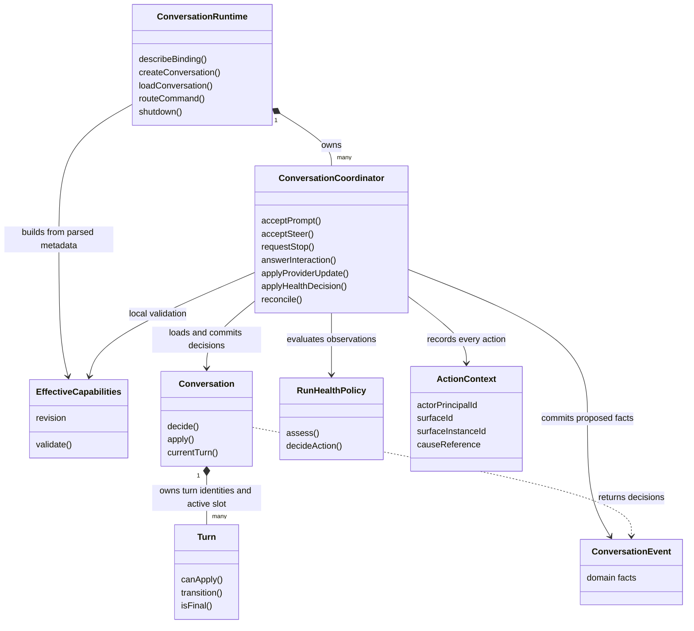
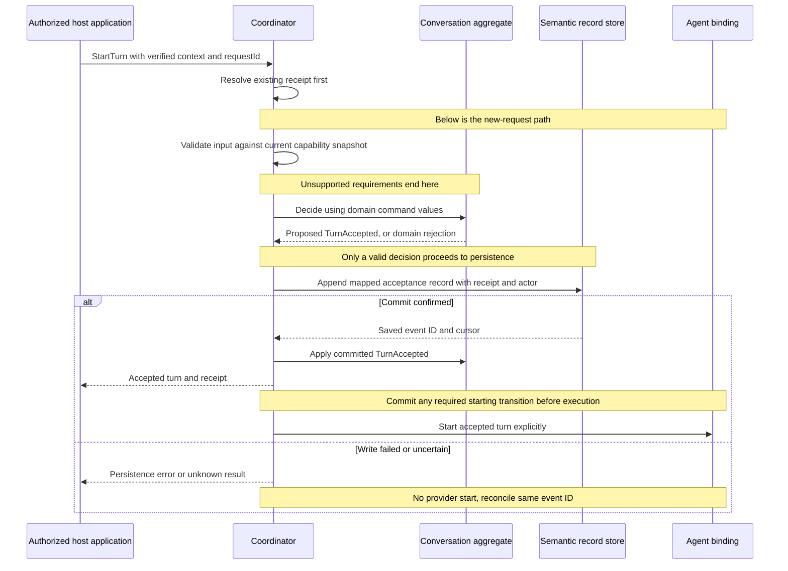
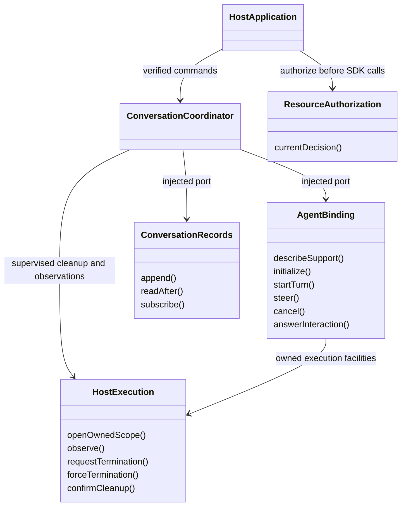
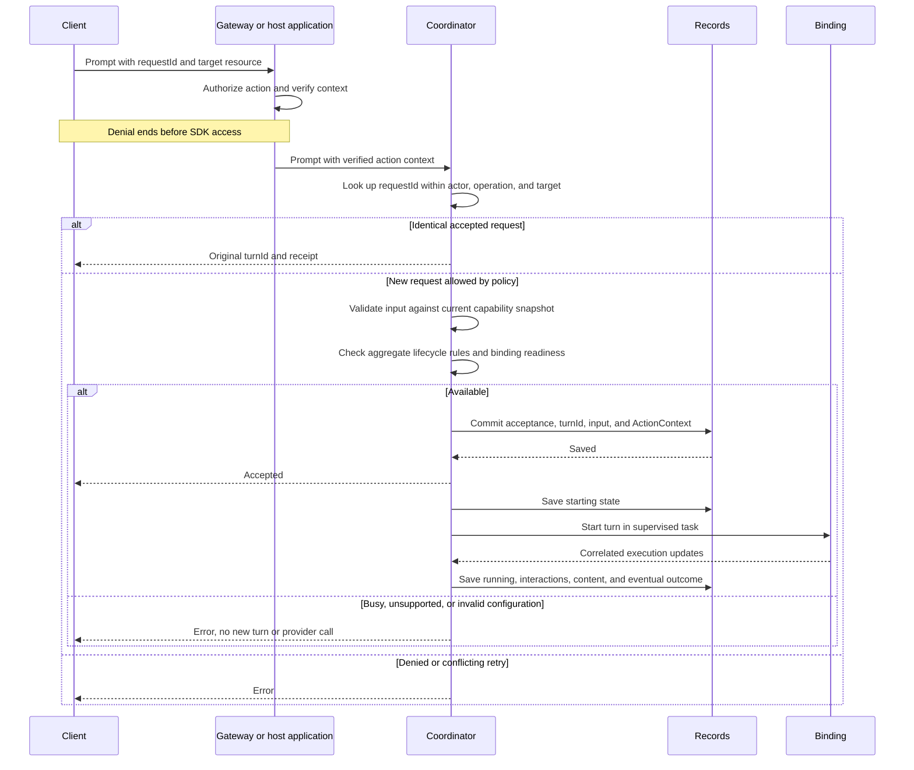
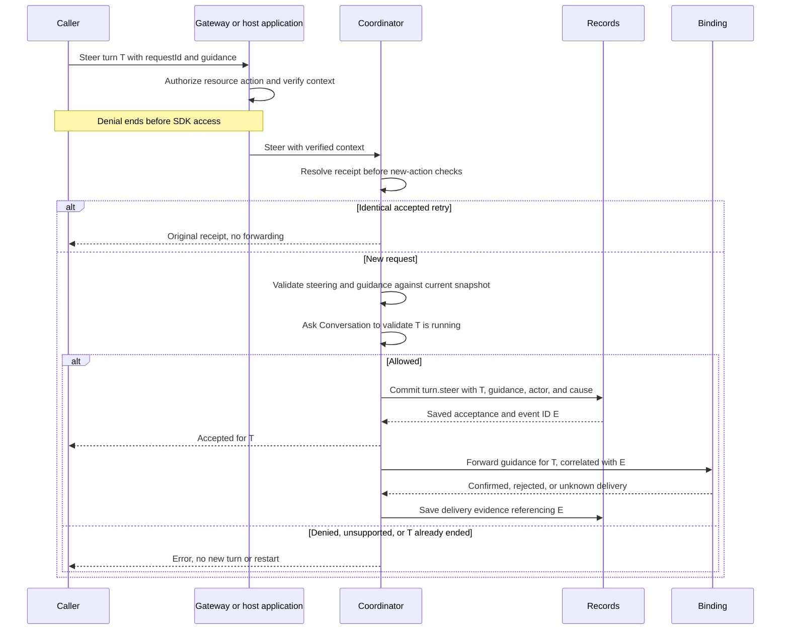
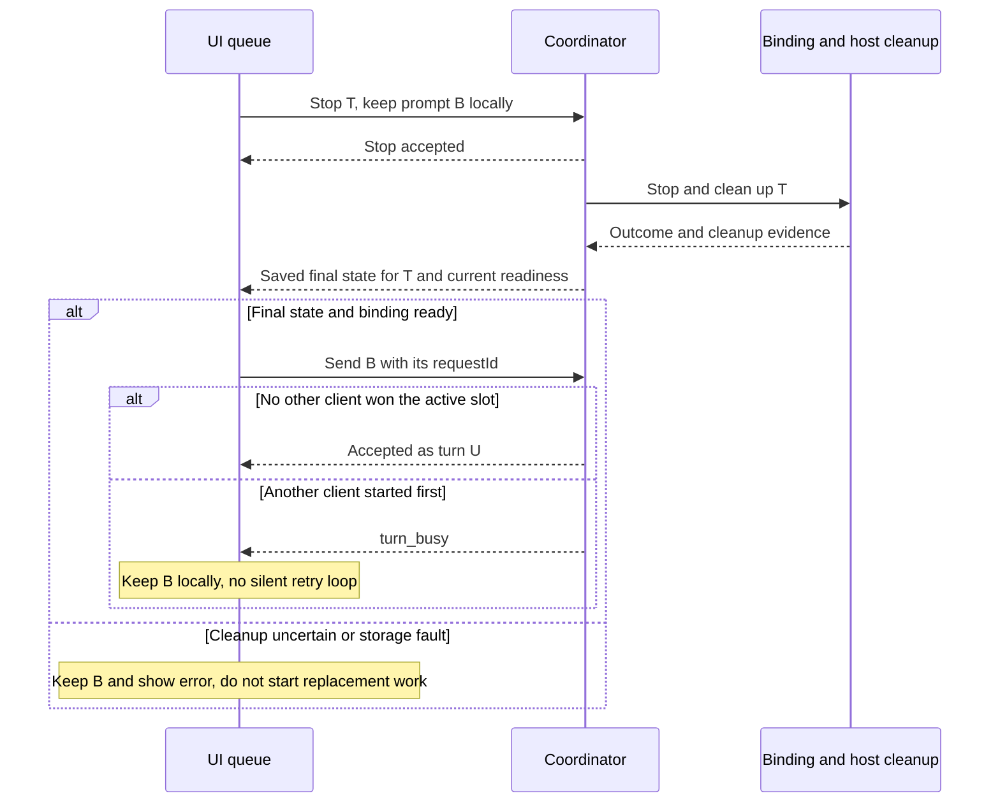
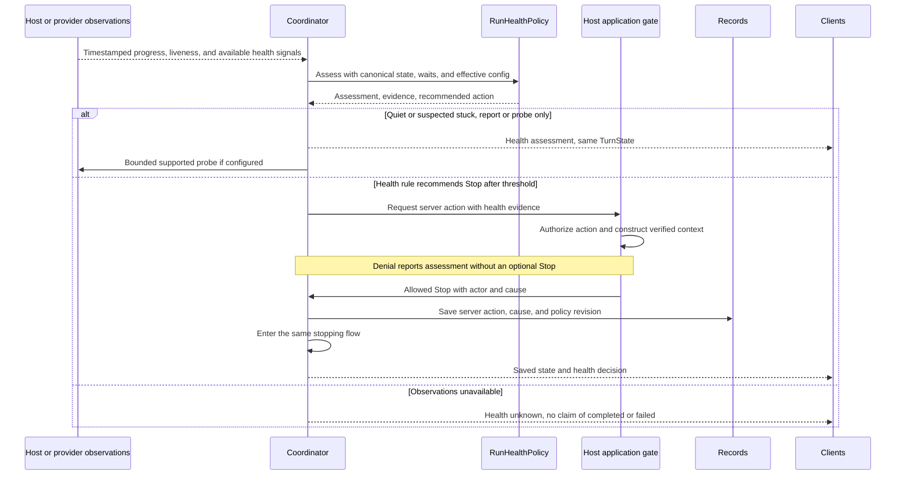
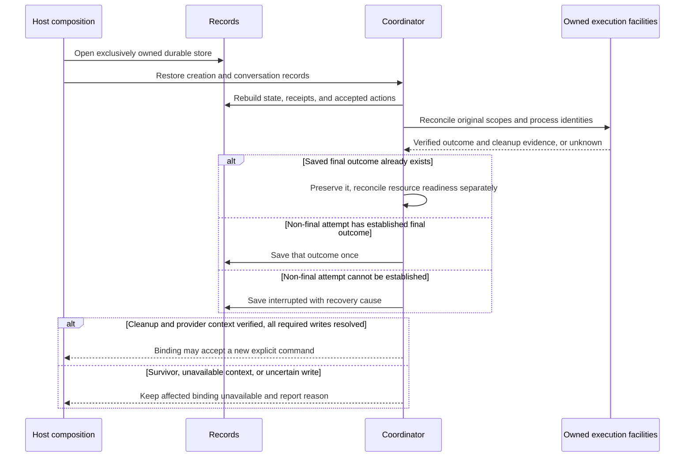

# Agent runtime classes and sequences — review supplement to ADR 0008

This is the proposed shape to review before implementation. It adds no Rust or
TypeScript code and no new service. [ADR 0008](../adr/todo/0008-agent-client-api.md)
owns the decisions, especially the [canonical turn state](../adr/todo/0008-agent-client-api.md#one-canonical-turn-state),
[capability snapshots](../adr/todo/0008-agent-client-api.md#resolve-capabilities-once-validate-against-the-snapshot),
and [Stop sequence](../adr/todo/0008-agent-client-api.md#interruption-and-resource-cleanup).
The diagrams below explain which object does each job. “Class” means a conceptual
role; Rust can implement it with structs and traits. Method names describe
responsibilities, not final Rust signatures or extra wire endpoints.

## Classes and their roles

Keep one coordinator per conversation. Give each application its own dependencies
through [typed constructor/factory injection](dependency-injection.md). None of
these classes is a process-wide mutable singleton.

| Role and layer | What its functions do |
| --- | --- |
| `ConversationRuntime` — application | `describeBinding` returns the current capability snapshot and setup status. `createConversation` resolves retries, saves creation, and supervises initialization. `loadConversation` rebuilds existing state without starting a provider. `routeCommand` locates the owning coordinator. `shutdown` stops new work and closes owned resources in order |
| `ConversationCoordinator` — application | `acceptPrompt` saves one accepted turn before execution. `acceptSteer` saves guidance for the same active turn when supported. `requestStop` starts the shared cleanup flow. `answerInteraction` resolves the exact pending interaction. `applyProviderUpdate` checks ownership and saves normalized results. `applyHealthDecision` records and applies an allowed policy action. `reconcile` restores known state without repeating uncertain work |
| `EffectiveCapabilities` — SDK immutable value | Carries boolean features and applicable constraints from the configured execution path. Pure `validate` checks command requirements locally. It knows no authorization policy or turn lifecycle |
| `ModelMetadata` — descriptive data | JSON entries parsed at startup and keyed by provider/model ID. Required feature fields are booleans; missing models are configuration errors. No provider request logic or mutable turn state |
| `Conversation` — domain aggregate root | `decide` checks invariants and returns proposed ConversationEvent values, or a domain rejection. It owns the single active-turn slot, exact-turn controls, and interaction validity. `apply` applies committed domain events. `currentTurn` exposes the relevant domain state. It does not load an entire transcript into memory |
| `Turn` — domain entity inside Conversation | Owns its identity and canonical state transitions. `canApply`, `transition`, and `isFinal` implement those pure rules for the aggregate. Callers cannot bypass Conversation to mutate a Turn independently. No provider, transport, UI, or application DTO imports |
| `RunHealthPolicy` — domain decision using domain observations/config | `assess` derives healthy/quiet/suspected-stuck/unknown. `decideAction` recommends report, probe, or Stop under the effective configuration. It never changes a turn, starts a replacement, or kills a process itself |
| `ActionContext` — application value | Carries verified actor, surface, optional instance, and cause. It is immutable for the accepted action. The record adds its IDs, time, input, and receipt. Domain code receives translated domain values where needed |

The host authorizes each operation before SDK access, including receipt retries,
reads, and subscription delivery. The SDK then resolves the receipt **before** new
capability/state checks. An identical accepted steer retried after completion
returns its old receipt without steering again. The coordinator serializes new
capability/readiness checks, the aggregate decision, and its commit. Reading saved
history does not require provider capabilities.

The metadata JSON is parsed at startup. A simple factory builds the selected
capability object from that data, declared binding support, and agent settings.
No resolver service, capability discovery, or unknown support state is needed. See ADR 0008's
[metadata rules](../adr/todo/0008-agent-client-api.md#a-small-model-metadata-catalog)
and [snapshot lifetime](../adr/todo/0008-agent-client-api.md#snapshot-lifetime-and-changes).
The coordinator replaces the capability object and matching configuration together
when model/settings change. Metadata-file edits take effect on restart. Commands
only read/validate that value. Updating configuration
never changes the meaning of an already accepted action or enables replay effects.

### DDD boundaries without extra machinery

`Conversation` is the aggregate root for accepting and controlling its turns.
The coordinator is an application service: it loads that aggregate, gets current
external facts, asks it for a decision, commits the resulting records, then runs
allowed effects. Serializing commands is the coordinator's mechanism; allowing
only one active turn is the aggregate's business invariant. EffectiveCapabilities
validates input against already resolved features and limits. The aggregate
validates lifecycle invariants when deciding; a cached display result cannot bypass
its rules or the SDK's capability validation.

Use domain values for ConversationId, TurnId, SurfaceId, and state where they
protect meaning. ActionContext is an immutable application value, translated into
domain actor/cause values when rules need them. Domain changes are not WebSocket,
ACP, or generic stream payloads: application/adapters map them to the durable
semantic record schema and published wire records. Keep the useful runtime state
inside the aggregate; transcript content, listing indexes, and receipts are
rebuildable read views, not huge object graphs loaded for each decision.

Authentication remains its existing bounded context. The host application consumes
its authorization port before entering the SDK. The SDK has no dependency on that
port, membership, grants, or gateway policy. Provider
and storage adapters translate external data inward. No cross-context aggregate
or transaction is invented to join auth and conversations.

RunHealthPolicy is a small pure policy, not an aggregate. Capabilities, actor
context, cleanup evidence, and health observations are values with clear owners,
not independent services. Add a value type or domain service when it protects a
real invariant; do not add one class per field, generic repositories, a command
bus, a DI container, or event-sourcing/CQRS frameworks just for this design. The
existing records port is sufficient until a concrete aggregate-loading need
justifies a narrower interface. These class boxes can share modules; they do not
imply one crate or package per box.

## Domain events and durable records

Use a small typed `ConversationEvent` family for facts decided by the aggregate.
Commands express intent; domain events express the resulting domain decision.
A returned event is pending until its durable commit is confirmed. It must not be
published as an accepted fact or trigger external work before then.

| Concept | Example | Owner |
| --- | --- | --- |
| Command | StartTurn, SteerTurn, RequestStop | SDK application input, translated into domain values |
| Domain event | TurnAccepted, SteeringAccepted, StopRequested, TurnCompleted | Conversation aggregate |
| Semantic record | Durable acceptance/state record with event ID, actor, receipt, and domain payload | SDK application mapping and record schema |
| Wire record | Serialized saved record delivered over WebSocket | Gateway adapter and product protocol |
| Provider update | ACP content, interaction, or final result | Binding adapter translates it inward |

These are representations with different responsibilities, not separate event
stores or competing state machines. Conceptual domain-event names are not new
wire names or schema versions. Map them to the current agreed semantic contract.
The generic stream library stores/orders records; it knows no Conversation rules.

Keep the decision/apply pattern simple: `decide` returns proposed events without
mutating committed state; `apply` folds committed events into the aggregate.
On a write failure, do not leave memory claiming an unsaved acceptance. On an
uncertain write, reconcile its stable ID before another decision or effect.
Replay decodes committed records and applies their domain facts; it never runs
command handlers, contacts a provider, or repeats external effects. Crash recovery
uses the existing interrupted-attempt rules, not replay-driven agent execution.

Examples include TurnAccepted, TurnStarting, TurnRunning, InteractionRequested,
InteractionAnswered, SteeringAccepted, StopRequested, TurnCompleted, TurnCancelled,
TurnFailed, and TurnInterrupted. Define only events needed by implemented rules.
One decision may describe multiple related facts: save an indivisible transition
in one semantic record, or an atomic append supported and verified by the store.
Do not introduce separate non-atomic writes for facts that must agree. The same
acceptance record contains its receipt; no second receipt store.

Not every saved observation is a domain event. Raw provider output, health samples,
and cleanup evidence enter through adapters/application handling. Where evidence
changes a domain decision, pass domain values to Conversation: confirmed cleanup,
for example, can justify TurnCancelled. Cleanup evidence after an already-final
turn stays a separate resource fact and cannot reopen its lifecycle.

The coordinator explicitly calls the binding after confirmed persistence.
TurnAccepted does not launch an agent through a hidden event handler. The existing
stream subscription path is sufficient for read projections; no mediator, command
bus, event-handler framework, or second in-memory broadcast is required. This
proposal adds domain vocabulary and typed boundaries, not another execution system.

## Effect interfaces and adapters

| Interface | Owner and limits |
| --- | --- |
| `AgentBinding` | Application-owned port implemented by the ACP adapter. Reports actual support, creates native context, starts one correlated turn, and maps supported controls. `steer` remains unavailable until verified. Provider callbacks carry turn and execution-scope IDs before entering queues |
| `ConversationRecords` | Application-owned port implemented through the external stream library. Saves whole records, reads after a cursor, and subscribes to saved history. The library owns ordering, duplicate appends, storage, and replay/live handoff. No second receipt database |
| `ResourceAuthorization` | Host application dependency, outside the SDK. Existing auth checks the verified actor, action, and resolved resource before SDK calls or record delivery. Direct hosts enforce their own access policy |
| `HostExecution` | Host-owned adapter with an application-facing port. Owns process scopes, optional observations, termination, exit collection, and resource release. A scope belongs to the original conversation/turn and cannot be reused to kill a newer one |
| Clock and ID source | Small injected facilities used where needed. Deadlines use a monotonic clock; persisted evidence also records wall time. Tests control time without changing a global clock |

Startup composition constructs these adapters and their lifetimes. The binding
and coordinator use the **same owned execution scope**: the binding handles
provider cooperation; the coordinator supervises the deadline and requests host
escalation. They do not run competing cleanup supervisors. Closing/terminating an
already closed scope is safe; verifying cleanup is still required.

The gateway adapts authenticated requests and supplies verified ActionContext.
Direct hosts and internal server actions supply an equivalent trusted context
after enforcing their host access policy. No untrusted request may manufacture actor,
server-surface, or cause fields. Existing read adapters keep their narrower ports.

## Start, check capabilities, and save before execution

The diagram's success path assumes each write is confirmed. If any write is
uncertain, preserve its event ID/input and reconcile it before proceeding. Never
start the provider because a write merely timed out. During execution, storage
failure may require protective Stop; cleanup must not wait for a successful write.
All waits are bounded. Provider/network work does not occupy the coordinator's
command-processing loop.

## Steering the current turn

The [steer record contract](../adr/todo/0008-agent-client-api.md#record-steering-as-an-action)
is proposed product behavior, not a claim about current ACP support. It uses the
same stream infrastructure as normal input and a distinct semantic action.

If the provider cannot acknowledge consumption, keep that evidence unknown; do
not invent confirmation. Stop/completion can happen after acceptance but before
forwarding. The binding must reject delivery to a finished/replaced scope, and the
coordinator records that outcome for E. A crash never causes automatic re-forwarding.
The original steer receipt remains acceptance, while later records describe delivery.
The provider's later echo of input must not create a second human prompt in history.

## Stop, cleanup, and the next queued prompt

[ADR 0008's Stop sequence](../adr/todo/0008-agent-client-api.md#interruption-and-resource-cleanup)
shows cancellation, approval retirement, graceful cleanup, forced termination,
failed storage, and the already-final/duplicate branches. This diagram shows what
a surface does around that server-owned flow:

A command receipt alone never releases B. Neither does a local timeout or a quiet
stream. If Q disconnects, R still owns T. If sending B loses its reply, Q reconciles
that same request ID before deciding whether B is still pending.

## Observe health without another turn state machine

Report/probe-only is the default for silence. User-configured automatic Stop still
passes through the trusted server action context, resource policy, and coordinator.
Mandatory resource protection uses its configured host execution limits and
preconfigured supervision authority, not a new SDK access-policy check. Neither route
changes the actor to the original human or creates a second cleanup mechanism.
Use the normal protective-stop exception if storage is unavailable.

A heartbeat only proves a heartbeat arrived. CPU activity only proves some CPU
activity. An ordinary tool can be quiet for a long time. Expected input waits have
explicit deadlines. Policy must consider these distinctions and missing data,
not guess death from “no tokens for X seconds.” Store meaningful decisions and
changed assessments for traceability when possible; this does not require saving
every CPU sample into conversation history or building a telemetry service.

## Restart recovery

Recovery does not infer failure from silence or success from a dead parent PID.
It must consider owned descendants and remote uncertainty. Do not kill by process
name or stale PID alone. Do not create another active attempt, resume a new native
session under the old identity, or repeat a tool/steer merely to discover what
happened. Unrelated conversations may continue when the failure is isolated.

## Review checklist

- One metadata JSON file parsed at startup and an immutable capability object;
  one domain TurnState definition;
  one coordinator owns each conversation. Health is an assessment, not a new turn.
- SDK discovery and validation share capability logic. The aggregate owns state
  rules; host authorization precedes all SDK access. SDK receipt lookup precedes
  new capability/state checks, and replay never performs effects.
- Accepted actions, including server actions, record verified actor, surface, and
  cause. Resource permission is checked independently of surface metadata.
- Confirmed acceptance, provider delivery, final turn outcome, and cleanup readiness
  are explicitly different facts. The same record source backs their saved views.
- Stop and recovery cover child processes, quiet work, races, unknown writes, and
  unknown execution. No uncertainty triggers an automatic repeat of external work.
- Tests substitute binding, records, clock, and host facilities in two
  isolated instances, then verify the real ACP/SQLite/process path. Steering stays
  unavailable unless that concrete binding passes its support and race tests.

Exact Rust signatures, generated payload definitions, supported-provider feature
mapping, and numeric limits are implementation details to review with these
contracts. This supplement is not approval to implement deferred systems.
