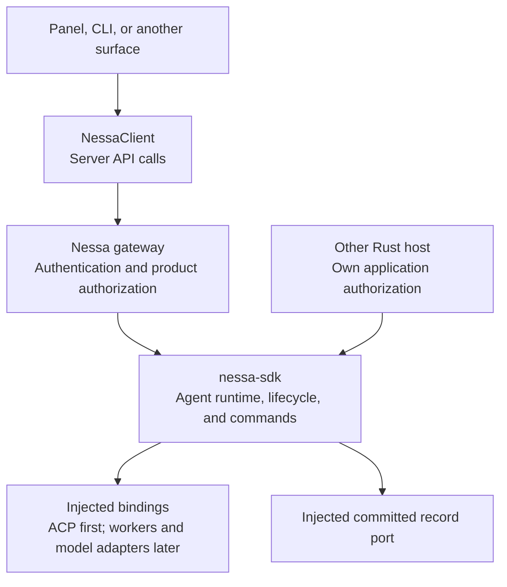
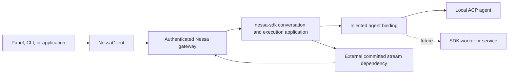

# SDK server runtime shape

This document describes the proposed server conversation runtime under
[ADR 0008](../../adr/todo/0008-agent-client-api.md). Model metadata, effective
capabilities, Agent/session storage, invocation hooks, SDK queueing/removal, native
ACP steering, operation capability discovery, and idempotent submission recovery
are implemented. Shared conversation coordination, gateway turn commands, and UI integration remain
proposed. The [execution guides](../../../crates/nessa-sdk/docs/agent_execution/README.md)
describe the implemented public contract.

## Recommendation

Build `nessa-sdk` as the reusable Rust runtime embedded in the server. Agent
execution, selection, preflight, and authoritative lifecycle live on the server
side. NessaClient sends API requests and observes server results/events. The UI
chooses whether follow-up input queues, steers, or stops active work.

Nessa should grow into a **superset of supported features across integrations**. A shared lifecycle is the starting point, not a ceiling on functionality. Add typed operations for capabilities such as structured output, approval requests, forks, checkpoints, subagents, and artifacts as real integrations earn them. A capability being part of Nessa's API does not mean every backend can provide it. Unsupported requests must explain what is missing before work starts where possible.

Start with local ACP and a Claude agent binding. Interpret “Claude and Anthropic” here as the Claude agent using Anthropic models through an ACP adapter. A direct Anthropic Messages integration is a separate future model route. The [Claude ACP adapter](https://github.com/agentclientprotocol/claude-agent-acp) uses the Claude Agent SDK; it is not an ACP interface on the Anthropic Messages endpoint. The current pinned release and verified native profile are recorded in the [Claude guide](../../../crates/nessa-sdk/docs/claude-acp.md).

## Integration boundaries

A model API produces messages and tool-call requests; an agent loop and its state
still need an owner. An external harness owns its own loop, tools, workspace, and
conversation context. Nessa's binding preserves those boundaries instead of
silently substituting a direct model call for a harness operation.

Configuration, terminal execution outcome, cleanup, and persisted history are
separate facts. Cross-provider restoration or durable replay requires an explicit
implemented contract, not a shared method name.

## Selection has several independent parts

| Concept | Meaning | Example, not a fixed identifier |
| --- | --- | --- |
| Nessa gateway | Where this client authenticates and sends product operations | Local Nessa server |
| Integration provider | How the server reaches the agent | `acp`; later a registered SDK worker or service adapter |
| Agent | The harness or configured agent to run | Claude agent, OpenCode, Kimi Code, a Nessa-owned agent |
| Model provider | The inference service used by that agent, if exposed | Anthropic, OpenAI, DeepSeek, Moonshot |
| Model | An exact provider/model entry in the injected metadata catalog | A configured OpenAI or Anthropic model ID |
| Binding | One installed integration for one agent, with its actual capabilities | Server-owned binding ID |
| Execution profile | Server-owned workspace, process, credentials, and permitted settings | A local workspace profile |

The host configures available agent bindings and their model selection. The model
catalog is separate from the integration registry: its provider identifies the
inference service, not an ACP transport. Selection uses an exact provider/model
key from the immutable JSON catalog. A missing entry is a configuration error;
it does not trigger provider discovery. Binding adapters translate configured
selection into their native controls. ACP does not guarantee a universal
vendor/model pair. Missing or ambiguous workspace/profile context fails explicitly.

Backend factories remain selected and injected at server composition. A request chooses among already registered bindings; it cannot construct an arbitrary backend. This preserves [typed dependency injection](../dependency-injection.md), including its rule against choosing infrastructure implementations from request parameters. Future bindings are added explicitly, without a global service locator.

## Our own reusable runtime: nessa-sdk

Build `nessa-sdk` as a Rust agent runtime library embedded in the server.
NessaClient calls the authenticated server API, whose handlers invoke the SDK. Another authorized Rust host can embed the library
with its own injected adapters. The crate implements model metadata, effective
capabilities, and local execution. The conversation/server architecture below
remains proposed.

| Component | Owns |
| --- | --- |
| UI/orchestrator | Pickers, presentation, unsent drafts, and explicit queue/steer/stop commands |
| NessaClient | Server API calls, request IDs, authentication, connection/reconnection, event observation, and remote command reconciliation |
| Nessa gateway | Wire translation, authenticated caller context, and Nessa product authorization before SDK invocation |
| nessa-sdk | Selection/preflight through bindings, effective run configuration, conversation/turn admission and lifecycle, execution coordination, normalized events/results, durable receipts and recovery semantics |
| Host composition and adapters | Concrete bindings, credentials, OS facilities, optional isolation implementations, storage backends, and owned resource startup/shutdown |

The SDK owns typed application ports and DTOs. Host composition injects bindings,
persistence/events, content, time, and required execution facilities. Host
application entry points enforce resource/action authorization before SDK access;
the SDK receives verified action context, not policy grants or an auth interface.
Domain rules do not depend on transport, UI, provider SDKs, or application DTOs.
Each runtime instance is independent; no global backend or service locator is
introduced. Tests can replace the ports without sockets or real agent processes.

Gateway commands invoke SDK application operations. The gateway does not maintain
a second turn coordinator. Durable admission, receipts, lifecycle transitions,
and recovery have one owner in nessa-sdk; concrete persistence uses the planned
external stream dependency. SDK event observers and client projections do not
become competing sources of truth.

NessaClient shares its existing authenticated connection for API calls and event
subscriptions. Direct Rust embedding enforces access policy and supplies trusted action context
through its own application boundary. No TypeScript SDK is planned.

External ACP harnesses keep their own loops and tools. For Nessa-owned agents,
the runtime can coordinate model calls and tools through injected adapters.
Isolation requirements and cleanup policies belong to execution contracts;
concrete OS/container implementations belong to hosts or optional adapters.
Do not add all future engines or sandbox implementations in the first ACP slice.

## Server operation contracts

The planned server API exposes configured capabilities, conversation creation/retrieval,
turn submission, steering, Stop, interaction responses, and status/event/result retrieval.
The Rust SDK owns their execution semantics. Wire names follow ADR 0008.

Creation resolves registered agent/model selection and workspace/profile context
inside the SDK, including preflight and effective configuration. Missing or
ambiguous context fails explicitly. NessaClient handles request bookkeeping;
the gateway supplies authenticated context and applies product authorization.

Conversation identity, admitted turn identity, mutation request identity, and
replay cursor remain separate. Mutation IDs survive identical retries and
reconciliation. The server commits admission before acknowledging success and
never treats reconnecting as permission to rerun an uncertain prompt.

Steering targets one active turn and may be unsupported. A steering receipt does
not prove model consumption. Stop acknowledgement does not prove completion
or roll back tool effects. Closing a client connection does not stop execution.
Server state and committed records are authoritative; client projections identify
stale state and stream gaps. Retrieval/replay does not implicitly restart or
resume a provider process.

The UI owns unsent drafts; admitted follow-ups belong to the SDK Agent queue.
The future gateway routes authenticated commands to that shared owner. The server admits
one active turn atomically and rejects competing new turns with `turn_busy`.
Stop-and-send waits for both the terminal outcome and confirmed binding readiness.
Failed cleanup keeps the draft and shows the error. Peer inbox `next_turn` delivery is
a separate contract and does not authorize starting a future turn. See
[surfaces and collaboration](../surfaces-and-collaboration.md).

Detailed durability, cleanup, delivery, and acceptance requirements live in
[ADR 0008](../../adr/todo/0008-agent-client-api.md).

## Creator and surface metadata

ADR 0008 includes immutable conversation creator/surface provenance, separate
provenance on each turn and control action, and an extensible `SurfaceId` with
well-known Nessa constants generated from the shared protocol. Actor identity is
derived from trusted context and claimed surface namespaces are validated.
`surfaceId` identifies the stable surface; `surfaceInstanceId` identifies an
individual registered instance. The UI owns visibility and grouping; authorization
continues to govern access independently of origin filters. See
[the ADR provenance contract](../../adr/todo/0008-agent-client-api.md#creator-and-surface-provenance)
for delivery and validation requirements.

## How the superset grows

Expose a small lifecycle plus typed feature operations as real integrations need
them. Model metadata uses required booleans for supported/unsupported features.
The implemented factory combines the selected entry with binding restrictions and
configured agent settings into one immutable `EffectiveCapabilities` snapshot.
Restrictions can disable features; they cannot enable a model feature marked
false. The UI reads that snapshot and SDK commands validate against it locally.
Host authorization and conversation lifecycle checks remain separate decisions.
The catalog's context window is the published model ceiling; a harness's configured
window may be narrower. The implemented catalog does not read harness settings.

| Feature family | Nessa representation to grow toward | What must stay honest |
| --- | --- | --- |
| Messages and multimodal input | Typed text, image, file/resource parts and output content | Reject unsupported parts; do not silently drop them |
| Tools and approvals | Tool lifecycle events plus correlated interaction requests/responses | External harnesses keep tool execution and approval semantics; Nessa policy can further restrict access |
| Questions and elicitation | Typed interaction variants, including structured forms where supported | Asking a question is distinct from authorizing a tool |
| Output schema | Typed structured-output request and validated result | Native support and Nessa-owned validation/retry are different mechanisms with different costs |
| Reasoning and mode | Advertised options and effective configuration | Do not invent equivalent effort levels across providers or fabricate hidden reasoning |
| Memory and recovery | Transcript reading, native resume, fork, and checkpoint as separate capabilities | A replay cursor is not an agent checkpoint; transcript copying is not native resume |
| Subagents and handoffs | Child identities, relationships, lifecycle and delegated output | Preserve provider ownership; orchestration features are not universal |
| Files and artifacts | Authorized resource references, edits, citations, provenance | Provider paths/URLs need translation and access checks, not blind forwarding |
| Usage, budgets, tracing | Reported usage and typed controls with source/availability | Hard enforcement and best-effort estimates must be distinguishable |
| Provider-specific behavior | Named, schema-validated extension operations and event payloads | No raw SDK object, arbitrary method invocation, or unvalidated options bag |

Promote a feature to a common API when its meaning can be stated and tested across relevant bindings. Preserve distinct semantics through typed variants when they differ. An adapter can expose a namespaced feature before it becomes common. Extensions still use Nessa authorization, validation, attribution, and event normalization. They are not a tunnel around the gateway.

Rust bindings use typed configuration and declared support. Required protocol setup does not populate or override model metadata. Commands perform no capability discovery or negotiation. Future extension schemas must be validated at the boundary and mapped to application-owned DTOs. Do not create a universal `Record<string, any>` or ship empty adapters for every vendor now.

## ACP mapping for the first slice

The [ACP prompt lifecycle](https://agentclientprotocol.com/protocol/v1/prompt-turn) separates setup, prompt submission, session updates, permission interaction, and terminal completion. Map that lifecycle into Nessa's turn model. A stream of text alone loses tool progress and user interaction.

[ACP session configuration](https://agentclientprotocol.com/protocol/v1/session-config-options) advertises option IDs, values, ordering, and current state. Prefer `configOptions`; use `session/set_config_option` to apply supported choices and consume the full returned configuration. Option categories help presentation but are not required for correctness. Do not assume an option is literally named `model` or that its value is a portable model ID. The binding maps the configured model selection to the actual native option. These protocol values do not replace Nessa model metadata. Implement only the selected adapter contract; compatibility support requires an explicit request.

Install configuration and its capability snapshot at a serialized command boundary. Keep them stable for an accepted turn; changes apply to future work. Record requested and effective settings. If the configured integration cannot deliver the selected configuration, return an explicit error; do not substitute another model or provider.

The concrete Claude ACP binding must pass a compatibility probe before it is advertised as ready: initialize, authentication/setup, session creation, advertised configuration, prompt/update completion, permission response, cancellation, and process cleanup. Test resume only if advertised. Pin the selected adapter/protocol dependency during implementation and record its supported optional extensions. The selected native profile does not establish compatibility with every release.

## Ownership behind the facade

NessaClient calls nessa-sdk through the authenticated gateway. The gateway owns product authorization and wire translation. The pure conversation aggregate decides transitions and returns domain events. The application commits them, applies committed state, then starts effects; replay applies records without agent or tool calls. The SDK application coordinates conversation/turn identities and admission; NessaClient receives the observed state through the API. Binding adapters feed provider events into Nessa's Rust normalizer, which produces the canonical event payloads defined by the shared schema. The external stream dependency owns committed ordering and replay under [ADR 0009](../../adr/todo/0009-reusable-event-stream-crate.md). Use its real API when available; do not implement a temporary second stream runtime or claim that today's `client.on()` replays missed events.

Rust cannot directly import a TypeScript or Python agent SDK. A future SDK integration may use a supervised worker with a typed protocol, or call an existing service through an adapter. Composition owns startup/shutdown, bounded calls, crash handling, and credentials. Browser clients do not spawn agent processes or receive model secrets. All local use remains possible without hosted Nessa signup.

External harnesses retain their prompts, tools, configuration, credentials,
approval behavior, and agent loops under [ADR 0012](../../adr/todo/0012-agent-harnesses-and-optional-tools.md).
A Nessa-owned model/tool loop would be a separate explicit integration.

## Alternatives and judgment

| Option | Judgment |
| --- | --- |
| Copy `chat.completions.create()` as the whole API | Familiar for inference, but too narrow for long-running sessions, tools, permission requests, and replay |
| Expose each provider's SDK directly | Full access initially, but leaks runtimes, credentials, event schemas, and lifecycle into every surface |
| Make ACP the public Nessa API | Good first transport; tying the public contract to it would constrain richer future integrations |
| A generic `invoke(provider, method, args)` | Easy routing, weak types, unclear authority, and no dependable common behavior |
| Build all SDK adapters before the first turn | Delays learning and invents unused dependencies; retain their requirements in the design instead |
| Shared conversation lifecycle plus typed capabilities | Recommended: familiar calls, one gateway boundary, and room for features beyond ACP |

## Delivery and validation

The metadata, effective-capability, and local Claude ACP foundations are complete.
The remaining delivery steps concern durable conversation behavior and host wiring.
Harness settings readers remain proposed.

1. Verify the external stream library's real local SQLite adapter. Test atomic
   acceptance records, append retries, and reads after restart. Retain the current
   execution binding's verified configuration, permission, restoration, and cleanup
   contracts while adding durable coordination.
2. Deliver one complete conversation through the SDK, authenticated gateway,
   NessaClient, and panel. Add the required aggregate, injected ports, the existing effective
   capability snapshot, saved receipts/events, interactions, Stop, retrieval, and
   origin metadata. Follow ADR 0008 and the generated protocol for wire names;
   retain `requestId` as the mutation identity and add no aliases or version bumps.
3. Verify recovery, races, and reuse: lost replies, duplicate/conflicting request IDs,
   replay without effects, storage failures, slow subscribers, process failure,
   cleanup, and two isolated SDK instances. Test host authorization at every entry
   point separately from SDK capability and lifecycle validation. Stop-and-send
   requires terminal state and confirmed binding readiness; cleanup failure retains
   the draft. Unsupported steering starts no replacement work.
4. Add another binding when a product use case requires it; a later direct
   SDK/service integration must establish its own transport contract. Test adapters
   prove substitution, not production-provider support. Add feature contracts when
   a real integration needs them.

The remaining choices concern the durable stream integration and which additional
provider capabilities concrete product use cases require.
