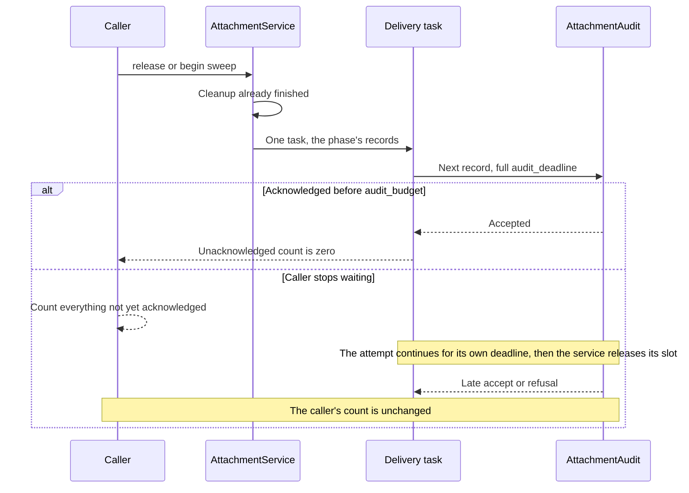

# Artifact source ownership and verified synchronization

Owner: [#273](https://github.com/nessalabs/nessa-agent/issues/273).
Status: local persistence, manifest facts and tracked bounded range reads are
implemented. The original published consumer passed local and platform checks;
the refreshed private-worker dependency passed its required gates at `4a2384f7`.
The retirement retry correction is in review.
Protected transport is not active. The shared worker producer is `f36ac5d0`,
on merged `c2f3b0ec`. The linked-device
integration plan owns cross-feature activation; this document owns the artifact
source state and persistence proposal. [Architecture](../ARCHITECTURE.md),
[dependency injection](dependency-injection.md) and the
[coding standards](../../CODING_STANDARDS.md) remain their existing owners.

## Merged baseline before this slice

The [attachment module](../../crates/nessa-server/src/attachments/mod.rs) keeps
bytes once per stored digest and one hold record per organization, conversation,
stored digest and media type. `LocalAttachmentStore` atomically publishes each
record through a private temporary file, file sync, replacement, and directory
sync under its change lock. Pending records are invisible but retain bytes.
Creation audit and a conversation ownership recheck precede confirmation.
Confirmation may take over a pending claim; a Kept record is not replaced.
Release currently removes records and then purges unheld blobs. A corrupt record
protects bytes conservatively and reports failure. Startup removes temporary
files; it does not reconstruct missing holds from audit.

`FilePath` and tool content in the SDK are observations, not permission to capture
host files. This source proposal covers existing held uploads. It adds no
provider-path capture, product methods, paired receiver or runtime activation.
The reusable artifact contract is implemented at pinned `nessa-sync`
`f2a05ef24fcff66df9d55e508539cec718e2d805`: manifests, exact bounded chunks,
durable resume and verified publication already have owners there.

## Identity and content

Each usable held lifetime has one immutable registration. Its content describes
`Hold.stored`: normalized image bytes when normalization occurred, not the original
upload. Live has revision1; retirement has revision2 Deleted. A subsequent upload of
the same bytes creates a new lifetime and identity. The digest, filename, media
type and display name do not serve as registration identity.

`ArtifactId` is a fixed hexadecimal encoding of SHA-256 over the explicit
`nessa attachment registration` domain separator and the exact existing saved
claim-generation bytes. This is an encoding of the identity minted at the hold's
pending write, not a hash of file attributes. The durable generation remains the
claim owner; no separately persisted artifact id can disagree with it. It becomes
externally usable only when confirmation chooses the final generation. A pending
claim can change; an advertised Kept generation cannot. Production currently
mints UUID generations. Existing valid records retain their exact generation;
no ID is reminted during restart or adoption. Exact-id lookup also detects
conflicting existing generations or multiple active records rather than selecting
one by enumeration order.

New generation allocation checks for a conflicting current or archived identity
in that conversation before publication. An archive name collision must match
exact generation and retired record; otherwise fail as corrupt, never overwrite.
The fixed encoding also makes filenames independent of legacy generation syntax.
The identity constructor owns this encoding; adapters consume it rather than
reimplementing it.

Artifact scope consumes the reusable receiver, source, conversation, artifact
storage incarnation, schema and current access epoch. Native/auth producers must
publish the concrete source/receiver/epoch mapping before wire activation.
Attachment storage incarnation is a separate durable storage lifetime, not an
alias for a transcript incarnation. Its initial durable publication and restore
reset are queued with the recovery/integration owner. Local source results carry
registration and content facts; they do not invent a receiver or authorization
scope.

## One durable owner, two locations for one retired record

Keep the existing primary hold path:

```text
attachments/
  blobs/<stored digest>
  incoming/<private transfer temporary>
  holds/<organization hash>/<conversation>/
    <stored digest>-<media type tag>.json       Pending, Kept, or Retired
    retired-<artifact id>.json                Retired only
```

The primary record remains the sole active hold authority. Add a Retired variant
in the same canonical saved-record codec. Pending and Kept retain their current
saved fields and state spelling; Retired carries the original hold/generation,
the prior Pending/Kept state and exhaustive retirement evidence: an explicit release carries validated initiator,
cause, correlation and requested time; an upload reversal carries its actual
RevertCause and original verified hold caller/correlation. Revision is derived from state, not an independent
integer that can disagree. State-specific decoding is exhaustive, without aliases
or a fallback legacy decoder. Existing valid Pending/Kept records are therefore
already canonical records, not converted through a compatibility shim.

Primary names start with the stored digest; archive names start with `retired-`.
These name forms are disjoint. The archive is completed release metadata. It contains no Live
record, active boolean, byte owner or independently maintained active index.
Lookup incrementally scans current primary records, retaining one bounded decode
and exact match rather than a collection of every hold. It completes corruption
and conflicting-identity checks before returning Live. The number of scanned
files and its runtime are separate from encoded manifest size; no bounded scan
latency is claimed. Lookup examines current primary records for an exact generation-derived identity,
and looks directly at the identity-named tombstone archive file. No digest-only request reaches bytes.
An archived non-Retired record is corrupt and cannot grant content.

### Retirement publication

Under the existing change lock, replace each Pending/Kept primary record with its
Retired variant, using private temporary file, file sync, atomic replacement
and parent-directory sync. The acknowledged source transition is this durable
record publication. Only then may that record stop retaining its blob. Purge
still computes retention over all conversations; an unreadable primary record
retains its filename's digest. A valid Retired primary record does not retain
bytes. Tombstone metadata does not prevent another conversation from retaining
its own hold of the same digest.

The application passes its already validated `ReleaseEvidence` into explicit
release, and passes actual `RevertCause` into take-back. Owned discard of Pending
and Kept both publishes Retired; Pending had no prior Live content. A late discard
of Retired returns NotMine. Private failed-pending-write cleanup can remove only
a still-Pending exact generation, never Kept or Retired. `ReleaseReport` carries `RetiredHold` (original hold, RetiredFrom and exhaustive RetirementEvidence) for confirmed retirements. Each actually removed digest is one `RemovedBlob` containing the complete selected-target primary retirement set for that digest acknowledged during retirement attempts or subsequently confirmed by the authoritative retention scan. Already-Retired records are re-synced and return their saved evidence before cleanup; new retirement returns the same values it saved. Grouping is ephemeral report assembly from those same metadata records, not another ledger. Directory iteration cannot choose a uniquely last causal hold; contributor order conveys no chronology. Per-hold retirement audits stay separate. Blob audit records automatic stored→absent unheld cleanup and the complete related original retirement evidence, each with its own predecessor/cause/caller. The later request owns only newly withdrawn tickets and newly retired active holds. Repeat confirmation can repeat original evidence, not exactly-once audit delivery; existing audit sink
failure does not resurrect the hold. Durable Retired metadata retains the
transition's cause and initiator when the independent audit write fails. This is
state evidence, not another audit dispatch queue: no automatic audit replay or
exactly-once audit claim is introduced. Blob removal remains a separate outcome
in the existing report/audit. A crash can leave extra unheld bytes; it cannot make
a Retired registration Live. Recovery must not claim blob removal without the
actual removal result.

If replacement or directory sync fails, report storage failure and do not grant
bytes from a possibly observed Retired state. Reload the authoritative file on
the next operation. A file-sync success followed by directory-sync failure is an
uncertain durable transition, not proof that release did not happen. A source read must sync the authoritative record directory before returning a
manifest derived from a state whose publication may be uncertain. A sync failure
is Unavailable. This prevents advertising Deleted before it is durable and then
advertising the preceding Live state after restart. Purge waits for confirmed
publication. This can retain extra bytes.

### Reupload and archive publication

A repeated upload while the primary record is Kept returns that existing hold and
registration. Its original creation audit/caller is preserved. A primary Pending
record can be superseded under existing claim semantics; nothing advertised that
unconfirmed identity as Live. Confirmation additionally checks that the proposed
claim generation has not already been released at either canonical name form. A
late claim from before release cannot take over a later Pending record, even
though current confirmation permits Pending takeover. It returns Gone without
changing the later Pending record. This is necessary to prevent resurrecting a
retained Deleted identity; generation allocation checks alone are insufficient.

Before replacing a Retired primary record, atomically rename that exact Retired
file to `retired-<artifact id>.json` in the **same conversation directory**
while holding the same change lock, then sync that directory. The record's contents do not change
in this move. If the destination already exists, require exact identity/evidence
agreement; a disagreeing record is corruption. After confirmed archive publication,
publish a new Pending record with a fresh generation through the existing upload
path. Confirmation/audit/ownership recheck retains its current order.

A crash during archive movement leaves the same Retired state at the old or new
location. It grants no bytes in either location. If durability is uncertain, do
not publish the new Pending record. After reopen, exact-id lookup examines both name forms; a same-id duplicate
must agree and is still Retired, not a second active owner. Startup clears
private temporary files without decoding authoritative records.
A new Pending record cannot be persisted until the old tombstone's archive
publication is confirmed. This ordering replaces a cross-file transaction with
one durable release followed by an identity-preserving move and then creation;
no independently writable active manifest exists. A reupload retry also syncs the
conversation directory before publishing Pending when the primary is absent: an
earlier uncertain rename may have left its tombstone visible only in the archive.

### Adoption and recovery

Existing Kept records expose revision1 using the saved immutable generation and
exact stored attachment, once the source API is active. Existing Pending records
remain invisible and retain bytes. No startup live registration journal is
created, no provider is opened and no old audit is interpreted as permission.
Retired records retain revision2 across restart and later access-epoch resets.
Corrupt/unreadable primary records preserve their current conservative physical
retention; corruption is typed unavailable, not synthetic deletion or permission.
Archive corruption refuses that identity and reports failure. Temporary files are
cleared using the existing startup policy; authoritative records are not inferred
from temporary names. Actual crash tests must establish supported filesystem
replacement/move durability; this design is not platform proof.

## Source consumer and API

The first real consumer is a Nessa artifact source adapter for the existing held
content, substitutable in tests. It consumes an attachment application port,
`AttachmentArtifacts`, with local Nessa-owned identities/results:

- `manifest(organization, conversation, artifact_id)` returns Live revision1 with
  stored identity, Deleted revision2, Missing or typed Unavailable.
- `chunk(organization, conversation, expected_live_manifest, offset, max_bytes)`
  returns the exact bounded requested range or typed Deleted, Changed, Missing,
  InvalidRequest, Busy, Unavailable or WorkerPanicked. `ArtifactRange` owns the exact immutable expected id/revision/stored attachment and range; `ArtifactBytes` exposes only borrowed bounded bytes. A caller cannot grow its owned byte buffer through public fields.
- The lifetime owner exposes admission fencing and actual `shutdown` completion;
  callers do not infer physical release from typed request failure.

A future protected protocol adapter will map these local facts to reusable
ManifestSource/ChunkSource validation and outcomes after actual admission. This
local port consumes the reusable published chunk bound; it neither implements
those authorized scope ports nor constructs a receiving-device scope. It does
not independently decide permissions. The
existing current auth/conversation owner supplies verified admission per operation
before any future product method calls this source. A manifest is not a grant.
The first local consumer does not manufacture authenticated network access or
invent an authorization snapshot API before the native producer publishes it.

For chunks, while ordered against release under the store change lock, find the
exact Kept registration/generation/content, validate the expected identity and
open its private blob. Read only the requested range outside the change lock.
Consume core MAX_CHUNK_BYTES rather than copying the bound. An already admitted
open file can outlive unlink; new requests after release are refused. The expected
manifest must match revision/content before opening. Missing bytes are unavailable,
not a fabricated tombstone. Whole64MiB reads followed by truncation are excluded.

Physical range work must use the existing tracked read-worker implementation,
now owned by `core::read_workers`, consumed from reviewed producer `f36ac5d0`. `LocalAttachmentStore` owns one source admission semaphore shared by manifest and chunk. `ReadWorkers` alone owns closure tracking, sticky worker fault and retained drain; no source closed/failure ledger is added. A nonwaiting slot permit travels with the closure and its result wrapper until actual work and result handoff/drop complete. The owning
worker retains the OS handle and source result through actual join, including
caller loss and result-drop panic. Composition's admission fence/drain-before-store
cleanup remains queued integration. The source adapter cannot claim complete
shutdown before that composition wiring is active. Initial physical range admission is one worker per source instance, with typed Busy
and no waiter queue. That capacity remains held through actual OS read and result
completion even if the caller cancels or its deadline expires. It is distinct from
socket delivery and global record permits, and is not a whole-gateway heap bound.
The extraction is consumed. Local range and source-drain checks are implemented and locally verified by `tests/attachments/artifact_ranges.rs`, including held work, caller loss, panic and opened-before-retirement lifetime. Network capacity, socket
permit and delivery policy are likewise integration-owned; no artifact-specific
second socket ledger or guessed gateway capacity is added here.

## Required feature state/order evidence

This table records the feature contract. Current local tests cover persistence, manifest
facts, audit mapping, physical chunk work and source drain through the shared worker owner.
Protected transport, composed host drain and supported-platform acceptance remain queued
until their actual owners are integrated and verified.

| Row | Event ordering | Source result and durable owner | Regression to implement |
| --- | --- | --- | --- |
| A1 | Existing Kept record adopted, restart, same upload retried | Same saved generation, exact stored bytes, Live1 | Preexisting-record fixture and repeated reopen/retry |
| A2 | Pending takeover before confirmation | Only final confirmed generation visible; previous claim cannot undo it | Two uploads with creation audit/confirmation interleaved |
| A3 | Creation audit fails / ownership becomes Deleted | No Live publication; take back only owned pending claim | Actual service/store failure path |
| A4 | Kept release succeeds before manifest/chunk admission | Retained Deleted2, no new blob open | Local source through actual release |
| A5 | Release replacement succeeds, directory sync fails | Uncertain release; source syncs directory before manifest or returns Unavailable; no purge inferred | Inject failure plus source-read/restart boundaries |
| A6 | Release state publishes, independent audit fails | Deleted remains; durable cause/initiator retained; audit failure reported | Independent audit/store outcomes |
| A7 | Shared digest under two conversations, one releases | Only its registration Deleted; other hold protects bytes | Cross-conversation source isolation |
| A8 | Retired primary archived, crash before new Pending | Old identity remains Deleted; no current Live | Restart at same-directory move/directory-sync boundaries |
| A9 | Reupload after confirmed archive | New generation/id; old remains Deleted | Exact same bytes/media after release |
| A10 | Archive destination exists | Exact retired duplicate is idempotent; conflicting generation/evidence fails | Collision and duplicate archive fixtures |
| A11 | Corrupt primary / corrupt archive | Primary protects bytes; neither grants content or invents Deleted | Corrupt codec/path fixtures |
| A12 | Chunk open admits before release, OS read held | Admitted read may finish; new reads refused; worker/handle remains until join | Real held source + cancelled waiter + release/drain |
| A13 | Cancelled shutdown waiter / source panic / result-drop panic | Same actual drain outcome retained; later waiter cannot report false success | Existing worker owner contract consumed by source |
| A14 | Caller requests wrong content/revision/id/range | Typed refusal before byte read | Actual source API boundary cases |
| A15 | Blob missing or changes/corrupts outside owner | Unavailable or downstream hash mismatch; no verified content claim | Missing/truncated/corrupt stored-byte fixtures |
| A16 | Old audited confirmation arrives after release and a new Pending upload | Retired claim cannot confirm/take over later lifetime; new Pending untouched | Real service/store late-confirm ordering |
| A17 | Late discard_generation or discard after release | Retired primary/archive remains; cleanup reports NotMine | Exact old claim cleanup after release and after reupload |
| A18 | Live manifest exposed, then matching Kept claim discarded during confirmation rollback | Retain Deleted with actual revert cause/hold initiator; do not erase observed lifetime | Manifest/late take-back through actual service/store |
| A19 | Retirement publishes, then blob cleanup fails; independent audit succeeds/fails | Typed retirement-success/cleanup-incomplete; actual HoldReverted attempt; preserve audit result and first retirement evidence | Real-store removal failure plus application recorded/unavailable mappings |
| A20 | Pending or Kept rollback retires; cleanup completes/fails and independent audit succeeds/fails | Domain RetiredFrom constrains discard, saved retirement and HoldReverted to actual Pending/Held predecessors; its sole HoldState conversion preserves pending/held to absent | Two outcome compile-fail examples exclude Absent; substitute 2×2×2 prior-state/cleanup/audit matrix; real-store result and audit before/after regressions; matched conversion-owner mutation |
| A21 | Correct generation supplied with another hold description | Store refuses retirement; audit cannot describe a different caller/content than stored owner | Exact generation/wrong-hold local port regression |
| A22 | Archive rename failed its sync, then reupload retries in same process with primary absent | Confirm conversation-directory durability before any fresh Pending publication; failure creates no Pending | Actual rename-failure plus pending-directory-sync retry fixture |
| A23 | Duplicate keys, explicit null retirement fields, or state/evidence disagreement in saved input | One typed codec rejects ambiguous/contradictory records; no collapsed-field acceptance or alternate decoder | Top-level/nested duplicate and presence-state fixtures |
| A24 | One physical manifest or chunk worker remains held after caller cancellation | Both source methods return Busy without queue; shutdown fences through the sole worker owner and retains actual joins | Held source/cancelled observer/combined admission tests; poll the actual manifest caller once before dropping it, then observe Busy and pending shutdown through the public ports |
| A25 | Record read completes, then its directory locator disappears before publication acknowledgement | Actual directory-sync refusal prevents manifest/range facts publication; no Live inferred from a previously read record | Real directory relocation at the source publication boundary |
| A26 | Pending/Held release writes Retired then directory sync fails; later release has another caller/cause/time in same process or reopen | Confirm original saved predecessor and RetirementEvidence before purge; both confirmed retirement and actual blob removal report those original values, never retry request | Real local store→service→audit changed-request retry matrix |
| A27 | RevertedUpload retirement succeeds but blob removal fails; later conversation release cleans bytes | Report original reversal/caller and Pending/Held predecessor; application maps it to automatic HoldReverted and BlobRemoved reversal evidence, not explicit HoldReleased | Real-store reversal→cleanup retry with actual audit records |
| A28 | Retry confirms original retirement and cleans bytes, independent audit refuses | Preserve original metadata and actual storage cleanup; audit failure remains independent and cannot resurrect hold or change causal attribution | Recorded/unavailable audit neighbors with reopen verification |
| A29 | Same digest under different media: one primary already retired by reversal, another active primary newly released; or both are prior retirements on retry | One actual digest removal carries all confirmed original predecessors/evidence, independent of enumeration; no unique last-cause assertion | Actual mixed-media service/durable-audit fixture, reversed construction order and all-prior retry neighbor |
| A30 | Substitutable store attempts contradictory reversal caller or empty/mixed-digest removal contributors | Immutable application report constructors enforce original upload caller correlation and nonempty same-digest contributors; saved metadata decode consumes the same retirement validator before reporting | Public-constructor refusal and valid adapter/audit agreement neighbors |

## Later activation and limits

Produced-file registration requires an explicit trusted capture/export owner; tool
paths and copied transcript references do not supply one. Receiver cache capacities,
bounded verified consumption, gateway/network capacity, descriptor discovery, native wire
methods and generated codecs are later contracts, not implemented guarantees.
Artifact work uses one reusable transfer quantum at a time and yields to foreground
transcript scheduling after the currently admitted physical quantum completes.

The canonical native pairing design keeps complete finite sizing open pending
actual owner and calling-owner overlap proof. The former 128 KiB whole-owner
target is not accepted. Wire sizing consumes published bounds; protected
activation requires maximum-valid encoding, retained allocation and platform
evidence at that native owner.

A held-upload source slice does not close #273. Completion includes actual trusted
produced-artifact discovery, protected paired verified fetch/resume, revocation and
deletion refusal, honest sleeping-source metadata and transfer priority/data-cost
evidence against active transcript work.

### Retention scan and release-report agreement correction

| Ordering / substitutable boundary | Required result | One enforcing owner |
| --- | --- | --- |
| Same digest, first primary replacement succeeds but directory acknowledgement transiently fails; scan later confirms it | Keep first failure explicit. The existing retention scan re-reads and synchronizes saved Retired metadata, returns all confirmed primary retirements for the requested organization/conversation, and supplies both the per-hold report and removal group. Cleanup includes the first saved cause even though its earlier write returned failure | Files retention scan under existing changes lock |
| Corrupt primary or confirmed retirement belonging to another conversation | Corrupt primary conservatively retains its filename digest. Other conversations' active references protect bytes; other conversations' retirements are not contributors to this release's report | Same retention scan |
| Custom report has foreign organization/conversation, duplicate retirement identity or duplicate removed digest | Reject hold/blob report mapping before durable audit; ticket withdrawal already performed keeps its own admitted target and evidence. Return incomplete, with no invented rollback of adapter effects | ReleaseReport agreement against admitted target |
| Contributor is absent, differs in original hold/predecessor/evidence, is duplicated, or omits a reported retirement for its removed digest | Refuse the report as contradictory. Legitimate distinct media on one digest remain accepted, in either order; original release/reversal evidence need not equal the retry request | Same ReleaseReport agreement owner |
| Retry/reopen after actual removal or independent audit refusal | Storage confirmation and audit delivery remain separate. An absent blob cannot generate another physical removal; saved original retirements remain unchanged and can be confirmed again | Existing store removal and application audit owners |
| Confirmed retirement followed by a conservatively unreadable primary during scan | Keep the already acknowledged retirement fact and add newly scan-confirmed facts without duplicates. The unreadable filename still retains its digest, forbids physical cleanup and reports independent candidate uncertainty. Later restoration/retry preserves the original cause and can complete cleanup; read availability is not authority to erase an observed transition | Same Files release/retention report assembly; owning real-file reread regression |

### Structural content and retention outcomes

Repeated report/retention findings came from incomplete relationship facts:
digest/media identity omitted stored byte length, and the scan collapsed validated
active retention with unreadability. The current structural correction keeps one
application report validator and one ephemeral filesystem retention result. It
preserves prior review history; at most two full rounds follow this rework before
the bounded draft handoff rule applies. Bulk audit delivery is the contract in
[Bulk audit delivery](#bulk-audit-delivery).

| Input / ordering | Required result | One owner |
| --- | --- | --- |
| Same stored digest, different stored lengths, distinct media; either order, including retired-only | Refuse combined report before hold/blob audit. One borrowed content relationship is consumed by both aggregate validation and removed-group construction | Existing application report owner; distinct from physical blob verification |
| Same stored digest/length, distinct media, original causes or normalized uploaded lengths | Accept each original fact; do not equate uploaded and stored representations | Same relationship owner |
| Pending/Held retirement acknowledged, primary becomes unreadable before scan | Retain original retirement/audit and independently report candidate cleanup uncertainty. Preserve bytes; exact metadata restoration permits original-cause cleanup retry | Existing Files retention result and remove_unheld |
| Valid active foreign holder with candidate digest | Protect bytes with an affirmative active fact; successful no-removal, no foreign retirement contributor | Same retention result |
| Unrelated unreadable primary has another digest | Protect that digest without failing candidate cleanup | Same retention result |
| Candidate has both active and unreadable primaries | Candidate uncertainty takes precedence; no successful cleanup conclusion or unlink | Same remove_unheld decision |
| Owned discard meets candidate uncertainty | Original retirement remains; existing CleanupIncomplete preserves predecessor. Failed-upload rollback uses the same decision and remains best effort under its original failure | Same remove_unheld consumed by all cleanup paths |

The report describes confirmed stored facts, not proof that an arbitrary adapter
performed its claimed physical effects. Validation does not establish exactly-once
audit delivery. Bulk delivery order and its resource bounds are
[Bulk audit delivery](#bulk-audit-delivery).

## Bulk audit delivery

Owner: [#383](https://github.com/nessalabs/nessa-agent/issues/383). The
application service is the only owner of this order. `AttachmentLimits` owns
the three numbers: `audit_deadline` (one attempt), `audit_budget` (how long the
caller waits), and `audit_admission` (how many bulk attempts are awaited at
once). A constructed service admits at least one call; a configured zero is
raised to one so a phase cannot be left with no slot.

This covers two bulk phases: `release` (withdrawn tickets, then retired holds,
then removed blobs) and the expiry sweep. `begin` fails when that sweep's
count is not zero. An upload (`redeem`) runs the same sweep, logs the count,
and does not fail the upload for it. That sweep does not resume a parked bulk
panic; `release` and `begin` do. Single-record writes — issuance,
redemption, refusal, creation — keep their own `audit_deadline` and do not take
an admission slot. A single-record write that continues after its deadline is
outside the bulk cap. Cleanup of tickets, holds, and unheld bytes finishes
before either bulk phase starts, and it is not undone by audit.

One phase moves its records into one delivery task. That task is not one task
per record, and it is not a queue that accepts further work. Records not yet
admitted stay in the phase's iterator. Building one future per record that
then waits on the semaphore would be that queue. The semaphore is the cap two
phases share; the iterator bound is the cap inside one phase. A single phase
can show the same in-flight count under either cap.
`a_second_bulk_phase_waits_for_the_admission_permit` is what fails when the
permit is dropped before the attempt. The task admits the next record only
when a service-wide slot is free, then waits at most `audit_deadline`. The
slot's wait is not part of the deadline. The service
holds that permit for the awaited attempt and does not hand it to the sink, so
a blocking write cannot keep it. When the deadline drops the wait, the permit
is released and the next record starts its own full deadline. A durable write
already running on the blocking pool keeps running without the permit. The
caller waits
until every record in the phase has been acknowledged or `audit_budget`
elapses, whichever comes first, and then returns. The delivery task keeps
going. Dropping the caller does not cancel it. A refusal or a deadline after
the caller is gone is logged from that task; it does not change a count the
caller already took. Dropping the service aborts the delivery task: a record
not yet handed to the sink is not attempted. A durable write that has already
started still finishes, and the sink never held its permit.

The count returned to the caller is how many records were not yet acknowledged
when the caller stopped waiting. That snapshot is taken under the same lock
that records an acknowledgement, before the phase reaps an older task. A sink
that accepts a record after that is late. The caller's failure stays, and the
stored record keeps the cause and caller it was built with. Nothing reconciles
the two into exactly-once delivery. A refusal and a deadline are the same
count as a record the caller did not see acknowledged: not acknowledged in
time. Storage failures stay a separate count.

The records are the phase's metadata, not blob bytes. The task retains that
list until it has handed each record over. At most `audit_admission` bulk
attempts are awaited at once. A write that continued past its deadline does
not take one of those places. One record panicking does not skip the rest of
its phase; the panic is resumed after those records have been handed over.
The current phase's records are owned by its delivery task before an older
panicked task is resumed. `release` and `begin` resume that panic, and an
empty phase of either still does. An upload's expiry sweep does not resume
it, including a panic from the sweep's own task. `receive` maps a panic in
the upload task to an unresolved rejection of the ticket it already redeemed.
Resuming the parked panic there would spend that ticket for a failure that
was not this upload, and awaiting the task would drop the panic so a later
`release` or `begin` could not surface it. The upload leaves the finished
task parked.



| Ordering | Required result | Enforced by |
| --- | --- | --- |
| Sink acknowledges every record before the budget | Caller returns then, not at the end of the budget. Count is zero. Original cause and caller are on each record | `an_acknowledged_release_returns_when_the_records_are_written` |
| Sink refuses at once | Every record is attempted. Each refusal counts. Cleanup has already finished. The caller does not spend the budget | `a_refusing_sink_is_attempted_for_every_record_without_spending_the_budget` |
| Sink never answers, release | Caller returns at the budget with every record unacknowledged and cleanup done. Each record is still handed over for a full deadline, including one that starts after the caller has returned. The budget does not shorten a deadline | `a_stalled_release_still_attempts_every_record_for_its_own_deadline` |
| Sink never answers, expiry sweep | `begin` returns `Audit` at the budget. Each expiry record still gets a full deadline, including one that starts after the caller has returned | `a_stalled_expiry_sweep_still_attempts_every_ticket` |
| Expiry cleanup before acknowledgement | The swept tickets are already gone, so the book can issue its full capacity while an expiry attempt is still in flight | `expired_tickets_free_their_places_before_the_sweep_is_acknowledged` |
| Caller dropped after the first attempt has started | Cleanup stays done. The remaining records are still attempted for a full deadline. A record the sink then accepts keeps the original release cause and caller | `a_lost_release_caller_does_not_cancel_the_remaining_attempts` |
| Sink accepts only after the caller has returned | The returned failure count stays. The stored record keeps the original cause and caller | `a_record_acknowledged_after_the_caller_gave_up_stays_a_failure` |
| More records than `audit_admission` | Only that many sink calls are in flight. The next record starts when a slot frees | `bulk_delivery_does_not_admit_more_than_its_limit` |
| Two bulk phases at once | The phases share one permit. A second phase does not enter the sink until a deadline releases it | `a_second_bulk_phase_waits_for_the_admission_permit` |
| `audit_admission` configured as zero | The service still admits one call, and the records are acknowledged | `a_zero_admission_still_attempts_every_record` |
| Durable write outlives its deadline | The service releases the admission permit at the deadline while that write is still running. The next record is handed to the sink and gets a full deadline of its own. Before the deadline, only one attempt has been handed over. The sink is not given the permit | `a_bulk_write_that_outlives_its_deadline_releases_the_admission_slot` |
| Caller dropped, then the sink refuses | The delivery task logs the refusal. The caller is no longer there to return it | `a_lost_caller_still_logs_a_refusal` |
| Caller dropped, then a record's deadline passes | The delivery task logs the deadline. The caller is no longer there to return it | `a_lost_caller_still_logs_a_deadline` |
| One record in a phase panics | The rest of that phase is still handed to the sink. The panic is resumed after that | `a_panicked_record_does_not_skip_the_rest_of_its_phase` |
| Service dropped after the first attempt has started | Attempts not yet inside the sink stop. The one already inside is not followed by the rest | `dropping_the_service_stops_bulk_attempts_that_have_not_started` |
| A delivery task panicked, then another phase has records | The new phase's task owns its records before the older panic is resumed, and those records are still handed to the sink | `a_panicked_delivery_does_not_drop_the_next_phase_s_records` |
| A delivery task panicked, then an empty phase of `release` or `begin` | That phase still resumes the panic | `an_empty_phase_surfaces_a_panicked_delivery` |
| A delivery task panicked, then an upload | The upload is kept. The ticket is not recorded as unresolved. A later `release` still resumes the parked panic | `a_parked_bulk_panic_does_not_reject_a_later_upload` |
| Upload while an expiry sweep is not yet acknowledged | The upload completes. The sweep's count does not fail it. The upload's own record does not take the sweep's slot | `an_upload_proceeds_while_an_expiry_sweep_is_still_unacknowledged` |
| Accept while the caller is still waiting, then the caller stops | The acknowledgement is in the count | `an_accept_while_the_caller_is_waiting_is_counted` |
| Accept after the caller has stopped | The frozen count does not gain that acknowledgement | `a_late_accept_after_the_caller_stops_does_not_change_the_count` |
| Bulk admission semaphore is closed | The record is not handed to the sink, and it counts as not acknowledged | `a_closed_admission_does_not_hand_the_record_to_the_sink` |
