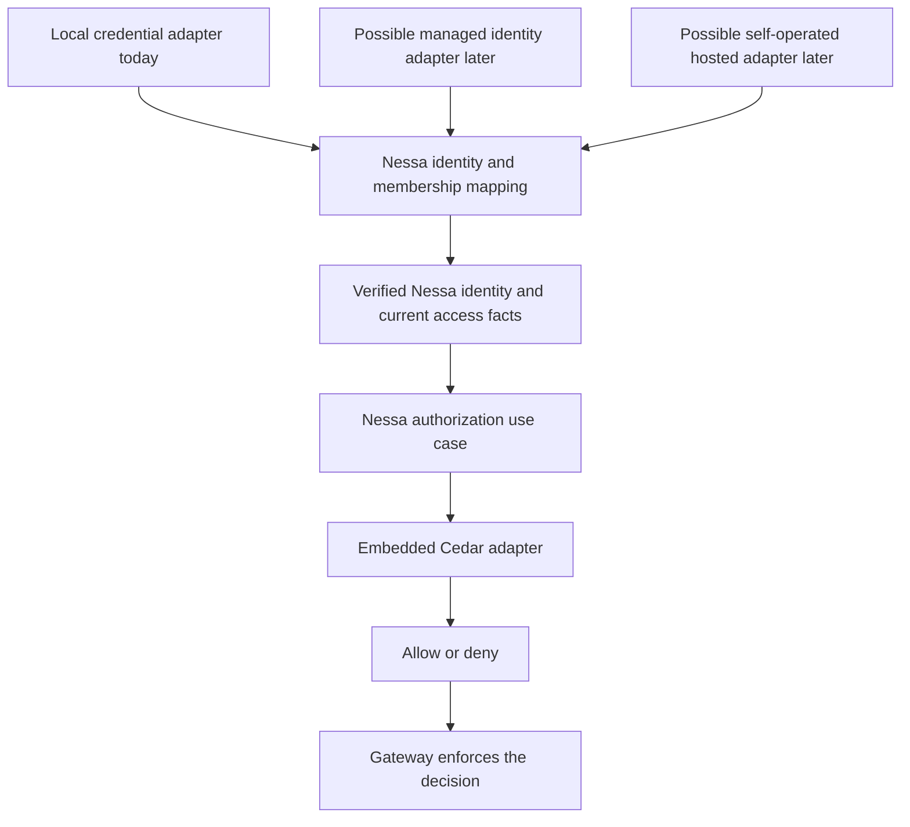

# Cedar, explained through Nessa

[Auth review index](README.md) · [Local setup](../../adr/done/0010-local-authentication.md) · [Identity and cloud design](identity-tenancy-and-cloud.md)

This guide starts from zero. You do not need to know policy languages or enterprise
authentication. It explains the ideas needed to understand and review our current
implementation, then shows how those ideas help us grow. It is not a complete
reference for every Cedar feature.

## 1. The problem: being connected is not permission to do everything

Imagine Nessa has three clients connected at once:

```text
Your desktop app ----\
Your terminal -------+----> Nessa gateway
An external agent --/
```

All three may have valid credentials. But we might want the external agent to
check the server's health without letting it create credentials for more agents.
Later, one agent might be allowed to read one conversation while another can
contribute messages to it.

We need to answer two different questions:

| Question | Name | Example |
| --- | --- | --- |
| What identity does this proof establish? | Authentication | This credential belongs to the terminal client in my personal organization. |
| Can that identity perform this operation now? | Authorization | Can it issue another credential on this gateway? |

Cedar helps with the second question. Nessa still verifies credentials, owns the
data, and enforces the answer.

A connection is therefore the beginning of access checking, not the end.

## 2. What Cedar is

Cedar is a language for writing permission rules and an engine that evaluates
those rules. We embed the Rust engine in Nessa. A rule is usually called a
**policy**.

Think of it as a small decision function:

```text
Nessa's rules + current trusted facts + requested operation
                           |
                           v
                    +-------------+
                    |    Cedar    |
                    +-------------+
                           |
                     Allow or Deny
                           |
                           v
                  Nessa enforces it
```

We could write all these checks in ordinary Rust. Cedar is a deliberate choice:
we want explicit, reviewable permission rules instead of growing separate role
checks inside each handler. It does not eliminate the need for careful Rust code.
It gives that code one place to ask for a policy decision.

For the actual integration, see the [Cedar adapter](../../../crates/nessa-auth/src/adapters/cedar/mod.rs).

## 3. The four pieces of a permission question

A Cedar request contains a **principal**, **action**, **resource**, and **context**.
These mean who is acting, what they want to do, what they want to act on, and
additional facts about this request. The Cedar documentation calls this PARC;
you do not need to memorize the abbreviation. [Official request model](https://docs.cedarpolicy.com/auth/authorization.html).

Here is a real Nessa example:

```text
Who?       terminal-client
Do what?   server.read
On what?   gateway-1, owned by personal-org
Extra?     This credential covers that exact action/resource.
           Its identity matches the verified session.
```

| Cedar term | Nessa meaning | Where the facts come from |
| --- | --- | --- |
| Principal | The acting human, agent, or integration | Verified session identity and current membership |
| Action | A permission name such as `server.read` | Server mapping from the requested method |
| Resource | The particular gateway being accessed today | Server-owned gateway and organization identity |
| Context | Extra inputs such as `credentialAllows` | Computed by Nessa's adapter |

An **entity** is a named thing with attributes. Our Cedar actor has an organization
ID, a current role, and an active flag. Our resource has its owning organization ID.
These are small projections of Nessa's domain objects, prepared for this check.

Cedar does not fetch the organization from a database or verify a client's claim
that it is an admin. Nessa must supply trusted facts. Passing invented facts to a
policy engine produces a decision about those invented facts.

## 4. Identity, role, and credential grant are different

This distinction explains much of our design:

```text
Principal:       who is acting
    |
Membership:      which organization they belong to, and their role there
    |
Credential:      the proof they presented, its expiry, and its restrictions
    |
Current request: one action on one resource
```

A **role** is the person's or agent's position in an organization: currently
`member` or `admin`. A **grant** is a credential's explicit action/resource limit.
Being an admin does not make a narrowly scoped credential unrestricted.

Suppose an admin uses a credential containing only:

```text
server.read on gateway-1 in personal-org
```

That credential can read gateway health. It cannot manage credentials, even though
the principal is an admin. To manage credentials, our policy requires both an
active admin membership and an exact `credential.manage` grant.

For the current profile, access requires all of these to agree:

```text
valid credential and session
          AND
current active membership
          AND
correct organization and identity linkage
          AND
exact credential grant
          AND
policy permits this action
          |
          v
     operation allowed
```

Some of these checks happen in Nessa's application layer before Cedar. The diagram
shows the whole enforcement decision, not a claim that Cedar verifies tokens.

## 5. Reading a real policy without learning a whole language

This policy is taken from our [checked-in policy file](../../../crates/nessa-auth/src/adapters/cedar/policies.cedar):

```cedar
permit (
    principal is Nessa::Actor,
    action == Nessa::Action::"credential.manage",
    resource is Nessa::Resource
)
when { principal.active && principal.role == "admin" };
```

Read it as: an active admin can perform the credential-management action on a
resource of our resource type, subject to the rest of the policy bundle.

The small pieces are:

- `permit`: this is an allowing rule.
- `is Nessa::Actor`: the principal must have this entity type.
- `==`: equal to.
- `when`: the following condition must be true.
- `&&`: both conditions must be true.
- `Nessa::Action::"credential.manage"`: a typed action identifier, not a network call.

A policy's opening section selects the requests it applies to. Its conditions
then test the supplied attributes. [Official policy syntax](https://docs.cedarpolicy.com/policies/syntax-policy.html).

That permit is only part of our rules. We also have this restriction:

```cedar
forbid (
    principal is Nessa::Actor,
    action,
    resource is Nessa::Resource
)
unless { context.credentialAllows };
```

In English: deny the request unless Nessa has established that this credential
covers the exact action and resource. The bare `action` means this restriction
is not limited to one named action within its scope.

Our other forbid rules reject organization mismatches and identity mismatches.
A client cannot send `credentialAllows: true` to bypass them: the server computes
that value from the credential's stored grants.

## 6. How multiple rules become one answer

Cedar does not use the first matching rule. A matching forbid wins over permits.
Without a matching permit, the answer is deny. A policy that errors is skipped
by Cedar and reported in diagnostics. [Official decision rules](https://docs.cedarpolicy.com/auth/authorization.html).

Nessa adds a stricter rule in its adapter: **if any evaluated policy reports an
error, deny the operation**, even if Cedar otherwise returned Allow. A broken
policy or invalid input must not quietly expand access in our application.

```text
Nessa cannot prepare valid policy input? ----------> reject
                  |
                  no
                  v
Cedar reports an evaluation error? ----------------> deny (Nessa's rule)
                  |
                  no
                  v
Any forbid matches? ------------------------------> deny
                  |
                  no
                  v
Any permit matches? ------ yes -------------------> allow
                  |
                  no
                  v
                 deny
```

Examples of our complete current enforcement flow:

| Situation | Result | Reason |
| --- | --- | --- |
| Active member, exact read grant, correct gateway | Allow health read | Membership and credential both permit it |
| Active member, management grant | Deny management | The policy requires admin membership |
| Active admin, read-only credential | Deny management | Admin status does not enlarge the credential |
| Active admin, exact management grant | Allow management check | The handler still validates the lifecycle request |
| Valid credential, resource in another organization | Deny | Tenant ownership does not match |
| Credential revoked after connection | Reject | Current credential state is checked again |
| Unknown action | Deny | Our adapter accepts only the implemented action vocabulary |

Passing the management check does not authorize arbitrary issuance. The lifecycle
code also rejects unsupported grants and ordinary issuance of administrative
credentials. Cedar's action decision and the operation's domain rules both apply.

## 7. A request through the real application

This sequence starts after the client has authenticated on `/session`:

```mermaid
sequenceDiagram
    participant Client as NessaClient
    participant Gateway as Product gateway
    participant Auth as AuthorizeAction
    participant Store as Current local snapshot
    participant Cedar as Embedded Cedar
    participant Handler as Health handler
    Client->>Gateway: server.health
    Gateway->>Gateway: Resolve server.read and trusted gateway resource
    Gateway->>Auth: Check verified session and requested action
    Auth->>Store: Read current credential and membership
    Store-->>Auth: Coherent current snapshot
    Auth->>Auth: Check expiry, revocation and identity linkage
    Auth->>Cedar: Evaluate policy using trusted facts
    Cedar-->>Auth: Decision and diagnostics
    alt Allowed without evaluation errors
        Auth-->>Gateway: Allow
        Gateway->>Handler: Execute health operation
        Handler-->>Gateway: Health result
        Gateway-->>Client: Result of the admitted operation
        Note over Gateway,Auth: Later operations read committed state again; revocation does not cancel admitted work
    else Denied or invalid
        Auth-->>Gateway: Deny or typed error
        Gateway-->>Client: Reject request or close invalid session
    end
```

`AuthContext` and Cedar's `context` are different things. `AuthContext` is our
verified identity container. Cedar's request context is the extra data given to
one policy evaluation. Our adapter translates between Nessa's objects and Cedar's
input; it does not expose Cedar objects through our domain contracts.

## 8. Why we check again after login

An open socket can live longer than its original permissions. While it is open,
a credential might expire or be revoked. A membership might be disabled or its
role changed by a future authorized administration feature.

```text
At connection:    member is active, credential is valid
Later:           credential is revoked
Next request:    read current state -> reject
```

Caching “logged in, therefore allowed” would miss that change. `AuthorizeAction`
reads fresh state for each operation. The product gateway also guards successful
output, polls idle connections every second, and schedules expiry closure.

Cedar does not push revocation events or close sockets. Nessa owns these jobs.
It also owns ordering between requests and local credential changes. Already sent
bytes cannot be recalled. See the [implementation guide](../../adr/done/0010-local-authentication.md#what-happens-when-a-client-makes-a-request)
for the local admission and connection-lifetime guarantees.

## 9. What the schema does

The [Cedar schema](../../../crates/nessa-auth/src/adapters/cedar/schema.json) is the
description of the data our policies expect. In our current implementation:

```text
Actor                          Resource
  organizationId: string         organizationId: string
  role: string
  active: boolean

Actions                        Request context
  server.read                    credentialAllows: boolean
  credential.manage              identityMatches: boolean
```

We validate the policy bundle against this schema at startup. The adapter also
uses the schema when constructing requests and entities. This helps catch such
mistakes as a policy referring to an attribute that our schema does not define.

A schema is not a database migration or proof that the supplied facts are true.
Our domain constructors, trusted state readers, and adapter remain responsible
for that. For example, our schema declares `role` as a string; the domain model
and adapter determine which role values Nessa actually supplies.

## 10. Local use today, team use later

Even one local user benefits from separate identities and restricted credentials.
Their desktop, terminal, and external agents do not need identical authority.
The personal organization gives their resources one ownership boundary without
requiring a hosted account.

Later, a team can have several members and resources owned by its organization.
The question remains the same: can this actor perform this action on this resource?
The ownership and membership data become richer.

The following diagram is the intended provider boundary. Only the local adapter
is implemented today:



A provider such as Clerk could help with future hosted login and enterprise
identity integration. It would not replace our resource ownership model or the
Nessa policies. Conversely, Cedar does not provide login, single sign-on, token
issuance, organization provisioning, or storage.

A provider swap still requires an adapter, identity mappings, tests, and a clear
rule for how current remote membership data must be. Dependency injection keeps
that work at a defined boundary; it does not make providers behaviorally identical.
The [identity and cloud design](identity-tenancy-and-cloud.md) covers those decisions.

## 11. Does this add a service or slow every request down?

Our Cedar engine runs inside the gateway process. The policy files are embedded in the compiled application, then parsed
and validated once when the adapter is constructed. Normal authorization reads
the published local state in memory; it does not call a cloud policy service or
read the registry file for each request.

```text
Startup:   load embedded policies -> parse -> validate -> retain evaluator
Request:   current snapshot -> small entity projection -> evaluate -> enforce
```

There is still a cost. We construct request data, project entities, and evaluate
rules. We have not established production latency benchmarks. The local gateway
takes a brief published-snapshot read lock, while only mutations serialize through
persistence. Handlers and socket writes share no admission mutex. Cedar evaluation
time, handler work, and each connection's transport still contribute to latency.

The current design makes the costs visible and keeps out a mandatory network
round trip. Before adding a remote provider, high concurrency, or large policy
sets, we need measurements and a suitable freshness/admission contract.

## 12. How a new feature would use this

Suppose we later implement reading conversations. This is a future example;
`conversation.read` is not an implemented action in today's Cedar profile.

1. Define the operation and its Nessa-owned action name.
2. Resolve the conversation and its owning organization from trusted storage.
3. Extend the schema and adapter to represent the new action and resource facts.
4. Add a policy that states who may read it, and define valid credential grants.
5. Route the operation through the authorization use case and output guard.
6. Test an allowed reader, a different tenant, missing grants, changed membership,
   and invalid credentials. Check that the handler is not reached on denial.

A policy file alone does not create an API or secure an unguarded handler. The
method mapping, resource lookup, grants, and enforcement must agree.

## 13. A short code-reading path

| Read | What to look for |
| --- | --- |
| [Policies](../../../crates/nessa-auth/src/adapters/cedar/policies.cedar) | Two explicit allowing rules and three overriding restrictions |
| [Schema](../../../crates/nessa-auth/src/adapters/cedar/schema.json) | Actor/resource attributes and the supported actions |
| [Cedar adapter](../../../crates/nessa-auth/src/adapters/cedar/mod.rs) | Trusted fact projection, exact grant matching, and error handling |
| [AuthorizeAction](../../../crates/nessa-auth/src/application/authorization.rs) | Current state and credential checks before policy evaluation |
| [Gateway](../../../crates/nessa-server/src/product/socket.rs) | Method mapping, enforcement, and output rechecks |
| [Library flow tests](../../../crates/nessa-auth/tests/cedar_flow.rs) | Allowed requests and changes that must turn them into denials |
| [Live lifecycle test](../../../scripts/smoke-auth.mjs) | Real server, SDK, CLI, revocation, expiry, and restart |

You understand the essential model when you can explain why a valid admin
credential may still be denied, where organization ownership comes from, and
which component actually prevents an operation after Cedar says no.
