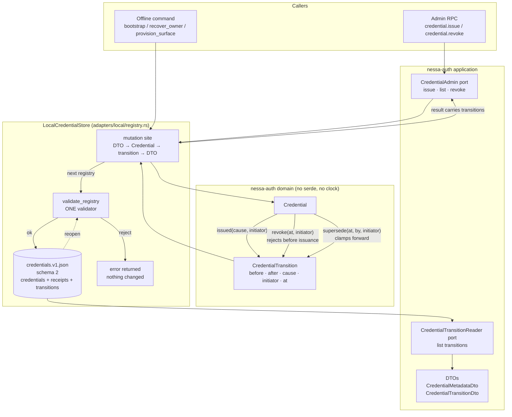
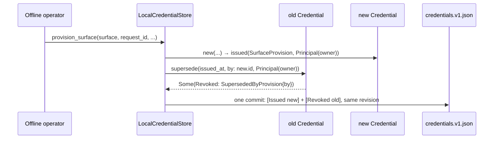

# Credential transition audit and domain ownership

Status: implemented on 2026-09-19 for
[issue #51](https://github.com/nessalabs/nessa-agent/issues/51), findings 5 and 6
of audit #48. This document keeps the reasoning; the code is the contract.

## The problem, in plain words

The local credential registry (`crates/nessa-auth/src/adapters/local/registry.rs`)
remembers *what* a credential looks like now, but not *how it got there*.

Today, when a credential is revoked, the only thing written is one field:
`revoked_at = Some(time)`. Three very different events all write that same field:

| What happened | Where | What the file says afterwards |
| --- | --- | --- |
| An admin deliberately revoked it | `revoke_sync` | `revoked_at: Some(t)` |
| A surface was re-provisioned, so the old credential was replaced | `issue_internal` (via `supersede`) | `revoked_at: Some(t)` |
| The owner ran recovery, so the old owner credential was displaced | `recover_owner` (via `supersede`) | `revoked_at: Some(t)` |

After the fact nobody can tell which of the three happened, who caused it, or
what the credential looked like before. Issuance has the same gap: the file
says a credential exists, not that it was bootstrapped, issued by an admin,
provisioned for a surface, or created by recovery.

The project rule in `AGENTS.md` is strict: every consequential state change must
keep its **target**, **before/after**, **cause**, and **initiator**, and must
carry that evidence through an application-owned audit port. The two neighbouring
contexts already do this:

- `browser_session` keeps an append-only journal where each change records
  `before`, `after`, `reason`, and `initiator`, and the **same validator** runs
  on write and on replay, so a replay can never accept what a live write rejected.
- `nessa-mcp` has an `Audit` port with acknowledged delivery, and a failed
  acknowledgement travels into the command result as `audit_error`.

`nessa-auth` has neither. It is the odd one out.

There is a second, related problem (finding 6). The registry treats the
serialisable DTO `CredentialMetadataDto` as the truth and pokes `revoked_at`
directly. The domain type `Credential` already has the real rule in
`Credential::revoke` ("keep the first revocation, refuse one before issuance"),
and the registry re-validates every credential through `Credential::try_from`
on the way to disk anyway. So the rule is enforced, but *after* the decision was
made somewhere else, and the "clamp forward for automatic supersession" rule
lives only in a free function and a comment.

Finally, one small unrelated layering bug is ready to fix now: the browser-session
store calls `crate::server::entrypoint::origin::is_trusted_origin_value`.
Storage should not depend on an HTTP entrypoint.

## What we learn from the neighbours

1. **Make the evidence write *be* the commit.** `browser_session` never has a
   "committed but unaudited" state, because the journal line *is* the durable
   state. If the write fails, nothing changed. This removes the hardest question
   in the issue (decision 3: who reconciles a post-commit audit failure?) by
   making that state impossible for the local adapter.
2. **One validator for live writes and replay.** Whatever rule checks a new
   transition must be the same rule that checks the file on reopen.
3. **The domain owns the transition and returns the evidence.** Application
   code maps that evidence to a record; it never invents the cause afterwards.
4. **Label automatic causes honestly.** A supersession is not "an admin
   revoked it". It is "replaced by credential X as part of command Y".

## The solution

### One sentence

Add an append-only `transitions` list **inside the registry file**, written in
the **same atomic commit** as the state change it describes, produced by
`domain::Credential`, and checked by `validate_registry` on write and on reopen.

### Decisions, answered

| # | Question from the issue | Decision | Why |
| --- | --- | --- | --- |
| 1 | Where does the evidence live? | In the registry file itself (`Registry.transitions`), plus a read port so the application can ask for it. | Same commit, same lock, same fsync, same validator. No second file whose ordering could drift from the state. A separate audit-port adapter can be added later; the journal would then be its local, already-durable source. |
| 2 | Cause vocabulary | Issued: `Bootstrap`, `AdminIssue`, `SurfaceProvision`, `OwnerRecovery`. Revoked: `Explicit`, or `Superseded { by, kind: Provision \| OwnerRecovery }`. | Exactly the sites that exist. `by` names the replacing credential so the chain is reconstructable. |
| 2b | Is expiry a transition? | **No.** Keep it derived from `expires_at` at read time. | Nothing *happens* at expiry; no code runs, no state changes. The expiry time is already in the `Issued` record's `after`. Writing an event that nobody caused would be inventing evidence. |
| 3 | Post-commit audit failure | Cannot occur locally: a failed journal write is a failed commit, the error is returned, and the caller retries with the same `request_id`, which the existing receipts make safe. | Satisfies "never undo a needed revocation" (it was never done) and "report delivery failure" (the error is the report). A future hosted adapter that separates the two must return a typed committed-but-unaudited result; this plan does not add that type because nothing would produce it. |
| 4 | Does the domain become authoritative? | Yes for **decisions**, no for **storage**. Every mutation goes DTO → `Credential` → transition → DTO. `supersede()` in the registry is deleted. DTOs stay as the serde shape only. Receipts stay unchanged. | Bounded change to a 1900-line file: touch the four mutation sites and the validator, keep the idempotency and file-format machinery as-is. |
| 5 | Clamp vs reject | Both rules move into `Credential` as two named methods: `revoke(at)` rejects a time before issuance (explicit, the time is the request); `supersede(at, by)` clamps forward (automatic, no caller to correct). | The split stays, but it becomes a tested domain rule with a name instead of a comment. |
| 6 | browser_session half of finding 6 | **No change** to `State::apply` / `commit`. The single-validator property is a requirement, not a smell. Only `is_trusted_origin_value` moves. | Recorded so nobody "fixes" it. |

### The shapes

Domain (`crates/nessa-auth/src/domain/`), no serde, no clock:

```text
CredentialTransition
  credential_id   CredentialId
  before          Option<CredentialLifecycle>   // None for issuance
  after           CredentialLifecycle
  cause           TransitionCause
  initiator       Initiator
  at              u64                            // the command's own time (issued_at / revoked_at)

CredentialLifecycle = { issued_at, expires_at, revoked_at }   // the fields a transition can change

TransitionCause
  Issued(IssuanceCause)      Bootstrap | AdminIssue | SurfaceProvision | OwnerRecovery
  Revoked(RevocationCause)   Explicit | Superseded { by: CredentialId, kind: Provision | OwnerRecovery }

Initiator
  Principal(PrincipalId)      // verified issuer_principal_id on issue / revoke / provision
  LocalOperator               // offline bootstrap / recovery holding the registry lock; no principal
```

`Credential` gains:

```text
fn issued(cause, initiator) -> Result<CredentialTransition, DomainError>
      // evidence for a new credential; Err if it was somehow already revoked
fn revoke(at, initiator) -> Result<Option<CredentialTransition>, DomainError>
      // None when already revoked (idempotent, first time wins); Err before issuance
fn supersede(at, by, kind, initiator) -> Option<CredentialTransition>
      // clamps at.max(issued_at); None when already revoked
fn restore_revoked_at(at) -> Result<(), DomainError>
      // storage rebuilding a record; same rule, no new evidence
```

Registry file (`Registry` struct), schema version 1 → 2:

```text
transitions: Vec<StoredTransition>
StoredTransition { sequence, revision, correlation: Option<String>, ...CredentialTransition as DTO }
```

`sequence` is contiguous from 1. `revision` is the registry revision that
committed it. `correlation` is the command's `request_id` when one exists.

Application (`crates/nessa-auth/src/application/`):

- `CredentialTransitionDto` in `dto.rs`, secret-free, `deny_unknown_fields`.
- `IssueCredentialOutcome` (both variants) and `BootstrapOutcome` carry
  `transitions: Vec<CredentialTransitionDto>`; `RevokeCredentialOutcome` carries
  the credential's one `revocation` record. A caller never sees success without
  the evidence that went with it, and a replay returns the original record.
- New read port `CredentialTransitionReader::list_transitions(organization_id)`
  in `credential_admin.rs`, implemented by the local store. This is the
  "application-owned audit port" the rule asks for, on the read side.

### Validation: one rule, two callers

`validate_registry` already runs before every `persist` and on every `open`.
It gains these checks, so a hand-edited file and a buggy live write fail the
same way:

- sequences are 1..n with no gaps; `revision` is non-decreasing and ≤ registry revision
- every credential's first transition is `Issued`, followed by at most one `Revoked`
- each transition's `before` equals the previous transition's `after` for that id
- the last transition's `after` equals the lifecycle the registry stores for that credential
- every transition names a credential the registry holds
- `by` in a supersession names a credential that exists and was issued at that same revision
- `Initiator::Principal` names a known principal
- `transitions.len() ≤ 2 × max_credentials` (no new config knob; each credential has at most one issue and one revoke)

### No migration

The registry schema version moves from 1 to 2 and schema 1 files are rejected
as corrupt. The project is pre-alpha, so there is nothing to carry forward;
an old registry is recreated with bootstrap. This keeps the cause vocabulary
honest: every record names a real command, and there is no "unknown" cause or
initiator anywhere in the model.

### The ready-now piece: origin predicate

Move `is_trusted_origin_value` and its tests to
`crates/nessa-server/src/core/trusted_origin.rs` (`core` already holds
cross-context helpers like `error` and `logging`). `server/entrypoint/origin.rs`
keeps `is_trusted_ws_origin` and calls the shared function. Update the three
callers. No behaviour change.

## Diagram



How one explicit revoke flows:

```mermaid
sequenceDiagram
    participant Admin
    participant Store as LocalCredentialStore
    participant Cred as domain::Credential
    participant Val as validate_registry
    participant File as credentials.v1.json

    Admin->>Store: revoke(request_id, issuer, credential_id, revoked_at)
    Store->>Store: receipt check (idempotency, unchanged)
    Store->>Cred: try_from(stored DTO)
    Store->>Cred: revoke(revoked_at, Principal(issuer))
    alt before issuance
        Cred-->>Store: Err(RevokedBeforeIssued)
        Store-->>Admin: Conflict
    else already revoked
        Cred-->>Store: Ok(None) — no new transition
    else first revocation
        Cred-->>Store: Ok(Some(transition: ExplicitRevoke))
    end
    Store->>Store: DTO ← Credential; push receipt; push transition(seq, revision, request_id)
    Store->>Val: validate(next)
    Val-->>Store: ok
    Store->>File: atomic write + fsync (state AND evidence together)
    Store-->>Admin: revision + transitions
```

How a surface re-provision produces two records in one commit:



## How it landed

Four commits, each leaving `cargo test --workspace` green:

1. **Origin predicate** moved to `crates/nessa-server/src/core/trusted_origin.rs`;
   the two request entrypoints and the browser-session journal call it there.
2. **Domain transitions** in `crates/nessa-auth/src/domain/transition.rs`, and
   `Credential::issued / revoke / supersede / restore_revoked_at` in `models.rs`.
3. **Registry journal** in `crates/nessa-auth/src/adapters/local/registry.rs`:
   schema 2, the four mutation sites routed through `Credential`, the old
   `supersede()` helper deleted, `validate_transitions` called from
   `validate_registry`, results carrying evidence,
   and the `CredentialTransitionReader` port.
4. **Docs**: this file, the auth crate README, and ADR 0010.

## Tests that exist (from the audit checklist)

- **Cause and initiator per path:** bootstrap, admin issue, surface provision,
  owner recovery, explicit revoke, supersession by provision, displacement by
  recovery. Each asserts target, before, after, cause, initiator, correlation.
- **Once-only:** revoking twice (same or different `request_id`) leaves exactly
  one `Revoked` record with the original time and cause.
- **Single validator:** hand-write a registry file with (a) a revoked credential
  and no `Revoked` record, (b) a gap in `sequence`, (c) `before` that does not
  match the prior `after`, (d) an initiator naming no known principal.
  `open` must reject each with `Corrupt`.
- **Sink failure = no commit:** with the existing injected pre-replace and
  directory-sync failures, assert the credential is *not* revoked, no transition
  exists, and the same request retries successfully.
- **Idempotent issue replay** (`ExistingSecretUnavailable`) returns the original
  transition, not a new one.
- **Existing tests** in `registry.rs` keep passing unchanged except for the
  added `transitions` fields and the revoke outcome shape.

All of these live at the end of the `tests` module in `registry.rs`, plus the
domain unit tests in `transition.rs` and `models.rs`.

## Explicitly out of scope

- **#52** (browser-session journal trusts `at`). Different context; this plan
  does not change `State::apply`. The registry's `at` is the command's supplied
  time, which is what the state already uses, and `revision` gives ordering.
- **#56** (rotation supersedes across organizations) landed separately as
  #66: both automatic sites select through one `Replaces` scope, and this
  work feeds that scope into the domain's supersession rule so each retired
  credential also records why.
- A hosted or out-of-process audit adapter. The read port is the seam for it.
- Any change to receipts, token format, or the secret verifier.

## Risks and how they are handled

| Risk | Handling |
| --- | --- |
| File size grows | Bounded at 2 × `max_credentials` records; `max_registry_bytes` still applies and is checked before write. |
| Old files fail to open | Accepted. The project is pre-alpha; schema 1 registries are rejected as corrupt and must be recreated with bootstrap. |
| Conflicts with open PRs #43, #44, #61 | None of them touch `nessa-auth` or `browser_session`. |
| Reviewer "fixes" the single validator | Decision 6 above records that it is a requirement. |
| The wire protocol does not expose transitions | Deliberate. The gateway result still reports the revision; evidence is durable in the registry and reachable through the read port. Exposing it over the socket is a protocol change for its own issue. |
