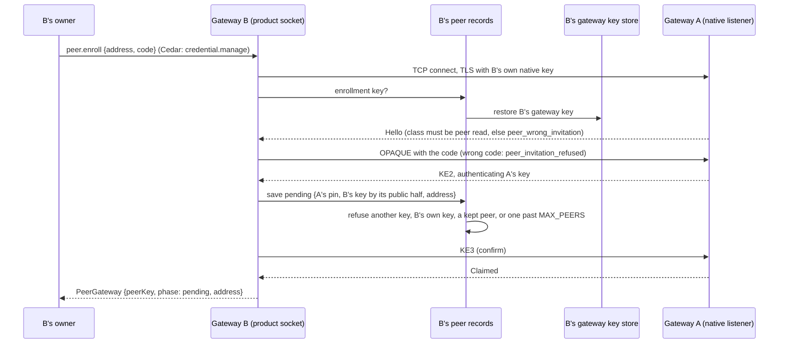

# Peer gateways — issue 705, slice H

Status: this branch. Part of [#252](https://github.com/nessalabs/nessa-agent/issues/252)
(slice H of [ADR 252](../../adr/todo/252-runtime-roles-and-execution-leases.md)).
The map's rules are in
[Identity and trust](../runtime-architecture.md#identity-and-trust),
[The mesh](../runtime-architecture.md#the-mesh) and
[Security](../runtime-architecture.md#security). This builds on
[device pairing](device-pairing.md), which it reuses whole.

## The problem

Device pairing lets a phone enroll with a one-use code. What it issues is a
credential that **acts as the owner**: the credential's principal is the
owner's, and it holds `conversation.read`. That is right for the owner's own
phone and wrong for another gateway, which is another party: a friend's Nessa,
or a second machine whose reads the owner wants to see and limit on their own.

The map asks for a peer gateway to be "a key-bound credential from pairing"
under a principal kind of its own, "never both authorities over one
conversation", with "the same enrollment and listener" and no second pairing
flow.

## What changes

The owner chooses **who an invitation enrolls** when creating it:

```text
pairing.create {}                     -> a device (unchanged)
pairing.create {"enrollee":"device"}  -> a device
pairing.create {"enrollee":"gateway"} -> a peer gateway
```

That choice is the consent's **class**, and it is the only difference between
the two enrollments:

| | Device (`gateway-conversation-read`) | Peer gateway (`peer-gateway-conversation-read`) |
|---|---|---|
| Enrollment | One-use code, OPAQUE over TLS with raw public keys, owner approves the exact key | The same, on the same listener |
| Grant asked for | `conversation.read` on this gateway | The same |
| Credential names | The owner | `gateway:<key in hex>`, a principal of kind `gateway`, member of the owner's organization |
| Credential proof | Bound to the key pairing pinned | The same |
| Revocation | `credential.revoke` or cancelling the Active pairing | The same |

The class is public and bound into the PAKE transcript beside the invitation,
attempt, consent and generation, so it cannot be changed in transit: a client
that relabels it cannot complete the exchange. A client also checks the class
on the first reply and refuses an invitation made for the other kind of party
before any attempt is charged (`NativeClientError::OtherEnrollee`): a phone
handed a peer's code does not become a gateway principal.

### One owner for each fact

- **Which principal a credential names** is `ConsentClass::credential_principal`
  in the auth domain: the owner for a device, `peer_principal(key)` for a peer.
  Publication mints it, and the registry's replay check (`credential_binding_matches`)
  asks the same function, so a stored credential that names anyone else is
  refused on open.
- **What a principal kind can hold** is `PrincipalKind::may_hold`. A gateway
  may hold `conversation.read` and nothing else. In particular it can never
  hold `conversation.write` (admitting commands into a conversation and
  answering its approvals) or `credential.manage` (holding credentials and
  pairing, which also admits every grant-management method). Those are the
  conversation authority's, listed once in `CONVERSATION_AUTHORITY_ACTIONS`,
  and the gateway that owns a conversation keeps them. Slice I will widen the
  peer's allowlist to the environment-grant actions; the authority's actions
  stay excluded, and `may_hold` refuses them before it consults the
  allowlist, so a widening cannot admit one by mistake. Whatever a peer is
  later allowed to run for a conversation, it therefore cannot also be that
  conversation's authority.
- **That the registry agrees** is `validate_principal_kind`, run by
  `validate_registry` on open and before every write. A gateway principal's
  credential must be pairing-bound, its membership a member's, and its grants
  ones the kind may hold. A pairing-bound credential names a gateway
  principal exactly when its pairing's class is a peer's, and a principal's
  id starts with `gateway:` exactly when its kind is a gateway.
  `credential.issue` refuses a gateway principal, and any principal id with
  that prefix whatever kind it claims, up front: pairing is the only way one
  is made.
- **Which class an enrollment is** is stored with it (`class: "peer"` in the
  registry's pairing record; absent means a device, so every existing registry
  reads unchanged) and in the client's private record (a separate pair of
  magics, so a device's file is byte-for-byte what it was).

### What a peer can do once paired

Read, on the native listener, exactly what the owner granted it, as a paired
device does. The owner shares a conversation with the peer's credential
(`conversation.share`, slice G, #704, merged in #720); the grant names the
peer's receiver, and every read the peer makes asks that receiver's grants:

- **Record head and pages, and a records watch** go through
  `AdmitPassiveRead::execute`, which asks `admit_read` for the receiver's
  grant on that conversation; an ungranted one is `wrong_owner`.
- **Catalogue manifest and resolve** are narrowed in SQL to the receiver's
  granted rows (`store::read_grants::granted`). A manifest pass may not reach
  past the receiver's own head, so probing boundaries finds that head and not
  the owner's; an ungranted id resolves as one that does not exist.
- **Catalogue head** is the latest revision among the receiver's granted rows
  and its own grant changes. The owner's work on a conversation the peer was
  not granted does not move it; a grant, a revoke or a change to a granted row
  does, and in steady state it never goes backwards. Its values are still the
  owner's catalogue revisions (see Known limits). This applies to every paired reader,
  devices included: it is the head over granted rows that slice G left for
  when paired readers are more than the owner's own phones.
- **Catalogue watch** is refused to a peer (`forbidden`). Its notices fire on
  every change to the owner's catalogue, granted or not, which would show a
  peer when the owner works on conversations it cannot read. A peer polls its
  head instead. A device, which signs in as the owner, keeps its watch.
- **The socket's `conversation.read`, `.list`, `.observe` and subscriptions**
  need `conversation.write`, which a gateway principal can never hold, so the
  policy refuses them. Behind that, `reader_of` makes a paired reader of a
  peer like a device: its read and view ask the grant, its lists are refused.

Admission matches the receiver binding to the session by credential and
organization. The binding's `owner_id` is the **grantor**: the owner whose
conversations the receiver reads, who paired it. It is never the reader and is
never compared with the session's principal, which for a peer is its own
`gateway` principal. Whatever records a peer's activity names that session
principal: its watch allowance is counted against it, and its session is
logged as it. The grant journal names the owner, who made the decision.

```mermaid
sequenceDiagram
    participant Owner as Owner surface
    participant GW as Gateway (pairing runtime, Auth registry)
    participant Peer as Peer gateway (enrolling client)
    Owner->>GW: pairing.create {enrollee: "gateway"}
    GW->>GW: ConsentIntent(class = PeerRead), commit invitation
    GW-->>Owner: code (shown once), status.class = peer-gateway-conversation-read
    Peer->>GW: Hello (same native listener)
    GW-->>Peer: PublicIntent (class = PeerRead)
    Peer->>Peer: class is the one it enrolls as, else OtherEnrollee
    Peer->>GW: Begin / Confirm (OPAQUE; class bound in the transcript)
    GW->>GW: claim the peer's key
    Owner->>GW: pairing.approve (exact key)
    GW->>GW: stage, pair receiver, publish
    GW->>GW: credential names gateway:<key hex> (kind gateway, member), grant conversation.read, bound to the key
    Peer->>GW: status (pinned)
    GW-->>Peer: Active {credential, receiver, epoch}
    Peer->>GW: openProduct, session.authenticate
    GW-->>Peer: ready, principalId = gateway:<key hex>
    Owner->>GW: conversation.share {credentialId: the peer's}
    GW->>GW: grant on the peer's receiver, journaled with the owner as initiator
    Peer->>GW: conversation.catalogueHead
    GW-->>Peer: head over its granted rows only
    Peer->>GW: conversation.catalogueManifest / catalogueResolve
    GW-->>Peer: the granted rows only
    Peer->>GW: conversation.recordsHead / recordsPage (a granted conversation)
    GW-->>Peer: records (an ungranted one: wrong_owner)
    Peer->>GW: conversation.watchCatalogue
    GW-->>Peer: forbidden (fires on all of the owner's work)
    Owner->>GW: conversation.unshare
    GW-->>Peer: head moves forward; the row leaves its catalogue
    Owner->>GW: credential.revoke (or pairing.cancel)
    Peer->>GW: openProduct
    GW-->>Peer: Refused
```

## State and order table

Each row has at least one test.

| Row | State and input | Result | Test |
|---|---|---|---|
| H1 | The owner creates a peer invitation; a peer claims it; the owner approves its key | Same enrollment and listener; the credential names `gateway:<key hex>`, kind `gateway`, an active member, holding only `conversation.read`, bound to that key; the record and the client's file keep the class | `owner_route_creates_a_peer_gateway_invitation`; `a_peer_enrollment_issues_a_gateway_principal_bound_to_its_key`; `an_enrollment_record_keeps_its_class`; `the_class_decides_which_principal_a_credential_names` |
| H2 | A client given an invitation for the other kind of party, or a client that relabels the class | Refused `OtherEnrollee` at the first reply, no attempt charged, nothing saved, the invitation still open; a relabelled class does not complete the PAKE; the wire carries the class as sent | `a_client_refuses_an_invitation_for_another_kind_of_party`; `a_relabelled_enrollment_class_does_not_complete_the_pake`; `the_enrollment_class_is_carried_and_never_changes_in_transit` |
| H3 | A paired peer authenticates and reads before anything is shared with it | `ready` as its own principal; its catalogue head is zero, so it has nothing to page; `conversation.list` is `forbidden` | `a_peer_gateway_pairs_as_its_own_principal_and_reads_nothing_ungranted` |
| H4 | A gateway principal with `conversation.write` or `credential.manage`, an admin membership, a bearer credential, a credential naming another principal, or a peer record that lost its class | Refused on open and never written | `a_gateway_principal_can_hold_only_the_read_grant`; `a_gateway_principal_holds_only_what_pairing_issued_it` |
| H5 | The owner revokes a paired peer's credential | Its next connection is refused at `openProduct` | `a_revoked_peer_gateway_is_refused_its_next_connection` |
| H6 | `credential.issue` for a principal of kind `gateway` | Refused `Conflict`, nothing written: no second way to make a peer | `a_gateway_principal_holds_only_what_pairing_issued_it` |
| H7 | A gateway that pairs no peer | Every device enrollment, registry and client file reads and writes as before | the existing device pairing suites |
| H8 | The owner shares one of two conversations with a paired peer, then unshares it | The share applies (an access answer about another credential, or one that contradicts itself, is still refused); the peer's record head on the granted one reaches the source and on the other is `wrong_owner`, as are a records watch and a record page on it; resolving the other answers as an id that does not exist; a manifest boundary one past the peer's head is `invalid_request` though the owner's head is past it; its manifest lists the granted one alone; its catalogue watch is `forbidden`, while a device's is admitted; the owner's work on the other conversation does not move the peer's head; the unshare moves the head forward and takes the row away. On the socket, a binding whose owner is not the session principal reads only what it was granted, and its lists are refused | `a_peer_reads_only_what_it_was_granted`; `a_binding_owned_by_another_principal_reads_only_what_it_was_granted` |
| H9 | A paired reader's catalogue head as the owner works, grants and revokes | An ungranted change and a grant to another receiver leave it; a grant, a change to a granted row and a revoke each move it; a revoke moves it forward, never back to an older granted row | `a_paired_readers_head_moves_only_with_what_it_was_granted` |
| H10 | A registry whose owner membership is disabled or not an admin | Refused on open (`owner_membership`). The pairing initiator's membership is what keeps a grantor live; the owner's is the one the registry pins | `a_registry_whose_owner_is_not_an_active_admin_does_not_open` |

## The dialing side

Part 2b gives a gateway the other end: its owner enrolls it into another
gateway's peer invitation, and it keeps what it learned there. The enrolling
client is `nessa-client-core`'s, which the gateway links without its `cli`
feature ([ADR 483](../../adr/done/483-protocol-and-client-core-crates.md),
amended).



- **One key, one principal.** B enrolls with the gateway's own native key,
  injected from the gateway key store, never a key made for the enrollment
  (`ClientPendingStore::enrollment_key`). A therefore names B by the same
  `gateway:<key>` principal however often it is enrolled, which slice I
  needs. The record names that key by its public half; the private half
  stays in the key store alone, and a record made with a key that is no longer
  the gateway's does not read.
- **One file per peer.** `peer-gateways/<peer key hex>.json` beneath the
  namespace, private, published by rename through `nessa-local-storage`. It
  holds the peer's pin, the enrollment it claimed, the credential once
  issued, and the address that last answered, with its own `schemaVersion`
  ([ADR 202](../../adr/todo/202-versioned-local-datasets.md), record scope: a
  record that does not read is listed `unreadable` and fails only that
  peer).
- **What the owner is told.** `peer.enroll` returns the pending record;
  approval happens on A. The credential reaches the record when B next reads
  its pinned status, which the next part's poller does. `peer.list` shows
  every kept peer; `peer.forget` removes B's record only.
- **It dials what the owner names.** `peer.enroll` connects from this
  gateway's host to whatever IP address and port the owner gives, which is
  why it is owner-only (`credential.manage`) and why every failure that is
  not the peer protocol's own answer is `peer_unreachable`: an open port and
  a closed one answer alike. The client keeps a failed TLS handshake
  (`NativeClientError::Handshake`) apart from a failed PAKE proof, so a
  service that is not a gateway never reads as a wrong code.
- **Enrolling and forgetting take turns.** One enrollment runs at a time, and
  `peer.forget` is `peer_busy` while it does, so it cannot remove the record
  that enrollment is saving and spend the peer's invitation for nothing.
  Each enrollment and forget is logged with the peer's key, the address, the
  outcome and the initiator; never the code or key material.
- **Forgetting is local.** A gateway principal can never hold
  `credential.manage`, so B cannot revoke what A issued it. A's owner revokes
  it on A (`credential.revoke`), which is what stops B reading.

| Row | Situation | Result | Test |
| --- | --- | --- | --- |
| P1 | B enrolls into A's peer invitation | A records B's own native key as the claim; B keeps a pending record pinning A's key | `a_gateway_enrolls_into_a_peer_with_its_own_key_and_keeps_only_a_reference`, `a_composed_gateway_enrolls_into_another_with_its_own_key` |
| P2 | B's record on disk | A's pin and B's key's public half; B's private key in no spelling | same |
| P3 | A's owner approves; B reads its pinned status | The credential replaces pending in the same record; listed `active` | `a_gateway_enrolls_into_a_peer_with_its_own_key_and_keeps_only_a_reference` |
| P4 | `peer.forget` | The record is removed; a second forget is `peer_not_found` | same |
| P5 | A device invitation's code | `peer_wrong_invitation`, before the PAKE; nothing saved | `a_refused_or_wrong_class_invitation_saves_nothing`, `a_composed_gateway_enrolls_into_another_with_its_own_key` |
| P6 | A wrong code, or a cancelled invitation | `peer_invitation_refused`; nothing saved | `a_refused_or_wrong_class_invitation_saves_nothing` |
| P7 | Nothing at the address; a peer already kept | `peer_unreachable`; `peer_exists`, the kept record unchanged byte for byte | same |
| P8 | No native pairing; a member; malformed params | `peer_not_configured`; `forbidden`; `invalid_request`, before any effect | `peer_routes_refuse_before_any_effect` |
| P9 | A pending save with any key but the gateway's own, or for a pin that is the gateway's own key | Refused, nothing written; the second is `peer_own_gateway` | `a_record_takes_only_the_gateways_key_and_an_unreadable_one_can_be_forgotten` |
| P10 | A record of another shape, or a valid one whose `gatewayKey` is not this gateway's | Listed `unreadable`; its credential does not load (`Corrupt`); enrolling into that peer is `peer_exists` and leaves it as it was; `peer.forget` removes it | same |
| P11 | `peer.forget` while an enrollment runs | `peer_busy`; once the enrollment ends, forget runs | `forgetting_waits_for_a_running_enrollment` |

## What this part does not do

H as a whole is larger than one change. Part 1 (#725) is the granting side;
part 2a puts a peer's reads behind its grants; part 2b-1 lets the gateway link
the client and gives the head an access path by receiver
(`read_grant_changes_by_receiver`); part 2b-2 enrolls (above). The rest:

- **The peer reading.** Polling each active peer's head, reading what it
  granted into a retained cache, reading the pinned status of a pending one,
  and handling `ResetRequired`.
- **The peer table's last addresses and local discovery.** The issue lists
  them; the ADR places local discovery in slice I, and the map leaves "whether
  to announce at all, and what it reveals" unresolved. This side's peer table
  is the registry's rows: the principal (named by the key), the pinned key
  (the pairing's claim) and the grants (the credential's). Last addresses
  belong to the side that dials, whose record keeps the one that last
  answered (above).
- **A Share or Linked gateways control on the desktop.** The method and the
  generated client take `enrollee`; the UI is a separate change with its
  browser verification.

## Known limits

- **An enrollment that loses its last reply can leave a pending record.** B
  saves its record before it confirms, as a device does, so a connection
  that fails after that save answers `peer_unreachable` or
  `peer_unavailable` while A may have recorded the claim. The record lists
  `pending`; reading the pinned status (the next part) settles it, and
  `peer.forget` removes it. Enrolling into the same peer again is
  `peer_exists` until then.
- **Shutdown does not wait for an enrollment.** Nothing holds a
  `peer.enroll` open the way owner admission holds a pairing command, so its
  blocking worker ends at its own enrollment deadline or with the process.
  What it saved by then is a record like any other.

- **The grantor's liveness is not a read check.** The grantor of a pairing
  is its initiator: an active admin holding `credential.manage` when it
  paired. No runtime operation disables a membership or takes that role away,
  and the registry refuses a state where its owner is not an active admin
  (row H10). A device stops with its owner because it signs in as them; a peer
  signs in as itself, so admission does not see the initiator's state. A
  change that lets a membership be disabled or demoted at runtime, or gives
  another admin a way to pair, must add the pairing initiator's membership to
  read admission in the same change.
- **A paired reader's head values are the owner's catalogue revisions.** Its
  head moves only with what it was granted, but each value is the owner-wide
  revision of that change, so the gap between two values a peer sees counts
  the owner's other changes in between. Per-reader revision numbering is not
  built.
- **A device paired before this change sees its head go back once.** Its
  saved catalogue progress came from the owner's head, which was at or past
  its granted head. Its next pass finds the head below what it completed, and
  the sync engine answers `ResetRequired`; the client does not reset on that
  by itself, so the device's catalogue cache needs an explicit reset once.
  Changing the scope or incarnation such a reader sees would hit the same
  refusal (a scope mismatch is also `ResetRequired`), so it is not done.
- **A peer has no catalogue watch.** It polls its catalogue head. A watch
  that wakes only on changes to its own granted rows needs per-receiver
  notices, which nothing builds yet.

- **The owner's Settings › Linked devices lists a peer's credential** among
  the devices, since both are pairing-bound credentials. Telling them apart
  in the list is part of the desktop control above.
- **Linked devices also shows a claimed peer invitation as an ordinary device
  awaiting approval**, with no class shown. This is a labelling gap, not a
  security one: the class is fixed when the invitation is created and bound
  into the exchange, so approving it yields only the read-only gateway
  credential, never a device credential that names the owner.
