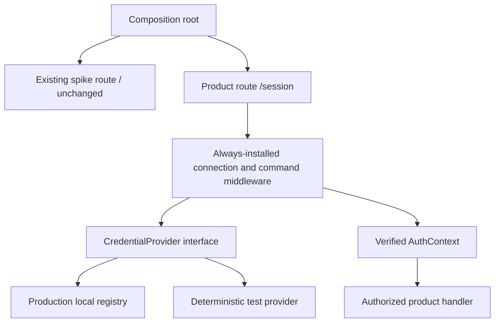
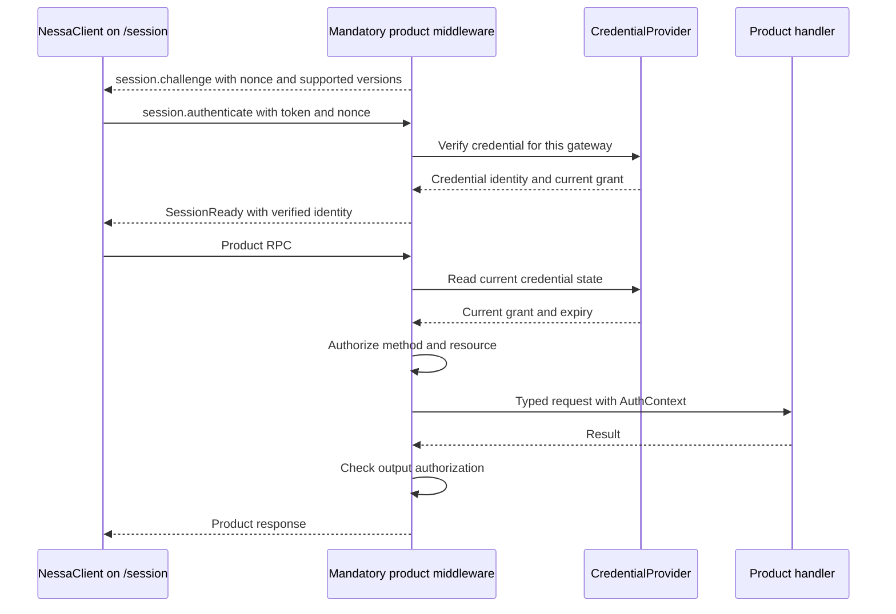
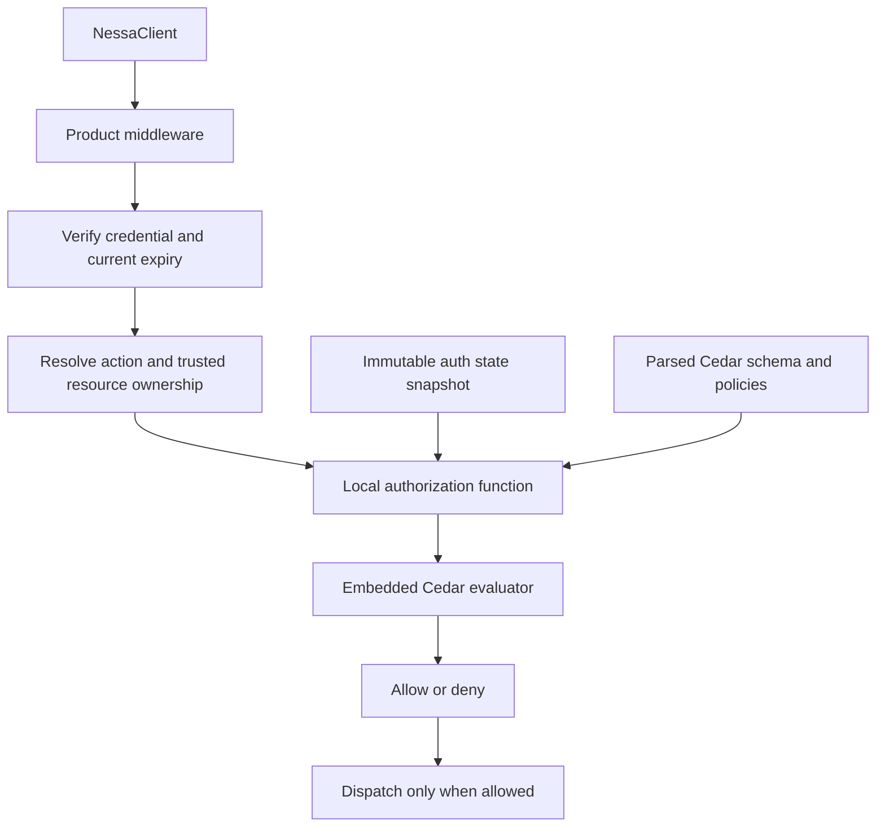
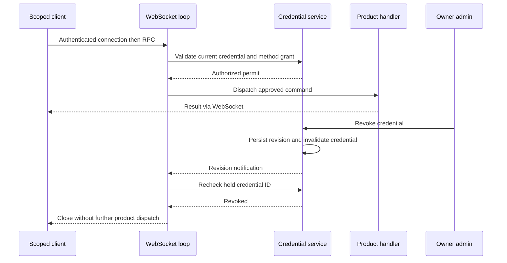

# Scoped authentication — detailed design reference

This is the original detailed implementation plan, retained for rationale and
acceptance criteria. It is reference material, not the active work queue.

- **Implemented:** [ADR 0010](../../adr/done/0010-local-authentication.md) owns the local library, registry, gateway, SDK, and CLI slice.
- **Remaining:** [ADR 0007](../../adr/done/0007-authentication-delivery.md) tracks auth delivery gaps; [ADR 0011](../../adr/todo/0011-nessa-session-protocol-and-authorities.md) tracks the larger session scope.
- **Current behavior:** [local guide](../../guides/local-auth.md) and [gateway review](../../reviews/local-auth-gateway.md).
- **Dependency on external stream crate:** none for credential storage.

**Superseded assumptions in the original plan below:** preserving the serving
spike route was rejected during the gateway review. Only `/session` now serves
authenticated WebSockets; `/` returns 404. Legacy protocol code, SDK profiles, and
the shared token setting have been removed.
The independent server data-root adapter and product schemas already exist under
`crates/nessa-server/src/env/paths.rs` and `protocol/product/`. Future-tense steps
below are historical planning language, not evidence of missing implementation.
Use the ADRs above to distinguish completed scope from outstanding work.

## Deployment target

Nessa supports local or hosted individual use; most team/enterprise usage is
expected to be hosted. This plan implements the first local slice of the
[identity and cloud design](identity-tenancy-and-cloud.md), not a
local-only product architecture. Hosted login, storage, deployment audiences,
and distributed invalidation are separate delivery gates in that design.

## Outcome and scope

Finish a real credential lifecycle against today's gateway: an owner provisions
credentials for separate clients, each client authenticates as its own principal,
only permitted RPCs execute, and expiry/revocation blocks existing connections as
well as reconnects. Demonstrate this using real `NessaClient` instances on a new
product WebSocket path, reusing the existing health use case. Do not wait for or create conversation persistence.

This slice includes local owner bootstrap/recovery, credential metadata storage,
issue/list/revoke, a personal organization and membership, embedded Cedar authorization,
protocol negotiation, SDK support, and a small administrative
CLI. It excludes MCP packaging, a credentials settings UI, OAuth/HTTP MCP,
provider authentication, conversation creation, collaboration, and agent runs.
It prepares resource-scoped grants without exposing nonexistent product methods.
No runtime files or user credentials are changed by writing this plan.

## Preserve the spike and add the product path

Keep today's `/` WebSocket route, `connect.challenge`, `connect`, `HelloOk`,
shared-token behavior, ping/echo composition, and panel spike caller unchanged.
The code currently offers connect/hello in every configured stage, not only dev;
only `server.ping` is dev-gated. This plan does not change that policy. “Existing
spike path” below refers to its purpose, not an invented stage restriction.

Add `/session` for actual product work. It has mandatory authentication and
per-command authorization middleware in every stage, including dev and tests.
Tests substitute a deterministic credential provider, never remove middleware or
set an `allow_all` switch. No migration of the old hello encoder is needed.
Each NessaClient instance selects one path; no second socket is added to a surface
and no failure on `/session` falls back to the spike.

| Area | Plan |
| --- | --- |
| [Existing AppState](../../../crates/nessa-server/src/app/state.rs) | Keep legacy shared-token state unchanged; no registry added to it |
| [Existing connect middleware](../../../crates/nessa-server/src/connect/middleware/auth.rs) | Leave the spike's token comparison and hello flow unchanged |
| [Existing WsSession](../../../crates/nessa-server/src/server/entrypoint/session.rs) | Keep spike state; introduce separate product connection state |
| [Existing hello encoder](../../../crates/nessa-server/src/protocol/encode.rs) | Leave `HelloOk`, its scopes, and challenge semantics unchanged |
| [HTTP router](../../../crates/nessa-server/src/server/entrypoint/http.rs) | Compose a separate `/session` route with route-local middleware dependencies |
| New product middleware | Authenticate, construct AuthContext, check current grants, guard dispatch/output, and handle invalidation |
| New credential provider | Production local-registry implementation or deterministic test implementation of the same contract |
| [SDK options](../../../packages/nessa-client/src/application/options.ts) | Explicit product mode selects `/session`, requires a credential, and uses the new session handshake |
| [SDK validation](../../../packages/nessa-client/src/protocol/validate.ts) | Keep spike validation; add product-profile validation and credential responses |
| [Protocol generator](../../../scripts/generate-protocol-types.mjs) | Separate spike/product profiles and catalogs, reusing the frame envelope |
| [Server composition](../../../crates/nessa-server/src/composition/root.rs) | Construct product route state and inject provider/service; no auth decisions in generic AppState |

The server currently has no independent data-root helper. Its stage enum is
closed, while ADR 0005's path policy accepts open stage names. Add a server-owned
path adapter that follows stage/instance namespace rules without depending on
Tauri. Use current accepted server stages for launch in this slice; test the path
helper independently with arbitrary strings. Expanding environment policy is not
required to implement the path convention.

## Provider ownership and DDD boundary

Follow the [provider independence design](identity-tenancy-and-cloud.md#provider-independence-through-domain-boundaries).
The credential service in this plan is an application module inside the gateway,
not a separately deployed service. Local offline mode owns its registry; hosted
mode can delegate credential lifecycle and login to a future managed adapter such as Clerk.
Do not implement a second hosted credential platform.

Nessa owns domain IDs, product grants, AuthContext, and protocol contracts. Keep
external identity/organization/credential IDs in private bindings. Separate the
verification port from credential administration, since verifying a human session
does not imply support for issuing it. The application maps verified external
proof into Nessa identity and current membership before constructing AuthContext.
Provider-specific SDKs, claims, errors, and webhooks stay in infrastructure adapters.
The existing CredentialProvider below is the local verification/state facade;
its local `verify`/`current` signatures are not a requirement to copy Nessa's
registry API into a hosted provider. The application combines external proof with
Nessa's repository/projection through the separate ports.

For the local slice, the records and commit semantics below are authoritative.
Hosted adapters use a CredentialBinding without a local secret verifier when the
provider owns the secret. They preserve normalized issue/revoke results while
handling remote-operation reconciliation as described in the provider design.
Do not require export of upstream secrets to fit the local record shape. Tests
must establish provider-independent contracts before a hosted adapter is added.

## Mandatory middleware and replaceable credential provider



`ProductRouteState` is narrowly scoped to `/session`. It holds references to the
middleware's credential provider, credential lifecycle service, clock, and method
policy catalog. It is dependency wiring, not a second global AppState. The
middleware owns enforcement; handlers receive only a verified context and typed
arguments. The credential service owns issue/revoke persistence behind those
handlers, and the provider supplies current identity/credential state to middleware.

Conceptual provider contract (final Rust signatures are an implementation detail):

| Operation | Responsibility |
| --- | --- |
| `verify(token, gatewayAudience)` | Return verified credential/principal identity or a typed error |
| `current(credentialId)` | Current grants, expiry, revocation state, and principal metadata |
| `revision` / change notification | Wake attached product sessions to revalidate, including idle sockets |

The production provider and credential lifecycle service share the same committed
registry state. The test provider has known identities/grants, controlled failures,
and revision changes. The same middleware applies expiry, identity checks, method
policy, and resource matching with either provider. Tests include denied identities
and revocation, not just an always-valid test token. Only composition can choose
a provider; no request field, stage flag, or MCP client can select test behavior.
Production startup cannot accidentally instantiate test-only implementations.

HTTP/router middleware handles origin, payload/upgrade limits, and route setup.
WebSocket authentication and authorization middleware runs **inside the product
message pipeline**: HTTP middleware alone sees the upgrade, not subsequent RPCs.
Browser WebSockets cannot supply arbitrary Authorization headers, so product
credentials arrive in a bounded first authentication message. No product handler
is reachable until that succeeds. HTTP authentication can later supplement this,
but is not a prerequisite for native browser-compatible clients.



`AuthContext` is created only by middleware after successful verification. It
contains principal ID, credential ID, gateway ID, verified organization/membership IDs,
and negotiated product protocol.
Claimed `client.id`, surface kind, source session, and MCP names are metadata, not
a grant. An authentication response is a snapshot, not permanent authorization.
A client instance represents one credential context, without per-request swapping
of tokens on a shared owner connection.

## Embedded Cedar and a personal organization

Use `cedar-policy` inside the Rust gateway, behind a small `auth::authorize`
function. Cedar evaluates principal/action/resource/context against policies and
entities supplied by the application; it does not provision users, verify tokens,
store memberships, or discover resource ownership. Nessa owns that state and the
mapping from typed RPCs to actions/resources. See the [Cedar Rust implementation](https://github.com/cedar-policy/cedar)
and [authorization model](https://docs.cedarpolicy.com/auth/authorization.html).

Start with one auth module in the server, a local store adapter, and checked-in
Cedar schema/policies. No auth microservice, remote policy request, generic engine
plugin system, or separately published auth framework is needed. Keep Cedar types
inside the policy adapter; handlers consume Nessa's typed context and authorized
request. That boundary permits extraction later without building another policy
engine around Cedar today.



### Minimal tenancy model from day one

Offline bootstrap atomically creates a personal organization, a human principal,
an active administrator membership, and its initial credential. The normal UI can
call this “Personal” and omit an organization picker. Organization IDs are opaque,
persisted IDs, not the user's name, email, device ID, or gateway ID. A gateway is a
credential audience/deployment; an organization is a resource ownership boundary.
The initial gateway serves exactly this organization. They remain separate IDs so
later deployments do not require redefining identity.

Membership is a separate record with `principalId`, `organizationId`, `role`
(`admin | member` initially), and active/disabled state. An administrator is an
active member with the admin role, not a global principal kind. Human users may
later hold different roles in different organizations. Teams and custom roles
are deferred; the initial release exposes no invite, org-switch, or team API.

First-party UI credentials may identify the same human principal with distinct
credential/client IDs. Independently acting agents and integrations have their
own principals and explicit member records; they never inherit the issuer's admin
role. Surface kind remains connection metadata. Issuance initially accepts an
existing principal in this organization, or atomically creates a new agent or
integration principal with a non-admin membership. It cannot change membership
roles, create another organization, or grant administrative credentials.

Bind each credential to exactly one organization and one gateway audience.
`AuthContext` gains verified `organizationId` and `membershipId`; these are stable
selectors, not cached permission facts. Re-read membership state/role during
authorization. The client cannot change tenancy through an RPC argument. Future
organization selection requires independently verified membership and a new
credential/session. Locally provisioned identity is not proof of an enterprise
identity: later account linking must be explicit and verified.

### One policy decision with credential limits

After token validity checks, authorization must require all of:

- Active membership of the acting principal in the credential's organization.
- The resolved resource belongs to that organization and gateway scope.
- Current organization policy permits the action for that membership.
- The credential's exact action/resource grant permits this request.

Model these permission conditions in Cedar, including a mandatory restriction
against exceeding the credential grant. The adapter supplies the current
membership entity and a server-computed `credentialAllows` context value from
exact grant matching. No RPC may supply that value, entity attributes, or policy
text. Admin permissions cannot override this restriction. Token expiry, revocation,
and audience validation remain authentication checks outside Cedar; do not copy
role authorization into handlers or create a parallel Rust permission engine.

The first policies enumerate `server.read` for active members and
`credential.manage` for active admins, limited by the credential grant. Avoid a
blanket “admin can perform every future action” permit. Credential issuance is a
separate authorized operation with the additional lifecycle restrictions below;
`credential.manage` does not imply arbitrary delegation.

Resolve resource ownership from server-owned state before evaluation. Initially
that is the registry's gateway/organization relationship. Later conversation and
workspace handlers must supply authoritative ownership through typed resolvers;
Cedar does not query their stores. Resource ownership changes must share a
transaction/revision check with sensitive mutations so authorization cannot use
an obsolete owner. List operations must constrain the query or authorize returned
resources; checking only the list method is insufficient.

Validate checked-in policies against the schema at build/test time and load them
once at startup. Unknown actions, missing required entities, malformed requests,
and invalid policy bundles fail closed. Cedar itself skips individual policies
that error, so Nessa additionally rejects a decision containing evaluation errors,
even if Cedar returned Allow. Record redacted diagnostics internally. This is an
explicit application choice, not Cedar's default error behavior.

### Latency and state consistency

Maintain one immutable in-memory snapshot of credentials, organizations,
memberships, and their Cedar entity projection. A request captures one committed
revision and uses it for all checks. Parse policies once and build entity
projections on state changes, not from JSON on each request. Do not read the
registry file, call a remote service, or rebuild all entities for each RPC.
Persist mutations before atomically publishing a replacement snapshot and waking
attached sessions. Build/validate the replacement before commit so invalid data
cannot become the current revision. Check expiry against the clock separately.

Do not cache Allow decisions across operations. Evaluate at admission against a
committed snapshot; an admitted operation and its response may finish after revocation. Membership removal,
role changes, and policy changes invalidate authorization just like credential
revocation. For a long-lived stream, resolve stable resource metadata once and
refresh it on its authoritative revision changes; never reuse permission forever.

Embedded evaluation removes a network hop, not computation. Bound registry size,
policy count, entity count, and request context size. Measure total auth cost
(including projection lookup and output checks) at p50/p95/p99 for the initial
registry and maximum supported size, with concurrent requests and revocations.
Choose a latency budget from those measurements before shipping; do not promise
unmeasured sub-millisecond performance. If bounded evaluation blocks the async
runtime materially, use a bounded worker pool, not unlimited spawned work.

Later enterprise support adds membership provisioning/SSO and, if needed, shared
state distribution. It need not make each request call an identity service.
However, a remote enterprise authority introduces a real freshness decision:
specify a maximum offline authorization lease and deny after it expires rather
than claiming immediate cloud revocation while offline. That distributed mode is
outside this local slice. Local OS-owner recovery also must not become an
enterprise-organization admin escalation path.

## Types and policy

Use explicit IDs (`GatewayId`, `PrincipalId`, `CredentialId`) and typed enums for
scope, principal kind, failures, and grant resource selectors. Proposed records:

```text
Organization
  id, displayName, kind (personal initially)

Principal
  id, kind (human | integration | agent), displayName

Membership
  id, principalId, organizationId, role (admin | member), state

Credential
  id, principalId, organizationId, gatewayId, secretVerifier
  createdAt, expiresAt, revokedAt, issuedByCredentialId
  grants[], issueRequestId

Grant
  scope, resource selector

Registry
  schemaVersion, gatewayId, revision, organizations[], memberships[], principals[], credentials[]
  bounded issuance receipt metadata
```

The first resource is the exact gateway instance. Reserve explicit conversation,
workspace, and surface selectors in the design, but reject issuance of unsupported
resource/scope combinations until their policy owners land. No wildcard strings,
regex IDs, or “unknown scope means allow.” Scope names alone never authorize all
future resources. Later resource resolvers must derive owning resource IDs from
validated command arguments before authorization.

Initial method policy:

| Method | Gate |
| --- | --- |
| `session.authenticate` | Product protocol/metadata/challenge validation and credential verification |
| `auth.session` | Valid scoped connection, returns only the caller's identity and grants |
| `server.health` | `server.read` for this gateway |
| `credential.issue` | Active organization admin with `credential.manage`, plus issuance policy |
| `credential.list` | Active organization admin with `credential.manage`, metadata only and paginated |
| `credential.revoke` | Active organization admin with `credential.manage`, exact credential ID |

`server.ping`, `conversation.echo`, and legacy `connect` are not installed on
`/session`; their existing spike behavior remains on `/`. “Owner” below means the locally bootstrapped personal-organization admin, not a
global role or enterprise administrator. The initial owner credential has the explicit supported
administrative scope set. An owner may issue only currently supported grants,
within gateway policy, and cannot issue another administrative credential through
ordinary issuance in this slice. Offline owner recovery is the controlled path
for replacing administrative access. Non-owner delegation is deferred.

Choose finite expiration: external/surface credentials default to 24 hours,
owner bootstrap credentials to 24 hours, with a server-enforced maximum of 30
days for explicitly requested ordinary credentials. Make these named defaults,
not scattered constants. Rotation means issue a new credential for the same
principal, switch clients, then revoke the old one. No automatic scope expansion
or auto-refresh in the initial implementation.

## Token and local storage design

Use OS cryptographic entropy for at least 256 bits of random secret. The token
has a versioned prefix, a non-secret lookup ID, and a random secret. Persist only
its cryptographic verifier and record metadata. Use established crypto/RNG and
constant-time verification primitives; do not build a custom crypto scheme.
High-entropy tokens are not user passwords. Redact secret-bearing types' debug
output, RPC logging, connection option dumps, and failure messages.

Store `credentials.v1.json` under a private server-owned auth subdirectory of the
stage/instance root. This is a small security configuration registry, not an
event log or a competing storage framework. Bound credential count and file size;
expired/revoked records remain visible until explicit administrative cleanup is
designed. Return a capacity error rather than grow without a limit.

One process owns the registry under an exclusive OS-backed file lock for its
lifetime. Offline administration takes the same lock and fails if the gateway is
running. Serialize registry mutations; write a restricted temporary file, flush,
atomically replace, and perform required directory/platform durability steps.
Only publish the new in-memory revision/ACK after successful persistence. Use
platform-correct replacement/locking and owner-only permissions (including Windows
ACL behavior), not a Unix-only happy path. Blocking file work leaves the async
socket loop. Pick concrete library versions during implementation and record
platform behavior in tests; no unverified dependency guarantees in this plan.

A malformed or unreadable registry fails scoped service startup, without silently
creating a new identity or accepting a default credential. Missing registry does
not create an admin token automatically. Gateway identity persists with the
registry; stage/instance gateways have separate identities. No promise of
resilience to manually restoring an old credential backup: operator recovery must
rotate/reset credentials rather than silently resurrect revoked grants.

## Owner bootstrap, issuance, and recovery

Proposed local commands (new commands, not implemented yet):

```text
nessa-server auth init --owner-token-file <new-private-path>
nessa-server auth recover-owner --owner-token-file <new-private-path>
nessa-auth issue --profile owner --principal <id> --scope server.read --token-file <new-private-path> --command-id <id> --json
nessa-auth list --profile owner --json
nessa-auth revoke --profile owner --credential <id> --command-id <id> --json
```

`init` runs offline, creates the registry only when absent, and writes the one-time
owner secret to an explicitly selected new private file. Never overwrite a token
file silently. Output contains its path and non-secret metadata, not the token.
`recover-owner` runs offline under the same lock, replaces/revokes administrative
credentials, and reports what changed; it never accepts a remote client claim as
proof of ownership. OS access to the private registry is the bootstrap trust root.
Neither command is an MCP tool or an unauthenticated network endpoint.

The online admin CLI uses a profile referencing protected credentials, constructs
its own `NessaClient`, and invokes typed credential APIs. It has no local direct
registry mutation path while the server is serving. This is a narrow admin CLI,
not implementation of all ADR 0012 product tools.

`credential.issue` commits verifier/metadata before returning a secret once.
Persist an issuance receipt keyed by issuer principal + command ID + canonical
request. Retrying does not mint a second credential. If the original secret was
lost with its response, return `secret_unavailable` plus that credential's public
metadata; revoke it and issue with a new command ID. Do not persist recoverable
plaintext just to replay an issuance response. A CLI failing to save its returned
secret attempts revocation and clearly reports whether cleanup succeeded. Bootstrap
file-write failure has the same explicit orphan-credential/recovery handling;
there is no assumed transaction across registry and token-output files.

Revoke is idempotent. Persist its state before success; a write failure returns
`credential_store_unavailable` and does not claim revocation. Unknown IDs produce
safe typed errors only after administrator authorization. Token secrets never
appear in list, auth.session, test snapshots, audit metadata, or tool results.
The trusted product credential.issue response is the sole online one-time secret
delivery path. It is not part of the spike hello.

## Separate product handshake, unchanged spike handshake

The earlier proposal to widen `HelloOk` into protocol v2 is replaced by an explicit
product endpoint/profile. Leave `protocol/schemas/v1`, current fixtures, and
challenge semantics unchanged. Add `protocol/schemas/session-v1/` and a product
catalog generated alongside the spike catalog. This is product profile version 1,
not a reinterpretation of existing protocol v1. Reuse the req/res/event envelope,
frame I/O, and SDK correlation logic; do not fork those implementations.

| Path/profile | Handshake | Credentials | Reachable operations |
| --- | --- | --- | --- |
| `/` existing spike | `connect.challenge` → `connect` → existing `HelloOk` | Existing shared/dev token behavior | Exactly the existing spike composition |
| `/session` product | `session.challenge` → `session.authenticate` → `SessionReady` | Explicit scoped credential, mandatory provider verification | Product catalog behind mandatory middleware |

`session.challenge` declares supported product min/max versions and a fresh nonce.
`session.authenticate` carries a compatible version range, client metadata,
optional surface metadata, and token/nonce. It accepts no caller-supplied trusted
principal or role. A surface claim is checked against the verified principal.
`SessionReady` returns negotiated product version, gateway/principal/credential
IDs, verified organization/membership IDs, expiry, effective grants, and policy. Empty action grants are valid. It is
not the existing `HelloOk` and does not automatically copy its shortcuts/config.
The future product UI can obtain surface configuration through an authorized
product contract when it migrates; that is not needed for this auth slice.

Product pre-auth handling accepts only authentication after the challenge and
transport close. Bound handshake lifetime, input size, and attempts, and close
on auth failure. Repeated authenticate after success is a typed rejection; do
not change identity on an existing connection. All other product methods require
verified context. The product catalog includes permission descriptors plus typed
resource resolution; handlers without policy fail composition/catalog checks.

`NessaClient.connect` gains an explicit product selection, such as
`mode: "session"`, requiring a token. Its default product URL uses `/session`;
explicit URLs must identify the product endpoint and are not silently rewritten.
Old calls retain the existing spike behavior and `client.session` HelloOk view.
Use typed overloads/facades so the product connection exposes `SessionReady` and
product APIs without pretending its response is HelloOk. Both modes share the
NessaClient SDK implementation. Add `client.auth.session()` and owner-only
`client.credentials.issue/list/revoke()` on the product connection.

There is no automatic downgrade or shared-token fallback on `/session`. Scoped
credentials are never turned into spike identities, and the spike router has no
route to product handlers. Client mode is an API selection, not a permission:
server-side route and middleware isolation enforce the boundary. A product-mode
client pointed at `/` must report profile mismatch, not continue using legacy
metadata. The existing panel remains on its spike path until explicitly migrated.

Missing/unreadable scoped storage yields a typed unavailable product endpoint
(or scoped service startup failure when running product-only), never unguarded
access. In combined development serving, the existing spike may remain usable.
The middleware is still installed when its provider is unavailable. Tests can
supply an in-memory provider through composition with the same mandatory checks.
Legacy defaults or `NESSA_TOKEN` cannot provision administrative product access.

Keep loopback binding and origin checks for both paths. Public HTTP `/health`
remains minimal liveness, with no credential data or management operations.
Protocol generation and SDK tests must prove both profiles work independently.

## Every-request checks and live invalidation



The new product connection uses an authenticated session enum; the old spike
WsSession remains unchanged. Every post-authentication product request resolves current expiry/revocation and method/resource
permission before reaching a handler. Uninstalled methods still return
`unknown_method` (including ping/echo on the product path). Bad/expired/revoked credentials
return generic `unauthorized` during connect, without revealing token validity;
valid credentials missing a permission get `forbidden`.

The socket loop selects between incoming frames, auth-state revision
notifications, and an expiry deadline. Use a revision/watch signal so updates can
coalesce without losing revocation. Registration and initial revision checks must
cover revocation racing with successful product authentication. Bound writes so an
unread socket cannot postpone its own invalidation forever; admitted results do
not undergo a second authorization check.
A revoked idle connection must close without waiting for its next client message.
SDK invalidation clears its active identity and rejects pending RPCs with typed
connection/auth failures; it does not reconnect with an owner/default credential.

Authorization and revocation share a defined serialization boundary: a handler
admitted before revocation may already have acted; revocation prevents new
admissions, not rollback. Never hold an authorization mutex over arbitrary async
provider work. Future queued actions must reauthorize at dispatch. For self-revoke,
the operation may deliver its own committed acknowledgement then close, but no
subsequent request executes. Transport close is still not proof the caller received
that response.

Inject wall clock and monotonic timer seams. Verify persisted expiry on restart
and on every request; do not extend an established deadline after a wall-clock
rollback. Forward time adjustments must be detected with a bounded recheck,
not only a timer computed once at connect. Document that an offline machine's
wall clock is still the source for persisted expiration, not trusted remote time.

## File and module plan

Within `auth/`, keep domain rules and application-owned ports separate from
infrastructure adapters (`local`, future `clerk`, `cedar`, persistence). Entrypoints
translate protocol inputs; composition chooses adapters. These are module
boundaries within the server, not additional processes. Follow existing repository
conventions for concrete file placement.


| Area | Implementation |
| --- | --- |
| `crates/nessa-server/src/auth/` | Identity/organization/membership types, credential lifecycle, clock/entropy/store ports, local registry adapter, RPC handlers, and a small Cedar policy adapter |
| `crates/nessa-server/src/auth/policies/` | Checked-in Cedar schema and policies, validation fixtures, tenant/grant isolation cases |
| `crates/nessa-server/src/composition/` | Build product route state with provider/service, lock/load store, local gateway identity, shutdown; legacy AppState unchanged |
| `crates/nessa-server/src/env/`, `core/` | Explicit scoped/legacy configuration, stage/instance storage path, typed startup errors, offline init/recovery entrypoint |
| New `server/middleware/` and product entrypoints | Mandatory authentication/authorization pipeline, verified product sessions, revision/expiry wakeups, bounded writes; existing connect/hello untouched |
| `protocol/` and generation/check scripts | Existing v1 and new session-v1 product profiles, permission descriptors, fixtures and generated parity |
| `packages/nessa-client/src/` | Version-aware handshake, scoped options, typed credential APIs/results, close/invalidation behavior |
| `packages/nessa-auth-cli/` | Minimal independently packaged online admin CLI using NessaClient, protected profiles/output, no gateway internals |
| Documentation and smoke scripts | Bootstrap/migration instructions and real-socket credential lifecycle smoke test |

Keep secrets out of generic Debug/Display and serialization by default. Minimize
new dependencies to proven entropy/verifier, private file replacement/locking,
platform path/permission needs, and the embedded `cedar-policy` crate. Pin a compatible
Cedar version during implementation. Do not introduce JWTs, a database framework,
a custom policy language, or the external event-stream crate into this slice.

## Implementation sequence and completion checkpoints

1. **Contract:** define the `/session` profile and method policies, isolation fixtures, default
   expiry/capacity constants, and error/result shapes. Generate both language
   outputs and pass protocol checks. V1 fixtures remain unchanged.
2. **Core and storage:** implement verifier, personal-org bootstrap, membership records, Cedar schema/policies
   and evaluation, registry
   transactions/locking, init/recovery, and issuance/revocation. Test write failure,
   restart, exclusive ownership, and one-time secret behavior before networking.
3. **Gateway:** compose mandatory middleware on `/session` with production/test provider seams,
   expose credential/auth methods, handle idle expiry/revocation. Run real WebSocket
   tests for positive/negative requests and races, not just policy unit tests.
4. **SDK and admin CLI:** connect as isolated principals, issue/read/revoke with
   protected output, surface typed errors, and preserve the untouched spike mode.
   Demonstrate an actual owner → restricted client → revoke lifecycle.
5. **Integration and documentation:** run appropriate repo checks, record platform
   limitations, and update ADR 0011's credential track to completed. Keep 0011 in
   todo because stream-dependent work is still outstanding.

## Acceptance matrix

| Scenario | Required observable result |
| --- | --- |
| Owner issues read credential, client calls health | Successful RPC with correct principal and grant |
| Same read client calls credential.issue/list | `forbidden`, handler never called |
| Product client calls legacy connect, echo, or ping | `unknown_method`, no bridge into spike handlers |
| Forged owner role/client ID/surface metadata | No authority increase |
| Wrong secret, gateway audience, stage/instance or protocol | Rejected, no fallback and no secret in errors |
| Credential expires while connected and idle | Socket closes within defined deadline tolerance |
| Revoke while connected or concurrently connecting | No newly admitted request after revocation commit |
| Revoke during blocked write | Bounded connection teardown, no indefinite resource leak |
| Restart after issuance/revocation | Identity persists and revoked credentials stay denied |
| Disk failure/corrupt file/second process lock | Explicit failure, no successful mutation ACK or reset-to-default |
| Lost issue response or CLI token-file write failure | No duplicate issuance, metadata recovery and explicit revoke/reissue path |
| Expiry/revocation with pending SDK RPC | Typed rejection, no default-token reconnect |
| Two SDK instances with different principals | No grant, connection, or response-state crossover |
| Existing spike panel and product clients | Both paths operate independently, scoped APIs inaccessible through spike |
| Provider boundary | Domain/protocol/SDK expose Nessa IDs and no provider SDK types; local/test adapters pass shared contracts |
| Middleware with production or test provider | Same enforcement pipeline, deterministic invalid/expired/revoked test identities |
| Missing provider or registry in dev/test/product | Product remains guarded and fails unavailable, never auth bypass |
| Unknown scope/resource or handler without policy | Fail closed in issuance/composition tests |
| Resource selector evaluation fixtures | Exact ID matching and gateway isolation; no claim of unimplemented conversation RPC coverage |
| Personal bootstrap and restart | Same organization and active admin membership persist without user setup UI |
| Admin with read-only credential | Credential management denied despite admin membership |
| Other organization resource or forged membership | Denied before handler invocation, including list results |
| Membership disabled or admin demoted | Existing connection cannot retain old privileges |
| Cedar missing entities, invalid policy, or evaluation errors | Denied even if another policy would permit |
| Authorization latency | Record p50/p95/p99 with bounded maximum state and concurrent revocation, no per-request network/file reads |
| Secret handling | No plaintext in registry, lists, logs, stdout JSON, Debug or snapshots; only protected delivery path |

Use fake clocks/entropy and a failing store for deterministic unit cases. Real
socket tests must cover idle closure and connect/revoke races. Storage tests use
temporary roots and verify permissions/replacement/locking on supported platforms.
Run protocol checks, SDK/server tests, typechecking/lint/format for affected files,
and the new CLI smoke flow. No provider processes or MCP configuration changes
are required. A platform not exercised is reported as unverified, not marked done.

## Sources for the Cedar boundary

- [Rust integration and schema validation](https://github.com/cedar-policy/cedar)
- [Request inputs, deny/permit rules, and evaluation errors](https://docs.cedarpolicy.com/auth/authorization.html)
- [Application-supplied entities and context](https://docs.cedarpolicy.com/auth/entities-syntax.html)

These sources establish Cedar behavior. The personal organization, credential
limits, snapshot lifecycle, and latency checks above are Nessa design decisions.

## Definition of done

A user can bootstrap local administrative access, mint a limited credential,
connect to `/session` through NessaClient, observe only allowed operations, revoke it while the
client stays attached, and verify denial survives restart. Compatibility fixtures
and the acceptance matrix pass. No stream runtime or conversation placeholder was
built to get there. Existing spike routes/hello remain unchanged, and tests replace
the credential provider without removing server middleware. Implementation can start with checkpoint 1 after this plan is
reviewed; no additional ADR is needed for this feature under ADR 0011.
