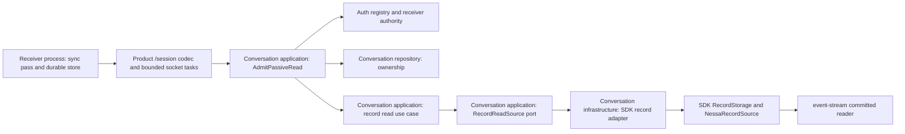
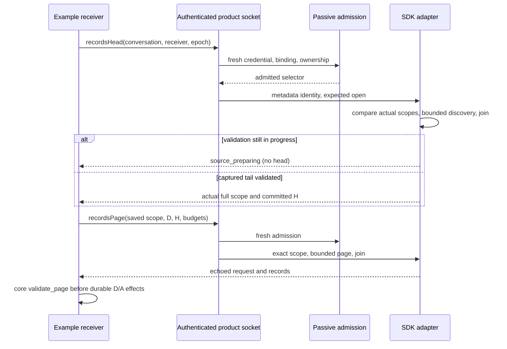

# Authorized bounded record reads — issue 296

Status: proposed implementation design, 2026-09-29. No production behavior is
changed by this document. Tracks [#296](https://github.com/nessalabs/nessa-agent/issues/296)
under [#260](https://github.com/nessalabs/nessa-agent/issues/260).

Baseline: main `2a143d7` includes #276's committed physical source. Authorization
is the separate [#300](https://github.com/nessalabs/nessa-agent/pull/300) change for
#295; reviewed initially at `14e3708adb169840a99b96dc1073b77b3093e278` and its exact-scope
owner rechecked at `16de9c065ade78518747714715ec39a760e1a7ba`, not copied into
this branch. Implementation starts after that contract lands and checks any drift.
The upstream [sync ADR](https://github.com/nessalabs/sync-engine/blob/1044e56f2fc1eaa2e165b98d31041c0541d5a273/docs/adr/1-reusable-local-first-sync-engine.md)
owns generic replication; [semantic record writer](semantic-record-writer.md)
owns physical framing. This document owns the product transport integration.

## Outcome and scope

A seeded, separately running read-only receiver downloads committed records over
`/session`, durably resumes after a lost answer and either process restarting,
and applies a semantic fact once. It completes a captured target despite new
writes, then rechecks head. Pairing, catalogue discovery (#297), hints (#298),
read-only example client/cache (#261), and weak-link scheduling (#262) remain their own issues.
The example receiver receives its conversation and receiver binding through trusted seeding, then discovers the actual scope from an authenticated head answer. Native application shells and keychain integration are outside this issue.
No production loopback listener, Agent attachment, `ConversationService::read`,
or writer lease is part of this path. Stop below means today's authorized
`conversation.close`; turn-specific Stop remains outside this issue.

## Ownership and placement



Arrows are calls, not ownership transfers. Composition injects the narrow async
`RecordReadSource` port and its SDK adapter through the conversation dependency
bundle. Ports and orchestration belong in `conversation/application/record_read/`;
SDK adaptation in `conversation/infrastructure/record_read/`; the product codec
in `product/record_read/`. Add maps and parallel test directories when these
modules exist. Keep auth decisions in `AdmitPassiveRead`, record validity in
sync-engine, frame interpretation in the SDK, and transport capacity in product.
Update those maps and the current architecture guide during implementation;
this proposal does not label future modules as implemented.

## Typed contract

Extend `protocol/product/v1.json`, its manifest and fixtures, then regenerate
Rust DTOs and TypeScript client methods with the existing generator. Do not
hand-edit generated outputs or bump a version. Two methods map to
`conversation.read` in the central action table:

| Method | Params | Success |
| --- | --- | --- |
| `conversation.recordsHead` | `{conversationId, receiverId, accessEpoch}` | `{scope, head}` |
| `conversation.recordsPage` | `{conversationId, accessEpoch, request}` | `{request, records}` |

The request envelope retains its existing correlation `id`. The following is
schema notation, not a second handwritten implementation:

```ts
type DecimalU64 = string // canonical unsigned decimal, 0..18446744073709551615
// No leading zeros except "0"; parse checked u64, never a JavaScript Number.
type Scope = {
  receiver: string; origin: string; stream: string;
  incarnation: string; schema: string; accessEpoch: string; // opaque sync Id
}
type PageRequest = {
  scope: Scope; after: DecimalU64; target: DecimalU64;
  maxRecords: number; maxPayloadBytes: number; maxRecordBytes: number;
}
type WireRecord = { position: DecimalU64; id: string; payload: string }
// payload is canonical padded RFC 4648 base64, without whitespace.
```

Scope identities consume the sync-engine Id contract. The positive numeric binding
access epoch belongs to admission; its opaque sync epoch spelling belongs to the
record selector adapter. The receiver saves the actual full scope from a head
answer and submits that scope unchanged on pages. Origin, incarnation and schema
come from SDK metadata, not from caller guesses or duplicated product preflight.

The application port exposes `read(admitted, Head | Page(request), lease)`.
Head returns `RecordHead { scope, head }`; page returns the core Page. The
application validates each returned operation and its admitted receiver, epoch
and conversation relationship, including custom adapters. The SDK adapter
compares metadata scope with opened-source scope and uses bounded discovery.
`source_preparing` is an honest absence of a validated head, not zero.

Wire identifier byte caps are derived from the locked sync-engine dependency's
`wire_contract` example by `scripts/product-protocol/core-contract.mjs`; annotated
schema fields consume `id_max_utf8_bytes`. Generator `--check` refuses stale
schema bounds. The client does not implement `Id` blank-string semantics,
selector equality, page range, echo correlation or receiver budget validation.
Its decoded evidence reaches the Rust receiver's core validators. Decimal width
and syntax consume the generated schema pattern, while checked u64 overflow is
representation validation.

## Authorization and source construction order

1. Decode transport shape and call the published core page request validator.
2. Fresh passive admission checks credential, policy, binding, numeric epoch,
   current conversation ownership and deletion before metadata or source I/O.
3. SDK metadata supplies physical identity; the record selector owner contributes
   admitted receiver and opaque epoch. A page compares its exact saved scope here.
4. The tracked non-entered worker opens the expected SDK identity. SDK construction
   refuses a reset race; the adapter compares opened-source and observed scopes.
5. Bounded head/page returns Ready or Preparing. Final source drop joins its
   physical worker before the lease reaches encoding and the socket writer.

A single product deadline covers socket authority refresh, browser session check,
admission and metadata/read waits. Cancellation does not release physical work's
lease. No current scope or head is included in authorization refusals. Admitted
work may finish after revocation; later operations reauthorize.



## Bytes, bounds, and first transport choice

Choose full JSON responses with base64 physical payloads for this slice. Keep
inbound product requests at 65,536 bytes. Add a generated, separate 131,072-byte
record-response ceiling; ordinary response policy is unchanged. Configure the
server WebSocket output path and client receive limit consistently, including
any shared MAX_PAYLOAD_BYTES checks. A client must associate the larger decoded
response with a pending record-read method; reject oversized unrelated responses.
Enforce the raw receive ceiling before JSON/base64 allocation, with WebSocket
message limits too. Disable compression for this baseline measurement.

A physical piece is 65,536 body bytes + 9 framing bytes + 1 record tag = 65,546
payload bytes. Refusing it because it exceeds 65,536 would strand a valid fact.
Base64 needs `4 * ceil(65546 / 3) = 87,396` bytes. A numeric JSON byte array could
need `4 * 65546 + 1 = 262,185` bytes; it is not the selected wire format.

| Bound | First-slice value and owner |
| --- | --- |
| Records per page | 1..16, generated product limits |
| Aggregate decoded payload | 1..65,546 bytes, generated from published SDK physical maximum |
| Individual decoded payload | 1..65,546 bytes, same owner |
| Encoded record response | At most 131,072 UTF-8 bytes, product codec |
| Source operations | One per socket; four globally, separate from commands/controls |
| Pending record response | One per socket, includes currently writing response |
| Queued record work | Zero; return busy without source construction |
| Whole read admission-to-result | 10 seconds via injected monotonic clock/deadline |
| Encoded response enqueue-to-write completion | 30 seconds absolute, no per-chunk reset |

Publish the SDK maximum rather than retyping framing rules in the protocol
owner; generator inputs derive their product limit from that published value.
The record limit of 16 keeps a conservative worst-case envelope inside 128 KiB:
six escaped 128-byte scope IDs <= 4,608 bytes, sixteen escaped record IDs <=
12,288, escaped 256-byte correlation ID <= 1,536, base64 aggregate <= 87,436
(the at-most 40 extra bytes cover separate-record padding), and 4,096 bytes for
keys, punctuation, decimal positions and limits: total <= 109,964 bytes.
The epoch Id is shorter than 128 bytes, but the estimate allows a full escaped
Id; the numeric admission epoch appears only in the small inbound request.
Scope occurs once; repeating it per record breaks this budget.
A Node JSON.stringify probe using this exact proposed shape measured 94,652
bytes for one maximum record and 107,067 bytes for sixteen records (one large
and fifteen one-byte payloads), with maximal escaping and u64-width positions.
This is a design measurement, not generated-code verification. Repeat it with
the actual generated Rust and TypeScript codecs during implementation.
Use maximal escaping (ASCII control bytes), u64 maxima and tiny mixed payloads
in real serializer fixtures. The final encoder uses a capped writer and returns
`response_too_large` rather than allocating an unbounded string. Client limits
are checked before decoding; engine limits apply after decoding.

A receiver normally requests all published bounds. `record_too_large` for a
smaller requested budget preserves D and H; retry the same range at the published
maximum. A valid maximum physical record must fit that retry. A refusal at the
published maximum is a protocol/storage fault, surfaced without a retry loop.
Likewise `response_too_large` halves maxRecords down to one while retaining the
same payload budget, D and H; failure at one is a protocol fault. This handles
future envelope changes honestly; it does not excuse missing maximum fixtures.
Requests for 64 records are invalid in this first contract, not silently clamped.

| Choice | Data cost and recovery | Decision |
| --- | --- | --- |
| Bounded whole response | One request/response per page; one max record costs 87,396 payload-encoding bytes, 33.3% over binary; lost reply retransmits at most 128 KiB | First slice: uses existing engine page and atomic store contract |
| Fragment and durably reassemble | Binary can avoid base64; partial loss can retry only missing fragments; requires transfer identity, fragment offsets, integrity, bounded staging, expiration and reset fencing | Evaluate in #262 before adding those states |

At 64 kbit/s, 87,396 bytes alone takes 10.92 seconds; a full 128 KiB bound takes
16.38 seconds, excluding RTT and TCP retransmission. The 30-second send budget
allows that baseline but does not promise progress on arbitrarily slow links.
At 16 kbit/s, a maximum record's base64 needs 43.70 seconds: this slice may time
out honestly. #262 should measure delivered/duplicate/protocol bytes, RTT,
completion time, memory, battery proxy and Stop admission on 16/64/256 kbit/s,
loss and reconnect traces. Compare smaller physical framing or durable fragments
before tuning deadlines or claiming weak-link usability.

## Lifetime, backpressure, and Stop

Split authenticated WebSocket receive and write ownership. The receive owner
polls incoming frames, expiry and current authority while the writer awaits
network readiness. It never awaits a queue slot or write. Keep existing command
permits and detached command supervision; record reads have their separate four
permits and one-per-socket slot. Reserve four response slots for admitted controls and sixteen for ordinary
responses per socket, plus one small refusal slot; a record uses its own slot.
The four global record permits cover source work and pending delivery together:
transfer the permit to the encoded response, releasing only after both physical
work and delivery/drop have ended. Thus at most 512 KiB of encoded record
responses can be retained globally, apart from bounded codec scratch buffers. Physical response priority is control, refusal, ordinary,
then record. The writer observes the record lane independently of that priority,
retaining at most its existing one-slot response locally. Its original absolute
30-second encoded-response deadline governs queued delivery as well as physical
record sending. The writer polls that deadline during selection and during a
higher-priority send or close, including a record arriving after that write began.
Expiry abandons the sink and drops delivery ownership; it does not interleave a
second frame with an unfinished frame or extend the deadline by an ordinary write
timeout. R46–R48 enforce these orderings. Physical source completion and joins
retain their existing owner and are not inferred from delivery teardown.
Bound total queued bytes by per-class slot count times its published response
ceiling; reserve slots before admission and retain them until write/drop. Refusal
traffic must not form another unbounded queue: when no refusal slot is available,
close the socket while already admitted controls retain their owners.

Thus same-socket Stop can be received, authorized and dispatched during a stalled
record send. Its acknowledgement may wait behind that frame until write completion
or the 30-second deadline closes the socket. Do not claim immediate Stop delivery
over blocked TCP. Test the actual execution effect separately from its reply.
A read-only credential cannot issue Stop; this contention test uses a credential
with both actions. A separate read-only phone cannot consume control capacity.

`NessaRecordSource` methods are synchronous and wait on its internal worker.
Each admitted operation owns a dedicated `std::thread` that is not entered into
Tokio, bounded by the four global permits. Capture the runtime Handle at
composition and use `Handle::block_on` on that thread only for async construction.
After it returns, call synchronous head/page and drop the final source outside
any runtime-enter guard. That distinction matters: SDK `SourceWorker::drop`
joins its internal thread only when `Handle::try_current()` fails;
`spawn_blocking` is entered into Tokio and would detach it instead. Tests assert
that the final-drop location has no current Handle and that internal-worker exit
precedes completion publication and permit transfer/release.

One operation owns one source; no idle source cache or per-receiver worker
survives the request. A timed-out or disconnected caller drops interest, not
ownership: the dedicated thread retains the permit and source through physical
read completion and final source drop/join. Only then may it publish its result
and transfer the permit to delivery, or release it if delivery was abandoned.
Composition retains each thread's join handle and tracks its completion; it must
not detach these threads on cancellation. Four stuck reads exhaust sync capacity
rather than spawning replacements; commands/writer continue. Do not advertise
bounded physical cancellation of uninterruptible storage I/O. Shutdown drains
and joins the tracked threads before dropping the storage runtime; if the
shutdown deadline expires it reports retained read work and keeps its owner and
runtime alive until completion or process termination. A disk that never returns
therefore leaves shutdown retained indefinitely; a deadline reports failure without
claiming that storage can safely close. A panicked outer worker is a typed fault,
not an ordinary transient source failure. Completed-worker reaping retains that
fault and fences subsequent reads; final shutdown joins every remaining handle.
The process outcome preserves reader, deadline and conversation cleanup causes
through `ShutdownFailure`, including combined failures. `record_cleanup` is the
single composition ordering and report owner: it publishes reader-pending,
deadline-with-drain-pending, and confirmed-reader/conversation-pending evidence
before its next await. Interrupted callbacks preserve those known facts while
leaving the remaining completion explicitly unreported. Final aggregation
consumes the pending reader evidence and conversation result in one synchronous
publication. The bounded response and
absence of a writer lease do not prove CPU/SQLite fairness: exercise head
scanning on large history under continuous writes in acceptance tests.

## Receiver durability and gate-15 order table

Use sync-engine pass/validation plus the existing SDK physical-fact decoder in
the receiver fixture. Persist downloaded records and downloaded checkpoint D
atomically. Persist semantic application and applied checkpoint A atomically when
a complete fact seals; a partial fact has A < D. A validated abort is also a
terminal outcome: use the SDK's abort-prefix validator against the pending
frames and physical positions, clear that pending fact, and atomically advance
A through the abort as a semantic no-op. Retain the downloaded abort record;
apply no semantic effects from its abandoned prefix. Clearing durable pending
state (if stored) and advancing A share one transaction, so a crash cannot leave
an abandoned prefix attached to the next fact. Invalid aborts leave A and its
pending prefix unchanged and return the SDK's typed validation failure.

The receiver owns a local drain of saved terminal outcomes from A through D,
run after each download commit, on restart, and after uncertain apply reload.
Each sealed fact's semantic effects and A advance commit in one transaction
with the existing immutable-ID and scope checks; a valid abort advances A under
the same scope and checkpoint checks with no semantic effect. A crash after a
seal is downloaded but before semantic application therefore resumes locally:
D may equal H while A is behind, and no new page or writer activity is needed.
The pass's network completion is D = H; report receiver catch-up complete only
after the drain reaches H. A partial fact waits for its remaining frames, but a
captured committed terminal H with undrainable saved data is a typed corruption
failure, not success. On uncertain apply reload both checkpoints before draining
or another read.
Use one receiver owner per scope and the store's compare-and-apply behavior;
transport correlation IDs provide no deduplication authority.

```mermaid
sequenceDiagram
    participant R as Receiver process
    participant DB as Durable receiver database
    participant G as Gateway process
    R->>DB: Load exact scope, downloaded D, applied A
    R->>G: Authorized head
    G-->>R: H
    R->>G: Page(D,H)
    G--xR: Answer lost
    Note over R,G: Either or both processes restart
    R->>DB: Reload D and A; drain saved terminal outcomes
    R->>G: Fresh auth, head and page from D
    G-->>R: Validated fixed-target page
    R->>DB: Atomic records+D; drain sealed facts or aborts with atomic A
    R->>G: Next page until captured H
    Note over G: New commits beyond H
    R->>G: Reauthorize and recheck head
    G-->>R: New target H2
```

Each row is an implementation test ID, including the valid cases paired with
refusals. Amend this table before adding a newly discovered ordering.

| ID | State / ordering | Transition and observable evidence |
| --- | --- | --- |
| R01 | Invalid shape, zero/over-limit budgets, unsafe integer or malformed base64 | Typed refusal; no source or receiver write; maximum valid values accepted |
| R02 | Credential/policy/binding/owner denial before identity | Preserve #295 typed reason; identity and source spy counts zero; read-only send denied |
| R03 | Wrong origin/schema/stream; wrong incarnation; reset during open | Fresh admission precedes SDK metadata; page identity mismatch opens no worker; expected-open reset race refuses |
| R04 | Authorized empty stream or D = H | No page; drain saved terminal outcomes before catch-up completion; recheck can discover later commit |
| R05 | Read admitted then revocation, versus revocation before admission | First bounded answer may finish; second denied before source; later retry denied |
| R06 | Fixed H while continuous writer advances tail | Each page <= H, pass finishes, new authorized head discovers H2 |
| R07 | Page reply lost before durable download | Reload D, retry same range or fresh head pass; no semantic effect from missing reply |
| R08 | Download committed; process dies mid-fact | Restart from D with A < D; saved pieces produce one effect when seal arrives |
| R09 | Apply committed; acknowledgement lost | Reload D/A after Uncertain; repeated/conflicting IDs use engine/store rules; no duplicate effect |
| R10 | Gateway restart with same stream identity | Resume D under fresh auth, source worker recreated; no process-local cursor required |
| R11 | Incarnation/schema/epoch changes or head below D | Explicit scope/reset-required failure, retain old checkpoint; no automatic rewind or replacement |
| R12 | Explicit receiver reset approved externally | Replace scope and its downloaded/applied state atomically; delayed old page rejected by scope/compare-and-apply |
| R13 | Pruned source or retained receiver deletion fence | Surface typed failure; delayed page cannot clear fence or revive deleted state |
| R14 | Maximum piece and escaping; receiver smaller byte budget | Real encoded bytes fit ceiling; small budget refuses; retry at published bound progresses |
| R15 | Encoded ceiling exceeded | Typed response_too_large before send; halve records with fixed D/H; one-record failure stops as fault |
| R16 | Same-socket record send stalls, then Stop arrives | Stop dispatch/effect proceeds independently; reply waits at most remaining send deadline; writer commits continue |
| R17 | Disconnect/deadline while blocking read, then reconnect flood | Permit held through physical completion, at most four SDK source workers and four active outer read threads, typed busy; no replacement leak |
| R18 | Queue full / both response and Stop ready / authority expires while send pending | Reserved control admission remains available, bounded bytes; close owns teardown; first admitted control completes |
| R19 | Source error, encoder error, disconnect/deadline, final drop and shutdown | Gate internal-worker exit; final drop outside Tokio waits for that exit; no completion or permit transfer/release before join; tracked outer thread is joined before runtime drop |
| R20 | Foreign scope, noncontiguous position, wrong echo, corrupt frame | Public validate_page rejects envelope; SDK decoder rejects physical content; durable progress unchanged |
| R21 | Binding epoch 3 with owner-produced scope, then alternate Id spelling | Head discovery returns `epoch-3`; pages with `3` or stale epoch refuse before head/page; application record selector encoding is consumed by the SDK adapter and custom-source correlation |
| R22 | Final seal durably downloaded, crash before semantic commit, no new writes | Restart with D = H and A < D; drain saved facts without another page; atomic effects+A reach H once; repeated restart adds no effect |
| R23 | Partial fact then committed abort downloaded to D = H; crash before abort drain | Restart validates saved abort and prefix with SDK, clears pending fact and atomically advances A to H without semantic effect or another page; repeat restart is unchanged; a later valid fact applies once with no abandoned prefix; malformed abort leaves A/prefix unchanged |
| R24 | Large history, repeated head discovery, or a fact spanning more than one validation step | SDK-owned discovery fixes a captured physical tail and consumes the [published discovery work budgets](bounded-terminal-discovery.md), including its distinct returned-validation and underlying decoded-record bounds; `source_preparing` carries no head. Retry resumes the cached validation offset; only validated terminal H is published after the captured tail is reached. Generic `RecordSource::head` retains its existing complete committed-head contract. |
| R25 | Caller timeout or disconnect before a discovery answer; retry while physical work remains | The existing read permit remains owned through physical completion and source join. Completed discovery progress remains in the SDK cache even if its answer is abandoned; a later retry continues from that offset. A competing discovery refuses as preparing rather than spawning another validator for the same stream. |
| R26 | Writer advances while discovery runs; partial tail becomes sealed later | Finish validation through the fixed captured tail, publish its terminal H, then capture a new tail on the next head read. Partial framing state survives between steps and validates the eventual seal or abort through the single SDK frame validator. |
| R27 | Cache eviction or gateway restart; unknown old page target | Cache is bounded by stream entries and retains frame metadata/hash rather than semantic bodies or workers. Eviction/restart starts bounded discovery again and may return preparing until the requested target is validated. Validated immutable prefix plus the target frame's terminal classification proves an old target without rescanning the prefix for each page. |
| R28 | First tracked read thread panics; another read is still physically blocked; shutdown deadline expires | Join every tracked owner despite earlier failure. Keep typed `WorkerPanicked` distinct from transient source refusal. Record deadline and eventual drain outcome together; retain reader and storage runtime until the remaining thread exits, then attempt conversation cleanup and preserve its independent failure too. `shutdown_joins_later_gated_work_after_panic_and_cancelled_waiter` and `reader_deadline_retains_completion_and_does_not_start_storage_cleanup_early` enforce the order. |
| R29 | A later read reaps a finished panicked worker before shutdown | Retain `WorkerPanicked` in the worker owner, fence new read admission, and report that same fault after joining remaining owners; reaping cannot erase cleanup evidence. `reaped_worker_panic_fences_reads_and_survives_shutdown` |
| R30 | First shutdown waiter is cancelled while another physical worker is blocked | Every later shutdown waiter shares the retained drain. None confirms before all joins complete; cancellation releases interest only. `shutdown_joins_later_gated_work_after_panic_and_cancelled_waiter` |
| R31 | Reader succeeds/fails or misses deadline, conversation cleanup succeeds/fails | Always attempt conversation cleanup after confirmed physical drain; aggregate only failures, retaining both owners and deadline plus eventual panic when present. `shutdown_owner_outcomes_preserve_each_independent_failure` and `reader_deadline_retains_completion_and_does_not_start_storage_cleanup_early` |
| R32 | Reader completion and deadline are both ready on first poll | Polling the already-ready reader confirms its outcome without inventing a deadline failure. `ready_reader_completion_at_zero_deadline_is_not_labeled_timeout` |
| R33 | Reader misses deadline but later drain and conversation cleanup succeed | Preserve the elapsed deadline with `completion: Ok(())`; confirmed later cleanup does not erase the earlier failure. `reader_deadline_preserves_successful_drain_and_conversation_cleanup` |
| R34 | Whole cleanup callback cancelled before reader outcome | `Unreported` means neither reader nor conversation completion is known; do not invent successful cleanup. `cancelled_cleanup_before_reader_outcome_does_not_invent_confirmation` |
| R35 | Callback cancelled after a reader fault while conversation cleanup waits | Keep confirmed physical drain and typed reader failure in `ConversationsPending`; process error retains it with conversation completion explicitly unreported. `cancelled_cleanup_after_reader_outcome_preserves_known_success_or_failure` |
| R36 | Callback cancelled after reader success while conversation cleanup waits | Preserve known reader success without inventing conversation success or a reader fault. `cancelled_cleanup_after_reader_outcome_preserves_known_success_or_failure` |
| R37 | Callback cancelled after reader deadline while physical drain is pending | Preserve elapsed deadline with physical drain unreported and conversations not started; no fabricated eventual completion. `cancelled_cleanup_after_reader_deadline_retains_unknown_physical_completion` |
| R38 | First head has no physical identity; valid authenticated selector | Return SDK-owned full scope and actual committed head; receiver stores the scope for pages. No configured product origin/schema preflight. |
| R39 | Denied selector, missing/deleted conversation, or stale binding | Preserve admission refusal; metadata and source spy counts remain zero. |
| R40 | Reset between metadata observation and expected source open | SDK refuses identity change; no replacement scope or head is published. |
| R41 | Custom source reports another receiver, epoch, conversation, or operation | Application rejects contradiction before product encoding; valid actual scope is accepted. |
| R42 | Fresh head after restart changes incarnation; saved page scope is old | Discovery reveals the actual new scope; example core adapter reports reset-required and retains saved checkpoint; page refuses exact mismatch. |
| R43 | Authority refresh or browser check stalls before source admission | Whole record phase deadline returns read_timeout; no source work is admitted afterward. `record_phase_deadline_includes_current_authority_before_source_admission` |
| R44 | Encoder receives large base64 chunk followed by small JSON suffix | Retained writer allocation stays within the response cap; output is compacted before enqueue. No Vec growth beyond the advertised byte capacity. |
| R45 | Authenticated separate receiver process submits a wrong receiver or stale epoch before discovery | Product replies with the corresponding typed refusal and no scope/head; the receiver creates no durable cache. A subsequent valid cold discovery still completes. `authenticated_product_processes_resume_download_after_lost_page_and_both_restarts` exercises the wire boundary; R39 application spies own the no-source-work assertion. |
| R46 | Encoded record queued; control, refusal or ordinary responses remain continuously ready until its original absolute deadline | Writer observes expiry independently of physical response priority, abandons transport and drops the record slot/read lease; no late record frame. Global read capacity returns when no other work owns it. |
| R47 | Record arrives while a higher-priority physical send or close is stalled beyond the record's remaining deadline | Writer observes arrival and expiry during that write, abandons the sink at the original record deadline without appending another frame; delivery teardown does not recreate or release unjoined source ownership. |
| R48 | Pending record is not expired; higher-priority responses drain; Stop arrives during physical record send | Physical control/refusal/ordinary priority is preserved; valid record sends once and releases its slot/read lease. Existing actual Stop dispatch/effect remains independent of physical acknowledgement. |


Explicit receiver reset is a receiver administration operation outside these two
read methods. The integration fixture may invoke it locally; the server does not
infer consent from a failed page. Credential revocation stops future delivery;
remote erasure of already downloaded data is not promised.

## Acceptance evidence and implementation order

Implement vertical steps with Sol medium, after coordinator review of this plan:

1. Land #295, record the exact new base, and add generated request/response/error
   contracts and byte-limit fixtures. Publish the SDK physical bound and add
   expected-identity source creation, with mismatch/race tests (R01–R03, R14, R21).
2. Add injected application read use case and SDK adapter; demonstrate auth
   precedes lookup, no Agent/provider/writer lease, worker lifetime and typed
   source errors (R02–R06, R17, R19–R20).
3. Split socket receive/write ownership with reserved bounded response slots and
   absolute send deadlines. Test same socket with a deliberately stalled sink
   and actual Stop effect, not only another socket or a queued acknowledgement
   (R16–R19). Keep ordinary command lifecycle regression suites running.
4. Add generated client calls and production `/session` receiver adapter in the
   server integration fixture. Run child gateway and child seeded receiver with
   durable databases; kill/restart each around download and apply boundaries,
   discard a page reply, and verify semantic counts (R07–R13, R22–R23).
5. Freeze the final tree; run adversarial scope/budget/flood/reset cases and
   continuous writer tests, then review every table row against named tests.

| Evidence | Required gate |
| --- | --- |
| Generated protocol parity | `pnpm protocol:check`, client typecheck/tests and client docs check |
| Rust boundaries and failure paths | Server/SDK format, clippy, targeted suites plus repository CI package selection |
| Maximum wire and bounded memory | Serialize actual generated response, assert raw UTF-8 bytes; decode through actual client; capped encoder overflow test; queue/worker counters under flood |
| Durable vertical | Real `/session`, distinct OS processes, persistent receiver download/apply checkpoints, both restarts and dropped page reply |
| Writer/control isolation | Continuous canonical commits while head/page run; stalled same-socket response; assert writer commits and Stop effect before releasing sink |
| Organization and review | `pnpm architecture`; module maps, links and public API lifecycle docs; local review against coding standards and exact base/head/tree |

Change each added load-bearing rule in a revert probe and show its enforcing test
fails before restoring the reviewed tree. Record supported platform and feature
checks; do not infer them from an isolated crate run. The present documentation
commit runs Markdown/link and architecture checks only: the matrix above is
future acceptance work, not claimed implementation evidence.

### Raw incoming read evidence (issue 261 correction)

TypeScript `protocol/unique-json.ts` owns raw object-key uniqueness at `parseWireMessage`, before JSON.parse collapses object members. JSON.parse retains grammar/value ownership. This single admission boundary rejects every repeated decoded object key, including envelope correlation, nested scope/pass/request/descriptor/key and records. Semantic validation still receives unambiguous foreign evidence. Invalid frames follow the existing ignored-frame/pending-request behavior; no permission comparison or reconnect policy is added.

| Row | Raw ordering/input | Expected admission |
| --- | --- | --- |
| W1 | Unique valid or foreign typed evidence | Existing read API result; semantic core owner decides correlation |
| W2 | Foreign→valid or valid→foreign duplicate authority/identity/correlation | Refuse before dispatch; pending request unchanged |
| W3 | Equal repeated key values | Same raw refusal |
| W4 | Escaped-equivalent decoded keys; nested arrays/objects | Same raw refusal |
| W5 | String punctuation/escapes, Unicode/surrogates, numbers or malformed JSON | Preserve JSON.parse grammar/value conversion and existing shape decisions |

`wire-read-uniqueness.test.ts` drives actual WireSession message listeners and record/catalogue APIs through these rows.
