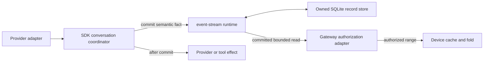
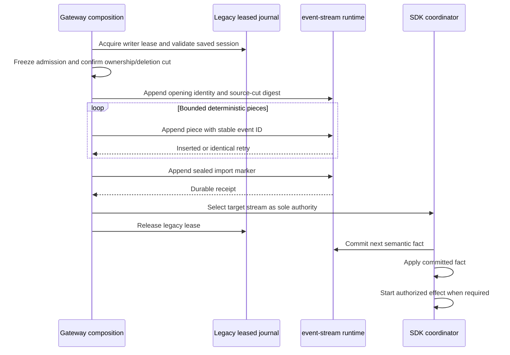

# Canonical conversation records and legacy import

**Status:** proposed cutover contract for [#274](https://github.com/nessalabs/nessa-agent/issues/274), under [#258](https://github.com/nessalabs/nessa-agent/issues/258). The baseline codec reuses the SDK's typed snapshot field mappings. An adapter writes an opening record, bounded pieces and a seal through the `event-stream` runtime, and can read the sealed baseline after restart. The current SDK still writes leased JSONL session journals; no production record runtime or authority switch is composed yet.

## What becomes authoritative

One SDK coordinator owns decisions about a conversation. Once the transition is complete, it commits Nessa semantic records to one `event-stream` runtime before applying the committed fact or starting a new effect. The gateway may authorize and read those records; a phone may cache and fold them. Neither a gateway reader nor a phone replays a record by executing a prompt, tool or agent.

The library owns the generic `StreamKey`, incarnation, cursor, event ID, append identity, bounded reads, replay/live subscriptions and SQLite store lifetime. Nessa owns what the payload means, verified caller attribution, command receipt lookup, provider correlation, deletion and recovery decisions. The current pinned library revision is `b39790230c21ae797b05f54e29a7b8dc51d89766`, merged in [event-stream PR #2](https://github.com/nessalabs/event-stream/pull/2). Production SDK code enables its `codec` feature for ACP JSON-RPC framing; the SDK test graph also enables `sqlite` to prove restart recovery. Its durability and lifecycle guarantees must pass Nessa integration tests before composition relies on them. The library's optional replication feature is a separate protocol; the device path uses `nessa-sync`'s current record contract.

## Current evidence and the migration limit

`SessionSnapshot` retains the session/provider identity, context, invocations in admission order, their request and verified `ActionContext`, acknowledgement, observations, scheduling, cancellation, provider report, local outcome and result, plus global queue history. `LocalFileStorage` appends changed JSONL snapshot lines under a per-session writer lease. Replay of complete lines reconstructs and validates the latest snapshot; an incomplete final line is truncated, and a malformed complete line is refused.

The snapshot does **not** retain a total historical order between observations and scheduling changes in different invocations. Import can preserve the current facts, each invocation's own order and the saved queue order. It cannot invent a past global event timeline. The first migrated record is therefore a clearly identified **baseline**, followed by actual new semantic changes. A device can show the recovered transcript and its current state, but must not present that baseline as a minute-by-minute historical event feed. Provider context is recovery metadata for the SDK, never a remote execution capability.

The gateway's conversation catalogue and deletion state remain owned by its conversation store. Audit is independently owned today. Their facts must be captured or linked through explicit identity and cut evidence; copying an SDK snapshot cannot prove that a conversation still exists or that a file is authorized. The import cannot silently resurrect a deleted conversation.

## Record and import contract

The Nessa payload schema is versioned independently of `event-stream`'s generic envelope. It needs these families:

| Family | Meaning and owner | Required identity |
| --- | --- | --- |
| Imported baseline | Coherent validated legacy session at a frozen cut; SDK import owns it | Session ID, which names the journal under its lease, and the validated cut digest |
| Command accepted | Exact `ExecutionRequest`, submission mode, verified actor and initial acknowledgement; SDK admission owns it | Conversation and stable `execution_id`, which is the SDK's submission key |
| Provider observation | Normalized `ExecutionEvent` after the SDK accepts its source identity | Conversation, owning `execution_id` and zero-based observation ordinal |
| Scheduling/stop decision | Queue order, local stage, cause, actor and target, separate from provider acknowledgement | Conversation, owning `execution_id` and per-invocation transition ordinal; queue decisions use stream order |
| Settlement/recovery | Provider report, local result, cleanup and uncertainty as separate facts | Conversation and owning `execution_id`; a superseding fact names the fact it corrects |

For a newly created conversation, the SDK first commits its session identity, provider identity and recovery context as the stream's opening fact. An imported conversation gets those values from its sealed baseline. The SDK has no separate request ID or attempt ID in `SessionSnapshot`; `ExecutionRequest.execution_id` is its stable submission key. Do not mint a second correlation key for the record format. The gateway conversation catalogue owns whether that conversation exists and who can see it. Gateway deletion must leave a durable tombstone or equivalent deletion fence in that owner before a migrated or cached SDK record can be exposed again. The exact gateway deletion transaction belongs to [#275](https://github.com/nessalabs/nessa-agent/issues/275); a baseline cannot make a deleted conversation live.

The baseline may need several bounded payload records because a validated legacy snapshot can exceed one event limit. Its opening record names the source session and digest of the validated semantic cut; numbered pieces carry exact bytes; a final seal states their count, total bytes and digest. The fold exposes a baseline only after checking that seal and the opening identity. Deterministic event IDs and exact retry bytes let an interrupted import resume without duplicating pieces. The payload uses Nessa-owned typed snapshot field mappings and bounds, not a second copy of the JSONL journal contract. The importer checks that decoding the pieces reconstructs a `SessionSnapshot` passing the same application validation as the source.

The current version 1 record payloads are byte encoded:

| Schema | Payload fields in order | Meaning |
| --- | --- | --- |
| `nessa.baseline-open` | version `u8`, session ID length `u16`, session ID UTF-8, cut digest `[u8; 32]` | Names the legacy session and exact validated semantic cut. |
| `nessa.baseline-piece` | version `u8`, section `u64`, part `u32`, byte length `u32`, exact bytes | Carries one bounded section fragment. |
| `nessa.baseline-seal` | version `u8`, piece count `u64`, content bytes `u64`, digest `[u8; 32]` | Commits the opening record's cut after all pieces match. |

Integers use big-endian bytes. The digest is SHA-256 over each piece's section, part, length and content in order. Event IDs derive from that digest and the record index. The stream importer reads an existing prefix before appending, refuses a different prefix, and reads back the full prefix after the seal. A missing seal leaves the legacy journal authoritative. A sealed read returns both the reconstructed snapshot and the seal cursor, so the later fold starts after the baseline. The SDK's SQLite restart test reads the sealed baseline back through a newly opened `event-stream` runtime; the production gateway cut and writer switch remain [#275](https://github.com/nessalabs/nessa-agent/issues/275).

Every later record is immutable. A correction or superseding outcome is a new fact with explicit cause and target; the old fact remains. Command receipt lookup uses the committed acceptance record and never dispatches work. A record from another stream incarnation, an unknown required schema or an impossible combination of actor, target and result stops the fold with a typed error before checkpoint advance. Optional display content may be reported unsupported without changing lifecycle meaning.

### Incremental record ownership and commit order

The live writer in [#275](https://github.com/nessalabs/nessa-agent/issues/275) must derive incremental records at the existing `SessionManager` decisions, not by diffing an arbitrary final snapshot. One conversation stream serializes commits; the stream cursor gives the order of *committed* facts. A record carries its stable event ID, schema version, owning invocation identity where applicable, and the exact validated value below. An invocation's request supplies its target, so later records refer to that invocation rather than copy a second request or actor. The baseline seal cursor is the starting cursor for these records.

| Commit boundary in the current SDK | Canonical fact and fields | Required order / interpretation |
| --- | --- | --- |
| `begin_record` saves admission | `input-accepted`: request and execution identity, submission mode, verified `ActionContext`, initial `SubmissionAcknowledgement`; include the first `Submitted → Queued` edge when queued or steering | Commit before scheduler membership or provider work. An unacknowledged receipt is still an accepted input; it must not be redispatched on replay. |
| Queue membership or selection is saved | `queue-decision`: `QueueMutation`, optional verified actor, affected invocation and scheduling prefix | Preserve the global queue order. Selection does not claim provider dispatch. |
| `record_scheduling` saves a transition | `scheduling-transition`: invocation identity and exact `InvocationSchedulingEvent` | Validate `before`, stage, cause, target and actor against that invocation's prior edge. `Dispatched` precedes polling ordinary provider work; `Injected` follows provider acknowledgement of native steering. |
| `event` accepts and saves a provider observation | `provider-observation`: invocation identity, ordinal and exact normalized `ExecutionEvent` | Commit only observations owned by a dispatched invocation. Message fragments can remain live-only until the next durable save boundary; do not claim a lost fragment was committed. |
| Submission acknowledgement changes | `receipt-updated`: invocation identity and exact `SubmissionAcknowledgement` | This reports audit/storage acknowledgement, independently of provider acceptance or the final execution result. A failed acknowledgement retains its failure detail. |
| A stop is saved | `stop-decision`: invocation identity, whether it is undispatched cancellation or the first local stop of dispatched work, cause and verified actor if explicit | A local stop does not prove provider cleanup. Retain the first stop even when a later provider report or local failure arrives. |
| `record_provider_report` saves a reply | `provider-report`: invocation identity and exact `ExecutionReport` | This is the provider's settlement evidence. Local cancellation requires an earlier owned stop; absent report remains unknown, not failed. |
| `finish` saves local settlement | `local-settlement`: invocation identity, saved `result` and any earlier `local_outcome` it preserves | Do not overwrite provider evidence with hook, audit or storage failure. A later correction is a targeted new fact, not in-place replacement. |
| Provider context changes under SDK ownership | `provider-context`: validated `ProviderContext` and owning session identity | Recovery metadata stays on the trusted host and must not be exposed as a device execution credential. |

The current snapshot API can save several changed fields together. The live writer must either commit one atomic Nessa record containing that whole transition or commit a documented sequence whose intermediate prefixes are valid. In particular, admission and its first queued edge are one fact, while queue membership is a later fact. The current native-steering path can receive provider acceptance before its `Injected` edge or receipt acknowledgement is saved. A crash in that gap leaves a pending accepted input with an **uncertain delivery outcome**; recovery must inspect the provider's correlation or retain uncertainty, never retry injection merely because the edge is absent. Each committed prefix must fold to a valid state and must never start a provider or tool effect during replay.

## Cutover states and orderings

The legacy lease and new runtime cannot jointly accept writes. On startup, composition chooses the source of authority from a durable sealed import marker in the target stream. If it is absent, acquire the legacy writer lease and stop admission for that session while importing. A sealed target stream is authoritative even if the old journal still exists; retiring the old bytes is a later cleanup and must not affect the decision.

| Saved state / event | Allowed transition | Effect and recovery assertion |
| --- | --- | --- |
| No target stream; valid legacy journal | Freeze admission and acquire its lease; begin import | Source remains the only authority until the seal commits. |
| No target stream; no legacy journal | Create an empty new stream through normal admission | Do not fabricate an imported conversation. |
| Legacy load is malformed or identity mismatched | Refuse import | Do not interpret it as empty; leave source and admission blocked for repair. |
| Piece append is rejected | Stop import | No seal; readers ignore the partial target. |
| Piece append outcome is uncertain | Look up the same event ID and exact bytes, then retry or stop | Do not allocate a different ID or switch authority on a timeout. |
| Crash after some pieces, before seal | Reacquire the same legacy cut and resume deterministic pieces | If the source cut changed, refuse and investigate; no mixed baseline. |
| Seal append confirmed; old journal still present | Select target stream as authority, then release legacy lease | Never write new facts to the old journal again. |
| Crash after seal but before cleanup | Select target stream on restart | Cleanup cannot turn the old journal back into authority. |
| Legacy deletion races with import | Coordinate with the gateway deletion owner and refuse an obsolete cut | A copied session cannot override the deletion fence. |
| A new prompt arrives during import | Hold or explicitly refuse admission | No provider effect occurs before the target authority is ready. |

## Verification required before cutover

1. A fixture with multiple invocations, an accepted but unfinished input, output, queue history, cancellation and distinct provider/local outcomes imports, restarts and reconstructs the same validated current state and receipt identities.
2. A partial final JSONL line recovers only the committed prefix; a malformed complete line, wrong session ID, missing provider identity and contradictory acknowledgement/result each produce typed refusal.
3. Interrupted piece append, lost commit reply, altered retry bytes, source-cut change and a crash after seal exercise every table row without two active writers.
4. Compare the gateway's old view with the new fold over the imported baseline. Check that a copied fact invokes no provider, tool or host effect.
5. Verify source deletion/ownership at the import cut and again before exposure. The product deletion and backup contracts remain separate issues.

[#275](https://github.com/nessalabs/nessa-agent/issues/275) owns the production write-path switch; [#276](https://github.com/nessalabs/nessa-agent/issues/276) owns bounded sync reads; [#277](https://github.com/nessalabs/nessa-agent/issues/277) owns the shared fold. This issue owns the baseline schema, importer and migration evidence that those slices depend on.
