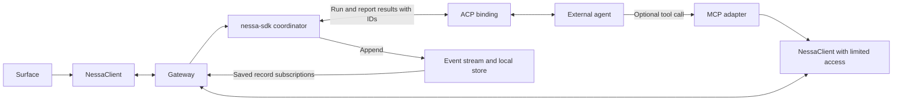
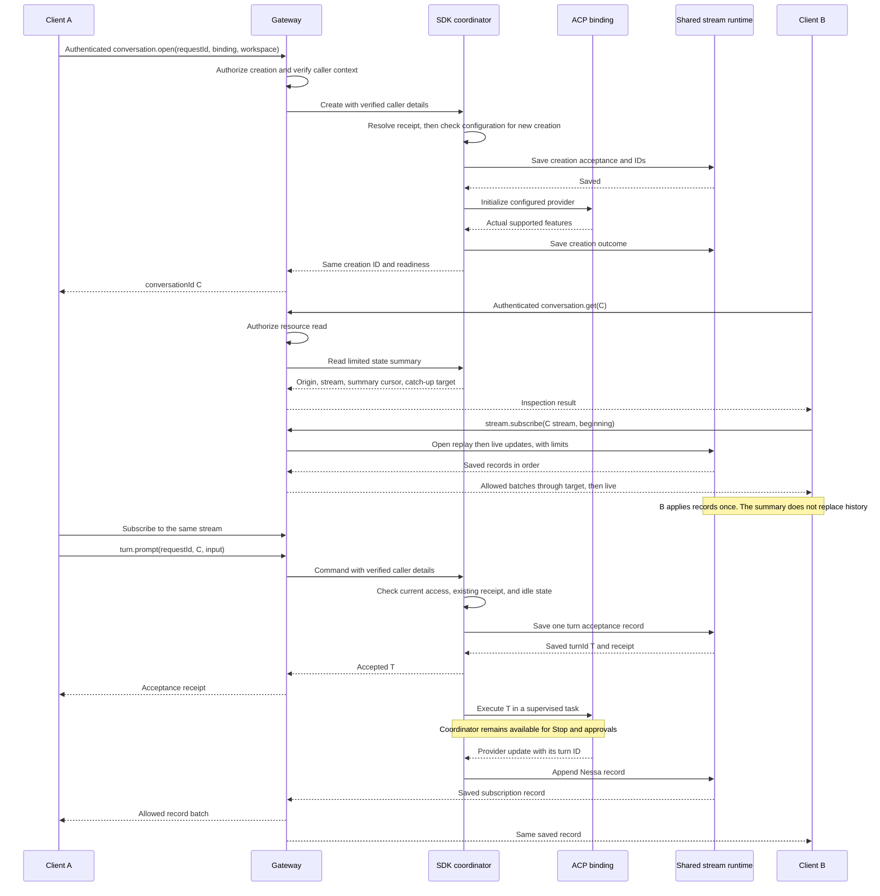
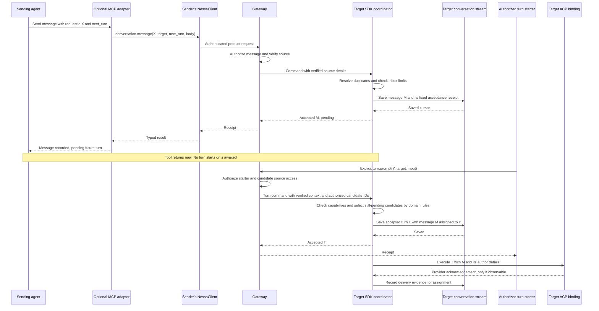
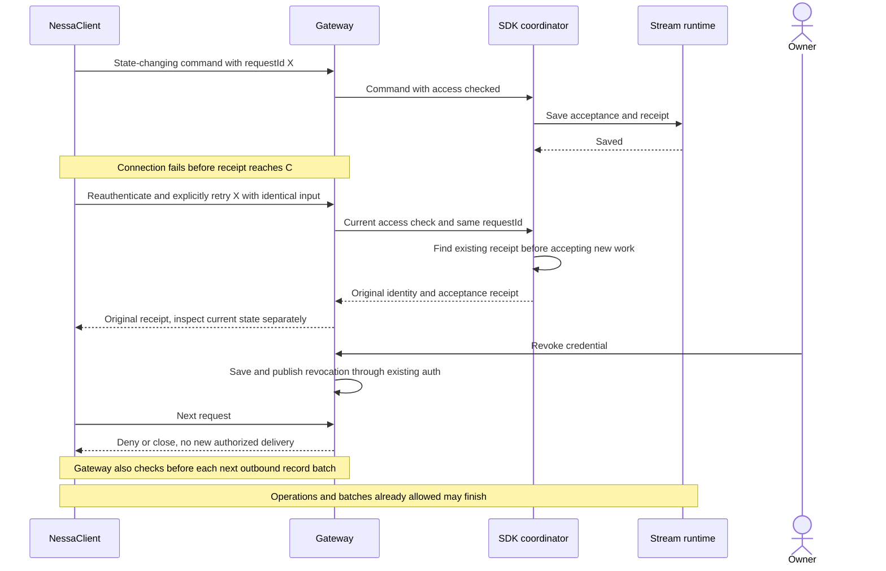

# Shared conversation and optional tool sequences — proposed design

These examples follow [ADR 0008](../adr/todo/0008-agent-client-api.md),
[ADR 0011](../adr/todo/0011-nessa-session-protocol-and-authorities.md), and
[ADR 0012](../adr/todo/0012-agent-harnesses-and-optional-tools.md).
The conversation/tool APIs below are proposed and not implemented yet.
[Surface and collaboration rules](surfaces-and-collaboration.md) define identity
and which input can be used. This document shows how the parts work together;
the ADRs and shared schemas still own the rules.

## Product flow and optional re-entry

Nessa can ask the agent to work, and the running agent can call a Nessa tool.
The second call goes through the same public API and access checks as other calls.



Each client instance belongs to one configured principal/profile. Sharing the
client library does not mean sharing a connection or credentials between callers.
The MCP adapter is an ordinary gateway client. It does not reach directly into
the store or private command handlers. The SDK must still process commands while
a supervised provider task waits for an optional tool result.

A future Nessa-owned agent or CLI adapter would use the same public product APIs.
Neither is required here. ACP controls the external agent; MCP exposes optional
Nessa tools to that agent. They serve opposite directions.

## 1. Create once, observe from two clients

Client A creates a conversation. Client B opens its existing history. Both receive
updates from the same agent run.



The clients keep separate credentials, views built from records, and drafts.
One binding owns the provider; there is no saved attachment state. Opening a view
uses `conversation.get` plus a subscription and never initializes another provider.
Disconnecting or unmounting the UI releases its observation resources without
cancelling turn T.

The gateway checks current access for reads and each size-limited outbound batch.
The host authorizes commands through that same auth application before SDK
access; the SDK checks configured capabilities and domain invariants. Socket writes never hold the lock for accepting commands. Provider
startup has a deadline. Retrying creation finds the original pending or finished
creation rather than starting another provider.

## 2. Record input, then assign it in a later authorized turn

This is ADR 0011 phase B, which can be tested through NessaClient before MCP exists.
Saving a message returns a receipt immediately. A later explicit prompt chooses
which pending messages to include; the tool does not wait for that turn.



The host derives author/source fields from trusted provisioning, never from a
caller-controlled `from` label. The acceptance receipt never changes. Later
`message.status` calls show assignment and delivery evidence. `assigned(T)` never
automatically returns to pending.

A provider acknowledgement does not prove the model used the message or replied.
If a crash makes delivery uncertain, mark T interrupted and keep M assigned with
unknown delivery evidence. This avoids feeding the same message to another turn
just because a reply was lost.

If the source credential expires or is revoked before selection, retire its
pending input under the collaboration rules. If auth is temporarily unavailable,
pause assignment without dropping the message. Revocation after the turn's access
check does not undo T. The coordinator owns these decisions; tool adapters and
separate inbox workers do not. Receiving a note never triggers an automatic reply.

## 3. Lost receipt, reconnect, and revocation

A connection can fail after Nessa saves a command but before the caller gets its
receipt. Reusing the same request ID finds what Nessa already accepted.



Connection recovery reconnects and reopens observations. It must not blindly
resend state-changing commands with uncertain results. The caller checks the
saved result or explicitly retries with the same `requestId`. Direct Nessa calls,
MCP, and a later CLI use these same receipt rules.

The client view owner resumes from its last applied cursor and replaces the old
subscription. Ignore callbacks from that old subscription. Reloading without the
saved view replays from the beginning. A cursor attached to an inspection summary
does not replace transcript records the client has never applied.

## MCP boundary and initial tool surface

Start with one local stdio adapter process per configured principal/profile.
Startup code passes it a protected credential source and NessaClient. It must not
borrow the panel's owner connection or accept secrets as tool arguments.
Explicit administrative provisioning is separate from listing or calling tools.

| Tool group | Proposed mappings | Delivery gate |
| --- | --- | --- |
| Read | `nessa_list_conversations` → `conversation.list`; `nessa_get_conversation` → `conversation.get`; `nessa_read_events` → `stream.read_after` | 0011 phase A read APIs verified |
| Control, opt-in | `nessa_open_conversation` → `conversation.open` (create); `nessa_start_turn` → `turn.prompt`; `nessa_cancel_turn` → `turn.cancel` | Corresponding 0008 operations and scoped checks verified |
| Collaborate, opt-in | `nessa_send_message` → `conversation.message`; `nessa_message_status` → `message.status` | 0011 phase B verified |
| Approvals, separate opt-in | `nessa_respond_approval` → `approval.respond` | Interaction semantics and explicit grant verified |

List and call only working operations allowed by both the current profile and
gateway permissions. Check again when a tool is called; a remembered tool list
does not grant access. Read or message permission does not include control.
An allowed agent starts a turn through the same `turn.prompt` as a human, with its
agent authorship preserved. There is no special message-and-start route.

Reads return limited pages and saved cursors. `conversation.get` returns a limited
state summary with the cursor used to build it. A page of transcript is not a full
saved view. The first MCP package needs no live stream or separate task lifecycle:
state-changing calls return receipts, and later limited reads show progress.
Native surfaces keep using their Nessa subscriptions.

Cancelling an MCP request can stop waiting, but does not prove a Nessa command
was rejected or undo one already accepted. Stop a Nessa turn through the explicit
product operation. MCP cancellation's `requestId` identifies its transport request.
`tools/call.arguments.requestId` is the separate, stable Nessa command ID. Never
substitute one for the other.

## Example: one message contract through native wire and MCP

These proposed examples use the generated product argument/result schemas.
No provider or gateway credentials appear in the payload. Both carry the same
Nessa command ID, target, message body, and delivery intent.

```json
{
  "type": "req",
  "id": "rpc-41",
  "method": "conversation.message",
  "params": {
    "requestId": "request-review-17",
    "conversationId": "conv-target",
    "body": { "type": "text", "text": "The parser review is ready." },
    "delivery": "next_turn"
  }
}
```

```json
{
  "jsonrpc": "2.0",
  "id": 41,
  "method": "tools/call",
  "params": {
    "name": "nessa_send_message",
    "arguments": {
      "requestId": "request-review-17",
      "conversationId": "conv-target",
      "body": { "type": "text", "text": "The parser review is ready." },
      "delivery": "next_turn"
    }
  }
}
```

The calls find the same receipt only if they have the same allowed principal,
operation, target, and canonical input (the agreed standard form). Their transport
IDs may differ. Keep `request-review-17` after an uncertain result; do not generate
another ID when retrying the same logical command.

A successful MCP result can return the product receipt through its declared
output schema:

```json
{
  "jsonrpc": "2.0",
  "id": 41,
  "result": {
    "isError": false,
    "content": [
      { "type": "text", "text": "Message msg-88 recorded; pending an authorized turn." }
    ],
    "structuredContent": {
      "messageId": "msg-88",
      "cursor": "opaque-committed-cursor",
      "deliveryState": "pending"
    }
  }
}
```

Keep known product error codes when mapping rejections to MCP tool errors.
Use the selected MCP SDK's protocol errors for invalid message envelopes.
An uncertain result is neither a success receipt nor proof of rejection.
Finalize JSON shapes in the product schemas, not in separate handwritten
contracts for each adapter.

## Later CLI and deferred hosting

An automation CLI makes structured API calls; an interactive terminal surface is
a different consumer. Add the CLI when a real caller needs it. Use NessaClient
directly instead of starting MCP through a shell:

```sh
nessa conversations list --profile reviewer --json
nessa messages send --conversation conv-target --delivery next_turn --request-id request-review-17 --body-file /tmp/review.txt --profile reviewer --json
nessa conversations create --binding claude-acp --workspace workspace-1 --request-id request-create-8 --profile reviewer --json
```

Profiles refer to protected credentials and selected tools. Read message bodies
from files/stdin, preserve `--request-id`, write one structured result to stdout,
write diagnostics to stderr, and return nonzero on failure. Missing credentials
or options fail clearly. Do not silently log in interactively, select an owner
profile, or use another interface after a tool denial. CLI exit does not cancel
saved work. MCP and CLI can ship separately with different feature sets.

HTTP MCP, downstream token exchange, remote pairing, window navigation/show tools,
provider-session import, and Nessa's own harness are deferred. Identify the real
caller and define access and lifetime rules before implementing them. These
examples do not add an HTTP auth service or a task scheduler.

## Standards and focused validation

The reviewed [MCP stdio transport](https://modelcontextprotocol.io/specification/2025-11-25/basic/transports),
[tool result](https://modelcontextprotocol.io/specification/2025-11-25/server/tools), and
[request cancellation](https://modelcontextprotocol.io/specification/2025-11-25/basic/utilities/cancellation)
profiles inform these message examples. Pin the actual SDK and supported profile
at implementation and test the real target host. These references do not prove
current package compatibility. Nessa owns receipt and inbox behavior; MCP does
not provide those guarantees.

Test separate permissions and clients; current tool-list checks after discovery
or removal; absence of secrets in schemas/results; matching direct/MCP receipts
and errors; read limits; closure/cancellation after a saved command; and a tool
calling Nessa while its provider is active. Ordinary ACP conversations must still
work if the optional adapter is absent or fails. Core turn/state tests belong in
the SDK; stream-algorithm tests belong in the library. Future HTTP/CLI/navigation
tests do not need to finish before the initial stdio read profile can ship.
