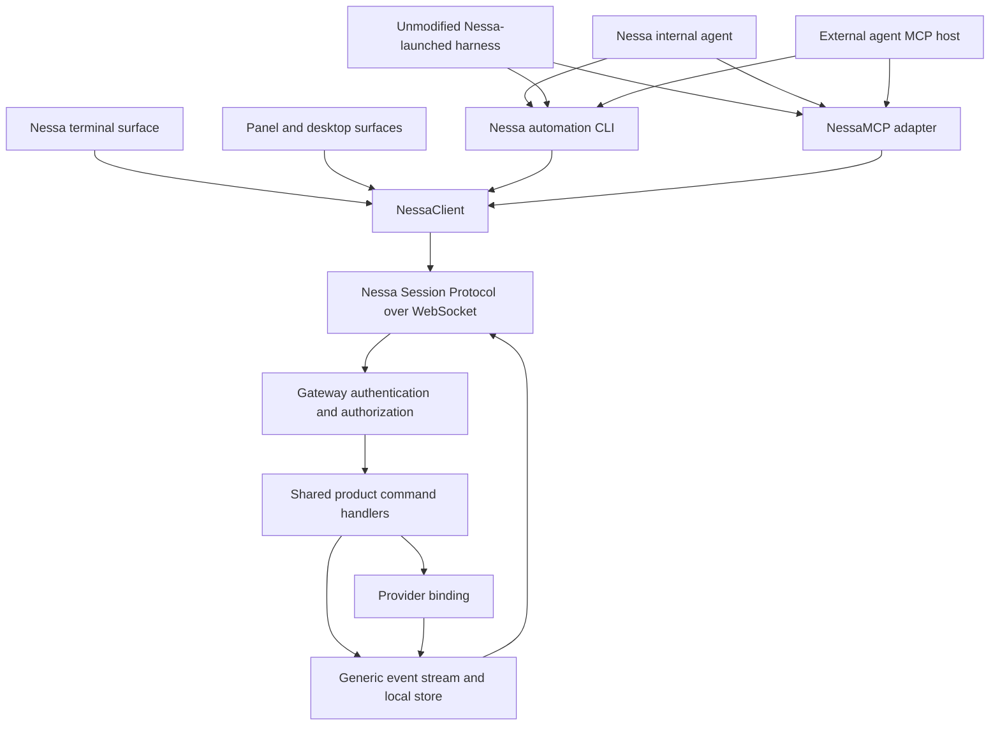
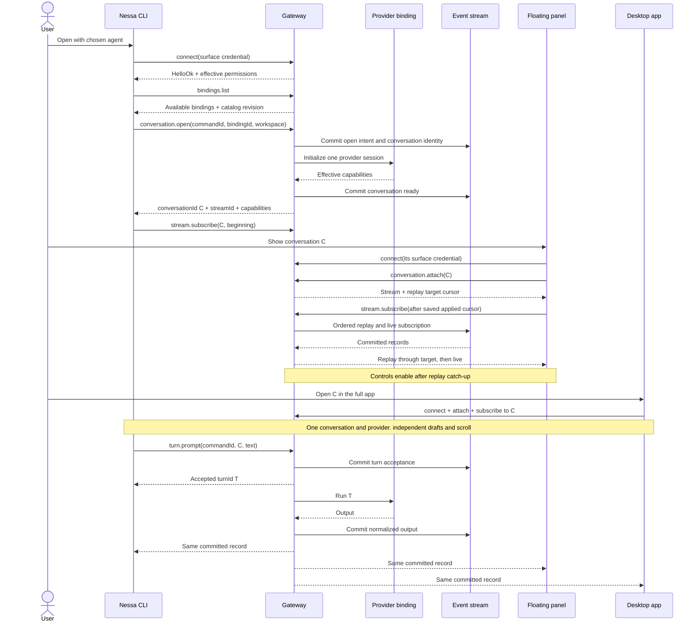
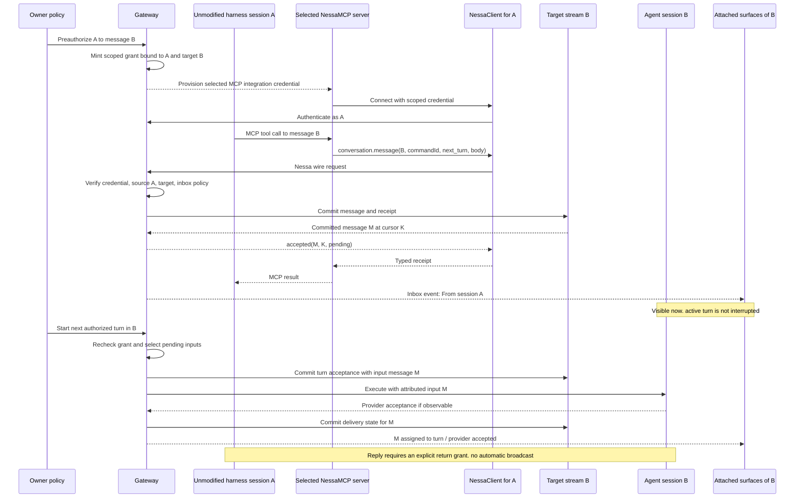
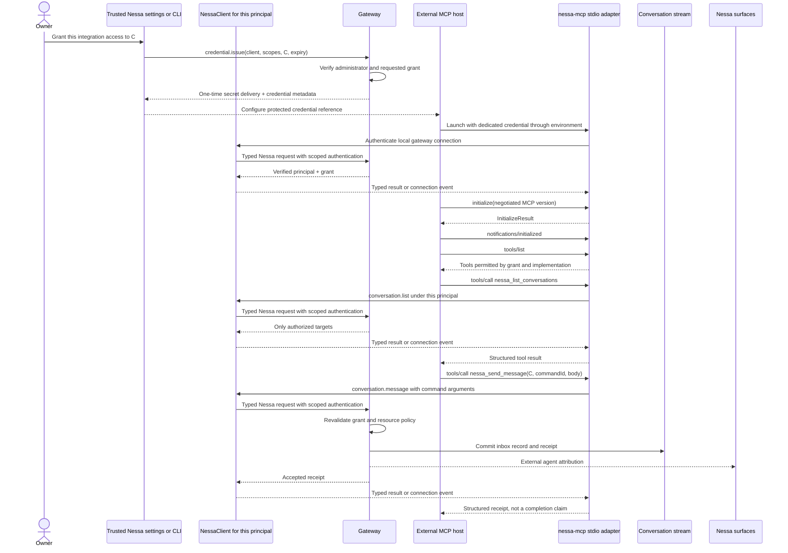
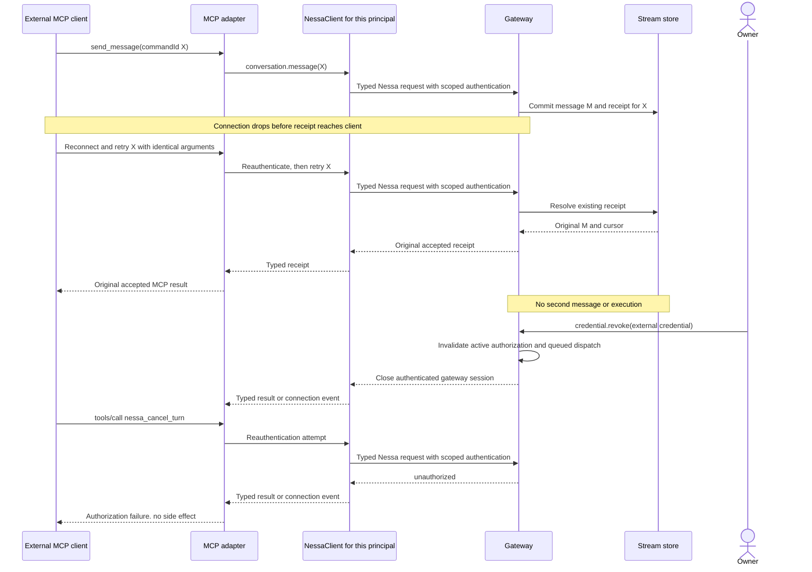
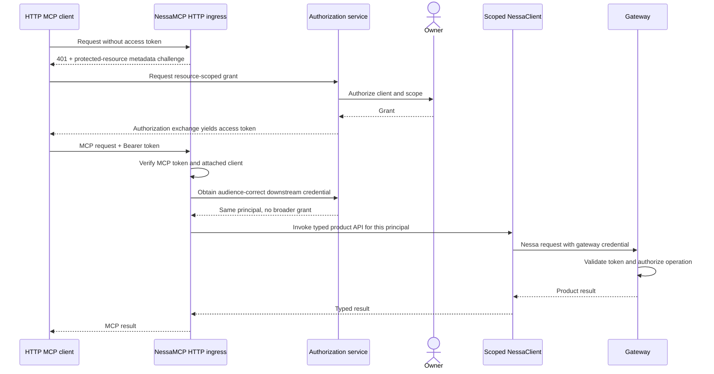

# Collaboration sequences and Nessa MCP — proposed protocols

Companion to [ADR 0011](../adr/todo/0011-nessa-session-protocol-and-authorities.md),
[surface/collaboration rules](surfaces-and-collaboration.md), and
[session/stream rules](session-and-stream-contracts.md). [ADR 0012](../adr/todo/0012-agent-harnesses-and-optional-tools.md) owns the
external-harness preservation, the internal Nessa agent, and optional MCP/CLI packages. All method names and
examples are proposals, not existing endpoints. Tokens in diagrams are symbolic;
no real credentials belong in these documents or model-visible tool arguments.

## Protocol layers



`NessaClient` is the shared typed gateway API for the CLI, panel, desktop, and
`NessaMCP`. MCP is an agent-facing interface, also usable by Nessa’s internal agent: `tools/call` becomes
a typed client API call, which sends the same Nessa wire request as another
consumer. Results and stream records return through that client. The adapter
never calls gateway handlers directly or implements its own socket/RPC stack.

The diagram's shared SDK box means one implementation, not a singleton connection
across principals. Each attached MCP principal has its own authenticated client
instance. MCP is not a new value of `SurfaceKind` or a trusted role. Its sender
is an integration/agent principal; panel/CLI/desktop metadata describes human
presentation surfaces and does not confer permissions.

### Implementation versus instance

`NessaMCP` is its own adapter object/process. Its internal `client: NessaClient`
is a normal instance of the same SDK used by the CLI and UI. The composition
root creates and injects that client using the attached integration's credential;
it does not borrow the panel's logged-in client or implement another client API.
The adapter maps MCP tools to typed client methods and translates results/errors.
`NessaClient` retains ownership of connection lifecycle, RPC correlation, protocol
validation, subscriptions, and reconnect behavior as those features are added.

```text
Panel adapter      → NessaClient instance P (surface grant) ──┐
MCP adapter A      → NessaClient instance A (agent A grant) ──┼→ Gateway
MCP adapter B      → NessaClient instance B (agent B grant) ──┘
                         same SDK implementation
```

For stdio, one attached host/adapter process owns one scoped client. For a future
multi-client HTTP host, maintain separate client contexts for separate principals
and grants; never mutate a shared instance's token per request. Dispose the owned
client when its adapter session ends and reauthenticate on reconnect. This closes
the subscription/connection, not the shared conversation or its running turn.
A replacement client instance with the same grant preserves product identities,
command IDs, and applied cursors; connection identity is not conversation identity.

| Boundary | Suggested protocol |
| --- | --- |
| Nessa surfaces → gateway | Existing authenticated WebSocket `req/res/event`, extended via generated Nessa schemas |
| Managed agent → gateway | User-selected MCP server or automation CLI → scoped `NessaClient`; no private runtime injection |
| External local agent → Nessa | `NessaMCP` over MCP stdio → scoped `NessaClient` → gateway |
| Future direct MCP endpoint | Authenticated HTTP ingress → `NessaMCP` → scoped `NessaClient`; no direct handler dispatch |
| Gateway → provider | Binding-specific ACP/SDK protocol; not exposed through MCP |
| Gateway → history | Generic stream API; product authorization stays at gateway ingress |

Start with a local stdio MCP adapter and the existing gateway transport. This
avoids adding an HTTP authorization service just to integrate local agents.
For MCP examples below, use the documented **2025-11-25 compatibility profile**;
this is an explicit example baseline, not a claim that it is the latest version.
Negotiate and fixture-test versions supported by the chosen SDK before shipping.

## 1. Create in the terminal, then attach panel and desktop



Each surface has its own credential and connection. The conversation identity,
provider execution, and committed history are shared. Opening another surface
is not an inter-agent message. A standalone provider terminal is covered only
when a supported bridge supplies the required history and live capabilities.

## 2. A Nessa-created agent sends to another session



A run's credential is provisioned to its selected MCP server, not inserted into
its prompt. The harness connects using its normal MCP configuration; no tool is
injected into private runtime APIs. It may only reach targets permitted by owner policy. If all it has is
`conversation.message`, it cannot start B or approve B's tools. A message from A
remains attributed to A in the target transcript and model input.

## 3. Pair an external agent, then use Nessa MCP



Minting is owner administration, never an MCP tool available to the external
agent. The external host may supply a protected token or environment reference
when launching its dedicated adapter process; missing/invalid credentials cause
startup to fail without exposing Nessa data/tools. Authentication is not an
agent-visible `authenticate` tool. Initialization and discovery do not create
permissions. An unauthenticated caller may learn public transport/auth metadata,
not managed conversation state.

Use one stdio adapter process per attached MCP client principal; do not pool
different clients behind an owner's gateway connection. Reconnect revalidates the
credential through `NessaClient`. Only the gateway constructs `AuthContext`
from token verification; `initialize`
clientInfo, a tool argument, and an MCP session ID cannot select that identity.
A bearer token establishes possession, not cryptographic identity of a process:
a stolen token can impersonate its grant. Per-client issuance, protected storage,
short expiry, and revocation constrain that risk. Stronger proof-of-possession
would be a separate extension, not an implicit property of “attached client.”

## 4. Retry after lost receipt, and revoke an attached client



Revocation blocks new operations and pending execution governed by the grant,
but does not erase committed messages or undo completed side effects. If a
command was authorized and committed before revocation won the race, return its
actual status to an independently authorized reader. Cancelling an MCP request
or dropping a connection does not cancel an accepted Nessa turn; use the explicit
cancel tool and its normal gateway permission check.

## Harness ownership, packaging, and tool selection

Per ADR 0012, external provider agents remain in their own harnesses whether
Nessa-launched or independently launched. Nessa’s internal agent may have its own
harness, initially using the same optional MCP/CLI interfaces and scoped grants.
A Nessa-managed session means Nessa manages its product identity and supported
host integration; it does not mean Nessa owns the provider's reasoning loop.
Provider approvals may be relayed through a supported host API, but never bypassed.
MCP tool results are ordinary tool content, not privileged system instructions.

Start with one independently releasable package, with explicit tool groups:

| Profile | Default tools |
| --- | --- |
| Read | Authorized bindings/conversations, bounded state/history |
| Collaborate | Read as granted, send messages, own delivery receipts |
| Manage | Selected create/show/start/cancel operations with matching grants |

Approval response is an additional explicit opt-in, not an automatic part of
Manage. Profiles are tool selections, not token scopes: disabling a tool blocks
its invocation even if the token still has a broader grant. The MCP package
checks its current allowlist on `tools/call`, and the gateway independently
checks authorization. Third-party MCP servers cannot elevate their gateway grant.
Where the harness caches tools, report that reconnect/reload is needed to update
its display; removed tools still fail server-side immediately. Do not silently
restart a running harness or erase unrelated MCP configuration to refresh it.

Removing MCP leaves provider built-ins, model configuration, native Nessa views,
and ordinary conversation execution intact. The package neither auto-reinstalls
itself nor replaces disabled tools with hidden provider callbacks or a CLI fallback.
A separately enabled CLI remains subject to its own tool policy and the same
gateway grants; revoke the grant to disable the capability across all interfaces. External MCP
packages use public `NessaClient` exports; provider-specific configuration helpers
belong at installation/launch boundaries, not inside product tool handlers.

### Creating a thread versus showing an existing thread

“Thread” is the user-facing name for the same product conversation ID; it is not
a new domain entity. `nessa_open_conversation` currently maps to creation and
should be labeled/described as **create a new thread** in tool discovery. Showing
an existing thread is a separate proposed `nessa_show_conversation` tool mapping
to `surface.show_conversation(conversationId, surfaceInstanceId)` through
`NessaClient`. Require `conversation.read` and an explicit `surface.navigate`
grant on that owned surface. The gateway publishes an authorized navigation
request; the surface then attaches/subscribes to the existing conversation.
Never choose a random window, clone the thread, start an agent, or manufacture
a new conversation when the requested surface is offline. Return `surface_unavailable`
when known offline; an accepted navigation request is not proof it was displayed.
A surface acknowledgement is required to report `shown`; otherwise report pending
or timeout. Read-only attach/history does not grant permission to steal UI focus.

## CLI as an alternative tool interface

The automation CLI is a thin consumer of `NessaClient`, distinct from the terminal
UI surface. Running a command does not make the caller an owner or human author.
Its credential determines integration/agent identity and source attribution, just
as with MCP. Nessa's internal agent can use it through an ordinary shell tool.

Suggested commands (illustrative syntax, not implemented binaries):

```sh
nessa conversations list --profile reviewer --json
nessa messages send --conversation conv-target --delivery next_turn --command-id cmd-review-17 --body-file /tmp/review.txt --profile reviewer --json
nessa conversations create --binding claude-acp --workspace workspace-1 --command-id cmd-create-8 --profile reviewer --json
nessa conversations show --conversation conv-target --surface desktop-1 --command-id cmd-show-9 --profile reviewer --json
```

Profiles are non-secret references to protected credentials and tool selections;
never pass bearer tokens as flags. Use body files or stdin for message content,
not interpolated shell command strings. `--json` writes one versioned structured
result to stdout, diagnostic text to stderr, and exits nonzero for failure. It is
noninteractive: missing credentials/required options fail explicitly rather than
prompting or switching profiles. Long turns return acceptance/IDs; status and
bounded event-read commands retrieve progress. Closing the CLI does not cancel
the accepted turn.

CLI mutations require stable `--command-id`; uncertain retries reuse it. MCP and
CLI preserve the same argument/result/error shapes, receipt ownership, and cursor
semantics, so switching interfaces with the same principal does not duplicate an
accepted command. Interface timeout is not evidence of rejection. Full JSON
schemas, exit-code mapping, help/capability discovery, and profile configuration
are implementation gates before advertising the CLI to agents.

Keep operations in the gateway, typed methods/transport in `NessaClient`, and
only argument/format conversion in CLI/MCP. No MCP server invoking a shell CLI
as its backend and no CLI invoking MCP merely to reach Nessa. Both call the SDK
directly. Users may build and distribute either adapter independently.

## Suggested MCP tool surface

Tools use the same generated argument/result schemas as their underlying product
commands exposed by `NessaClient`. MCP wrappers call those typed APIs and encode
the result; new operations must be added to the shared client before MCP uses them. No arbitrary `method` dispatch,
shell execution, filesystem token access, raw event append, or token minting tool.
Tool visibility is filtered for the credential, but every invocation still checks
the current grant and resource. A guessed hidden tool name does not bypass policy.

| MCP tool | Product operation | Required permission |
| --- | --- | --- |
| `nessa_list_conversations` | `conversation.list` | `conversation.discover`, filtered targets |
| `nessa_get_conversation` | `conversation.get` (add bounded state query) | `conversation.read` on target |
| `nessa_read_events` | `stream.read_after` (bounded page query) | Read permission on owning conversation |
| `nessa_send_message` | `conversation.message` | `conversation.message`; start intent additionally needs `turn.start` |
| `nessa_message_status` | `message.status` | Authenticated receipt owner, or target reader |
| `nessa_show_conversation` | `surface.show_conversation` (proposed navigation command) | Target read + `surface.navigate` on selected surface |
| `nessa_open_conversation` | `conversation.open` (create new thread) | `conversation.create` for workspace/binding |
| `nessa_list_bindings` | `bindings.list` | Only binding metadata permitted for this principal |
| `nessa_start_turn` | `conversation.message(start_if_idle)` | Message + start grants; preserves external sender attribution |
| `nessa_cancel_turn` | `turn.cancel` | `turn.control` on target |
| `nessa_respond_approval` | `approval.respond` | Explicit `approval.respond` grant; omitted from ordinary agent profiles |

External callers can see only the subset of what Nessa manages that their grant
allows. Start with discover/read/message tools, adding control tools only when
the equivalent product commands and scoped checks exist. Shared surface UI still
uses the native stream, never an MCP polling loop. MCP read tools return bounded
pages with the Nessa committed cursor; an MCP request/session ID or transport SSE
ID is not that cursor. Live MCP subscription support can be negotiated later.

`conversation.get` returns projected state plus the cursor through which that
state was folded, not an unrelated latest log cursor. Event reads start strictly
after that checkpoint. Large histories remain paginated; missing history and
unsupported payload versions retain the native typed errors. For external
clients without read permission, a message receipt does not expose other content.

## Example: same command via native wire and MCP

Native Nessa request, after connection authentication:

```json
{
  "type": "req",
  "id": "rpc-41",
  "method": "conversation.message",
  "params": {
    "commandId": "cmd-review-17",
    "conversationId": "conv-target",
    "body": { "type": "text", "text": "The parser review is ready." },
    "delivery": "next_turn"
  }
}
```

Equivalent MCP tool call, after adapter authentication and MCP initialization:

```json
{
  "jsonrpc": "2.0",
  "id": 41,
  "method": "tools/call",
  "params": {
    "name": "nessa_send_message",
    "arguments": {
      "commandId": "cmd-review-17",
      "conversationId": "conv-target",
      "body": { "type": "text", "text": "The parser review is ready." },
      "delivery": "next_turn"
    }
  }
}
```

The adapter must preserve `commandId` across retries. Do not derive it from the
MCP JSON-RPC ID or generate a fresh one each time a tool is retried. The authenticated
caller is responsible for reusing a command ID after uncertain acceptance.

Example MCP success envelope using a declared output schema:

```json
{
  "jsonrpc": "2.0",
  "id": 41,
  "result": {
    "isError": false,
    "content": [
      { "type": "text", "text": "Message msg-88 recorded; awaiting the next authorized turn." }
    ],
    "structuredContent": {
      "messageId": "msg-88",
      "cursor": "stream-incarnation-4:120",
      "deliveryState": "pending"
    }
  }
}
```

Cursor tokens are opaque to clients; this spelling is illustrative. With the
same authenticated principal/target and ID, native and MCP retries resolve the
same receipt. Two different principals cannot retrieve each other's receipt by
reusing the ID.

The committed product payload is separate from the caller arguments:

```json
{
  "type": "collaboration.message_received",
  "messageId": "msg-88",
  "conversationId": "conv-target",
  "sender": {
    "principalId": "integration-reviewer",
    "kind": "external_agent",
    "displayName": "Local reviewer",
    "senderSessionId": "sender-7",
    "sourceConversationId": null,
    "sourceIdentity": "gateway_registered_external"
  },
  "body": { "type": "text", "text": "The parser review is ready." },
  "delivery": "next_turn",
  "deliveryState": "pending"
}
```

This payload is wrapped in the existing proposed stream record with stream ID,
committed cursor, event ID, and schema version. Sender data is stamped by the
gateway. A managed Nessa session instead has its verified source conversation/run
and `kind: nessa_agent`; the UI can show “From session A.” No caller-provided
`from` string changes authorship. Control-only data needed to operate safely
remains versioned required product semantics, not an ignorable transcript row.

Known product rejections such as `turn_busy`, `idempotency_conflict`, or
`capability_unavailable` become MCP tool errors (`isError: true`) with a stable
structured code and safe message. Malformed JSON-RPC, unknown tools, and invalid
arguments use the selected MCP profile's protocol errors. A failed authorization
check never calls a product handler; HTTP auth failures use HTTP status/challenge
semantics, and stdio authentication failure closes the unusable adapter session.
Do not turn an ambiguous failure into success or automatically retry with a new ID.

## Future Streamable HTTP MCP hosting

A later `/mcp` endpoint changes how the external host reaches `NessaMCP`; it does
not replace `NessaClient` with direct gateway handler access. Its MCP resource
audience must be explicit, and its HTTP authorization must follow the selected
MCP profile. It may be co-deployed with the gateway, but deployment location does
not change the client dependency.



The downstream credential mechanism is a prerequisite to HTTP hosting: it must
preserve the caller's identity, scope, resources, expiry, and revocation, with no
privileged fallback. Do not pass an MCP-audience token blindly to the gateway.
Design and validate that exchange alongside HTTP authorization before shipping;
the initial local stdio adapter already receives a gateway-issued credential and
needs no exchange. HTTP session IDs never replace token verification.

## Standards references and validation gates

The [MCP 2025-11-25 authorization profile](https://modelcontextprotocol.io/specification/2025-11-25/basic/authorization)
distinguishes environment-based credentials for stdio from HTTP authorization.
HTTP requests carry bearer credentials on every request, with audience validation;
transport session identifiers do not replace authorization. The
[transport profile](https://modelcontextprotocol.io/specification/2025-11-25/basic/transports)
and [tool profile](https://modelcontextprotocol.io/specification/2025-11-25/server/tools)
define the illustrated transport and structured result envelopes. Nessa's resource
grants and product delivery states above are our proposed policy, not MCP features.

Add acceptance tests for: two MCP clients with disjoint grants; authentication
before discovery/data access; forged clientInfo/sender/session IDs; revoked tokens
on live connections; scope changes after tools/list; no token in tool schemas or
results; native/MCP receipt parity; all MCP product calls routed through `NessaClient`; process drop after commit; MCP cancellation
without turn cancellation; bounded cursor-based history; external start attribution;
unauthorized approval attempts; absent provider bridge support; and future HTTP
wrong-audience/expired-token failures; ordinary harness work with no Nessa MCP;
removed/cached tool invocation; config preservation across upgrades; third-party
MCP client compatibility; and create versus show/navigation acknowledgement.
Test real target MCP hosts against the
pinned protocol profile before advertising compatibility.
