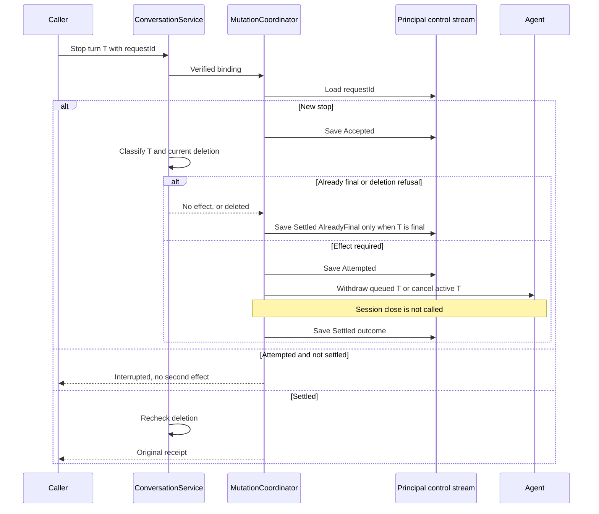

# Durable command creation

Issue: [#268](https://github.com/nessalabs/nessa-agent/issues/268).
Owner: SDK command coordinator; host conversation service owns target access,
deleted status and configuration. Creation, queued submit and exact-turn Stop
share one principal control stream. The phone client outbox remains [#269](https://github.com/nessalabs/nessa-agent/issues/269).

The host supplies an already verified `ActionContext`, target session identity,
and SHA-256 fingerprint of its canonical creation input. The principal's control
stream retains those non-content facts and the original origin. Raw requested
configuration is passed to the existing conversation creation owner, which stores
its selected configuration under the existing target deletion policy. The control
stream does not retain that configuration or prompt text.

`Accepted` is known not to have authorized initialization. `Attempted` is written
before calling the actual conversation creation path. That path may fail before a
provider opens; the control owner conservatively records the attempt rather than
claiming that an error proves no effect. `Ready` requires the initializer's success
and a durable terminal write. The current provider has no lookup by initialization
attempt. A restored `Attempted` therefore returns `Interrupted` with the original
binding, without opening a provider to discover what happened. A future provider
reconciliation capability must name that original attempt before changing this
behavior. Read-only lookup reports `Accepted`, `Attempted`, or `Ready` evidence;
`Attempted` means the outcome is unconfirmed. Lookup neither creates a control
stream nor writes progress.

| Row | Saved state / ordering | Result and effects | Regression fixture |
| --- | --- | --- | --- |
| C1 | New verified request | Bind principal/request, operation, target, origin and fixed fingerprint; commit `Accepted`, then `Attempted`, prepare the original live conversation, join its original provider attachment and publication, then commit `Ready` | `creation_commits_the_original_attempt_before_provider_open`, `creation_waits_for_original_attachment_before_saving_ready` |
| C2 | Exact retry after `Ready`, including restart / lost reply | Return the original receipt after current host target check; no provider open | `a_ready_creation_reopens_without_opening_the_provider_again` |
| C3 | Same principal/request with different target, origin or fingerprint | Typed conflict before target calls or writes | `a_creation_identity_refuses_changed_target_origin_or_bytes`, `read_only_creation_refuses_a_conflicting_original_binding` |
| C4 | Crash or caller loss after durable `Attempted`, before acknowledged `Ready` | Original target and binding remain; restart/retry returns `Interrupted`, no second initialization | `an_interrupted_creation_preserves_its_target_without_reinitialization`, `a_crash_after_provider_open_reopens_the_original_interrupted_receipt` (child publishes its complete effect marker atomically before parent kill) |
| C5 | `Accepted` saved but no `Attempted` | Exact explicit retry may make the first attempt; read-only lookup performs no writes | `an_accepted_creation_can_make_its_first_attempt_after_reopen` |
| C6 | Deleted target on new, accepted, attempted, ready or read-only lookup, including after shutdown and reopen of a finished creation | Current host deletion refusal before initialization or returned readiness; control history remains non-content | `deletion_refuses_each_creation_state_and_read_only_lookup`, `deletion_refuses_finished_creation_lookup_and_retry_after_reopen` |
| C7 | Caller stops waiting while initialization runs | One supervised operation retains its original principal lease and initializer; duplicate request is Busy until completion, then returns the same receipt | `caller_loss_keeps_the_original_creation_owner_until_completion`, `direct_sdk_caller_loss_retains_the_original_initializer_and_lease` |
| C8 | Commit acknowledgement is uncertain | No initialization without acknowledged `Attempted`; exact event retry/replay establishes the retained fact, without an alternate ID | `an_uncertain_creation_commit_cannot_authorize_initialization` |
| C9 | Target deleted while initialization or terminal save runs | Check current target again before returning the receipt; do not erase the original attempted/ready history | `deletion_during_initialization_refuses_the_returned_receipt` |
| C12 | A second creation request names an already-owned target | Existing creation owner reopens it: no second provider open, original creator retained, and no second creation receipt. A stored receipt would skip the attach a later restart needs | `a_second_creation_request_cannot_reinitialize_the_original_target`, `a_new_request_reopens_an_owned_conversation_and_attaches_after_restart` |
| C13 | Retirement begins while creation is initializing or saving its terminal | Existing host admission guard spans the complete supervised command, including caller loss; the actual admission writer is excluded while the original terminal save is held, and retirement joins it before storage shutdown | `retirement_joins_the_original_creation_receipt_owner` |
| C14 | Sixteen principal control owners already hold their original leases | New owner receives typed Busy without a queue; releasing one permits a new owner | `creation_owner_capacity_releases_only_with_the_original_lease` |
| C15 | Ready control receipt survives but current target metadata is absent | Host reports NotFound, rather than returning saved readiness as current target existence | `a_ready_receipt_does_not_invent_missing_target_metadata` |
| C16 | Supervised command or control I/O task panics or is unexpectedly cancelled, including before/after Accepted, Attempted and Ready saves | Preserve a typed task fault, separately from backend refusal; retain saved original progress and original provider ownership without replaying an attempted effect | `a_panicked_creation_task_keeps_original_progress_and_a_typed_fault`, `a_panicked_creation_save_preserves_original_phase_and_provider_ownership` |
| C17 | Preparation publishes a live conversation before its asynchronous provider attachment finishes; an ordinary join waiter or lost caller competes with the creation waiter, or existing close cancels authorization before attachment | Original attachment owner retains its typed completion for every waiter; `Ready` requires successful attachment/publication, and a failure retains `Attempted` | `creation_waits_for_original_attachment_before_saving_ready`, `an_interrupted_creation_preserves_its_target_without_reinitialization`, `competing_attachment_waiters_share_original_completion_and_fault`, `dropping_an_attachment_join_waiter_keeps_the_original_running_owner`, `caller_loss_keeps_the_original_creation_owner_until_completion`, `close_before_attachment_keeps_creation_attempted_after_original_task_completion` |
| C10 | Malformed, skipped or contradictory restored control events, including foreign principal, altered binding and forged event identity | Typed corruption or principal identity mismatch, no target effect or repaired history | `creation_replay_refuses_impossible_history`, `creation_save_refuses_another_principal_or_original_binding`, `creation_replay_refuses_foreign_or_forged_control_evidence`, `creation_codec_bounds_fields_and_preserves_exact_non_content_identity` |
| C11 | Principal's finite receipt capacity reached | Existing receipts still readable; refuse a new binding before append | `creation_capacity_preserves_existing_receipts` |

Both command and target streams use the same `RecordStorage` runtime; there is no
cross-stream transaction. Principal control streams use the common command namespace, not one stream per
operation. Their IDs contain `:`, which the
SDK `SessionId` type cannot hold, so conversation stream identities cannot alias
control streams. At most sixteen principal control owners hold leases at once; existing storage
lease accounting owns that limit. A principal's original exclusive lease serializes creation and
survives caller loss. The process-local lease shares the existing storage owner;
the runtime's SQLite lock supplies cross-process exclusion. Creation records are
small atomic events rather than the conversation's potentially oversized semantic
facts. Replay pages accommodate the shared runtime's published
`MAX_STORED_RECORD_BYTES` event envelope, even though this schema's records are
smaller, and retain at most 4,096 receipt bindings per principal. Full retained
control-history scan cost is separate from page bounds.
The first implementation does not garbage-collect those bindings.

## Shared request identity

One principal control stream (`nessa:commands:{sha256(principal)}`) holds every
mutation. `requestId` is unique for that principal across creation, submit and
Stop. A second operation, target, turn, origin or fingerprint under the same
request is a typed conflict before any effect. Read-only lookup opens the stream
only when it already exists, writes nothing, and still checks current deletion
before returning a receipt.

Submit and Stop use schema `nessa.command`. Creation keeps schema `nessa.creation`.
Replay selects the family from the schema id. Canonical re-encoding owns event
identity, schema version and payload equality.

| Row | Saved state / ordering | Result and effects | Regression fixture |
| --- | --- | --- | --- |
| M1 | New submit | Bind principal/request, operation, target, turn and fingerprint; commit `Accepted`, then `Attempted`, enqueue once, then `Settled(Dispatched)` | `submit_commits_the_attempt_before_enqueue` |
| M2 | Exact submit retry after `Settled`, including restart | Return the original receipt; no second enqueue | `a_settled_submit_reopens_without_enqueueing_again` |
| M3 | Same request with different bytes, target, turn, origin, or a creation receipt | Typed conflict before enqueue | `a_submit_identity_conflicts_with_changed_bytes_or_a_creation_request` |
| M4 | Crash after durable submit `Attempted` | Restart returns `Interrupted`; no second enqueue | `an_interrupted_submit_does_not_enqueue_again` |
| M5 | Deleted target on submit or read-only lookup, including after restart | Deletion refusal; control history remains | `deletion_refuses_submit_lookup_after_reopen` |

## Exact-turn Stop

Stop names the captured turn. It does not close the attachment and does not call
session cleanup. The host classifies the turn before authorizing an effect.
`AlreadyFinal` is saved from `Accepted` with no `Attempted`, because nothing is
sent. A queued turn is withdrawn. An active turn is cancelled only when that
same turn is active and the provider can cancel a turn without closing the
session. `Unsupported` with a usable session means nothing was sent and is
refused before `Attempted`, so a later retry is not permanently interrupted.
`Attempted` is durable before withdraw or cancel. A restored `Attempted` returns
`Interrupted` and does not send another cancel or withdraw. The receipt stores
the verified actor (principal, surface, request) and the stop cause is the
settled outcome.

| Row | Saved state / ordering | Result and effects | Regression fixture |
| --- | --- | --- | --- |
| S1 | Stop names a queued turn | `Accepted`, `Attempted`, withdraw that turn, `Settled(Withdrawn)`; attachment stays open | `stop_withdraws_only_the_named_queued_turn` |
| S2 | Stop names the active turn | `Attempted` is durable before `cancel_turn`; `Settled(Cancelled)`; `close` is not called | `stop_cancels_the_active_turn_without_closing_the_attachment` |
| S3 | Exact retry after `Settled`, including restart | Original receipt; no second cancel | `a_settled_stop_reopens_without_cancelling_again` |
| S4 | Same request with a different turn, target, origin or fingerprint, or a creation request | Typed conflict; no cancel | `a_stop_identity_conflicts_before_any_effect` |
| S5 | Crash or restart after `Attempted` | `Interrupted`; no second cancel | `an_interrupted_stop_does_not_cancel_again` |
| S6 | Turn already finished | `Settled(AlreadyFinal)` from `Accepted`; no cancel | `stop_of_a_finished_turn_sends_nothing` |
| S7 | Provider cannot cancel a turn and the turn is active | Refusal before `Attempted`; nothing sent | `stop_refuses_an_unsupported_active_turn_before_attempting` |
| S8 | Deleted target on finished stop, exact retry and read-only lookup, including after restart | Deletion refusal before a returned receipt | `deletion_refuses_stop_lookup_and_retry_after_reopen` |
| S9 | Read-only lookup | No stream creation, no append, no cancel | `read_only_stop_lookup_writes_nothing` |

The existing host admission guard spans the whole supervised creation command,
including its final receipt commit. Initialization consumes the private already-
admitted creation helper; it does not reacquire the fair admission lock while a
retirement writer is waiting. There is no second shutdown ledger.

Ordinary creation prepares and publishes a live conversation while the existing
attachment owner runs asynchronously. Command initialization receives that exact
live value and joins its attachment before publishing `Ready`. The attachment
owner retains either its original running handle or its completed typed result;
joining it does not replace it with absence. Concurrent waiters serialize on the
same owner, and dropping a waiter leaves the running handle for the next waiter.
Ordinary cleanup still confirms SDK close and joins this owner, retaining and
logging an unexpected host task fault rather than mistaking it for readiness.
