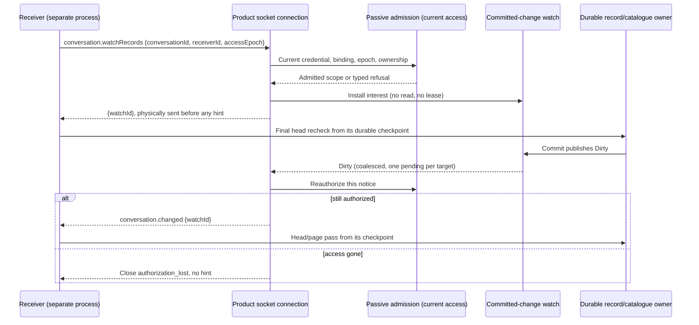

# Committed change watches — issue 298, producer slice

Status: contract accepted for the producer slice on 2026-10-01; implementation and validation are in progress. Baseline merged PR #354 is `c2f3b0ec3faf7b6ecd7020d63c640b86685e4126`. [Issue #298](https://github.com/nessalabs/nessa-agent/issues/298) remains open; wire delivery is the [298B section](#298b-authorized-live-hints-over-the-product-socket) below. [Semantic record writer](semantic-record-writer.md) owns framing; [conversation catalogue](conversation-catalogue.md) owns visible metadata revisions. Canonical standards, architecture, structure and typed DI remain the rule owners.

## Exact responsibility

298A publishes payloadless, coalesced notices from actual local durable mutations. It neither authorizes a receiver nor allocates a passive read, advances D/A, carries a cursor/head, repairs a stream, or starts an Agent/provider. A receiver must register before its final authorized head recheck, then use the existing head/page/fold/checkpoint owners. A notice lost during a commit failure, process exit or change through another adapter/process is recovered by explicit recheck/fallback. This producer is process-local; no cross-process publication claim.

The SDK record target is the stable `SessionId`, not a particular stream incarnation. Reset must wake the old reader so its next current-identity read observes replacement. The catalogue target is exactly `(OrganizationId, PrincipalId)`; the current incarnation/revision remains exclusively in `ConversationCatalogue` reads. Neither registration itself nor the key proves authority. A gateway registers only after current authority and validates current authority again at delivery.

## Accepted API and implementation shape

SDK application session storage owns documented value/result types for a payloadless **non-cloneable** registration handle (`CommittedChangeWatch`) and typed registration refusal (`ChangeWatchError::{Capacity, Closed}`). The handle exposes `async changed(&mut self) -> ChangeWatchState`, where state is `Dirty`, `Closed`, or `NotificationFailed`; dropping a pending wait only drops interest in that wait and preserves the handle/dirty bit. Dropping the handle removes the actual registration synchronously. No public method accepts a cursor, payload, authority flag, sequence number or mutation requestId.

`RecordStorage::watch_committed(&self, id: &SessionId) -> Result<CommittedChangeWatch, ChangeWatchError>` is synchronous and does not initialize SQLite, look up identity, take a writer lease or start a worker. The owning application has to perform the current identity recheck after this call. Registration is possible for an absent stream; subsequent creation/save wakes it. Registration refusal is an ordinary result, never an unbounded queue of waiters.

Server application gains a distinct `WatchCatalogue` port with `watch(organization, owner) -> Result<CatalogueChangeWatch, CatalogueWatchError>`. `LocalConversationStore` implements it. Catalogue state/handle have Dirty/Closed/NotificationFailed semantics owned by conversation application. Catalogue registration refuses only `Capacity`: a callable store still owns its registry, and closure occurs on final actual registry-owner drop. SDK registration also refuses `Closed` because its existing shutdown actively retires admission. Keep `ConversationCatalogue` unchanged: a read-only query port need not inherit subscription or shutdown requirements. Composition consumes the two ports directly later in 298B; no socket change in this slice.

Infrastructure registries retain only registrations, target IDs and a per-registration dirty flag plus wake primitive. One registry mutex linearizes registration participation, removal and admission closure; publication captures at most the producer limit of matching signal references under that lock and wakes them after release. Per-signal dirty/closed predicates are also unlocked before notification; the waiter creates `Notify::notified` before checking dirty/closed. Tokio retains intervening `notify_waiters` calls from that creation and `notify_one` stores a permit for the non-cloneable handle’s single waiter; the deterministic close-between-check-and-await test owns this ordering. Publication does not await receiver work, allocate a record body, or lock any remote socket. Tokio notification may invoke executor wakers synchronously, after these internal locks are released. Caught callback unwinds become terminal advisory `NotificationFailed` for that registration; the source outcome and committed bookkeeping remain owned by persistence. This does not bound arbitrary blocking callbacks or promise recovery from process abort or a panic-payload destructor that itself unwinds. The registry owns entries; handles have a weak route back to registry plus their bounded notification state. A detached wait cannot retain a registration after handle drop. Do not implement this as EventRuntime::subscribe: that subscribes to `Arc<Record>` and has different resources/lifecycle.

**Capacity accounting:** each actual producer registry must be bounded even before gateway use. A local 64-registration ceiling on each record/catalogue registry is a finite producer bound, while the accepted gateway policy independently charges 64 total actual watch owners across both target kinds. These are different bounds; this proposal does not claim 128 possible local registrations satisfy the gateway's 64 total. Exact duplicate refusal belongs to connection registration policy; multiple distinct connections may legitimately watch the same source target and each charge a slot.

## Actual publication hooks

| Source owner | Actual hook | Publication meaning |
|---|---|---|
| SDK retained `record.rs::RecordLease::save_changes` task and `record_writer.rs::RecordWriter::accept` | After newly verified outer SaveComplete installs the committed candidate, next binding, receipt and physical cursor | #292 assembly changes the semantic publication boundary to the whole save. Unit seals/Abort stay private and never notify. Lost-ack reconciliation reaches the same completion owner; completed exact retry adds no new notice or append. The canonical O11 row in semantic-record-writer owns that order. |
| SDK `record.rs::LeaseState::reconcile_reset` | After `change_lifecycle` returns its replacement, before replay/cleanup can fail and before injected lost-reply branch | The actual reset happened; old target is dirty even if subsequent replay or cleanup fails. Receipt recovery can notify again. A new erasure of an empty stream still replaces its incarnation through Reset and publishes through this same hook; a retained erasure retry finishes its original Reset. Canonical O10 and `empty_erase_invalidates_unpolled_original_save_before_new_work` cover that binding/notice relationship. |
| SDK creation/open | Creation alone has no published save; the first successful Opened unit publishes through its outer completion | No speculative creation notice from `open_inner` before its outcome is known. |
| Server `store.rs::ConversationRepository::create` | After successful immediate transaction commit for Created | Publish exact owner; existing creation early return has no changed value. |
| `finish_mode_change` | After successful commit iff it allocated `next_revision` for an applied visible mode | Pending/request bookkeeping does not change catalogue head and does not publish. |
| `record_deletion` | After successful commit on first tombstone/revision | Fence is authoritative before downstream cleanup. Repeated cleanup-only tombstone updates do not invent another visible catalogue change. |
| `ConversationSummaries::{record, erase}` | After successful commit if `next_revision` was allocated | Publish on summary replacement/archive and visible summary removal; no-op or already-deleted cleanup does not advance head or publish. |

Pass the record publisher into `LeaseInner`/writer explicitly. It remains retained by the existing spawned task through physical save/reset completion; the current reservation behavior stays intact. The original 298A producer did not change framing or codec. Its #292 source assembly consumes the current semantic save contract; this is dependency assembly, with combined gates/review pending. Catalogue publisher is cloned into each actual `spawn_blocking` closure and publication runs immediately after commit in that closure, so cancellation of the async receipt cannot bypass it. Never publish in `next_revision` itself: that runs before commit and transaction failure must not produce a hint.

## State and order table

| State/input | Next state/result | Owner evidence |
|---|---|---|
| Open registry, available slot; register | Clean live handle | Registry entry installed before return; counts actual handle. |
| Capacity reached | Capacity refusal | No entry, worker, task or pending allocation. |
| Commit before registration | Clean handle after registration | Caller’s mandatory post-registration head recheck catches earlier commit. |
| Commit during or after final head recheck | Dirty; one eventual wake | Registry registration is already present; no check-then-subscribe gap. |
| Many commits while dirty | Still one Dirty | No count/body queue; writer never waits for subscriber. |
| Wait observes Dirty | Clear dirty, return Dirty | Later commit leaves a new dirty bit, even before caller starts another wait. |
| Notification waker unwinds after a committed publication | NotificationFailed on that registration; source durable result remains intact | Catch only the synchronous notification call; retain failed registration until drop and continue other registrations. |
| A later failure/closure races an installed terminal watch result | First installed terminal result remains | Closed and NotificationFailed are distinct; later source close does not erase a failed notice, and a close wake failure does not replace already installed Closed. |
| Wait future cancelled | Dirty unchanged unless already consumed | A cancelled pending wait does not destroy registration or release its slot. |
| Handle dropped | Entry removed and capacity released | Synchronous structural cleanup; final guard proof checks weak notification state no longer upgrades after all owners drop. |
| SDK admission close while an actual source worker is held, then shutdown waiter cancellation | Existing handles return Closed and new registration refuses Closed while physical shutdown remains Pending; cancelling that waiter preserves the original physical owner/completion until worker release and join | `record_source::tests::storage_shutdown_waits_for_source_join_after_caller_cancellation` handshakes actual worker admission, polls shutdown and watch predicates, cancels the wait, then observes that same retained completion only after release. No fake source deletion/reset fact. |
| Final catalogue registry-owner drop | Existing handles return Closed | Handles retain a weak registry route; there is no still-callable closed catalogue registration state. |
| Source task still running after close | Physical task and writer reservation remain | Watch closure cannot release existing record/save/read leases. Its late publish becomes bounded no-op. |

SDK storage shutdown must close watches at first admission closure, independent of slow physical join; this requires a small bridge in `record.rs::shutdown` immediately before `owner.close` establishes retirement, without changing `StorageOwner` lease semantics. LocalConversationStore has no explicit shutdown port today. Registry last-owner drop closes handles; its actual blocking mutation closure retains the registry until completion. Do not invent host-wide retirement semantics here. Final store/registry owner drop closes catalogue watches for this slice; connection retirement remains the consuming gateway owner’s responsibility.

## Adversarial finish lines and ownership

Tests must force the exact commit/register/recheck orders rather than sleeps: register-first/read-before-commit; commit-before-register then recheck; dirty consumed then immediate later commit; cancellation while waiting; writer receipt cancellation before actual commit; durable rollback leaves clean; reset persists but lost reply/replay fails still dirty; catalogue tombstone commits then cleanup fails; dozens of commits consume one notice; cross-owner isolation; capacity retained by pending waits and released only by handle drop; closed wait wakes without source work; last registry/handle guard gone with weak evidence. Existing SDK write/reset and server transaction fixtures are owning tests; avoid mocking a callback that never reaches real durable owner.

Owning paths: SDK application session storage watch module/reexports; SDK infrastructure session_storage/{record.rs,record_writer.rs,new record_changes.rs,mod.rs} and owning tests/API docs; server conversation application/{new catalogue_watch.rs,mod.rs}; server conversation infrastructure/{store.rs,new catalogue_changes.rs,module map} and owning tests; codebase module maps and relevant source design docs only. No product/socket, state/schema, generated wire, native transport or example Session changes. Record writer hook overlap with 292 and metadata commit hook overlap with 268/271/272 must be sequenced after this small publication patch; shared API must be reviewed before those lanes copy it. Gateway ack-before-activation, two targets, 64 shared gateway owners, pending+inflight delivery charging and absolute deadlines remain 298B obligations, not claimed by 298A.

Accepted decisions: separate producer-local ceilings of 64, distinct SDK and server-local handles/ports, catalogue final-owner closure without a new host shutdown port, SDK admission closure before physical shutdown join, and durable semantic publication notifications. #292 assembly uses final save completion as that publication owner. Interrupted physical tails and cross-process changes require fallback. This slice does not close the whole issue or claim a prevention rate.

## 298B: authorized live hints over the product socket

Status: implemented on branch `claude/298-live-hints`, unreviewed, unmerged. This slice delivers the producer's notices to an authenticated product connection and proves replay-to-live catch-up across separate gateway and receiver processes with the existing example client. It does not make the example client watch on its own (it is still explicitly driven, one pass per command), add a phone cache or UI (#261), schedule weak links (#262), or pair devices (#263–#265). The producer sections above keep owning commit notifications; this slice changes no storage, writer or registry code. Issue #298 and #277 stay open.

### Wire contract

Three requests and two events on the existing authenticated connection, all owned by `protocol/product/v1.json` and its manifest and generated into Rust and TypeScript:

| Product method/event | Shape and meaning |
|---|---|
| `conversation.watchRecords` | `conversationId`, `receiverId`, `accessEpoch` (the passive-read selector); result `{watchId}` |
| `conversation.watchCatalogue` | `receiverId`, `accessEpoch`; the admitted binding's organization and owner select the catalogue; result `{watchId}` |
| `conversation.unwatch` | `{watchId}`; idempotent for any identity this connection minted; no removal event |
| `conversation.changed` | `{watchId}` only: no head, cursor, incarnation, content, permission or freshness |
| `conversation.watchEnded` | `{watchId, reason: closed \| notification_failed}`: the producer ended; it proves neither freshness nor lost permission |

`x-changeWatchLimits` publishes 64 watch owners across the gateway and 2 targets per connection; the generator refuses invalid limits before writing anything and emits `MAX_GLOBAL_CHANGE_WATCHES`, `MAX_CONNECTION_CHANGE_WATCHES`, `MAX_CHANGE_WATCH_ID_BYTES` and the TypeScript equivalents (G1). A watch identity is `<connection namespace UUID>-<counter>`: the namespace comes from the injected `WatchNamespaces` port (`UuidWatchNamespaces` in production), the counter advances only when a producer registration is actually installed and never wraps. An identity is meaningless on any other connection, including a reconnect of the same receiver.

### Owners

- **Authority.** `WatchSelector::admit` (`product/change_watch/registration.rs`) is the one place a watch asks for current access. It goes through the existing `AdmitPassiveRead::{execute, catalogue}` and browser-session presence, and both registration and every notice call it. It never reads a head, takes a read lease, or uses the four passive-read permits.
- **Producers.** `WatchRecords` (new, `conversation/application/change_watch.rs`) injects `RecordStorage::watch_committed` through `NessaRecordWatches`, which keeps the same storage the readers and writers use. `WatchCatalogue` comes from the producer slice. `composition/local_auth.rs` composes both.
- **Capacity.** `WatchOwners` (`product/change_watch/owner.rs`) is a gateway-wide semaphore of 64, separate from producer-local ceilings and passive-read capacity. A watch keeps its permit while its authority task, source wait, queued acknowledgement or in-flight notice is still alive, so unwatching and re-registering quickly can't get around the bound.
- **Connection state.** `ConnectionWatches` (`connection.rs`) holds at most one record and one catalogue target. It refuses duplicates and a second target of the same kind, runs at most one authority task per target in its own task, and drops interest when the connection closes.
- **Delivery.** `WatchDeliveries` (`delivery.rs`) holds one pending and one in-flight position per target. The existing single physical writer in `product/socket.rs` takes notices from it. That writer also completes the acknowledgement, so a watch only starts sending hints after its success response has actually been written.
- **Shutdown.** `ProductRouteState::{close_watch_admission, drain_watches}` closes the semaphore before host cleanup. The drain then joins the original tasks, and the first task fault (panic or unexpected cancellation, recorded by `WatchTaskGuard` before its permit is released) goes into the existing `ShutdownReport` with the reader outcomes, before conversation, storage and MCP cleanup (`composition/root.rs`, `core/shutdown.rs`).

Hint size is bounded per connection: two targets, each with one pending and one in-flight notice, and each notice is a fixed envelope plus at most `MAX_CHANGE_WATCH_ID_BYTES`. That bounds encoded hint bytes, not TLS or allocator memory. Each notice records its absolute deadline (the generated 30 000 ms delivery timeout) before its first authorization await. Authorization, queueing and the physical send all count against that one deadline. The writer watches the earliest watch deadline even while it is sending other frames, and abandons the socket when a deadline passes.

### Delivery state and order table

One row is a state and the event or ordering that reaches it. Every row names the tests written from it. `watches::` is `crates/nessa-server/tests/product/socket/watches.rs`, `writer::` is `…/socket/writer.rs`, `delivery::`/`owner::`/`registration::` are the unit tests in `product/change_watch/`, `host::` is `tests/composition/watch_shutdown.rs`, and `online::` is the separate-process test in `tests/composition/read_only_online.rs`.

| # | State / event / ordering | Result | Tests |
|---|---|---|---|
| R1 | No target; valid watch request | Reserve target and global permit, run current admission, install the producer, queue the acknowledgement. No source read, Agent or writer lease | `watches::real_commit_waits_for_physical_ack_then_emits_only_opaque_watch_identity` |
| R2 | Wrong receiver, owner, epoch or target; malformed shape; authority unavailable | Typed refusal before the producer is installed | `watches::closed_watch_shapes_and_existing_scope_admission_refuse_before_source_installation` |
| R3 | Same target already pending or live; another target of the same kind while the first one's authority task is still held | `watch_duplicate` / `watch_capacity`; the original identity and permit stay; no second producer or task | `watches::watch_admission_worker_loss_retains_original_owner_while_other_read_and_control_reap`, `watches::duplicate_and_foreign_removal_refuse_without_displacing_actual_interests` |
| R4 | 64 owners held across sockets, both target kinds | `watch_capacity`, no queued waiter; admitted again after the original connection drops | `watches::actual_shared_gateway_capacity_counts_both_source_kinds_until_connection_drop` |
| R5 | Counter frontier near `u64::MAX` with pending installs | Capacity for every pending install is reserved before producer work; a failed install doesn't advance the frontier | `registration::frontier_recognizes_exact_removed_ids_without_foreign_or_unminted_ids` |
| O1 | **Registration races a commit:** commit before registration (L4: made while the receiver was disconnected), or between the acknowledgement and the final recheck (L2) | The receiver's final recheck from its checkpoint finds it; in the second order the hint for it also arrives, because registration came first | `online::online_replay_then_live_hints_converge_with_a_fresh_replay` (L2, L4) |
| O2 | **Registration races a commit:** commit after install while the acknowledgement is stalled in the writer | Dirty is kept; no hint until the acknowledgement has physically been sent, then exactly one | `watches::real_commit_waits_for_physical_ack_then_emits_only_opaque_watch_identity`, `delivery::dirty_cannot_activate_before_ack_and_terminal_keeps_original_pending_deadline` |
| O3 | Live, clean; source Dirty | Deadline recorded, current admission, one `conversation.changed {watchId}` | `watches::real_commit_waits_for_physical_ack_then_emits_only_opaque_watch_identity`, `online::…` (L3) |
| B1 | **Slow consumer:** many commits while one notice is pending | One pending notice, original deadline unchanged | `delivery::coalesced_notices_keep_the_first_pending_deadline_as_time_passes`, `delivery::in_flight_and_one_coalesced_pending_retain_the_same_original_charge` |
| B2 | **Slow consumer:** commit while a notice is in flight | One in flight plus one pending, both charged to the original permit; never a third | `delivery::in_flight_and_one_coalesced_pending_retain_the_same_original_charge`, `watches::actual_source_terminal_during_immutable_notice_send_uses_only_one_subsequent_event` |
| B3 | **Slow consumer:** notice deadline passes while queued or while another frame is sending | Socket abandoned at the original deadline; nothing sent after it | `writer::original_pending_watch_deadline_expires_during_another_physical_frame` |
| B4 | **Slow consumer:** controls keep arriving | The watch deadline still fires; controls can't starve it | `writer::pending_watch_deadline_cannot_be_starved_by_continuously_ready_controls` |
| B5 | Notice authority hangs | The pending deadline still expires; reads, Stop, refresh and reaping keep running; the worker keeps its permit until it joins | `watches::notice_authority_deadline_abandons_socket_but_retains_actual_worker_until_join`, `delivery::selection_requires_current_authority_and_the_original_deadline` |
| A1 | **Access revoked mid-watch:** a notice admitted before revocation | That notice may finish; the next notice's admission denies and closes the connection as `authorization_lost`; no further hints | `watches::already_admitted_notice_can_finish_after_read_grant_revocation_but_next_notice_denies` |
| A2 | **Access revoked mid-watch**, separate processes | The commit after revocation closes the connection with 4004 and no hint; the receiver's next read is `unauthorized` | `online::…` (L6) |
| T1 | Source Closed / NotificationFailed while Dirty is pending | One `watchEnded` replaces the unsent Dirty and keeps its deadline; the target retires once it's sent | `watches::actual_actor_replaces_unsent_dirty_after_observing_source_terminal_before_authority_release`, `watches::actual_durable_catalogue_notification_failure_remains_terminal_in_wire_payload` |
| T2 | Source terminal while a Dirty is already being sent | That Dirty finishes; exactly one `watchEnded` follows | `watches::actual_source_terminal_during_immutable_notice_send_uses_only_one_subsequent_event` |
| T3 | Producer admission closes (SDK storage shutdown) | `watchEnded {closed}`, with no claim about freshness or authority | `watches::actual_source_admission_close_emits_terminal_without_claiming_current_or_authority_loss` |
| U1 | Unwatch while clean, pending, in flight or terminal | Interest cancelled and unsent notices dropped; idempotent acknowledgement with no source or receiver read; target and permit kept until the task, frame and wait finish; then a replacement is admitted with a new identity | `watches::repeat_unwatch_is_cleanup_without_source_or_receiver_read_and_no_redundant_event`, `watches::unwatch_ack_is_interest_only_and_replacement_waits_for_actual_inflight_retirement`, `watches::unwatch_ack_retains_original_authority_target_until_actual_join` |
| U2 | Unknown identity, or one minted by another connection | `invalid_watch`; live targets untouched | `watches::duplicate_and_foreign_removal_refuse_without_displacing_actual_interests`, `online::…` (L4) |
| S1 | **Socket close:** disconnect or acknowledgement failure while an authority task is running | Interest ends; the task and its permit stay until the adapter's await returns; a late install is discarded | `watches::watch_admission_worker_loss_retains_original_owner_while_other_read_and_control_reap`, `watches::lost_socket_observer_cannot_erase_fault_after_original_authority_worker_join` |
| S2 | **Socket close and reconnect** with commits in between (lost hint) | That hint is lost, and nothing pretends otherwise. The new connection gets a new namespace, the old identity is foreign, and the receiver's recheck from its durable checkpoint recovers the missed commit | `online::…` (L4) |
| S3 | Direct writer teardown after queued frames | The connection's delivery interest closes before the response channels; queued responses and lease release still complete | `socket::tests` writer fixtures (`deliveries.close()` before teardown) |
| F1 | Authority task panics or is unexpectedly cancelled, observer gone | `WatchTaskGuard` records the first cause before its permit is released; drain reports it; no hint is authorized | `owner::fault_survives_observer_loss_and_is_reported_before_last_permit_release`, `owner::unpolled_task_cancellation_is_a_distinct_fault_and_first_cause_wins`, `owner::closed_interest_and_cancelled_drain_do_not_release_original_task_owner`, `owner::completed_task_and_ordinary_interest_closure_do_not_report_a_fault` |
| H1 | **Gateway shutdown** with watch authority and reader work held | Watch admission closes first; the watch and reader drains are polled together; conversation, storage and MCP cleanup start only after both return; connections close `temporary_unavailable` | `host::ordinary_host_closes_admission_before_cleanup_and_reaps_both_original_release_orders`, `watches::closing_watch_admission_closes_live_connections_and_refuses_new_watches` |
| H2 | Shutdown after a watch task fault, with both observers gone | The first fault is kept in the same `ShutdownReport` alongside reader faults | `host::ordinary_host_retains_watch_and_reader_faults_after_loss_of_both_observers` |
| H3 | One drain finishes while the other is still held, in either order | The finished outcome is published first; reader timeouts stay the reader's | `host::completed_reader_drain_is_not_relabelled_as_timeout_while_original_watch_is_held` |
| H4 | Cleanup ends during MCP, or earlier, after a watch fault came back | `ServersPending`/`ServersUnreported`, `DrainsUnreported` and `ConversationsUnreported` keep that fault; it prevents `Confirmed` | `host::ended_mcp_cleanup_preserves_returned_original_watch_fault_and_reader_outcomes`, `host::ended_original_cleanup_retains_returned_watch_fault_at_each_earlier_stage` |
| L1 | Separate processes: seeded receiver replays to a durable checkpoint | Complete pass, facts recorded | `online::…` (L1) |
| L5 | Replay, then live passes, compared with a fresh full replay | The same folded `show` view and progress | `online::…` (L5) |
| L7 | Gateway asleep (process gone) | The receiver's check fails explicitly; its saved view is still readable and unchanged | `online::…` (L7) |
| C1 | Client: malformed binding or identity on any watch call | Refused before the existing dispatcher sends | `change-watch-api.test.ts` (*refuses malformed receiver/epoch*, *refuses invalid binding on either target kind*, *refuses malformed unwatch identity*) |
| C2 | Client: an event carrying progress or authority, an inherited `watchId`, or a foreign echoed identity | Rejected by the closed generated shape and own-property reads | `change-watch-validate.test.ts` (all), `change-watch-api.test.ts` (*rejects inherited identity…*, *does not let a foreign echoed ID confirm removal*) |
| C3 | Client: public `NessaClient` watch calls and events | They go through the existing managed session and event dispatcher; a closed session refuses with no replayed registration | `nessa-client.test.ts` (*routes public watch calls and opaque events through the existing session*), `change-watch-api.test.ts` (*preserves a refusal without retry or registration resurrection*) |
| G1 | Schema watch limits or identity bound change, or an invalid limit arrives | One schema-owned contract reaches Rust and TypeScript; an invalid limit refuses before any artifact is written | `protocol-generation.test.mjs` (*watch policy and identity publish…*, *invalid watch …*) |

What the receiver does after a hint — re-read from its checkpoint — is the existing example client's pass. `online::online_replay_then_live_hints_converge_with_a_fresh_replay` drives that pass in a separate process after each hint it receives. Because the producer is process-local, the gateway commits in its own process (`live` mode in `tests/composition/read_only_online/fixtures/gateway.rs`). A commit made through another process or adapter produces no hint, which is why the receiver's recheck from its checkpoint is the recovery path.

### Remaining for #298 and #277

- The example client watching continuously: holding a connection, scheduling passes from hints, keeping finite-pass lifetimes, and reporting stale or unavailable state while the gateway sleeps. This slice drives one pass per hint from the test.
- Two-device convergence and #277's assembled fold equality beyond the single-conversation `show` comparison here; and that a copied fact never dispatches an agent action.
- Native transport composition of the same close/drain facts (#264/#265), and hosted platform checks.
