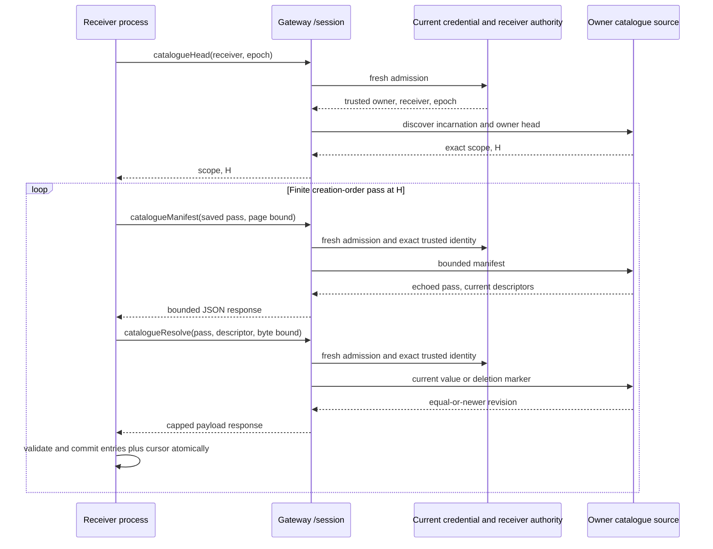

# Conversation catalogue for linked readers (#259)

The conversation metadata database owns the current catalogue. It has one durable
incarnation, and each owner has one durable head. Each conversation keeps its creation revision
and latest visible change revision. A deletion keeps the original creation key
and advances the change revision once, when the tombstone first fences it.
Changing a tombstone's erasure progress does not change the catalogue value.

The existing alpha schema is replaced as a whole. `nessa-local-database` refuses
an older file with `OpenError::Version` and leaves it untouched. An operator must
explicitly move or remove old local alpha metadata after deciding what to keep;
opening it never imports or resets ownership or deletion evidence. A new file
gets a new incarnation. This is not a silent cache reset.

The reader accepts an authenticated organization and principal from the caller's
current session. SQL narrows to that exact owner, and every returned conversation
is checked through the domain ownership rule. Scope, incarnation, and access
epoch are compared on every read. A mismatch is typed, never answered as an
empty catalogue. A receiver reset must be explicit; an absent identity is
unknown, and only a retained deletion marker says deleted.

| Ordering or event | Source result | Receiver consequence |
| --- | --- | --- |
| Create a new identity | Allocate owner head `H+1`; set both creation and change to it in the creation transaction | A pass with boundary at least `H+1` can page it. |
| Reopen an identity, including a deleted one | No new revision or replacement | Existing ownership and deletion decision stand. |
| Summary, archive, or committed mode changes | Allocate a new owner revision in the same transaction as the visible value | A later pass reads the latest value. |
| Delete races with summary | The deletion fence and revision commit together; later summary write is refused | The retained marker wins, including after restart. |
| Erasure continues after the fence | Keep the deletion revision | Retry does not make another catalogue event. |
| Pass starts at completed `C` and head `H` | Capture `H` once | Pass is finite even if writes continue. |
| Manifest page after key `K` | Select creation `<= H`, change `> C`, key `> K`, ordered by `(creation, id)`, with `LIMIT max+1` | A newer change revision may exceed `H`; it is still delivered. |
| Value changes between manifest and resolve | Resolve current value at the same key and at least the descriptor revision | Receiver commits current value or retries without advancing cursor. |
| Earlier key changes after its page | Its change revision exceeds `H` | The next pass selects it. |
| Source reply or receiver commit is lost | A retry reads current source data under the saved pass | Receiver progress, not a reply, decides continuation. |
| Owner, incarnation, or access epoch changes | Refuse with a typed mismatch | Receiver explicitly resets under current authorization; old live values are cleared and absence stays unknown. |
| An owner's head is missing or disagrees with the largest retained change revision | Refuse head, page, resolve and new creation as unavailable; retain all existing rows unchanged | A damaged counter cannot publish an empty catalogue or reuse an existing revision. Another owner remains readable. |
| Own row is unreadable | Refuse the read as unavailable | Progress does not advance. Another owner's damaged row is outside the query. |
| Sync request presents a different receiver, source, schema, incarnation, or access epoch | Reject before metadata access with `IdentityChanged` | The bound authenticated owner and epoch cannot be selected by the requester. |
| A host constructs a source for another owner under a previously used stream key | Derive the stream identity from the authenticated organization and principal and refuse mismatched construction | Separate owners cannot be cached under one scope even if a caller reuses the other scope fields. |
| Resolved live value exceeds the remaining page payload budget | Reject with `OversizedEntry` before returning payload | Cursor does not advance; a larger allowed budget or explicit handling is required. |
| Source call occupies the caller runtime's only blocking thread | Execute metadata futures on a source-owned runtime with its own blocking pool | The metadata store's `spawn_blocking` read can finish without waiting for a free caller pool slot. |
| Dedicated worker thread cannot start or its runtime cannot initialize | Build the runtime inside the worker and send an initialization result before returning a source | Construction returns typed `Unavailable` without dropping a Tokio runtime on the caller's scheduler thread. |
| Sync-engine changes a catalogue page or payload bound | Consume its published bound in both Nessa's metadata port and adapter | The source's accepted request set stays aligned with the sync coordinator's accepted request set. |

The manifest reads one short transaction per page and releases it before any
payload read. It does not use offsets or hold a snapshot across pages. Page
size and payload size consume sync-engine's exported `MAX_CATALOGUE_ENTRIES`
and `MAX_CATALOGUE_PAYLOAD_BYTES`. The source stores no per-receiver state or
history.

The metadata tests in `crates/nessa-server/tests/conversation/store.rs` cover
creation, summary, archive, deletion and mode revisions; failure rollback;
version refusal; owner isolation; damaged rows; a manifest/deletion race; and a
620-entry pass with changes from a second open store between pages. The sync
adapter tests in `catalogue_source.rs` and `catalogue_receiver.rs` cover exact
scope, payload bounds, manifest/deletion races, two independently reopened
process-local receiver files, a lost page reply, stale delayed response, and
explicit epoch reset retaining deletion evidence while live absence is unknown.

## Authenticated product transport (#297)

The implemented transport exposes `conversation.catalogueHead`,
`conversation.catalogueManifest`, and `conversation.catalogueResolve` to `/session`.
Head accepts the bound receiver and current access epoch, authorizes them first,
and then discovers the metadata incarnation. Manifest and resolve carry the exact
returned scope and a saved finite pass. Owner and gateway origin are derived from
trusted session and composition facts. The client does not supply an owner.
The public TypeScript client preserves returned scope and request evidence. A
Rust network `CatalogueSource` adapter correlates wire-only head/resolve echoes
before discarding fields absent from core return types; core validators own
manifest ordering and resolved key/revision/deletion/payload semantics.

Unsigned revisions and epochs use canonical decimal strings to preserve all u64
values across JavaScript and Rust. Payloads use base64 within the measured JSON
response ceiling shared by passive reads.

| Transport event or ordering | Owning decision | Observable result and evidence |
| --- | --- | --- |
| Numeric admission epoch and opaque sync scope epoch | Shared passive application selector encodes `epoch-{n}` once; manifest/resolve carry explicit numeric `accessEpoch` | No parsing opaque sync IDs into authority. |
| Custom head source reports another admitted receiver, epoch, owner stream or operation | Application compares source evidence against admitted selector and domain owner stream | Typed unverifiable/wrong-selector refusal before transport encoding; matching evidence remains accepted. |
| Source and application need the owner catalogue stream | Pure domain `conversation_catalogue_stream(organization, principal)` owns the length-prefixed identity hash | Physical source and application correlation consume one owner; no caller wrapper or duplicated hashing. |
| Head discovery and expected-scope page construction | One catalogue source worker/runtime factory owns both paths; discovery captures one metadata head and builds its actual scope | Head publishes that captured scope/H; later pages recheck incarnation through metadata. |
| Spawn, runtime initialization, or metadata initialization fails | Factory preserves ordinary source failure and joins every spawned worker before returning | No ready source or payload; no lost initialization handle. |
| Metadata initialization panics or ready-channel delivery/receipt is lost | Factory joins the actual spawned handle; unexpected exit remains typed WorkerPanicked | No successful readiness or fabricated drain. |
| Metadata resets after captured head but before page | Expected-scope source asks metadata for that exact incarnation | IdentityChanged before page effects; receiver must reset explicitly. |
| Source method refuses or caller/receiver disappears | Tracked non-entered outer worker owns admitted lease and explicit source drain | Drain finishes before lease is returned or dropped; generic source refusal and unexpected worker panic retain distinct meanings. |
| An operation refuses and its physical worker also panics during drain | Application error retains the operation refusal and the unexpected worker cause; shared worker shutdown retains the unexpected fault | Wire remains source-unavailable; cleanup diagnostics do not replace one known cause with the other. |
| A source clone keeps the handle after explicit drain | Worker owns queue closure and cached drain outcome | Subsequent enqueue refuses; another drain observes the same completed result. |
| Head arrives with revoked credential, wrong receiver/owner, or stale epoch | `AdmitPassiveRead::catalogue` before metadata access | Typed admission refusal; source counter stays zero. |
| Manifest or resolve presents another origin, owner stream, schema, or epoch | Compare against trusted scope after admission and before metadata access | Typed identity refusal; no descriptor or payload is read. |
| Source incarnation changes after head | Current metadata source verifies the exact requested incarnation | Typed identity refusal; receiver progress remains unchanged. |
| Injected source returns another operation, request, descriptor, or stale value | Transport codec calls the core response validator against the saved operation once | `unverifiable`; no invalid envelope is queued or committed. |
| Source is corrupt or missing | Metadata/source adapter owns availability | Typed source refusal, including on own unreadable rows; no empty success. |
| Manifest descriptor changes before resolve | Sync-engine `validate_resolved` checks current key and equal-or-newer revision | Current value or retained deletion is returned; old live payload is not fabricated. |
| Catalogue writes continue during a pass | Saved pass boundary fixes eligible creation keys | Pass finishes; changes behind the committed cursor appear in the next pass. |
| Shape-valid contradictory wire evidence reaches a receiver | Receiver core validator refuses before cache transaction | Wrong request and stale payload preserve saved pass and empty cache. |
| Reply is lost or receiver process restarts | Receiver transaction owns saved pass and cursor | Retry resumes the same pass and validates echoed request before commit. |
| Delayed live resolve arrives after a deletion was committed | Receiver catalogue transaction owns revision and deletion fence | Old response cannot resurrect the entry. |
| Receiver resets under a new authorized scope | Receiver reset owns live-value removal and retained deletion evidence | Absence is unknown; deletion requires an explicit retained marker. |
| Resolved payload exceeds caller budget | Catalogue source owns exported payload ceiling | `oversized_entry`; no truncation or cursor advancement. |
| Actual encoded envelope exceeds the shared response ceiling | Capped JSON writer owns allocation and wire bound | `response_too_large`; no oversized frame is queued. |
| Four passive workers remain physically gated, one caller disconnects, and close stops an active provider | Socket reserves separate control admission; provider confirmed close unblocks its execution future | Real `/session` close invokes provider cleanup once while all four read permits remain retained. The fixture keeps execute pending until `close_finished`, then publishes Cancelled settlement, as required by the provider contract; `socket_close_stops_active_provider_while_catalogue_workers_are_full_and_a_caller_disconnects` checks effect and release order. |
| Caller disconnects or read deadline expires while blocking source work runs | Source worker retains admitted work lease until it finishes | Detached work continues to consume capacity; reconnect cannot multiply source workers. |
| Source finishes but socket send stalls | Queued response retains work lease and absolute send deadline | Bounded timeout closes the socket and releases completed source capacity. |
| First source shutdown waiter is cancelled while workers drain | Shared worker owner retains one watch completion for all shutdown callers | A second caller waits for the same physical completion; no early success. |
| An earlier worker panics while a later worker remains gated | Shared worker drain joins every admitted handle and then returns typed failure | Later source ownership is retained until completion; panic does not skip cleanup. |
| One reader fails while the other remains gated | The existing shutdown report retains each observed result, tagged record or catalogue; both physical owners still drain | Conversation/storage cleanup waits for both; the aggregate derives from retained outcomes and preserves both failures. |
| Callback is cancelled after a reader fault or success, before the other reader returns | The same report owns known result plus unknown remaining drain | Preserve the completed reader's exact operation/cause or success; report the other drain and conversation outcome as unknown. |
| Deadline occurs before either reader, or after one observed result | The same report records elapsed deadline alongside partial outcomes | Retain owners/runtime and await both physical drains. Cancellation preserves deadline and every observed result; no invented completion. |
| Both readers return, then conversation cleanup is cancelled or fails | Report consumes complete reader evidence only at final publication | Preserve deadline and both reader causes with unknown or failed conversation cleanup; successful readers remain known successes. |

### Published request and receiver-progress owners (#39/#42)

| Input or transition | Owner asked before effects | Adapter-owned evidence/effect |
|---|---|---|
| Manifest count, generation, captured boundary or cursor contradicts the finite pass | `validate_manifest_request` | Return typed invalid request before metadata page call; schema/physical identity remains the source factory owner. |
| Resolve finite pass has invalid generation, boundary or cursor | `validate_catalogue_pass` | Return typed invalid request before metadata resolve; selected ID/creation/revision and payload budget remain source relationships. |
| Persisted progress has contradictory parent/active fields | `validate_catalogue_progress` after typed SQL reconstruction | Reject corrupt progress; paired SQL cursor columns and integer/ID parsing remain physical reconstruction decisions. |
| Begin/page/reset progress replacement | `catalogue_progress_after_begin/page/reset` | Transaction owns actual expected-progress CAS, entry presence, row writes and commit. Save and return the exact planned replacement. |
| Public page plan contradicts pass, continuation or entry coverage | `validate_catalogue_page_plan` through page progress helper | Reject before transaction effects; no locally assembled substitute plan. |
| Incoming/cached descriptor deletion or revision contradicts retained history | `validate_catalogue_revision_transition` in coherent earlier/later order | Local transaction owns cache presence, equal-revision payload agreement, immutable row reconstruction and deletion persistence. |

### Metadata page port carries the actual request

The source forwards its actual `ManifestRequest` alongside the authoritative
organization and owner selectors. Metadata derives incarnation, completed
revision, boundary, cursor and count from that request; the port has no mirrored
incarnation or window fields. Fixture requests use their actual captured database
incarnation and the published stream/schema owners with explicit receiver pass
identity. No synthetic response is constructed to query a validator.

| Input | Owner and order | Outcome |
|---|---|---|
| Invalid actual manifest count/generation/window/cursor | Metadata asks `validate_manifest_request` before scheduling SQL work | Typed `CatalogueInvalidRequest`; no metadata query. |
| Actual scope incarnation differs from current metadata database | Metadata derives the sole expected incarnation from the request and asks existing `catalogue_incarnation` inside its coherent transaction | Typed reset refusal; no owner values returned. Matching incarnation keeps the same query path. |
| Otherwise-valid cursor has a non-conversation ID or numeric value cannot fit SQL | Existing `ConversationId` construction and checked SQL integer conversion | Typed physical invalid request before SQL query. |
| Valid actual pass at captured boundary while writes continue | Metadata's org/owner query and current owner-head check remain authoritative | Same finite creation-order window, bounded count plus one lookahead; source echoes the actual request. |

### Bounded physical text acquisition (#297)

The metadata adapter selects bounded text before requesting owned UTF-8 from
SQLite. Domain constructors remain the semantic owners. Existing identifier,
model and creator-context ceilings are published by those owners; title uses
`MAX_CHARS * char::MAX.len_utf8()`, preview uses `MAX_BYTES`, incarnation uses
core `MAX_ID_BYTES`, and supported agent/mode widths derive from their name owners.

| Stored input | Physical acquisition decision | Result before source publication |
|---|---|---|
| Valid supported fields at their full ASCII/multibyte ceiling, including UTF-16 databases | SQL `typeof` and `octet_length` guard admits up to twice the UTF-8 owner ceiling | Existing constructors accept; no narrower payload policy |
| Oversized or wrong-type required text | SQL returns a bounded BLOB sentinel instead of selecting text | Existing unreadable/error path; no metadata repair, response or accepted progress |
| Nullable summary field | Preserve genuine NULL; guard non-null text | Existing summary constructor owns readability |
| Agent text longer than every published supported name | Project NULL without copying text | Preserve existing unsupported-agent `None`; shorter names still use `AgentId::parse` |
| Wrong-type agent | Bounded BLOB sentinel | Refuse malformed row; no invented unsupported agent |
| One bad row after valid rows in a page | Same shared acquisition owner | Entire page refuses; no partial manifest publication |
| Incarnation in head or page/resolve identity comparison | Same bounded text guard | Refuse malformed identity before successful capture or payload |

The factor of two admits UTF-16 storage of all valid UTF-8 inputs. A selected
UTF-16 value converts to at most three times the owner UTF-8 ceiling; valid
values then pass the existing constructors. With current publications, selected
conversation text is at most 4,260 UTF-8 bytes per row, summary text at most
2,112, and incarnation text at most 384. The maximum descriptor page includes
one lookahead row: `(MAX_CATALOGUE_ENTRIES + 1) * 4,260 = 1,094,820` selected
conversation text bytes. These are cumulative selected-text bounds, excluding
structs, allocator overhead/spare capacity, transient constructor copies, SQLite
query/cache/engine allocations and physical disk I/O. Accepted metadata is
smaller after semantic validation; the published core payload ceiling remains
the separate encoded-payload owner. The SQL guard does not bound scans or
SQLite query planning.

The page vector reserves exactly the admitted count plus one lookahead slot
before decoding, avoiding growth beyond that finite capacity. The acquisition
tests inspect actual SQL result types: oversized text becomes an empty BLOB
before any `String` read; removing the guard selects the original text and
fails the runtime test. Read queries still execute to inspect malformed data;
no response/progress or storage write is accepted, rather than claiming zero
metadata reads.

Resolve also reads a tombstone through the existing conversation reconstruction
path. Its organization/initiator use the published auth ceiling, surface/request
the creator-context ceiling, session ID the existing SDK `MAX_BYTES`, and
provider-link/erasure tags the widths of their existing finite representations.
Erasure variants are unit variants, with no diagnostic or arbitrary text payload.
Nullable session/erasure columns preserve NULL, while malformed text refuses
before payload assembly. Existing sibling/erased-state rules remain the deletion
constructor owner. This extends only the traced resolve dependency; unrelated
mode/provider write paths and whole-store row-count bounds are not claimed.

With current finite tag spellings, deletion selection adds at most 3,921
UTF-8 text bytes. Thus a deleted resolve selects at most 8,565 text bytes
(conversation, deletion, identity); a live resolve with summary selects at
most 6,756 (conversation, summary, identity). These formulas consume the
published owners and exclude the same overhead/copies listed above. Tests
preserve every supported deletion state/erasure tag, full multibyte session
identity, NULL siblings, and reject each oversized deletion text field through
the actual resolve port without changing the stored corrupt value.

### Raw incoming read evidence

Catalogue responses share the single TypeScript raw admission owner and ordering table in [authorized record reads](authorized-record-reads.md#raw-incoming-read-evidence-issue-261-correction). Scope/pass/request/descriptor evidence is admitted before object members collapse; catalogue shape/semantic owners remain unchanged.
