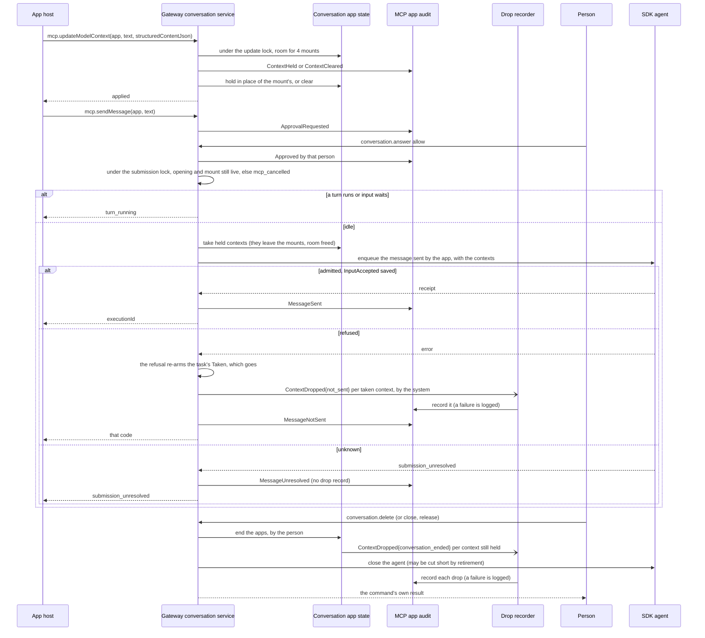

# An MCP App's calls, held to policy and audited

An MCP App ([ADR 344](../adr/todo/344-mcp-ui.md)) reaches its own server
through the gateway: `mcp.callTool` and `mcp.readResource`, on the
conversation's own session of that server
([one connection per harness session](mcp-connections.md)). Its host releases
one mount of it with `mcp.releaseApp`. It may also speak in its
conversation: write the person's next message and give the model context
(#390, "An app in its conversation" below). The wire contract is
[protocol/README.md](../../protocol/README.md#an-mcp-apps-calls); this is what
the gateway does with it (#348, part b).

## What is built

- **Policy** (`mcp_servers::domain::app_call`): pure rules over what the
  conversation's view says of the app and what its server's session listed.
- **The flow** (`conversation::application::service::app_calls`): policy,
  then a review for a destructive tool, then the call, each step audited
  before its effect is reported. Each call runs on a task of its own, holding
  one of the gateway's 32 slots until that task ends.
- **Reviews** (`conversation::application::app_reviews`): gateway-owned,
  shown in the conversation's `permissions` beside the agent's with
  `origin: {kind: "app", server, tool}`, and answered through
  `conversation.answer` and `conversation.cancel`.
- **Audit** (`conversation::infrastructure::mcp_app_audit`): one durable
  record per step, keyed by a call id the gateway mints. What outlives the
  command that caused it is written by a recorder of its own, stopped after
  the conversations: a ticket's unredeemed end (`audit_ticket_ends`), and a
  held context's drop (`conversation::infrastructure::context_drops`,
  #390).
- **Resource tickets** (`mcp_servers::infrastructure::resource_tickets`) and
  `GET /mcp-resources` (`mcp_servers::entrypoint::http`).
- **The socket's app lane** (`product::socket`): 4 calls per socket —
  `mcp.callTool`, `mcp.readResource`, `mcp.sendMessage` and
  `mcp.updateModelContext` — and `mcp.releaseApp` on the control lane.
- **An app's messages and model context** (#390): the same flow and state,
  [below](#an-app-in-its-conversation-the-gateway-390).
- **The client** (`packages/nessa-client`, `client.mcpApps`).

## Who the app is

The app is the tool call whose UI it is (`executionId`, `toolId`), in the
conversation the authenticated caller names, and the host's own `instanceId`
for one mount of it. It is not authenticated beyond the caller's credential:
every step is recorded as the app's, on behalf of that caller. A session token
a stand-in presents is never taken as naming a conversation.

## Who ends what

Each step is recorded with who took it:

| Who | Initiator |
| --- | --- |
| the app | the app, on behalf of the caller of `mcp.callTool`, `mcp.readResource`, `mcp.sendMessage` or `mcp.updateModelContext` |
| the person who answered a review | that person, with their request |
| the caller of `mcp.releaseApp` | that caller, with their request |
| the person who closed or deleted the conversation | that person, with their request |
| a deadline, an automatic stop, the recovery of an approval-mode change that could not be applied, the gateway stopping | the system |
| a refusal or failure because the mount was released, or the opening ended, before the call was admitted, sent or held | the system: the release or the end was another command, recorded as its caller's when it ended anything |
| a submission's own task failing, and the contexts a refused message took going nowhere (`not_sent`) | the system |

## A conversation's apps

Each conversation's apps have one state, kept by the service for as long as
the gateway runs and the conversation is not deleted — not by its live
agent, so it is there before an opening finishes and after a close. Under
its one lock it holds the open reviews, the mounts released, and the
conversation's openings: each opening of its agent is a new epoch, and its
end ends that epoch.

- Every app call takes the epoch of the opening it resolved. It is admitted,
  a review opens for it, and a ticket is issued for it only under the lock,
  and only while that epoch is the current one and not ended, and its mount
  is not released.
- Releasing a mount takes the lock, marks it released for the life of the
  conversation's state — across a close and a reopening — and lets go of its
  reviews and tickets. A release that comes before the conversation is open
  is kept all the same.
- Ending an opening takes the lock, ends that epoch, and lets go of every
  review and ticket.

An app call keeps only its conversation's apps and the epoch of the opening
it was admitted in — never the live agent, so a call that runs a minute
holds neither the conversation's history nor its reopening or deletion. It
is checked once more just before it is handed to the session: a release or
end that lands before that last check stops it — it is not sent, to that
opening's session or a later one's. One that lands after it finds the call
sent, as it finds any call already sent: the check and the send are not one
step, and between them the call may wait for room in the session's queue,
which the agent's own calls share, so that window is as long as that wait.
The session was chosen before it, so the call never reaches a later
opening's session. Its `Admitted` is
on record before the last check, so the evidence of a release can come
between them.

So nothing is admitted, opened or issued for a mount or an opening once it
has ended, whatever the interleaving, and nothing is sent once its last
check finds it ended. A deleted conversation's apps are kept as that —
deleted, ended, and holding nothing — once its agent's stop has been
tried, so a release or an opening racing the delete finds them deleted and
cannot build them afresh. A
conversation remembers its last 1024 released mounts. A mount released
longer ago than that is forgotten: a host gives each mount a fresh
`instanceId` and never asks in a released one's name, so only a host that
does can open work for it again. An opening whose close was asked for and
failed is ended for its apps all the same: they take no more work until it
is opened again.

## States

### A tool call

| State | Event | Next | Effect, and what is recorded |
| --- | --- | --- | --- |
| — | 32 calls already running on the gateway | — | `temporarily_unavailable`; nothing recorded, nothing asked |
| — | the app is no MCP tool call with a UI in this conversation | — | `Refused(mcp_app_unknown)` |
| — | another server than the app's | — | `Refused(mcp_server_mismatch)` |
| — | no open session of that server | — | `Refused(mcp_session_unavailable)` |
| — | its mount released, or the opening it resolved ended (checked after the rows above) | — | `Refused(mcp_cancelled)`, by the system |
| — | the tool is not listed, or its `visibility` excludes `app` | — | `Refused(mcp_tool_not_for_app)` |
| — | arguments past 32 KiB | — | `Refused(mcp_request_too_large)` |
| — | arguments that are not one JSON object | — | `Refused(invalid_request)` |
| — | admitted, not destructive | Sending | `Admitted`; the arguments sent as parsed |
| — | a request the schema refuses — a name, identity or URI past its bound, a malformed reference | — | `invalid_request`, before the service; nothing recorded, as nothing names a call |
| — | admitted, destructive (`readOnlyHint` not true and `destructiveHint` not false) | Waiting | `ApprovalRequested`, then the review is shown, its arguments the canonical encoding of what will be sent |
| — | admitted, destructive, its review past 16 000 bytes encoded | — | `Refused(mcp_request_too_large)`; no review |
| — | admitted, destructive, the open app reviews already hold 16 000 bytes, or 16 reviews | — | `Withdrawn(RequestCancelled)` by the system; `temporarily_unavailable` |
| — | admitted, destructive, its mount released or its opening ended meanwhile | — | `Withdrawn(AppTornDown)` or `Withdrawn(ConversationEnded)`, by the system; `mcp_cancelled` |
| Waiting | the person allows | Checking | `Approved`, by that person and their request |
| Waiting | the person denies, or cancels the review | — | `Denied`, by that person; `mcp_approval_denied` |
| Waiting | `x-mcpAppCallTiming.reviewDeadlineMs` with no answer | — | `Expired`, by the system; `mcp_approval_expired` |
| Waiting | the caller goes (its socket closes) | — | `Withdrawn(RequestCancelled)`, by the app; `mcp_cancelled` |
| Waiting | `mcp.releaseApp` for its mount | — | `Withdrawn(AppTornDown)`, by the releaser; `mcp_cancelled` |
| Waiting | the conversation is closed or deleted | — | `Withdrawn(ConversationEnded)`, by that person; `mcp_cancelled` |
| Waiting | the conversation's agent is stopped otherwise — by the desktop, or to recover an approval-mode change that could not be applied — or the gateway stops | — | `Withdrawn(ConversationEnded)`, by the system; `mcp_cancelled` |
| Waiting | an answer and the deadline at once | — | whichever ended the review first; an answer is never lost to the expiry |
| Checking | the tool is still listed, for apps, and as destructive as it was | Sending | — |
| Checking | its mount released or its opening ended since it was admitted, before its last check | — | `Refused(mcp_cancelled)`, by the system; nothing sent |
| Sending, before its last check (not destructive) | its mount released or its opening ended since it was admitted | — | `Refused(mcp_cancelled)`, by the system; nothing sent |
| Sending, past its last check | its mount released or its opening ended | Sending | nothing of it ended: it may still reach the server, and its own `Completed` is recorded |
| Checking | it is not | — | `Refused(mcp_tool_not_for_app)`; nothing sent |
| Sending | the session cannot take another request now; nothing is sent | — | `Refused(temporarily_unavailable)` |
| Sending | the server answers within 56 KiB, measured as the JSON string the wire carries | — | `Completed(Answered{isError, bytes})`; the answer, re-encoded |
| Sending | past 56 KiB so measured | — | `Completed(Failed(mcp_result_too_large))` |
| Sending | a JSON-RPC error | — | `Completed(Failed(mcp_remote_error))`; its code, if within ±(2^53−1), and message as details |
| Sending | an answer that is no MCP answer | — | `Completed(Failed(mcp_remote_error))`, no details |
| Sending | no answer within `x-mcpAppCallTiming.callTimeoutMs` | — | `Completed(Failed(mcp_timed_out))` |
| Sending | the session ends | — | `Completed(Failed(mcp_session_unavailable))` |
| Sending | the caller goes | Sending | the call finishes on its own task and is recorded; the answer goes nowhere |
| any but Sending | a record cannot be written | — | `audit_unavailable`; the step it would have recorded is not taken |
| Sending | `Completed` cannot be written | — | `audit_unavailable`: the call was made, and its answer is withheld |

### A review

Its answer: `conversation.answer` with `allow` or `deny`, or
`conversation.cancel` (a denial). An answer to a review that has ended, or
with an option it did not offer, or naming another execution, is
`stale_permission` and changes nothing. An identity that names no open app
review is the agent's to answer, so an agent's review is never mistaken for
an app's, whatever it is named. An approval-mode change that is applied
leaves the conversation's apps as they are: the mode is trust in the agent,
not in an app.

An app review is shown only in a view whose transcript is confirmed
complete: the client refuses a view of unconfirmed history that offers any
control. The agent's own reviews and questions come first, exactly as the
view shows them with no app review open: an app's server must not be able to
hide or displace them. The oldest app reviews that fit beside them are shown,
at most 16 000 bytes together, room made out of the view's transcript, tool
calls and queue. From the first that does not fit on, they wait unseen and
expire if nobody answers them. The view says so where that notice fits beside
the agent's own and the view says nothing more specific of its own; the
notice's room, too, comes out of the transcript, tool calls and queue. The
view's revision, an opaque token, is replaced by a digest of it, of every app
review open, shown or not, and of how many are shown, no longer than the
revision it replaces: the same on every read of the same state, and changed by
any change in which are open or shown.

### A resource read

| Event | Effect, and what is recorded |
| --- | --- |
| refused as a tool call is (app, server, mount released, opening ended) | the same codes |
| a URI that is no `ui://` resource, or past 2048 bytes | `Refused(invalid_request)` |
| admitted | `Admitted`; the resource read |
| admitted, its mount released or its opening ended before its last check | `Refused(mcp_cancelled)`, by the system; nothing read |
| no open session, or it ends | `Completed(Failed(mcp_session_unavailable))` |
| read, and not an app's HTML | `Completed(Failed(mcp_app_unknown))` |
| no answer within `x-mcpAppCallTiming.readTimeoutMs` | `Completed(Failed(mcp_timed_out))` |
| the session cannot take another request now; nothing is sent | `Refused(temporarily_unavailable)` |
| read, its mount released or its opening ended meanwhile | `Completed(Failed(mcp_cancelled))`, by the system; nothing held |
| read, its URI, CSP and domain past 48 KiB encoded, more than a response carries beside them | `Completed(Failed(mcp_result_too_large))`; nothing held |
| read, no room to hold it: 16 MiB or 64 tickets per conversation | `Completed(Failed(temporarily_unavailable))` |
| read and held, pending | `Completed(Answered)`, then `TicketIssued{digest, size, sha256}`, then the ticket is made redeemable and answered |
| either record cannot be written | the pending ticket is discarded, unreported; `audit_unavailable` |
| released between `TicketIssued` and being made redeemable | `TicketEnded` with that cause and initiator; `mcp_cancelled` |

### A ticket

A ticket is pending from its issue until `TicketIssued` is on record: it
cannot be redeemed, and if it is let go meanwhile its end is not reported by
the store but by the read that issued it, after its issue — how and by whom
it ended, kept until the read asks, however long its records took. So no
ticket's end is ever on record before its issue. Its lifetime (`expiresInMs`) runs from its issue,
so the host has at most that long. An issuer that panics between holding its
ticket and recording its issue leaves its pending end kept until the
gateway stops; nothing reports it.

| Event | Effect, and what is recorded |
| --- | --- |
| `GET /mcp-resources` with it, within its lifetime (`expiresInMs`) of its issue | `TicketRedeemed`, by the app, recorded before the bytes are served |
| redeemed, and that cannot be recorded | `503`, nothing served, the ticket spent |
| redeemed again, expired, released, pending, never issued | the same empty `404` |
| its lifetime passes | `TicketEnded(Expired)`, by the system |
| its mount released | `TicketEnded(AppReleased)`, by the releaser |
| its conversation closed or deleted | `TicketEnded(ConversationEnded)`, by that person |
| its conversation's agent stopped otherwise, or the gateway stops | `TicketEnded(ConversationEnded)`, by the system |

### The gateway stopping

1. Every live conversation's apps are ended first, by the system: reviews
   withdrawn, tickets released.
2. The agents are stopped.
3. The gateway waits up to 10 s for every app call's task to end, so each
   records its last step.
4. The ticket ends are recorded before the ticket recorder stops, for up to
   10 s.

Anything still running after that is logged as such.

## An app in its conversation (#390)

An app may write the person's next message (MCP Apps' `ui/message`) and give
the model context (`ui/update-model-context`). #390 lands in four pull
requests: the SDK, then the gateway and protocol (with the client's view
agreement), then the client's API, then the desktop. This section is the
SDK's part: the values, how they are saved and sent, and which apps a
message may name. The gateway's part is
["An app in its conversation: the gateway"](#an-app-in-its-conversation-the-gateway-390)
below.

**Decisions.**

- **Who wrote it is part of the message.** `UserMessage` carries its
  `MessageSender`: the person, or an app (`McpAppSource`: the execution and
  tool call that drew it, and the MCP server and tool that call was to). A
  message is the person's until said otherwise. The sender is part of the
  message's equality, so a retry under a saved message's execution ID that
  changed it is another message under a used ID, and nothing of it is
  saved or sent: `invoke` refuses any ID a saved invocation holds
  (`InvalidInput`, "execution ID already belongs to a saved invocation"),
  and `enqueue`, `enqueue_steering` and `steer` return `SubmissionConflict`.
  The saved message keeps its writer.
- **What an app gave the model goes with a message, not in it.**
  `AppModelContext` is one app's context: its text, its structured content
  (the JSON text of one object), or both, and the identity of the host's
  update that gave it (`update_id`), so a host can join the turn that
  carried a context to its own record of the update. Neither part is no
  context (`Ok(None)`); an empty text is none. A message carries at most 4.
- **Bounds.** A context: 8 KiB of text and structured JSON together
  (`AppModelContext::MAX_BYTES`), so a turn carries at most 32 KiB of app
  context (`UserMessage::MAX_APP_MODEL_CONTEXTS`). An app's tool call
  identity and an update identity are bounded as an execution's is.
- **How it reaches the agent.** Claude, Codex and OpenCode are all ACP
  harnesses; each is given one leading `text` block: a fixed preamble, then
  the contexts as one JSON array of `{server, tool, toolCallId, text?,
  structuredContent?}` (`prompt_content.rs`). A text block is the one kind
  every ACP agent takes, and JSON encoding means nothing an app writes can
  end the block or pass for another app's entry. The structured content is
  sent exactly as held: `AppModelContext` (`is_json`) is the one judge of
  "one JSON object", and nothing parses it again. The block counts against
  the frame like the rest of the prompt. Who wrote the message is not told
  to the agent here; the message's text follows as the person's turn says it.
- **Saved with the invocation.** `InputAccepted`'s metadata gains
  `user_app` (`null` for the person) and `user_app_model_context` (empty
  when none), both required. Each part is rebuilt through the domain on
  read, so a value the domain refuses is `Corrupt`, not a message the agent
  is handed.
- **Records saved before this (#437).** Under One current contract no older
  reader is kept: a message saved without the two fields is a record of
  another shape, refused as `Corrupt` when the conversation it belongs to is
  restored. The version marker and a typed "another version" refusal for
  session record streams (ADR 202 rule 1) are #437's, not this slice's.
- **When a context is done with.** The SDK gives its caller one fact:
  admission returns only once the turn's `InputAccepted` is saved. The rule
  the coordinator settled on #390 is that a host lets a context go once the
  turn carrying it is admitted and persisted; a turn that then fails loses
  that context, and the app may send it again. The SDK keeps nothing about
  contexts beyond the message that carried them.

### The app a message names

Every app a message names — its writer, and the giver of each context it
carries — is an MCP tool call recorded earlier in the session: the tool call
`tool_id` of an earlier turn `execution_id`, observed with an MCP identity
whose server and tool are the app's. The app names that identity as the
session observed it, in the harness's spelling (`rows_get` for a call
Claude's harness made to the listed `rows.get`): it is the one fact the
session holds about the call, and it is compared exactly, so the listed
spelling of a renamed call is `DifferentMcpTool`. A host that resolves an
app from a transcript carries the observed spelling. The SDK session owns
the rule (`sessions::app_sources`). It is asked at admission, under the
session's evidence lock, against the turns already saved (`begin_record`,
which every immediate, queued and steered submission goes through); and of
every restored snapshot (`validation::continuation`) and replayed record log
(`InputAccepted` in `records`), against the turns before the message,
through each earlier turn's index of its MCP tool calls. That index is
built as its observations are validated and taken back with a unit that
fails, so a long history is not scanned once per app. A turn's own tool
calls come after its message, so an app of the message's own turn is this
rule's case too. A per-record decode cannot see the history and does not
ask it. Refused, it is the typed `AgentError::UnknownApp(UnknownApp)`, kept
as itself in a saved error; on restoration, `StorageError::Corrupt`.

| # | State | Event | Next | Effect |
| --- | --- | --- | --- | --- |
| A1 | an earlier turn's tool call observed as MCP `server/tool` | a message from that app, or carrying its context | admitted | as any message |
| A1b | a running turn whose tool call was observed as MCP `server/tool` | a message from that app is steered into that turn | injected | as any steered message |
| A1c | a message steered natively into running turn `T2`, with offset `k` | it names an earlier turn `T1`'s call, observed at any index of `T1` | admitted | the offset bounds only `T2`'s calls, on all three paths |
| A2 | — | an app naming a turn the session has no record of | — | `UnknownApp(NoMcpToolCall)`; nothing saved, queued or sent, at every entry |
| A3 | the turn recorded, no such tool call in it | as A2 | — | `UnknownApp(NoMcpToolCall)` |
| A4 | the tool call recorded, with no MCP identity | as A2 | — | `UnknownApp(NoMcpToolCall)` |
| A5 | the tool call recorded as MCP `server/tool` | an app naming another server, or another tool | — | `UnknownApp(DifferentMcpTool)` |
| A6 | — | an app naming the message's own turn | — | `UnknownApp(NoMcpToolCall)` |
| A7 | a recorded writer | one carried context's app not recorded | — | refused as A2–A5; not admitted |
| A8 | a restored snapshot, built-in or custom storage | an invocation naming an app not recorded before it. That means none, another server or tool, its own turn, a later turn, or, for a message steered into a running turn, a call that turn observed at or after the message's `target_event_offset` | — | `Corrupt`, and nothing is restored |
| A9 | a replayed record log | an `InputAccepted` naming an app not recorded before it, or recorded only by a unit that failed | — | `Corrupt` |
| A10 | — | a person's message carrying no context | admitted | nothing looked up |
| A11 | a restored snapshot or replayed log | a saved invocation with a steering target and no offset, or an offset and no target | — | `Corrupt`, the same on both paths |

Restoration checks the order of the turns, which is what a snapshot keeps,
and for a message steered natively into a running turn, its
`target_event_offset`: the count of that turn's events saved when the
message was admitted, so only a call of that turn observed before the offset
was recorded before the message (`app_sources::validate_saved`, which a
replayed record log asks too; there the turn's observations end at the
offset). The target and its offset are read from a saved invocation in one
place, `sessions::steering_position`, which refuses either half without the
other (A11); restoration, replay and `validate_saved` take the position it
returns, and admission saves the offset through it, refusing a target that is
not a saved turn. Each path still bounds the offset against the target
history it holds: at most the target's preceding events on restoration,
exactly its events so far on replay
(`a_steering_offset_is_bounded_by_the_target_history_each_path_holds`). A
replayed injection takes no bound of its own: replay's admission bound is
exact (restoration's holds for a message restored before it), and a target's
events only grow while the message is saved, as a failed unit takes back its
facts last first, the target's later events before the message
(`a_replayed_injection_holds_after_a_failed_unit_takes_back_its_targets_later_events`).
This is the one statement of that reason; the code points here. The
saved position is also the provider correlation a history holds, read through
the same owner (`a_saved_steering_position_needs_a_recorded_provider_context`).
Restoration cannot tell whether an
*earlier* turn's tool call was observed before a later message was admitted
when the two turns overlapped (a recorded limit). Admission checks that it
was.

### The values, saved and sent

| # | Input | Outcome |
| --- | --- | --- |
| V1 | an app's tool call identity past `MAX_TOOL_ID_BYTES` | `ValueTooLong`; exactly at it, taken |
| V2 | a context with neither part, or only an empty text | `Ok(None)`: no context |
| V3 | structured content that is not the JSON text of one object | `InvalidStructuredContent` |
| V4 | text and structured content together past `MAX_BYTES`, in UTF-8 bytes | `ValueTooLong`; exactly at it, taken |
| V5 | a blank update identity, or one past `MAX_UPDATE_BYTES` | `EmptyValue` / `ValueTooLong` |
| V6 | more than 4 contexts on one message | `TooManyValues` |
| V7 | a message built without a sender | the person's; another sender, or other contexts, is another message |
| P1 | a message from an app, carrying contexts, saved and read back | the same message |
| P2 | a saved part the domain refuses (a name, an identity, structure, a bound) | `Corrupt` |
| P3 | a saved context with an empty text, or with either part's key missing | `Corrupt`, not read as none |
| P4 | more than 4 saved contexts | `Corrupt`, before a fifth is built |
| P5 | a saved message without `user_app` or `user_app_model_context`, as one saved before #390 | `Corrupt`, for that conversation only; another opens |
| P6 | an `UnknownApp` failure saved and read back | the same variant |
| P7 | a message's writer and contexts | counted in the session's retained bytes, every byte |
| B1 | a message carrying contexts, sent | one leading text block: the preamble, then the JSON array in order; then the message |
| B2 | a message carrying none | no block: sent as before |
| B3 | context text that would close the array or repeat the preamble | stays one string of its own entry |
| B4 | structured content `is_json` takes that a parser might not (a number past a double, a lone surrogate escape, deep nesting) | sent as held |
| B5 | a context past the frame with the message | `MessageTooLarge`; the count is at least the encoded size |
| B6 | a configured model without text input, and a message carrying app contexts, even with no text of its own | refused as a message with text is (`InvalidInput`): the contexts are a leading text block |

## An app in its conversation: the gateway (#390)

`mcp.sendMessage` puts an app's text into its conversation as the person's
turn, written by the app; `mcp.updateModelContext` holds what a mount gives
the model until a message carries it. Both run in the conversation service
(`service/app_calls.rs`, with the submission path in `service.rs`), and what
a conversation's apps hold is `app_reviews.rs`'s, under its one lock. The
wire contract is [protocol/README.md](../../protocol/README.md#an-mcp-apps-calls).

**Decisions.**

- **Consent is asked per message.** Every `mcp.sendMessage` opens an app
  review (`ReviewAsk::SendMessage`, `origin: {kind: "app", server, tool}`),
  titled "The `<tool>` app on `<server>` asks to send a message as you", with
  `argumentsJson` = `{"text": …}` — what the person is shown is what is
  sent. It is answered with `conversation.answer` / `conversation.cancel`,
  whatever the approval mode. There is no consent set and no allowance
  between messages. The one exception: a retry whose turn the live agent
  already holds (`holds_turn`, read from the SDK snapshot) is not asked
  again, since a denial could not take it back.
- **One rule at the wire.** Every schema bound of both methods — a
  message's text, empty or past its bytes, and each part of a context — is
  `invalid_request` at the wire (`product/mcp_apps.rs`, reading the
  generated `MIN_MCP_MESSAGE_CHARACTERS`, `MAX_MCP_MESSAGE_BYTES` and
  `MAX_MCP_CONTEXT_BYTES`), with nothing recorded. `mcp_request_too_large` is
  the service's answer, on record: past `max_input_bytes`, past
  `AppModelContext::MAX_BYTES` for both parts together, or past the review's
  room.
- **The order of the checks.** Both methods check the request's own content
  first — its app, its server, its text or context — and its liveness after:
  so a released mount sending bad content is answered `invalid_request`, not
  `mcp_cancelled`.
- **What a message is.** Text only. Empty is outside the schema's
  `minLength`, `invalid_request` at the wire with nothing recorded (M3).
  Blank — whitespace only — is within it, and is the conversation's own
  rule: `invalid_request`, on record (M3). Past the schema's 8192 bytes —
  held equal to `ConversationSendParams.text` by the generator, and published as the contract's `MAX_MCP_MESSAGE_BYTES`,
  which the gateway's configuration of `max_input_bytes` is held to too — it
  is `invalid_request` at the wire. Past the service's own `max_input_bytes`
  (never larger) it is `mcp_request_too_large`, on record. Both of the
  conversation's rules have one owner, which `submit_as` reads for every
  message and `app_message` asks early, so the app is told on record before
  anyone is asked: `blank_text` and `ConversationLimits::past_input_bound`
  (`service.rs`). A review that
  would not fit `MAX_APP_REVIEW_BYTES` is `mcp_request_too_large`, and no
  review opens.
- **One request at a time.** While a message is in review or being sent, the
  same derived execution — the same request from the same mount — is refused
  `temporarily_unavailable`, by the system (M6b): one request opens one
  review. The conversation's apps keep the executions in flight, each let go
  of by a guard however its call ends (answered, refused, its caller gone, a
  panic). Once the first settles, the same request is a retry (M6).
- **When it is refused.** Inside `submit_as`, under the per-conversation
  submission lock every submission takes, just before the enqueue: if the
  conversation is not idle — the predicate `setApprovalMode` already uses
  (`idle_for_approval_change`: nothing runs and nothing waits) — the app's
  message is refused `turn_running`. An app's message never queues and never
  fills the queue.
- **What M10 guarantees.** A message admitted in one opening is never sent
  into another, and its submission opens none. An app's call may itself open
  a closed conversation, as #348's calls do (#427); a message there still
  waits on its own review, since consent is per message.
- **How far a submission got.** `submit_as` answers how far the message got
  (`SubmitFailure`), and `SubmitFailure::reach` is the one reading of it, for
  the app's record and for the contexts the message took alike: not taken,
  unknown, or taken. Refused or failed before the agent was asked, nothing
  reached it. A release, an end, a delete or another opening (`mcp_cancelled`
  from the lock's recheck or from a conversation no longer live), or the
  gateway retiring (`SubmitFailure::Retired`, told apart by type: admission
  and the resolve answer `Halt::Retired`), is M10, by the system. So is any
  other refusal before the agent was asked when the message's own apps say
  its opening had ended or its mount been released (`apps.admit(epoch,
  mount)`, `Writer::opening_ended`, asked on the submission's own task as it
  is refused, not once its caller reads the answer): the stop or release
  came first, whatever refused it — a stop followed by an opening that
  failed among them. A release or stop that lands after the refusal leaves
  it as it was: a `turn_running` stays `turn_running`. Anything else is
  `MessageNotSent` (M13): a refusal while the message's own opening is still
  live. A desktop stop that lands after the recheck and before the enqueue
  is not seen by the gateway at all (M13b): the stopped agent may still
  admit the message, which is then stranded (#528). Only `submission_unresolved` (the
  agent's admission failing inside the enqueue), or the submission's own
  task failing once the agent was asked, is `MessageUnresolved` (M15):
  "unknown" is what the gateway knows of a task that failed after asking,
  and the SDK's own record of the turn settles it. A task that failed is
  nobody's command: its record is the system's.
- **Who wrote it.** `McpAppSource` is built from the conversation view's own
  `tools` entry for the app's tool call, so it carries the harness-observed
  spelling the SDK compares; it goes on the message with `sent_by`. The view
  projects it as an optional `app` on `ConversationMessage` and
  `ConversationPending`, and the client refuses a view whose pending entry's
  author differs from its message's (K10).
- **Holding contexts.** Each mount holds one `AppModelContext`. A new update
  replaces it (given last, so the held order is the order given) and an
  update with neither part, or only an empty text, clears it.
  `AppModelContext::new` is the one judge of "one object", "neither part"
  and the 8 KiB bound. At most 4 mounts hold one (`MAX_HELD_CONTEXTS`, which
  is `UserMessage::MAX_APP_MODEL_CONTEXTS`); a fifth is refused
  `temporarily_unavailable`. A conversation's updates take its one update
  lock (`AppReviews::one_update`, a `tokio::sync::Mutex`, across openings),
  held across the room check, the record and the hold: the recorded order is
  the held order, with no reservation and no sequence number.
- **Which message carries them.** Only a message admitted while the
  conversation is idle, the person's or an app's: it starts at once, so
  nothing ahead of it can reorder or remove it. An app's own message is
  always admitted idle. A message queued behind a running turn, or steered
  into one, carries none and leaves them held.
- **Taking.** Under the submission lock, past every refusal that takes
  nothing (M10's recheck, `turn_running`), a message admitted while idle
  takes the held contexts (`AppReviews::take_held`): they leave their mounts
  there and then, and free their room. Nothing is ever put back. Admitted,
  they went with the message; if the turn then fails they are lost, and the
  app may give them again (C13). What was taken is held by one owner, the
  `Taken` the submission's own task keeps: dropped before the agent was
  asked — refused, failed, its task unwinding or let go of — it reports each
  as `not_sent`, by the system (C11). Asking the agent disarms it
  (`Taken::asking`): from then on they follow the message, so a message
  whose fate is unknown (M15) — the agent could not say, or the task failed
  mid-ask — drops nothing, its `MessageUnresolved` covering them (C11b).
  Only the agent's own refusal re-arms it (`Taken::refused`, read by the one
  `Reach::of_asked` that `SubmitFailure::reach` reads too), and it reports
  as it goes. Nothing hands them back to a caller to record. A mount's newer update given meanwhile is held as any update is.
  A release, an opening's end, a new opening and a delete drop only what is
  still held, unsent: by the releaser, the person who closed or deleted, or
  the system on a stop or a gateway stop. A delete's drops are its
  deleter's, read once from its tombstone (`deleter`) and passed to
  `finish_deletion`, whether its agent's stop or the delete itself drops
  them — so a repeat under another request, or the finish at a gateway
  start, drops as the first deleter.
- **One owner of a drop's record.** A held context is the one MCP App
  artifact that outlives its call with no call to record its end, so it has
  an owner of its own, as a resource ticket's end has. Whatever removes a
  context — `release_app`, `end`, `begin`, `delete`, or a `Taken` that went
  nowhere — it is `AppReviews` that builds the `ContextDropped{cause}` record (the record of
  the update that held it, with the dropper as initiator) and reports it,
  synchronously and after its lock, to the injected `DroppedContexts` port —
  the twin of `TicketEvents`. Composition's implementation is an unbounded
  channel drained by `audit_context_drops`
  (`conversation/infrastructure/context_drops.rs`), modelled on
  `audit_ticket_ends`: a biased select writes every drop sent before it is
  told to stop. Composition starts both recorders together
  (`McpComposition::start_recorders`) and the gateway's exit finishes them
  together, after the conversations, under one 10-second bound
  (`finish_recorders`, `RECORDERS_FINISH`), so the exit waits at most that
  long for both. A stop reports its drops as it
  ends the apps, before it first awaits the agent's close: no select, budget
  or panic around the stop can lose one, and none takes anything of the
  stop's budget. With no MCP servers there is no app, and the port is a
  logging no-op.
- **A drop's record that fails.** The recorder logs it, by conversation and
  call; the context is dropped all the same. No command answers for it: a
  release, close or delete answers its own result, and `audit_unavailable`
  keeps its one published meaning on `conversation.delete` — the deletion's
  own record (`DeletionFailures.audit`). The person's own transitions still
  fail visibly when they cannot be recorded: the SDK's `SessionClosed`
  record, and the deletion record. This is the limit #348 accepted for a
  ticket's end (C15b). The update's own call still answers for what it
  records itself: a context recorded and then not held (C17).
- **Retries.** An app's message's execution is `"app-"` and the first 32 hex
  digits of a SHA-256 over the length-prefixed conversation, app execution,
  tool call, mount and `requestId`. The same request from the same mount is
  the same turn, not asked again, and the SDK settles it: the same text
  answers the first delivery, other text is `submission_conflict`. A retry
  carries what its saved record holds, never what is held now.
- **Audit.** Phases `MessageSent { executionId, code? }` (`code` when its
  admission evidence failed, M14), `MessageNotSent { executionId, code }`,
  `MessageUnresolved { executionId, code }` — `code` the answer's, by the one
  mapping of conversation errors to codes (`application/error_code.rs`,
  which the wire answers by too) — `ContextHeld { bytes }`,
  `ContextCleared` and `ContextDropped { cause }` (`released`,
  `conversation_ended`, `not_held`, `not_sent`); asks `send_message` and
  `update_model_context`; the code `turn_running`. Why a held context was
  never sent is read from the update that replaced or cleared it, its own
  `ContextDropped`, or the record of the turn that carried it; the gaps
  left are C13, a turn that failed after it carried contexts, and C11b, a
  message whose fate is unknown, which the turn's own record and the
  message's `MessageUnresolved` cover.
- **R1-8.** `AgentError::UnknownApp(_)` is `invalid_request` on the wire
  (`application/error_code.rs`), as any other invalid input. The gateway's own
  messages name apps resolved from the transcript, so it does not meet it.

### A message

| # | State | Event | Next | Effect / record |
|---|---|---|---|---|
| M1 | — | the 32 gateway slots, or the socket's 4, are full | — | `temporarily_unavailable`; nothing recorded |
| M2 | — | the app is not an MCP tool call with a UI here, or names another server | — | `Refused(mcp_app_unknown / mcp_server_mismatch)` |
| M3 | — | empty text / blank text (whitespace only) | — | `invalid_request` at the wire (the schema's `minLength`), nothing recorded / `Refused(invalid_request)`, on record (the conversation's `blank_text`) |
| M4 | — | text past the schema bound / past `max_input_bytes` | — | `invalid_request` at the wire, nothing recorded / `Refused(mcp_request_too_large)` |
| M5 | — | the mount was released, or its opening ended | — | `Refused(mcp_cancelled)`, by the system |
| M6 | — | the derived execution is a turn the live conversation holds (a retry) | Sending | `Admitted`; no review |
| M6b | a message with this execution id in review or sending | the same request again | — | `Refused(temporarily_unavailable)`, by the system |
| M7 | — | otherwise, and the review fits | Waiting | `ApprovalRequested{permission_id}` |
| M7b | — | the review does not fit 16 000 bytes | — | `Refused(mcp_request_too_large)`; no review |
| M7c | — | 16 app reviews open, or 16 000 bytes held | — | `Withdrawn(RequestCancelled)` by the system; `temporarily_unavailable` |
| M8 | Waiting | the person allows | Sending | `Approved{permission_id}`, by that person |
| M9 | Waiting | denied or cancelled / deadline / caller gone / release / close, delete, stop or gateway stop | — | `Denied` → `mcp_approval_denied` / `Expired` → `mcp_approval_expired` / `Withdrawn(cause)` → `mcp_cancelled` |
| M10 | Sending, under the submission lock | the mount was released; the opening ended, was deleted, or the gateway stopped or retired it before the recheck; or another epoch; or the submission is refused before the agent was asked, and the writer's own apps say, as it is refused, that the opening had ended or the mount been released (`apps.admit(epoch, mount)`) | — | `Refused(mcp_cancelled)`, by the system; not sent; no opening started; nothing taken. Only a refusal while the message's own opening is still live is M13; a release or stop after the refusal leaves its code as it was |
| M11 | Sending, under the lock | a turn runs or input waits (not for M6) | — | `Refused(turn_running)`; nothing taken |
| M12 | Sending, under the lock | idle; the enqueue returns (`InputAccepted` saved) | — | carries the contexts it took (C9); `MessageSent{execution_id}`; answered `{executionId}`; the transcript shows the person's turn with `app` set |
| M13 | Sending | the submission is refused while its opening is live (deadline, storage, invalid, conflict, …), or its task failed before the agent was asked | — | `MessageNotSent{execution_id, code}`, by the app — by the system for a task that failed; that code; what it took is C11 |
| M13b | Sending, past the recheck | a desktop stop (which takes no submission lock) ends the opening after the recheck and before the enqueue | — | the stop drops what is held first, `ContextDropped{conversation_ended}` by the stopper (the system, for a desktop stop), so the message takes nothing. The stopped agent may still admit it: `MessageSent{execution_id}`, by the app, answered `{executionId}`, carrying nothing. The message is stranded in the stopped agent and never runs, and the conversation answers `Busy` afterwards; a person's message does the same (#528, which predates this). Not M10: the recheck passed |
| M14 | Sending | taken, admission evidence failed | — | `MessageSent{execution_id, code}`; the evidence failure's code |
| M15 | Sending | `SubmissionUnresolved` (the agent's admission failed inside the enqueue), or the submission's own task failed once the agent was asked | — | `MessageUnresolved{execution_id, code}`, by the app — by the system for a task that failed; that code; what it took is C11b. Of a task that failed once the agent was asked, the gateway knows only that it asked: "unknown" is literally true, and the SDK's own record of the turn settles it |
| M16 | before the send | a record cannot be written | — | `audit_unavailable`; the step not taken |
| M16b | sent | `MessageSent` cannot be written | — | the agent has the turn; `audit_unavailable`; `executionId` withheld |
| M17 | — | the same `requestId` from the same mount again, also after a reopening | M6 | the same execution; the same text gives the original delivery, other text `submission_conflict` |
| M18 | Sending, past the lock's check | a release lands | Sending | sent all the same, as a call past its last check is; what it took goes with it, and the release drops none of it |

### A context

| # | State | Event | Next | Effect / record |
|---|---|---|---|---|
| C1 | — | slots full | — | `temporarily_unavailable` |
| C2 | — | the app is unknown / another server / released / its opening ended | — | as M2, M5 |
| C3 | — | a part past the schema bound / both parts together past `AppModelContext::MAX_BYTES` | — | `invalid_request` at the wire, nothing recorded / `Refused(mcp_request_too_large)` |
| C4 | — | structured content that is not one JSON object | — | `Refused(invalid_request)` |
| C5 | none / held | an update with content; this mount holds one, or fewer than 4 other mounts do | held | `ContextHeld{bytes}`; replaces the mount's context; its `update_id` is this call's id |
| C6 | none | 4 other mounts hold one | none | `Refused(temporarily_unavailable)` |
| C7 | any | neither part, or only an empty text | none | `ContextCleared` |
| C8 | — | two updates in one conversation at once | — | one at a time under the conversation's update lock; the last one recorded stands |
| C9 | held | a message admitted while idle (the person's or an app's) reads them under the submission lock | taken | they leave the mount at once and free its room; on the message, in the order given. Admitted: they went with the turn, and nothing more is recorded |
| C9′ | taken | the mount gives a newer update during the admission | held | held as any update is; nothing removes it |
| C10 | held | a message queued behind a running turn, or steered into one | held | carries none |
| C11 | taken | that submission is refused, or fails before the agent was asked | — | lost. The submission task's `Taken` reports `ContextDropped{not_sent}` for each as it goes, by the system, to the drop recorder — however the task ends, a panic among them; the app may send them again. A refusal before the read (`turn_running`, M10) takes nothing, so they stay held |
| C11b | taken | that submission's outcome is unknown (M15) | — | they follow the turn, with no drop record; the message's `MessageUnresolved` covers it (recorded limit) |
| C12 | held | a retry of an execution the agent has | held | carries what its saved record holds |
| C13 | carried | the turn fails, or never reaches the agent | — | lost: it went with the turn; the app may give it again (recorded limit) |
| C14 | held | `mcp.releaseApp` for its mount | none | dropped unsent. The apps report `ContextDropped{released}`, by the releaser. The release answers its own result. A taken context belongs to its message (M18) |
| C15 | held | the opening ends (close, delete, stop, gateway stop), or another begins | none | everything still held is dropped before the stop's first await. `ContextDropped{conversation_ended}` for each, by the person who closed it, the deleter (read once from the tombstone), or the system. Nothing can lose it. A taken one belongs to its message |
| C15b | — | a drop's record can't be written | done | the recorder logs it. Cleanup is already done, and no command answers for it (recorded limit, as for a ticket's end) |
| C15c | held, the agent's opening not yet live | a delete's stop waits for it, and gives way to retirement before it reached the apps | none | the delete itself ends its apps for good: one `ContextDropped{conversation_ended}`, by the deleter its tombstone names; the gateway's own stop finds nothing more to drop |
| C16 | any | the record cannot be written | unchanged | `audit_unavailable`; nothing held or cleared |
| C17 | — | a release or end between the record and the hold | none | not held; `ContextDropped{not_held}`, by the system, recorded by the update's own call. That call has an owner, so it answers `audit_unavailable` if the record fails; otherwise `applied: true` |

**Recorded limits.**

- A context carried by a turn that then fails, or never reaches the agent, is
  lost (C13); the app may give it again.
- A person's message queued behind a running turn, or steered into one,
  delivers no app context (C10); it waits at most one turn.
- If the person allows an app's message after sending one of their own, the
  app is answered `turn_running`.
- Two mounts of one tool call look the same to the agent.
- A context's drop whose record fails is dropped all the same, and only
  logged, by the recorder (C15b): no release, close or delete answers for
  it, as no command answers for a ticket's end. A drop still unwritten when
  the recorders' one 10-second bound at shutdown passes is lost, said by a
  warning.
- A message whose fate is unknown (M15) keeps no record of the contexts it
  took beyond its own `MessageUnresolved` (C11b).
- A stop that ends a message's opening before it is refused is M10 whatever
  then refused it, a failed reopening among them: the message's own apps
  are asked, as it is refused. A desktop stop that ends it after the
  recheck and before the enqueue (M13b) may leave the message admitted by
  the stopped agent, recorded `MessageSent` by the app and carrying
  nothing, since the stop dropped what was held as `conversation_ended` by
  the stopper: the message is stranded there and never runs, and the
  conversation answers `Busy` afterwards. That is #528's to fix, for a
  person's message as much as an app's. A submission task that panicked before the agent was asked
  stays M13, by the system, even if its opening also ended: a fault, not a
  refusal.

### Tests (gateway)

Each row has at least one test, named after it.

- `crates/nessa-server/tests/conversation/app_messages.rs`:
  - M1, C1 `m1_c1_messages_and_contexts_take_one_of_the_gateways_app_call_slots`
  - M2 `m2_a_message_from_no_app_or_for_another_server_is_refused_on_record`
  - M3 (blank, on record), M4 (the service's bound) `m3_m4_a_blank_message_or_one_past_the_input_bound_is_refused`; M3 at the wire: `gateway.rs` below
  - M5 `m5_a_released_mount_sends_nothing_and_asks_nobody`
  - M6, M17 `m6_m17_the_same_request_again_is_the_same_turn_and_nobody_is_asked_again`, and after a reopening `m17_a_retry_of_a_sent_message_after_a_reopening_is_not_asked_again`
  - M6b `m6b_the_same_request_while_it_is_in_flight_is_refused` (and M6 once it settled), `m6b_a_request_whose_caller_went_is_free_to_be_sent_again`
  - M7, M8, M12 `m7_m8_m12_a_message_asks_and_allowed_lands_as_the_persons_turn_written_by_the_app`; every message asks: `m7_every_message_asks_and_allowing_one_allows_no_other`
  - M7b `m7b_a_message_whose_review_does_not_fit_is_refused_and_no_review_is_opened`
  - M7c `m7c_with_the_reviews_full_a_message_is_withdrawn_and_unavailable`
  - M9 `m9_a_denied_message_is_not_sent_and_the_next_asks_again`, `m9_a_message_nobody_answers_expires_and_is_not_sent`, `m9_a_message_whose_caller_went_is_withdrawn_on_record`, `m9_a_message_waiting_on_its_review_is_withdrawn_by_the_mounts_release`, `m9_a_message_waiting_on_its_review_is_withdrawn_by_a_close`
  - M10 `m10_a_release_before_the_submission_lock_refuses_the_message`, a stop then an opening that failed (G3-3) `m10_a_stop_that_ended_the_messages_opening_before_the_enqueue_is_m10_by_the_system`, `m10_a_release_while_the_message_waits_for_the_lock_stops_it`, `m10_a_release_after_the_person_allowed_it_and_before_it_is_sent_stops_it`, `m10_a_close_that_took_the_lock_first_refuses_an_allowed_message_and_opens_nothing`, `m10_an_agent_stopped_without_the_lock_refuses_the_message_and_opens_nothing`, `m10_a_message_admitted_in_one_opening_is_not_sent_into_another`, `m10_a_gateway_stop_after_the_person_allowed_it_sends_nothing_and_is_not_unresolved`, `m10_a_delete_that_took_the_lock_first_refuses_an_allowed_message`; read as it is refused, so a release after a refusal keeps its code (G4-2): `m10_a_release_after_a_turn_running_refusal_keeps_turn_running`
  - M11 `m11_an_apps_message_waits_for_nobody_it_is_refused_while_a_turn_runs`, `m11_an_apps_message_is_refused_while_the_persons_input_waits_and_nothing_runs`
  - M13 `m13_a_message_the_conversation_refuses_is_on_record_as_not_sent` (and its code, in M6's conflict), `m13_a_message_whose_submission_task_failed_before_the_agent_was_asked_is_not_sent` (by the system)
  - M13b: no test here. The row records a fault, not a behaviour this PR keeps: the stranded message and the `Busy` that follows are #528's, which is to test a person's message and an app's with the stop landing past the gateway's check. Round 5's probe reached it by holding the SDK's scheduler lock with a mode change made on the agent directly, the one lever the fixture has between the recheck and the enqueue
  - M14, C13 `m14_c13_a_message_taken_without_its_evidence_is_sent_and_what_it_carried_is_lost`
  - M15, C11b `m15_c11b_a_message_whose_enqueue_failed_once_the_agent_was_asked_is_unresolved` (inside the enqueue: the "asked" boundary), `m15_a_message_whose_submission_task_failed_once_the_agent_was_asked_is_unresolved` (by the system)
  - M16 `m16_a_message_whose_step_cannot_be_recorded_is_not_sent_or_shown`
  - M16b `m16b_a_message_whose_sending_cannot_be_recorded_is_the_agents_and_its_turn_withheld`
  - M18 `m18_a_release_past_the_locks_check_finds_the_message_sent`
  - C2 `c2_a_context_from_no_app_another_server_or_a_released_mount_is_refused`
  - C3, C4 `c3_c4_a_context_past_its_bound_or_with_structure_that_is_no_object_is_refused`
  - C5, C9 `c5_c9_the_latest_context_goes_with_the_next_idle_message_once_and_names_its_update`; an app's own message: `c9_an_apps_own_message_carries_the_context_too`; a release during the admission drops none of it: `c9_a_message_takes_the_contexts_and_a_release_meanwhile_drops_none`; C9′ `c9_a_newer_update_given_during_the_admission_is_held_afterwards`
  - C6 `c6_at_most_four_mounts_hold_a_context_and_a_message_frees_their_places`, room freed at the take: `c6_the_room_is_free_once_a_message_takes_the_contexts`
  - C7 `c7_an_update_with_neither_part_or_an_empty_text_clears_what_the_mount_held`
  - C8 `c8_two_updates_at_once_are_recorded_in_the_order_they_are_held`
  - C10 `c10_a_message_queued_behind_a_turn_carries_no_context_and_leaves_it_held`, `c10_a_message_steered_into_a_turn_carries_no_context`
  - C11 `c11_a_refused_submission_drops_what_it_took_on_record`; a refusal before the read takes nothing: M11's `turn_running`, `m10_a_release_while_the_message_waits_for_the_lock_stops_it`
  - C12 `c12_a_retry_of_a_message_the_agent_has_carries_what_its_record_holds`
  - C13 `c13_a_context_carried_by_a_turn_that_then_fails_is_lost`
  - C14 `c14_a_mounts_release_drops_its_context_unsent`, `c14_a_release_whose_drop_cannot_be_recorded_completes`
  - C15 `c15_the_openings_end_drops_every_context_unsent` (close, stop, gateway stop, delete), a stop during an admission drops none of what it took: `c15_a_stop_during_an_admission_drops_nothing_the_message_took`; the deleter on the delete's own drops: `c15_a_delete_drops_what_is_still_held_as_the_deleters`; a delete cut short by retirement mid-close (G3-1): `c15_a_delete_cut_short_by_retirement_records_each_drop_once`; the deleter read from the tombstone, not the caller (G3-5): `c15_a_delete_finished_by_a_repeat_drops_as_the_first_deleter`, `c15_a_delete_finished_at_a_gateway_start_drops_as_its_deleter`; a close whose stop runs past its budget, where nothing else would end the apps, drops once as the closer's (G4-1, cited by `stop_slot`): `c15_a_close_whose_stop_runs_past_its_budget_drops_once_as_the_closers`
  - C15b `c15b_a_close_or_delete_whose_drops_cannot_be_recorded_answers_its_own_result`, and the recorder's log (below)
  - C15c `c15c_a_delete_giving_way_before_its_stop_reached_the_apps_drops_once_as_the_deleters`
  - C16 `c16_an_update_that_cannot_be_recorded_changes_nothing`
  - C17 `c17_a_release_between_the_record_and_the_hold_holds_nothing`
- `crates/nessa-server/tests/conversation/app_reviews.rs`: `ReviewAsk::SendMessage`
  (`a_message_review_says_what_it_asks`,
  `every_message_is_its_own_review_and_allowing_one_allows_no_other`); the
  held contexts (`c5_c7_…`, `c6_a_fifth_mount_finds_no_room_…`, `c8_one_context_update_…`,
  `c9_a_take_empties_the_mounts_frees_their_room_and_leaves_a_release_or_an_end_nothing`,
  `c14_c15_contexts_are_dropped_with_their_mount_the_openings_end_a_new_opening_and_a_delete`,
  which also holds each drop, as reported to the `DroppedContexts` double,
  to the update that held it and to its dropper; `not_sent` in `c9_…`,
  `c17_an_update_whose_mount_was_released_…`); a `Taken` that is dropped
  before the agent was asked, or unwound through, reports `not_sent`, one
  the agent was asked for reports nothing, and one the agent refused
  reports once
  (`c11_what_a_message_took_is_reported_dropped_as_it_goes_unless_the_agent_was_asked`); the executions in flight
  (`m6b_a_messages_turn_is_in_flight_once_until_its_call_ends`).
- `crates/nessa-server/tests/conversation/context_drops.rs`: the drop
  recorder writes every drop reported before it stops, in order
  (`a_stopping_recorder_writes_every_drop_already_reported_in_order`,
  `a_recorder_ends_once_every_sender_is_gone_having_written_what_they_sent`),
  and logs a drop reported once it stopped, by its conversation and call
  (the same test), and logs a failed record by its conversation and call,
  and writes the next
  (`a_drop_whose_record_fails_is_logged_by_its_call_and_the_next_is_written`).
- `crates/nessa-server/tests/composition/mcp_servers.rs`: the recorders as
  composition starts them write a drop reported to the sink it hands the
  conversation service, before the exit's finish returns
  (`a_composed_gateways_apps_drops_are_written_to_its_audit_before_it_exits`);
  a context the service itself drops, on a close, reaches that audit through
  the `McpAppPorts` that `local_auth` wires (`mcp_app_ports`), by the closer
  (`a_composed_gateways_dropped_context_is_written_by_its_recorder`);
  and the exit finishes both under the one bound, not one after the other
  (`recorders_finish_together_under_one_bound`). The order — recorders after
  the conversations — is `passive_cleanup`'s, by reading.
- `crates/nessa-server/tests/conversation/mcp_app_audit.rs`: the new phases
  (`every_phase_of_one_request_is_its_own_record`), each drop's cause and
  each message outcome's code
  (`each_context_drop_keeps_its_cause_and_each_message_outcome_its_code`),
  and asks
  (`an_apps_message_and_its_context_record_what_they_asked_and_turn_running`).
- `crates/nessa-server/tests/conversation/agreement.rs`: the bounds the
  schema states
  (`an_apps_message_and_context_schemas_state_the_bounds_the_gateway_keeps`).
- `crates/nessa-server/tests/conversation/error_code.rs`, beside
  `application/error_code.rs`: R1-8
  (`a_message_naming_an_app_the_session_never_saw_is_an_invalid_request`),
  and each app refusal on the wire by the `ConversationErrorCode` audit names
  it with (`each_app_refusal_is_on_the_wire_by_the_code_audit_names_it_with`).
- `crates/nessa-server/tests/mcp_servers/gateway.rs`: M3 at the wire, an
  empty message refused with nothing recorded and a blank one on record
  (`m3_an_empty_message_is_refused_at_the_wire_and_a_blank_one_on_record`);
  both methods on the
  app lane, M1 and C1 at the socket, M4 at the wire, C3 at the wire for each
  part past its schema bound — a multibyte part at exactly 8192 bytes
  applied, one byte over refused with nothing recorded — and on record for
  both together past the service's, and the transcript's `app` on the wire
  (`an_apps_messages_and_contexts_travel_on_its_lane_and_land_as_its_own`).
- `packages/nessa-client/src/protocol/conversation-validate.test.ts`: K10.
- `protocol/product/fixtures.json` and `pnpm protocol:check`: the new shapes.

## Lanes

App calls have 4 slots on each socket. A destructive call holds its slot while
it waits, so held calls can fill a socket's lane, but never the lanes
`conversation.read` and `conversation.answer` use, and their responses have
room of their own in the socket's response queue. `mcp.releaseApp` is a
control. A socket that goes aborts its app calls; each call's own task then
withdraws its review on record, or finishes a call already sent. The 32
gateway-wide slots are held by those tasks, not by the socket, so a caller
that reconnects cannot start calls past them. They are not shared out by
person: a gateway serves its one owner, whose apps they all are.

## Tests

Each row above has a test, named after it:

- Policy, one per row: `crates/nessa-server/tests/mcp_servers/app_call.rs`.
- Reviews: `crates/nessa-server/tests/conversation/app_reviews.rs`.
- The flow, each row of "A tool call" and "A resource read":
  `crates/nessa-server/tests/conversation/app_calls.rs`.
- Audit records: `crates/nessa-server/tests/conversation/mcp_app_audit.rs`.
- Tickets and the route: `crates/nessa-server/tests/mcp_servers/resource_tickets.rs`,
  `http.rs`, and `gateway.rs` (a redeemed ticket in no log line or trace).
- Lanes over the socket: `mcp_app_lane` in
  `crates/nessa-server/tests/mcp_servers/gateway.rs`.
- Bounds and codes the schema states again:
  `crates/nessa-server/tests/conversation/agreement.rs` and `error_code.rs`.
- The client: `packages/nessa-client/src/presentation/mcp-apps-api.test.ts`.
- An app in its conversation, the gateway's rows: listed under
  ["Tests (gateway)"](#tests-gateway) above.
- An app in its conversation, the SDK's rows: "The app a message names",
  each row asked by admission, restoration and a replayed record log alike,
  in `crates/nessa-sdk/tests/application/agent_execution/sessions/app_sources.rs`
  (A1c among them); the saved steering position in `sessions/steering_position.rs`:
  A11 (`a11_a_steering_target_and_offset_are_saved_together_or_not_at_all`,
  and round 3's repro of a steered snapshot stripped of its offset,
  `a11_a_steered_snapshot_without_its_offset_cannot_name_a_later_call`), each
  path's offset bound, the position as provider correlation, and a replayed
  injection after a failed unit;
  admission against saved turns in `sessions/manager.rs`
  (`admission_takes_only_an_app_an_observed_mcp_tool_call_drew`,
  `admission_keeps_a_calls_first_mcp_identity`, and A11's admission side,
  `admission_saves_a_steering_target_with_its_offset_or_refuses_it`), at
  every entry in `agents/messages.rs` (refused, admitted, and a retry that
  changed the writer), and at every steering entry while a turn runs in
  `scheduling.rs`, where A1b is a valid app steered natively into the turn
  that drew it (`an_app_a_running_turn_drew_is_injected_into_that_turn`);
  that no durable history holds one call as two MCP tools, so the rule has
  nothing to disagree on, in
  `no_durable_history_holds_one_call_as_two_mcp_tools`; V1–V7 in
  `crates/nessa-sdk/tests/domain/agent_execution/user_messages.rs`; P1–P5
  in `snapshot/semantic.rs`, and P5's other conversation opening in the
  tests of `crates/nessa-sdk/src/infrastructure/session_storage/record.rs`
  (it frames a save group by hand); P6 in
  `snapshot/errors.rs`, P7 in `session_storage/transcript.rs`; B1–B5 in
  `crates/nessa-sdk/tests/infrastructure/acp/executions/prompt_content.rs`;
  B6 in `crates/nessa-sdk/tests/application/agent_execution/providers/session.rs`,
  and at every entry, as a text message is refused, in `agents/messages.rs`
  (`an_image_message_carrying_a_context_is_refused_by_a_model_without_text_at_every_entry`).
