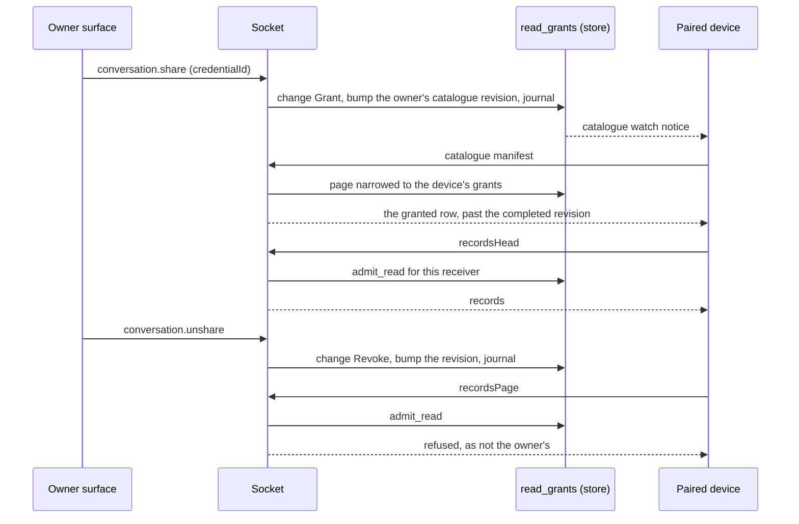

# Read grants — issue 704, slice G

Status: this branch. Part of [#252](https://github.com/nessalabs/nessa-agent/issues/252)
(slice G of [ADR 252](../adr/todo/252-runtime-roles-and-execution-leases.md)).
The map's rules are in
[Sharing a conversation](runtime-architecture.md#sharing-a-conversation) and
[What syncs, and which way](runtime-architecture.md#what-syncs-and-which-way).
This builds on [record subscriptions](record-subscriptions.md) (slice E), which
left one admission point for it.

## The problem

A paired device (a phone, through [device pairing](auth/device-pairing.md))
signs in as its owner with a credential that holds only `conversation.read`.
Before this slice that grant covered every conversation the owner had: the
device listed, read and watched all of them. The map says nothing syncs by
default and access is per conversation.

## What a grant is

A grant is `(device, conversation id, role = Read)`, kept by the gateway in
the metadata database (`read_grants`, beside the conversations). The device is
named by its receiver binding, which pairing created, and by the credential
the owner chose it by; both are minted when it paired and never reused. There
is no grant by list, channel or filter: a conversation created or moved later
is not visible until it has its own grant (row G7).

The owner manages grants with three socket methods, each admitted by Cedar for
`credential.manage`, the grant that pairing a device already asks for:

- `conversation.share {requestId, conversationId, credentialId}` grants Read.
  The conversation must be the caller's and not deleted, and the credential an
  active paired device of the same owner (`share_target_not_paired`
  otherwise).
- `conversation.unshare {requestId, conversationId, credentialId}` revokes. It
  needs only ownership, so access can be taken away from a deleted
  conversation or an unpaired device.
- `conversation.shares {conversationId}` lists the grants on one conversation.

Each grant and revoke that changes something is journaled
(`read_grant_changes`) in the same transaction as the grant itself: before and
after, the owner's principal as initiator, the surface and request it came
from, the time, and the catalogue revision it took (row G10). A repeat changes
nothing and writes nothing (row G9).

## One authority

"May this reader read this conversation" has one owner,
`conversation::application::read_grants`:

- **Who is a grantee** is decided by construction. A session whose credential
  has a receiver binding is a paired device, because only pairing creates
  receiver bindings; every other session is one of the owner's own surfaces
  and reads by ownership, exactly as before. A gateway that pairs nothing has
  no bindings, so nothing changes for it (row G11).
- **`admit_read`** answers one conversation. An ungranted id is refused as a
  conversation that is not the owner's, so a device cannot tell it from one
  that does not exist.
- **A device lists through its catalogue**, which the store narrows to its
  grants. The socket's lists (`conversation.list`, `.observe`,
  `.subscribeList`) are the owner's own and are refused to a device
  (`forbidden`), rather than read whole and filtered: a filtered list could
  come back as empty pages, and its cursor would name the last ungranted row.

Every read path asks it:

| Path | Asks |
|---|---|
| A device's `conversation.recordsHead`, `recordsPage`, and `conversation.watchRecords` (admitted as a record head) | `AdmitPassiveRead::execute` → `admit_read` |
| A device's catalogue head, manifest and resolve, and `conversation.watchCatalogue` | the store's page and resolve, narrowed in SQL |
| `conversation.read` and every view subscription batch (`subscription::authorize_batch`) | `product::read_access::admit_conversation` → `admit_read` |
| `conversation.list`, `conversation.observe`, every list subscription batch (`read_list`) | `product::read_access::admit_list`: the owner's surfaces only |

The catalogue is narrowed in SQL rather than filtered after the read, because
a filtered page must still be a whole page: a page of 200 rows that loses 199
after the limit would stop a device's pass. The store states "this receiver
holds a grant on this conversation" once (`store::read_grants::granted`) and
uses it for `is_granted`, for the grants on a conversation, and for the
catalogue's page and resolve, so a device's catalogue and its reads cannot disagree.

A device's catalogue watch is still the owner's: its notice carries no id
and only says "read again", so it fires on any change to the owner's
catalogue, granted or not. What the device then reads is narrowed; the notice
tells it that something changed, never what.

## Revisions

The catalogue a device pages is a sync pass: each pass asks for rows changed
after the revision it last completed. A grant on an old conversation would
otherwise never be sent, so a grant change is a catalogue change. It takes the
owner's next catalogue revision and stamps it on the conversation's row, in
the transaction that writes the grant (row G5). Every reader of that owner's
catalogue sees the row changed; the owner's own list sends the same row again,
which costs one frame.

A revoke removes the row from the device's pages; it is not sent as deleted
(row G6). The sync engine refuses to bring a deleted identity back at a later
revision, so a revoked row marked deleted could never be granted again. What a
follower keeps of a conversation it can no longer read is its own follow rule
and cache, on the follower's side; this gateway only stops serving it.

## What this slice does not do

- **Follow rules** are the follower's table (a peer gateway, slice H, or a
  device's cache). Grants and follow rules are separate tables; this slice adds
  only the grant table, and nothing syncs by default.
- **Comment and Drive roles** and tool policy revisions (#707). The role
  column holds `read` only.
- **Peers** as grantees: slice H adds the `gateway` principal kind; its
  sessions will be grantees by the same construction.
- **The Share control in the conversation header** on the desktop. The
  methods are on the wire and in the generated client; the desktop UI is a
  separate change with its browser verification.
- **An in-stream semantic record of each grant.** The issue asks for one; the
  grant journal above is the durable evidence this slice writes, in the same
  transaction as the grant. Writing into a conversation's record stream needs
  that stream's writer, which a share must not open; it is left for the
  semantic record writer to take.
- **Cedar** still decides the method grant (`conversation.read`,
  `credential.manage`) as before. Moving the per-conversation fact into the
  Cedar bundle changes the policy digest that pairing's receiver epochs are
  keyed on, so it is not done here.

## State and order table

Each row has at least one test. Store tests are in
`crates/nessa-server/tests/conversation/store.rs`, admission tests in
`crates/nessa-server/tests/conversation/passive_read.rs`, socket tests in
`crates/nessa-server/tests/product/socket/subscriptions.rs`, unless named
otherwise.

| Row | State and input | Result | Test |
|---|---|---|---|
| G1 | A paired device asks for the records (head, page, or a records watch) of a conversation never granted to it | Refused `WrongOwner`, as a conversation that is not its owner's; no source is touched; a watch is not installed | `an_ungranted_conversation_is_refused_before_its_source`; `a_records_watch_on_an_ungranted_conversation_is_refused` (`tests/product/socket/watches.rs`) |
| G2 | A paired device pages its owner's catalogue | Only granted rows; resolving an ungranted one finds nothing | `a_device_pages_only_the_conversations_granted_to_it` |
| G3 | The owner grants; the device reads | Admitted | `an_ungranted_conversation_is_refused_before_its_source` (second half) |
| G4 | A read admitted, then the grant revoked before its source finished | The admitted read finishes; the next admission is refused | `a_revoke_ends_the_next_read_and_lets_an_admitted_one_finish` |
| G5 | A grant on a conversation older than the device's completed pass | The row's revision and the owner's head move past it; the next pass sends the row | `a_grant_moves_the_row_past_what_a_device_completed` |
| G6 | A revoke | The row leaves the device's pages and resolve, not as deleted; the head moves | `a_revoke_takes_the_row_out_of_the_devices_catalogue` |
| G7 | A grant on one conversation; another exists or is created later | The other is not visible | `a_grant_names_one_conversation_and_nothing_else` |
| G8 | Share on a conversation not the caller's, a deleted one, or naming a credential that is not an active paired device of the owner; ownership and deletion are checked in the transaction that writes the grant | `conversation_not_found`, `conversation_deleted`, `share_target_not_paired`; nothing written | `share_refuses_what_the_owner_cannot_grant` |
| G9 | Share twice; unshare what is not granted | `applied: false`; no journal row, no revision | `a_repeated_share_or_unshare_changes_nothing` |
| G10 | A grant and a revoke that change something | One journal row each: before, after, initiator, surface, request, revision | `every_grant_change_is_journaled_with_its_initiator` |
| G11 | The owner's own surface (no receiver binding), or a gateway that pairs nothing | Reads, lists and subscribes as before | the existing subscription and conversation suites, which compose no receiver binding; `an_owner_surface_reads_everything_it_owns` |
| G12 | A socket session with a receiver binding | `conversation.read` and a view subscribe of an ungranted id answer `conversation_not_found`, a granted one is read; `conversation.list`, `.observe`, `.subscribeList` and the share commands answer `forbidden` | `a_paired_device_on_the_socket_sees_only_what_it_was_granted` |
| G13 | A device's view subscription; the grant is revoked between batches | Ended `refused` with `conversation_not_found` before the next read | `a_revoke_ends_a_device_subscription_before_its_next_batch` |
| G14 | A device unpaired (its binding inactive), whatever it was granted | Socket reads refused `unauthorized`; passive reads as before | `an_unpaired_device_reads_nothing_whatever_it_was_granted` |
