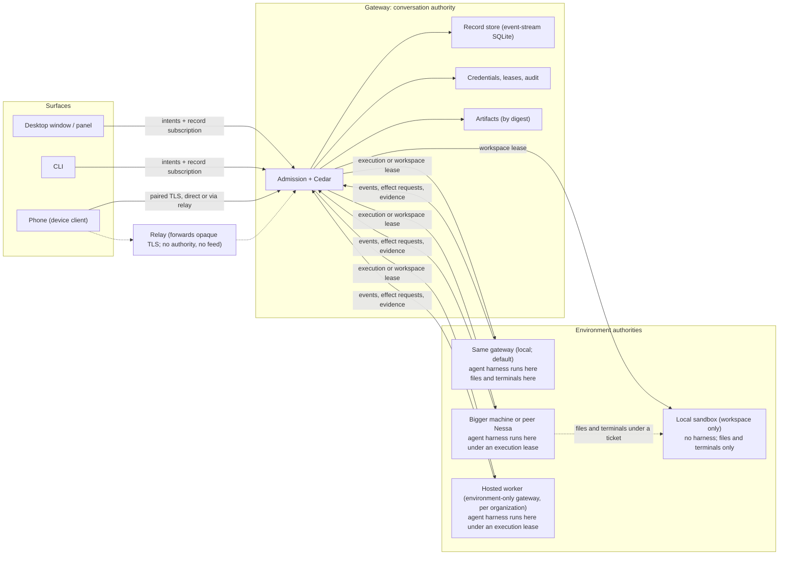

# Runtime architecture: authorities, leases and expansion boundaries

Owner: [#252](https://github.com/nessalabs/nessa-agent/issues/252). Status:
proposed design map, the companion to
[ADR 252](../adr/todo/252-runtime-roles-and-execution-leases.md). The ADR holds
the decision; this document holds the boundaries, the current-versus-proposed
state, where code goes, and the build order. It builds on
[0008](../adr/todo/0008-agent-client-api.md) (runtime),
[0009](../adr/todo/0009-reusable-event-stream-crate.md) (records),
[0011](../adr/todo/0011-nessa-session-protocol-and-authorities.md) (shared
delivery), [0010](../adr/done/0010-local-authentication.md) (identity),
[483](../adr/done/483-protocol-and-client-core-crates.md) (crate direction),
[0014](../adr/todo/0014-nessa-owned-policy-hooks.md) (policy),
[344](../adr/todo/344-mcp-ui.md) and [392](../adr/todo/392-remote-mcp-servers.md)
(extensions), and the sync lanes under #257, #263, #267, #270 and #273. It
redefines none of their protocols. Nothing here authorizes a runtime rewrite;
each slice is an issue of its own.

## The shape in one paragraph

There are two kinds of authority, and every gateway holds one or both. A
**conversation authority** owns a conversation: its records, admission,
receipts, approvals, policy, artifacts and the leases it issues. An
**environment authority** owns a machine or container: its provider
credentials, the harness processes it supervises, the files and terminals it
serves, its isolation boundary and its own audit of what ran there. A
**lease** is the contract between the two: the conversation authority asks an
environment to run a harness (an execution lease) or to serve files and
terminals (a workspace lease), bounded by grants and a deadline, and commits
what comes back. On one laptop the same gateway is both authorities and the
lease is issued and ended in process. On a home server the gateway moves
whole. For a hosted worker, a bigger machine, or a friend's Nessa, only the
environment side is elsewhere. **Surfaces** (desktop, CLI, phone) fold
committed records and send intents; **replicas** (a phone cache, a relay, a
backup) are copies with no role. Authority moves only by lease, never by
owning a copy of the data.



Arrows are calls. The **agent itself**, the Claude, Codex or OpenCode
process running the model loop, lives inside whichever environment holds
the execution lease: the laptop by default, a bigger machine, a peer's
Nessa or a hosted worker when leased there. It never runs in a surface, a
replica, the relay, or a workspace-only sandbox. The relay is dotted because
it carries bytes it cannot read. The dotted edge between environments is a workspace channel: the
harness runs in one environment and its file and terminal operations land in
another, under a ticket the conversation authority issued. No environment
touches the record store or the credential store; the conversation authority
commits what a live lease reports.

## Roles

| Role | Owns | Never does |
| --- | --- | --- |
| **Conversation authority** (a gateway, `crates/nessa-server`, conversation role) | Authentication and Cedar admission (0010); one active turn per conversation and every receipt (0008); the committed record streams and their catalogue (0009); approvals and their answers; policy verdicts (0014); surface, device and peer credentials; artifact holds; issuing and ending leases; audit of the conversation | Draw a transcript; keep a second turn state machine in a surface; accept a record from anything but a live lease; run a harness except through its own environment role |
| **Environment authority** (a gateway, environment role; today the same process) | Provider credentials on that machine; harness processes and every OS resource they create, per lease supervision scope (0008 cleanup contract); the workspace: files, terminals and background commands it serves over ACP client methods; the isolation boundary, stated honestly; admitting or narrowing a lease under its own policy; its own audit of what ran there; translating harness events to the normalized payload; forwarding mediated effects to the conversation authority | Decide an approval; write a conversation record; keep conversation history past the lease; hold a conversation credential; run two leases of one kind for one conversation |
| **Surface** (desktop, panel, CLI, phone; `src/`, `packages/nessa-client`, `crates/nessa-client-core`) | Folding committed records into a view with the one fold in `nessa-protocol`; drafts and an outbox of intents keyed by `requestId`; presentation and local preferences | Admit or retry a command on its own authority; execute a tool; write a record; infer turn state from provider text |
| **Replica** (phone cache, relay, backup) | A verified copy with scope, generation and reset receipts ([read-only sync](read-only-sync-example.md)) | Anything. A replica has no grants. Promotion is an explicit, quarantined restore (#270, #272) |

A gateway is one binary, `nessa server`, with roles enabled by
configuration. A laptop runs both roles. A home server runs both. A hosted
worker runs the environment role only, with no surfaces and no conversation
streams, just its auth, its policy and its audit. A peer's Nessa runs both
for its owner and serves the environment role to a paired conversation
authority under its own policy.

The test for a role boundary is the one `codebase-structure.md` already uses
for the core: could this piece serve a Nessa with no menu bar at all? A rule
about who may act on a conversation belongs to the conversation authority. A
rule about a machine's processes, files and credentials belongs to the
environment authority. A rule a phone needs as well as the desktop belongs
to the surface libraries. Two roles may share one process, as they do today,
but the seam between them is a typed port, not shared state.

## Home server: move the gateway, not the environment

The first way to run agents on another machine needs no lease wire at all.
Run `nessa server` on the home server with both roles; the laptop and the
phone are both linked devices to it through the same pairing (steps 2 to 4
below). The records, the approvals, the device registry and the provider
credentials live where the agents run, which is the simplest trust statement
and the one most people mean by "my home server runs my agents".

Leases to another environment exist for when the conversation authority
should **not** move:

- **Hosted workers.** The organization's records and policy stay in one
  gateway; environment-only gateways are disposable containers that come and
  go.
- **One conversation elsewhere.** A build or a GPU job on a bigger machine
  while history, approvals and every other conversation stay on the laptop.
- **Effects elsewhere, model loop here.** The agent runs on the laptop and
  its files and commands land in a local sandbox or on a remote box. That is
  a workspace lease alone.
- **A peer's Nessa.** Two gateways paired; one asks the other to run or host
  something under the other's policy.
- **Trust asymmetry.** A machine you will run code on but will not give your
  history, credentials and device registry. A lease hands it one
  conversation's worth of authority and nothing durable.

## Current versus proposed

| Concern | Today | Proposed | Owner | Tracking |
| --- | --- | --- | --- | --- |
| Admission and policy | Mandatory `/session` auth, Cedar per operation, verified `ActionContext` into the SDK | Unchanged. Device, peer-gateway and environment principals get grant kinds of their own (below) | Gateway `auth` application | 0010 done; #481 publishes required grants |
| Turn state and receipts | SDK `Agent` per conversation; creation receipts via `CreationCoordinator`; `requestId` on every mutation | Unchanged contract. The same receipt path answers the phone outbox (#269) and a desktop outbox (closes gap G04) | SDK scheduling; gateway `conversation` | 0008; #267, #268 |
| Records | Semantic records on one event-stream SQLite runtime; bounded head/page reads over `/session`; watch hints | Replay-to-live **subscriptions** with cursors, bounded batches and lagging-subscriber close; gateway views served from committed records | SDK `session_storage` writer and source; gateway delivery adapter | 0009; #296, #277 |
| Desktop reads | Polling: 1 s summaries, 250 ms active transcript, serialized per conversation | The desktop subscribes like any other surface. Polling is retired once subscriptions exist | `src/desktop/workspace/adapters/gateway` | #277 then a desktop slice |
| Phone reads | Device client with private cache, finite passes, retained watch; real paired process tests | Deliver through pairing and the optional relay. No execution authority, ever | `nessa-client-core`; gateway `device_pairing` | #257, #263 (#264, #265, #266), #262 |
| Phone commands | None | Durable intent outbox, read-only receipt lookup before any retry, exact-turn Stop, honest unknown outcomes | `nessa-client-core` outbox; gateway receipts | #267 (#268, #269) |
| Execution environment | In process: gateway composes the SDK `Agent` and its ACP binding per conversation | An `ExecutionEnvironment` port in the conversation application; the in-process adapter first, a remote adapter speaking the lease wire later | Gateway `conversation` composition; SDK provider ports | New issue (step 7) |
| Workspace | The harness acts on the gateway machine's filesystem through its own tools; Nessa serves no separate workspace | A `Workspace` port: files, terminals and background commands served to the harness over ACP client methods; local directory first, local sandbox and remote environments later. Split workspace is advertised only for a binding that routes those effects through the client | Gateway `conversation` composition; SDK ACP client capabilities | New issue (steps 7, 8) |
| Remote environments | None | Any gateway serves execution and workspace leases to a paired conversation authority under its own policy; an environment-only gateway is the hosted worker | Gateway environment role; wire types in `nessa-protocol` | New issue (step 9) |
| Peer gateways | None | Two gateways pair with the same OPAQUE flow under a `gateway` principal kind; each is an environment for the other and a surface over what the other grants | Gateway `device_pairing`; `nessa-auth` | New issue (step 9) |
| Mediated effects | Approvals through ACP permission exchange, answered by a surface; Nessa tools through `nessa mcp-relay` per harness session; images by digest and ticket | Same paths, plus files and terminals over the workspace port, carried over the lease and workspace channels when remote. Nothing new is invented for the local case | SDK permissions; gateway `mcp_servers`, `attachments` | 0012, 344, #273 |
| Policy hooks | Capability reporting merged (#142); no configured pre-tool runtime | Verdicts evaluated at the conversation authority; a verdict that must land before a tool runs is enforced by the environment's SDK from the policy snapshot the lease carries, with evidence returned | SDK application owner (0014) | #130, #132, #133, #136 |
| Extensions | MCP Apps in a sandboxed iframe on another origin; one MCP connection per harness session; remote MCP with gateway-owned OAuth | Unchanged. An extension never holds a gateway credential; it holds the relay token for one opening | Gateway `mcp_servers`, `mcp_authorization`; desktop `widgets/app` | 344, 392 |
| Artifacts | Held per conversation by digest; bytes over `PUT /attachments` under a single-use ticket; local manifest and range reads | Lease-scoped tickets so a remote environment reads held bytes by digest; protected sync of artifacts to devices | Gateway `attachments` | #273 |
| Backup and restore | None | Consistent export cut across record, metadata and audit owners; deletion inventory; a restored gateway is quarantined until authority transfer is explicit | New gateway module | #270 (#271, #272) |
| Identity | Principal, organization, credential; local bootstrap; devices paired with OPAQUE over pinned raw-key TLS | Environments and peers are principals with narrow grant kinds. Audience generalizes to a logical deployment before any gateway replica | `nessa-auth` | 0010 done; [identity direction](auth/identity-tenancy-and-cloud.md) |
| Budgets | Every lane bounded; [limits.md](../limits.md) rendered from owners | Add per-lease, per-device and per-organization rows to the same table; no second limits document | `config.json`, protocol fixed values | Each slice adds its rows |

## Where the code goes

```text
nessa-local-storage, nessa-local-database        leaves: files, SQLite
        ▲                     ▲
nessa-auth            nessa-sdk  ◄── event-stream (pinned)
        ▲                 ▲
        └──── nessa-protocol ◄── nessa-sync (pinned)      what both ends agree on
                   ▲         ▲
   nessa-client-core         nessa-server (one binary, roles by configuration;
   (phone, CLI, desktop-     ▲   client-core as dev-dep only)
    as-device)               │
                       src-tauri host (reads endpoint + credential;
                                       never links the server)
```

Arrows point at the dependency. The rules already enforced by
`scripts/architecture/rust-dependency-graphs.mjs` stay: the gateway never
links the device client in production; the device client never reaches the
gateway; nothing portable links the desktop framework. No new crate is
proposed. What is added:

- The lease and workspace wire types live in `nessa-protocol`, because both
  ends of a gateway-to-gateway connection agree on them (483's admission
  rule). The SDK's ACP client already owns the file and terminal method
  shapes the harness speaks.
- Inside the gateway, the two authorities are module boundaries.
  `conversation/` is the conversation authority: admission, receipts, views,
  and the two ports `ExecutionEnvironment` and `Workspace`. The environment
  role is the SDK composition, `agents/`, the process and workspace adapters,
  and the lease admission that serves a paired peer. `device_pairing/` and
  `product/` are the surfaces' and peers' way in; `attachments/` is
  artifacts; `mcp_servers/` and `mcp_authorization/` are extensions. The
  proposal moves no module; it names which role each serves so a new file
  has one place to go.
- An environment-only gateway is this crate composed without conversation
  streams or surface methods. Its audit store and auth are its own.

## The five seams

1. **Admission** (exists). A surface's command is authenticated, authorized by
   Cedar on the server-resolved resource, given a verified `ActionContext`,
   and only then reaches the SDK. Receipt retries pass the same gate. A
   peer's lease request passes the same gate on the environment side, under
   that gateway's policy. Nothing below the gate knows about grants.
2. **Records** (exists; delivery proposed). The SDK commits semantic records
   before publishing. The gateway serves committed records and nothing else:
   bounded reads today, subscriptions under #296/#277. The fold that turns
   records into a `ConversationView` lives once, in `nessa-protocol`, so the
   phone, the desktop and a test draw the same transcript from the same bytes.
3. **Environment** (proposed ports, existing behavior). Two ports in the
   conversation application. `ExecutionEnvironment`: open under a lease;
   prompt, steer, cancel; a stream of normalized events tagged with lease and
   turn; effect requests the conversation authority must answer; close with
   cleanup evidence. `Workspace`: the file, terminal and background-command
   operations the harness asks its ACP client for, served from a root the
   lease names, with evidence of what was touched. The in-process adapters
   are today's code behind those interfaces. Extracting them changes no
   behavior and is the gate for everything remote.
4. **Pairing** (exists in part). OPAQUE pairing over pinned-key TLS issues a
   credential bound to a key: a device credential with `conversation.read`
   today ([device pairing](auth/device-pairing.md)); a `gateway` principal
   with environment grants, or surface grants, later. Protected reads, watch
   and the outbox run over that channel for devices; lease requests and
   their event streams run over it for peers.
5. **Extension** (exists). Each harness opening gets one MCP session per
   configured server through the relay; apps reach their own server through
   gateway methods under policy and audit; the window hosts them on a
   sandbox origin. An extension's authority is the opening's token, revoked
   when the opening ends.

## Leases

A **lease** is the conversation authority's record that one environment may
do one kind of work for one conversation, for a bounded time, with named
grants. It is a semantic record in the conversation's stream with an
`ActionContext`, so replay shows who ran what, where, and why. There are two
kinds with one lifecycle.

| Field | Execution lease | Workspace lease |
| --- | --- | --- |
| Scope | `conversationId`, optional `turnId` | `conversationId` |
| Environment | The environment authority's principal and pinned key | Same |
| What it allows | Run the named binding and model; stream events; request effects | Serve files, terminals and background commands under the named root or sandbox descriptor |
| Grants | Held artifacts by digest; the Nessa tool allowlist for the relay; the policy snapshot revision to enforce before a tool runs | The ticket the executing environment presents on the workspace channel; what may be read, written and run |
| Deadline and revision | When it lapses without renewal; which issuance this is | Same |

Rules that keep authority where it is:

- A conversation holds at most one live lease of each kind. Its execution
  and workspace leases may name different environments; by default they
  name the same one, and on a laptop that is the gateway's own.
- The environment authority admits a lease under its own policy and may
  narrow or refuse it. The conversation authority records what was granted,
  not what was asked.
- Events are accepted only while the lease is live and only when they carry
  its id and the turn's id. Late or unlabelled output is dropped with
  evidence, never attached to the next turn (0008).
- A lease carries no record-write right and no approval right. The
  conversation authority commits what the environment reports; the
  environment keeps nothing durable past the lease but its own audit and its
  cleanup evidence.
- Ending a lease follows the 0008 Stop contract from the environment's side:
  cancel over the protocol, close the supervision scope, report exit and
  released resources within the deadline. For a workspace lease: end the
  terminals it serves and report what was written. Missing evidence makes
  the turn `interrupted` and the environment unavailable until accounted
  for.
- A replica never holds a lease. A restored gateway issues new leases only
  after the restore is explicitly accepted (#272).
- Moving a conversation is end one lease, then issue another. The
  provider's own session resumability is unknown until proved per binding.

The local case needs none of this wire. It gets the same ports and a lease
that is issued and ended in process, so that the audit record, the cleanup
evidence and the turn state are identical whether the harness ran here or
elsewhere. That is what lets a phone's view of a turn mean the same thing in
both cases.

### The workspace channel

When the execution and workspace leases name different environments, the
harness's file and terminal calls travel from the executing environment to
the workspace environment directly, under the ticket in the workspace lease.
They do not take a hop through the conversation authority: a terminal is a
stream and a gateway in the middle of every byte would set the latency the
person feels. The conversation authority tells the workspace environment,
over their paired channel, which ticket to expect for which lease; the
executing environment presents it; the workspace environment verifies it
against its own policy and serves the calls. The workspace environment
reports evidence (terminals started and ended, paths written) to the
conversation authority on the lease, and keeps its own audit. Ending either
lease ends the channel.

### What a split workspace is honest about

ACP already separates the loop from its effects: an agent may ask its client
to read and write files and to run terminals. Nessa is that client. A split
workspace is real exactly for the calls a harness routes through the client,
and it is advertised per binding through the capability chain of #142: a
binding that routes every file and terminal effect through the client
supports it; one whose native tools act in its own process does not, and a
split workspace is refused for it at configuration time, loudly, never
silently degraded (0014). Nessa's own harness, when it exists, declares full
support. The model loop itself still runs in the executing environment with
that environment's network access and provider credential.

## Mediated effects

Four kinds of effect leave the harness and all four have an owner. The lease
and workspace channels carry them when the environment is remote; nothing
changes for the local case.

| Effect | Path | Decided by |
| --- | --- | --- |
| A tool needs permission | Harness → environment SDK permission exchange → conversation authority interaction record → a surface answers → the answer returns over the lease | The person, through any surface; hooks under 0014 may deny first |
| The agent reads or writes a file, or runs a command | Harness → ACP client file or terminal method → environment SDK → `Workspace` port: the local root, or the workspace environment over the ticketed channel | The workspace environment's policy on what the lease may touch; approvals still the person's |
| The agent calls a Nessa tool | Harness → MCP stand-in → relay token → conversation authority product method under Cedar | The conversation authority, as for any caller |
| The agent reads an artifact | Environment asks for held bytes by digest under a lease-scoped ticket | The conversation authority's hold and ticket owner (`attachments`) |

Isolation is stated per boundary, because authorization is not a sandbox
([identity direction](auth/identity-tenancy-and-cloud.md#isolation-without-a-network-hop-for-every-policy-check)):

- **Local execution, local workspace**: the person's own account. There is
  no sandbox and 0008 forbids claiming one. The ACP binding documents its
  actual file and tool access.
- **Local execution, sandboxed workspace**: the container around the
  workspace bounds the effects the harness routes through the client. The
  model loop still runs on the host with the host's network.
- **Second machine or peer**: that machine's account and that owner's
  policy. The same statement, made by them.
- **Hosted worker**: a container or VM per organization. That boundary is
  the isolation. A worker holds one organization's leases and nothing else;
  two organizations never share a worker process.

Disclosure follows the lease kind. An execution lease shows the environment
the whole conversation, because the model loop runs there with the prompt
and its context. A workspace lease shows it only the file and command
operations. Choosing where a conversation runs is choosing who sees it, and
the composer says which.

## Peer gateways

Two Nessas pair the way a phone pairs with one: OPAQUE over pinned-key TLS,
a credential bound to the peer's key, under a `gateway` principal kind. From
then on each is, to the other, whatever its grants say:

- **An environment.** "Run this conversation on your machine" or "serve a
  sandbox for it" is a lease request, admitted under the peer's Cedar
  policy, which may narrow it (workspace only, a particular root, no
  network). The conversation stays in the requester's stream; the peer
  audits what ran on its machine.
- **A surface.** "Let me watch and command that conversation of yours" is a
  device-style grant on the peer's conversations. The conversation stays in
  the peer's stream; the requester folds and sends intents like a phone.

Which applies is decided by whose stream the conversation is in. A
conversation is never co-owned, never mirrored into both stores, and never
moved by anything but an explicit export and quarantined restore.

## Records and replication

- The record is the unit. A semantic fact committed to a conversation stream,
  or to the principal's control stream for creation. Streams have
  incarnations and cursors; a cursor from another incarnation is a typed
  refusal, not a guess.
- One fold. `nessa-protocol` owns `ConversationView` and the projection.
  Every surface draws from it; nothing keeps a second transcript model.
- Delivery is replay then live, from the client's last applied cursor, in
  bounded batches, with the subscription closed when the client lags and
  reopened from its checkpoint (0009, 0011). The desktop's polling is the
  interim and is retired by the same change that gives the phone live
  reads, so there is one read path to measure and secure.
- Replicas verify, they do not trust. The phone cache keeps scope,
  generation, deletion fences and reset receipts and refuses a record whose
  identity changed meaning. The relay forwards TLS bytes it cannot open: the
  gateway's key is pinned at pairing, so a relay cannot terminate the
  connection or substitute records; it can only delay or drop, which the
  client reports as unknown freshness. The relay stores no catch-up feed in
  its first form (#266).
- Checkpoints of the fold are deferred until measured. The trigger to build
  them is written down: an attach whose replay from zero exceeds the
  interactive budget on the longest real history. Until then, replay from
  zero with bounded pages is the contract.
- Backup is an export cut, not a cache. It carries records, metadata and
  audit from their owners at one consistent boundary plus a deletion
  inventory, so a restore cannot resurrect what was deleted. A restored
  gateway is quarantined: it serves reads and issues no leases until the
  person accepts it as the authority and every other copy is told (#270).

## Commands

One contract across every surface, already specified in 0008 and used by the
desktop today:

- Every mutation has a `requestId` chosen once by the surface. The accepted
  record is the receipt. An identical retry returns the receipt; a different
  payload under the same id is refused.
- A surface that may lose its process persists the intent before first send
  and, after restart, looks the receipt up before any retry. The phone outbox
  (#269) is the first implementation; the desktop adopts it to close G04, so
  a crashed window and a backgrounded phone recover the same way.
- Stop names the exact turn. `turn_busy` returns to the surface's draft and
  is never retried automatically.
- The phone's intents travel the paired channel, pass the same admission as
  the desktop's, and are recorded with the device's principal and surface.

## Identity and trust

| Principal kind | Credential | Grants | Issued by |
| --- | --- | --- | --- |
| Person (owner) | Local bootstrap, OS-protected | Everything on their organization | Setup; recovered offline |
| Bundled surface (panel, desktop window) | Private surface credential served by the host once the gateway is ready | Product methods for that surface | Provisioning (`--provision-local`) |
| Linked device | Credential bound to an Ed25519 key, issued after OPAQUE pairing | `conversation.read` first; command grants when #267 lands | The owner, through Settings › Linked devices |
| Peer gateway | Credential bound to the peer gateway's key, after the same pairing | Environment grants (accept execution or workspace leases, report events, request effects) and/or surface grants, each narrowed by the grantor's policy. Never both authorities over one conversation | The owner of each gateway, for the other |
| Hosted worker | Credential bound to the container's key | Environment grants only, for one organization. No reads outside its leases | The organization |
| Extension | The opening's relay token | The tools its server exposes, under policy | The gateway, per harness opening |

Scale is by organization and by environments. One conversation authority
per organization deployment holds the records; environment-only gateways
are added for capacity; surfaces are added for people. Replicating one
organization's conversation authority across gateways is not designed here
and is gated behind the audience generalization the identity direction
already requires. Hosted login, when it comes, is an adapter behind Nessa's
own identity model, never the model itself.

## Budgets

Every lane is bounded and every bound has one owner that
[limits.md](../limits.md) is rendered from. Proposed rows, added by the slice
that needs them:

| Row | What it bounds |
| --- | --- |
| `lease.event_buffer_bytes`, `lease.event_batch` | Normalized events an environment may have in flight before the conversation authority applies backpressure or ends the lease |
| `lease.cleanup_deadline` | How long an environment has to report cleanup before the turn is `interrupted` |
| `workspace.terminals`, `workspace.write_bytes` | Terminals one workspace lease may hold open; bytes it may write |
| `organization.environments`, `organization.leases` | Concurrent environments and live leases per organization |
| `device.subscriptions`, `device.outbox_bytes` | Subscriptions one device may hold; intents it may hold unsent |
| `artifact.lease_bytes` | Bytes one lease may fetch by digest |

Existing bounds keep their owners: the SDK's queue, channel, frame and
controller limits; the gateway's admission and socket lanes; the client's
preparing retries.

## Performance

- **Latency a person sees** is commit latency plus one socket write once
  subscriptions replace polling. Local commit p95 was measured at 108 ms
  over 64 commits (#299); the 250 ms poll and the read behind it go away.
  Measure again after #277 on the longest real conversation and record it.
- **Replay cost** is linear in history. Bounded pages keep each read small;
  checkpoints are the escape hatch and are built only when the recorded
  trigger fires.
- **Event streaming** keeps the SDK's commit cadence (100 ms, 16 KiB or 64
  messages). A remote environment batches at the same cadence; the lease
  buffer bounds what a slow link may hold.
- **Workspace calls** go environment to environment. File reads and writes
  are one round trip each; terminals stream. The conversation authority is
  not on that path, so its load does not grow with keystrokes.
- **Phone bandwidth** is cursor deltas in 16-record, 64 KiB pages with
  metered scheduling measured under #262. Catalogue passes resolve only
  changed entries.
- **Gateway CPU** is the SDK and SQLite. Image normalization and record
  validation are the measured hot spots today; leasing execution elsewhere
  moves the harness off the gateway machine, which is the first real
  scaling step.

## Security

What is enforced, and where:

- The conversation authority is the only writer of its records and the only
  place conversation policy runs. The environment authority is the only
  holder of its provider credentials and the only place its machine's policy
  runs. Each bounds the other through the lease: the lease bounds what the
  environment may do to the conversation; the environment's admission bounds
  what the conversation may do on the machine.
- Surfaces, devices, peers and workers are authenticated principals with
  grant kinds that cannot express what their role must not do: a device
  cannot hold an environment grant; a worker cannot hold a read grant
  outside its leases; a peer cannot hold both authorities over one
  conversation.
- Credentials live in the private credential store, never in settings,
  prompts, URLs, tool arguments or logs. Pairing secrets are 40 bits of
  generated entropy, one use, with a durable attempt budget.
- The relay is untrusted by construction. Pinned raw-key TLS from device to
  gateway means the relay sees metadata (timing, sizes, endpoints) and
  nothing else. #266 measures that exposure.
- Workspace tickets are single-lease and verified by the workspace
  environment against its own policy; a ticket cannot widen a lease.
- No implicit promotion. Copies cannot become the authority; restore is an
  explicit, audited, quarantined act.
- Audit is part of the behavior on both sides: every lease issued, narrowed
  and ended, every effect mediated, every verdict, with target, before/after,
  cause and initiator, on cleanup and failure paths too. The environment's
  audit and the conversation's audit are separate facts, and a lease's
  evidence is reported as such, not relabelled as the other's.
- Isolation claims are per boundary and honest. Local has none; a sandboxed
  workspace bounds effects, not the loop; the hosted worker's boundary is
  the container.
- Disclosure is said at the choice: an execution lease shows the environment
  the conversation; a workspace lease shows it the operations.
- Extensions are sandboxed by origin and CSP and reach only their own
  server through the gateway under policy.

## Ease of use

- **Local first.** No account, no network, no signup. Setup provisions the
  owner and the panel; the desktop just works, with both authorities in one
  process and nothing to configure.
- **One code to pair.** A phone, a second desktop, or another Nessa links by
  typing eight characters shown in Settings. Revoke is one row. The desktop
  app itself can be a linked device to a home server running `nessa server`,
  through the same pairing; that is how "my Mac mini runs the agents" works
  without a hosted account.
- **Honest state everywhere.** A sleeping gateway leaves the phone's cache
  readable and says fresh activity is waiting. An uncertain send shows as
  uncertain, with the receipt lookup doing the recovery. A lease an
  environment narrowed shows what was granted.
- **Same behavior on every surface.** Send, Stop, approve and queue mean the
  same thing from the panel, the window, the CLI and the phone, because
  they are one contract behind one gate.
- **Where it runs and where it acts are two chips on the composer.** "Run
  here, act in a sandbox", "run on my Mac mini", "act on the build box" are
  per-conversation choices at creation, each saying what it discloses. The
  transcript, the approvals and the audit look identical. A binding that
  cannot split is told so there, not after.

## Build order

Each step is its own issue and lands behind the gates in
`CODING_STANDARDS.md`. Phone sync is complete before any remote environment
exists; the ports are extracted before any lease wire is written.

| Step | Delivers | Gate to pass |
| --- | --- | --- |
| 1. Record subscriptions and committed views (#296, #277) | Replay-to-live for every surface; desktop off polling | Lagging-subscriber close, replay/live changeover, slow-client isolation, measured latency |
| 2. Device pairing and protected reads (#263: #264, #265) | A phone reads its conversations over its own credential | Real paired process tests; revocation ends the next read |
| 3. Relay and sleeping state (#266) | A phone away from home reaches the gateway | Direct and relay converge to one checkpoint; metadata exposure measured |
| 4. Device commands (#267: #268, #269) | Prompt and exact-turn Stop from the phone, retry-safe | Lost acknowledgement cannot run twice; unknown outcomes rendered |
| 5. Backup and quarantined restore (#270: #271, #272) | A lost gateway is recoverable | Restore drill proves deletion boundaries and refuses ambiguous authority |
| 6. Artifacts over the paired channel (#273) | Images and files reach devices, verified | Digest verification; bulk audit bounded |
| 7. `ExecutionEnvironment` and `Workspace` ports (new issue) | Today's in-process behavior behind two typed ports; leases recorded locally; a per-binding declaration of whether file and terminal effects route through the client | No behavior change; identical records and cleanup evidence before and after; the declaration verified against each pinned binding |
| 8. Local sandbox workspace (new issue) | A conversation runs here and acts in a container | Effects land only inside the root; refused at configuration for a binding that cannot split; terminals ended with the lease |
| 9. Environment service and peer pairing (new issue) | A gateway serves execution and workspace leases to a paired conversation authority; the workspace channel under a ticket | Lease ends on Stop, close and revocation with cleanup evidence on both sides; narrowed grants recorded; late events dropped; one lease per kind per conversation |
| 10. Hosted workers and organization isolation (new issue) | Environment-only gateways per organization in containers | Two-organization isolation tests across leases, workspaces, artifacts, tools and audit |
| 11. Hosted identity adapter (if hosted) | Login and membership from a provider behind Nessa's model | The adapter contract suite in the identity direction |

Steps 1 to 6 are the phone. Steps 7 to 10 are environments. Step 1 serves
both and is why it goes first; step 7 is behavior-neutral and is why it
precedes any wire.

## Unresolved contracts

Named so they are not mistaken for settled:

- **Lease and workspace wire formats.** The fields above are the contract;
  the frames, their bounds and their place in `nessa-protocol` are step 9's
  design.
- **Workspace ticket.** How the conversation authority tells the workspace
  environment what to expect, and how the executing environment presents it,
  is step 9's design. The property it must have is written: single lease,
  cannot widen it.
- **Which bindings can split.** A survey per pinned binding of which file
  and terminal effects route through the ACP client, under #142; until it
  exists, no binding advertises a split workspace.
- **Peer policy vocabulary.** What an environment may narrow in a lease
  (roots, network, binding, model, time) and how that is expressed in Cedar.
- **Hook enforcement at the environment.** Which verdicts must land before a
  tool runs remotely, and how the policy snapshot travels, is 0014's
  remaining work extended by step 9.
- **Fold checkpoints.** Deferred with a written trigger; the storage shape
  is undecided.
- **Relay with storage.** A relay that holds a catch-up feed changes the
  trust statement and is a separate decision.
- **Provider session portability.** Whether a harness's native session can
  resume in another environment is unknown per binding and is treated as
  unknown.
- **Absent-person approvals.** Remembered approvals and bounded automatic
  decisions (#141) decide what an unattended environment does at a
  permission prompt.
- **Multi-replica conversation authority.** Not planned; gated behind
  audience generalization.
