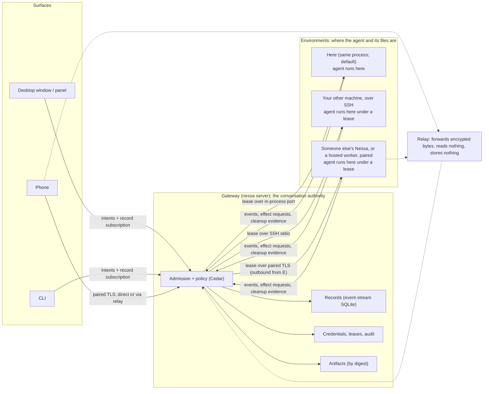
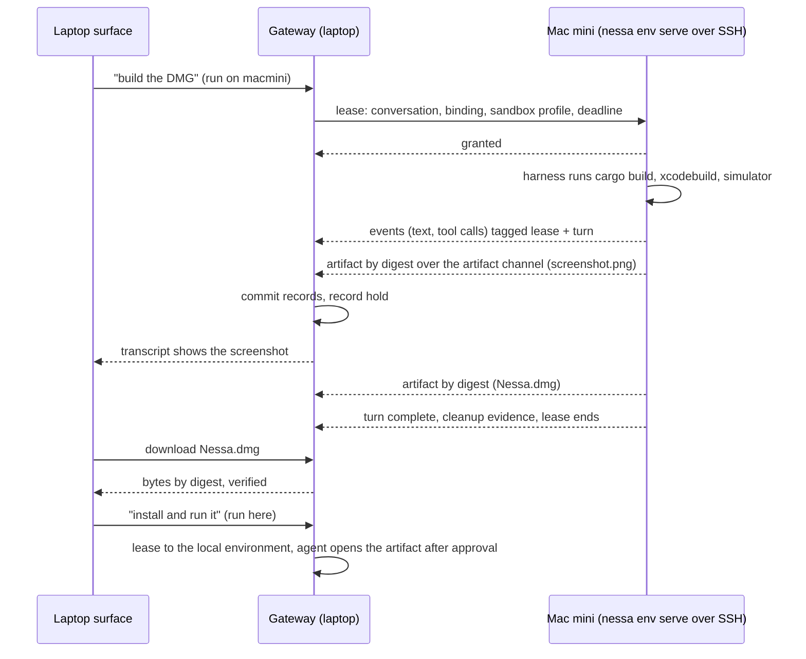
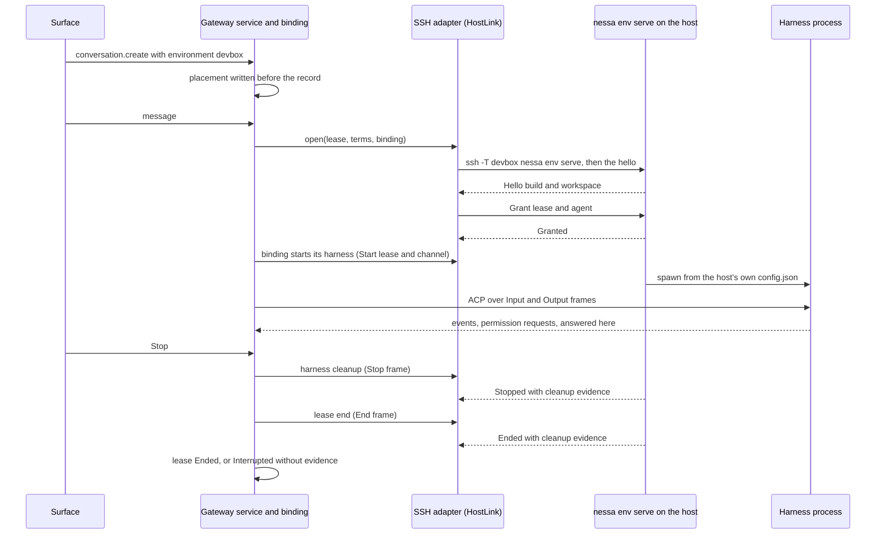

# Runtime architecture: how Nessa runs agents on one machine, and then on many

Owner: [#252](https://github.com/nessalabs/nessa-agent/issues/252). Status:
proposed design map, the companion to
[ADR 252](../adr/todo/252-runtime-roles-and-execution-leases.md). The ADR
holds the decision in one page; this document explains it for someone who
has not read the rest of the repository, then records the boundaries, the
current-versus-proposed state, where code goes, and the build order. It
builds on [0008](../adr/todo/0008-agent-client-api.md) (runtime),
[0009](../adr/todo/0009-reusable-event-stream-crate.md) (records),
[0011](../adr/todo/0011-nessa-session-protocol-and-authorities.md) (shared
delivery), [0010](../adr/done/0010-local-authentication.md) (identity),
[483](../adr/done/483-protocol-and-client-core-crates.md) (crate direction),
[0014](../adr/todo/0014-nessa-owned-policy-hooks.md) (policy),
[344](../adr/done/344-mcp-ui.md) and [392](../adr/todo/392-remote-mcp-servers.md)
(extensions), and the sync lanes under #257, #263, #267, #270 and #273. It
redefines none of their protocols. Nothing here authorizes a runtime rewrite;
each slice is an issue of its own.

## How to read this

Start with [the words](#the-words), then [the picture](#the-picture), then
[seven situations](#seven-situations), which walk through what happens on one
laptop, with a phone, with a home server, with another machine you can SSH
into, with a machine that is not yours, when you build on the Mac mini and
run the result here, and when you share one conversation with a friend. Then [what the agent gets](#what-the-agent-gets): the tools an agent is
given once the mesh exists, and [reaching your gateway from outside](#reaching-your-gateway-from-outside).
Everything after that is the contract behind those stories. [What we borrowed](#what-we-borrowed) says
where the ideas come from, with sources.

## The words

| Word | Meaning in Nessa |
| --- | --- |
| **Agent** or **harness** | The program that runs the model loop and its tools: Claude Code, Codex or OpenCode, started as a child process. Nessa does not run the model itself. |
| **Binding** | Nessa's adapter to one harness, over the [Agent Client Protocol](https://agentclientprotocol.com) (ACP). It starts the process, sends prompts, receives events, forwards permission requests, and cleans up. |
| **Conversation** | One thread of work with one agent: its prompts, replies, tool calls, approvals and outcome. It has an id that survives restarts and reconnects. |
| **Record** | One committed fact about a conversation: a prompt was accepted, a turn started, text arrived, a tool asked for permission, a turn ended. Records are appended to a stream in SQLite and never edited. Every view of a conversation is built by folding its records. |
| **Gateway** | The `nessa server` process. It is the only thing that accepts commands, writes records, evaluates policy and holds the credentials [Identity and trust](#identity-and-trust) assigns to it. On a laptop it also runs the agents. |
| **Surface** | Anything a person looks at or types into: the desktop window, the floating panel, the CLI, a phone. A surface draws from records and sends intents. It never runs an agent and never writes a record. |
| **Environment** | A place an agent can run: this gateway's own machine (the default), another machine you own, a container, or someone else's gateway. The agent and the files it works on are in the same environment. |
| **Lease** | The gateway's recorded permission for one environment to run one conversation's agent for a bounded time with named limits. The only way execution moves. |
| **Authority** | Who gets the final say. The gateway that owns a conversation is its **conversation authority**. The gateway (or service) that owns a machine is that machine's **environment authority**. One process can be both; on a laptop it is. |
| **Replica** | A copy of records with no authority: a phone's cache, a relay's buffer, a backup. It can never act. |
| **Pairing** | How two things that have never met come to trust each other: a short code typed once, which produces a credential bound to a key. Used for phones, for other people's gateways, and for hosted workers. |
| **Mesh** | The set of gateways and devices a gateway has paired with or can reach over SSH, with each one's pinned key and last known addresses. Not a network of its own; it rides on whatever network exists. |
| **Relay** | A server that forwards encrypted bytes between two parties that cannot reach each other directly. It cannot read them. |
| **Sandbox** | A boundary the operating system or a container enforces around what the agent's commands may touch. A property of an environment, declared honestly. |
| **Preview** | A loopback port on the environment, owned by the leased agent's processes, reached on the laptop's own loopback for the life of the lease. How a dev server that runs there is opened here. |

## The picture



Arrows are calls. The **agent itself**, the Claude, Codex or OpenCode
process, lives inside whichever environment holds the lease, together with
the files it edits and the commands it runs. It never runs in a surface, a
replica or the relay. There is **one lease contract** and **three ways to
carry it**: an in-process port (the default), an SSH connection to a machine
you already have access to, and a paired, encrypted connection to a machine
that is not yours or cannot be reached by SSH. The gateway does not change
between them, and neither do the records, the approvals or the audit.

## Seven situations

**1. One laptop.** You install Nessa. Setup creates the owner credential and
the panel's credential, starts the gateway, and the desktop window connects
to it. You start a conversation; the gateway issues itself a lease, starts
Claude Code as a child process in your account, and commits every event to
the conversation's record stream. The window folds those records into the
transcript. There is nothing to configure. The lease exists so that the
audit record says "ran here, as you, from this time to this time", in the
same shape it would have anywhere else.

**2. A phone.** In Settings › Linked devices you see an eight-character
code. You type it on the phone. Pairing (OPAQUE over TLS with the gateway's
key pinned) issues the phone a credential bound to the phone's own key, with
the grant to read your conversations. The phone keeps a private cache and
reads records as they are committed, directly on your network, or through a
relay when you are away. If the laptop is asleep, the phone shows what it
has and says fresh activity is waiting. When device commands land (#267),
you can send a prompt or stop a turn from the phone; the phone keeps the
intent until the gateway's receipt comes back, so a lost reply never runs a
prompt twice. The phone never runs an agent.

**3. A home server.** You want agents to keep running when the laptop is
closed. Run `nessa server` on the Mac mini. Pair the laptop's desktop app to
it the same way the phone paired: the laptop is now a surface over the home
server's conversations, with full grants because it is you. The records,
approvals, device registry and provider keys live on the Mac mini. Nothing
in this story needs a lease wire; the gateway moved whole, and that is the
recommended way to get a home server.

**4. Your other machine, over SSH.** You are on the laptop and want one
conversation to run on the build box, where the repository and the toolchain
are. You can already `ssh buildbox`. In the composer you pick "run on
buildbox". The gateway opens an SSH connection, on first use installs the
Nessa runtime there (the way VS Code's Remote-SSH installs its server), and
starts `nessa env serve`, which speaks the lease contract over the SSH
connection's standard input and output. The agent runs on buildbox, with
buildbox's files, under a lease that says which conversation, which
binding, which sandbox profile, and until when. Events come back over the
same SSH connection and the gateway commits them; a permission request
appears in your window exactly as a local one would; Stop ends the lease
and buildbox reports what it cleaned up. No new ports, no new credentials,
no relay: SSH is the authentication and the transport, and whatever makes
buildbox reachable (your LAN, Tailscale, a VPN) is not Nessa's concern. The
provider credential the agent uses is the one on buildbox, and buildbox
sees the whole conversation, because that is where the model loop runs.

**5. A machine that is not yours.** A friend offers their GPU box, or your
organization runs workers in containers. You cannot SSH there, and you
should not hold their credentials. Their gateway (or the worker, which is a
gateway with only the environment role enabled) pairs with yours using the
same eight-character code, and from then on connects **outbound** to your
gateway, directly or through a relay, the way a phone does. Your gateway
asks for a lease; theirs admits it under **their** policy, which may narrow
it (this binding only, this sandbox, no network, two hours) or refuse. The
conversation stays in your record stream; they keep their own audit of what
ran on their machine. The same mechanism, in the other direction, lets a
friend watch or command one of your conversations as a surface, under what
you grant. A conversation is never owned by both.

**6. Build on the Mac mini, run it here.** You are on the laptop. The Rust
build and the iPhone build belong on the Mac mini, where Xcode and the
toolchain are, and you want the DMG back on the laptop to run, and the
simulator's screenshots in the transcript as they happen. Two ways, both
inside the model:

- *Move the conversation.* Pick "run on macmini" for this conversation.
  The gateway leases it to the Mac mini over SSH (situation 4); the agent
  builds there. When it produces the DMG, the agent attaches it to the
  conversation: the environment publishes the file **by digest** to the
  gateway's artifact store over a separate artifact channel (sftp on the
  same SSH connection), the gateway records the hold, and every surface
  sees it in the transcript with a Download that fetches by digest and
  verifies it. A screenshot from the simulator is the same path with an
  image, so it appears in the pane on the laptop and on the phone as the
  agent takes it. To run the DMG here, the next turn is leased "here"; the
  laptop is itself an environment, and the agent opens the artifact it
  fetched by digest, after your approval. The harness session does not
  move with the lease; the new environment's harness starts fresh with
  Nessa's transcript as its context, and the map says so rather than
  pretending the native session resumed.
- *Delegate the build.* Keep the conversation on the laptop and have the
  agent hand "build the DMG and the screenshots" to a **child
  conversation** leased to the Mac mini ([ADR 329](../adr/todo/329-subagents.md)
  subagents, with the lease choosing the child's environment). The child's
  artifacts are delivered to the parent as results, by digest, and the
  parent carries on locally with its own context intact. This is the
  better fit when the local conversation is long-lived and the remote
  work is a step in it.

If the work is a web app rather than a DMG, the thing to bring back is
not a file but a running server. The agent starts it on the Mac mini and
asks for a **preview**: the port its own process is listening on is
forwarded over the same SSH connection to the laptop's loopback, the
composer shows `http://localhost:3000`, and the forward ends with the
lease ([Previews](#previews-a-port-not-a-file)).

Either way the files travel only as artifacts: content-addressed, held by
the conversation, verified on receipt, audited on both sides. Nothing
mounts a filesystem across machines, and no file byte rides the lease's
control channel.



**7. Share one conversation with a friend.** You want Priya to see one
conversation, maybe to drive it, but never your others, and never with a
tool that could do harm on your machine. Her Nessa is paired with yours
(situation 5). In the conversation's header, Share: pick Priya, pick a
role, pick a tool policy. The grant names exactly one conversation id and
nothing else, so Cedar admits her commands on that resource and refuses
every other. The roles:

| Role | What Priya can do | Built on |
| --- | --- | --- |
| Read | Fold the records, watch it live | `conversation.read` on that id; the same grant a phone has |
| Comment | Leave notes the agent will see on the next turn you start, without starting one | 0011 phase B `record_only` and `next_turn` messages |
| Drive | Start turns, steer, stop, answer approvals, under her tool policy | `turn.start` and controls on that id |

The **tool policy** is per person, per conversation. Yours might be "all
tools, ask as usual"; hers "read-only tools" or "everything but shell
commands matching these patterns". It is a policy under 0014: a turn
Priya starts carries her policy revision in its acceptance record, the
gateway evaluates verdicts for that turn against it, and the environment
enforces the pre-tool verdicts from the snapshot the lease carries. Her
denied tool call is recorded with her as initiator and the rule as cause,
so the audit says who tried what and which rule said no. Your turns in the
same conversation run under your policy. Revoke is one row; her next
command is refused, and a turn she already started finishes under the
policy it was accepted with.

What is honest here: a pre-tool denial covers only calls the binding
gates through its permission exchange (0014). For Claude Code over ACP
that includes shell commands, so "no `rm -rf`" is enforceable as a deny
on the permission request; a tool the harness runs without asking is not
covered, and the share dialog says which tools the policy can and cannot
gate for this binding, from the capability declaration of #142.

## Leases

A lease is the only way execution moves. It is a record in the
conversation's stream, with an `ActionContext` (who asked, from which
surface, why), so replay shows who ran what, where, and when.

| Field | Meaning |
| --- | --- |
| Conversation, optional turn | What may run. A conversation lease covers successive turns while live; a turn lease covers one. |
| Environment | Which environment: this process, an SSH host, or a paired principal, identified by its pinned key. |
| Work | What to run: an **agent** (binding and model) for a conversation, or a **command** (argv, working directory, timeout, captured output) for one bounded run. Both have the same lifecycle, cleanup evidence and audit; a command is the small case of the same contract, not a second mechanism. A command lease is a **child** of the conversation's live agent lease when an agent asked for it (the `run` tool), or stands alone when a person asked; a child ends with its command and ends when its parent ends. |
| Sandbox profile | What the environment must enforce around the agent's commands: none, the harness's own sandbox with these roots and domains, or a container. The environment declares what it can enforce; a profile it cannot enforce is refused at configuration, not silently weakened. |
| Grants | Held artifacts the environment may fetch by digest; the Nessa tools the agent may call through the relay; the policy snapshot revision to enforce before a tool runs. |
| Deadline and revision | When it lapses without renewal; which issuance this is. |

Rules that keep authority where it belongs:

- One conversation holds at most one live **agent** lease. Command leases
  nest under it: an agent calling `run` holds its own lease while its
  tool call is open, so a build on another box does not end the harness
  that is waiting for the result; many may be live at once, each bounded
  by its timeout and budget, and all end when the parent ends. Moving a
  conversation is: end the agent lease, then issue another. Whether the harness's own session can
  resume elsewhere is unknown per binding and is treated as unknown.
- The environment may narrow or refuse. The gateway records what was
  granted, not what was asked.
- Events are accepted only while the lease is live and only when they carry
  its id and the turn's id. Late or unlabelled output is dropped with
  evidence, never attached to the next turn (0008).
- A lease carries no right to write records and no right to answer
  approvals. The gateway commits what the environment reports. Ending a
  lease removes what the lease created: the harness process tree, its
  session state, terminals and temporary files. It does not remove the
  workspace: repository files on the environment belong to the
  environment and persist, as they do for any tool run there. The
  environment keeps no conversation records and no conversation
  credentials past the lease; it keeps its own audit and its cleanup
  evidence.
- Ending a lease follows the 0008 Stop contract on the environment's side:
  cancel over ACP, close the process supervision scope, reap descendants,
  report exit and released resources within the deadline. Missing evidence
  makes the turn `interrupted` and the environment unavailable until it is
  accounted for.
- A replica never holds a lease. A restored gateway issues new leases only
  after the restore is explicitly accepted (#272).
- A Live lease may **sleep**: after the idle budget the environment stops
  the harness process and keeps the lease; the next prompt wakes it
  through the binding's native resume. A resume that fails is a typed
  `process_lost` and the turn is `interrupted`; the environment never
  starts a fresh harness and presents it as the old session, because
  Nessa's transcript does not prove a native session resumed (0008).

Choosing where a conversation runs is choosing who sees it. The environment
runs the model loop with the prompt and its context, so it sees the whole
conversation, and the composer says so at the choice.

### Lease states and orderings

The states, the events that move them, and what happens when events
arrive together. Slice A derives its regression table from these rows;
a row without a test is not implemented.

States: **Requested** (recorded, not yet admitted), **Refused** (never
admitted; no work ran), **Live** (admitted, possibly narrowed; work may run), **Ending** (end requested, cleanup
evidence awaited), **Ended** with a cause (completed, stopped, revoked,
expired, closed, lost), **Interrupted** (ended without cleanup evidence
within the deadline; the environment is unavailable for new leases until
accounted for). Final states never reopen. A replacement agent lease for
the same conversation is issued only after the previous one is Ended or
Interrupted and that record is committed.

Requested is recorded only by a transport that can defer admission. The
in-process environment admits or refuses inside the call that asks, so its
first record is already Live or the refusal; no Requested record precedes
it.

| Row | Input or order | Decision and durable meaning |
| --- | --- | --- |
| L1 | Request admitted, possibly narrowed | Commit Live with what was granted, never what was asked; events accepted from this cursor on |
| L2 | Request refused, or no admission by its deadline | Commit Refused with the refusal, or Ended(expired) past the deadline; no work ran; the surface says why |
| L3 | Renewal before the deadline | Extend the deadline in place; revision unchanged; the environment learns the new deadline before the old one passes |
| L4 | Deadline passes with work running | Ending; the environment must stop and report within the cleanup deadline; a terminal result already committed stays as the turn's outcome |
| L5 | Stop, conversation close, grant revoked, or policy stop while Live | Ending with that cause recorded first; the same cleanup contract as 0008; a late terminal result is recorded as evidence, never as a second outcome |
| L6 | Terminal event, expiry and cleanup evidence arrive together | The first committed of terminal result or Ending cause owns the turn's outcome; the others are appended as evidence; the lease becomes Ended with the earliest cause |
| L7 | Cleanup evidence arrives within the deadline | Ended; the environment is available again |
| L8 | Cleanup deadline passes without evidence | Interrupted; the turn is `interrupted` under 0008; the environment is unavailable until it reports or a person clears it with the reason recorded |
| L9 | Event carries an unknown, ended or interrupted lease id, or a turn id the lease does not cover | Dropped with evidence (lease id, turn id, cursor); never applied to another turn or a later lease |
| L10 | Control channel lost while Live (SSH or paired connection drops) | Ending(lost) after the reconnect budget; an environment that reconnects first resumes the same lease at the last acknowledged cursor; one that reconnects after Ending reports cleanup evidence against the ended lease |
| L11 | Gateway restarts with a Live lease | Recovery replays the lease; the environment is asked for its state; absent an answer within the cleanup deadline the lease is Interrupted, never silently Live |
| L12 | Environment restarts with a Live lease | On reconnect it has no process for the lease and says so; Ended(lost) with that evidence; the turn is `interrupted` |
| L13 | Second agent lease requested while one is Live | Refused with `lease_busy`; the surface offers Stop; never two agents for one conversation |
| L14 | Command lease requested by the agent under its Live agent lease | Live as a child; ends with its command, its timeout, or its parent's end, whichever first; its evidence names the parent |
| L15 | Command lease outlives the tool call that opened it (caller gone) | Ended(closed) on the parent's end or the call's cancellation; captured output is retained as evidence under its budget |
| L17 | Idle budget passes while Live and no turn is running | Live(sleeping): the harness process is stopped with its session state kept; the lease, its deadline and its grants are unchanged; `environments.list` shows sleeping |
| L18 | Prompt arrives while sleeping | The environment resumes the harness natively; on success Live and the turn proceeds; on failure `process_lost` is recorded, the turn is `interrupted`, and a new lease is needed |
| L19 | Environment paused for low disk while leases are Live | Workloads frozen and the pause recorded on each lease; deadlines do not advance while paused; Stop still ends a lease; new leases refused with `environment_paused` until space returns |
| L20 | The harness exits on its own while Live | The turn's failure is the Agent's to report; the lease stays Live until something ends it, so a surface shows it as allowed to run, never as running |
| L21 | Opening while the latest lease is of a kind this build cannot read | Refuse the opening and write nothing: it may be a later build's lease still Live, and issuing over it would make that build refuse the history; the surface says the conversation's state cannot be read here |
| L16 | Replacement lease requested after Ended or Interrupted | Admitted as a new lease with a new revision; the harness starts fresh with Nessa's transcript as context; native session resume is unknown per binding and recorded as such |

Slice A's regressions, by row. "Domain" is the lease aggregate's rule
(`crates/nessa-sdk/tests/domain/agent_execution/leases.rs`), "fold" is the
recorded stream's (`crates/nessa-sdk/tests/application/agent_execution/sessions/leases.rs`),
and "in process" drives a real conversation through the port with the
in-process adapter or a substitute, or for L9 also the lease's fence alone
(`crates/nessa-server/tests/conversation/leases.rs` and
`environment.rs` beside it). The domain and in-process tests are named for
their rows; the fold's are named for what they show.

| Row | Domain | Fold | In process |
| --- | --- | --- | --- |
| L1 | yes | yes | yes: the lease is Live with the harness default before the first turn |
| L2 | yes | yes | yes: a profile the environment cannot hold is refused, nothing runs; a refusal that cannot be saved answers a storage failure and is asked again once storage recovers (see below); the deadline half is not reachable, as L3 |
| L3 | yes | | not reachable: in-process leases carry no deadline |
| L4 | yes | | not reachable, as L3 |
| L5 | yes | | yes: a person's close and a desktop stop each record their cause first; an opening whose lease cannot be saved holds nothing and opens again, and a stop whose cleanup record cannot be saved still lets the conversation open again (see below) |
| L6 | yes | | yes, as far as it can arise: a stop during a close waits behind it and records nothing more; the join is the aggregate's |
| L7 | yes | yes | yes: a close whose cleanup record cannot be saved says so, and the next opening accounts for the lease (see below) |
| L8 | yes | yes | yes: a close past its deadline, with or without a turn running, and a close that fails, interrupt; late confirmation accounts once |
| L9 | yes | yes | fence: events settle while Ending and are dropped with lease, turn and cursor once closed (see below) |
| L10 | yes | | not reachable: in process there is no control channel to lose |
| L11 | | | yes, at the next opening: a lease an earlier run left is accounted for before the next is issued (see below) |
| L12 | yes | | yes, as L11: the in-process environment reports it holds nothing (`not_held`) |
| L13 | yes | yes | yes: concurrent commands open one lease and one agent |
| L14 | | | not in slice A: no command leases until C (#700) |
| L15 | | | not in slice A, as L14 |
| L16 | yes | yes | yes, as L11: the replacement takes the next revision |
| L17 | | | not in slice A: idle sleep is an environment limit from B (#699) |
| L18 | | | not in slice A, as L17 |
| L19 | | | not in slice A: low-disk pause is an environment limit from B |
| L20 | | | not in slice A: the lease does not watch the harness; the client words Live as "Allowed to run" |
| L21 | | yes: the fold keeps it Unreadable and accepts a later revision after it | yes: the opening is refused as `conversation_state_unreadable` and nothing is written, a refusal included |

A row marked "not in slice A" is not implemented, under the rule above.

How slice A meets L9 in process. The fence drops events once the Agent's
own close has returned, not at the moment the lease is recorded
Interrupted. Until then the Agent is still stopping the turn and is its one
authority, and it settles that turn from those events; dropping them at the
deadline leaves the turn unsettled and the close waiting for it forever.
Once the close has returned, the stream's only reader has ended with it, so
in a running gateway nothing reaches the drop path: dropping with evidence
is held by the fence's own tests as the contract for an environment whose
events can still arrive after its lease ends.

How slice A meets L11 and L12 in process. There is no recovery pass at
start: a lease an earlier run left unfinished is accounted for when its
conversation next opens. Every command, and every read but one answered
while a mode change awaits recovery, opens the conversation first, so they
do not show that lease as Live. The in-process environment
answers at once, so the lease ends as Ended(lost) and is never Interrupted
for want of an answer. Its evidence is `not_held`: this process holds
nothing for the lease. That is all it can truthfully say, because a harness
an earlier run started is killed when its handle drops, which a crash skips,
so whether one outlived the gateway is not known. A passive reader of the
committed records sees the last lease recorded until the conversation next
opens.

How slice A keeps lease records durable. One rule: a lease record a
command made is saved, or that command answers a storage failure. A record
that fails to save stays retained and is written by the next save while
the Agent lives. A refusal is reported as the refusal only once its record
is durable. A close or stop answers success only once every record it made
is durable. When it confirmed cleanup but could not save that, it answers a
storage failure carrying the cleanup it confirmed, and its agent is let go
all the same, since it holds nothing: the records then show the lease
still Live or Ending, and the next opening accounts for it as it does a
lease an earlier run left (L11), so it ends `not_held` rather than with the
confirmed cleanup that was never saved. A delete does not answer that
failure, because the record belongs to the history it erases; until the
erasure finishes, which the tombstone retries, the history shows the lease
as the stop left it. What a failed opening still holds is the Agent's own
fact, not whether its close succeeded: an opening whose only failure is a
record it could not save holds nothing, so the next command opens the
conversation again instead of being answered from the failure.

### Slice B: a conversation on an SSH host (#699)

**What runs where (decision B′).** The agent binding stays on the gateway:
the agent protocol (ACP), its permission requests, its events and the
execution audit are the gateway's, exactly as for a local child. Only the
harness process runs on the host, under `nessa env serve`, which owns its
executable, arguments, the account's variables and credentials, its working
directory and its process tree. The lease frames carry the harness's
standard input and output, labelled by lease and channel. So events,
approvals and Stop behave on a host as they do here, because they are the
same code, and the host never sees a conversation record or a gateway
credential. A binding opts in with `AgentProvider::on_host`; Claude and
Codex do, OpenCode does not yet (its open is refused as the host's
`agent_unavailable`). What the binding sets for a launch is only its own
allowlisted variables (model, output budget, preset); a path or credential
of the gateway's machine never crosses.

The alternative, ACP events relayed by the host, would have put a second
copy of the binding, its permission flow and its audit on every host, with
two builds to keep in step for every protocol change. B′ keeps one owner of
each.



**Where a conversation runs.** `config.json` names the hosts under
`sshHosts`; `agents.list` returns them as `environments`, and the composer
offers them under "Run on" only when there is at least one. A conversation
is placed when it is created and never moves: one file per placed
conversation, `conversations/placements/<id>.json`, written and synced
before the conversation's record exists and erased with its history. No
placement means here, so a gateway that names no host never reaches SSH
code (gate 5). A placement this build cannot read refuses that
conversation alone (`conversation_state_unreadable`); one naming a host the
configuration no longer names is refused (`environment_not_configured`),
never run somewhere else.

**Defaults chosen.**

| What | Default | Why |
| --- | --- | --- |
| Hosts | at most 16 in `sshHosts`, each an OpenSSH destination: ASCII letters, digits, `.`, `_`, `-`, `@`, starting with a letter or digit, at most 253 bytes | never an `ssh` option or a shell word; a port, jump host or IPv6 literal goes in `~/.ssh/config` under an alias |
| `ssh` command | `ssh -T -o BatchMode=yes -o ForwardAgent=no -o ForwardX11=no -o ClearAllForwardings=yes -o ServerAliveInterval=15 -o ServerAliveCountMax=3 -- <host> nessa env serve` | the user's own keys and config; no prompt, no forwarding; a silent network is noticed in about 45 s |
| Connect and hello | 30 s | longer than a host's own 15 s wait for the previous serving process |
| A grant's or an account's answer | 15 s | |
| Harness stop | the binding's own grace and kill budgets; the host caps each at 60 s | the same budgets as a local child |
| Host-side stop of an ended lease | 2 s grace, then 5 s per forced step | |
| Connections | one per host, shared by its leases | one `ssh` process per host |
| Serving processes | one per host data directory, by a lock on `<data>/environment/serve.lock`, waited for up to 15 s, else `busy` | a second gateway, or a reconnect racing the old process's cleanup |
| Host audit | `<data>/environment/leases.jsonl`, one JSON line per grant, refusal, start, stop, end and drop; accounting reads its last 64 MiB | the host's own evidence, kept past the lease |
| Gateway audit | `conversations/audit/environments/`, one record per connect, version refusal, busy, unconfigured, lost connection, dropped frame and output overflow | |
| Frames | four-byte length then JSON, at most 256 KiB; harness bytes at most 64 KiB a frame, base64 | the pairing frame reader, bounded before allocation |
| Harness output queued for a binding | 64 KiB pipe, then 128 frames; past that the harness is stopped and the overflow audited | a binding that stops reading never grows the gateway's memory |
| Harness input queued on the host | past its queue the harness's input is ended, never cut in the middle | |
| Version | the host's build must equal the gateway's | a typed refusal (`environment_version_mismatch`), and nothing is sent |
| Lost connection | the lease ends as lost at once (no reconnect budget yet); its end is asked of a new connection with `Account` | the host ends every lease of a lost connection and records what that took |

**Orderings the SSH adapter meets** (gate 15). Each row has its test, in
`crates/nessa-server/tests/conversation/ssh_environment.rs` (adapter),
`tests/env_serve/serve.rs` (host), `tests/env_serve_binary.rs` (the real
binary over pipes) and `tests/conversation/leases.rs` (service).

| Row | Input or order | Decision | Test |
| --- | --- | --- | --- |
| S1 | Grant answered Granted | Live; the binding starts its harness through the lease | adapter `a_lease_runs_its_harness_on_the_host_and_ends_with_the_hosts_evidence`, binary `a_lease_runs_its_harness_on_the_host_and_ends_with_evidence_in_the_ledger` |
| S2 | Hello names another build | Refused `environment_version_mismatch`; nothing sent; audited | adapter `another_build_is_refused_and_sent_nothing` |
| S3 | Host serving another connection, or not configured | Hello, then Unavailable; refused `environment_unavailable` | adapter `a_host_serving_another_gateway_is_busy`, host `a_host_that_cannot_serve_says_its_build_then_why`, binary `a_host_with_no_agents_configured_says_so_after_its_hello` |
| S4 | Agent the host or the binding cannot run, or a grant of a lease id the host already granted, on this connection or an earlier one | Refused with its reason; nothing ran | adapter `an_agent_the_host_or_its_binding_cannot_run_is_refused`, host `grants_are_refused_with_their_reason`, binary (duplicate) |
| S5 | Host unreachable, or no answer in time | Refused `environment_unreachable` at opening, and a grant answered late is ended on the host; at an end, Unanswered, so Interrupted | adapter `with_the_host_unreachable_a_lost_lease_has_no_evidence`, `a_grant_not_answered_in_time_is_ended_on_the_host` |
| S6 | Stop, close or delete while Live | Stop and End frames; Ended with the host's cleanup. A stop asked again, or while the first is still stopping, is answered with that stop's cleanup, and its channel is never started again | adapter S1 test, host `a_stop_is_answered_with_the_harness_cleanup`, `a_stop_asked_twice_while_stopping_answers_the_same_cleanup`, service `b_a_conversation_created_on_a_host_runs_there_and_its_lease_names_the_host` |
| S7 | Connection lost while Live | The host ends every lease as lost and records it; the gateway stops the conversation as lost, asks a new connection, and ends the lease with what was recorded, or Interrupted | adapter `a_lost_connection_is_seen_and_the_end_is_accounted_on_a_new_one`, host `the_gateway_gone_ends_every_lease_as_lost_with_recorded_cleanup`, binary `a_lease_held_when_the_gateways_stream_ends_is_ended_as_lost_and_accounted_after`, service `b_gate2_a_lost_connection_stops_the_conversation_and_ends_its_lease_as_lost` |
| S8 | A frame naming a lease or channel not held, or unreadable | Dropped and audited on the side that received it | adapter and host `frames_naming_nothing_held_are_dropped_with_evidence` |
| S9 | Account for a lease from an earlier connection | What the ledger recorded for its last grant, `not_held` when it recorded nothing | host `account_answers_only_what_was_recorded`, ledger `accounting_answers_the_last_grant_s_end` |
| S10 | A binding stops reading its harness's output | Overflow audited, harness stopped; the binding's own stop after it is answered with the host's cleanup | adapter `output_a_binding_does_not_read_is_bounded_and_stops_the_harness` |
| S11 | No host named, unknown host, host no longer configured | Here, never SSH; refused `environment_not_configured`; refused, never run here | service `b_gate5_a_conversation_naming_no_host_never_reaches_one`, `b_a_host_the_configuration_does_not_name_is_refused_and_nothing_is_created`, `b_a_conversation_whose_host_is_no_longer_configured_is_refused_never_run_here` |

Slice B's lease rows, beside slice A's above:

| Row | Over SSH |
| --- | --- |
| L1, L5, L7 | yes: rows S1 and S6 |
| L2 | yes: S2 to S5, recorded as Refused with the host's reason |
| L8 | yes: an end with no answer is Interrupted (S5); late evidence accounts at the next opening, as slice A |
| L9 | yes: S8 on both sides, and the lease's own fence as slice A |
| L10 | in part: a lost connection ends the lease as lost at once (S7); there is no reconnect budget and no resume at a cursor |
| L11, L12 | yes: the next opening asks the host (`Account`), as slice A asks the in-process environment |
| L13 | yes: the gateway's one slot per conversation, and the host refuses a second grant of a lease id its audit records (S4) |
| L17 to L19 | not in slice B: no idle sleep and no low-disk pause yet |

**Not in slice B.** First-use install (the host's `PATH` must already have
this build's `nessa`); a reconnect budget; idle sleep and low-disk pause;
`environments.list` health; previews and artifacts; MCP servers for an
agent on a host; OpenCode on a host; deleting the provider's own session on
the host when a conversation is deleted (the erase answers `no_handler` for
a placed conversation, and the host keeps it); rotating the host ledger;
a passphrase or second factor prompt (`BatchMode=yes` refuses instead).

## Three transports, one contract

| Transport | For | Who connects to whom | Authentication | Reachability |
| --- | --- | --- | --- | --- |
| In-process port | This machine (the default) | Nobody; a function call | None needed | None needed |
| SSH | Machines you already have shell access to | The gateway runs `ssh host nessa env serve` and multiplexes the lease frames over its stdio | SSH's: your keys, your agent, your config | Whatever makes the host reachable today: LAN, Tailscale, a VPN, a bastion |
| Paired | Phones, other people's gateways, hosted workers | The less reachable or less trusted side connects **outbound** to the gateway; the relay carries it when neither can reach the other | A credential bound to a key, issued once by pairing, revocable in one row | LAN discovery, then direct, then relay |

The frames are the same on all three; only the pipe differs. That is what
keeps the gateway's conversation code from knowing where an agent runs.

**Why SSH is the first remote transport.** It is already there, already
authenticated, already reachable on every machine a developer owns, and it
is what people reach for first ("SSHing into that machine is pretty good
already"). VS Code's Remote-SSH, Codex's self-hosted executor and Cursor's
self-hosted workers all run the agent where the files are and carry the
control connection over something that already exists. Nessa does the
same, and builds no VPN.

**Why pairing is the second.** A phone has no SSH server; a friend will not
give you a shell; a container's lifetime is minutes. For these, the
existing pairing flow (an eight-character code, OPAQUE, a key-bound
credential) is the one way in, and the connection is outbound from their
side so nothing inbound ever opens on a machine that is not yours. A relay
is the fallback, and it forwards TLS it cannot open because the gateway's
key was pinned at pairing.

## Connecting to a dev environment

The goal is that reaching a dev box through Nessa feels like `ssh` and
costs nothing more than `ssh` already cost you.

- **Name it the way you already do.** An environment over SSH is any
  OpenSSH destination: a `~/.ssh/config` alias, `user@host`, a Tailscale
  name. Nessa drives the system OpenSSH client, so your keys, agent,
  jump hosts and per-host options are inherited and never retyped. Nessa
  manages no SSH keys and issues no credential for a host.
- **One session, three channels.** The gateway opens one multiplexed SSH
  session per environment and carries the lease frames, the artifact
  channel and any previews on it. Nothing else is opened; nothing listens
  on the host.
- **Nothing installed until asked.** The first lease installs
  `nessa env serve` ([first-use install](#build-order)); until then the
  host is untouched. Version skew is a typed refusal with the fix named.
- **Agent forwarding is never used**, and the environment doctor says so
  if a host's config turns it on. The host's key is pinned through the
  same `known_hosts` your shell trusts; a changed key is a refusal, not a
  prompt.
- **A sign-in is handed to you, not hidden.** When OpenSSH needs a
  passphrase or a second factor, the composer says so and offers a
  terminal; the lease waits with a deadline rather than hanging.
- **Reconnect is bounded and said.** A dropped connection retries within
  the budget; the lease is Live(lost) meanwhile and Ended(lost) after it
  (rows L10 to L12). The transcript shows the gap. Slice B has no budget
  yet: a dropped connection ends the lease as lost at once.
- **Health is in the list.** `environments.list` and the composer's chip
  show reachable, version, sandbox profiles, disk, paused or sleeping, and
  open previews, so an agent or a person can choose a box with its state
  in view.
- **A container on the host is an environment too.** A host may be asked
  to run the harness inside a container it starts (a dev container
  definition in the repository, or an image the lease names); that is the
  Container sandbox profile with the host as its environment authority.
  Deferred until the plain-host path lands.

## What the agent gets

Once the mesh exists, the agent should not need to know how any of it
works. It gets a few tools through `nessa-mcp`, the stdio MCP server that
already carries every Nessa-provided tool ([ADR 0012](../adr/todo/0012-agent-harnesses-and-optional-tools.md)),
and an environment is just a name it passes in. Every tool is a thin
wrapper over a product method the gateway already authorizes; the tool
adds no behavior, keeps `requestId` for retries, and returns typed
refusals.

| Tool | What it does | Product method behind it | Gateway checks |
| --- | --- | --- | --- |
| `environments.list` | The environments this conversation may use: `here`, SSH hosts, paired peers and workers, each with platform, declared sandbox profiles, reachability now, and what this caller may do there (`agent`, `command`) | `environment.list` | Caller's grants; peers filtered to what they grant this principal |
| `thread.create` | Start a child conversation on a named environment with a prompt, a binding and a sandbox profile; returns the child's id and receipt | `conversation.create` with `environment`, under [ADR 329](../adr/todo/329-subagents.md) parent ownership | Caller's tool policy allows delegation; environment grants `agent`; budgets; parent closure fences children |
| `run` | Run one command on a named environment with a timeout and bounded output; returns exit status, captured output, and any artifacts it published | `environment.run`: a lease whose work is a command | Caller's tool policy on the command (allowlist, deny patterns); environment grants `command`; sandbox profile; budgets; everything audited with the caller as initiator |
| `preview.open`, `preview.close` | Forward a loopback port the agent's own processes listen on to the surface's loopback for the life of the lease; returns the local URL once a request through it succeeds | The forward on the SSH session, or a bounded stream on a paired connection | The port is owned by the lease's process scope; HTTP, WebSocket and SSE only; recorded and shown; closed with the lease |
| `artifacts.publish`, `artifacts.fetch` | Attach a file from the environment to the conversation by digest; fetch one by digest into the environment | The artifact channel and lease-scoped tickets | Hold ownership; per-lease byte budgets |
| `conversation.read`, `message.send`, `turn.cancel` | Already planned under 0012: read a thread's records, leave a note, stop a turn | Existing product methods | Existing grants |

The signatures are the same whatever the box: `run({environment:
"macmini", command: ["cargo", "build", "--release"], cwd: "nessa-agent",
timeout_s: 1200})` reads the same for `here`, for a build box over SSH,
and for a friend's worker, and the gateway answers with the same typed
outcomes. "Build the DMG on the Mac mini and show me the screenshots" is
then an agent calling `environments.list`, `run` a few times, and
`artifacts.publish`, with every step admitted, bounded and audited by the
gateway, and the person seeing the same approval cards they see for a
local shell command.

What the gateway refuses, typed: an environment the caller has no grant
on; a command the caller's tool policy denies; a sandbox profile the
environment cannot enforce; a budget exceeded; an environment unreachable
now, paused for disk, or asleep and failing to wake; a parent that is
closing; a preview port the lease's processes do not own. The agent can read the refusal and choose
another environment or ask the person.

**Why not let the agent `ssh macmini cargo build` itself?** It can, today,
if its permission mode allows the shell command, and nothing here forbids
a person from allowing that. But then the command runs under the agent's
own SSH keys, outside any Nessa policy, with no audit, no artifact, no
cleanup evidence and no per-person tool policy, and a friend driving the
conversation would inherit your SSH access. The `run` tool is the same
action with the gateway in the loop, which is the whole point of the
gateway. The sandbox profile can close the direct path where that matters.

## Reaching your gateway from outside

A gateway listens on loopback for its own machine's surfaces and, when
configured, on a native address for paired devices and peers. Getting a
phone on a cellular network to that address is a reachability question,
and Nessa's answer is to use what exists, in this order of preference:

| Way | How | What Nessa adds | Trade |
| --- | --- | --- | --- |
| Same LAN | The phone finds the gateway by local discovery or its last address | Nothing | Works only at home |
| Private overlay (Tailscale, a VPN) | The gateway's native listener binds its overlay address; the phone joins the same overlay | Nothing; Nessa does not know it is there | The overlay's own setup, once; strongest default |
| A tunnel (Cloudflare Tunnel, Tailscale Funnel, ngrok) | The native listener is published at a public name; the phone connects to it | Nothing, but the listener is now internet-facing | Simplest to explain; widest exposure; the gateway must hold up on its own |
| Nessa relay (#266) | Gateway and phone both connect outbound to a relay that pairs them by id | The relay; no inbound anywhere | Depends on a relay being run; the relay sees metadata |

In every case the gateway's native listener accepts **only** what pairing
minted. The connection is TLS with raw public keys on both sides: the
phone pins the gateway's key at pairing, and the gateway admits a session
only from a key it issued a credential to; every request then passes
current credential, receiver binding and owner admission before any read,
and Cedar before any command. An unknown key cannot complete the
protected session. The one unauthenticated path is enrollment itself, and
it exists only while an invitation is open: ten minutes, five attempts,
bounded frames, a 40-bit one-use secret, then it closes. A tunnel
therefore exposes a handshake and an enrollment window, not a product
API, and the honest statement is that an internet-facing listener is
exposed to denial of service and to any defect in that handshake, which is
why the overlay is preferred and the relay exists.

Today: one-use pairing and scoped device grants (#264) and authenticated
direct device-to-gateway reads over the native listener (#265) are done;
the listener exists only when `native.listenAddress` is in `config.json`;
the loopback `/session` socket refuses anything without a minted
credential; the relay is #266. The
tunnel and overlay rows need nothing from Nessa beyond that listener.

## The mesh

A gateway keeps a **peer table**: for every paired device or gateway, and
every SSH host it has been given, an id, a pinned public key, the grants in
each direction, and the last addresses it was reached at. That table is the
mesh. There is no coordination server, no overlay network and no address
assignment; Nessa rides on whatever network is there.

Finding a peer, in order:

1. **Local discovery.** A paired gateway announces itself on the LAN; a
   peer that hears it connects directly. (Syncthing's local discovery.)
2. **Last known address.** Try where it was last reached.
3. **Relay.** Both sides keep an outbound connection to a relay; the relay
   pairs them by id and forwards. Move back to direct when direct works.
   (Tailscale's DERP; Syncthing's relays.)

A tunnel's public name or an overlay address is just another last-known
address in that table. Trust never comes from the network. A peer is trusted because its key was
pinned at pairing, and what it may do comes from the grants in the table,
checked by Cedar on every command and every lease. Revoking a peer removes
its row; its next connection is refused.

Later, for ease of use, one gateway can **introduce** its peers to a new
device so a phone paired once sees the home server, the laptop and the
build box without three codes. That is Syncthing's introducer and is
deferred until there are three things to introduce.

## Sandboxes, honestly

Nessa does not sandbox the agent itself; the harness does, or the
environment does. Claude Code encloses its shell commands with Seatbelt on
macOS and bubblewrap on Linux, with a filesystem allowlist and a network
proxy, and leaves its file tools, MCP servers and hooks outside that
boundary; a separate runtime package can wrap the whole process. A
container encloses everything. A plain account encloses nothing.

So a sandbox profile in a lease is a request the environment answers with
what it can actually do:

| Profile | Enforced by | Covers | Does not cover |
| --- | --- | --- | --- |
| None | Nothing | Nothing | Everything; the agent runs as the account |
| Separate account | The environment runs the harness as a dedicated non-admin account that cannot read `nessa env serve`'s credentials, audit or peer table | The environment authority's own secrets and evidence; anything outside that account's permissions | Anything that account may already read; the model loop's network |
| Harness sandbox | The harness's own OS sandbox, configured by the binding | Shell commands and their children | The harness's file tools, MCP servers, hooks, the model loop's network |
| Container | The container runtime the environment was started in | The whole process tree | The container's own escape surface; whatever the lease let through |

The binding declares which profiles it can set up; the environment declares
which it can enforce; a request for more is refused at configuration time,
loudly (0014, #142). 0008 forbids claiming a sandbox that is not there.

## Sharing a conversation

A grant is `(principal, conversation id, role, tool policy revision)`,
stored by the gateway, evaluated by Cedar on every command and every
subscription batch, and recorded as a semantic record with the owner as
initiator. Nothing is granted by conversation list, by folder or by
default; a peer with no grant on an id cannot tell it exists.

- **Role** is Read, Comment or Drive, as in situation 7. Drive never
  includes delete, export, re-share or changing the model; those stay the
  owner's.
- **Tool policy** is a named 0014 policy: a preset ("read-only tools",
  "no shell", "ask for everything") or an allowlist and deny patterns.
  The turn's acceptance record carries the initiator's policy revision;
  verdicts and their evidence name it. Changing a policy affects turns
  accepted after the change.
- **Environment** is the owner's choice, not the sharer's. Priya driving a
  conversation leased to the owner's Mac mini runs on the owner's Mac mini
  under Priya's policy; the environment's own admission may narrow further.
- **Disclosure** follows the role: Read and Comment see the records;
  Drive additionally has its prompts become part of the conversation the
  environment sees.

## What syncs, and which way

Nothing syncs by default. Each gateway owns its own conversations in its
own store, and two gateways are two authorities with two stores that are
never merged. A conversation leaves its gateway only as a **replica** on a
peer that was granted it and chose to follow it, and the sync engine
replicates exactly that intersection, in one direction, from the owner to
the follower. Execution is granted separately and per peer, so what a
machine may *see* and what it may *run* are two different tables.

Take a MacBook, a dev desktop and a phone, all paired:

| From → To | What the MacBook sees of the dev desktop | What the dev desktop sees of the MacBook | What the phone sees |
| --- | --- | --- | --- |
| Grant (owner's choice) | Each of the dev desktop's conversations, one grant per id (a bulk action in the UI makes them in one go); a new conversation needs a new grant | Nothing | The MacBook's and the dev desktop's, Read; prompt and exact-turn Stop when #267 lands; full Drive with #707 |
| Follow (follower's choice) | Only the `nessa-agent` channel; keep two weeks | Not applicable | Everything granted; keep 200 MB |
| Replica on the follower | Those conversations' records, folded locally, kept to the follow rule | None | A cache bounded by the follow rule |

And the execution table, which is independent of the one above:

| Environment → Who may use it | The MacBook as environment | The dev desktop as environment |
| --- | --- | --- |
| The MacBook's gateway | `agent`, `command`, any declared sandbox | `agent` with a read-only tool policy; no `command`; container sandbox only |
| The dev desktop's gateway | Nothing | `agent`, `command` |
| The phone | Nothing | Nothing |

So the MacBook can watch and drive the dev desktop's threads and can lease
an agent onto it that may only read and respond, while the dev desktop
can neither see the MacBook's threads nor run anything on it. Reversing
any cell is a change to one row in the grantor's table, and a conversation
never granted never leaves the machine it was created on.

The pieces this rests on:

- **Grant** (owner's table): per peer, per conversation id, with a role
  and a tool policy ([Sharing a conversation](#sharing-a-conversation)).
  There is no grant by channel, project or filter: a new or moved
  conversation never becomes visible without its own explicit grant. The
  UI may create many grants in one action, and they are listed one by one.
- **Follow** (follower's table): per peer, what of the granted set to
  replicate and how much to keep. The sync engine's scope, generation and
  reset receipts ([read-only sync](read-only-sync-example.md)) are keyed
  by that choice; changing it is an explicit reset, not a silent purge.
- **Environment policy** (environment's table): per peer, which work
  kinds (`agent`, `command`), which sandbox profiles, which tool policy
  ceiling, which budgets. A lease that asks for more is narrowed or
  refused ([Leases](#leases)).
- **Direction**: records flow owner → follower; commands flow follower →
  owner and are admitted there; leases flow conversation authority →
  environment and are admitted there. No table is pushed to a peer; each
  side reads the other's grants when it connects.

## Artifacts across devices

An artifact is bytes identified by digest, media type and size, held by a
conversation, with one owner: the gateway's artifact store
(`attachments`, extended by #273). Everything that moves a file between
machines is a transfer of an artifact:

| Movement | Channel | Verified by |
| --- | --- | --- |
| Agent output on an environment to the gateway (a DMG, a screenshot, a log) | The **artifact channel**: sftp on the SSH connection; a bounded artifact stream on a paired connection | Digest on receipt; hold recorded with the lease as cause |
| Gateway to a surface (download, preview) | The existing ticketed `/attachments` path; the device's protected channel for phones | Digest on receipt |
| Gateway to an environment (an image in a prompt, a file the agent needs) | Lease-scoped ticket, fetched by digest | Digest on receipt |
| Surface upload (a screenshot you drag in) | The existing ticketed upload | Digest at the gateway |

The lease's control channel carries events and effect requests, never
file bytes. Artifact transfers are bounded per lease and per device
(budgets below), resumable by digest, and audited on both sides. A large
build output is an artifact like any other; what differs is only the
budget it is checked against.

## Previews: a port, not a file

A dev server the agent started on an environment should open in the
browser on the laptop without public hosting or any change to how the
server binds. That is a **preview**: a loopback port on the environment,
forwarded to the surface's own loopback, for the life of the lease.

- **Scope.** Only ports the leased agent's process scope is listening on.
  The environment supervises that scope, so it can list those ports
  precisely rather than mirror everything on the host. A port outside the
  scope is a typed refusal.
- **Transport.** Over SSH it is a forward on the session the lease
  already holds. Over a paired connection it is a bounded stream the
  environment accepts only for ports its agent account listens on.
- **Lifetime.** Opened by the agent (`preview.open`) or from the composer;
  closed by either, or by the lease ending. The server keeps running until
  the lease ends; the forward does not.
- **Visibility.** Every open preview is recorded on the lease and shown on
  the composer's chip and in `environments.list`. A forwarded port is
  reachable by every process on the laptop and gets the browser's
  `localhost` treatment, so it is an explicit act, never a default, and
  the person sees which ports are open.
- **Bounds.** HTTP, WebSocket and SSE on loopback; a count per lease; the
  port check is admission, not a sandbox.

## Records and replication

- One commit, one layer. The SDK coordinator (0008, 0011) admits a command
  under the gateway's verified `ActionContext` and commits the record on
  the one event-stream runtime the gateway opened; that commit is the
  gateway's canonical record and the caller's receipt. The gateway keeps
  no second record of its own beside it, and the `Environment` port sits
  below that commit, not beside it.
- The record is the unit. A semantic fact committed to a conversation
  stream, or to the principal's control stream for creation. Streams have
  incarnations and cursors; a cursor from another incarnation is a typed
  refusal, not a guess.
- One fold. `nessa-protocol` owns `ConversationView` and the projection.
  Every surface draws from it; nothing keeps a second transcript model.
- Delivery is replay then live, from the client's last applied cursor, in
  bounded batches, with the subscription closed when the client lags and
  reopened from its checkpoint (0009, 0011). The gateway's
  `conversation.subscribe` and `conversation.subscribeList` do this for its
  bounded views, folded by the same read path as `conversation.read`, and the
  desktop workspace and the conversation panel follow them; their polling is
  gone (#702, [record subscriptions](record-subscriptions.md)). The phone's
  live reads (#296, #277) are planned to use the same subscriptions, so there
  is one read path to measure and secure.
- Replicas verify, they do not trust. The phone cache keeps scope,
  generation, deletion fences and reset receipts and refuses a record
  whose identity changed meaning ([read-only sync](read-only-sync-example.md)).
- Checkpoints of the fold are deferred until measured. The trigger: an
  attach whose replay from zero exceeds the interactive budget on the
  longest real history.
- Backup is an export cut, not a cache: records, metadata and audit from
  their owners at one consistent boundary, plus a deletion inventory
  (#270). The cut also holds live leases, which a restore marks
  `Interrupted` (row L11), and the grants, follow rules and peer table,
  so a restore keeps the mesh and a revoked grant does not return. A
  restored gateway is quarantined: it serves reads and issues no leases
  until the person accepts it as the authority and every device and peer
  is told, through a restore generation they see on their next connection
  or by re-pairing if the key was not in the backup; #272 chooses which.

## Commands

One contract across every surface, already specified in 0008 and used by
the desktop today:

- Every mutation has a `requestId` chosen once by the surface. The accepted
  record is the receipt. An identical retry returns the receipt; a
  different payload under the same id is refused.
- A surface that may lose its process persists the intent before first
  send and, after restart, looks the receipt up before any retry. The
  phone outbox (#269) is the first implementation; the desktop adopts it
  to close gap G04, so a crashed window and a backgrounded phone recover
  the same way.
- Stop names the exact turn. `turn_busy` returns to the surface's draft
  and is never retried automatically.

## Identity and trust

| Principal | Credential | Grants | Issued by |
| --- | --- | --- | --- |
| Person (owner) | Local bootstrap, OS-protected | Everything on their organization | Setup; recovered offline |
| Bundled surface (panel, desktop window) | Private surface credential served by the host once the gateway is ready | Product methods for that surface | Provisioning (`--provision-local`) |
| Linked device | Key-bound credential from pairing | `conversation.read` first; prompt and exact-turn Stop with #267; Drive with #707 | The owner, in Settings › Linked devices |
| SSH host | None of Nessa's; SSH's own | Environment only, for leases this gateway issues | The owner, by naming the host |
| Peer gateway | Key-bound credential from pairing | Environment grants (admit leases, report events, request effects) and/or surface grants, each narrowed by the grantor's policy. Never both authorities over one conversation | The owner of each gateway, for the other |
| Hosted worker | Key-bound credential from pairing | Environment grants only, for one organization. No reads outside its leases | The organization |
| Extension | The opening's relay token | The tools its server exposes, under policy | The gateway, per harness opening |

Who holds which credential is decided here and nowhere else; other
sections link to this table rather than restate it.

| Credential | Held by | Never held by |
| --- | --- | --- |
| Owner bootstrap | The gateway's private registry, OS-protected | An environment, a surface, a peer |
| Surface credential (panel, desktop window) | The host serves it to its own windows; the gateway verifies it | Any other process |
| Device credential | The device, bound to its key; the gateway holds the key's public half and the grant | The relay; another device |
| Peer gateway credential | Each gateway holds its own private key; the other holds the pinned public key and the grants | The relay; a worker of another organization |
| Provider credential (API keys, harness logins) | The environment that runs the agent, in its private credential store | The gateway unless it is that environment; a surface; a lease; a tool argument |
| Lease | Issued and recorded by the gateway; the environment holds a copy while the lease is live | A surface; a replica |
| Extension relay token | The gateway, per harness opening | The extension past that opening |
| SSH keys and host trust | The person's OpenSSH: their keys, agent and `known_hosts` | Nessa; it issues nothing for a host |

Scale is by organization and by environments. One conversation authority
per organization deployment holds the records; environments are added for
capacity; surfaces are added for people. Replicating one organization's
conversation authority across gateways is not designed here and is gated
behind the audience generalization the
[identity direction](auth/identity-tenancy-and-cloud.md) already requires.

## Mediated effects

Three kinds of effect leave the environment and each has an owner. The
lease channel carries them when the environment is remote; nothing changes
locally.

| Effect | Path | Decided by |
| --- | --- | --- |
| A tool needs permission | Harness → binding's permission exchange → gateway interaction record → a surface answers → the answer returns over the lease | The person, through any surface; hooks under 0014 may deny first |
| The agent calls a Nessa tool | Harness → MCP stand-in → relay token → gateway product method under Cedar | The gateway, as for any caller |
| The agent reads an artifact | Environment asks for held bytes by digest under a lease-scoped ticket | The gateway's hold and ticket owner (`attachments`) |

## Current versus proposed

| Concern | Today | Proposed | Owner | Tracking |
| --- | --- | --- | --- | --- |
| Admission and policy | Mandatory `/session` auth, Cedar per operation, verified `ActionContext` into the SDK | Unchanged. Peer and worker principals get grant kinds of their own | Gateway `auth` application | 0010 done; #481 |
| Turn state and receipts | SDK `Agent` per conversation; creation receipts; `requestId` on every mutation | Unchanged. The same receipt path answers the phone outbox and a desktop outbox | SDK scheduling; gateway `conversation` | 0008; #267, #268 |
| Records | Semantic records on one event-stream SQLite runtime; bounded head/page reads; watch hints; replay-to-live view and list subscriptions from the client's cursor, the desktop workspace and the conversation panel off polling (#702) | Read grants checked per batch where subscriptions admit one (`authorize_batch`); the phone on the same subscriptions | SDK `session_storage`; gateway delivery | 0009; E [#702](https://github.com/nessalabs/nessa-agent/issues/702), G |
| Phone reads | Device client with private cache, finite passes, retained watch; one-use pairing (#264) and authenticated direct reads (#265) done | Live reads through subscriptions (#702) and the optional relay (#266) | `nessa-client-core`; gateway `device_pairing` | #257, #263, #262 |
| Phone commands | None | Durable intent outbox, receipt lookup before retry, exact-turn Stop | `nessa-client-core`; gateway receipts | #267 |
| Where agents run | In process only: gateway composes the SDK `Agent` and its ACP binding per conversation; Nessa advertises no ACP client filesystem or terminal | An `Environment` port in the conversation application with the in-process adapter first; a lease recorded for every run | Gateway `conversation` composition | A [#698](https://github.com/nessalabs/nessa-agent/issues/698) |
| SSH environments | None | `nessa env serve` on the remote host, installed on first use; lease frames over SSH stdio | Gateway environment adapter; `nessa-server` CLI | B [#699](https://github.com/nessalabs/nessa-agent/issues/699), F [#703](https://github.com/nessalabs/nessa-agent/issues/703) |
| Peer gateways and hosted workers | None | Gateway-to-gateway pairing under a `gateway` principal kind; outbound connection from the environment side; relay fallback; environment-only gateways as workers | Gateway `device_pairing`, environment role; `nessa-auth` | H [#705](https://github.com/nessalabs/nessa-agent/issues/705), I [#706](https://github.com/nessalabs/nessa-agent/issues/706), K [#708](https://github.com/nessalabs/nessa-agent/issues/708) |
| Sandboxes | Whatever the harness does by default | Sandbox profiles in the lease, declared per binding and per environment, refused when unenforceable | SDK bindings; environment adapters | A [#698](https://github.com/nessalabs/nessa-agent/issues/698) declares; later profiles per binding |
| Policy hooks | Capability reporting merged (#142); no configured pre-tool runtime | Verdicts at the gateway; pre-tool verdicts enforced by the environment's SDK from the snapshot the lease carries, with evidence | SDK application owner (0014) | #130 slices |
| Extensions | MCP Apps in a sandboxed iframe; one MCP connection per harness session; remote MCP with gateway-owned OAuth | Unchanged; an extension holds only the opening's token | Gateway `mcp_servers`, `mcp_authorization` | 344, 392 |
| Artifacts | Held by digest; single-use upload tickets; local manifest and range reads; uploads from surfaces only | An artifact channel from environments (sftp over SSH; bounded stream over a paired connection); lease-scoped tickets for environments; protected sync to devices | Gateway `attachments` | #273; D [#701](https://github.com/nessalabs/nessa-agent/issues/701) |
| Agent tools for the mesh | `nessa-mcp` serves shell and other Nessa tools locally; no environment argument | `environments.list`, `thread.create` with an environment, `run` on an environment, `artifacts.publish`/`fetch`, all thin over product methods and validated by the gateway | `nessa-mcp`; gateway `environment.*` methods | 0012; C [#700](https://github.com/nessalabs/nessa-agent/issues/700), I [#706](https://github.com/nessalabs/nessa-agent/issues/706) |
| Reaching the gateway from outside | Loopback `/session`; native listener with pairing to Approved when configured | Overlay or tunnel are the person's choice and need nothing new; the relay is #266; the native listener admits only minted credentials on both paths | Gateway `device_pairing`, composition | #263, #265, #266 |
| Directional sync | The device client follows what its credential grants, all of it | Follow rules per peer (which granted conversations, how much to keep) beside grants per peer (which conversations, which role); two gateways never merge stores; environment policy per peer and per work kind | `nessa-client-core` follow table; gateway grants; sync engine scope | #257, #262; G [#704](https://github.com/nessalabs/nessa-agent/issues/704) |
| Sharing | Grants are per principal across its organization's conversations; devices get `conversation.read` on all of the owner's | Grants per conversation id with a role (Read, Comment, Drive) and a per-principal tool policy revision carried on each accepted turn | Gateway `auth`, `conversation`; 0014 policy owner | 0011 phase B; #130 slices; G [#704](https://github.com/nessalabs/nessa-agent/issues/704), J [#707](https://github.com/nessalabs/nessa-agent/issues/707) |
| Previews | None | Lease-scoped loopback forwards over the SSH session or a paired stream, only for the lease's own ports, recorded and shown | Gateway environment adapters; `nessa-mcp` | B [#699](https://github.com/nessalabs/nessa-agent/issues/699), I [#706](https://github.com/nessalabs/nessa-agent/issues/706) |
| Environment health and limits | None | Idle sleep with native resume, low-disk pause, health in `environments.list` | `nessa env serve`; environment adapters | B [#699](https://github.com/nessalabs/nessa-agent/issues/699) |
| Backup and restore | None | Export cut with deletion inventory; quarantined restore | New gateway module | #270 |
| Budgets | Every lane bounded; [limits.md](../limits.md) rendered from owners | Per-lease, per-peer and per-organization rows in the same table | `config.json`, protocol fixed values | Each slice |

## Where the code goes

```text
nessa-local-storage, nessa-local-database        leaves: files, SQLite
        ▲                     ▲
nessa-auth            nessa-sdk  ◄── event-stream (pinned)
        ▲                 ▲
        └──── nessa-protocol ◄── nessa-sync (pinned)      what both ends agree on
                   ▲         ▲
   nessa-client-core         nessa-server (one binary: `nessa server`,
   (phone, CLI, desktop-     ▲   `nessa env serve`; client-core as dev-dep only)
    as-device)               │
                       src-tauri host (reads endpoint + credential;
                                       never links the server)
```

Arrows point at the dependency. The rules already enforced by
`scripts/architecture/rust-dependency-graphs.mjs` stay. No new crate is
proposed. What is added, and where:

- **Lease frames** in `nessa-protocol`, because both ends of a connection
  agree on them (483's admission rule). The same frames travel the
  in-process port, SSH stdio and the paired channel.
- **`Environment` port** in the gateway's conversation application: open
  under a lease; prompt, steer, cancel; a stream of normalized events
  tagged with lease and turn; effect requests the gateway must answer;
  close with cleanup evidence. The in-process adapter is today's SDK
  composition behind that interface. The SSH adapter and the paired
  adapter are the other two implementations and the only code that knows
  a pipe.
- **`nessa env serve`** in the server CLI: the environment role alone,
  speaking lease frames on stdio (for SSH) or over a paired connection
  (for peers and workers). Its auth and audit are its own; it has no
  conversation streams and no surfaces.
- Inside the gateway, the two authorities are module boundaries:
  `conversation/` is the conversation authority; the SDK composition,
  `agents/` and the environment adapters are the environment role;
  `device_pairing/` and `product/` are the way in for surfaces and peers;
  `attachments/` is artifacts; `mcp_servers/` and `mcp_authorization/` are
  extensions. No module moves.

## Budgets

Every lane is bounded and every bound has one owner that
[limits.md](../limits.md) is rendered from. Rows added by the slice that
needs them:

| Row | What it bounds |
| --- | --- |
| `lease.event_buffer_bytes`, `lease.event_batch` | Events an environment may have in flight before backpressure or lease end |
| `lease.cleanup_deadline` | How long an environment has to report cleanup before the turn is `interrupted` |
| `peer.connections`, `peer.leases` | Live connections and leases per paired peer |
| `organization.environments`, `organization.leases` | Concurrent environments and leases per organization |
| `device.subscriptions`, `device.outbox_bytes` | Subscriptions one device may hold; intents it may hold unsent |
| `lease.idle_sleep` | How long a leased harness may sit idle before the environment stops its process and the lease sleeps; a prompt wakes it by native resume, and a failed resume is `process_lost` |
| `lease.previews` | Open previews one lease may hold |
| `environment.disk_pause_bytes` | Free space below which an environment freezes its workloads, keeps the gateway's history readable, and refuses new leases until space returns |
| `artifact.lease_bytes` | Bytes one lease may fetch by digest |
| `artifact.environment_bytes`, `artifact.environment_files` | Bytes and files one lease may publish to the gateway |
| `share.grants_per_conversation` | Grants one conversation may hold |

## Performance

- **What a person sees** is commit latency plus one socket write now that
  subscriptions replace polling. Local commit p95 measured 108 ms over 64
  commits (#299). Commit to frame measured p50 27 ms, p95 30 ms on the
  largest realistic fixture, a 990-turn conversation of 2 KiB answers, in a
  debug build (#702; ADR 0009's gate table). Measure again on the longest
  real conversation.
- **Replay** is linear in history; bounded pages keep each read small;
  checkpoints are built when the recorded trigger fires.
- **Remote environments** batch events at the SDK's commit cadence (100 ms,
  16 KiB or 64 messages). Over SSH that is one multiplexed stream; the
  lease buffer bounds what a slow link may hold. Bounded text crosses the
  control channel: events, tool output and a command's captured output,
  each under its budget. File bytes never do; they travel the artifact
  channel, because the agent is where the files are.
- **Phone bandwidth** is cursor deltas in 16-record, 64 KiB pages with
  metered scheduling (#262).
- **Gateway CPU** is the SDK and SQLite. Leasing a conversation elsewhere
  moves the harness off the gateway machine, which is the first real
  scaling step.

## Security

- The gateway is the only writer of its records and the only place
  conversation policy runs. An environment is the only place its
  machine's policy runs. Which credential lives where is the one table in
  [Identity and trust](#identity-and-trust). The
  lease bounds what the environment may do to the conversation; the
  environment's admission bounds what the conversation may do on the
  machine.
- Principals carry grant kinds that cannot express what their role must
  not do: a device cannot hold an environment grant; a worker cannot read
  outside its leases; a peer cannot hold both authorities over one
  conversation.
- SSH environments inherit SSH's trust and add none: Nessa issues no
  credential for a host you named, and the host's agent runs as the account
  you logged in as.
- Paired connections are outbound from the less trusted side; nothing
  inbound opens on a phone, a worker or a friend's machine. Pinned keys
  mean a relay forwards what it cannot read and cannot substitute.
- Credentials live in the private credential store, never in settings,
  prompts, URLs, tool arguments or logs. Pairing secrets are 40 bits of
  generated entropy, one use, with a durable attempt budget.
- No implicit promotion. Copies cannot become the authority; restore is an
  explicit, audited, quarantined act.
- Audit is part of the behavior on both sides: every lease issued, narrowed
  and ended, every effect mediated, every verdict, with target,
  before/after, cause and initiator, on cleanup and failure paths too. The
  environment's audit and the conversation's audit are separate facts.
- Sandboxes are declared, not assumed. Disclosure is said at the choice:
  the environment sees the conversation it runs.
- Extensions are sandboxed by origin and CSP and reach only their own
  server through the gateway under policy.

## Ease of use

- **Local first.** No account, no network, no signup. Setup provisions the
  owner and the panel; the desktop just works.
- **One code to pair, one host to name.** A phone or another Nessa links by
  typing eight characters. A machine you can SSH into needs only its name.
  Revoke is one row; forget a host is one row.
- **Honest state everywhere.** A sleeping gateway leaves the phone's cache
  readable and says fresh activity is waiting. An uncertain send shows as
  uncertain. A lease an environment narrowed shows what was granted. A
  sandbox that cannot be enforced is refused before the run, not after.
- **Same behavior on every surface.** Send, Stop, approve and queue mean
  the same thing from the panel, the window, the CLI and the phone.
- **Where it runs is one chip on the composer.** "Here", "buildbox", "Priya's
  Nessa", "org workers", each saying what it discloses and what sandbox it
  can give. Transcript, approvals and audit look the same for all of them.
- **Build there, run here, in one thread.** The DMG the Mac mini built is
  a Download in the transcript on every surface; the next turn can run on
  the laptop and open it. Screenshots arrive as the agent takes them. A
  dev server started there opens here at `localhost`, for as long as the
  lease lives.
- **A dev box is an `ssh` name.** Whatever you type after `ssh` today is
  an environment, with your keys, jump hosts and Tailscale names
  inherited; nothing is installed until the first lease asks.
- **Share one conversation, not your machine.** Pick a person, a role and
  a tool policy in the conversation's header. They see that thread and
  nothing else, and the audit says what they did.
- **Sync is a choice, both ends.** See your dev desktop's threads on the
  MacBook and not the other way around; follow one channel on the phone
  and everything on the laptop. Each is one row, and nothing leaves a
  machine that was not granted.
- **The agent gets names, not plumbing.** `run` on `macmini`, `thread.create`
  on `org-workers`: the same signature everywhere, and the gateway says no
  with a reason the agent can act on.
- **Your phone reaches home your way.** Tailscale if you have it, a
  tunnel if you want it simple, the relay when neither; the gateway
  accepts only the credential it minted for that phone regardless.
- **Nothing to run that is not already running.** No daemon on the phone
  beyond the app, no VPN to install, no server on the build box until the
  first lease asks for it.

## Build order

The order, the gates and the check-boxes live in one place, the ADR's
[implementation plan](../adr/todo/252-runtime-roles-and-execution-leases.md#implementation-plan),
and are checked off there as each slice merges. In short: the environments
lane runs A #698 (port and local lease), B #699 (SSH environment), C #700
(`run` and `environments.list`), D #701 (artifact channel), E #702 (record
subscriptions), F #703 (first-use install), G #704 (Read grants), H #705
(peer gateways), I #706 (environment grants to peers), J #707 (Drive and
tool policy), K #708 (hosted workers); the phone
lane (#263, #266, #267, #270, #273) runs beside it. Each slice is inert
until configured, lands with its gate's evidence, and deletes what it
replaces in the same change.

## What we borrowed

- **Run the agent where the files are; carry only control.** VS Code's
  Remote-SSH installs its server on the remote host over SSH and keeps the
  UI local; OpenAI's self-hosted Codex runs the harness on their side and a
  `codex exec-server` executor in your environment that connects outbound
  over WebSocket with a key that can do nothing else; Cursor's self-hosted
  workers run the CLI and hold a long-lived outbound HTTPS connection. All
  three avoid inbound ports and avoid moving files over the control link.
  Nessa's SSH and paired transports follow that shape.
- **Control plane and data plane apart; relays that cannot read.**
  Tailscale's coordination server is a "key drop box" that distributes
  public keys and policy and never sees traffic; DERP relays forward
  already-encrypted packets. Nessa's gateway holds keys and policy, and its
  relay forwards TLS it cannot open.
- **Identity is a key; find by id, not by address.** Syncthing's device id
  is the hash of the device's certificate, peers are added by id, and
  discovery (local broadcast, then a discovery server, then a relay) finds
  the address. Nessa's pinned keys from pairing, its peer table and its
  find-order follow that; introducers are the later convenience.
- **Sandboxing belongs to the thing that runs the commands.** Claude Code
  encloses shell commands with Seatbelt or bubblewrap and leaves file tools,
  MCP servers and hooks outside; Codex cloud and Cursor cloud run each task
  in a fresh container. Nessa asks for a profile and records what the
  environment could enforce.
- **Do not build the client filesystem seam.** ACP v1 lets a client serve
  files and terminals to the agent, but neither clients nor agents adopted
  it, Nessa advertises it as unsupported today, and ACP's v2 draft removes
  it in favor of agent-owned sandboxing and execution configuration. An
  earlier draft of this map proposed a "workspace lease" over that seam; it
  is withdrawn.

Sources: [How Tailscale works](https://tailscale.com/blog/how-tailscale-works),
[DERP servers](https://tailscale.com/kb/1232/derp-servers),
[Tailscale SSH](https://tailscale.com/blog/tailscale-ssh),
[Syncthing security](https://www.mankier.com/7/syncthing-security),
[Syncthing local discovery](https://docs.syncthing.net/specs/localdisco-v4.html),
[Syncthing introducer](https://docs.syncthing.net/users/introducer.html),
[VS Code Remote SSH](https://code.visualstudio.com/docs/remote/ssh),
[VS Code Server](https://code.visualstudio.com/docs/remote/vscode-server),
[Codex self-hosted environments](https://developers.openai.com/api/docs/guides/agents-api/environments/self-hosted),
[Claude Code sandboxing](https://code.claude.com/docs/en/sandboxing),
[ACP v2 RFD: client filesystem and terminal capabilities](https://agentclientprotocol.com/rfds/v2/client-filesystem-terminal-capabilities).

## Unresolved contracts

Named so they are not mistaken for settled:

- **Lease frame format.** Slice A ([#698](https://github.com/nessalabs/nessa-agent/issues/698))
  put the lease in the conversation's stream as typed SDK records and
  defined its control vocabulary as types (`LeaseTerms`, `LeaseEndCause`,
  `LeaseCleanup`, `LeaseRefusal`). The frames themselves are B's: a
  serialization of the SDK provider contract (requests, events, permission
  answers, cleanup reports) with the existing record codec, plus lease
  control frames for grant, end and cleanup. The Environment port is new
  vocabulary only where the lease adds meaning; where it would restate the
  provider contract, it references it, because a second statement of that
  contract would be a second contract. Open for B: a permission authority
  does not serialize, so a remote environment answers permissions through
  the lease's control channel and the gateway's fence mints the authority.
- **First-use install over SSH.** What `nessa env serve` needs on the host
  (Rust binary per platform, the harness itself, its credential), and how
  version skew between gateway and environment is refused.
- **The harness's account on an environment.** How first-use install
  creates the separate account on macOS and Linux, what it may read, and
  what the profile says where it cannot be created.
- **Workspace bootstrap.** When the files are not already on the host (a
  fresh container, a new box), how a lease names a repository to clone or
  an archive to push, and its size bound.
- **Preview over a paired connection.** The bounded stream's framing and
  how the environment proves a port belongs to the lease's process scope.
- **Idle sleep per binding.** Which bindings support native resume well
  enough to sleep at all; a binding without it does not sleep.
- **Sandbox profiles.** Which profiles each pinned binding can set up and
  how an environment proves what it enforces; today's answer for every
  binding is "harness default", declared beside each binding and admitted
  as the profile both the binding and the environment hold.
- **Peer policy vocabulary.** What an environment may narrow in a lease and
  how that is written in Cedar.
- **Local discovery.** Whether to announce at all by default, and what the
  announcement reveals.
- **Which tools a policy can gate, per binding.** The share dialog must
  say it; the answer comes from the #142 declaration and the 0014 survey.
- **Artifact channel bounds and resumption.** Chunk size, per-lease
  budgets, and resuming a large transfer by digest after a dropped SSH
  connection.
- **Command leases.** Output capture limits, how a command's artifacts
  are named, and whether a long command may outlive the tool call that
  started it (a receipt the agent polls) or must be bounded by it.
- **Listener hardening for a tunnel.** What the native handshake must
  withstand before a public tunnel is recommended rather than merely
  possible: rate limits per source, invitation-closed behavior, and a
  measured handshake budget.
- **Delegating to an environment.** How a parent names the child's
  environment under ADR 329, and how the child's artifacts are delivered
  as results.
- **Hook enforcement at the environment.** Which verdicts must land before
  a tool runs remotely and how the snapshot travels (0014).
- **Fold checkpoints.** Deferred with a written trigger.
- **Relay with storage.** A relay that holds a catch-up feed is a replica
  with an address; separate decision.
- **Provider session portability.** Unknown per binding.
- **Absent-person approvals** (#141).
- **Multi-replica conversation authority.** Not planned.
