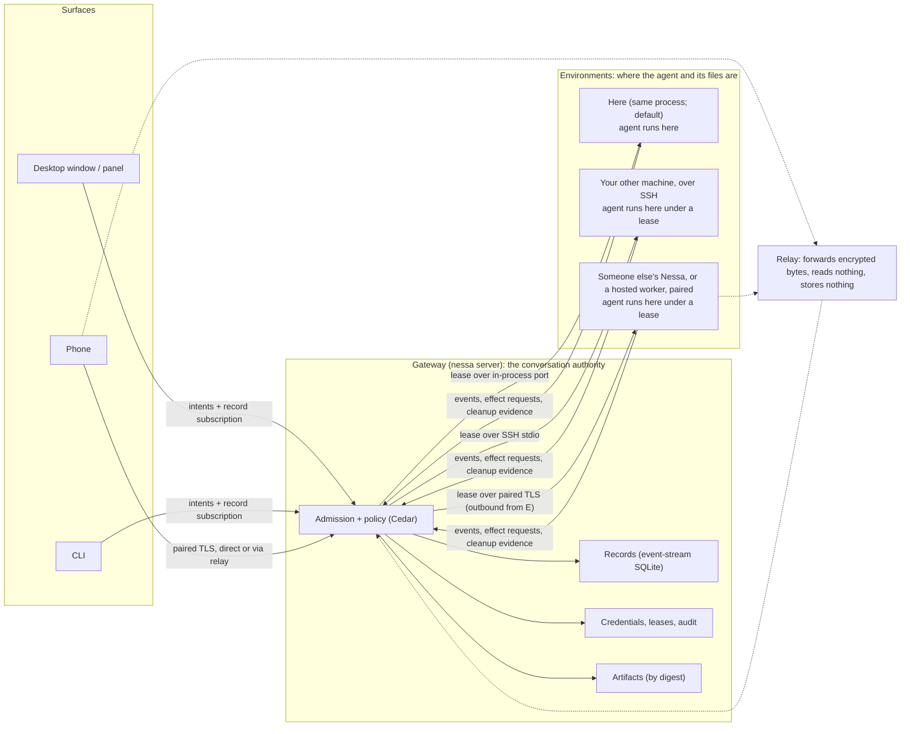

# Runtime architecture: how Nessa runs agents on one machine, and then on many

Owner: [#252](https://github.com/nessalabs/nessa-agent/issues/252). Status:
proposed design map, the companion to
[ADR 252](../adr/todo/252-runtime-roles-and-execution-leases.md). The ADR
holds the decision in one page; this document explains it for someone who
has not read the rest of the repository, then records the boundaries, the
current-versus-proposed state, where code goes, and the build order. It
builds on [0008](../adr/todo/0008-agent-client-api.md) (runtime),
[0009](../adr/todo/0009-reusable-event-stream-crate.md) (records),
[0011](../adr/todo/0011-nessa-session-protocol-and-authorities.md) (shared
delivery), [0010](../adr/done/0010-local-authentication.md) (identity),
[483](../adr/done/483-protocol-and-client-core-crates.md) (crate direction),
[0014](../adr/todo/0014-nessa-owned-policy-hooks.md) (policy),
[344](../adr/todo/344-mcp-ui.md) and [392](../adr/todo/392-remote-mcp-servers.md)
(extensions), and the sync lanes under #257, #263, #267, #270 and #273. It
redefines none of their protocols. Nothing here authorizes a runtime rewrite;
each slice is an issue of its own.

## How to read this

Start with [the words](#the-words), then [the picture](#the-picture), then
[seven situations](#seven-situations), which walk through what happens on one
laptop, with a phone, with a home server, with another machine you can SSH
into, with a machine that is not yours, when you build on the Mac mini and
run the result here, and when you share one conversation with a friend. Everything after that is the
contract behind those stories. [What we borrowed](#what-we-borrowed) says
where the ideas come from, with sources.

## The words

| Word | Meaning in Nessa |
| --- | --- |
| **Agent** or **harness** | The program that runs the model loop and its tools: Claude Code, Codex or OpenCode, started as a child process. Nessa does not run the model itself. |
| **Binding** | Nessa's adapter to one harness, over the [Agent Client Protocol](https://agentclientprotocol.com) (ACP). It starts the process, sends prompts, receives events, forwards permission requests, and cleans up. |
| **Conversation** | One thread of work with one agent: its prompts, replies, tool calls, approvals and outcome. It has an id that survives restarts and reconnects. |
| **Record** | One committed fact about a conversation: a prompt was accepted, a turn started, text arrived, a tool asked for permission, a turn ended. Records are appended to a stream in SQLite and never edited. Every view of a conversation is built by folding its records. |
| **Gateway** | The `nessa server` process. It is the only thing that accepts commands, writes records, evaluates policy and holds credentials. On a laptop it also runs the agents. |
| **Surface** | Anything a person looks at or types into: the desktop window, the floating panel, the CLI, a phone. A surface draws from records and sends intents. It never runs an agent and never writes a record. |
| **Environment** | A place an agent can run: this gateway's own machine (the default), another machine you own, a container, or someone else's gateway. The agent and the files it works on are in the same environment. |
| **Lease** | The gateway's recorded permission for one environment to run one conversation's agent for a bounded time with named limits. The only way execution moves. |
| **Authority** | Who gets the final say. The gateway that owns a conversation is its **conversation authority**. The gateway (or service) that owns a machine is that machine's **environment authority**. One process can be both; on a laptop it is. |
| **Replica** | A copy of records with no authority: a phone's cache, a relay's buffer, a backup. It can never act. |
| **Pairing** | How two things that have never met come to trust each other: a short code typed once, which produces a credential bound to a key. Used for phones, for other people's gateways, and for hosted workers. |
| **Mesh** | The set of gateways and devices a gateway has paired with or can reach over SSH, with each one's pinned key and last known addresses. Not a network of its own; it rides on whatever network exists. |
| **Relay** | A server that forwards encrypted bytes between two parties that cannot reach each other directly. It cannot read them. |
| **Sandbox** | A boundary the operating system or a container enforces around what the agent's commands may touch. A property of an environment, declared honestly. |

## The picture



Arrows are calls. The **agent itself**, the Claude, Codex or OpenCode
process, lives inside whichever environment holds the lease, together with
the files it edits and the commands it runs. It never runs in a surface, a
replica or the relay. There is **one lease contract** and **three ways to
carry it**: an in-process port (the default), an SSH connection to a machine
you already have access to, and a paired, encrypted connection to a machine
that is not yours or cannot be reached by SSH. The gateway does not change
between them, and neither do the records, the approvals or the audit.

## Seven situations

**1. One laptop.** You install Nessa. Setup creates the owner credential and
the panel's credential, starts the gateway, and the desktop window connects
to it. You start a conversation; the gateway issues itself a lease, starts
Claude Code as a child process in your account, and commits every event to
the conversation's record stream. The window folds those records into the
transcript. There is nothing to configure. The lease exists so that the
audit record says "ran here, as you, from this time to this time", in the
same shape it would have anywhere else.

**2. A phone.** In Settings › Linked devices you see an eight-character
code. You type it on the phone. Pairing (OPAQUE over TLS with the gateway's
key pinned) issues the phone a credential bound to the phone's own key, with
the grant to read your conversations. The phone keeps a private cache and
reads records as they are committed, directly on your network, or through a
relay when you are away. If the laptop is asleep, the phone shows what it
has and says fresh activity is waiting. When device commands land (#267),
you can send a prompt or stop a turn from the phone; the phone keeps the
intent until the gateway's receipt comes back, so a lost reply never runs a
prompt twice. The phone never runs an agent.

**3. A home server.** You want agents to keep running when the laptop is
closed. Run `nessa server` on the Mac mini. Pair the laptop's desktop app to
it the same way the phone paired: the laptop is now a surface over the home
server's conversations, with full grants because it is you. The records,
approvals, device registry and provider keys live on the Mac mini. Nothing
in this story needs a lease wire; the gateway moved whole, and that is the
recommended way to get a home server.

**4. Your other machine, over SSH.** You are on the laptop and want one
conversation to run on the build box, where the repository and the toolchain
are. You can already `ssh buildbox`. In the composer you pick "run on
buildbox". The gateway opens an SSH connection, on first use installs the
Nessa runtime there (the way VS Code's Remote-SSH installs its server), and
starts `nessa env serve`, which speaks the lease contract over the SSH
connection's standard input and output. The agent runs on buildbox, with
buildbox's files, under a lease that says which conversation, which
binding, which sandbox profile, and until when. Events come back over the
same SSH connection and the gateway commits them; a permission request
appears in your window exactly as a local one would; Stop ends the lease
and buildbox reports what it cleaned up. No new ports, no new credentials,
no relay: SSH is the authentication and the transport, and whatever makes
buildbox reachable (your LAN, Tailscale, a VPN) is not Nessa's concern. The
provider credential the agent uses is the one on buildbox, and buildbox
sees the whole conversation, because that is where the model loop runs.

**5. A machine that is not yours.** A friend offers their GPU box, or your
organization runs workers in containers. You cannot SSH there, and you
should not hold their credentials. Their gateway (or the worker, which is a
gateway with only the environment role enabled) pairs with yours using the
same eight-character code, and from then on connects **outbound** to your
gateway, directly or through a relay, the way a phone does. Your gateway
asks for a lease; theirs admits it under **their** policy, which may narrow
it (this binding only, this sandbox, no network, two hours) or refuse. The
conversation stays in your record stream; they keep their own audit of what
ran on their machine. The same mechanism, in the other direction, lets a
friend watch or command one of your conversations as a surface, under what
you grant. A conversation is never owned by both.

**6. Build on the Mac mini, run it here.** You are on the laptop. The Rust
build and the iPhone build belong on the Mac mini, where Xcode and the
toolchain are, and you want the DMG back on the laptop to run, and the
simulator's screenshots in the transcript as they happen. Two ways, both
inside the model:

- *Move the conversation.* Pick "run on macmini" for this conversation.
  The gateway leases it to the Mac mini over SSH (situation 4); the agent
  builds there. When it produces the DMG, the agent attaches it to the
  conversation: the environment publishes the file **by digest** to the
  gateway's artifact store over a separate artifact channel (sftp on the
  same SSH connection), the gateway records the hold, and every surface
  sees it in the transcript with a Download that fetches by digest and
  verifies it. A screenshot from the simulator is the same path with an
  image, so it appears in the pane on the laptop and on the phone as the
  agent takes it. To run the DMG here, the next turn is leased "here"; the
  laptop is itself an environment, and the agent opens the artifact it
  fetched by digest, after your approval. The harness session does not
  move with the lease; the new environment's harness starts fresh with
  Nessa's transcript as its context, and the map says so rather than
  pretending the native session resumed.
- *Delegate the build.* Keep the conversation on the laptop and have the
  agent hand "build the DMG and the screenshots" to a **child
  conversation** leased to the Mac mini ([ADR 329](../adr/todo/329-subagents.md)
  subagents, with the lease choosing the child's environment). The child's
  artifacts are delivered to the parent as results, by digest, and the
  parent carries on locally with its own context intact. This is the
  better fit when the local conversation is long-lived and the remote
  work is a step in it.

Either way the files travel only as artifacts: content-addressed, held by
the conversation, verified on receipt, audited on both sides. Nothing
mounts a filesystem across machines, and no file byte rides the lease's
control channel.

```mermaid
sequenceDiagram
    participant L as Laptop surface
    participant G as Gateway (laptop)
    participant M as Mac mini (nessa env serve over SSH)
    L->>G: "build the DMG" (run on macmini)
    G->>M: lease: conversation, binding, sandbox profile, deadline
    M-->>G: granted
    M->>M: harness runs cargo build, xcodebuild, simulator
    M-->>G: events (text, tool calls) tagged lease + turn
    M-->>G: artifact by digest over the artifact channel (screenshot.png)
    G->>G: commit records; record hold
    G-->>L: transcript shows the screenshot
    M-->>G: artifact by digest (Nessa.dmg)
    M-->>G: turn complete; cleanup evidence; lease ends
    L->>G: download Nessa.dmg
    G-->>L: bytes by digest, verified
    L->>G: "install and run it" (run here)
    G->>G: lease to the local environment; agent opens the artifact after approval
```

**7. Share one conversation with a friend.** You want Priya to see one
conversation, maybe to drive it, but never your others, and never with a
tool that could do harm on your machine. Her Nessa is paired with yours
(situation 5). In the conversation's header, Share: pick Priya, pick a
role, pick a tool policy. The grant names exactly one conversation id and
nothing else, so Cedar admits her commands on that resource and refuses
every other. The roles:

| Role | What Priya can do | Built on |
| --- | --- | --- |
| Read | Fold the records, watch it live | `conversation.read` on that id; the same grant a phone has |
| Comment | Leave notes the agent will see on the next turn you start, without starting one | 0011 phase B `record_only` and `next_turn` messages |
| Drive | Start turns, steer, stop, answer approvals, under her tool policy | `turn.start` and controls on that id |

The **tool policy** is per person, per conversation. Yours might be "all
tools, ask as usual"; hers "read-only tools" or "everything but shell
commands matching these patterns". It is a policy under 0014: a turn
Priya starts carries her policy revision in its acceptance record, the
gateway evaluates verdicts for that turn against it, and the environment
enforces the pre-tool verdicts from the snapshot the lease carries. Her
denied tool call is recorded with her as initiator and the rule as cause,
so the audit says who tried what and which rule said no. Your turns in the
same conversation run under your policy. Revoke is one row; her next
command is refused, and a turn she already started finishes under the
policy it was accepted with.

What is honest here: a pre-tool denial covers only calls the binding
gates through its permission exchange (0014). For Claude Code over ACP
that includes shell commands, so "no `rm -rf`" is enforceable as a deny
on the permission request; a tool the harness runs without asking is not
covered, and the share dialog says which tools the policy can and cannot
gate for this binding, from the capability declaration of #142.

## Leases

A lease is the only way execution moves. It is a record in the
conversation's stream, with an `ActionContext` (who asked, from which
surface, why), so replay shows who ran what, where, and when.

| Field | Meaning |
| --- | --- |
| Conversation, optional turn | What may run. A conversation lease covers successive turns while live; a turn lease covers one. |
| Environment | Which environment: this process, an SSH host, or a paired principal, identified by its pinned key. |
| Binding and model | Which harness and model the environment is to run. |
| Sandbox profile | What the environment must enforce around the agent's commands: none, the harness's own sandbox with these roots and domains, or a container. The environment declares what it can enforce; a profile it cannot enforce is refused at configuration, not silently weakened. |
| Grants | Held artifacts the environment may fetch by digest; the Nessa tools the agent may call through the relay; the policy snapshot revision to enforce before a tool runs. |
| Deadline and revision | When it lapses without renewal; which issuance this is. |

Rules that keep authority where it belongs:

- One conversation holds at most one live lease. Moving a conversation is:
  end the lease, then issue another. Whether the harness's own session can
  resume elsewhere is unknown per binding and is treated as unknown.
- The environment may narrow or refuse. The gateway records what was
  granted, not what was asked.
- Events are accepted only while the lease is live and only when they carry
  its id and the turn's id. Late or unlabelled output is dropped with
  evidence, never attached to the next turn (0008).
- A lease carries no right to write records and no right to answer
  approvals. The gateway commits what the environment reports; the
  environment keeps nothing durable past the lease but its own audit and
  its cleanup evidence.
- Ending a lease follows the 0008 Stop contract on the environment's side:
  cancel over ACP, close the process supervision scope, reap descendants,
  report exit and released resources within the deadline. Missing evidence
  makes the turn `interrupted` and the environment unavailable until it is
  accounted for.
- A replica never holds a lease. A restored gateway issues new leases only
  after the restore is explicitly accepted (#272).

Choosing where a conversation runs is choosing who sees it. The environment
runs the model loop with the prompt and its context, so it sees the whole
conversation, and the composer says so at the choice.

## Three transports, one contract

| Transport | For | Who connects to whom | Authentication | Reachability |
| --- | --- | --- | --- | --- |
| In-process port | This machine (the default) | Nobody; a function call | None needed | None needed |
| SSH | Machines you already have shell access to | The gateway runs `ssh host nessa env serve` and multiplexes the lease frames over its stdio | SSH's: your keys, your agent, your config | Whatever makes the host reachable today: LAN, Tailscale, a VPN, a bastion |
| Paired | Phones, other people's gateways, hosted workers | The less reachable or less trusted side connects **outbound** to the gateway; the relay carries it when neither can reach the other | A credential bound to a key, issued once by pairing, revocable in one row | LAN discovery, then direct, then relay |

The frames are the same on all three; only the pipe differs. That is what
keeps the gateway's conversation code from knowing where an agent runs.

**Why SSH is the first remote transport.** It is already there, already
authenticated, already reachable on every machine a developer owns, and it
is what people reach for first ("SSHing into that machine is pretty good
already"). VS Code's Remote-SSH, Codex's self-hosted executor and Cursor's
self-hosted workers all run the agent where the files are and carry the
control connection over something that already exists. Nessa does the
same, and builds no VPN.

**Why pairing is the second.** A phone has no SSH server; a friend will not
give you a shell; a container's lifetime is minutes. For these, the
existing pairing flow (an eight-character code, OPAQUE, a key-bound
credential) is the one way in, and the connection is outbound from their
side so nothing inbound ever opens on a machine that is not yours. A relay
is the fallback, and it forwards TLS it cannot open because the gateway's
key was pinned at pairing.

## The mesh

A gateway keeps a **peer table**: for every paired device or gateway, and
every SSH host it has been given, an id, a pinned public key, the grants in
each direction, and the last addresses it was reached at. That table is the
mesh. There is no coordination server, no overlay network and no address
assignment; Nessa rides on whatever network is there.

Finding a peer, in order:

1. **Local discovery.** A paired gateway announces itself on the LAN; a
   peer that hears it connects directly. (Syncthing's local discovery.)
2. **Last known address.** Try where it was last reached.
3. **Relay.** Both sides keep an outbound connection to a relay; the relay
   pairs them by id and forwards. Move back to direct when direct works.
   (Tailscale's DERP; Syncthing's relays.)

Trust never comes from the network. A peer is trusted because its key was
pinned at pairing, and what it may do comes from the grants in the table,
checked by Cedar on every command and every lease. Revoking a peer removes
its row; its next connection is refused.

Later, for ease of use, one gateway can **introduce** its peers to a new
device so a phone paired once sees the home server, the laptop and the
build box without three codes. That is Syncthing's introducer and is
deferred until there are three things to introduce.

## Sandboxes, honestly

Nessa does not sandbox the agent itself; the harness does, or the
environment does. Claude Code encloses its shell commands with Seatbelt on
macOS and bubblewrap on Linux, with a filesystem allowlist and a network
proxy, and leaves its file tools, MCP servers and hooks outside that
boundary; a separate runtime package can wrap the whole process. A
container encloses everything. A plain account encloses nothing.

So a sandbox profile in a lease is a request the environment answers with
what it can actually do:

| Profile | Enforced by | Covers | Does not cover |
| --- | --- | --- | --- |
| None | Nothing | Nothing | Everything; the agent runs as the account |
| Harness sandbox | The harness's own OS sandbox, configured by the binding | Shell commands and their children | The harness's file tools, MCP servers, hooks, the model loop's network |
| Container | The container runtime the environment was started in | The whole process tree | The container's own escape surface; whatever the lease let through |

The binding declares which profiles it can set up; the environment declares
which it can enforce; a request for more is refused at configuration time,
loudly (0014, #142). 0008 forbids claiming a sandbox that is not there.

## Sharing a conversation

A grant is `(principal, conversation id, role, tool policy revision)`,
stored by the gateway, evaluated by Cedar on every command and every
subscription batch, and recorded as a semantic record with the owner as
initiator. Nothing is granted by conversation list, by folder or by
default; a peer with no grant on an id cannot tell it exists.

- **Role** is Read, Comment or Drive, as in situation 7. Drive never
  includes delete, export, re-share or changing the model; those stay the
  owner's.
- **Tool policy** is a named 0014 policy: a preset ("read-only tools",
  "no shell", "ask for everything") or an allowlist and deny patterns.
  The turn's acceptance record carries the initiator's policy revision;
  verdicts and their evidence name it. Changing a policy affects turns
  accepted after the change.
- **Environment** is the owner's choice, not the sharer's. Priya driving a
  conversation leased to the owner's Mac mini runs on the owner's Mac mini
  under Priya's policy; the environment's own admission may narrow further.
- **Disclosure** follows the role: Read and Comment see the records;
  Drive additionally has its prompts become part of the conversation the
  environment sees.

## Artifacts across devices

An artifact is bytes identified by digest, media type and size, held by a
conversation, with one owner: the gateway's artifact store
(`attachments`, extended by #273). Everything that moves a file between
machines is a transfer of an artifact:

| Movement | Channel | Verified by |
| --- | --- | --- |
| Agent output on an environment to the gateway (a DMG, a screenshot, a log) | The **artifact channel**: sftp on the SSH connection; a bounded artifact stream on a paired connection | Digest on receipt; hold recorded with the lease as cause |
| Gateway to a surface (download, preview) | The existing ticketed `/attachments` path; the device's protected channel for phones | Digest on receipt |
| Gateway to an environment (an image in a prompt, a file the agent needs) | Lease-scoped ticket, fetched by digest | Digest on receipt |
| Surface upload (a screenshot you drag in) | The existing ticketed upload | Digest at the gateway |

The lease's control channel carries events and effect requests, never
file bytes. Artifact transfers are bounded per lease and per device
(budgets below), resumable by digest, and audited on both sides. A large
build output is an artifact like any other; what differs is only the
budget it is checked against.

## Records and replication

- The record is the unit. A semantic fact committed to a conversation
  stream, or to the principal's control stream for creation. Streams have
  incarnations and cursors; a cursor from another incarnation is a typed
  refusal, not a guess.
- One fold. `nessa-protocol` owns `ConversationView` and the projection.
  Every surface draws from it; nothing keeps a second transcript model.
- Delivery is replay then live, from the client's last applied cursor, in
  bounded batches, with the subscription closed when the client lags and
  reopened from its checkpoint (0009, 0011). The desktop's polling (1 s
  summaries, 250 ms transcript) is the interim and is retired by the same
  change that gives the phone live reads (#296, #277), so there is one read
  path to measure and secure.
- Replicas verify, they do not trust. The phone cache keeps scope,
  generation, deletion fences and reset receipts and refuses a record
  whose identity changed meaning ([read-only sync](read-only-sync-example.md)).
- Checkpoints of the fold are deferred until measured. The trigger: an
  attach whose replay from zero exceeds the interactive budget on the
  longest real history.
- Backup is an export cut, not a cache: records, metadata and audit from
  their owners at one consistent boundary, plus a deletion inventory. A
  restored gateway is quarantined: it serves reads and issues no leases
  until the person accepts it as the authority and every other copy is
  told (#270).

## Commands

One contract across every surface, already specified in 0008 and used by
the desktop today:

- Every mutation has a `requestId` chosen once by the surface. The accepted
  record is the receipt. An identical retry returns the receipt; a
  different payload under the same id is refused.
- A surface that may lose its process persists the intent before first
  send and, after restart, looks the receipt up before any retry. The
  phone outbox (#269) is the first implementation; the desktop adopts it
  to close gap G04, so a crashed window and a backgrounded phone recover
  the same way.
- Stop names the exact turn. `turn_busy` returns to the surface's draft
  and is never retried automatically.

## Identity and trust

| Principal | Credential | Grants | Issued by |
| --- | --- | --- | --- |
| Person (owner) | Local bootstrap, OS-protected | Everything on their organization | Setup; recovered offline |
| Bundled surface (panel, desktop window) | Private surface credential served by the host once the gateway is ready | Product methods for that surface | Provisioning (`--provision-local`) |
| Linked device | Key-bound credential from pairing | `conversation.read` first; command grants with #267 | The owner, in Settings › Linked devices |
| SSH host | None of Nessa's; SSH's own | Environment only, for leases this gateway issues | The owner, by naming the host |
| Peer gateway | Key-bound credential from pairing | Environment grants (admit leases, report events, request effects) and/or surface grants, each narrowed by the grantor's policy. Never both authorities over one conversation | The owner of each gateway, for the other |
| Hosted worker | Key-bound credential from pairing | Environment grants only, for one organization. No reads outside its leases | The organization |
| Extension | The opening's relay token | The tools its server exposes, under policy | The gateway, per harness opening |

Scale is by organization and by environments. One conversation authority
per organization deployment holds the records; environments are added for
capacity; surfaces are added for people. Replicating one organization's
conversation authority across gateways is not designed here and is gated
behind the audience generalization the
[identity direction](auth/identity-tenancy-and-cloud.md) already requires.

## Mediated effects

Three kinds of effect leave the environment and each has an owner. The
lease channel carries them when the environment is remote; nothing changes
locally.

| Effect | Path | Decided by |
| --- | --- | --- |
| A tool needs permission | Harness → binding's permission exchange → gateway interaction record → a surface answers → the answer returns over the lease | The person, through any surface; hooks under 0014 may deny first |
| The agent calls a Nessa tool | Harness → MCP stand-in → relay token → gateway product method under Cedar | The gateway, as for any caller |
| The agent reads an artifact | Environment asks for held bytes by digest under a lease-scoped ticket | The gateway's hold and ticket owner (`attachments`) |

## Current versus proposed

| Concern | Today | Proposed | Owner | Tracking |
| --- | --- | --- | --- | --- |
| Admission and policy | Mandatory `/session` auth, Cedar per operation, verified `ActionContext` into the SDK | Unchanged. Peer and worker principals get grant kinds of their own | Gateway `auth` application | 0010 done; #481 |
| Turn state and receipts | SDK `Agent` per conversation; creation receipts; `requestId` on every mutation | Unchanged. The same receipt path answers the phone outbox and a desktop outbox | SDK scheduling; gateway `conversation` | 0008; #267, #268 |
| Records | Semantic records on one event-stream SQLite runtime; bounded head/page reads; watch hints | Replay-to-live subscriptions; gateway views from committed records; desktop off polling | SDK `session_storage`; gateway delivery | 0009; #296, #277 |
| Phone reads | Device client with private cache, finite passes, retained watch; real paired process tests | Through pairing and the optional relay | `nessa-client-core`; gateway `device_pairing` | #257, #263, #262 |
| Phone commands | None | Durable intent outbox, receipt lookup before retry, exact-turn Stop | `nessa-client-core`; gateway receipts | #267 |
| Where agents run | In process only: gateway composes the SDK `Agent` and its ACP binding per conversation; Nessa advertises no ACP client filesystem or terminal | An `Environment` port in the conversation application with the in-process adapter first; a lease recorded for every run | Gateway `conversation` composition | New issue (step 7) |
| SSH environments | None | `nessa env serve` on the remote host, installed on first use; lease frames over SSH stdio | Gateway environment adapter; `nessa-server` CLI | New issue (step 8) |
| Peer gateways and hosted workers | None | Gateway-to-gateway pairing under a `gateway` principal kind; outbound connection from the environment side; relay fallback; environment-only gateways as workers | Gateway `device_pairing`, environment role; `nessa-auth` | New issues (steps 9, 10) |
| Sandboxes | Whatever the harness does by default | Sandbox profiles in the lease, declared per binding and per environment, refused when unenforceable | SDK bindings; environment adapters | Step 7 declaration; later profiles |
| Policy hooks | Capability reporting merged (#142); no configured pre-tool runtime | Verdicts at the gateway; pre-tool verdicts enforced by the environment's SDK from the snapshot the lease carries, with evidence | SDK application owner (0014) | #130 slices |
| Extensions | MCP Apps in a sandboxed iframe; one MCP connection per harness session; remote MCP with gateway-owned OAuth | Unchanged; an extension holds only the opening's token | Gateway `mcp_servers`, `mcp_authorization` | 344, 392 |
| Artifacts | Held by digest; single-use upload tickets; local manifest and range reads; uploads from surfaces only | An artifact channel from environments (sftp over SSH; bounded stream over a paired connection); lease-scoped tickets for environments; protected sync to devices | Gateway `attachments` | #273; step 8 |
| Sharing | Grants are per principal across its organization's conversations; devices get `conversation.read` on all of the owner's | Grants per conversation id with a role (Read, Comment, Drive) and a per-principal tool policy revision carried on each accepted turn | Gateway `auth`, `conversation`; 0014 policy owner | 0011 phase B; #130 slices; step 9 |
| Backup and restore | None | Export cut with deletion inventory; quarantined restore | New gateway module | #270 |
| Budgets | Every lane bounded; [limits.md](../limits.md) rendered from owners | Per-lease, per-peer and per-organization rows in the same table | `config.json`, protocol fixed values | Each slice |

## Where the code goes

```text
nessa-local-storage, nessa-local-database        leaves: files, SQLite
        ▲                     ▲
nessa-auth            nessa-sdk  ◄── event-stream (pinned)
        ▲                 ▲
        └──── nessa-protocol ◄── nessa-sync (pinned)      what both ends agree on
                   ▲         ▲
   nessa-client-core         nessa-server (one binary: `nessa server`,
   (phone, CLI, desktop-     ▲   `nessa env serve`; client-core as dev-dep only)
    as-device)               │
                       src-tauri host (reads endpoint + credential;
                                       never links the server)
```

Arrows point at the dependency. The rules already enforced by
`scripts/architecture/rust-dependency-graphs.mjs` stay. No new crate is
proposed. What is added, and where:

- **Lease frames** in `nessa-protocol`, because both ends of a connection
  agree on them (483's admission rule). The same frames travel the
  in-process port, SSH stdio and the paired channel.
- **`Environment` port** in the gateway's conversation application: open
  under a lease; prompt, steer, cancel; a stream of normalized events
  tagged with lease and turn; effect requests the gateway must answer;
  close with cleanup evidence. The in-process adapter is today's SDK
  composition behind that interface. The SSH adapter and the paired
  adapter are the other two implementations and the only code that knows
  a pipe.
- **`nessa env serve`** in the server CLI: the environment role alone,
  speaking lease frames on stdio (for SSH) or over a paired connection
  (for peers and workers). Its auth and audit are its own; it has no
  conversation streams and no surfaces.
- Inside the gateway, the two authorities are module boundaries:
  `conversation/` is the conversation authority; the SDK composition,
  `agents/` and the environment adapters are the environment role;
  `device_pairing/` and `product/` are the way in for surfaces and peers;
  `attachments/` is artifacts; `mcp_servers/` and `mcp_authorization/` are
  extensions. No module moves.

## Budgets

Every lane is bounded and every bound has one owner that
[limits.md](../limits.md) is rendered from. Rows added by the slice that
needs them:

| Row | What it bounds |
| --- | --- |
| `lease.event_buffer_bytes`, `lease.event_batch` | Events an environment may have in flight before backpressure or lease end |
| `lease.cleanup_deadline` | How long an environment has to report cleanup before the turn is `interrupted` |
| `peer.connections`, `peer.leases` | Live connections and leases per paired peer |
| `organization.environments`, `organization.leases` | Concurrent environments and leases per organization |
| `device.subscriptions`, `device.outbox_bytes` | Subscriptions one device may hold; intents it may hold unsent |
| `artifact.lease_bytes` | Bytes one lease may fetch by digest |
| `artifact.environment_bytes`, `artifact.environment_files` | Bytes and files one lease may publish to the gateway |
| `share.grants_per_conversation` | Grants one conversation may hold |

## Performance

- **What a person sees** is commit latency plus one socket write once
  subscriptions replace polling. Local commit p95 measured 108 ms over 64
  commits (#299). Measure again after #277 on the longest real
  conversation.
- **Replay** is linear in history; bounded pages keep each read small;
  checkpoints are built when the recorded trigger fires.
- **Remote environments** batch events at the SDK's commit cadence (100 ms,
  16 KiB or 64 messages). Over SSH that is one multiplexed stream; the
  lease buffer bounds what a slow link may hold. Files and shell output
  never cross the link at all, because the agent is where the files are.
- **Phone bandwidth** is cursor deltas in 16-record, 64 KiB pages with
  metered scheduling (#262).
- **Gateway CPU** is the SDK and SQLite. Leasing a conversation elsewhere
  moves the harness off the gateway machine, which is the first real
  scaling step.

## Security

- The gateway is the only writer of its records and the only place
  conversation policy runs. An environment is the only holder of its
  provider credentials and the only place its machine's policy runs. The
  lease bounds what the environment may do to the conversation; the
  environment's admission bounds what the conversation may do on the
  machine.
- Principals carry grant kinds that cannot express what their role must
  not do: a device cannot hold an environment grant; a worker cannot read
  outside its leases; a peer cannot hold both authorities over one
  conversation.
- SSH environments inherit SSH's trust and add none: Nessa issues no
  credential for a host you named, and the host's agent runs as the account
  you logged in as.
- Paired connections are outbound from the less trusted side; nothing
  inbound opens on a phone, a worker or a friend's machine. Pinned keys
  mean a relay forwards what it cannot read and cannot substitute.
- Credentials live in the private credential store, never in settings,
  prompts, URLs, tool arguments or logs. Pairing secrets are 40 bits of
  generated entropy, one use, with a durable attempt budget.
- No implicit promotion. Copies cannot become the authority; restore is an
  explicit, audited, quarantined act.
- Audit is part of the behavior on both sides: every lease issued, narrowed
  and ended, every effect mediated, every verdict, with target,
  before/after, cause and initiator, on cleanup and failure paths too. The
  environment's audit and the conversation's audit are separate facts.
- Sandboxes are declared, not assumed. Disclosure is said at the choice:
  the environment sees the conversation it runs.
- Extensions are sandboxed by origin and CSP and reach only their own
  server through the gateway under policy.

## Ease of use

- **Local first.** No account, no network, no signup. Setup provisions the
  owner and the panel; the desktop just works.
- **One code to pair, one host to name.** A phone or another Nessa links by
  typing eight characters. A machine you can SSH into needs only its name.
  Revoke is one row; forget a host is one row.
- **Honest state everywhere.** A sleeping gateway leaves the phone's cache
  readable and says fresh activity is waiting. An uncertain send shows as
  uncertain. A lease an environment narrowed shows what was granted. A
  sandbox that cannot be enforced is refused before the run, not after.
- **Same behavior on every surface.** Send, Stop, approve and queue mean
  the same thing from the panel, the window, the CLI and the phone.
- **Where it runs is one chip on the composer.** "Here", "buildbox", "Priya's
  Nessa", "org workers", each saying what it discloses and what sandbox it
  can give. Transcript, approvals and audit look the same for all of them.
- **Build there, run here, in one thread.** The DMG the Mac mini built is
  a Download in the transcript on every surface; the next turn can run on
  the laptop and open it. Screenshots arrive as the agent takes them.
- **Share one conversation, not your machine.** Pick a person, a role and
  a tool policy in the conversation's header. They see that thread and
  nothing else, and the audit says what they did.
- **Nothing to run that is not already running.** No daemon on the phone
  beyond the app, no VPN to install, no server on the build box until the
  first lease asks for it.

## Build order

Each step is its own issue and lands behind the gates in
`CODING_STANDARDS.md`. Phone sync finishes before any remote environment
exists; the port is extracted before any wire is written; SSH comes before
pairing of gateways because it needs no new trust.

| Step | Delivers | Gate to pass |
| --- | --- | --- |
| 1. Record subscriptions and committed views (#296, #277) | Replay-to-live for every surface; desktop off polling | Lagging-subscriber close, replay/live changeover, slow-client isolation, measured latency |
| 2. Device pairing and protected reads (#263: #264, #265) | A phone reads over its own credential | Real paired process tests; revocation ends the next read |
| 3. Relay and sleeping state (#266) | A phone away from home reaches the gateway | Direct and relay converge; metadata exposure measured |
| 4. Device commands (#267: #268, #269) | Prompt and exact-turn Stop from the phone, retry-safe | Lost acknowledgement cannot run twice; unknown outcomes rendered |
| 5. Backup and quarantined restore (#270) | A lost gateway is recoverable | Restore drill proves deletion boundaries, refuses ambiguous authority |
| 6. Artifacts over the paired channel (#273) | Images and files reach devices, verified | Digest verification; bulk audit bounded |
| 7. `Environment` port and local leases (new issue) | Today's behavior behind one typed port; a lease recorded for every run; per-binding sandbox-profile declaration | No behavior change; identical records and cleanup evidence before and after |
| 8. SSH environments (new issue) | `nessa env serve` over SSH stdio; "run on buildbox" in the composer; the artifact channel from an environment (situation 6) | Lease ends on Stop, close and connection loss with cleanup evidence; late events dropped; first-use install verified on macOS and Linux hosts; a DMG built remotely downloads and verifies by digest |
| 9. Peer gateways and per-conversation sharing (new issue) | Gateway-to-gateway pairing; outbound environment connection; relay fallback; local discovery; Share on one conversation with role and tool policy (situation 7) | Narrowed grants recorded; a peer cannot hold both authorities; revocation refuses the next connection; a shared turn runs under the sharer's policy with its denials attributed to them; an ungranted id is invisible |
| 10. Hosted workers (new issue) | Environment-only gateways per organization in containers | Two-organization isolation across leases, artifacts, tools and audit |
| 11. Hosted identity adapter (if hosted) | Login and membership from a provider behind Nessa's model | The adapter contract suite in the identity direction |

Steps 1 to 6 are the phone. Steps 7 to 10 are environments. Step 1 serves
both and is why it goes first.

## What we borrowed

- **Run the agent where the files are; carry only control.** VS Code's
  Remote-SSH installs its server on the remote host over SSH and keeps the
  UI local; OpenAI's self-hosted Codex runs the harness on their side and a
  `codex exec-server` executor in your environment that connects outbound
  over WebSocket with a key that can do nothing else; Cursor's self-hosted
  workers run the CLI and hold a long-lived outbound HTTPS connection. All
  three avoid inbound ports and avoid moving files over the control link.
  Nessa's SSH and paired transports follow that shape.
- **Control plane and data plane apart; relays that cannot read.**
  Tailscale's coordination server is a "key drop box" that distributes
  public keys and policy and never sees traffic; DERP relays forward
  already-encrypted packets. Nessa's gateway holds keys and policy, and its
  relay forwards TLS it cannot open.
- **Identity is a key; find by id, not by address.** Syncthing's device id
  is the hash of the device's certificate, peers are added by id, and
  discovery (local broadcast, then a discovery server, then a relay) finds
  the address. Nessa's pinned keys from pairing, its peer table and its
  find-order follow that; introducers are the later convenience.
- **Sandboxing belongs to the thing that runs the commands.** Claude Code
  encloses shell commands with Seatbelt or bubblewrap and leaves file tools,
  MCP servers and hooks outside; Codex cloud and Cursor cloud run each task
  in a fresh container. Nessa asks for a profile and records what the
  environment could enforce.
- **Do not build the client filesystem seam.** ACP v1 lets a client serve
  files and terminals to the agent, but neither clients nor agents adopted
  it, Nessa advertises it as unsupported today, and ACP's v2 draft removes
  it in favor of agent-owned sandboxing and execution configuration. An
  earlier draft of this map proposed a "workspace lease" over that seam; it
  is withdrawn.

Sources: [How Tailscale works](https://tailscale.com/blog/how-tailscale-works),
[DERP servers](https://tailscale.com/kb/1232/derp-servers),
[Tailscale SSH](https://tailscale.com/blog/tailscale-ssh),
[Syncthing security](https://www.mankier.com/7/syncthing-security),
[Syncthing local discovery](https://docs.syncthing.net/specs/localdisco-v4.html),
[Syncthing introducer](https://docs.syncthing.net/users/introducer.html),
[VS Code Remote SSH](https://code.visualstudio.com/docs/remote/ssh),
[VS Code Server](https://code.visualstudio.com/docs/remote/vscode-server),
[Codex self-hosted environments](https://developers.openai.com/api/docs/guides/agents-api/environments/self-hosted),
[Claude Code sandboxing](https://code.claude.com/docs/en/sandboxing),
[ACP v2 RFD: client filesystem and terminal capabilities](https://agentclientprotocol.com/rfds/v2/client-filesystem-terminal-capabilities).

## Unresolved contracts

Named so they are not mistaken for settled:

- **Lease frame format.** The fields above are the contract; the frames,
  their bounds and their place in `nessa-protocol` are step 7's design.
- **First-use install over SSH.** What `nessa env serve` needs on the host
  (Rust binary per platform, the harness itself, its credential), and how
  version skew between gateway and environment is refused.
- **Sandbox profiles.** Which profiles each pinned binding can set up and
  how an environment proves what it enforces; today's answer for every
  binding is "harness default".
- **Peer policy vocabulary.** What an environment may narrow in a lease and
  how that is written in Cedar.
- **Local discovery.** Whether to announce at all by default, and what the
  announcement reveals.
- **Which tools a policy can gate, per binding.** The share dialog must
  say it; the answer comes from the #142 declaration and the 0014 survey.
- **Artifact channel bounds and resumption.** Chunk size, per-lease
  budgets, and resuming a large transfer by digest after a dropped SSH
  connection.
- **Delegating to an environment.** How a parent names the child's
  environment under ADR 329, and how the child's artifacts are delivered
  as results.
- **Hook enforcement at the environment.** Which verdicts must land before
  a tool runs remotely and how the snapshot travels (0014).
- **Fold checkpoints.** Deferred with a written trigger.
- **Relay with storage.** A relay that holds a catch-up feed is a replica
  with an address; separate decision.
- **Provider session portability.** Unknown per binding.
- **Absent-person approvals** (#141).
- **Multi-replica conversation authority.** Not planned.
