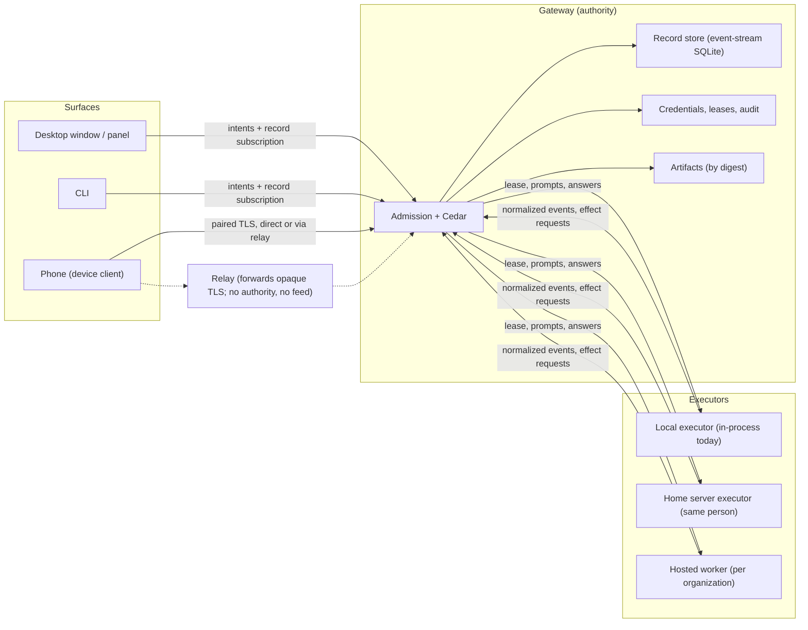

# Runtime architecture: roles, authority and expansion boundaries

Owner: [#252](https://github.com/nessalabs/nessa-agent/issues/252). Status:
proposed design map, the companion to
[ADR 252](../adr/todo/252-runtime-roles-and-execution-leases.md). The ADR holds
the decision; this document holds the boundaries, the current-versus-proposed
state, where code goes, and the build order. It builds on
[0008](../adr/todo/0008-agent-client-api.md) (runtime),
[0009](../adr/todo/0009-reusable-event-stream-crate.md) (records),
[0011](../adr/todo/0011-nessa-session-protocol-and-authorities.md) (shared
delivery), [0010](../adr/done/0010-local-authentication.md) (identity),
[483](../adr/done/483-protocol-and-client-core-crates.md) (crate direction),
[0014](../adr/todo/0014-nessa-owned-policy-hooks.md) (policy),
[344](../adr/todo/344-mcp-ui.md) and [392](../adr/todo/392-remote-mcp-servers.md)
(extensions), and the sync lanes under #257, #263, #267, #270 and #273. It
redefines none of their protocols. Nothing here authorizes a runtime rewrite;
each slice is an issue of its own.

## The shape in one paragraph

Nessa is a **home gateway**. One gateway per person today, one per organization
later, is the only thing that admits commands, writes records, evaluates policy
and holds credentials. Everything else is one of two kinds of process: a
**surface**, which draws committed records and sends intents, or an
**executor**, which runs a harness under a lease the gateway issued and streams
what the harness did back to the gateway. A phone cache, a relay buffer and a
backup are **replicas**: copies of records with no role at all, and no path to
one except an explicit restore. Execution authority moves only by lease, never
by owning a copy of the data.



Arrows are calls. The relay is dotted because it carries bytes it cannot read.
Executors never touch the record store or the credential store; the gateway
commits what they report, under the lease that produced it.

## Roles

| Role | Owns | Never does |
| --- | --- | --- |
| **Authority** (the gateway, `crates/nessa-server`) | Authentication and Cedar admission (0010); one active turn per conversation and every receipt (0008); the committed record streams and their catalogue (0009); approvals and their answers; policy verdicts (0014); device, surface and executor credentials; artifact holds; leases; audit | Draw a transcript; keep a second turn state machine in a surface; accept a record from anything but a live lease |
| **Surface** (desktop, panel, CLI, phone; `src/`, `packages/nessa-client`, `crates/nessa-client-core`) | Folding committed records into a view with the one fold in `nessa-protocol`; drafts and an outbox of intents keyed by `requestId`; presentation and local preferences | Admit or retry a command on its own authority; execute a tool; write a record; infer turn state from provider text |
| **Executor** (today: the gateway process itself, through the SDK `Agent`; later: a home server or hosted worker) | Harness processes and every OS resource they create, per conversation supervision scope (0008 cleanup contract); translating the harness's events to the normalized payload; forwarding mediated effects (approvals, artifact reads, Nessa tool calls) to the gateway | Decide an approval; hold a credential other than its lease; keep history past the lease; write records |
| **Replica** (phone cache, relay, backup) | A verified copy with scope, generation and reset receipts ([read-only sync](read-only-sync-example.md)) | Anything. A replica has no grants. Promotion is an explicit, quarantined restore (#270, #272) |

The test for a role boundary is the one `codebase-structure.md` already uses
for the core: could this piece serve a Nessa with no menu bar at all? A rule
that makes sense only inside the gateway process (admission, policy, the
record writer) belongs to the authority. A rule a phone needs as well as the
desktop (the fold, the outbox) belongs to the surface libraries. A rule about
processes and their cleanup belongs to the executor. The same code may host
two roles in one process, as the gateway does today, but the seam between them
is a typed port, not shared state.

## Current versus proposed

| Concern | Today | Proposed | Owner | Tracking |
| --- | --- | --- | --- | --- |
| Admission and policy | Mandatory `/session` auth, Cedar per operation, verified `ActionContext` into the SDK | Unchanged. Executor and device principals get grants of their own kind (below) | Gateway `auth` application | 0010 done; #481 publishes required grants |
| Turn state and receipts | SDK `Agent` per conversation; creation receipts via `CreationCoordinator`; `requestId` on every mutation | Unchanged contract. The same receipt path answers the phone outbox (#269) and a desktop outbox (closes gap G04) | SDK scheduling; gateway `conversation` | 0008; #267, #268 |
| Records | Semantic records on one event-stream SQLite runtime; bounded head/page reads over `/session`; watch hints | Replay-to-live **subscriptions** with cursors, bounded batches and lagging-subscriber close; gateway views served from committed records | SDK `session_storage` writer and source; gateway delivery adapter | 0009; #296, #277 |
| Desktop reads | Polling: 1 s summaries, 250 ms active transcript, serialized per conversation | The desktop subscribes like any other surface. Polling is retired once subscriptions exist | `src/desktop/workspace/adapters/gateway` | #277 then a desktop slice |
| Phone reads | Device client with private cache, finite passes, retained watch; real paired process tests | Deliver through pairing and the optional relay. No execution authority, ever | `nessa-client-core`; gateway `device_pairing` | #257, #263 (#264, #265, #266), #262 |
| Phone commands | None | Durable intent outbox, read-only receipt lookup before any retry, exact-turn Stop, honest unknown outcomes | `nessa-client-core` outbox; gateway receipts | #267 (#268, #269) |
| Execution environment | In-process: gateway composes the SDK `Agent` and its ACP binding per conversation | An `ExecutionEnvironment` port in the gateway with the in-process adapter as its first implementation; a remote adapter speaking the lease contract later | Gateway `conversation` composition; SDK provider ports | New issue (below) |
| Remote executors | None | A `nessa-executor` binary: `nessa-sdk` plus `nessa-protocol`, no gateway code; one lease at a time per conversation | New crate | New issue, after phone sync |
| Mediated effects | Approvals through ACP permission exchange, answered by a surface; Nessa tools through `nessa mcp-relay` per harness session; images by digest and ticket | Same three paths, carried over the lease channel when the executor is remote. Nothing new is invented for the local case | SDK permissions; gateway `mcp_servers`, `attachments` | 0012, 344, #273 |
| Policy hooks | Capability reporting merged (#142); no configured pre-tool runtime | Verdicts evaluated at the gateway; a verdict that must land before a tool runs is enforced by the executor's SDK from the policy snapshot the lease carries, with evidence returned | SDK application owner (0014) | #130, #132, #133, #136 |
| Extensions | MCP Apps in a sandboxed iframe on another origin; one MCP connection per harness session; remote MCP with gateway-owned OAuth | Unchanged. An extension never holds a gateway credential; it holds the relay token for one opening | Gateway `mcp_servers`, `mcp_authorization`; desktop `widgets/app` | 344, 392 |
| Artifacts | Held per conversation by digest; bytes over `PUT /attachments` under a single-use ticket; local manifest and range reads | Lease-scoped tickets so a remote executor reads held bytes by digest; protected sync of artifacts to devices | Gateway `attachments` | #273 |
| Backup and restore | None | Consistent export cut across record, metadata and audit owners; deletion inventory; a restored gateway is quarantined until authority transfer is explicit | New gateway module | #270 (#271, #272) |
| Identity | Principal, organization, credential; local bootstrap; devices paired with OPAQUE over pinned raw-key TLS | Executors and devices are principals with narrow grant kinds. Audience generalizes to a logical deployment before any gateway replica | `nessa-auth` | 0010 done; [identity direction](auth/identity-tenancy-and-cloud.md) |
| Budgets | Every lane bounded; [limits.md](../limits.md) rendered from owners | Add per-lease, per-device and per-organization rows to the same table; no second limits document | `config.json`, protocol fixed values | Each slice adds its rows |

## Where the code goes

```text
nessa-local-storage, nessa-local-database        leaves: files, SQLite
        ▲                     ▲
nessa-auth            nessa-sdk  ◄── event-stream (pinned)
        ▲                 ▲
        └──── nessa-protocol ◄── nessa-sync (pinned)      what both ends agree on
                   ▲         ▲
   nessa-client-core         nessa-server (gateway; client-core as dev-dep only)
   (phone, CLI, desktop-     ▲                ▲
    as-device)               │                │
                       src-tauri host   (future) nessa-executor
                       (reads endpoint        nessa-sdk + nessa-protocol,
                        + credential;         never nessa-server
                        never links server)
```

Arrows point at the dependency. The rules already enforced by
`scripts/architecture/rust-dependency-graphs.mjs` stay: the gateway never
links the device client in production; the device client never reaches the
gateway; nothing portable links the desktop framework. Two rules are added
when their crates appear:

- `nessa-executor` depends on `nessa-sdk` and `nessa-protocol` and never on
  `nessa-server`. The lease contract's wire types live in `nessa-protocol`,
  because both ends agree on them (483's admission rule).
- The gateway's `ExecutionEnvironment` port is defined in the gateway's
  conversation application layer. Its in-process adapter wraps today's SDK
  `Agent` composition; its remote adapter is the only code that speaks the
  lease wire. Neither adapter is reachable from a surface.

Inside the gateway, the role seam is a module boundary: `conversation/`
(authority: admission, receipts, views), `agents/` and the SDK composition
(local executor), `device_pairing/` and `product/` (surfaces' way in),
`attachments/` (artifacts), `mcp_servers/` and `mcp_authorization/`
(extensions). The proposal moves no module; it names which role each serves so
a new file has one place to go.

## The five seams

1. **Admission** (exists). A surface's command is authenticated, authorized by
   Cedar on the server-resolved resource, given a verified `ActionContext`,
   and only then reaches the SDK. Receipt retries pass the same gate. Nothing
   below the gate knows about grants.
2. **Records** (exists; delivery proposed). The SDK commits semantic records
   before publishing. The gateway serves committed records and nothing else:
   bounded reads today, subscriptions under #296/#277. The fold that turns
   records into a `ConversationView` lives once, in `nessa-protocol`, so the
   phone, the desktop and a test draw the same transcript from the same bytes.
3. **Execution** (proposed port, existing behavior). `ExecutionEnvironment`
   is what the conversation application asks to run a turn: open under a
   lease; prompt, steer, cancel; a stream of normalized events tagged with
   lease and turn; effect requests the gateway must answer; close with cleanup
   evidence. The in-process adapter is today's code behind that interface.
   Extracting it changes no behavior and is the gate for everything remote.
4. **Device** (exists in part). OPAQUE pairing over pinned-key TLS issues a
   device credential with `conversation.read`; protected reads and watch run
   over that channel ([device pairing](auth/device-pairing.md)). The outbox
   adds intents over the same channel with the same `requestId` contract.
5. **Extension** (exists). Each harness opening gets one MCP session per
   configured server through the relay; apps reach their own server through
   gateway methods under policy and audit; the window hosts them on a
   sandbox origin. An extension's authority is the opening's token, revoked
   when the opening ends.

## Execution leases

A **lease** is the gateway's record that one executor may run work for one
conversation, for a bounded time, with named grants. It is a semantic record
in the conversation's stream with an `ActionContext`, so replay shows who ran
what, where, and why.

| Field | Meaning |
| --- | --- |
| `conversationId`, optional `turnId` | What may run. A conversation-scoped lease covers successive turns while live; a turn-scoped lease covers one |
| Executor principal and environment identity | Who runs it and on which machine or container. The environment identity is the executor's pinned key, not a hostname |
| Grants | Held artifacts readable by digest; the Nessa tool allowlist for the relay; the policy snapshot revision the executor enforces |
| Deadline and revision | When the lease lapses without renewal; which issuance this is. Stop, conversation close, revocation and policy stops all end it |

Rules that keep authority where it is:

- Events are accepted only while the lease is live and only when they carry
  its id and the turn's id. Late or unlabelled output is dropped with
  evidence, never attached to the next turn (0008).
- A lease carries no record-write right. The gateway commits what the
  executor reports; the executor keeps nothing durable past the lease but its
  cleanup evidence.
- Ending a lease follows the 0008 Stop contract from the executor's side:
  cancel over the protocol, close the supervision scope, report exit and
  released resources within the deadline. Missing evidence makes the turn
  `interrupted` and the environment unavailable until it is accounted for.
- A replica never holds a lease. A restored gateway issues new leases only
  after the restore is explicitly accepted (#272).
- One lease per conversation at a time. A conversation does not run on two
  executors; moving it is end one lease, then issue another, with the
  provider's own session resumability treated as unknown until proved.

The local executor needs none of this wire. It gets the same port and a lease
that is issued and ended in process, so that the audit record, the cleanup
evidence and the turn state are identical whether the harness ran on this
machine or another. That is what lets a phone's view of a turn mean the same
thing in both cases.

## Mediated effects

Three kinds of effect leave the executor's environment and all three already
have an owner. The lease channel carries them when the executor is remote;
nothing changes for the local case.

| Effect | Path | Decided by |
| --- | --- | --- |
| A tool needs permission | Harness → executor SDK permission exchange → gateway interaction record → a surface answers → the answer returns over the lease | The person, through any surface; hooks under 0014 may deny first |
| The agent calls a Nessa tool | Harness → MCP stand-in → relay token → gateway product method under Cedar | The gateway, as for any caller |
| The agent reads an artifact | Executor asks for held bytes by digest under a lease-scoped ticket | The gateway's hold and ticket owner (`attachments`) |

Isolation is stated honestly, per environment, because authorization is not a
sandbox ([identity direction](auth/identity-tenancy-and-cloud.md#isolation-without-a-network-hop-for-every-policy-check)):

- **Local executor**: the person's own account. There is no sandbox and 0008
  forbids claiming one. The ACP binding documents its actual file and tool
  access.
- **Home server executor**: another machine the same person owns, same
  trust, same statement.
- **Hosted worker**: a container or VM per organization. That boundary is the
  isolation. A worker holds one organization's leases and nothing else; two
  organizations never share a worker process.

## Records and replication

- The record is the unit. A semantic fact committed to a conversation stream,
  or to the principal's control stream for creation. Streams have
  incarnations and cursors; a cursor from another incarnation is a typed
  refusal, not a guess.
- One fold. `nessa-protocol` owns `ConversationView` and the projection.
  Every surface draws from it; nothing keeps a second transcript model.
- Delivery is replay then live, from the client's last applied cursor, in
  bounded batches, with the subscription closed when the client lags and
  reopened from its checkpoint (0009, 0011). The desktop's polling is the
  interim and is retired by the same change that gives the phone live
  reads, so there is one read path to measure and secure.
- Replicas verify, they do not trust. The phone cache keeps scope,
  generation, deletion fences and reset receipts and refuses a record whose
  identity changed meaning. The relay forwards TLS bytes it cannot open: the
  gateway's key is pinned at pairing, so a relay cannot terminate the
  connection or substitute records; it can only delay or drop, which the
  client reports as unknown freshness. The relay stores no catch-up feed in
  its first form (#266).
- Checkpoints of the fold are deferred until measured. The trigger to build
  them is written down: an attach whose replay from zero exceeds the
  interactive budget on the longest real history. Until then, replay from
  zero with bounded pages is the contract.
- Backup is an export cut, not a cache. It carries records, metadata and
  audit from their owners at one consistent boundary plus a deletion
  inventory, so a restore cannot resurrect what was deleted. A restored
  gateway is quarantined: it serves reads and issues no leases until the
  person accepts it as the authority and every other copy is told (#270).

## Commands

One contract across every surface, already specified in 0008 and used by the
desktop today:

- Every mutation has a `requestId` chosen once by the surface. The accepted
  record is the receipt. An identical retry returns the receipt; a different
  payload under the same id is refused.
- A surface that may lose its process persists the intent before first send
  and, after restart, looks the receipt up before any retry. The phone outbox
  (#269) is the first implementation; the desktop adopts it to close G04, so
  a crashed window and a backgrounded phone recover the same way.
- Stop names the exact turn. `turn_busy` returns to the surface's draft and
  is never retried automatically.
- The phone's intents travel the paired channel, pass the same admission as
  the desktop's, and are recorded with the device's principal and surface.

## Identity and trust

| Principal kind | Credential | Grants | Issued by |
| --- | --- | --- | --- |
| Person (owner) | Local bootstrap, OS-protected | Everything on their organization | Setup; recovered offline |
| Bundled surface (panel, desktop window) | Private surface credential served by the host once the gateway is ready | Product methods for that surface | Provisioning (`--provision-local`) |
| Linked device | Credential bound to an Ed25519 key, issued after OPAQUE pairing | `conversation.read` first; command grants when #267 lands | The owner, through Settings › Linked devices |
| Executor | Credential bound to the environment's key | Execution grants only: accept a lease, report events, request mediated effects. No reads outside its leases | The owner for a home server; the organization for hosted workers |
| Extension | The opening's relay token | The tools its server exposes, under policy | The gateway, per harness opening |

Scale is by organization and by executors. One authority per organization
deployment holds the records; executors are added for capacity; surfaces are
added for people. Replicating one organization's authority across gateways is
not designed here and is gated behind the audience generalization the
identity direction already requires. Hosted login, when it comes, is an
adapter behind Nessa's own identity model, never the model itself.

## Budgets

Every lane is bounded and every bound has one owner that
[limits.md](../limits.md) is rendered from. Proposed rows, added by the slice
that needs them:

| Row | What it bounds |
| --- | --- |
| `lease.event_buffer_bytes`, `lease.event_batch` | Normalized events an executor may have in flight before the gateway applies backpressure or ends the lease |
| `lease.cleanup_deadline` | How long an executor has to report cleanup before the turn is `interrupted` |
| `organization.executors`, `organization.leases` | Concurrent executors and live leases per organization |
| `device.subscriptions`, `device.outbox_bytes` | Subscriptions one device may hold; intents it may hold unsent |
| `artifact.lease_bytes` | Bytes one lease may fetch by digest |

Existing bounds keep their owners: the SDK's queue, channel, frame and
controller limits; the gateway's admission and socket lanes; the client's
preparing retries.

## Performance

- **Latency a person sees** is commit latency plus one socket write once
  subscriptions replace polling. Local commit p95 was measured at 108 ms
  over 64 commits (#299); the 250 ms poll and the read behind it go away.
  Measure again after #277 on the longest real conversation and record it.
- **Replay cost** is linear in history. Bounded pages keep each read small;
  checkpoints are the escape hatch and are built only when the recorded
  trigger fires.
- **Executor streaming** keeps the SDK's commit cadence (100 ms, 16 KiB or
  64 messages). A remote executor batches at the same cadence; the lease
  buffer bounds what a slow link may hold.
- **Phone bandwidth** is cursor deltas in 16-record, 64 KiB pages with
  metered scheduling measured under #262. Catalogue passes resolve only
  changed entries.
- **Gateway CPU** is the SDK and SQLite. Image normalization and record
  validation are the measured hot spots today; executors move the harness
  off the gateway machine, which is the first real scaling step.

## Security

What is enforced, and where:

- The gateway is the only writer and the only place policy runs. Surfaces
  and executors are authenticated principals with grant kinds that cannot
  express what their role must not do: a device cannot hold an execution
  grant; an executor cannot hold a read grant outside its leases.
- Credentials live in the private credential store, never in settings,
  prompts, URLs, tool arguments or logs. Pairing secrets are 40 bits of
  generated entropy, one use, with a durable attempt budget.
- The relay is untrusted by construction. Pinned raw-key TLS from device to
  gateway means the relay sees metadata (timing, sizes, endpoints) and
  nothing else. #266 measures that exposure.
- No implicit promotion. Copies cannot become the authority; restore is an
  explicit, audited, quarantined act.
- Audit is part of the behavior: every lease issued and ended, every
  effect mediated, every verdict, with target, before/after, cause and
  initiator, on cleanup and failure paths too.
- Isolation claims are per environment and honest. The local executor has
  none; the hosted worker's boundary is the container.
- Extensions are sandboxed by origin and CSP and reach only their own
  server through the gateway under policy.

What is not solved here and is said so below: end-to-end encryption that
hides content from a Nessa-operated relay is the design above; a relay that
also stores a catch-up feed would need a different trust statement.

## Ease of use

- **Local first.** No account, no network, no signup. Setup provisions the
  owner and the panel; the desktop just works.
- **One code to pair.** A phone, or a second desktop, links by typing eight
  characters shown in Settings. Revoke is one row. The desktop app itself
  can be a linked device to a home server running `nessa server`, through
  the same pairing; that is how "my Mac mini runs the agents" works without
  a hosted account.
- **Honest state everywhere.** A sleeping gateway leaves the phone's cache
  readable and says fresh activity is waiting. An uncertain send shows as
  uncertain, with the receipt lookup doing the recovery.
- **Same behavior on every surface.** Send, Stop, approve and queue mean the
  same thing from the panel, the window, the CLI and the phone, because
  they are one contract behind one gate.
- **Executor is a choice, not a mode.** "Run this conversation here", "on
  my home server" or "in the cloud" is a per-conversation choice at
  creation. The transcript, the approvals and the audit look identical.

## Build order

Each step is its own issue and lands behind the gates in
`CODING_STANDARDS.md`. Phone sync is complete before any remote executor
exists; the execution port is extracted before any remote wire is written.

| Step | Delivers | Gate to pass |
| --- | --- | --- |
| 1. Record subscriptions and committed views (#296, #277) | Replay-to-live for every surface; desktop off polling | Lagging-subscriber close, replay/live changeover, slow-client isolation, measured latency |
| 2. Device pairing and protected reads (#263: #264, #265) | A phone reads its conversations over its own credential | Real paired process tests; revocation ends the next read |
| 3. Relay and sleeping state (#266) | A phone away from home reaches the gateway | Direct and relay converge to one checkpoint; metadata exposure measured |
| 4. Device commands (#267: #268, #269) | Prompt and exact-turn Stop from the phone, retry-safe | Lost acknowledgement cannot run twice; unknown outcomes rendered |
| 5. Backup and quarantined restore (#270: #271, #272) | A lost gateway is recoverable | Restore drill proves deletion boundaries and refuses ambiguous authority |
| 6. Artifacts over the paired channel (#273) | Images and files reach devices, verified | Digest verification; bulk audit bounded |
| 7. `ExecutionEnvironment` port (new issue) | Today's in-process executor behind a typed port; leases recorded locally | No behavior change; identical records and cleanup evidence before and after |
| 8. `nessa-executor` and the lease wire (new issue) | A home server runs a conversation's harness | Lease ends on Stop, close and revocation with cleanup evidence; late events dropped; one lease per conversation |
| 9. Hosted workers and organization isolation (new issue) | Executors per organization in containers | Two-organization isolation tests across leases, artifacts, tools and audit |
| 10. Hosted identity adapter (if hosted) | Login and membership from a provider behind Nessa's model | The adapter contract suite in the identity direction |

Steps 1 to 6 are the phone. Steps 7 to 9 are remote execution. Step 1 serves
both and is why it goes first.

## Unresolved contracts

Named so they are not mistaken for settled:

- **Lease wire format.** The fields above are the contract; the frames,
  their bounds and their place in `nessa-protocol` are step 8's design.
- **Hook enforcement at the executor.** Which verdicts must land before a
  tool runs on a remote executor, and how the policy snapshot travels, is
  0014's remaining work extended by step 8.
- **Fold checkpoints.** Deferred with a written trigger; the storage shape
  is undecided.
- **Relay with storage.** A relay that holds a catch-up feed changes the
  trust statement and is a separate decision.
- **Provider session portability.** Whether a harness's native session can
  resume on another executor is unknown per binding and is treated as
  unknown.
- **Absent-person approvals.** Remembered approvals and bounded automatic
  decisions (#141) decide what an unattended executor does at a permission
  prompt.
- **Multi-replica authority.** Not planned; gated behind audience
  generalization.
