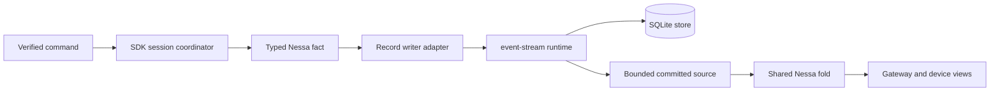
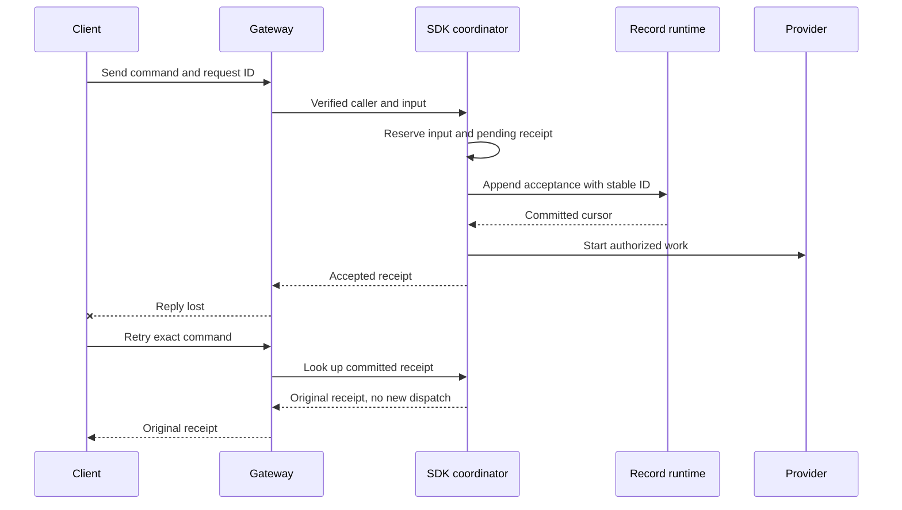
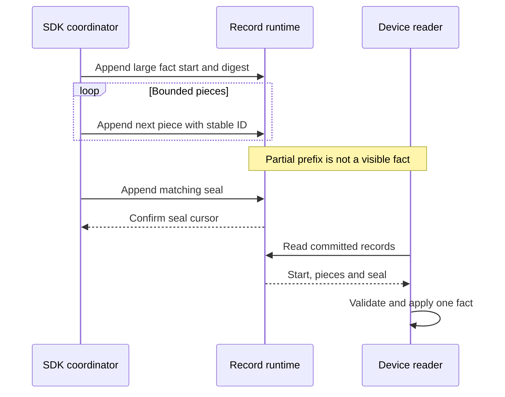

# Semantic record writer for new conversations

**Status:** design for [#275](https://github.com/nessalabs/nessa-agent/issues/275), not yet implemented. This narrows [ADR 0009](../adr/todo/0009-reusable-event-stream-crate.md) to the first live write path. Legacy JSONL import is deferred. An existing JSONL conversation continues on its current storage path; a new conversation selects its one storage authority at creation and cannot switch silently.

## What this changes

The SDK currently saves a complete `SessionSnapshot` through `SessionStorageLease`. The new writer will save Nessa facts at the SDK decision that produces each fact. `event-stream` provides ordered, durable physical records and cursors; the SDK owns their meaning, command receipt lookup, and whether provider work may start. A phone reads committed facts through a later bounded record source. The provider never runs during replay.

The adapter is selected in server composition and injected through an SDK-owned port. The SDK retains its exclusive conversation lease for the life of the manager. A successful append returns the committed cursor. A timeout or dropped reply leaves the command unresolved until the same event ID and exact bytes are found or retried. The writer serializes each typed fact once and keeps those bytes across that reconciliation.

## Commit boundaries

The SDK's current decision sites define the facts. A pending set is retained inside `Evidence` when observed state advances but a save has not committed. It contains exact typed changes in decision order; `flush_observed` commits those changes as one atomic logical fact when more than one change is pending. The writer does not infer lifecycle facts by comparing two arbitrary final snapshots. It checks that folding the pending changes from the last committed state equals the observed candidate before attempting an append. A mismatch is typed corruption before any write or provider effect.

| SDK boundary | Fact | Before the next effect |
| --- | --- | --- |
| `prepare` creates an empty conversation | `session-open` with session and provider identity | Commit before provider open or input admission. |
| `prepare` clears saved queue membership after restart | `queue-decision` with restoration cause | Commit before new scheduling. |
| `attach` obtains a provider context | `provider-context` with previous and next context | Commit before treating that context as recoverable. |
| `begin_record` reserves an input | `input-accepted` with exact request, verified `ActionContext`, mode, pending receipt and first queued edge if present | Commit before queue membership, dispatch or acceptance reply. |
| Queue admission, selection, withdrawal, reorder | `queue-decision` with actor and scheduling prefix | Commit actual queue decision before any dependent dispatch. |
| `record_scheduling` | `scheduling-transition` with prior and next stage, cause, target and actor | Commit dispatch edge before polling normal provider work. |
| `event` receives provider output | `provider-observation` with owner and ordinal | Message fragments can remain live only until the next save boundary; durable views expose only committed observations. |
| Receipt acknowledgement changes | `receipt-updated` with previous and next value | Keep audit/storage acknowledgement separate from provider acceptance. |
| Undispatched cancellation | `stop-decision` with cause and caller | Do not infer provider cleanup. |
| `record_provider_report` | `provider-report` plus first dispatched local stop when applicable | Keep report and local stop in one fact. |
| `finish`, `retain_result` or queued failure | `local-settlement` with previous and next result and preserved earlier outcome | Do not replace provider evidence. |

A call that changes scheduling and queue membership together, or settles a failed queued input while removing it, commits one `atomic-transition` containing the ordered child facts. A later flush may include earlier message fragments or a receipt left observed after a failed write. Group validation applies all children to a candidate state and publishes it only after every child succeeds. Nested groups are invalid.

## State and ordering

| Current state | Event | Next state and action |
| --- | --- | --- |
| No stream | New conversation selected for records | Create stream, append `session-open`, then expose the conversation. A failure leaves it unopened. |
| Committed, no pending changes | SDK decision produces a change | Retain the typed change and observed candidate under the evidence mutex. |
| Pending changes | Save boundary | Encode the single fact or atomic group once; append stable physical records. Do not start dependent work yet. |
| Appending | Confirmed complete fact | Fold and validate it, advance committed state and cursor, clear pending changes, then release the dependent effect. |
| Appending | Definite rejection | Keep pending facts and return typed refusal. Do not claim acceptance or dispatch. |
| Appending | Outcome unknown | Hold the affected command; read the same event ID and exact bytes. An identical committed record advances; changed bytes conflict; absence permits retry with identical bytes. |
| Chunked fact, no matching seal | Restart or retry | Expose no part of that fact. Resume the exact missing pieces and seal; no later fact may overtake it. |
| Committed acceptance, response lost | Same caller, request ID, execution ID and input retries | Return the original receipt; do not dispatch twice. A changed command under the same identity conflicts. |
| Provider accepted native steering but its acknowledgement was not saved | Restart | Preserve uncertain delivery. Check provider correlation if available; never inject again merely because the saved edge is absent. |
| Store failure during execution | Cleanup | Bound output and stop affected work; report only outcomes whose facts were committed. |
| Shutdown | New admission | Refuse new commands, join or cancel owners, save confirmable outcomes, drain writes, close runtime and release store. |

## Physical contract

Version 1 uses the stable key `(kind u8, execution ID length u16, execution ID UTF-8, ordinal u64)` in big-endian order. The physical event ID is `nessa-fact-` plus SHA-256 of that key, with a `-start`, `-part-N` or `-seal` suffix. The logical body is typed UTF-8 JSON using the existing snapshot field mappings for request, actor, observation, scheduling, queue, report, outcome and error values. The frame never authorizes a body merely because its digest matches; the application fold validates the typed fields and relationships.

An inline fact has one start record if the complete payload fits 64 KiB. Otherwise it has a start record, 64 KiB pieces and a seal. The body limit is 160 MiB. The adapter must verify the configured event-store record limit accommodates its largest physical payload before accepting commands. Identical retries use the same IDs and bytes; changed-byte reuse conflicts. A seal is the only visibility boundary for a chunked fact. The current pure framing draft lives in `crates/nessa-sdk/src/infrastructure/session_storage/stream_fact.rs`; it is not yet a production writer.

## Verification for #275

1. A real SQLite process restart reconstructs a new conversation with accepted input, retained output, settlement and receipt. Replay performs no provider effect.
2. An acknowledgement lost after a committed acceptance returns the original receipt on retry; dispatch count remains one. Change actor, request ID or input with the same execution ID and assert conflict before dispatch.
3. Inject definite rejection and uncertain append at start, piece and seal boundaries. Verify exact-byte retry, no partial fact exposure, no overtaking and no duplicated provider effect.
4. Hold two owners against one conversation, restart between writes, and exercise cancellation and cleanup while the store refuses writes. State the proven process-restart guarantee separately from power-loss durability.
5. Compare the folded committed state with the manager's committed snapshot at each save boundary. Exercise pending message fragments, receipt updates after failed writes, queue selection and removal, dispatched local cancellation, provider report and later local failure.
