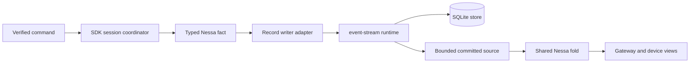
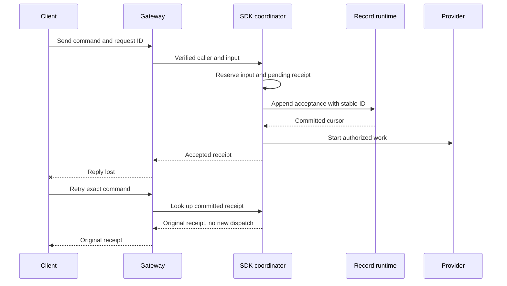
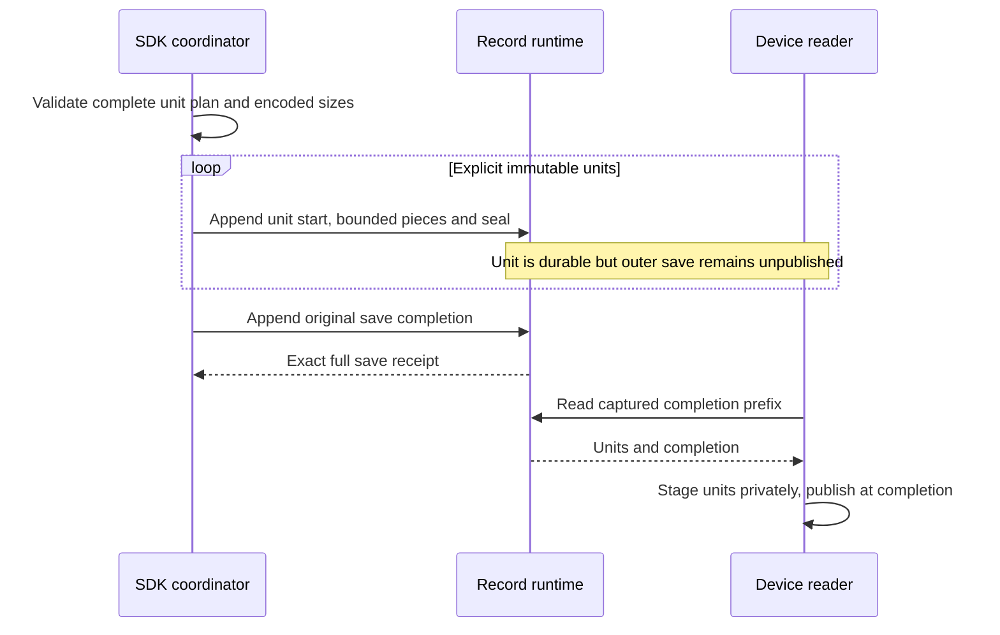

# Semantic record storage for conversations

**Status:** implemented for [#275](https://github.com/nessalabs/nessa-agent/issues/275) by [#290](https://github.com/nessalabs/nessa-agent/pull/290), with the bounded read source for #276 below. This narrows [ADR 0009](../adr/todo/0009-reusable-event-stream-crate.md) to the first live write path. Nessa is in alpha, so the record store replaces JSONL for every conversation. There is no JSONL import, second reader, or handler version. An existing per-session JSONL file is refused before a stream is created; an old lock file alone does not imply history.

## What this changes

The SDK passes a complete observed `SessionSnapshot`, its actual `SessionSaveGeneration` binding and caller-owned immutable `SessionSaveUnit` boundaries through `SessionStorageLease::save_changes`. The record writer persists unpublished units in decision order and publishes the whole save at its durable completion. `event-stream` provides ordered, durable physical records and cursors; the SDK owns their meaning, command receipt lookup, and whether provider work may start. A receiver reads committed facts through the [bounded record source](#bounded-read-source-for-276). The provider never runs during replay.

Server composition opens one SQLite runtime before listening and injects the adapter through an SDK-owned port. The SDK retains its exclusive conversation lease for the life of the manager. A successful save returns a receipt bound to the original save identity, full unit count and next binding. A timeout or dropped reply leaves the save unresolved until its exact bytes and original completion are found or retried. Full no-I/O preflight serializes each unit once and discards its body; persistence re-encodes one immutable unit at a time and retains original pending framed bytes across reconciliation. Shutdown drains session owners before the shared runtime.

## Commit boundaries

The SDK decision sites define explicit units retained in `Evidence` when observed state advances without an acknowledged save. `flush_observed` submits the complete ordered unit prefix as one outer save. The writer does not infer boundaries by comparing final snapshots or partitioning bytes. Canonical continuation validates each complete unit and the final observed candidate before pending reconciliation or append. The Record adapter restores the original incarnation, published base and generation from the same stream; reopening does not start a guessed generation sequence. `SessionLoad::into_published` denies unfinished saves before provider preparation or queue restoration. The detailed new ordering contract and its pending evidence are [below](#semantic-save-units-for-292).

| SDK boundary | Fact | Before the next effect |
| --- | --- | --- |
| `prepare` creates an empty conversation | `session-open` with session and provider identity | Commit before provider open or input admission. |
| `prepare` clears saved queue membership after restart | `queue-decision` with restoration cause | Commit before new scheduling. |
| `attach` obtains a provider context | `provider-context` with previous and next context | Commit before treating that context as recoverable. |
| `begin_record` reserves an input | `input-accepted` with exact request, verified `ActionContext`, mode, pending receipt and first queued edge if present | Commit before queue membership, dispatch or acceptance reply. |
| Queue admission, selection, withdrawal, reorder | `queue-decision` with actor and scheduling prefix | Commit actual queue decision before any dependent dispatch. |
| `record_scheduling` | `scheduling-transition` with prior and next stage, cause, target and actor | Commit dispatch edge before polling normal provider work. |
| `event` receives provider output | `provider-observation` with owner and ordinal | Message fragments can remain live only until the next save boundary; durable views expose only committed observations. |
| Receipt acknowledgement changes | `receipt-updated` with previous and next value | Keep audit/storage acknowledgement separate from provider acceptance. |
| Undispatched cancellation | `stop-decision` with cause and caller | Do not infer provider cleanup. |
| `record_provider_report` | `provider-report` plus first dispatched local stop when applicable | Keep report and local stop in one fact. |
| `finish`, `retain_result` or queued failure | `local-settlement` with previous and next result and preserved earlier outcome | Do not replace provider evidence. |

A call that changes scheduling and queue membership together, or settles a failed queued input while removing it, constructs one indivisible unit containing the ordered changes. A later save can include earlier message units or a receipt left observed after a failed write. Canonical validation checks each unit checkpoint; the outer save publishes only after its final completion. A unit is a nonempty ordered change sequence, with no nested unit encoding.

## State and ordering

| Current state | Event | Next state and action |
| --- | --- | --- |
| No stream | New conversation selected for records | Create stream, append `session-open`, then expose the conversation. A failure leaves it unopened. |
| Committed, no pending changes | SDK decision produces a change | Retain the typed change and observed candidate under the evidence mutex. |
| Pending changes | Save boundary | Validate the complete explicit unit plan and encoded sizes before I/O, then append missing units and the original completion. Do not start dependent work until the exact full receipt. |
| Pending streaming messages | The [commit cadence](streaming-message-commit.md) is due, or, as a safety limit, eight MiB of retained message bytes or 1,024 message observations accumulate | Save the complete observed prefix before accepting more output. Each message is at most four MiB, so even sixfold JSON escaping plus event metadata stays below the 160 MiB fact limit. A failed flush retains the same generation and pending decisions; no later provider effect is authorized by that failure. |
| Oversized encoded atomic group | Preflight before installing a pending fact or advancing a save generation | Return a typed size refusal without an append or writer fence. The caller may retry a smaller valid group; an atomic decision group is never split without an explicit semantic boundary. |
| Appending | Confirmed complete save | Publish the whole candidate at its completion, verify receipt binding and full unit count, clear pending units, then release the dependent effect. |
| Appending | Definite rejection | Keep pending facts and return typed refusal. Do not claim acceptance or dispatch. |
| Appending | Outcome unknown | Hold the affected command; read the same event ID and exact bytes. An identical committed record advances; changed bytes conflict; absence permits retry with identical bytes. |
| Multi-decision save | Earlier decision A commits, later decision B fails | Retain the caller's original observed candidate and exact ordered decision bytes. Track A as a physically committed prefix while the call remains unresolved. A retry with the same full sequence verifies and skips A, then resumes B; load cannot expose a partial call as settled. |
| Manager save, caller wait cancelled | Storage append commits after the caller drops its wait | The evidence keeps its save generation and pending decisions because the manager did not acknowledge success. The record lease retains a completed receipt for that generation. A retry validates the exact full decision sequence against its original base and returns success without appending those bytes again; only then does the manager clear pending and advance the generation. The canceled waiter starts no provider effect. |
| Manager save, caller wait cancelled | Append fails, remains uncertain, or the decision sequence grows | The evidence keeps the same generation and pending sequence. The writer retains its original base and physically committed prefix, reconciles any pending fact, then appends only the valid suffix. A changed or truncated prefix is refused before another append. |
| Manager save | A prior generation is complete and acknowledged | The next generation starts from the current committed state, even if its decision bytes equal the prior generation's bytes. A stale, skipped, or premature next generation is refused. The completed receipt is readable and does not fence erasure. |
| Fold `LocalSettlement`, including an intermediate change in an atomic group | A prior result exists and a new diagnostic or outcome arrives | Use shared application result validation and apply the same domain result transition as the live manager against the cached prior history before changing the candidate. A prior failure cannot become success; a prior success may become a diagnostic failure while retaining its known local outcome; another failure follows the domain rule. The supplied local outcome must equal the history's resulting outcome. Reject an invalid intermediate transition even if a later change would leave a valid final snapshot, before any append. The writer receipt handles exact physical retries of the same decision. |
| Fold `ReceiptUpdated`, including an intermediate change in an atomic group | A pending receipt becomes a failed or acknowledged receipt | Validate each proposed receipt with the same application rule used by restoration and live retention before replacing the prior value. A failed receipt names at least one bounded audit or storage failure. Reject an empty or oversized failed receipt before any physical append, even if a later decision would replace it with an acknowledged final snapshot; after refusal the previous history remains readable on reopen. |
| Fold initial admission and each invocation fact | A batch contains later changes that could mask an invalid earlier acknowledgement, dispatch edge, observation, report, stop, or local result | Build one prior `InvocationHistory` per affected execution and apply each domain transition in physical decision order before changing the candidate. Validate the admission acknowledgement and each receipt revision at its own boundary. A later scheduling edge cannot retroactively authorize earlier provider output or a provider report; scheduling after a local result must retain the domain's delivery prohibition. The final snapshot check remains the cross-record and complete-checkpoint authority. Cache the history per execution so large batches do not rebuild a growing history for every fact. |
| Fold a provider-context revision | An atomic group temporarily removes context and restores it after provider evidence | Track whether prior or newly appended facts need a provider context and validate each proposed context before replacing it. A later context revision cannot erase an invalid intermediate absence. Derive the flags once from the prior candidate and update them monotonically as facts append, avoiding repeated full-snapshot scans. |
| Fold an intermediate local diagnostic | An oversized failure is later replaced by a small failure in one atomic group | Validate retained error size at the shared local-result transition, before the first change mutates the candidate. Reject the entire group before append even when the final snapshot would contain only the small diagnostic. |
| Fold a provider report after a local success | The report's provider outcome agrees but its independent delivery or cleanup failure would make the public result fail, and a later local diagnostic replaces the success | Check the proposed report against the currently retained public result before mutation. Domain outcome agreement alone cannot validate the independent report failure; a later diagnostic cannot mask the contradiction. |
| Fold queue membership and dispatch | An atomic group orders queue admission before input, or Running before selection, but ends with a valid final queue history | Reuse the queue replay owner incrementally: each `QueueDecision` must find its input and exact scheduling checkpoint at the time it occurs and apply to the live pending queue; a Running edge requires a preceding selection for that execution. A later input or selection cannot repair a past decision. Rebuild queue authority once from the validated prior snapshot, then advance it once per queue fact; final queue replay still checks complete membership and checkpoint relationships. A valid grouped admission, selection, dispatch, result, and removal remains admissible in causal order. |
| Fold cross-invocation steering correlation | A steering input or injection names a queued target or an output offset produced only by later facts in the same group | At input admission, require the named target to be a prior invocation with established dispatch and require the captured target offset to equal its current observation count, as live admission records it. A targetless input has no offset. At an Injected edge, confirm the target's dispatch and captured offset still have prior evidence; never use a future output or dispatch to authorize an earlier steering fact. Keep final snapshot validation for whole-history consistency. Historical dispatch eligibility does not itself assert that a target remains active when a delayed acknowledgement is saved. |
| Fold context-bound provider observations | An atomic group changes context A to B, records a permission cancellation from A, then restores A | Validate each observation's session and invocation correlation against the context current at that fact, using the same helper as restored checkpoint validation. A later context revision cannot make an earlier cancellation valid. Keep full permission-request history validation after the group, but reject the mismatched cancellation before append so same-lease and reopened reads agree. |
| Writer opens or Reset installs a new stream incarnation | Load and first save | Restore the binding from the actual same-stream completion or unfinished lineage. Only a fresh/Reset incarnation starts at generation0/base0; old bindings refuse before append. `load_binds_fresh_reopened_and_reset_writers_to_actual_stream_progress` verifies zero physical rows after a skipped initial generation, independently of later envelope rejection. See O4–O7 and O10 for retry and erasure order. |
| Appending | Definite physical conflict or invalid frame | Fence this live writer's load and future saves as corruption. The prior snapshot cannot be exposed as proof that the conflicting suffix is absent. |
| Chunked fact, no matching seal | Same writer retries | Expose no part of that fact. The retained pending bytes resume the exact missing pieces and seal; no later fact may overtake it. |
| Chunked unit or completion, no matching seal | Process restarts under the exclusive lease | Validate the fixed physical prefix and append a deterministic abort bound to the attempt start, declared digest and observed tail. A body with all pieces must match its digest. Retain the original unfinished save binding and prior publication; Abort does not authorize preparation or acknowledge the outer save. See O4 and O6. |
| Abort append | Reply lost or process restarts | Retry the same abort ID and bytes against the fixed prefix. An exact committed abort advances the physical cursor without folding a semantic change; malformed, foreign or reordered evidence is corruption. |
| Aborted attempt | Caller retries the save | Compare the original binding, exact unit boundaries, prior sealed prefix and aborted-attempt key/digest before retrying missing work. A changed or truncated prefix refuses; physical attempt IDs use the post-abort start. |
| Reopen while abort is pending | Caller cancels open | Keep the exclusive reservation in the supervised recovery owner until the abort settles; a second opener cannot overlap it. |
| Committed acceptance, response lost | Same caller, request ID, execution ID and input retries | Return the original receipt; do not dispatch twice. A changed command under the same identity conflicts. |
| Provider accepted native steering but its acknowledgement was not saved | Restart | Preserve uncertain delivery. Check provider correlation if available; never inject again merely because the saved edge is absent. |
| Store failure during execution | Cleanup | Bound output and stop affected work; report only outcomes whose facts were committed. |
| Erase | Reset acknowledged, retired physical records remain | Retain cleanup ownership under the lease and run bounded global retired-record cleanup until no retired rows remain. Return success only after physical removal. Failure leaves erasure unresolved under the deletion tombstone. The same lease reconciles its retained Reset and cleanup before load/save without another replacement. After restart, a new lease has no retained Reset or cleanup phase: the deletion owner retries erasure through a new Reset, including an empty physical tail, before acknowledging cleanup. |
| Erase | Cleanup failed, process restarts before deletion retry | The durable gateway tombstone keeps product commands fenced. The adapter's new lease does not carry the old in-memory cleanup phase; the deletion owner retries `erase` to drain retired rows before marking the tombstone erased. A direct SDK caller must not treat an empty replacement snapshot as erasure acknowledgement. |
| Shutdown | New admission | Refuse new commands, join or cancel owners, save confirmable outcomes, drain writes, close runtime and release store. |

## Physical contract

The existing physical key remains `(kind u8, execution ID length u16,
execution ID UTF-8, ordinal u64)` and physical framing version remains 1. The
current semantic codec uses kind 12 `SaveUnit` and kind 13 `SaveComplete`. Their
`FactKey`s carry no execution ID — the physical key stores a zero-length ID — and
an ordinal in the original save. A `SaveUnit` payload may still contain execution
IDs inside its semantic changes. This intentionally refuses predecessor
semantic kinds1–11, even though their physical framing version is also1.
Unchanged physical framing does not preserve readability of those semantic records.
Opening such a SQLite stream returns corruption without appending an abort,
rewriting its bytes or translating it into a current unfinished save. There is
one current semantic contract, with no legacy reader or format-version bump.
`predecessor_semantic_sqlite_record_refuses_without_mutation` substitutes a fixed,
handcrafted retired-shape row into a stream emitted by the current public producer.
It checks repeated typed corruption, unchanged stored evidence and an accepted
original-current-data neighbor. It is not an observed historical producer capture;
exact historical emitted provenance remains OPEN. Physical event IDs hash the key and actual
attempt start offset; strict retry compares original bytes, not ID equality alone.

`save_group.rs` owns the bounded136-byte envelope: stream digest, actual
incarnation, original published base/generation, ordinal, prior chain and payload
digest. A Unit carries a nonempty typed JSON batch using existing snapshot field
mappings. Complete carries no semantic payload and seals the exact count/chain.
The canonical continuation owns typed decisions and complete-unit validation;
the envelope alone grants no provider authority.

A physical body fits one start record or a start,64KiB pieces and seal. The
existing160MiB body limit includes its save envelope. An indivisible oversized
unit refuses before I/O; a larger outer save uses caller-owned semantic units.
The event-store record bound remains1MiB. A physical unit seal validates that
body but is not public progress. Only the original save completion is a source
terminal and semantic applied cursor. An Abort retires one physical attempt
without acknowledging its save. Framing/Abort remain owned by `stream_fact.rs`;
save lineage and publication remain owned by `save_group.rs`.

## Semantic save units for #292

This is the current implementation contract for #292. Gate results and review
findings are tracked in the issue and pull request evidence chronology. The
existing #275/#290 evidence applies to its original semantics; it does not
establish acceptance of these changed semantics.

The caller owns explicit semantic units. A scheduling transition with its queue
selection/removal, or settlement with terminal scheduling and queue removal, is
one indivisible unit. The writer validates each complete unit and the final
observed candidate against the existing canonical continuation before reconciling
pending work or appending a record. A unit that individually exceeds the existing
body bound still refuses with `TooLarge` before append. The writer cannot infer
boundaries by slicing a flat list until it fits.

Before any I/O, the writer serializes each immutable unit once to validate its
encoded size and construct bounded identity/chain metadata, then drops that
encoded body. Persistence and exact-prefix comparison re-encode one unit at a
time. An uncertain physical append retains its original framed bytes across
cancellation and retry. There is no aggregate encoded copy of the outer plan.
The caller's plan, observed snapshot, validation continuation and bounded
per-unit metadata remain retained; this is not a 160 MiB whole-save heap bound.
RecordWriter::save and encode_unit own this algorithm. Exact encode-phase and
concurrent-buffer measurements below are historical private-fixture observations;
they are not current public-contract acceptance evidence.

An outer save can contain multiple bounded units. Each persisted unit is
structurally unpublished. One bounded completion envelope in the same canonical
record stream binds the original save identity, generation, base, exact unit
boundaries and ordered content; its durable confirmation publishes the group.
There is no separate start record, second snapshot/control store or compatibility
reader. Physical starts/pieces/seals and their exact-byte recovery keep their
existing owner. The new unit/completion metadata has one codec, also consumed by
bounded source terminal discovery; that scanner must not accumulate semantic
bodies to decide whether a terminal is published.

The existing bare lease-local generation is insufficient after restart or Reset.
The current lease load/save contract will provide an immutable backend-scoped save
binding and actual published or unfinished evidence. Record bindings name the
original incarnation, published base and generation; equal payload bytes or a
restarted zero counter cannot establish identity. Snapshot adapters expose their
actual snapshot capability without fabricated physical receipts. The manager
obtains the binding from the lease and keeps explicit decision units through a
failed or cancelled acknowledgment. Unfinished recovery is not a usable session
for provider initialization, queue restoration, new command dispatch or ordinary
manager deletion preparation. Those paths refuse
before provider effects rather than automatically abandon retained decisions.
An explicit SDK lease erasure remains a separate authorized Reset operation;
this does not supply automatic gateway recovery for an unfinished deleted session.

| Row | State and ordering | Required result and fixture boundary |
| --- | --- | --- |
| O1 | Any late unit, unit checkpoint or final candidate is invalid; an indivisible unit exceeds 160 MiB | Refuse before pending reconciliation or any append. The encoded unit passes the existing physical body-size owner before decode-budget preflight, so an oversized valid unit reports typed TooLarge rather than malformed content. A size refusal leaves a fresh writer usable. Test actual storage row count, prior load and valid retry. `valid_unit_plan_with_wrong_candidate_never_appends` isolates valid decisions with a contradictory observed snapshot from canonical unit rejection. `late_invalid_unit_never_appends_valid_prefix` separately checks a valid first Unit followed by invalid second Unit. Both refuse with unchanged rows/publication before a valid same-binding retry, so a removed full preflight is tested against the late-prefix row assertion rather than being masked by an earlier candidate case. `explicit_units_publish_one_direct_save_beyond_one_body_bound` first refuses the same candidate as one oversized unit without rows, then saves its caller-owned input units and verifies final receipt/reopen/exact retry. |
| O2 | An explicit unit seals while the outer save is unfinished | Public load exposes typed unfinished evidence; source head and receiver applied projection stay at the prior completed save until the original completion. `record_watch_stays_clean_after_unit_seal_until_original_completion_retry` checks durable Unit, changed prefix refusal, clean watch and exact retry. `completed_prefix_stays_published_during_same_generation_extension_and_checkpoint_restage` uses public saves, real completion refusal, reopen, valid extension and emitted source records. Direct private header/key/digest/chain branch isolation and private canonical-state assertions are withdrawn as acceptance proof; GroupProgress::complete and the physical validator remain their production owners. |
| O2a | Actual admitted product recordsHead/recordsPage uses the tiny current SDK save (one inline Unit plus one inline SaveComplete) | The published head is physical terminal position2, not the old snapshot-only single fact. The actual authenticated owner scope stays epoch-3; invented target1 is only a Unit seal and returns typed invalid_request, while captured target2 returns both dense physical positions1/2. `admitted_record_route_uses_owner_scope_and_real_physical_source` exercises the real store/source/dispatcher and keeps its wrong-receiver refusal. This is a current fixture migration after the full-suite stale-head1 failure, not a production source-bound change. |
| O3 | Unit acknowledgment is lost or its caller disappears | Original lease/task retains physical work. Exact retry compares original identity, boundaries and bytes, skips confirmed units and resumes missing work. No next generation or provider effect is authorized. |
| O3a | Same live writer retains Unit B after a real SQLite append refusal; caller retries the same binding and valid A prefix with a semantically valid changed B suffix | Refuse before reconciling original pending B: rows and prior public load stay unchanged. Then the original exact A/B retry completes once. `retry_of_extended_decisions_skips_exact_committed_prefix` uses the actual trigger-refused pending Unit; its changed-candidate checkpoint is valid, so the original pending-byte comparison must prevent physical reconciliation rather than rely on a later completion refusal. |
| O3b | Same live writer has a durable Unit and a trigger-refused, absent SaveComplete; caller retries the same binding with a semantically valid changed Opening unit and its matching candidate | Refuse before any replacement completion append. The physical row count stays one, the original load remains unfinished and unpublished, and the committed watch stays clean. The original exact unit/completion retry then publishes once. `record_watch_stays_clean_after_unit_seal_until_original_completion_retry` separates confirmed-unit byte agreement from the later comparison against an already durable completion. |
| O3c | Existing completed-turn fixture is seeded through the current explicit decision save API | InputAccepted carries no later events, result or local outcome; real Finished observation followed by LocalSettlement records the domain-produced Completed outcome. The final seeded snapshot retains that outcome instead of reusing snapshot-only inferred-success omission. `streamed_chunks_do_not_rescan_prior_turns_and_terminal_invalidates_cached_history` then measures live manager behavior against a valid actual adapter setup, with production validation unchanged. |
| O3d | Snapshot adapter retries the exact opening, repartitions its confirmed prefix, or extends it with an actual context transition | Use Absent to Recorded with the matching extended candidate, so prefix repartition rejection is independently load-bearing and the exact original prefix plus valid suffix succeeds. Absent to Absent is not an accepted transition. `snapshot_fixture_keeps_exact_receipt_prefix_and_reset_capability` preserves the separate stale receipt and reset-incarnation refusals, then accepts the original opening under the reset binding. |
| O4 | Child process dies inside a unit or after earlier unit seals | The existing strict physical abort terminates only that physical attempt. Earlier units remain an unfinished save; abort does not publish a partial group. Even before the first unit seals, recovery retains the original start key/full-body digest and refuses ordinary initialization; exact retry checks that bounded evidence before append. Reopen and retry the original binding without duplicate units. Owning external regression `killed_child_retains_original_unpublished_unit_retry` drives the public writer with a 4 MiB Unit and refuses its third physical row through SQLite, verifies exactly two durable rows of an unsealed Unit, removes the trigger, then kills and reaps that original child. Reopen checks Unfinished admission, changed-byte refusal, original retry and duplicate-free completed retry. A sealed Unit with refused Complete is a different boundary; this does not prove arbitrary power loss or killing during an uninterrupted append. |
| O5 | All units are durable but completion is absent; completion acknowledgment is lost | Without completion, remain unfinished and append only the missing terminal on exact retry. With a durable completion, restore the original receipt and next-generation binding and acknowledge exact retry without append. |
| O6 | Same-generation P has a retained unit, and retry extends it to Q | Reconcile P's exact pending unit bytes unchanged, append Q's linked suffix and complete Q. A unit is not marked final. If restart aborts P's incomplete completion attempt, verify that original completion key/count/digest against the unchanged P prefix of Q; the abort does not publish P or require Q's later terminal to have P's digest. If P already has a durable completion, verify its exact prefix envelope and retain P's published meaning; its receipt never acknowledges Q. Test both evidence orders, aborted completion recovery and crash before the first extension unit. |
| O7 | Changed/truncated/repartitioned retry; wrong base/incarnation; contradictory unit or terminal | Refuse before replacement or new append. Conflicting physical history fences the writer instead of using the prior snapshot to claim that suffix is absent. Published Record load requires absent snapshot/base0/generation0 together, or present snapshot/base>0/generation>0; a completion with empty metadata payload is not an empty semantic save. Reset returns the absent-snapshot form, and Unfinished refuses first. Contradictory evidence refuses before provider initialization. The published-load fixture includes absent snapshot with base1/generation1 to isolate snapshot/base agreement from generation/base agreement. Snapshot adapters are not subject to physical-cursor rules. Their exact retry owner retains the original immutable typed unit prefix; encoded-size/digest preflight drops each temporary unit body before encoding the next, without retaining a second encoded plan. A custom adapter receipt for another binding, a different unit count or impossible next capability refuses before clearing retained decisions or authorizing subsequent effects. `immutable_unit_and_snapshot_receipt_constructor_refuse_each_invalid_capability` owns empty-unit construction and each Snapshot revision pairing against a valid counterpart, without claiming physical persistence. Cached discovery retains a known malformed-tail failure; a repeated head cannot skip it merely because physical framing advanced. A requested older immutable publication may be revalidated independently. |
| O7a | Actual in-memory adapter receives wrong binding/session, a changed or repartitioned retry, an exact retry/new generation, or erase followed by old/new work | The same public lease compares actual binding before effects, retains exact immutable prefix and original base for retries, and returns the original receipt without a new revision for exact retry. `tests/infrastructure/session_storage/memory.rs` constructs public immutable SessionSnapshot values and observes real lease saves, receipts and loads. After erase, the old binding is refused without replacing empty reset state, while a new-binding save remains accepted. Internal receipt/original/unit-cache release and exact heap bounds remain unverified; custom snapshot fixtures do not stand in for this adapter. |
| O7b | Record or snapshot adapter admits an empty plan; raw unit constructor/codec receives empty changes | SessionSaveUnit::validate_plan owns nonempty plans before persistence; SessionSaveUnit::check_changes owns individual nonempty units for construction and raw mappings. The exported constructor fixture and actual public storage saves retain the supported contract. Private encode_batch/decode_batch and FactKey constructor tests supply no current acceptance proof. No compatibility encoding or relaxation is introduced. |
| O7g | Live writer observes a typed physical frame/stream conflict, unavailable formerly confirmed prefix, or foreign pending terminal history | One private live-writer error owner consumes existing FactCommitError/is_invalid_fact and keeps the conflict fence on commit and live prefix-read paths. Ordinary caller-plan/domain refusal or store I/O failure does not fabricate a physical conflict. Restoring rows cannot revive the fenced original writer; a fresh actual replay may recover valid restored history. A changed pending terminal may be discarded only when physically absent, or accepted first when the exact original Complete is durable. Partial or Aborted at that terminal cursor is foreign physical history: the only private local terminal factory encodes exactly Header bytes and the physical codec stores that small body as one atomic inline event, while valid Partial/Abort require a noninline body above its frame ceiling. The earlier proposed matching-Partial local-terminal positive was therefore unreachable. Restored O6 abort-prefix input remains a separate raw-input owner and is retained. |
| O7f | Corrupted persisted Start announces a long unfinished completion body but carries the digest of a zero/excess-prefix completion, then actual physical Abort ends it | Physical framing retains the original announced digest and semantic retry refuses zero or excessive completion prefixes. The former private writer/Header tamper fixture is withdrawn as public proof of these isolated branches: the supported producer emits a small atomic inline completion, and no copied wire encoder or test door is added. The existing physical codec and RecordWriter completion-prefix reconciliation remain the owners; generic malformed-frame rejection does not prove this exact key/digest contradiction. |
| O7e | Exact already-completed Record retry reaches cached return | Before this branch, the same owner compares every supplied Unit byte and every physical Complete against the original immutable prefix. A matching full supplied prefix with no unfinished work therefore has the original receipt installed by actual Complete acceptance; its binding/count/digest are derived there and are not revalidated in a parallel cache rule. Pending Unit/Complete reconciliation still finishes before this branch; incomplete work cannot return a prior receipt. The cached return remains necessary to avoid another terminal append. |
| O7d | A physically valid first save envelope carries another stream/incarnation identity, or typed Unit encoding is preflighted | RecordWriter derives identity from its actual original stream binding before staging/replay; it separately refuses a decoded Opening for another session and a caller plan targeting another session before effects. A foreign first envelope refuses even when initial group generation/base and semantic Opening are otherwise valid. Both local payload-size calls receive successful serialization of nonempty typed WireBatch changes, so the copied zero-byte predicate is removed; GroupProgress independently owns nonempty received Unit bodies. The encoded body ceiling remains enforced before effects. |
| O7c | Physical envelope ends with a short header, empty Unit, payload-bearing Complete, Complete without an original Unit, group switch while unfinished, or repeated Complete | Header::decode and GroupProgress::complete own short-header, nonempty Unit, empty completion-payload, original unfinished group and exact linked completion admission. `emitted_record_rejection_preserves_public_projection_and_valid_completion` checks actual truncated completion input, unchanged projection and accepted original completion through the public fold. The deleted direct private fixtures no longer certify each otherwise-correct header branch or private extent state separately. |
| O8 | Receiver pages end inside units or between their seals; journal/checkpoint reopens | Downloaded progress may advance, while public applied progress/projection stay prior. Retain the bounded last-completion identity/count/chain and final original Unit hash preimage in the existing checkpoint. Its generation0 iff original base0, and first-generation completed unit count equals cumulative unit facts; later completion counts cannot exceed cumulative facts. Validate these actual producer invariants before restoration, restage from its published A through the same downloaded journal and publish only after exact group completion; no provider effects run. `checkpoint_rejects_each_independent_completion_binding_contradiction` isolates later-generation zero/count-over-total, generation/base pairing, non-prior base, foreign stream/incarnation and missing terminal metadata against a valid two-save checkpoint; first-generation total equality remains a source-enforced invariant without the deleted private restore fixture being credited as public proof. |
| O8c | A later completed save has original base2 and publication4; restored checkpoint changes only original base to1 or3 | Retain the bounded final original Unit hash preimage with the completion metadata. Restore asks the existing `Header::chain` owner to relate identity, ordinal/count, previous Unit chain, payload digest and payload length to the retained completed chain before installing progress. A range check alone cannot establish the original base. `checkpoint_refuses_lower_prior_base_with_other_completion_fields_unchanged` and `checkpoint_refuses_higher_prior_base_with_other_completion_fields_unchanged` check the otherwise-valid changed bases; `restored_checkpoint_accepts_real_same_generation_extension` preserves the valid original base and accepts the real SQLite suffix. `checkpoint_refuses_changed_final_unit_preimage_and_completion_chain` also isolates each retained preimage field, later generation/count and completed chain against an exact accepted restore. This proves internal field agreement, not authenticity against a total self-consistent checkpoint rewrite; the existing scope/applied cursor and local transaction retain their separate ownership. |
| O8a | Untrusted checkpoint group identity/count/chain and final Unit preimage fields enter representation preflight before owned typed decoding | Shape/Seed/TokenReader owns checkpoint representation preflight before typed decoding. `checkpoint_restore_refuses_independent_group_representation_contradictions` mutates one field of a full accepted checkpoint emitted after actual public storage saves and asserts typed public checkpoint admission or restoration rejection plus a valid neighbor. This proves boundary refusal; early preflight-before-serde allocation ordering and full heap bounds are explicitly unmeasured. |
| O8b | Preflight and typed checkpoint decoding inspect the same metadata fields | The private metadata declaration owns SaveIdentity/GroupCheckpoint fields once; serde wire fields and Shape field resource kinds derive from it. Public checkpoint acceptance, independent representation contradictions and unknown-field rejection exercise its consuming boundary. The former private field_kind/serde agreement assertion is withdrawn; no second key/type authority is added. |
| O9 | Historical page target is an intermediate unit seal, including after discovery-cache eviction | The same group-terminal owner rejects it. Holding current head behind the group is insufficient if direct historical target validation still accepts a physical seal. |
| O9a | Head and exact page queries arrive in either order; a completed historical target is requested after newer forward validation, while an unproven historical target or intermediate Unit is also queried | The exclusive discovery owner checks current physical bounds before using captured head ceilings, exact page targets or shared completion proof. One monotonic forward scan retains its ceiling, framing and failure; a separate historical scan proves an older target that is no longer retained. A competing unknown historical query advances that original scan and returns Preparing until it finishes, while retained completion proof remains usable. A Unit is never completion proof. Returning the owner preserves both scans, and historical completion cannot replace forward progress or a known failure. The source-local remembered-head ledger is removed. The canonical ordering and cost contract is [bounded terminal discovery](bounded-terminal-discovery.md); real public save/source fixtures cover both arrival orders, older publication20, Unit refusal, competing historical requests, source recreation and sticky forward failure. |
| O10 | Reset or erasure overlaps unfinished save, including a pristine empty stream with an unpolled old save; old retry returns afterward | Every new erasure uses the existing idempotent Reset/reconciliation and physical cleanup owner, including empty streams. Replacement incarnation invalidates every old binding; do not translate an old retry into the new initial generation. An already retained Reset/cleanup retry finishes that original operation without another replacement. `empty_erase_invalidates_unpolled_original_save_before_new_work` checks typed old-binding refusal before append, the empty replacement binding, valid new-binding save and reopen, plus the existing Reset publication hook; existing unresolved-empty and lost-Reset fixtures preserve original pending erasure ownership. |
| O11 | A complete group becomes durable under watch registration or caller loss | Consume the actual PR381 registry owner, retained by the original lease/task. Publish only when a newly verified outer SaveComplete installs its committed candidate/receipt, including lost-ack reconciliation; Unit seals and Abort never notify. An already completed exact retry appends nothing and does not add another notice. Durable Reset publishes before lost reply/replay/cleanup can fail, through that same registry. Admission closure precedes actual held-source join and survives shutdown waiter loss. `record_watch_stays_clean_after_unit_seal_until_original_completion_retry` forces a durable Unit and refused Complete through the real adapter, then checks exact terminal retry and no duplicate notice. Advisory hints do not make a unit fresh or authorize an effect. |
| O12 | `prepare`'s initialization or restoration Unit is durable and its completion was refused or never written (the caller dropped the manager, or the process died); a later `prepare` loads Unfinished | Initialization's plan is a pure function of the prior publication and provider identity, so the later `prepare` derives the same plan and retries it exactly against the recovery binding: only the missing completion is appended, and the conversation is published before any provider open. When the durable units differ from that plan — another provider's opening, a later save's unit — the writer refuses before appending (O7) and `prepare` reports `Unresolved`; it reports every corruption refusal of this retry that way, because the writer has no separate changed-plan variant, and a fenced writer's next load still reports corruption. When initialization plans nothing, an unfinished load is `Unresolved` directly. Limit: the writer compares only durable units, so a longer plan written directly through `save_changes` whose durable prefix is exactly `prepare`'s plan, with its later units never started, would be completed as that plan. No SDK producer writes such a plan; only `prepare` emits `Opened` and `Restored`. `initialization_unit_left_unfinished_is_completed_by_the_next_prepare`, `restoration_unit_left_unfinished_is_completed_by_the_next_prepare` and `prepare_leaves_an_unfinished_save_it_did_not_plan_unresolved` drive public `Agent::prepare` over `RecordStorage` with a SQLite append refusal. |

### Public fixture construction and remaining proof limits

The new producer, source and discovery acceptance cases compile as ordinary
external SDK consumers under `tests/infrastructure/session_storage/{record,record_source,discovery}.rs`.
Expected candidates use exported immutable snapshots and input records; wire
contradictions consume actual public producer output through the SQLite boundary.
They do not call private folds, snapshot builders, framing encoders or runtime
accessors. The fixture migration adds no production API or fault selector.

| Fixture ordering | Evidence and limit |
| --- | --- |
| Opening Unit seals, SQLite refuses the actual next completion offset, then exact retry | Watch and source tests observe the original Unfinished binding, prior publication, changed retry refusal, completed publication and duplicate-free retry. Completion placement is derived from an actual public donor receipt. |
| Large input Unit reaches the third physical append, then child is killed | The crash child verifies two actual durable physical rows before readiness. Its real save has returned typed Io; the Unit remains unsealed. Reopen/retry and process exit are observed separately. |
| A fixed handcrafted retired-shape physical row replaces current output | Repeated typed corruption leaves bytes/cursor unchanged; restoring the original current row is accepted. Actual historical producer-emission provenance remains OPEN. |
| Known completion followed by public Reset or externally shortened SQLite tail | Old-source typed identity refusal is public behavioral evidence. True retention-policy pruning through a supported SDK seam remains OPEN. |

Private discovery read counts, proof-ring/cache release, exact heap/disk usage,
and private snapshot materialization counts are not current public acceptance.
Inherited private implementation fixtures keep their historical scope; removing
an assertion does not establish its stronger claim.

### Historical writer work observations and current proof limits

FULL3 and the earlier structural correction recorded W1–W7 through direct
private RecordWriter fixtures and actual SQLite runtime observations. Their
frozen-source receipts and the dated raw measurements below remain historical.
The public-fixture correction removes those direct fixtures and their newly
added counters; it does not relabel these numbers as current public acceptance.
Exact encode-phase counts, named concurrent-buffer capacities, pending allocation
pointer retention and complete process memory remain unverified through the
supported public API. No public accessor, test constructor or fault switch is
added to recover that claim. RecordWriter::save/encode_unit remain the algorithm
owners; source analysis is distinct from measured regression evidence.

Current public behavior remains covered by actual lease load/save/reopen, typed
TooLarge/no-row rejection for an indivisible unit, exact original receipt retry,
unchanged rows, and publication/watch evidence. Inherited actual work counters
that observe public fold/source activity retain their named scope. Public rollback,
checkpoint, restored value and clone/work observations remain regression evidence;
public snapshot capacities are not the private staged continuation allocation. The
comparison between those allocations is withdrawn, including after rollback. Full
oversized-write bounded-memory acceptance remains **OPEN**, outside this producer
scope; removing the incomparable allocation assertion proves no heap or performance
bound. The retained-state owner remains responsible for its private allocation
contract. No staged-state accessor is added to turn that contract into a public
acceptance oracle.

#### Recorded writer measurements — 2 October 2026

Darwin 25.6.0 arm64, Rust 1.99.0 (`b940084d7`), locked SDK library,
real SQLite runtime, two build jobs and incremental compilation disabled.
The former four direct writer measurement fixtures passed on historical frozen source
`36fd7ccc` (manifest identity, with publication ancestor `16629917`). Counts
are preflight / persistence / exact-prefix comparison; capacities are bytes.
The metadata column is the actual header Vec capacity, independent of payload.

| Case | Completed encodes | Largest JSON Vec capacity | Largest envelope / physical comparison capacity | Metadata capacity | Actual appends / confirmed |
| --- | --- | --- | --- | --- | --- |
| W1, fresh 1 unit | 1 / 1 / 0 | 256 | 269 / 0 | 136 | 2 / 2 |
| W2, fresh 2 units | 2 / 2 / 0 | 512 | 598 / 0 | 272 | 3 / 3 |
| W2, fresh 8 units | 8 / 8 / 0 | 512 | 598 / 0 | 1,088 | 9 / 9 |
| W2, fresh 32 units | 32 / 32 / 0 | 512 | 599 / 0 | 4,352 | 33 / 33 |
| W3, one new unit after 0, 8 or 64 inputs | 1 / 1 / 0 | 128 | 209 / 0 | 136 | 2 / 2 |
| W4, exact retry of 1 / 2 / 8 / 32 units | N / 0 / N | 256 / 512 / 512 / 512 | 269 / 598 / 598 / 599, for both buffers | 136 / 272 / 1,088 / 4,352 | 0 / 0 |
| W5, retained refusal after durable A | 3 / 0 / 2 | 512 | 598 / 269 | 408 | 1 / 0 |
| W5, recovery of original pending B and missing suffix | 3 / 1 / 2 | 512 | 598 / 269 | 408 | 3 / 3 |
| W7, fresh 42 units above 160 MiB | 42 / 42 / 0 | 8,388,880 | 4,194,892 / 0 | 5,712 | 2,749 / 2,749 |
| W7, completed exact retry | 42 / 0 / 42 | 8,388,880 | 4,194,892 / 4,194,892 | 5,712 | 0 / 0 |

All successful cases peaked at one live completed JSON output; none remained
live when the operation returned. W7 encoded 171,985,119 payload bytes in each
active phase. Its largest sampled simultaneous named-buffer total was
12,589,620 bytes for fresh persistence and 16,784,512 for completed retry;
these exclude the owners/temporaries listed above. The W5 original pending
allocation stayed at the same address and 598-byte capacity across refusal.
During physical A comparison it coexisted with a 269-byte returned body,
256-byte JSON output, 269-byte envelope, 408-byte headers and 136-byte terminal.
The same candidate presented as one indivisible unit returned typed TooLarge
with zero append attempts before the explicit 42-unit plan succeeded.

The runtime counts are SDK-facing calls/returned records, not SQLite disk I/O
or distinct logical facts. W7 fresh persistence read 2,749 returned event
records in 207 calls; exact retry returned 3,165 in 207 calls and appended
none. Prefix comparison can return records again from bounded pages. No timing,
whole heap, codec-private allocation or phone/network result is inferred.

Two deliberate real-work changes were separately compiled: an additional
persistence encoding failed the owning `[1, 1, 0]` count assertion, and retaining
actual preflight JSON outputs across the loop failed the one-live-output
assertion. After full source restoration, the same named fixture passed for
each change. These probes did not remove instrumentation or manufacture buffers.
Those historical probes are not rerun or credited as current public fixture proof.
Current combined checks, independent review and hosted acceptance remain separate.

The caller's complete candidate is not a retained projection for every unit. Reuse
the canonical incremental lifecycle/queue validation and account privately staged
history separately from the 160 MiB per-fact bound. Receiver journal recovery,
small-unit operation counts, held physical ownership and increasing-history
allocation measurements remain historical implementation observations, not current public acceptance or results of this table.

The SDK session storage/manager and record writer/fold own this change. The
principal command receipt stream in #268 remains separate. The integrated #381
record_changes registry consumes the outer SaveComplete and Reset publication
boundary described in O11; Unit seals, Abort and completed exact retries do not
add a notice. #298 hints carry no payload or independent semantic authority.
Update the current lease contract, its real manager callers, snapshot adapters and
direct fixtures
together; no parallel legacy save entry point is introduced.

## Verification for #275

1. A real SQLite process restart reconstructs a new conversation with accepted input, retained output, settlement and receipt. Replay performs no provider effect.
2. An acknowledgement lost after a committed acceptance returns the original receipt on retry; dispatch count remains one. Change actor, request ID or input with the same execution ID and assert conflict before dispatch.
3. Inject definite rejection and uncertain append at start, piece and seal boundaries. Verify same-writer exact-byte retry, no partial fact exposure, no overtaking and no duplicated provider effect. After a child-process restart at each partial boundary, validate the prefix, durably abort it, and load only the prior complete state. Crash and retry during abort must produce one terminal abort and no provider effect. A malformed or foreign prefix remains corruption.
4. Hold two owners against one conversation, restart between writes, and exercise cancellation and cleanup while the store refuses writes. State the proven process-restart guarantee separately from power-loss durability.
5. Compare the folded committed state with the manager's committed snapshot at each save boundary. Exercise pending message fragments, receipt updates after failed writes, queue selection and removal, dispatched local cancellation, provider report and later local failure.
6. Reject a changed complete body with no seal before it can be aborted. Fail A, then B in an extended two-decision save, and verify exact full-sequence retry and unresolved load. Fail physical cleanup after Reset, restart, and verify the retired SQLite rows and original prompt payload are gone before erasure succeeds. At the gateway, a lost cleanup acknowledgement keeps the tombstone unfinished; a retry preserves the original actor, request and provider-erasure evidence.
7. Cancel a manager flush after the SQLite fact commits but before its reply reaches the caller. Pending evidence retains the same lease generation; a later flush acknowledges the completed receipt without appending a duplicate fact. A second equal observation advances to a distinct generation and is saved separately. Exercise a canceled wait before commit, an extended same-generation sequence, changed/truncated prefixes, stale/skipped generations, and an incomplete batch refusing the next generation. Keep the original bounded close and panic-attribution conformance tests passing. Restart a gateway after an incomplete erase and verify its tombstone refuses product commands until deletion retry finishes.
8. Submit local-result revisions through the public record lease: failure to success and changed success are refused before append; success to diagnostic failure retains the known outcome, and failure to another failure is allowed. A two-decision batch whose first revision is invalid must be refused even when its final candidate equals the prior valid snapshot. Reopen to verify only accepted revisions replay.

## Bounded read source for #276

The read source shares the server's already opened event runtime. It never acquires
the SDK writer lease, creates a stream, or repairs a partial write. A source is
bound to one existing stream incarnation and the host's origin identity. It
maps each physical event to one dense sync position. Its payload carries the
physical schema tag and exact frame bytes; the semantic receiver maintains an
applied fact cursor separately from the downloaded physical checkpoint.

| Current source state | Event or ordering | Result |
| --- | --- | --- |
| Existing stream, validated publication at zero | Head read during a save | Scan bounded physical records, validate frame and save lineage, and return only the last exact save completion. |
| Prior completion before an incomplete save | Head read inside a unit or between unit seals | Return the prior completion; a page cannot target the unpublished suffix. |
| Incomplete save | Original completion commits after the head read | A later head validates the complete lineage and advances to that completion. A unit seal alone cannot advance it. The earlier fixed target stays unchanged. |
| Incomplete physical attempt | Writer or recovery commits a matching abort | Physical validation advances through Abort while the public head stays at the prior save completion. |
| Captured terminal head | Page read while the writer appends | Return a contiguous bounded prefix no later than the captured target; later writes do not change that page's target. |
| Reader is catching up while the writer keeps appending | A head request observes a physical tail, then newer facts commit before each read | Validate only through the tail captured for that request and return the last terminal at or before it. The next head request may advance. Other readers must not wait for a moving tail to become idle. |
| Reader has a historical fixed target | Newer facts commit before or during its page request | Validate the requested terminal through that target only; do not first catch the shared worker up to the current tail. Return the bounded page or a typed invalid-target result. |
| Captured terminal head | Reply drops after receiver commit | Receiver reloads its durable physical checkpoint; repeated pages have the same IDs and bytes. Semantic application remains atomic with its separate applied cursor. |
| Reader bound to an incarnation | Reset or deletion replaces the stream | Refuse the old scope with identity-changed; a new incarnation needs an explicit receiver reset. |
| Reader bound to an incarnation | Wrong origin, stream, incarnation or schema, a gap, malformed frame, or a target inside a fact | Return a typed refusal before exposing an unvalidated page. |
| Read queued on the source worker | Caller drops its wait or SDK shuts down | The owned worker finishes or reports unavailable; it does not mutate storage or take over writer recovery. |
| Shared source worker is busy | Authorized clients submit more reads than its 64-command queue can retain | Admit at most 64 waiting commands; return `SourceError::Unavailable` immediately for the excess request, with no source read or allocated backlog. A client may retry after backoff. When the last source drops, the worker drains admitted commands and exits even if the queue was full. |
| Repeated authorized reads on the same source | More head and page requests arrive | Clones share one worker and its last validated terminal. A repeated head checks for new records from that point. An old fixed target outside the bounded remembered-head set is revalidated from the stream prefix before paging. |
| Receiver has downloaded prefix D beyond public applied cursor A | Receiver process restarts | Restore the bounded last-completion metadata and public projection, restage the same durable journal from A through D, and keep units private until the original completion. O8 owns the restoration relationships. |
| Receiver commits a page and projection but its reply is lost | Receiver process restarts | Reload both cursors and the projected state from the same local transaction. Rechecking the source starts after the downloaded checkpoint; do not apply the prior fact again. |
| Receiver receives a foreign scope, position gap, changed frame schema, or invalid seal | Before local transaction | Refuse the page or semantic projection with typed failure. Keep both durable cursors and the prior projection unchanged. |

The development loopback endpoint from sync-engine serves authorized head and
page reads. It has no wake subscription. A receiver catches a write that lands
between a captured head and its idle decision by rechecking the head after the
fixed-target pass, then polling or reconnecting after a failed check. Push wake
delivery and production authorization/routes remain [#260](https://github.com/nessalabs/nessa-agent/issues/260)
work; this slice makes no subsecond delivery claim. The loopback test reports
actual framed transport payload and protocol bytes, including retries.
