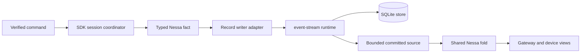
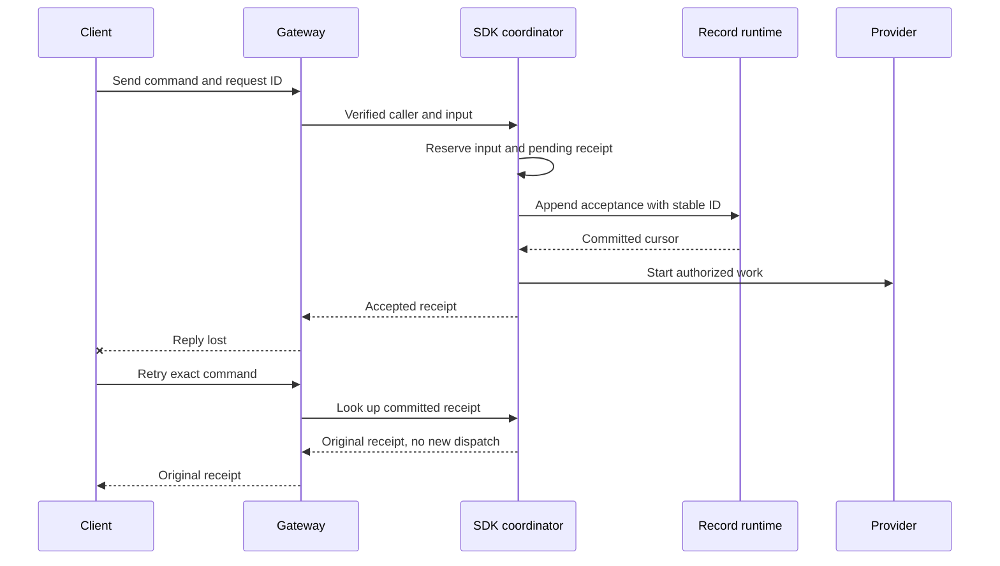
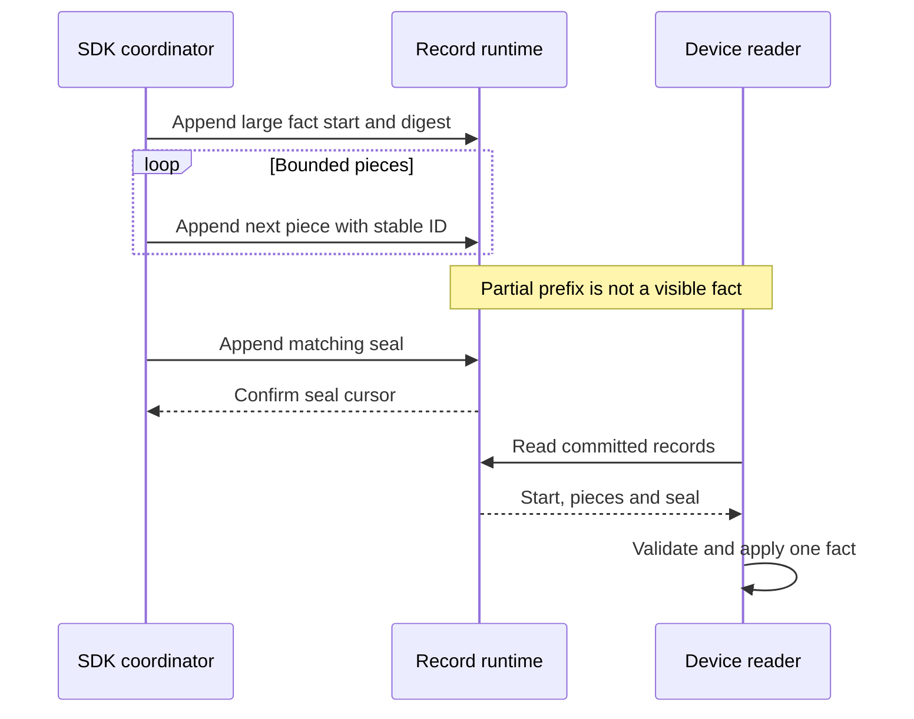

# Semantic record storage for conversations

**Status:** implementation in progress for [#275](https://github.com/nessalabs/nessa-agent/issues/275). This narrows [ADR 0009](../adr/todo/0009-reusable-event-stream-crate.md) to the first live write path. Nessa is in alpha, so the record store replaces JSONL for every conversation. There is no JSONL import, second reader, or handler version. An existing per-session JSONL file is refused before a stream is created; an old lock file alone does not imply history.

## What this changes

The SDK passes a complete observed `SessionSnapshot` and its ordered `SessionChange` decisions through `SessionStorageLease`. The record writer saves Nessa facts at the SDK decision that produces each fact. `event-stream` provides ordered, durable physical records and cursors; the SDK owns their meaning, command receipt lookup, and whether provider work may start. A phone reads committed facts through a later bounded record source. The provider never runs during replay.

Server composition opens one SQLite runtime before listening and injects the adapter through an SDK-owned port. The SDK retains its exclusive conversation lease for the life of the manager. A successful append returns the committed cursor. A timeout or dropped reply leaves the command unresolved until the same event ID and exact bytes are found or retried. The writer serializes each typed fact once and keeps those bytes across that reconciliation. Shutdown drains session owners before the shared runtime.

## Commit boundaries

The SDK's current decision sites define the facts. A pending set is retained inside `Evidence` when observed state advances but a save has not been acknowledged. It contains exact typed changes in decision order; `flush_observed` commits those changes as one atomic logical fact when more than one change is pending. The writer does not infer lifecycle facts by comparing two arbitrary final snapshots. It checks that folding the pending changes from the generation's original committed state equals the observed candidate before attempting an append. A mismatch is typed corruption before any write or provider effect. The generation is scoped to the lease and is not encoded in physical records; replay starts a fresh generation sequence.

| SDK boundary | Fact | Before the next effect |
| --- | --- | --- |
| `prepare` creates an empty conversation | `session-open` with session and provider identity | Commit before provider open or input admission. |
| `prepare` clears saved queue membership after restart | `queue-decision` with restoration cause | Commit before new scheduling. |
| `attach` obtains a provider context | `provider-context` with previous and next context | Commit before treating that context as recoverable. |
| `begin_record` reserves an input | `input-accepted` with exact request, verified `ActionContext`, mode, pending receipt and first queued edge if present | Commit before queue membership, dispatch or acceptance reply. |
| Queue admission, selection, withdrawal, reorder | `queue-decision` with actor and scheduling prefix | Commit actual queue decision before any dependent dispatch. |
| `record_scheduling` | `scheduling-transition` with prior and next stage, cause, target and actor | Commit dispatch edge before polling normal provider work. |
| `event` receives provider output | `provider-observation` with owner and ordinal | Message fragments can remain live only until the next save boundary; durable views expose only committed observations. |
| Receipt acknowledgement changes | `receipt-updated` with previous and next value | Keep audit/storage acknowledgement separate from provider acceptance. |
| Undispatched cancellation | `stop-decision` with cause and caller | Do not infer provider cleanup. |
| `record_provider_report` | `provider-report` plus first dispatched local stop when applicable | Keep report and local stop in one fact. |
| `finish`, `retain_result` or queued failure | `local-settlement` with previous and next result and preserved earlier outcome | Do not replace provider evidence. |

A call that changes scheduling and queue membership together, or settles a failed queued input while removing it, commits one `atomic-transition` containing the ordered child facts. A later flush may include earlier message fragments or a receipt left observed after a failed write. Group validation applies all children to a candidate state and publishes it only after every child succeeds. Nested groups are invalid.

## State and ordering

| Current state | Event | Next state and action |
| --- | --- | --- |
| No stream | New conversation selected for records | Create stream, append `session-open`, then expose the conversation. A failure leaves it unopened. |
| Committed, no pending changes | SDK decision produces a change | Retain the typed change and observed candidate under the evidence mutex. |
| Pending changes | Save boundary | Encode the single fact or atomic group once; append stable physical records. Do not start dependent work yet. |
| Appending | Confirmed complete fact | Fold and validate it, advance committed state and cursor, clear pending changes, then release the dependent effect. |
| Appending | Definite rejection | Keep pending facts and return typed refusal. Do not claim acceptance or dispatch. |
| Appending | Outcome unknown | Hold the affected command; read the same event ID and exact bytes. An identical committed record advances; changed bytes conflict; absence permits retry with identical bytes. |
| Multi-decision save | Earlier decision A commits, later decision B fails | Retain the caller's original observed candidate and exact ordered decision bytes. Track A as a physically committed prefix while the call remains unresolved. A retry with the same full sequence verifies and skips A, then resumes B; load cannot expose a partial call as settled. |
| Manager save, caller wait cancelled | Storage append commits after the caller drops its wait | The evidence keeps its save generation and pending decisions because the manager did not acknowledge success. The record lease retains a completed receipt for that generation. A retry validates the exact full decision sequence against its original base and returns success without appending those bytes again; only then does the manager clear pending and advance the generation. The canceled waiter starts no provider effect. |
| Manager save, caller wait cancelled | Append fails, remains uncertain, or the decision sequence grows | The evidence keeps the same generation and pending sequence. The writer retains its original base and physically committed prefix, reconciles any pending fact, then appends only the valid suffix. A changed or truncated prefix is refused before another append. |
| Manager save | A prior generation is complete and acknowledged | The next generation starts from the current committed state, even if its decision bytes equal the prior generation's bytes. A stale, skipped, or premature next generation is refused. The completed receipt is readable and does not fence erasure. |
| Fold `LocalSettlement`, including an intermediate change in an atomic group | A prior result exists and a new diagnostic or outcome arrives | Use the same application transition helper as the live manager: rebuild the invocation's history authority from the prior record, then apply the new local result through its domain rule before changing the candidate. A prior failure cannot become success; a prior success may become a diagnostic failure while retaining its known local outcome; another failure follows the domain rule. The supplied local outcome must equal the history's resulting outcome. Reject an invalid intermediate transition even if a later change would leave a valid final snapshot, before any append. The writer receipt handles exact physical retries of the same decision. |
| Writer opens or Reset installs a new stream incarnation | First save in that writer | Require the initial generation even when the physical history already contains earlier facts. Reset begins a new generation sequence for its replacement writer on the same exclusive lease. Reject a skipped first generation without changing the writer, so a valid initial save can still succeed. |
| Appending | Definite physical conflict or invalid frame | Fence this live writer's load and future saves as corruption. The prior snapshot cannot be exposed as proof that the conflicting suffix is absent. |
| Chunked fact, no matching seal | Same writer retries | Expose no part of that fact. The retained pending bytes resume the exact missing pieces and seal; no later fact may overtake it. |
| Chunked fact, no matching seal | Process restarts under the exclusive lease | Validate the fixed physical prefix and append a deterministic abort bound to the attempt start, declared digest and observed tail. If all body pieces are present, verify their digest before deciding the missing seal is abortable; a mismatch is corruption. Only after the abort commits may replay expose the last complete semantic state. No provider effect is replayed. |
| Abort append | Reply lost or process restarts | Retry the same abort ID and bytes against the fixed prefix. An exact committed abort advances the physical cursor without folding a semantic change; malformed, foreign or reordered evidence is corruption. |
| Aborted attempt | Caller retries the command | Derive a new physical attempt ID from the post-abort start offset while retaining the logical fact key. A changed command is checked against the last complete semantic state and admitted only by the normal SDK rules. |
| Reopen while abort is pending | Caller cancels open | Keep the exclusive reservation in the supervised recovery owner until the abort settles; a second opener cannot overlap it. |
| Committed acceptance, response lost | Same caller, request ID, execution ID and input retries | Return the original receipt; do not dispatch twice. A changed command under the same identity conflicts. |
| Provider accepted native steering but its acknowledgement was not saved | Restart | Preserve uncertain delivery. Check provider correlation if available; never inject again merely because the saved edge is absent. |
| Store failure during execution | Cleanup | Bound output and stop affected work; report only outcomes whose facts were committed. |
| Erase | Reset acknowledged, retired physical records remain | Retain cleanup ownership under the lease and run bounded global retired-record cleanup until no retired rows remain. Return success only after physical removal. Failure leaves erasure unresolved under the deletion tombstone. The same lease reconciles before load/save; after restart a retry recognizes an empty replacement by its physical stream bounds and drains cleanup without another reset. A live writer with unresolved decisions still resets even when the physical tail is empty. |
| Erase | Cleanup failed, process restarts before deletion retry | The durable gateway tombstone keeps product commands fenced. The adapter's new lease does not carry the old in-memory cleanup phase; the deletion owner retries `erase` to drain retired rows before marking the tombstone erased. A direct SDK caller must not treat an empty replacement snapshot as erasure acknowledgement. |
| Shutdown | New admission | Refuse new commands, join or cancel owners, save confirmable outcomes, drain writes, close runtime and release store. |

## Physical contract

The logical key is `(kind u8, execution ID length u16, execution ID UTF-8, ordinal u64)` in big-endian order. The physical event ID is `nessa-fact-` plus SHA-256 of that key and the attempt start offset, with a `-start`, `-part-N`, `-seal`, or `-abort-N` suffix. The start payload also carries that offset. The logical body is typed UTF-8 JSON using the existing snapshot field mappings for request, actor, observation, scheduling, queue, report, outcome and error values. The frame never authorizes a body merely because its digest matches; the application fold validates the typed fields and relationships.

The ordinal is the prior committed count for queue, scheduling and observation facts. Session open, input acceptance, stop and provider report use zero with their unique scope. Receipt, local settlement, provider-context revisions and atomic transitions use the previous committed physical cursor offset; a failed append cannot advance it. A retry therefore derives the same identity from the same committed state. The writer still compares exact encoded bytes before treating that identity as a duplicate.

An inline fact has one start record if the complete payload fits 64 KiB. Otherwise it has a start record, 64 KiB pieces and a seal. The body limit is 160 MiB. The adapter fixes the event-store record limit at 1 MiB, above its largest physical frame (a 64 KiB piece plus a nine-byte header). Physical IDs include the attempt start offset within the stream incarnation. Identical retries of the live writer use the same IDs and bytes; changed-byte reuse conflicts. A seal is the only visibility boundary for a chunked fact. On exclusive reopen, a strictly validated incomplete prefix can instead terminate with one durable abort record. The abort exposes no part of that fact. Framing lives in `crates/nessa-sdk/src/infrastructure/session_storage/stream_fact.rs` and is used by the record writer.

## Verification for #275

1. A real SQLite process restart reconstructs a new conversation with accepted input, retained output, settlement and receipt. Replay performs no provider effect.
2. An acknowledgement lost after a committed acceptance returns the original receipt on retry; dispatch count remains one. Change actor, request ID or input with the same execution ID and assert conflict before dispatch.
3. Inject definite rejection and uncertain append at start, piece and seal boundaries. Verify same-writer exact-byte retry, no partial fact exposure, no overtaking and no duplicated provider effect. After a child-process restart at each partial boundary, validate the prefix, durably abort it, and load only the prior complete state. Crash and retry during abort must produce one terminal abort and no provider effect. A malformed or foreign prefix remains corruption.
4. Hold two owners against one conversation, restart between writes, and exercise cancellation and cleanup while the store refuses writes. State the proven process-restart guarantee separately from power-loss durability.
5. Compare the folded committed state with the manager's committed snapshot at each save boundary. Exercise pending message fragments, receipt updates after failed writes, queue selection and removal, dispatched local cancellation, provider report and later local failure.
6. Reject a changed complete body with no seal before it can be aborted. Fail A, then B in an extended two-decision save, and verify exact full-sequence retry and unresolved load. Fail physical cleanup after Reset, restart, and verify the retired SQLite rows and original prompt payload are gone before erasure succeeds. At the gateway, a lost cleanup acknowledgement keeps the tombstone unfinished; a retry preserves the original actor, request and provider-erasure evidence.
7. Cancel a manager flush after the SQLite fact commits but before its reply reaches the caller. Pending evidence retains the same lease generation; a later flush acknowledges the completed receipt without appending a duplicate fact. A second equal observation advances to a distinct generation and is saved separately. Exercise a canceled wait before commit, an extended same-generation sequence, changed/truncated prefixes, stale/skipped generations, and an incomplete batch refusing the next generation. Keep the original bounded close and panic-attribution conformance tests passing. Restart a gateway after an incomplete erase and verify its tombstone refuses product commands until deletion retry finishes.
8. Submit local-result revisions through the public record lease: failure to success and changed success are refused before append; success to diagnostic failure retains the known outcome, and failure to another failure is allowed. A two-decision batch whose first revision is invalid must be refused even when its final candidate equals the prior valid snapshot. Reopen to verify only accepted revisions replay.
