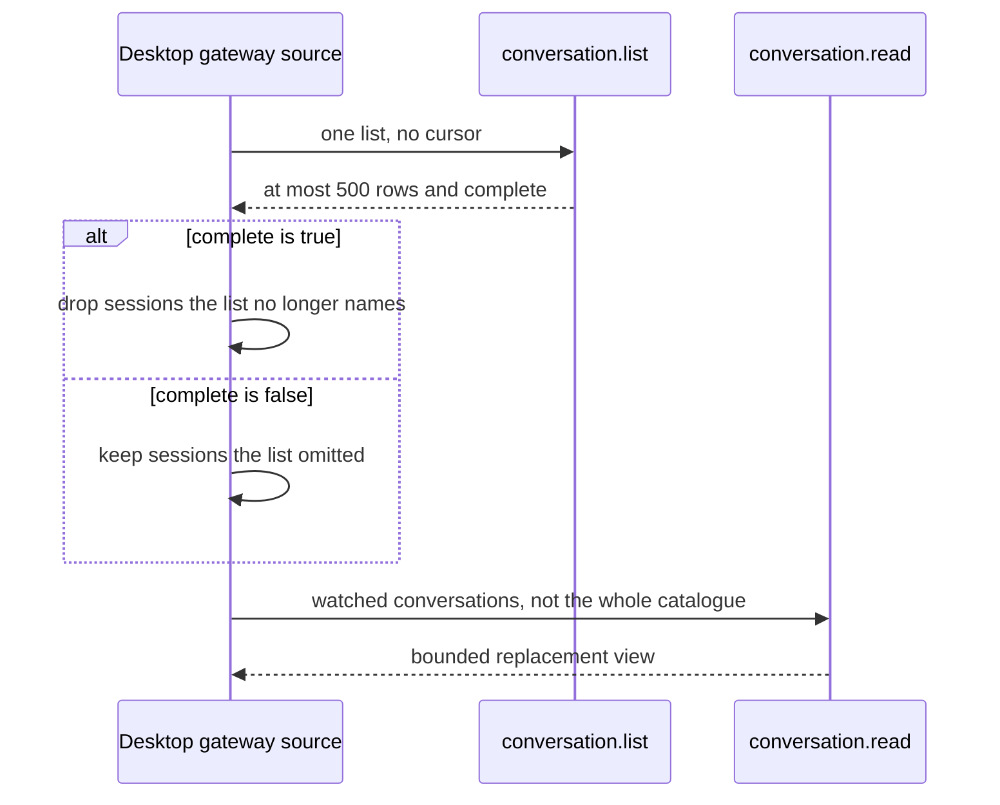
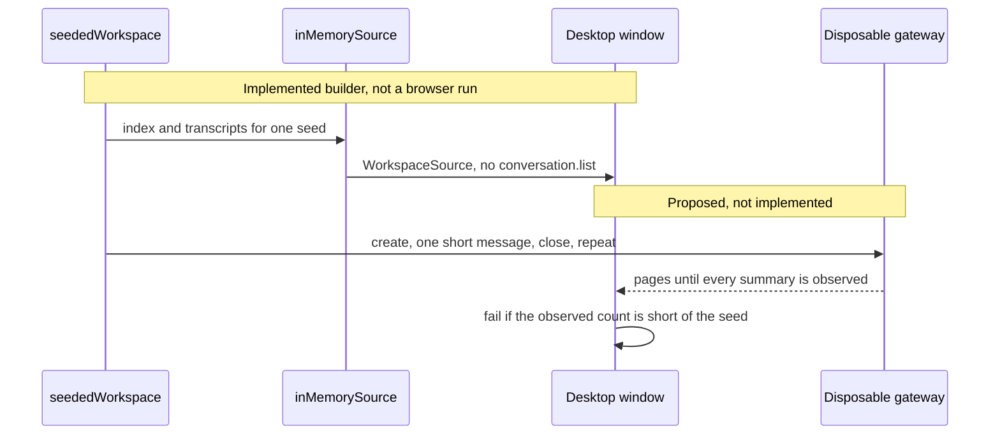

# UI workspace load (#590)

Status: investigation and a seeded builder. No browser load run is claimed.
Proposed journeys below are not implemented. This document does not change
the frame budget, the list bound, or the scope of #370 or #583.

The builder is `seededWorkspace` in
`src/desktop/workspace/adapters/in-memory/seeded-workspace.ts`. The window
still boots `sampleWorkspace`. Nothing in this change writes a fixture file.

## What load coverage exists

| Check | What it drives | Scale | Evidence |
| --- | --- | --- | --- |
| `verification/desktop/scripts/perf-budget.mjs` | Production desktop, sample workspace, calibrated 4× CPU. Chromium only: CDP throttling and Long Animation Frames. The interactions and the 50 ms unrounded-frame bound are the performance section of `verification/desktop/CHECKLIST.md`. | The sample index: 10 sessions in `starredSamples` and 18 in `labsSamples`. | Script JSON on stdout. #370 and #583 quote drag rows from their own runs. |
| `verification/desktop/scripts/message-sync.mjs` | Production desktop delivery of ready gateway text (#532). Included in `run-all`. Chromium is throttled; WebKit is measured without that throttle. | 30 active and 15 held-list/read samples per row, not a large catalogue. | `docs/reviews/startup-latency.md` and `verification/desktop/evidence/message-sync/`. |
| `verification/desktop/scripts/run-all.mjs` | Functional browser checks plus `perf-budget`. Several checks start a disposable gateway (`gateway-window.mjs`, `scripted-scenarios.mjs`, `scripted-e2e.mjs`). | One conversation or a short scripted scenario. | Each check's JSON. |
| `inMemorySource` | The `WorkspaceSource` port with the sample index, used by verification and previews. | The sample index above. | `src/desktop/workspace/adapters/in-memory/in-memory-source.test.ts`. |
| Gateway unit tests | `conversation.list` at `MAX_LISTED_CONVERSATIONS`, catalogue pages at `MAX_CATALOGUE_ENTRIES`. | The bound, not 10,000. | `crates/nessa-server/tests/conversation/listing.rs`, catalogue tests. |

No desktop script builds or renders 10,000 chats. `message-sync` is a delivery-timing check. A passing frame budget on the sample workspace is not a large-workspace result.

GitHub workflows in this repository set `node-version: 24`. Desktop evidence on #583 records Node 26.8.1 for that run. A later load run has to print `process.version`, the browser, and the UI revision it actually used. This investigation did not launch a browser.

## How the desktop gets its index today

Observed path. The workspace gateway source polls `conversation.list`. It does not call `conversation.catalogueManifest`.

`applyList` in `gateway-source.ts` treats an incomplete list as proof of nothing about the rows it left out. Those rows are not fetched by another call. There is no second page on `conversation.list`.

An incomplete list of 500, rendered as 500 rows, is a failed 10,000-chat test.

## Gateway bounds that a 10,000-chat run has to respect

Numbers below are the owners' published values. This change does not alter them.

| Bound | Value | Owner | What it means here |
| --- | --- | --- | --- |
| Listed conversations | 500 | `MAX_LISTED_CONVERSATIONS` in `crates/nessa-server/src/conversation/application/service.rs`. Wire `ConversationListResult.conversations.maxItems` is 500. `complete` is false when the bound left rows out. | The desktop index seam cannot receive 10,000 summaries in one list. |
| Catalogue page | 256 entries | `MAX_CATALOGUE_ENTRIES` in sync-engine `f2a05ef24fcff66df9d55e508539cec718e2d805` (`src/replication/catalogue/domain.rs`). Nessa consumes that constant; it does not restate it. | A client that walks manifest pages can address every stored row. The desktop workspace source does not. |
| Catalogue payload | 1 MiB | `MAX_CATALOGUE_PAYLOAD_BYTES` in that same sync-engine file. An oversized resolved value is `OversizedEntry` and does not advance the cursor (`docs/design/conversation-catalogue.md`). | One summary is far under this. This investigation did not time a 10,000-entry walk. Resolve is one descriptor at a time, so a full walk is one resolve per conversation plus the manifest pages. |
| Live conversation slots | 32 | `ConversationLimits::default.max_conversations` in `service.rs`. `create` and `read` take a slot (`read` calls `resolve`). When `close` succeeds, `release_live_slot` removes that slot. A close that fails leaves it. | Opening every chat and leaving it open stops at this cap. Listing does not open providers (`list` documents that). This investigation did not open a 33rd conversation or cycle create and close. |
| User message | 8192 UTF-8 bytes | `ConversationLimits::default.max_input_bytes`, `conversation.send` `x-utf8MaxBytes`, projection `MAX_TEXT`. | A longer "very long message" cannot be submitted on this seam. |
| Displayed messages | 24 | `MAX_MESSAGES` in `crates/nessa-protocol/src/conversation/projection.rs`. | The wire schema's `messages.maxItems` of 128 is a coarser ceiling. The projection is the display bound. |
| Displayed view | 60,000 bytes | `MAX_VIEW_BYTES` in that projection. `docs/design/transcript-fold.md` describes the same window: recent 24 message records, then the byte budget. | The desktop transcript renders `conversation.read`. It does not page the committed record journal. |
| Record page | 16 records, 65546 payload bytes, 131072 response bytes | `MAX_RECORD_PAGE_RECORDS`, `MAX_RECORD_PAGE_PAYLOAD_BYTES`, `MAX_RECORD_RESPONSE_BYTES` in `crates/nessa-protocol/src/product/generated.rs`. | History can be paged here. The open desktop transcript does not use that page as its render model. |
| Request frame | 65536 bytes | `product.max_payload_bytes` in `docs/limits.md`. | A single request past this is refused before decode. |
| Title | 48 characters | `ConversationTitle::MAX_CHARS`. | Gateway titles. The window's own cut for a first local message is `titleFrom` / `titleLength` in `src/desktop/workspace/model/transcript.ts`. Those are not the same function. |
| Preview | 512 UTF-8 bytes | `ConversationPreview::MAX_BYTES`. | Gateway list previews. |
| Unshown transcripts kept | 8 | `retention.unshownConversations`. | The source may hold every summary. The window drops conversation bodies it is not showing. |
| Overview bodies kept | 24 | `retention.overviewConversations`. | Past that, a waiting row's conversation is read when the row is chosen. |
| Sidebar branch | 3, plus on-screen and waiting rows | `branchCap` in `session-groups.ts`. | A collapsed channel is not a 10,000-row render. "Show all" is. |
| Session list and overview DOM | every id in the current filter | `SessionList` and the overview map their ids with no windowing. | 10,000 visible rows are 10,000 row elements. Virtualization is not proposed until a run measures that. |

No stored-conversation ceiling was found on `ConversationLimits` or the list query. That is not a measured insert of 10,000 rows. A conversation with no summary is left out of `conversation.list`.

## UI fixture and a disposable gateway

| | UI fixture | Disposable gateway |
| --- | --- | --- |
| Seam | `inMemorySource` accepts `{ index, transcripts }` from `seededWorkspace`. | `verification/desktop/scripts/lib/gateway-stack.mjs` starts a temporary gateway and removes its directory. Scripted turns use `scripts/mcp-test-server/scripted-agent.mjs`. No live model provider. |
| What 10,000 means | 10,000 `SessionSummary` values the index keeper (`consistentIndex`) retains, plus one transcript per id. | Not available through `conversation.list`. A list of 500 with `complete: false` must fail the test. |
| Titles | `titleFrom` of the opening sentence. Ids look like `load-00000`. They are not conversation UUIDs. | `ConversationTitle::new` / `for_message`. UUID conversation ids. |
| Previews and approvals | The preview is the last text part of the last message, with no call to `ConversationPreview`. A one-message session previews its opening sentence. A long transcript previews its long plain part, including lengths past 512 bytes. A waiting session uses `sampleApprovalOptions`, which includes `always`. | Preview owner is `ConversationPreview`. A gateway review does not offer `always`. |
| Long text | One plain-text part, plus a part that contains `**backup**` and `` `export.ts` ``, plus a `code` part. The plain part's length is whatever the spec asked, including lengths `conversation.send` would refuse. | A submitted message stops at 8192 UTF-8 bytes. The open view stops at 24 messages and 60,000 bytes. |
| What a measurement separates | Render and interaction cost of this process's data. | Transport, metadata, projection, and the live slot. Those costs are absent from the fixture. |

The same sentences can be fed to both seams only after each seam's owner has accepted them. Reusing a fixture string that `ConversationTitle::new` would reject is not a gateway dataset. Reusing a 10,000-id index that `conversation.list` truncated is not a successful gateway test.

## The seeded builder

`seededWorkspace(spec)` builds during the call. The spec carries `seed` (uint32), `now`, `sessions`, `longTranscripts`, `messages`, and `messageCharacters`. A spec that is not a whole run throws `SeededWorkspaceRefusal` with the field name: `seed`, `now`, `sessions`, `longTranscripts`, `messages`, `messageCharacters`, or `catalogue` when `defaultComposerModel` has nothing to return. `now` has to be a time `Date` can format, and so does every stored `updatedAt`, `startedAt`, and message time after the session index and the message span are subtracted. `1e20` is refused as `now`.

The draw is mulberry32. The same spec returns the same titles, previews, and the long transcript. A status draw uses that uint32's residue modulo 10: 0 is `needs-you`, 1 and 2 are `running`, and 3 through 9 are `idle`. Sessions spread across four channels (`load-desktop`, `load-release`, `load-reading`, `load-home`) by index, so 10,000 sessions are 2,500 in the largest channel.

Each session stores one opening message. The title is `titleFrom` of that message. A cut title gains an ellipsis. Those strings were not passed to `ConversationTitle::new`. The preview is the last text part of the last message (`SessionSummary.preview`, the last thing said). The first `longTranscripts` sessions are the long transcripts, and a long transcript has at least two messages: `messages: 1` with `longTranscripts > 0` is refused as `messages`. Those sessions store `messages` messages. Times run back from that session's `updatedAt`: the last message is at `updatedAt`, and each earlier message is one minute before the next. `updatedAt` is `now` minus the session index in minutes, so a message is not later than `now`. `startedAt` is one hour before `updatedAt`, or the first message's time when the transcript reaches further back than that hour. The last message's last text part has `messageCharacters` JavaScript characters of the ASCII sentence `The transcript line stays on the page. ` repeated and cut. For that sentence, the character length equals the UTF-8 byte length. The report's `longPlainTextCharacters` and `longTranscriptUtf8Bytes` are measured from the stored parts, not copied from the request. `longTranscriptUtf8Bytes` sums text, code, list items, step label, and step detail. The dry run's parts have no list items.

The dry run is `src/desktop/workspace/adapters/in-memory/seeded-workspace.test.ts`. It asks for 10,000 sessions, one long transcript of 8 messages, and a 4,000-character ASCII plain part. That part is under the 8192-byte send bound and was not submitted to a gateway. A separate case stores a 9,000-character part, so the builder is not clipping to that bound. The 10,000-session case checks `consistentIndex` kept every session, a transcript for each kept id, titles equal `titleFrom`, a second call matches, the in-memory source's `index` and `transcript` return those counts, and the report's sizes match a recount of the stored strings. It does not write a file and it does not start a browser.

That test proves the UI seam can hold the dataset. It does not prove a frame time, a DOM size, or a gateway round trip.

## Proposed journeys

Not implemented. A later run generates with an explicit seed at the start, records the seed, `seeded-workspace`, the git commit, counts, byte sizes, `process.version`, the browser, and the UI revision, and deletes disposable gateway state afterward. It does not check in the dataset.

| Journey | Surface that can show the count | Notes |
| --- | --- | --- |
| Initial load | Agents overview, which lists every filtered id. One channel's session list lists that channel. Sidebar "Show all" lists the channel. The collapsed branch does not. | Pass only when the rendered count equals the generated count for that surface. |
| Search and filter | Session list query and overview filter. | The query is the list's own state. |
| Scroll | The list or overview that actually mounted the rows. | |
| Open and switch | One session, then another. | On a gateway, do not leave more than the live slot cap open. |
| Type and send | The open long transcript. | Fixture send stays in `inMemorySource`. Gateway send stays within 8192 bytes. |
| Streaming | In-memory scripted reply, or the scripted agent. | No live model provider. |
| Split and drag | Existing pane gestures. | Frame budget stays the published 50 ms. Chromium supplies the calibrated frames. WebKit functional checks do not borrow that CPU throttle. |
| Close and reopen | The same session. | |
| Repeat navigation | Open and leave sessions. | Record retained DOM and, where the browser exposes it, heap. `performance.memory` is not a WebKit result. |

Metrics, each tied to the journey that produced it: time until the expected row count is in the document, interaction latency, frame maximum, median, and over-budget Long Animation Frame attribution on Chromium, DOM element count, and on a gateway run the list's `complete` flag, the row count, and the response timing. A gateway run also records whether `conversation.read` returned `truncated`.

Production preview, both layouts the frame budget already uses, Chromium and WebKit. The frame numbers that cite the 50 ms bound come from Chromium at 4× after calibration, the same rule as `perf-budget.mjs`. WebKit runs the functional journeys and is reported without that throttle.

## Gaps

- No browser measurement of 10,000 rows, of a long transcript, or of drag on that workspace.
- No insert of 10,000 gateway conversations, and no timed catalogue walk.
- The desktop cannot observe 10,000 summaries through `conversation.list`.
- A UI transcript longer than 24 messages or 8192-byte parts is a renderer fixture. It is not what `conversation.read` returns.
- List and transcript virtualization are unmeasured. They are not proposed as the fix.
- Native WKWebView is not this investigation.

## Follow-up slices

Filed separately from #590. They do not change #370 or #583.

- #595 measures the desktop UI on the seeded fixture. The script stays opt-in, outside the default `run-all` time. Pass means the rendered count matches the seed on the surface under test. Performance findings from that run are further issues. The fixture is not described as a gateway 10,000-chat test.
- #596 makes the desktop index observe every owned summary. The pass condition is a stored count above 500 where the UI's observed count equals the stored count. Raising `MAX_LISTED_CONVERSATIONS` and still rendering a truncated list is not that result. Listing must not open a provider per row. The live slot cap still bounds how many conversations are open at once.
