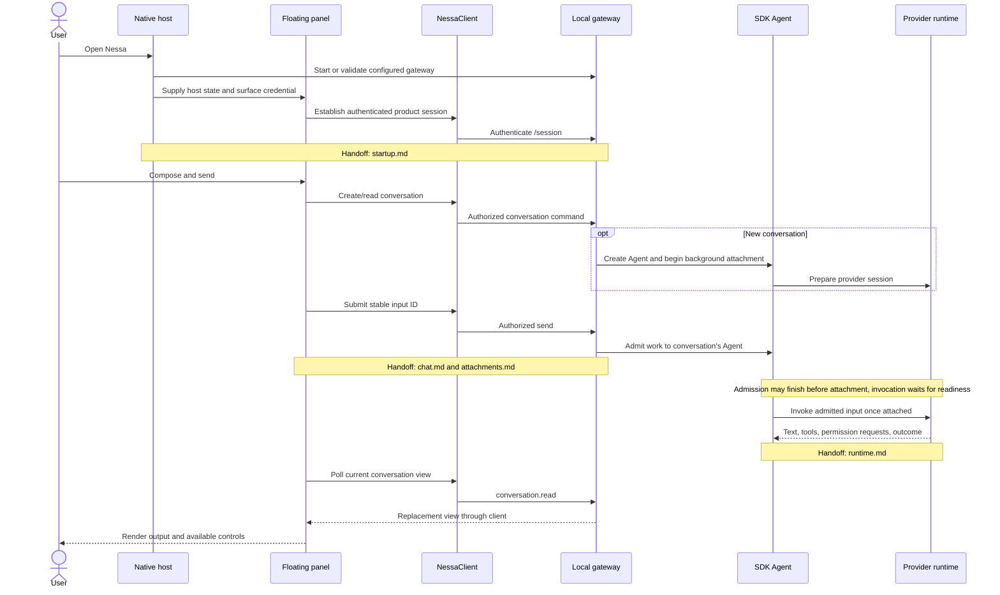

# Nessa feature map

Start with what a person does, then follow the sequence into the code that owns
the result. This map is a reading layer over the existing implementation and
canonical guides, not a replacement specification.

The initial inspection covers these local revisions:

| Repository | Inspected revision | Role |
| --- | --- | --- |
| `nessalabs/nessa-agent` | `52bc6cbca5c30ab119002101feeb8a31fe57d8eb` | Native host, floating panel, desktop workspace, client, gateway, SDK and local tools |
| `nessalabs/nessa-extensions` | `8dccc7fe5450936d0fd14e802a3abcbdb15d14d0` | Shared MCP App/server libraries and experiments domain |
| `nessalabs/nessa_ui` | `8aaeb437037c1c53de6276314b26d5fa0420da86` | Design system, stream parsing, package/registry distribution and Storybook |

Before the documentation PR, the branch was updated onto agent revision
`e3fe8cf8a731a4cc2169ef866303cee7b3f23814`. The extensions/UI and runtime maps
were refreshed for the new MCP App backend APIs in PR #377; the renderer remains
a separate placeholder. PR #376 also centralizes the agent's design-system import
paths. Other journeys retain their original inspection baseline and explicit
verification limits.

The documentation baseline was merged in [PR #385](https://github.com/nessalabs/nessa-agent/pull/385)
at `028f4642b93a19be9a083cd5a64c00302d4f6576`. Subsequent controlled validation
and regressions for R1–R6 are tracked in [issue #386](https://github.com/nessalabs/nessa-agent/issues/386);
see the [risk register](risks.md) for reproduced, corrected and falsified claims.

The agent consumes the separately pinned UI revision in
[`nessa-ui-revision`](../../../nessa-ui-revision), rather than necessarily using
the sibling UI checkout's `main`. Cross-repository paths are relative to this
checkout layout; GitHub may not resolve sibling checkout links.

## Choose a user flow

| What the person does | Follow this map | Boundaries to inspect for bugs |
| --- | --- | --- |
| Opens Nessa, completes setup, supplies a provider key, reconnects | [Startup and access](startup.md) | Window identity → credential authority → gateway readiness → session |
| Sends a chat, queues a follow-up, steers, stops, opens history | [Chat](chat.md) | Local draft → stable command identity → server ownership → replacement view |
| Chooses a model, grants a tool permission, installs an agent, restarts | [Runtime and tools](runtime.md) | Provider acknowledgement → local decision → audit/storage → physical cleanup |
| Pastes content, attaches a file/image, opens a link, reads rich output | [Attachments and content](attachments.md) | Gesture → type routing → transfer/reference → conversation hold → rendering |
| Summons a panel, opens the desktop, splits panes, moves widgets, changes settings | [Desktop and panel](desktop.md) | Host vs browser → workspace source → pane identity → focus/lifecycle |
| Opens an MCP App, develops an extension, consumes Nessa UI, runs Storybook | [Extensions and UI](extensions-ui.md) | Implemented server/reference host vs placeholder Nessa renderer; source vs compiled package |
| Wants the highest-value places to investigate next | [Bug and risk register](risks.md) | Evidence, reproduction status and owning flow |

## User flow: open Nessa and send a chat

This is the native floating-panel route through the maps. The browser route
uses cookie-based `/browser/session` authentication and does not start its own
gateway; follow [startup](startup.md) for that separate sequence. Follow the
detailed diagram at each handoff for platform branches, rejected operations,
retries and cleanup.

Continue with [launch and session](startup.md), [send and refresh](chat.md),
[provider/tool execution](runtime.md), and [content transfer](attachments.md).
The [desktop workspace](desktop.md) and [MCP App host](extensions-ui.md) maps
name their fixture or placeholder boundaries; do not infer that this gateway
sequence backs every screen in the repository.

## How to read evidence

- **Implemented:** traced through current composition and code. A nearby test
  is supporting evidence; it is not a claim that this inspection ran the test.
- **Fixture/reference:** runnable examples or in-memory behavior; not evidence
  that the corresponding live product integration exists.
- **Proposed/placeholder:** an ADR, planned slice, disabled control or explicit
  fallback. Its intended sequence is labeled separately.
- **Confirmed defect:** a concrete contradiction with source evidence or an
  actual reproduction. Each entry states which form of evidence exists.
- **Hypothesis:** a plausible interleaving or failure requiring reproduction.
- **Designed limitation:** an explicit current capability boundary, not an
  unexplained failure.

PR references come from local merge/squash history or cited repository records.
An issue number alone is not proof of a contributing PR, and these links do not
assert the PR's current remote status. Feature documents identify the evidence
they used. Documentation and source were inspected under a time budget; the map
does not claim an exhaustive dynamic audit of every platform or UI primitive.

## Existing authoritative guides

- [Architecture](../../ARCHITECTURE.md) and [code ownership](../../codebase-structure.md)
- [Gateway chat](../../guides/gateway-chat.md) and [local authentication](../../guides/local-auth.md)
- [SDK execution guides](../../../crates/nessa-sdk/docs/agent_execution/README.md)
- [MCP connection design and current states](../../design/mcp-connections.md)
- [Decision records](../../adr/README.md): `done` and `todo` carry different implementation meanings

## Maintaining this map

Update the user-flow diagram when its owning code changes. Keep the code and
test links close to the sequence they support, preserve explicit platform and
fixture boundaries, and add a verified PR reference when that contribution can
be established. When a suspected bug is reproduced or disproved, update its
evidence and the [risk register](risks.md) together.
