# Attachments, pasted content, and rich messages

This map follows a person's content from the floating panel's composer through the native host, TypeScript client, gateway, image store, SDK, and ACP provider boundary. It also covers what the person sees on return and where a clicked link goes. The desktop workspace has a different, partly prototype transcript contract; it does not inherit the panel's attachment pipeline merely by sharing UI components.

Mapping baseline: `nessa-agent` commit `52bc6cbc`; the documentation merged in #385 at `028f4642`. Source and named regression tests were initially inspected without execution. The subsequent R2/R4 confirmation and local fix below use actual-App regressions against that merged baseline. Historical PR validation is attributed to its commit message, not presented as a new result. See [chat](chat.md), [desktop](desktop.md), [runtime](runtime.md), [startup](startup.md), and [extensions/UI](extensions-ui.md) for adjacent flows.

## Ownership and representations

| What the person sees | Authoritative representation and owner | Boundary to inspect when it breaks |
| --- | --- | --- |
| Text and pasted-text pills | Ordered `MessageContent` parts in the conversation draft; pasted payload is retained separately from its label | Editor DTO → `fromEditor` → `contentText`; the gateway receives concatenated text, not pill identities |
| Draft image tile | Original `File`/`Blob` and object URL outside Redux; serializable file metadata and upload state inside the draft | Native one-shot read ticket or browser file → resource store → upload |
| Uploaded image | Gateway-returned digest, MIME type, and stored size; a conversation owns a usable hold | Original digest identifies the transfer; normalized digest identifies provider bytes |
| Non-image file tile | Host-reported absolute path; no bytes retained for a path-only file | Path validation → naming audit → ACP `resource_link` → optional provider file read |
| Sent or reopened attachments | Local originals while retained; otherwise image/file references | Gateway view is metadata, not an attachment download API |
| Rich reply | Panel's Markdown source; shared UI derives HTML/code/math/diagram views | `MessageMarkdown` versus the desktop's narrower structured `Part` renderer |

The [conversation attachment model](../../../src/conversation/model/attachments.ts) owns type classification and draft/message admission. [Attachment resources](../../../src/panel/adapters/attachment-resources.ts) own local bytes and object URLs. [Gateway attachment service](../../../crates/nessa-server/src/attachments/application/service.rs) owns upload ordering; its [module map](../../../crates/nessa-server/src/attachments/mod.rs) identifies domain and adapter ownership. [ACP prompt content](../../../crates/nessa-sdk/src/infrastructure/acp/executions/prompt_content.rs) owns provider serialization and image hydration.

Two tickets have similar token shapes but different authority: the **native read ticket** permits one host read of an already chosen path, with a ten-minute lifetime and a 1,024-entry bounded book; the **gateway upload ticket** permits one transfer into a caller's conversation, with a five-minute lifetime. Neither is an execution receipt or a general file-read permission.

## User flow: Paste text or code and inspect the full pasted payload

The panel's Markdown editor inserts a short plain-text paste as Markdown. At 500 JavaScript string units or more, a paste becomes a `pasted-text` chip, except that a paste inside an existing code block is inserted literally into that block. When clipboard text exists it takes priority over clipboard files; with no text, files go to [attachment admission](#user-flow-attach-files-with-the--picker-or-clipboard). External dragged text becomes a pasted-text chip even when short, via the [drop flow](#user-flow-drop-files-folders-text-or-a-web-image).

Clicking the chip opens its full original text in the compact Markdown viewer; expansion opens the larger viewer. Draft changes retain file tiles alongside editor-owned text/chips. Switching tabs restores that tab's chip payloads and closes expansion. Sending concatenates text and pasted payloads in order, including whitespace, while keeping the local parts independently inspectable. A gateway-restored message is ordinary text plus attachment references: the wire has no pasted-chip structure to recreate.

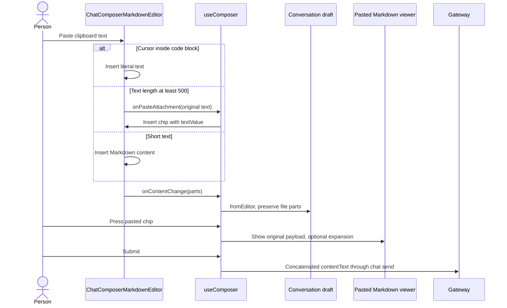

Implementation: [composer coordination](../../../src/panel/ui/use-composer.ts), [editor DTO conversion](../../../src/conversation/ui/composer-content.ts), [ordered content/flattening](../../../src/conversation/model/content.ts), [panel viewer and editor wiring](../../../src/panel/ui/app.tsx), and the sibling UI package's [Markdown editor](../../../../nessa_ui/packages/react/src/components/chat-composer-markdown-editor.tsx). The sibling path is useful in this workspace; package provenance belongs to [extensions/UI](extensions-ui.md).

Regression evidence: [composer-content tests](../../../src/conversation/ui/composer-content.test.ts) cover ordered text/pasted payload round trips without interpreting payload Markdown and a pasted-only draft; [composer tests](../../../src/panel/ui/use-composer.test.ts) cover submit and viewer coordination; [message-content tests](../../../src/conversation/ui/message-content.test.ts) cover pills beside Markdown syntax. Historical contribution: [PR #28](https://github.com/nessalabs/nessa-agent/pull/28), GitHub squash commit [`298be654`](https://github.com/nessalabs/nessa-agent/commit/298be654b528d01e369867d52fd18427edc1b39d), introduced the Markdown composer, expandable viewer, and ordered pasted parts. Its message explicitly credits [nessa_ui PR #83](https://github.com/nessalabs/nessa_ui/pull/83).

Bug tracing: wrong text at the provider starts at `contentText`, not the chip label; missing pill after reopening is a **designed representation limitation**, because `referencedContent` reconstructs plain text. Missing pill beside a link, fence, HTML-looking text, or table starts at the structural renderer described [below](#user-flow-read-rich-text-code-math-and-diagrams-in-a-message).

## User flow: Attach files with the + picker or clipboard

Pressing `+` captures the receiving conversation before opening the native picker. The host returns file descriptions and read tickets after readiness checks. Cancellation returns an empty selection. A regular non-image file remains a path-only attachment, regardless of its disk size. An image's bytes are read with its native ticket, then routed into the same image pipeline used by browser files. One failed image read or unusable path refuses the entire selection instead of attaching a misleading subset.

Outside Tauri, `chooseAttachmentFiles` returns no host capability and the hook opens its browser file input. A browser `File` has no absolute path: images can upload, but a browser-selected non-image cannot be sent through the local path contract. Clipboard files also arrive as browser `File` values and follow the same rule. This is a **designed limitation**, not proof that the gateway cannot reference non-image files.

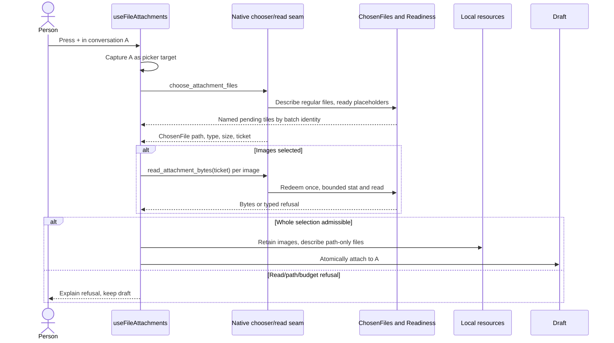

Follow-on flows: [waiting for a cloud file](#user-flow-wait-for-a-cloud-file-without-attaching-it-to-another-tab), [uploading an image](#user-flow-upload-an-image-and-retry-a-failed-upload), [sending a file path](#user-flow-send-a-non-image-file-by-path-and-approve-its-read), and [previewing/removing tiles](#user-flow-preview-or-remove-a-draft-attachment).

Implementation: [useFileAttachments](../../../src/panel/ui/use-file-attachments.ts), [host seam](../../../src/host/window.ts), native [choosing](../../../src-tauri/src/attachments/choosing.rs), [file description](../../../src-tauri/src/attachments/files.rs), [content-type dispatch](../../../src-tauri/src/attachments/content_type/mod.rs), [ticket book](../../../src-tauri/src/attachments/tickets.rs), and [bounded read](../../../src-tauri/src/attachments/reading.rs). `declaredMediaType(name, reportedType)` uses the browser/platform type first and known image extensions only when that answer is absent/generic. A type beginning `image/` goes to the gateway; whether that encoding actually decodes is decided there.

Regression evidence: [picker tests](../../../src/panel/ui/use-file-attachments-picker.test.ts) include a huge path-only file, cancellation, browser fallback, mixed image/file selections, atomic refusal on image-read failure, platform-recognized image formats, invalid paths, and a conversation closed before/during reads. [Attachment model tests](../../../src/conversation/model/attachments.test.ts) cover classification and path constraints. Native reading/ticket modules contain their own test modules. Historical contribution: [PR #122](https://github.com/nessalabs/nessa-agent/pull/122), squash [`88280b86`](https://github.com/nessalabs/nessa-agent/commit/88280b86d61f4f6e0a4d7b96f237648a6836249b), made non-images path-based, unified picker/drop type routing, added native read tickets, and rebuilt host drag handling.

Bug tracing: a picked `.ico` sent as a file while a dropped `.ico` uploads as an image was a **historically confirmed and fixed** route mismatch documented by that commit and current picker tests. A native byte-read ticket is spent even when the read fails; choosing again mints a new ticket. Gateway upload Retry is a different operation.

## User flow: Drop files, folders, text, or a web image

In the native app, `dragDropEnabled` lets the host obtain file paths and consumes HTML5 drag/drop events. Native drops therefore arrive through host events, not `FileDropZone`. The host snapshots drag-board text while the drag session is alive, describes files through the chooser's shared rules, and walks folders under its own bounds. The panel resolves both successful files and delayed refusals against the batch's original conversation.

In a browser, `AttachmentDropZone` owns file drops and reports both the accepted files and a typed refusal for rejected files. `useContentDrop` intercepts folder entries first; byte-carrying files remain for the drop zone. Without files, an image-only HTML/URL drop is downloaded, otherwise text or URI-list content becomes a pasted-text chip. Rich selections containing both prose and an inline image stay prose. A navigation guard prevents an external drop from replacing the panel page.

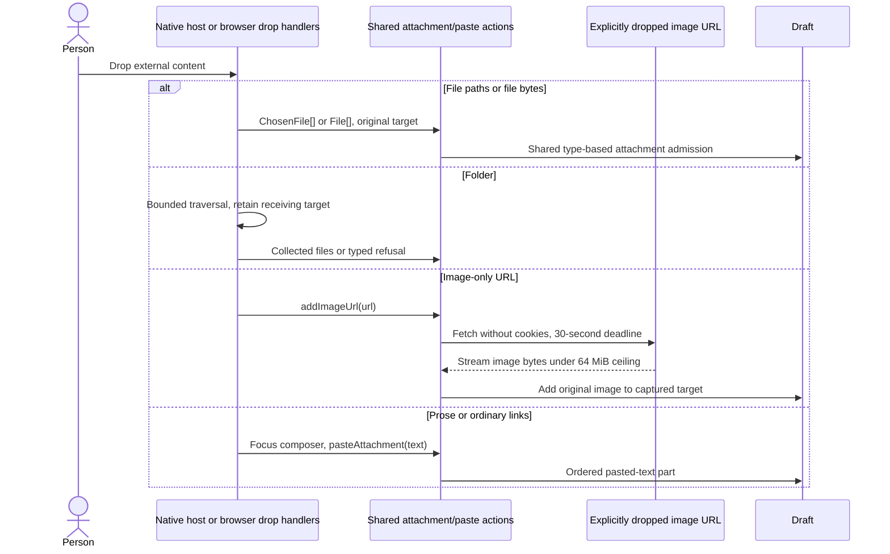

Follow-on flows: [paste](#user-flow-paste-text-or-code-and-inspect-the-full-pasted-payload), [attachment admission](#user-flow-attach-files-with-the--picker-or-clipboard), and [image upload](#user-flow-upload-an-image-and-retry-a-failed-upload).

Implementation: native [dropping](../../../src-tauri/src/attachments/dropping.rs) and [drag-board snapshot](../../../src-tauri/src/attachments/dragged.rs); panel [host-drop routing](../../../src/panel/ui/use-host-drop.ts), [browser drop zone](../../../src/panel/ui/attachment-drop-zone.tsx), [browser content routing](../../../src/panel/ui/use-content-drop.ts), [folder coordination](../../../src/panel/ui/use-folder-drop.ts), [folder traversal](../../../src/panel/adapters/dropped-folder.ts), [image URL detection/download](../../../src/panel/adapters/dropped-image.ts), [text extraction](../../../src/panel/adapters/dropped-text.ts), and [drop navigation guard](../../../src/panel/adapters/use-drop-navigation-guard.ts).

Regression evidence: [host-drop tests](../../../src/panel/ui/use-host-drop.test.ts), [content-drop tests](../../../src/panel/ui/use-content-drop.test.ts), [drop-zone tests](../../../src/panel/ui/attachment-drop-zone.test.ts), [dropped-text tests](../../../src/panel/adapters/dropped-text.test.ts), [dropped-image tests](../../../src/panel/adapters/dropped-image.test.ts), and [folder tests](../../../src/panel/adapters/dropped-folder.test.ts). Historical contribution: [PR #34](https://github.com/nessalabs/nessa-agent/pull/34), squash [`ee1970f7`](https://github.com/nessalabs/nessa-agent/commit/ee1970f7), introduced local attachment resources and content drops; [PR #122](https://github.com/nessalabs/nessa-agent/pull/122) replaced the native entry path while retaining browser handling.

Bug tracing: a URL download may fail because of HTTP status, missing/non-image content type, CORS/CSP, timeout, abort, or size. The hook collapses these into `unreadable-image-url`; that notice alone does not identify which boundary failed. **R2, reproduced before the local fix:** with the first image fetch held pending, the actual App accepted a second host image-URL drop without a second fetch, draft file, or refusal. The tracked regression failed because `Still reading files` was absent. `addImageUrl` now emits the existing `reading-files` refusal for that second gesture while preserving the first read. See the [race regressions](../../../src/panel/ui/use-file-attachments-races.test.ts) and [execution evidence](#r2r4-regression-execution).

## User flow: Wait for a cloud file without attaching it to another tab

### Read and submission orderings for R2/R4

`useFileAttachments` owns one local read phase and its captured conversation; a picked selection may read several image files within that phase.
Host readiness remains separately keyed by host file identity. A pending native
image read uses the existing local-read state also used by URL images; it is not
an attached/uploading draft file yet. This table records the intended ordering
before the R2/R4 implementation change. Each race-suite row is exercised by the [actual-App regressions](../../../src/panel/ui/use-file-attachments-races.test.ts).

| Starting state / event order | Intended observable outcome | Regression evidence |
| --- | --- | --- |
| Idle → ordinary Enter | Text submits normally | Race suite ordinary-text control |
| URL read pending → another URL drop | Refuse second gesture as `reading-files`; preserve first read; no second fetch | Race suite concurrent URL drop |
| Native image read pending → Enter in original conversation | Keep draft, show loading refusal, call no send port | Race suite pending native read |
| Native image read → success → upload settles → Enter | Clear local pending tile, attach original image to captured draft, then send gateway reference | Race suite settled read and send |
| Native image read → failure → Enter | Clear local read/pending state; explain read failure; text can subsequently submit | Race suite failed read |
| Native image read in A → switch to B → Enter → return to A | B's text can submit; A remains pending and cannot send until its own read settles | Race suite conversation switch |
| Native image read → remove an already-attached draft file | Remove only that draft file; keep new read pending and block submission | Race suite removal while reading |
| Native image read → originating tab closes → read succeeds | Do not attach to replacement tab; clear pending read and explain original conversation closed | Existing picker closed-during-read regression; race suite closed target |
| Native image read → surface unmounts → read settles | No late draft/resource attachment or React state publication | Race suite unmounted read |

A placeholder is not treated as a usable path just because its metadata exists. Readiness dispatches on the file's state, not its MIME type. The implemented macOS handler asks iCloud to materialize the file, polls under a bound, and the fallback refuses unsupported dataless providers honestly. While waiting, the panel shows a named pending tile and prevents submission for that tile's conversation. Pending tiles are keyed by host file identity, not basename, so two `report.pdf` files remain independent.

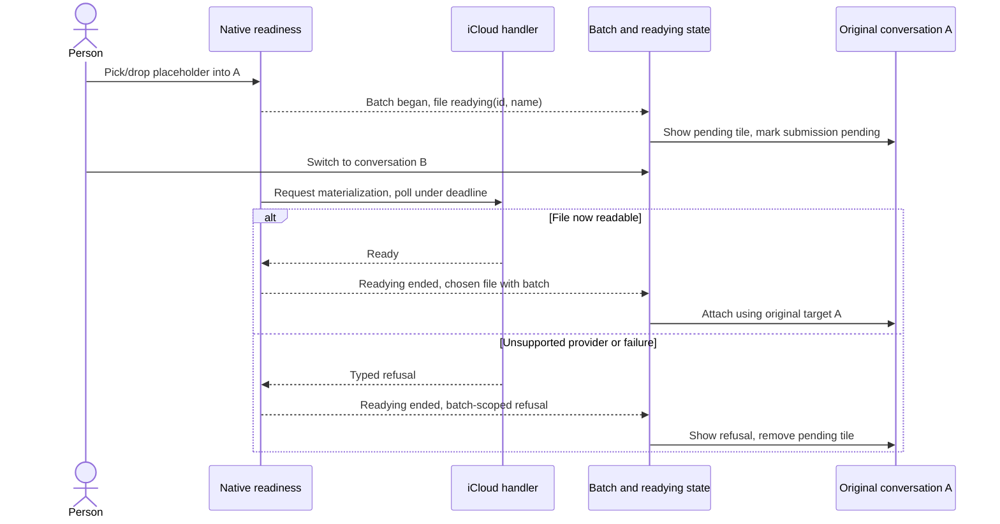

Follow-on flows: [picker/read](#user-flow-attach-files-with-the--picker-or-clipboard) and [sending files](#user-flow-send-a-non-image-file-by-path-and-approve-its-read). If the original conversation closes before the selected files arrive, the attach is refused and `conversation-closed` is shown where the person is currently looking.

Implementation: [readiness seam](../../../src-tauri/src/attachments/readiness.rs), [iCloud adapter](../../../src-tauri/src/attachments/readiness/icloud.rs), [batch identity](../../../src-tauri/src/attachments/batch.rs), [panel target and pending bookkeeping](../../../src/panel/ui/use-file-attachments.ts), [mounted live-region status](../../../src/panel/ui/attachment-notices.tsx), and [composer send guard](../../../src/panel/ui/app.tsx). The panel remembers the most recent 64 batch→conversation bindings; eviction falls back to the active tab, a bounded-memory tradeoff explicitly documented in the hook.

Regression evidence: [readying tests](../../../src/panel/ui/use-file-attachments-readying.test.ts) cover independent pending identities, settlement on either outcome, submission refusal, tab switching, picker-vs-drop binding, and overlapping gestures. Readiness modules contain seam tests. [PR #122](https://github.com/nessalabs/nessa-agent/pull/122) supplies the historical readiness and conversation-binding contribution. Real cloud-provider integration is not established by these doubles.

Bug tracing: pending tile on the wrong tab or stale refusal after a switch starts with `gesture`, batch mapping, and `conversationOf`, not MIME detection. **R4, reproduced before the local fix:** with a native picked-image byte read held pending, Enter in the actual Markdown editor sent existing text with empty image/file lists and cleared the draft. The tracked regression failed because the send port had been called. `addChosenFiles` now publishes the captured conversation as pending before requesting bytes, so the existing composer guard preserves the draft and shows `Attachments still loading`. Settlement clears local pending state; success attaches only to the captured conversation, failure permits later text submission, and unmount discards the late result. The [race regressions](../../../src/panel/ui/use-file-attachments-races.test.ts) cover these orderings separately from cloud readiness; see [execution evidence](#r2r4-regression-execution).

## User flow: Upload an image and retry a failed upload

An attached image starts at `not-started`. The upload pump searches drafts across tabs, starts at most three uploads per window, and hashes the **original** retained bytes. It first changes the draft state to `uploading`; if the file was removed or already claimed, no transfer starts. A known `imageInput: false` prevents uploads; an unknown capability is not treated as a refusal. The gateway conversation is created before `attachment.begin`.

`attachment.begin` goes over the authenticated product socket. It either returns an already-held stored reference or a ticket. The transfer is a separate `PUT /attachments` with `x-nessa-upload-ticket`, no cookies, and redirects refused. The gateway checks ticket authority, length, and digest before normalization. Its default limits are four transfers and two normalizations concurrently, 120 seconds for transfer, 64 outstanding tickets globally/32 per organization/16 per conversation. The TypeScript upload call has its own three-minute deadline. Capacity refusal leaves the ticket usable; other transfer endings spend it.

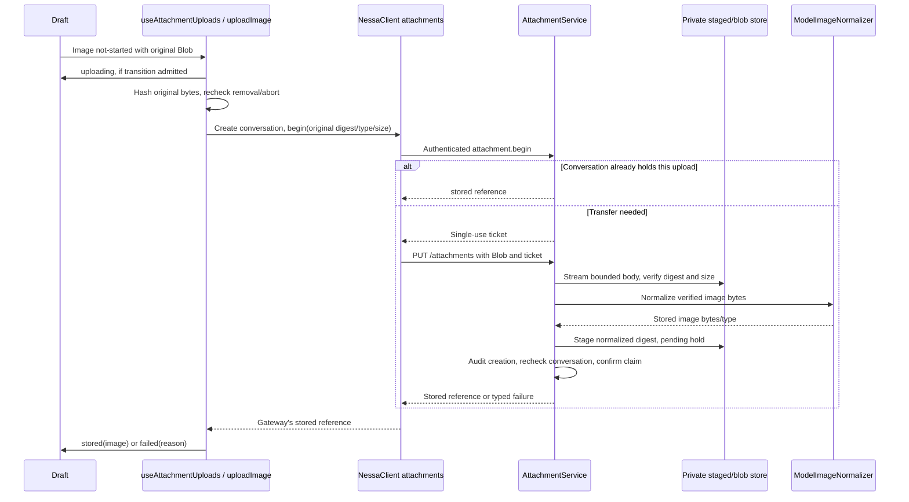

Follow-on flows: [send uploaded images](#user-flow-send-uploaded-images-to-the-agent) and [remove/abort](#user-flow-preview-or-remove-a-draft-attachment).

Implementation: [pump](../../../src/panel/ui/use-attachment-uploads.ts), [upload ordering](../../../src/panel/application/upload-image.ts), [state transition owner](../../../src/conversation/application/usecases/attachments.ts), [staging thunk](../../../src/conversation/adapters/store/slice.ts), [gateway effects](../../../src/conversation/adapters/gateway/effects.ts), [client attachment API](../../../packages/nessa-client/src/presentation/attachment-api.ts), [client HTTP transport](../../../packages/nessa-client/src/transport/attachment-upload.ts), [product begin mapping](../../../crates/nessa-server/src/product/attachment.rs), [HTTP entrypoint](../../../crates/nessa-server/src/attachments/entrypoint/http.rs), and [ticket domain](../../../crates/nessa-server/src/attachments/domain/aggregates/ticket_book.rs).

The client API does not retry automatically. The panel gateway adapter retries only `temporarily_unavailable` PUT responses on bounded delays using the same unspent ticket. A visible Retry moves a failed tile back to `not-started`; the pump begins again, allowing already-held recovery. A late result for a removed file cannot put its tile back because the upload-state owner changes draft files only.

Regression evidence: [upload application tests](../../../src/panel/application/upload-image.test.ts), [pump tests](../../../src/panel/ui/use-attachment-uploads.test.ts) including StrictMode/old-snapshot duplicate prevention, immediate slot reuse on removal, and queued-image progress; [staging store tests](../../../src/conversation/adapters/store/attachments.test.ts); [gateway-effects tests](../../../src/conversation/adapters/gateway/effects.test.ts); [client API tests](../../../packages/nessa-client/src/presentation/attachment-api.test.ts); [transport tests](../../../packages/nessa-client/src/transport/attachment-upload.test.ts); and server [application](../../../crates/nessa-server/tests/attachments/application.rs), [HTTP](../../../crates/nessa-server/tests/attachments/http.rs), [wire](../../../crates/nessa-server/tests/attachments/wire.rs), and [gateway](../../../crates/nessa-server/tests/attachments/gateway.rs) tests. [PR #87](https://github.com/nessalabs/nessa-agent/pull/87), squash [`b39136ff`](https://github.com/nessalabs/nessa-agent/commit/b39136ff65b5ea7a201413b53fb92da632db5296), introduced end-to-end image sending, tickets, storage, normalization, and visible send declines.

Bug tracing: capture file identity, original digest/size, ticket phase, returned stored reference, and typed failure separately. An upload reported successful under the original digest is suspicious whenever normalization changed bytes. For a removed tile that still uploads, inspect cancellation propagation and post-hash checks; for an endlessly waiting fourth image, inspect `pump()` after settlement, not only the React draft-change effect.

## User flow: Have a large or unfamiliar image normalized and kept once

The panel does not compress or scale images. The gateway's injected normalizer translates SDK catalog limits into `nessa-images` limits. The image library reads encoding from the bytes, applies decode/pixel/memory bounds, turns orientation upright, scales, and fits encoding/quality to the consumer. An acceptable supported image may pass through unchanged after decode validation; otherwise the output is PNG or JPEG. Original name/type/preview and normalized digest/type/size can legitimately differ.

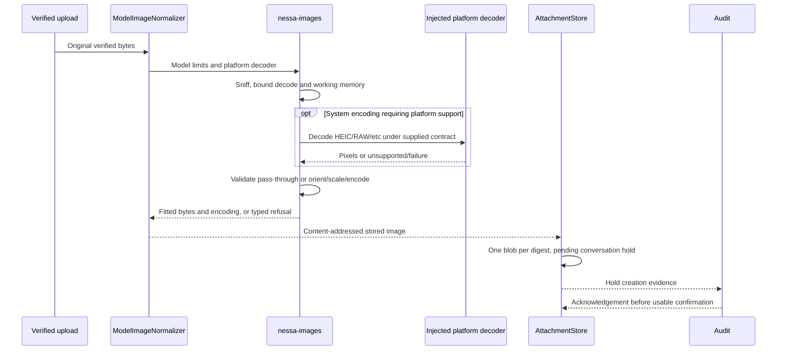

Follow-on flows: [upload](#user-flow-upload-an-image-and-retry-a-failed-upload), [provider delivery](#user-flow-send-uploaded-images-to-the-agent), and [cleanup](#user-flow-stop-or-delete-a-conversation-and-release-its-uploaded-images).

Implementation: [model normalizer](../../../crates/nessa-server/src/attachments/infrastructure/normalizer.rs), [composition](../../../crates/nessa-server/src/composition/attachments.rs), [image pipeline](../../../crates/nessa-images/src/normalize.rs), [sniffing](../../../crates/nessa-images/src/sniff.rs), [memory budgets](../../../crates/nessa-images/src/budget.rs), [platform selection](../../../crates/nessa-images/src/platform/select.rs), [store](../../../crates/nessa-server/src/attachments/infrastructure/store.rs), and [holds](../../../crates/nessa-server/src/attachments/domain/entities/hold.rs). The store remembers uploaded and normalized identities, so repeating the original upload can recover its normalized reference without another PUT. Same blob digest with distinct valid type/hold metadata is not the same hold identity.

Regression evidence: [normalization](../../../crates/nessa-images/tests/normalize.rs), [pass-through](../../../crates/nessa-images/tests/passthrough.rs), [memory](../../../crates/nessa-images/tests/memory.rs), [platform](../../../crates/nessa-images/tests/platform.rs), [normalizer adapter](../../../crates/nessa-server/tests/attachments/normalizer.rs), [store](../../../crates/nessa-server/tests/attachments/store.rs), and [service over real store](../../../crates/nessa-server/tests/attachments/service_over_store.rs). Server application tests distinguish unsupported encoding, no image input, cannot-fit, failed normalization, and fewer normalizations than transfers. [PR #87](https://github.com/nessalabs/nessa-agent/pull/87) introduced this path.

Bug tracing: RAW/HEIC works on one OS and fails on another can be a **designed capability limit**: the platform decoder is ImageIO on macOS and absent elsewhere. Being recognized as `image/*` does not promise decoder support. A preview displaying the original while the provider sees a resized image is also designed. A digest with bytes but no usable conversation hold is not an authorized send; pending holds stay invisible until their audit/confirmation ordering settles.

## User flow: Send uploaded images to the agent

An image-only message is sendable; text is not required. Before beginning a turn, the panel refuses non-sendable files, failed/in-progress uploads, too many images, excess normalized bytes, too many file paths, or unsupported image input. The draft's upload-byte limits and the message's stored-image limits are different: a draft may hold 20 attachments/128 MiB, while one message carries at most 10 stored images/10 MiB and at most 10 file links. The panel uses the gateway's returned reference, not its original hash.

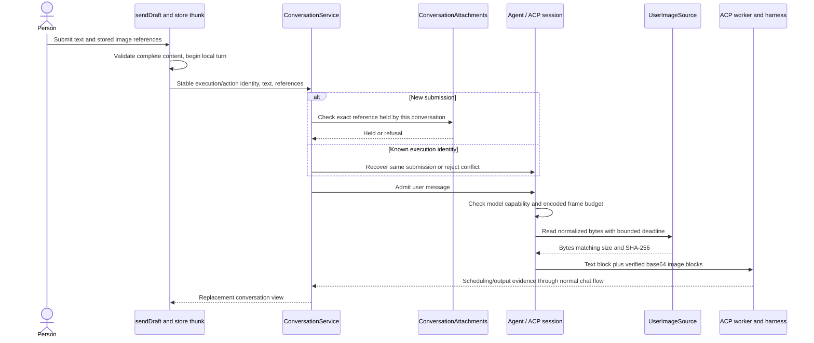

Continue in [chat submission and transcript](chat.md) and [runtime/provider execution](runtime.md).

Implementation: [send-draft use cases](../../../src/conversation/application/usecases/send-draft.ts), [store submission/staging](../../../src/conversation/adapters/store/slice.ts), [reference rules](../../../src/conversation/model/attachments.ts), [gateway service](../../../crates/nessa-server/src/conversation/application/service.rs), [conversation hold adapter](../../../crates/nessa-server/src/attachments/infrastructure/conversation.rs), [stored image source](../../../crates/nessa-server/src/attachments/infrastructure/images.rs), [SDK image port](../../../crates/nessa-sdk/src/application/agent_execution/providers/images.rs), [ACP hydration/serialization](../../../crates/nessa-sdk/src/infrastructure/acp/executions/prompt_content.rs), and [ACP worker capability enforcement](../../../crates/nessa-sdk/src/infrastructure/acp/executions/worker.rs).

ACP image reads run on the caller/session task, not the worker that polls close and provider output. The session charges encoded in-flight bytes before reads; the charge remains with prepared blocks until frame delivery/drop. The complete image-read phase is bounded at ten seconds, shortened by an applicable operation deadline. The worker also checks the connected harness advertised image support. The frame estimate includes JSON escaping, base64 growth, file links, and envelope allowance; admitting a raw-byte total alone would be insufficient.

Regression evidence: [conversation attachment tests](../../../crates/nessa-server/tests/conversation/attachments.rs), [frontend store attachment tests](../../../src/conversation/adapters/store/attachments.test.ts), [ACP image contracts](../../../crates/nessa-sdk/tests/infrastructure/acp/contracts/images.rs), and [attachment agreement tests](../../../crates/nessa-server/tests/attachments/agreement.rs). These inspect conversation ownership, malformed/missing references, post-release same-ID recovery, capability enforcement, mismatched byte-source results, deadlines, and close interactions. Inspect exact test bodies for a particular ordering; this map does not claim the suites ran.

Bug tracing: a successful upload followed by `attachment_not_found` starts with hold metadata and organization/conversation identity. A provider's image refusal after admission starts with model versus negotiated harness capability. A same-ID delivered retry after a close must recover its original submission rather than rechecking now-released holds: current gateway code bypasses the new-upload hold check only for an already-known invocation, leaving the SDK to validate same payload versus conflict.

## User flow: Send a non-image file by path and approve its read

Native non-image attachments carry only an absolute local path. Neither the gateway nor the ACP content mapper reads that file. The gateway validates path meaning: byte length, absolute root, no control characters, no empty/`.`/`..` components. It deliberately does not check file existence, workspace containment, or file contents. A file-only message can be sent, and a huge path-only file spends no local binary-byte budget.

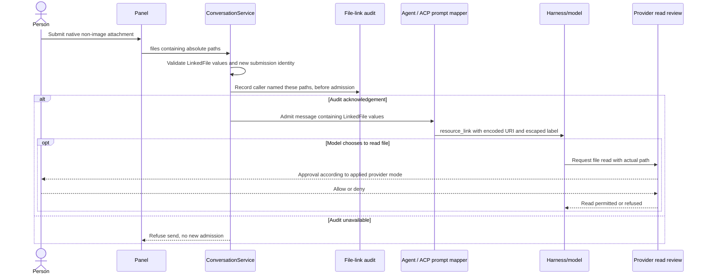

Follow [chat permission flows](chat.md) and [runtime provider modes](runtime.md) for the actual read decision. The default Ask mode is the security rationale recorded by [ADR 0013](../../adr/done/0013-files-by-path-not-by-payload.md). An applied non-default provider approval mode changes whether a read prompts; linking a path is not itself proof a prompt occurred, that the file was read, or that a chosen file stayed unchanged.

Implementation: [frontend LinkedFile/path rules](../../../src/conversation/model/attachments.ts), [SDK LinkedFile value](../../../crates/nessa-sdk/src/domain/agent_execution/prompts/value_objects/user_message.rs), [client conversation API](../../../packages/nessa-client/src/presentation/conversation-api.ts), [gateway send audit/admission](../../../crates/nessa-server/src/conversation/application/service.rs), [private naming audit adapter](../../../crates/nessa-server/src/conversation/infrastructure/file_link_audit.rs), and [ACP prompt mapper](../../../crates/nessa-sdk/src/infrastructure/acp/executions/prompt_content.rs).

`file_uri` percent-encodes every byte outside RFC 3986 unreserved characters and `/`; `markdown_label` escapes all ASCII punctuation. They constrain generated syntax rather than prohibiting ordinary punctuation in filenames. The audit records naming intent, exact paths, conversation/organization/execution, and verified initiator before admission. Known invocation retries skip a new naming record; the SDK rejects conflicting same-ID payloads instead of letting a false naming trail stand for a delivered file.

Regression evidence: [linked-file gateway tests](../../../crates/nessa-server/tests/conversation/linked_files.rs), [naming-audit tests](../../../crates/nessa-server/tests/conversation/file_link_audit.rs), [ACP prompt-link attack tests](../../../crates/nessa-sdk/tests/infrastructure/acp/executions/prompt_link_attacks.rs), and [picker tests](../../../src/panel/ui/use-file-attachments-picker.test.ts). [PR #122](https://github.com/nessalabs/nessa-agent/pull/122) records historically confirmed fixes for URI parentheses/backslash injection, two-file label/target confusion, and forged naming evidence on a conflicting retry; the attack suite uses a CommonMark parser and percent-decoder rather than asserting raw string similarity.

Bug tracing: the path must identify the same file in the native description, message, naming audit, resource link, and later read-review arguments. A label looking correct is insufficient. Files moved/replaced after attachment can fail or expose different contents later: this is a **designed local path-reference limitation**. Remote clients cannot use these paths as file payloads; remote file transport is outside this implemented feature.

## User flow: Understand an attachment refusal and choose a useful recovery

The composer can report two independent subjects: a fact about files already in the draft, and the most recent refused attempt. Both appear when both apply; a stale picker/drop refusal cannot hide failed-upload Retry. Only an attempt refusal can be dismissed. Successful attachment, removing a file, or a taken submission answers the prior attempt explicitly; draft restoration after a refused send does not resurrect a dismissed refusal by comparing file identities.

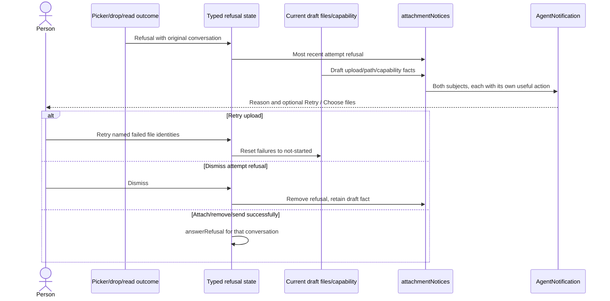

Follow [picker](#user-flow-attach-files-with-the--picker-or-clipboard), [drop](#user-flow-drop-files-folders-text-or-a-web-image), [upload retry](#user-flow-upload-an-image-and-retry-a-failed-upload), and [tile removal](#user-flow-preview-or-remove-a-draft-attachment).

Implementation: [typed refusal/action rules](../../../src/panel/application/attachment-notice.ts), [notification rendering and live region](../../../src/panel/ui/attachment-notices.tsx), [explicit refusal lifecycle](../../../src/panel/ui/use-file-attachments.ts), [bounded notices container](../../../src/panel/ui/composer-notices.tsx), and [send refusal wording](../../../src/conversation/application/usecases/send-draft.ts). Recovery depends on capability: Choose files helps a native pathless non-image because the host can supply a path, and is not offered as that solution in a browser. An oversized byte-carrying image is not told to use a picker that enforces the same ceiling. Unsupported image capability is distinct from a failed upload and does not imply bytes were attempted.

Regression evidence: [notice rules](../../../src/panel/application/attachment-notice.test.ts), [rendered attachment notices](../../../src/panel/ui/attachment-notices.test.ts), [combined hook/render path](../../../src/panel/ui/use-file-attachments.test.ts), [unsupported-image tests](../../../src/panel/ui/use-attachment-images-unsupported.test.ts), and [composer notice budget tests](../../../src/panel/ui/composer-notices.test.ts). [PR #99](https://github.com/nessalabs/nessa-agent/pull/99) made these independent notices and explicit lifetime transitions; its historical source-confirmed defects were stale notice suppression, impossible picker advice, and a mixed accepted/refused drop losing its refusal through stale identity comparisons.

Bug tracing: inspect attempt target and explicit `answerRefusal` calls before deriving anything from current draft IDs. A red tile is an upload state; a model that takes no images is a capability refusal, and these should not be collapsed. The mounted empty live region receives readiness text later; inserting a prefilled live region is not equivalent accessibility behavior.

## User flow: Preview or remove a draft attachment

Opening a draft tile shows the original locally retained file. Path-only files have no bytes to preview and explicitly say Nessa has not opened them. Text/Markdown/JSON/CSV originals over 32 KiB fall back rather than parsing/highlighting the whole file. Browser-unpaintable image originals get named tiles instead of broken pictures. Removing a tile deletes its draft part, closes its active preview, clears the relevant attempt refusal, aborts its transfer, and makes a local upload slot available immediately.

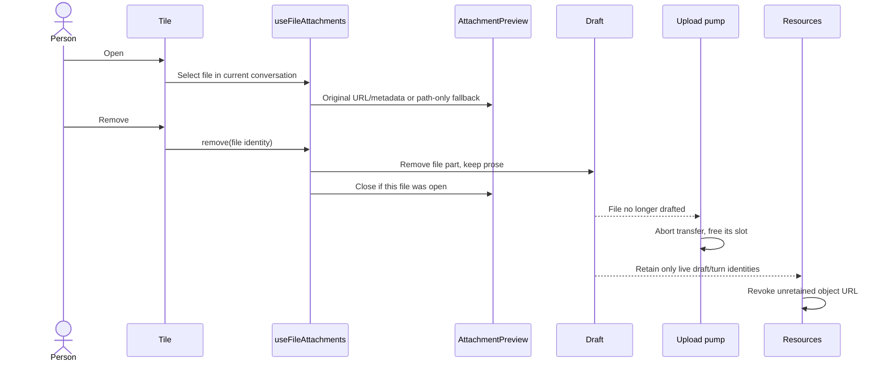

Follow-on flows: [upload retry/abort](#user-flow-upload-an-image-and-retry-a-failed-upload), [sent previews](#user-flow-reopen-a-message-and-understand-its-reference-only-attachments), and [gateway cleanup](#user-flow-stop-or-delete-a-conversation-and-release-its-uploaded-images). Removing a tile is **not** gateway hold release: no per-file unstage/delete RPC exists in this flow, and a transfer that already completed may remain held until conversation close/delete.

Implementation: [tile](../../../src/panel/ui/attachment-tile.tsx), [preview](../../../src/panel/ui/attachment-preview.tsx), [preview selection/removal](../../../src/panel/ui/use-file-attachments.ts), [local resource lifecycle](../../../src/panel/adapters/attachment-resources.ts), [composition resource retention](../../../src/composition/attachment-resources.test.ts), and [upload cancellation](../../../src/panel/ui/use-attachment-uploads.ts).

Regression evidence: [tile tests](../../../src/panel/ui/attachment-tile.test.ts), [preview tests](../../../src/panel/ui/attachment-preview.test.ts), [resource tests](../../../src/panel/adapters/attachment-resources.test.ts), [composition retention tests](../../../src/composition/attachment-resources.test.ts), and [upload pump tests](../../../src/panel/ui/use-attachment-uploads.test.ts). [PR #34](https://github.com/nessalabs/nessa-agent/pull/34) introduced local resources; [PR #87](https://github.com/nessalabs/nessa-agent/pull/87) added image upload state and message behavior; [PR #122](https://github.com/nessalabs/nessa-agent/pull/122) made path-only preview fallback explicit.

Bug tracing: compare retained object URL/Blob identities with draft and sending/sent turn identities, not filenames. A late upload result cannot revive a removed draft part. The local resources budget is 256 MiB across unsent retained content; acknowledged sent originals stop counting against attaching, while sent preview retention has its own 64 MiB bound.

## User flow: Reopen a message and understand its reference-only attachments

Immediately after a send from this window, the user turn may still contain originals and object URLs. The transcript paints those originals, not normalized provider bytes. Gateway-loaded history reconstructs digest/type/size for images and paths for files. It does not fetch image bytes by digest, so after reload or another surface's send the person sees labeled reference tiles. Old sent originals can also fall back to reference tiles when the sent-preview budget releases them.

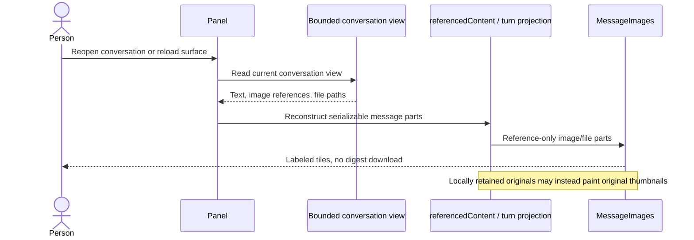

Follow [chat history/reopen](chat.md), [rendering](#user-flow-read-rich-text-code-math-and-diagrams-in-a-message), and [preview/removal](#user-flow-preview-or-remove-a-draft-attachment).

Implementation: [referencedContent](../../../src/conversation/model/content.ts), [MessageImages](../../../src/conversation/ui/message-images.tsx), [upload-release conversion](../../../src/conversation/application/usecases/release-uploads.ts), [frontend view application](../../../src/conversation/application/usecases/apply-view.ts), and [gateway bounded projection](../../../crates/nessa-protocol/src/conversation/projection.rs). Physical record sync and future replay should not be confused with an attachment-byte download feature; see [runtime](runtime.md).

Regression evidence: [message-content render tests](../../../src/conversation/ui/message-content.test.ts), [attachment model tests](../../../src/conversation/model/attachments.test.ts), [composition retention](../../../src/composition/attachment-resources.test.ts), and [store attachment tests](../../../src/conversation/adapters/store/attachments.test.ts). The current `MessageImages` documentation explicitly states that no digest-fetching reader exists here.

Bug tracing: reference-only tiles after a reload and lost pasted-chip boundaries are **designed current limitations**. The gateway's bounded view may also omit old attachment metadata to fit its replacement-view ceiling; inspect projection retention before diagnosing missing stored bytes. A digest missing from a view is not evidence that its blob was deleted.

## User flow: Read rich text, code, math, and diagrams in a message

The panel renders agent replies and work-step prose through shared `MessageMarkdown`. Its GFM parser supports lists/tables; math parsing selects inline/display math surfaces; fenced code selects code, math, or Mermaid renderers. Optional math/diagram modules load lazily. An unfinished streaming Mermaid fence remains a generating placeholder until the fence closes; code/math/diagram content is excluded from ordinary prose fade effects.

User messages use a structural AST transform: the renderer parses the whole surrounding Markdown, then replaces owned pasted-text slots with clickable pills. Payloads are not interpolated as Markdown inside surrounding fences, link labels, or HTML-looking contexts. Attachments are separate tiles rather than Markdown fragments. Copy controls derive from the source representation, and raw HTML is not enabled through `rehype-raw`.

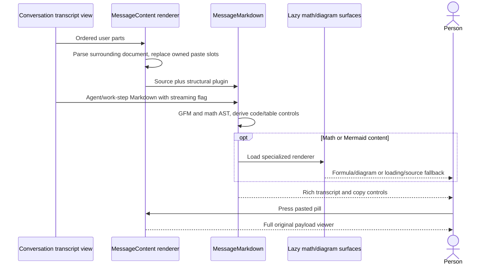

Follow [paste inspection](#user-flow-paste-text-or-code-and-inspect-the-full-pasted-payload), [link opening](#user-flow-open-a-link-without-replacing-the-app), and [extensions/UI package behavior](extensions-ui.md).

Implementation: [user message renderer](../../../src/conversation/ui/message-content.tsx), [panel transcript](../../../src/conversation/ui/transcript.tsx), [work-step rendering](../../../src/conversation/ui/work-steps.tsx), [stream text projection](../../../src/conversation/ui/agent-transcript-view.ts), and sibling [MessageMarkdown](../../../../nessa_ui/packages/react/src/components/message-markdown.tsx), [CodeBlock](../../../../nessa_ui/packages/react/src/components/code-block.tsx), [MathBlock](../../../../nessa_ui/packages/react/src/components/math-block.tsx), and [MermaidDiagram](../../../../nessa_ui/packages/react/src/components/mermaid-diagram.tsx). The app pin and installed package are authoritative for shipped code; a sibling checkout is source-navigation evidence, not proof every revision is packaged.

The desktop workspace's [RichText](../../../src/desktop/workspace/ui/transcript/rich-text.tsx) uses [inlineRuns](../../../src/desktop/workspace/model/transcript.ts) for inline code and strong emphasis. Its transcript has explicit text/code/list/step/widget parts and is a separate renderer; do not claim full panel Markdown/math/link/attachment behavior for that prototype. See [desktop](desktop.md).

Regression evidence: [message-content tests](../../../src/conversation/ui/message-content.test.ts) cover structural pasted parts beside fences, links, HTML-looking text, bold/lists, and tables; [composer round-trip tests](../../../src/conversation/ui/composer-content.test.ts); [agent transcript tests](../../../src/conversation/ui/agent-transcript-view.test.ts) include exact boundary whitespace; sibling [Mermaid render queue tests](../../../../nessa_ui/packages/react/src/components/mermaid-render-queue.test.ts) inspect shared render scheduling, not the entire app's browser behavior. [PR #28](https://github.com/nessalabs/nessa-agent/pull/28) introduced the app-side Markdown/paste contract. Sibling GitHub squash commits `075d246` (#83) and `36ef0e3` (#84) identify [nessa_ui PR #83](https://github.com/nessalabs/nessa_ui/pull/83) and [PR #84](https://github.com/nessalabs/nessa_ui/pull/84) for editors and lazy/structural renderer support.

Bug tracing: distinguish source corruption, AST/part conversion, lazy chunk failure, and renderer failure. A diagram that stays generating during an open fence is designed; a permanently generating closed fence requires inspection of closing-fence detection and render scheduling. A formula displayed literally in the desktop workspace is not proof the panel math renderer failed.

## User flow: Open a link without replacing the app

In native windows, a Tauri navigation plugin decides before webview navigation. Whole app origins remain in the webview. External `http`, `https`, and `mailto` go through `Host::open_externally`; other schemes are refused. Packaged builds do not treat the development server's origin as the app. Failed opening/refused navigation emits a typed `LinkNotOpened` notice, which the panel displays and lets the person dismiss. A notice is not proof the browser subsequently loaded the page; success here means the platform opener accepted the handoff.

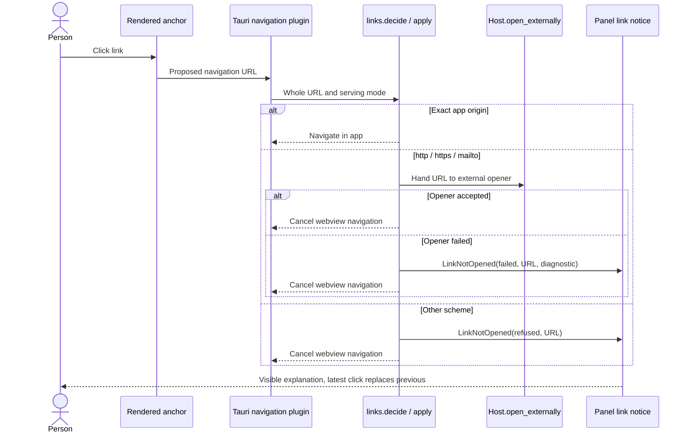

Follow [rich rendering](#user-flow-read-rich-text-code-math-and-diagrams-in-a-message), [desktop/native surface behavior](desktop.md), and [startup host configuration](startup.md).

Implementation: [navigation policy and application tests](../../../src-tauri/src/links.rs), [Host contract](../../../src-tauri/src/platform/mod.rs), [macOS opener](../../../src-tauri/src/platform/macos/mod.rs), [Linux opener](../../../src-tauri/src/platform/linux/mod.rs), [panel host event subscription](../../../src/panel/adapters/use-link-notice.ts), [notice wording](../../../src/panel/application/link-notice.ts), [notice tests](../../../src/panel/application/link-notice.test.ts), and [CSP/window configuration](../../../src-tauri/tauri.conf.json). Historical contribution: [PR #93](https://github.com/nessalabs/nessa-agent/pull/93), squash [`cae52e08`](https://github.com/nessalabs/nessa-agent/commit/cae52e08caae5faf46bdc6c279f1d2e788af1c12), fixed the floating panel becoming an external website with no route back.

Bug tracing: native policy tests cover origin/scheme decisions and injected opener outcomes; they do not exercise real browser/mail launch. The policy's own module states its **designed coverage boundary**: `window.open`, Linux `_blank` navigation, and macOS download/option-click can bypass that navigation hook. Current CSP forbids frames/forms and transcript Markdown cannot author raw HTML/script/target/download attributes; relaxing those contracts requires revisiting the navigation boundary. In a plain browser there is no native plugin; normal browser navigation behavior is a different environment. The plugin covers native webviews, while visible failure reporting described here is wired in the floating panel; inspect another surface's subscription before expecting its notice.

## User flow: Stop or delete a conversation and release its uploaded images

Closing a tab normally detaches a UI view. There is one cleanup exception: `closeTab` asks the gateway to close an already-created conversation only when the known view has exact `complete_empty` transcript state, is empty/idle, and has no pending work. Both built-in gateway stores project a prepared empty conversation as `complete`, so that automatic-close exception does not apply to their ordinary prepared sessions; see [the R6 negative controls](chat.md). Tab detachment preserves existing work. Stop explicitly closes active/queued work through chat controls. Once close establishes that no unsettled invocation still needs image bytes, the gateway releases that conversation's tickets and holds. If close fails and queued/active image work may still need them, holds remain. Delete writes a tombstone to exclude new use, stops the owner, and includes attachment release in its cleanup report. An image transfer racing deletion rechecks ownership after pending-hold audit and cannot confirm a usable hold for the tombstoned conversation.

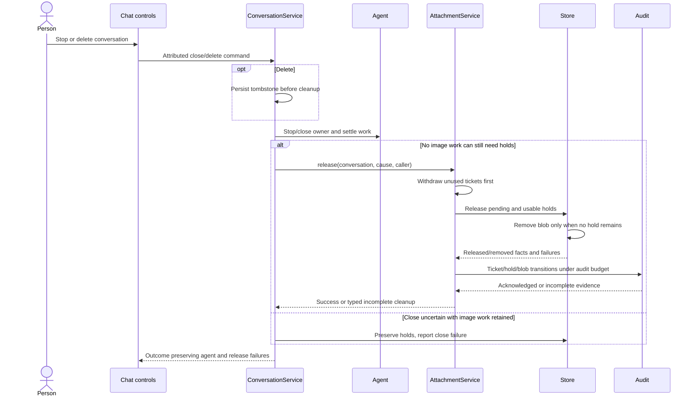

Follow [chat Stop/delete](chat.md), [runtime lifecycle and retained cleanup](runtime.md), and [upload ordering](#user-flow-upload-an-image-and-retry-a-failed-upload).

Implementation: [frontend Stop and empty-tab close](../../../src/conversation/adapters/store/slice.ts), [gateway close/delete orchestration](../../../crates/nessa-server/src/conversation/application/service.rs), [release/claim settlement](../../../crates/nessa-server/src/attachments/application/service.rs), [store hold/blob removal](../../../crates/nessa-server/src/attachments/infrastructure/store.rs), and [durable audit](../../../crates/nessa-server/src/attachments/infrastructure/audit.rs). Every hold is attempted; one storage failure does not stop others. Release has a five-second per-record audit deadline within a thirty-second phase budget; cleanup occurs before reporting audit incompleteness. Pending hold rollback uses its own generation claim and cannot remove a later upload's acknowledged hold. Blob deletion requires proof no hold remains, including pending holds. After successful Stop, `forgetStoredUploads` resets draft images from `stored` to `not-started` so subsequent send does not reuse a released hold; the pump can upload them again.

Regression evidence: server [application tests](../../../crates/nessa-server/tests/attachments/application.rs) include `one_hold_that_will_not_release_does_not_stop_the_others`, `a_release_that_cannot_be_recorded_still_releases_and_says_so`, `a_hold_another_upload_took_over_is_not_this_uploads_to_keep_or_to_undo`, and `an_upload_finishing_after_its_conversation_was_deleted_keeps_nothing`; [store tests](../../../crates/nessa-server/tests/attachments/store.rs) cover last-hold blob removal, crash leftovers, unreadable records, pending claims, and shared-byte retention; [service-over-store tests](../../../crates/nessa-server/tests/attachments/service_over_store.rs) check unacknowledged rollback versus later acknowledged ownership; [conversation attachment tests](../../../crates/nessa-server/tests/conversation/attachments.rs) exercise gateway close integration. These are source evidence, not new test results.

Bug tracing: holds do not expire merely because the five-minute upload ticket did. Removing a draft tile is not hold release, and tab closing releases gateway holds only through the exact `complete_empty` exception above, which the built-in prepared-session projection does not satisfy. A release failure must preserve which cleanup failed and whether evidence was delivered; logs alone are not its durable transition trail. A pending hold left by a crash stays unusable until replaced/released, a conservative **designed limitation** that can retain disk bytes.

## Historical contributions and verification limits

The PR links above are identified by GitHub-authored squash subjects and detailed bodies in the local Git history, not inferred from similarly numbered issues. The read-only GitHub API returned `Forbidden` during this map, so live PR metadata/CI state was not independently retrieved.

| Contribution | Local provenance | What it changed |
| --- | --- | --- |
| [nessa-agent #28](https://github.com/nessalabs/nessa-agent/pull/28) | `298be654` | Markdown composer, ordered pasted payloads, compact/expanded viewer, structural message rendering |
| [nessa-agent #34](https://github.com/nessalabs/nessa-agent/pull/34) | `ee1970f7` | Local attachment resources, previews, browser content/folder/image drops |
| [nessa-agent #87](https://github.com/nessalabs/nessa-agent/pull/87) | `b39136ff` | End-to-end image tickets/upload/normalization/holds/provider delivery; explicit send refusal |
| [nessa-agent #93](https://github.com/nessalabs/nessa-agent/pull/93) | `cae52e08` | Native navigation policy, external handoff, refused/failed link notices |
| [nessa-agent #99](https://github.com/nessalabs/nessa-agent/pull/99) | `910abd65` | Attachment notices no longer suppress one another; typed actions and explicit refusal lifetime |
| [nessa-agent #122](https://github.com/nessalabs/nessa-agent/pull/122) | `88280b86` | Local file paths, read tickets, unified type routing, native drag/cloud readiness, syntax-safe links and naming audit |
| [nessa_ui #83](https://github.com/nessalabs/nessa_ui/pull/83), [#84](https://github.com/nessalabs/nessa_ui/pull/84) | `075d246`, `36ef0e3` in sibling history | Shared Markdown/code editors; optional renderers and structural node support |

**Historically confirmed, fixed:** silent file send; stale refusal suppressing Retry; wrong picker advice for a shared byte limit; delayed file/refusal routed to the wrong tab; basename-keyed pending tiles; picker/drop image classification mismatch; unsafe link syntax; false file-naming evidence on conflicting retries. [PR #99's commit](https://github.com/nessalabs/nessa-agent/commit/910abd65cdae39a672a8d83d58c507165b5659f0) reports nine manually reverted defects making named tests fail; this is historical author evidence, not a rerun here.

### R2/R4 regression execution

**Confirmed before fix, locally corrected:** [R2 concurrent image drops](#user-flow-drop-files-folders-text-or-a-web-image) and [R4 picked-image submission](#user-flow-wait-for-a-cloud-file-without-attaching-it-to-another-tab) reproduced at the actual App/shared Markdown editor/Redux submission boundary. Before changing the hook, the two intended-behavior regressions failed and an ordinary Enter control passed. The controlled native-read and URL-fetch promises make the failing order deterministic; these are not hook-only assertions.

After the minimal hook change, the nine [race tests](../../../src/panel/ui/use-file-attachments-races.test.ts) and 36 existing picker, readiness, composer and key tests passed: **45 tests across five files**. Run from the repository with the environment activated:

```sh
source /workspace/.setup/activate.sh
pnpm exec vitest run src/panel/ui/use-file-attachments-races.test.ts src/panel/ui/use-file-attachments-picker.test.ts src/panel/ui/use-file-attachments-readying.test.ts src/panel/ui/use-composer.test.ts src/panel/ui/composer-keys.test.ts --maxWorkers=1 --minWorkers=1 --reporter=dot
pnpm exec eslint src/panel/ui/use-file-attachments.ts src/panel/ui/use-file-attachments-races.test.ts
```

The targeted ESLint check passed and both source/test files were formatted. The first `pnpm typecheck` encountered an unrelated onboarding test return-type error at `src/onboarding/adapters/agents.test.ts:195`; it reported no attachment errors. Existing picker/readiness tests emit React act-environment warnings; the run completed without unhandled errors. These jsdom regressions substitute host IO, browser geometry and gateway scenario effects: they establish composer routing and admission behavior, not real native picker/read latency, production uploads, or provider delivery. The fix remains a local change until its fix PR merges.

Exclusions: audio/video message payload transport, remote file upload/delivery, exact replay proposals, new provider adapters, real macOS/Linux picker/drag/cloud/opener measurements, actual image decoder execution, and exhaustive SDK cancellation review. Desktop home/header-art image preferences belong to [desktop](desktop.md), while MCP tool resource/widget rendering belongs to [extensions/UI](extensions-ui.md); neither is a conversation image attachment. Fixture/scenario effects are test/prototype substitutes, not evidence that a production upload or provider read occurred.
