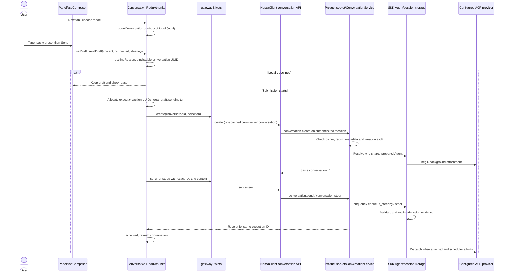
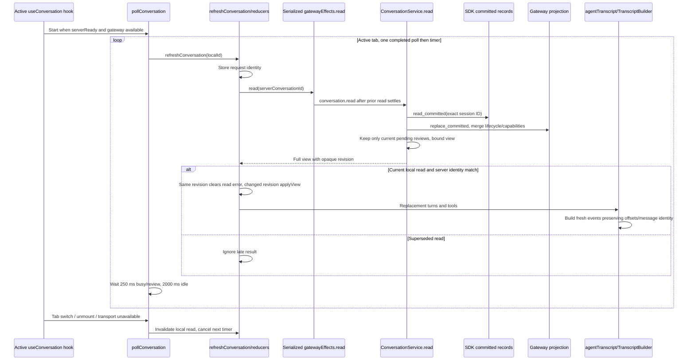
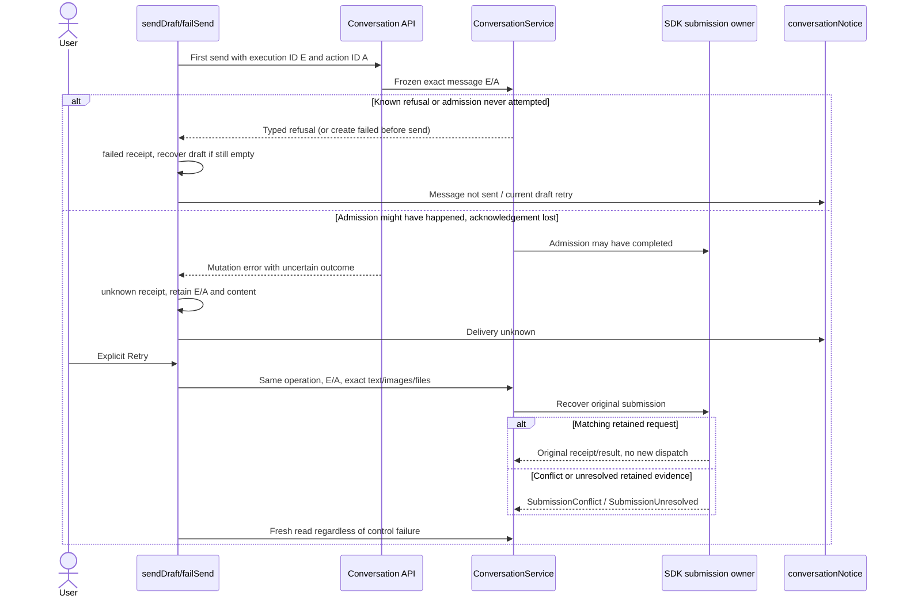
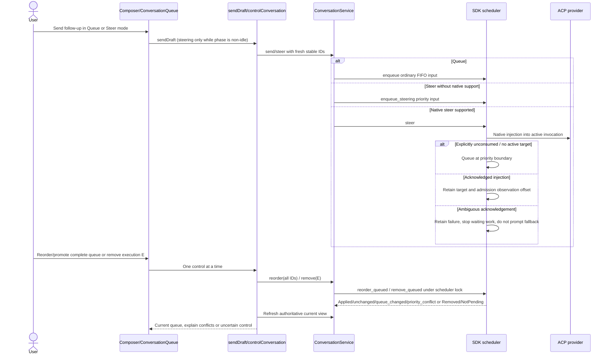
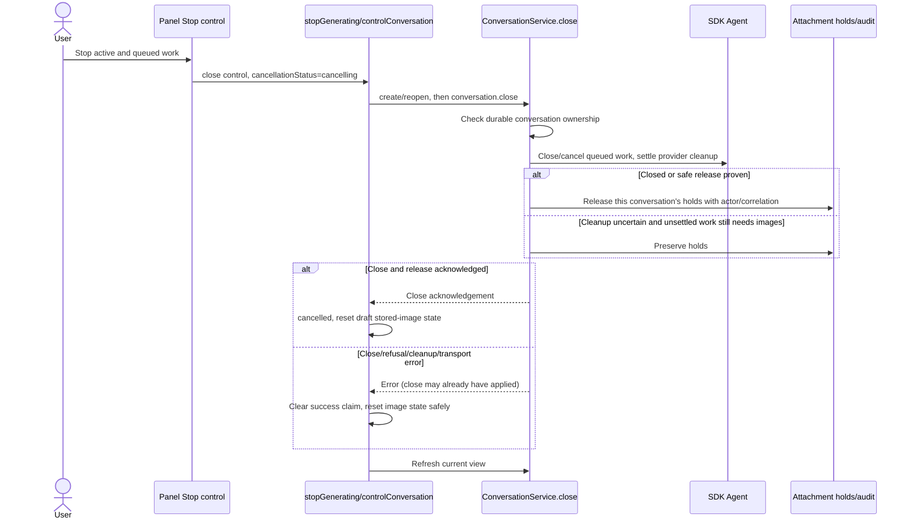
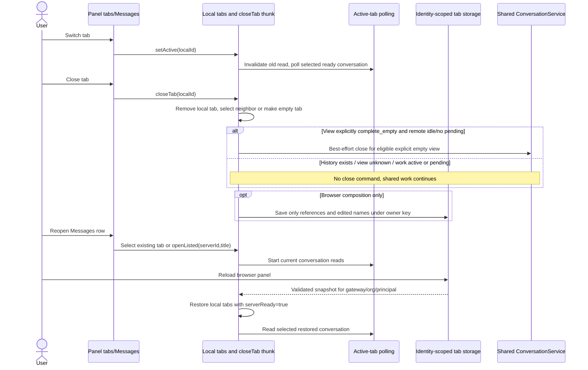
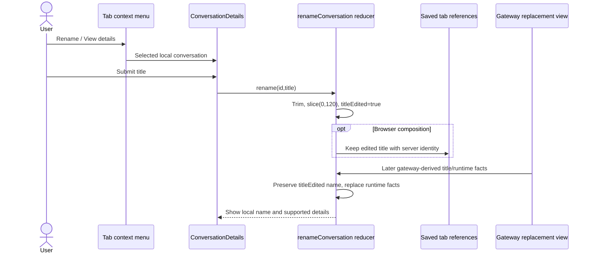
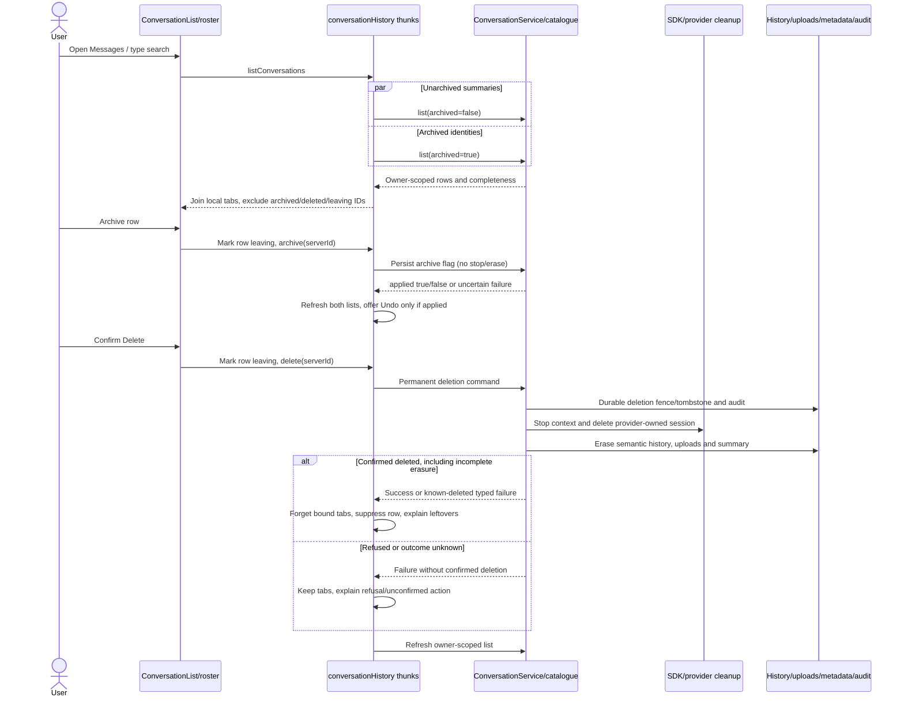

# User flow: send and manage a chat

This maps the implemented floating panel conversation surface. The panel uses a real authenticated gateway and Rust SDK Agent. The desktop workspace has a separate source/composition boundary; its session UI must not be assumed to execute these panel commands: see [desktop flows](desktop.md). Scenario effects are development fixtures, not an alternate production backend.

Each diagram below is a sequence of actual owners, with provider internals compressed behind the SDK. Evidence links are relative to this file. **Designed limitation** describes an explicit contract; **hypothesis** is a useful bug reproduction target, not a demonstrated defect. No new defect is asserted by this static trace. Linked regression files were inspected; this document does not claim they were executed.

## Flow and diagram index

- [New tab, model selection, first send](#user-flow-compose-and-send-the-first-message)
- [Streaming and current transcript](#user-flow-read-a-conversation-and-watch-the-response)
- [Uncertain send and deliberate retry](#user-flow-recover-a-refused-or-unconfirmed-send)
- [Queue, steer, promote, reorder, withdraw](#user-flow-send-and-manage-follow-ups)
- [Stop active and queued work](#user-flow-stop-active-and-queued-work)
- [Close, switch, reopen, restore tabs](#user-flow-close-switch-reopen-and-restore-tabs)
- [Rename and inspect details](#user-flow-rename-a-tab-and-inspect-conversation-details)
- [History search, archive, undo, delete](#user-flow-find-archive-or-delete-a-conversation)

Diagram handoffs: [startup and authenticated connection](startup.md), [SDK/provider execution and reviews](runtime.md), [image/file preparation](attachments.md), [desktop workspace](desktop.md), [tool apps and extensions](extensions-ui.md).

## User flow: compose and send the first message

**User-visible result.** New conversation opens an empty local tab. Typing updates its draft; Enter sends and Shift+Enter starts a Markdown block. The visible voice button is currently inert. Choosing a model changes a still-unbound draft; choosing after conversation creation begins opens a separate conversation. Send moves the draft to an optimistic user turn, then reports admission and agent startup separately. An image can create the remote conversation before the first send; follow the [attachment sequence](attachments.md).

**Trace.** [Composer lifecycle](../../../src/panel/ui/use-composer.ts) → [useConversation.submit](../../../src/conversation/ui/use-conversation.ts) → [sendDraft thunk](../../../src/conversation/adapters/store/slice.ts) → [draft admission/receipt state](../../../src/conversation/application/usecases/send-draft.ts) → [gateway effects](../../../src/conversation/adapters/gateway/effects.ts) → [client API](../../../packages/nessa-client/src/presentation/conversation-api.ts) → [product routing](../../../crates/nessa-server/src/product/conversation.rs) → [ConversationService.create/submit](../../../crates/nessa-server/src/conversation/application/service.rs) → [SDK submissions](../../../crates/nessa-sdk/src/application/agent_execution/agents/submissions.rs).

**Decisions and failure boundaries.** Text is limited to 8 KiB UTF-8 by this product command. Blank text is valid with sendable images or linked files. Local admission uses draft-owned files, refuses unknown attachments, pending/failed uploads, empty content, and unsupported/unknown image capability; unknown capability requests a refresh. Agent/model selection is fixed by remote creation; reopening uses the stored agent rather than today's default. The initial approval preset comes from selection and can later change only through the idle-conversation control; see [approval mode changes](runtime.md). The service checks ownership before resolving a provider and records file-link intent before SDK admission. Queue admission does not wait for default `ask` attachment; non-default approval presets must be verified before submission. Client command completion is not provider completion.

**Bug-oriented evidence.**

- **Designed limitation:** the full editor collapses when the draft leaves, even though the round trip has not finished. A later refusal can restore the draft; expansion itself is local UI state. [Composer tests](../../../src/panel/ui/use-composer.test.ts) and [expansion decisions](../../../src/panel/application/composer-expansion.test.ts) cover the distinction.
- **Hypothesis:** send immediately after switching/closing a tab or while the editor remounts. Inspect the captured local ID, `no-such-conversation` rejection, and editor-content fallback before blaming the socket. [Unsent regressions](../../../src/conversation/adapters/store/unsent.test.ts) include failed creation, client retirement, a rejected follow-up preserving earlier work, and a newer draft surviving a late refusal.
- **Designed limitation:** fixed input/provider configuration is not migrated. A saved session with a different context fingerprint is refused; see [gateway guide](../../guides/gateway-chat.md#restoring-after-local-configuration-changes).
- **Regression evidence:** [use-case tests](../../../src/conversation/application/usecases/usecases.test.ts), [client command validation](../../../packages/nessa-client/src/presentation/conversation-api.test.ts), and [gateway application tests](../../../crates/nessa-server/tests/conversation/application.rs), including `surfaces_share_one_agent_and_keep_original_creator`, `queued_turns_finish_in_order_and_retries_do_not_dispatch_twice`, and `bounded_queue_controls_complete_while_attachment_waits_for_runtime`.

## User flow: read a conversation and watch the response

**User-visible result.** The active tab moves through starting, thinking, streaming, and idle from server facts. Text, thoughts, tool activity, reviews, and questions appear in a bounded replacement transcript. Selecting another tab changes which conversation is polled, without stopping execution. [Tool app rendering](extensions-ui.md) and [review/question execution](runtime.md) continue from the returned tools/interactions.

**Trace.** [Polling owner](../../../src/conversation/ui/use-conversation.ts), [timer lifecycle](../../../src/conversation/adapters/gateway/polling.ts), [serialized read adapter](../../../src/conversation/adapters/gateway/effects.ts), [identity/revision acceptance](../../../src/conversation/adapters/store/slice.ts), [applyView](../../../src/conversation/application/usecases/apply-view.ts), [server read/projection](../../../crates/nessa-server/src/conversation/application/service.rs), [projection logic](../../../crates/nessa-protocol/src/conversation/projection.rs), [view DTO](../../../crates/nessa-protocol/src/conversation/view.rs) and [wire/catalogue mapping](../../../crates/nessa-server/src/product/conversation.rs), [transcript mapping](../../../src/conversation/adapters/agent-stream/transcript.ts), and [rendered transcript](../../../src/conversation/ui/transcript.tsx).

**Bug-oriented evidence.**

- **Designed limitation:** this is polling of current bounded views, not an event cursor or exact replay stream. Stream output is read from committed records; uncommitted text can be lost on crash. The view can report truncation and partial/stale/unloaded history. [Controls/status copy](../../../src/conversation/ui/conversation-controls.tsx) exposes those facts. The [physical record read flow](runtime.md) is a separate API, not used to fill this panel transcript.
- **Hypothesis:** duplicate bubbles or tools after repeated polling. Start at `agentTranscript`'s fresh builder and `applyView` execution identities; do not append whole snapshots to a log. Message identity/channel and observation offset determine grouping. Native injected input is placed at its stored local-admission offset, which does not prove when the provider consumed it.
- **Hypothesis:** stale text after a tab switch, a late read clearing a current failure, or terminal work appearing active again. Check request identity, server identity, per-conversation read serialization, and the committed-head acceptance in the server projection. Revisions are opaque equality tokens, not sortable numbers.
- **Regression evidence:** [polling tests](../../../src/conversation/adapters/gateway/polling.test.ts), [gateway effects tests](../../../src/conversation/adapters/gateway/effects.test.ts), [terminal applyView tests](../../../src/conversation/application/usecases/apply-view-terminal.test.ts), [transcript ordering tests](../../../src/conversation/adapters/agent-stream/transcript.test.ts), and [server projection tests](../../../crates/nessa-server/tests/conversation/projection.rs), including `gateway_record_view_waits_for_message_commit`, `older_committed_read_cannot_replace_a_newer_terminal_view`, and `only_the_exact_live_execution_can_offer_a_committed_interaction`.

## User flow: recover a refused or unconfirmed send

**User-visible result.** A known refusal says “Message not sent” and recovers the draft when it has not been replaced by a newer draft. An uncertain acknowledgement says “Delivery unknown”; Retry reuses the original execution/action/content rather than sending a new message. Reconnecting restores transport and polling, without replaying commands; see [connection recovery](startup.md).

**Trace.** [sendOutcome and retry thunk](../../../src/conversation/adapters/store/slice.ts), [failSend draft recovery](../../../src/conversation/application/usecases/send-draft.ts), [notice priority and actions](../../../src/conversation/ui/notification.ts), [client uncertainty/retry errors](../../../packages/nessa-client/src/application/conversation-mutation-error.ts), [frozen command/content](../../../packages/nessa-client/src/presentation/conversation-api.ts), [ConversationService.submit known-submission checks and SDK delegation](../../../crates/nessa-server/src/conversation/application/service.rs), [SDK retained submissions](../../../crates/nessa-sdk/src/application/agent_execution/agents/submissions.rs), and [SDK scheduling/retry contract](../../../crates/nessa-sdk/docs/agent_execution/scheduling.md#idempotent-submission-retries). The server skips current-image-hold checks and new file-link intent for an already-recorded execution; the SDK owns exact-request agreement and recovery of its retained delivery/result.

**Bug-oriented evidence.**

- **Designed limitation:** new IDs mean new work; identical text is not deduplicated. Same-ID retries with changed content, actor, budgets, or mode conflict. A reconstructed turn with no retained result is not replayed. How a read shows it — unresolved when the projection opened onto that history, running through the gaps around the active execution when the turn was admitted later — is the projection table in [transcript fold](../../design/transcript-fold.md).
- **Designed limitation:** unknown send/action identities live in the current tab, not the tab snapshot. Browser reload saves server references/titles, not unacknowledged messages or drafts. A reload cannot recreate this window's lost retry action from browser storage. Native panel composition does not wire this tab persistence.
- **Hypothesis:** an unsent follow-up marks earlier work idle, late refusal overwrites new prose, or a retry silently changes attachments. Trace `admissionAttempted`, receipt identity, draft emptiness, immutable turn content, and image reupload decisions. Attachment-not-found/unavailable recovers originals as not uploaded; see [attachments](attachments.md).
- **Regression evidence:** [unsent tests](../../../src/conversation/adapters/store/unsent.test.ts), [notification tests](../../../src/conversation/ui/notification.test.ts), [client API tests](../../../packages/nessa-client/src/presentation/conversation-api.test.ts), and [SDK retry tests](../../../crates/nessa-sdk/tests/application/agent_execution/scheduling/retries.rs).

## User flow: send and manage follow-ups

**User-visible result.** Queue is the default delivery mode. During active work the composer offers Queue/Steer. Waiting input appears in the queue badge/sheet, where it can be moved, promoted, or removed. Steering is either native injection into the active invocation or priority input at the next invocation boundary; the UI does not promise interruption.

**Trace.** [Delivery choice](../../../src/conversation/ui/use-conversation.ts), [composer delivery controls](../../../src/panel/ui/app.tsx), [queue UI](../../../src/conversation/ui/conversation-queue.tsx), [control thunk](../../../src/conversation/adapters/store/slice.ts), [gateway submit/reorder/remove](../../../crates/nessa-server/src/conversation/application/service.rs), [SDK scheduling](../../../crates/nessa-sdk/src/application/agent_execution/agents/scheduling.rs), [SDK coordination](../../../crates/nessa-sdk/src/application/agent_execution/agents/coordination.rs), and [native steering adapter](../../../crates/nessa-sdk/src/application/agent_execution/providers/steering.rs). See the [scheduling guide](../../../crates/nessa-sdk/docs/agent_execution/scheduling.md) for exact outcomes.

**Bug-oriented evidence.**

- **Designed limitation:** at most 64 pending inputs, excluding the active invocation. Boundary steering takes priority over ordinary waiting work and does not interrupt the current provider invocation. Promote keeps this partition. Queue editing in place is absent: remove confirmed waiting input, then send revised content as a new submission.
- **Designed limitation:** reorder requires the whole waiting-ID set; the UI disables it when `queueComplete` is false. A stale set returns `queue_changed`, crossing steering priority returns `priority_conflict`. Neither removes/resubmits input. Truncated old transcript alone does not imply an incomplete queue.
- **Designed limitation:** remove races dispatch under the SDK lock. `NotPending` can mean unknown, withdrawn, dispatched, or injected; it is not proof that provider work was undone. The effects adapter discards remove's `applied` field and refreshes the queue rather than announcing successful withdrawal.
- **Hypothesis:** queue changes between viewing and dragging; click Remove as a message begins dispatch; lose a reorder response after it applies. Controls use fresh action IDs and read authority afterwards; do not automatically replay them on reconnect.
- **Regression evidence:** [UI/store reorder tests](../../../src/conversation/adapters/store/reorder.test.ts), [gateway reorder integration](../../../crates/nessa-server/tests/conversation/reorder.rs), [SDK queue-order conformance](../../../crates/nessa-sdk/tests/application/agent_execution/agents/conformance/queue_order.rs), [SDK scheduling](../../../crates/nessa-sdk/tests/application/agent_execution/agents/scheduling.rs), and [gateway application](../../../crates/nessa-server/tests/conversation/application.rs) (`boundary_steering_can_be_removed_without_dispatch`).

## User flow: stop active and queued work

**User-visible result.** Stop explicitly closes the provider context and admitted work, showing Cancelling until an acknowledgement and then Cancelled. History remains available. Stored draft images are reset for upload because close can release conversation holds. Stop requires a connected gateway; closing a populated tab has different behavior.

**Trace.** [Stop button and availability](../../../src/panel/ui/app.tsx), [stop/control thunk](../../../src/conversation/adapters/store/slice.ts), [server close](../../../crates/nessa-server/src/conversation/application/service.rs), [SDK lifecycle owner](../../../crates/nessa-sdk/src/application/agent_execution/agents/lifecycle.rs), [provider cleanup](../../../crates/nessa-sdk/src/application/agent_execution/providers/close.rs), and [close outcome copy](../../../src/conversation/application/usecases/control-failure.ts). [Runtime cleanup](runtime.md) and [attachment release](attachments.md) carry the detailed handoffs.

**Bug-oriented evidence.**

- **Designed limitation:** cancellation status is a local acknowledgement display, not proof that every external tool effect was reversed. SDK local cancellation and a later provider outcome can differ with retained causal evidence.
- **Designed limitation:** close can succeed while attachment cleanup fails (`attachment_cleanup_unavailable`). The client/UI preserves uncertainty instead of claiming a wholly successful control. Resetting image references is safe: a subsequent begin returns stored bytes if the gateway still holds them.
- **Hypothesis:** startup failure offers Refresh but needs an explicit close to release a failed slot. Server tests distinguish resource-free failure, startup deadline, and unconfirmed cleanup. A retained unsafe slot can block reopening until gateway restart; repeated polling alone is not a recovery guarantee.
- **Regression evidence:** [control failure tests](../../../src/conversation/adapters/store/control-failure.test.ts), [gateway application startup/close tests](../../../crates/nessa-server/tests/conversation/application.rs), [image close-release decisions](../../../crates/nessa-server/tests/conversation/close_release.rs), and [attachment integration](../../../crates/nessa-server/tests/conversation/attachments.rs).

## User flow: close, switch, reopen, and restore tabs

**User-visible result.** Switching tabs preserves each in-memory draft. Closing a populated tab lets shared execution continue. Reopen a saved conversation from Messages to fetch its current history. Browser reload restores up to 64 identity-scoped server references and edited tab names; drafts and message payloads are not browser-persisted. Native panel composition currently creates a fresh store without this persistence subscription. Closing the last tab creates a replacement empty tab.

**Trace.** [Tab navigation](../../../src/panel/application/tab-navigation.ts), [local close policy](../../../src/conversation/application/usecases/close-conversation.ts), [closeTab remote cleanup guard](../../../src/conversation/adapters/store/slice.ts), [reopen listed](../../../src/conversation/application/usecases/open-listed.ts), [snapshot parse/save/restore](../../../src/conversation/application/saved-tabs.ts), [browser storage key and failure handling](../../../src/conversation/adapters/browser/tab-storage.ts), and [browser persistence composition](../../../src/composition/browser.tsx), [native composition](../../../src/main.tsx), and [authenticated lifecycle](../../../src/session/adapters/lifecycle/session-lifecycle.tsx).

**Bug-oriented evidence.**

- **Designed limitation:** closing a tab discards its unsent draft from this window. It is not archive, delete, Stop, or gateway shutdown. Empty remote cleanup is best effort and logs a failure after the local tab has closed.
- **Designed limitation:** browser storage rejects malformed/oversized snapshots, caps references at 64, deduplicates server IDs, and tolerates unavailable storage. Deleted tabs are not saved; a live remotely-deleted tab keeps draft text available to copy until closed.
- **Falsified for built-in storage (R6):** the cleanup branch requires `complete_empty`. SDK preparation commits an `Opened` session snapshot before provider attachment, so both built-in stores report `complete` for prepared empty history. [Preparation](../../../crates/nessa-sdk/src/application/agent_execution/sessions/manager.rs) and [memory committed reads](../../../crates/nessa-sdk/src/infrastructure/session_storage/memory.rs) explain the precondition. A controlled real Redux → ConversationService → SDK/scripted-provider probe with both InMemoryStorage and RecordStorage retained a stale empty view, admitted running and queued work from another surface, then executed `closeTab`: no close command was sent and both work items continued. The general server close is unconditional, but that alone does not establish a reachable automatic-close race. Custom storage/scenario views explicitly reporting `complete_empty` remain a separate precondition; see [risk register](risks.md).
- **Regression evidence:** [prepared empty gateway view in both stores](../../../crates/nessa-server/tests/conversation/projection.rs), [stale complete-view tab detachment](../../../src/conversation/adapters/store/attachments.test.ts), [tab use cases](../../../src/conversation/application/usecases/usecases.test.ts), [saved tab tests](../../../src/conversation/application/saved-tabs.test.ts), [storage tests](../../../src/conversation/adapters/browser/tab-storage.test.ts), and [tab navigation tests](../../../src/panel/application/tab-navigation.test.ts).

## User flow: rename a tab and inspect conversation details

**User-visible result.** The context menu opens a details/rename sheet. Rename trims and keeps up to 120 JavaScript string units, sets `titleEdited`, and changes this local tab's name. Browser composition persists an edited name with its server reference; native panel composition keeps it in memory. The gateway derives its own title from the first submitted message and supplies provider/model/workspace facts. Subsequent views preserve the user's edited tab name. There is no remote rename command.

**Trace.** [Context menu/sheet composition](../../../src/panel/ui/app.tsx), [details renderer](../../../src/conversation/ui/conversation-details.tsx), [rename reducer](../../../src/conversation/adapters/store/slice.ts), [applyView name policy](../../../src/conversation/application/usecases/apply-view.ts), [snapshot](../../../src/conversation/application/saved-tabs.ts), and [server summary owner](../../../crates/nessa-protocol/src/conversation/catalogue_metadata.rs).

**Bug-oriented evidence.** **Designed limitation:** another surface can show the gateway title while this tab shows its local override; renaming changes no server identity, provider context, or shared metadata. Blank rename is ignored. **Hypothesis:** Unicode title truncation can split a surrogate pair because `slice(0,120)` counts UTF-16 code units; inspect rendered output for a title with an emoji at the boundary. This static trace does not demonstrate a rendering failure. [Details tests](../../../src/conversation/ui/conversation-details.test.tsx), [store tests](../../../src/conversation/adapters/store/slice.test.ts), and [applyView tests](../../../src/conversation/application/usecases/apply-view.test.ts) are the nearest checks.

## User flow: find, archive, or delete a conversation

**User-visible result.** Messages combines gateway-owned summaries with open local tabs, filters them by search, and opens the existing tab or reopens the server conversation. List reads occur on mount/connection changes, not continuously. Swipe/row actions archive or request confirmed permanent deletion. Archive keeps work/history and offers one Undo; deletion stops the conversation, erases retained data where possible, preserves audit, and removes its tabs when deletion is confirmed.

**Trace.** [Messages transitions](../../../src/panel/application/messages-tab.ts), [list renderer and actions](../../../src/conversation/ui/conversation-list.tsx), [roster/search/selection](../../../src/conversation/application/queries/roster.ts), [history state and action outcomes](../../../src/conversation/adapters/store/history.ts), [typed deletion classification](../../../src/conversation/adapters/gateway/effects.ts), [client list/archive/delete](../../../packages/nessa-client/src/presentation/conversation-api.ts), [server list/archive/delete and background erasure](../../../crates/nessa-server/src/conversation/application/service.rs), and [durable deletion domain](../../../crates/nessa-server/src/conversation/domain/value_objects/conversation_deletion.rs).

**Bug-oriented evidence.**

- **Designed limitation:** list returns at most 500 summaries and can be incomplete. Search filters received summaries/open tabs; “No results” is not a server-wide full-text search. A failed refresh retains old rows with a stale notice. The two archive-filter reads are separate requests; their combined result is not an atomic catalogue snapshot. Beyond the 500 archived-ID bound, an open tab can appear as unarchived because the roster has no archived identity for it; the roster owner documents this limit.
- **Designed limitation:** panel offers no archived-history browser. Undo is withdrawn by a later action or by leaving Messages; a new message unarchives a conversation. Archiving an empty/unlisted conversation or an already-archived one can report no change.
- **Designed limitation:** delete is permanent for the identity even when physical erasure remains incomplete. `conversation_erasure_incomplete` and the deletion audit failure classification mean deleted with unfinished work; generic lost acknowledgement means unconfirmed. Subsequent gateway startup/repeated deletion attempts cleanup, without resurrecting the identity. Provider refusal or damaged retained data can require operator attention.
- **Hypothesis:** archive/delete replies out of order revive a row, stale list reads offer an obsolete Undo, or another surface's deletion overwrites a draft. Inspect `latestAction`, `requestId`, `leavingIds`, `deletedIds`, and whether confirmed deletion originated in this window. A remotely-deleted open tab intentionally stays long enough to copy a draft; the next read shows a permanent notice.
- **Regression evidence:** [history ordering/outcome tests](../../../src/conversation/adapters/store/history.test.ts), [roster tests](../../../src/conversation/application/queries/roster.test.ts), [Messages leave behavior](../../../src/panel/ui/use-messages-tab.test.ts), [gateway listing tests](../../../crates/nessa-server/tests/conversation/listing.rs), [deletion integration](../../../crates/nessa-server/tests/conversation/deletion.rs), and [deletion audit tests](../../../crates/nessa-server/tests/conversation/deletion_audit.rs).

## Contributing PRs and provenance

The PR identities below are verified by explicit `Merge pull request #…` subjects in local Git history, rather than inferred from an ADR's issue number. Commit links provide a second trace back to the recorded merge.

| Implemented contribution | Verified PR | History evidence |
| --- | --- | --- |
| Durable conversation admission/startup and queue lifecycle | [PR #164](https://github.com/nessalabs/nessa-agent/pull/164) | [merge `ede5bab2`](https://github.com/nessalabs/nessa-agent/commit/ede5bab2) |
| Conversation browser smoke coverage | [PR #170](https://github.com/nessalabs/nessa-agent/pull/170) | [merge `a65ac172`](https://github.com/nessalabs/nessa-agent/commit/a65ac172) |
| Messages list, archive, permanent deletion | [PR #194](https://github.com/nessalabs/nessa-agent/pull/194) | [merge `c0d786c8`](https://github.com/nessalabs/nessa-agent/commit/c0d786c8) |
| Embedded conversation metadata | [PR #201](https://github.com/nessalabs/nessa-agent/pull/201) | [merge `2458da96`](https://github.com/nessalabs/nessa-agent/commit/2458da96) |
| Agent questions in conversations | [PR #215](https://github.com/nessalabs/nessa-agent/pull/215) | [merge `2d034361`](https://github.com/nessalabs/nessa-agent/commit/2d034361) |
| Chat tray/details/model picker | [PR #232](https://github.com/nessalabs/nessa-agent/pull/232) | [merge `0acfc011`](https://github.com/nessalabs/nessa-agent/commit/0acfc011) |
| Per-conversation model and approval modes | [PR #236](https://github.com/nessalabs/nessa-agent/pull/236) | [merge `d7a2b83d`](https://github.com/nessalabs/nessa-agent/commit/d7a2b83d) |

For storage/streaming lineage, Git also records `9d75a88c` (semantic record storage, subject ending `#290`) and `4bc780f0` (bounded streaming commits, subject ending `#299`). Their commits substantiate current storage ownership; this map does not infer unrelated PR identities from the `#294` issue reference in the latter subject.

## Investigation boundaries

Static traces cover panel UI, local tabs/drafts, injected gateway effects, TypeScript client command validation, Rust product routing, conversation metadata/projection/cleanup, and SDK scheduling/retry contracts. No browser session or real external provider was run. R6 was checked with the real Redux thunk, gateway service, SDK scheduler, both built-in storage implementations, and a held scripted provider: closing a stale prepared-empty tab preserved other-surface running and queued work. The service was invoked directly, without product socket/auth/native transport. The risks above are explicitly hypotheses where code permits an ordering but no failing execution was observed. Provider/tool effects, permission authority, questions, native steering transport, physical record synchronization, and app widgets have deeper sequences in [runtime](runtime.md) and [extensions](extensions-ui.md).

The [scenario adapter](../../../src/conversation/adapters/scenario/effects.ts) is fixture behavior. ADRs for exact replay/broader collaboration remain proposals; they do not make the bounded panel view a replay engine. Read the current [gateway contract guide](../../guides/gateway-chat.md), [SDK guides](../../../crates/nessa-sdk/docs/agent_execution/README.md), and [architecture](../../ARCHITECTURE.md#agent-entry-point-and-local-sessions) alongside these traces.
