# User flow: desktop workspace, windows, and widget hosts

This map traces the checked-out implementation at `52bc6cbca5c30ab119002101feeb8a31fe57d8eb`. It covers the native window controls and the desktop workspace prototype. **The desktop workspace defaults to an in-memory sample source with scripted replies.** Its sessions, approvals, audit entries, and archive changes do not demonstrate gateway execution or durable conversation storage. The floating panel's real gateway conversation flow is in [chat](chat.md); gateway preparation and first-run handoff are in [startup](startup.md) and [runtime](runtime.md).

Evidence here is source inspection and existing regression-test definitions. No browser, native-window, or test reproduction was run for this document. A linked test is coverage to run, not a claimed passing result. Risks are labeled as designed limitations or unverified hypotheses; historical fixes are identified separately from current defects.

| Person's goal | Flow |
| --- | --- |
| Open, dismiss, and reopen Nessa | [Desktop window](#user-flow-open-dismiss-and-reopen-the-desktop-window) |
| Summon the floating panel | [Tray and global shortcut](#user-flow-summon-or-dismiss-the-floating-panel) |
| Resize or remove panel frost | [Panel geometry](#user-flow-resize-and-refit-the-panel-across-displays), [surface](#user-flow-switch-the-floating-panels-surface) |
| Browse channels and sessions | [Load and resynchronize](#user-flow-load-browse-and-resynchronize-the-workspace) |
| Start or retry a session message | [Draft and send](#user-flow-start-a-workspace-session-send-and-retry) |
| Pin, archive, or close a view | [Session actions](#user-flow-pin-archive-or-close-a-workspace-session-view) |
| Open several sessions and rearrange them | [Split panes](#user-flow-open-split-resize-and-close-panes), [drag](#user-flow-drag-or-move-a-session-or-pane), [focus](#user-flow-follow-focus-and-route-keyboard-actions) |
| Recover a folded sidebar or maximize Classic's right panel | [Side columns](#user-flow-fold-reveal-and-resize-side-columns), [Classic focus mode](#user-flow-expand-and-restore-the-classic-right-panel) |
| Find a session or inspect agent activity | [Search](#user-flow-search-sessions-and-jump-with-the-quick-switcher), [Agents overview](#user-flow-review-agents-answer-requests-and-reply-from-the-overview) |
| Open a widget beside a conversation or over the workspace | [Widget places](#user-flow-open-a-widget-inline-in-a-pane-or-over-the-window), [widget exit](#user-flow-step-back-from-a-widget-and-return-to-its-conversation) |
| Change settings, appearance, or header picture | [Settings](#user-flow-open-search-and-change-desktop-settings), [personalization](#user-flow-personalize-the-home-header-and-composer) |
| Discover subagents or experiments | [Implementation boundary](#user-flow-discover-subagents-and-experimental-features) |

## User flow: open, dismiss, and reopen the desktop window

After completed setup, native startup opens the desktop window. The tray's **Open Nessa** and macOS Dock reopen event reach the same `desktop_window::open`. It enables Dock presence before showing the window, then attempts unminimize and focus. Closing selects a policy from tray/Dock availability rather than destroying a window that must reopen.

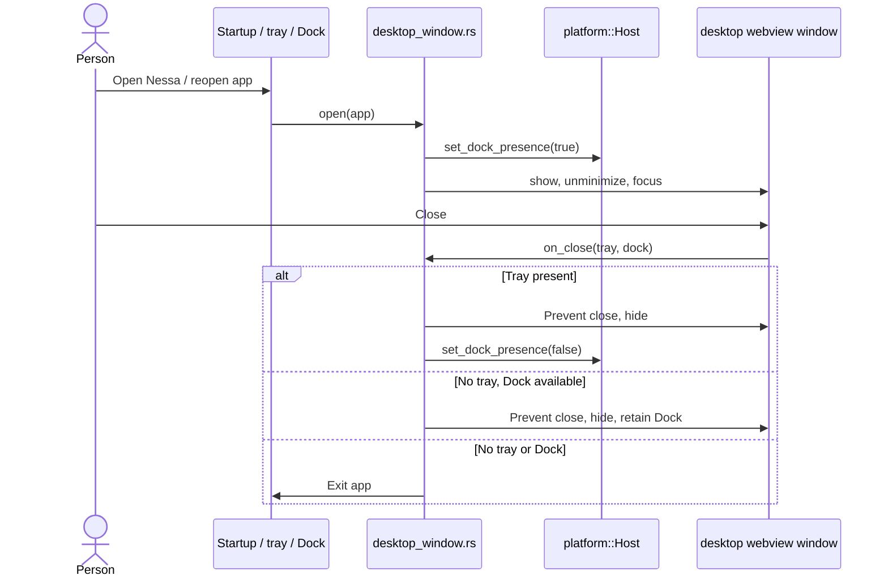

Code: [desktop window policy](../../../src-tauri/src/desktop_window.rs), [startup and event routing](../../../src-tauri/src/main.rs), [declared windows](../../../src-tauri/tauri.conf.json), [desktop entry](../../../src/desktop/main.tsx), [composition](../../../src/desktop/dependencies.ts). Regression definitions: `with_a_tray_it_is_dismissed`, `without_a_tray_the_dock_can_reopen_it_so_it_is_only_hidden`, and `without_a_tray_or_a_dock_nothing_could_reopen_it_so_the_app_quits` in the policy file. Related contract: [architecture desktop surface](../../ARCHITECTURE.md#minimal-desktop-surface), [ADR 238](../../adr/done/238-desktop-workspace-frontend.md).

Failure/risk: missing window and failed show are logged; failed show returns before subsequent focus. Unminimize/focus results are ignored, so foregrounding can fail without a second diagnostic (**inspection-confirmed handling limitation**, not a reproduced user defect). Native macOS titlebar geometry and Linux/Windows window-manager behavior remain unverified here.

## User flow: summon or dismiss the floating panel

Left-clicking the tray icon on mouse-up, choosing **Show Panel**, and pressing the registered global summon binding toggle the panel. Only a shortcut's pressed edge acts. The global binding comes from stage-scoped `shortcuts.json`, not `settings.json`; shortcut documents are validated and cached by `shortcuts.rs`. A successful shortcut toggle emits `SUMMONED` so setup can observe the shortcut lesson even though the OS consumed the key.

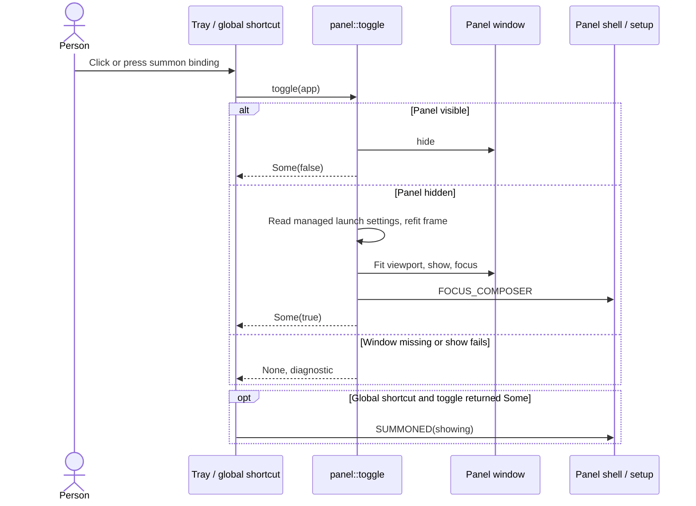

Code: [tray handlers](../../../src-tauri/src/tray.rs), [shortcut registration](../../../src-tauri/src/shortcut.rs), [shortcut cache/application](../../../src-tauri/src/shortcuts.rs), [toggle and show](../../../src-tauri/src/panel.rs), [host shell subscriptions](../../../src/panel/adapters/host-panel.ts). Coverage: `bundled_defaults_include_summon`, `a_version_this_build_does_not_speak_is_refused_and_never_saved`, cache malformed/read-refusal tests in `shortcuts.rs`; [host seam tests](../../../src/host/window.test.ts). Related: [server-owned keybindings ADR](../../adr/done/0004-server-owned-keybindings.md), [setup lesson](startup.md).

Failure/risk: parse failure or another application's accelerator claim logs and skips registration; the tray remains an alternate entry. The panel reads its managed launch `Settings` snapshot on toggle, not a fresh file read; editing geometry on disk requires a subsequent launch to apply. Hide errors are ignored and `Some(false)` still reports a hide, an **inspection-confirmed outcome-reporting limitation** whose native occurrence was not reproduced. Re-registering removes the recorded previous binding before registering the next. **Hypothesis to verify natively:** an unregister failure can leave an older OS binding live while the registration slot advances; a failed new registration is still recorded as the selected accelerator. Cache state is not proof of OS registration success.

## User flow: resize and refit the panel across displays

Configured width/minimum and optional height are applied once at startup. Every show recomputes a lower-right work-area frame from the current size, scale, and settings. Without a configured height the panel fills the available height; with one it keeps its current height clamped to the work area. Native viewport adapters pin/fit the webview and publish the visible window size, which the shell writes into CSS custom properties without rerendering the transcript tree for each size event.

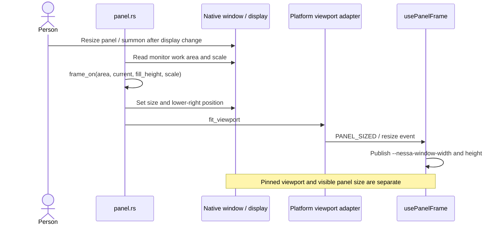

Code: [frame calculations and opening-size policy](../../../src-tauri/src/panel.rs), [macOS viewport](../../../src-tauri/src/platform/macos/viewport.rs), [Linux viewport](../../../src-tauri/src/platform/linux/viewport.rs), [other-host viewport](../../../src-tauri/src/platform/other/viewport.rs), [shell frame adapter](../../../src/panel/adapters/panel-frame.ts), [resize edge reveal](../../../src/panel/adapters/edge-reveal.ts). Coverage: panel tests `fills_the_work_area_when_height_is_not_configured`, `a_width_below_the_minimum_opens_at_the_minimum`, `a_zero_height_window_is_not_resized_width_only`, `a_realized_window_keeps_its_height_on_a_width_only_fit`; [CSS size tests](../../../src/panel/adapters/panel-frame.test.ts).

Failure/risk: `show` ignores `anchor_to_edge` errors and logs viewport fit failure, permitting a degraded opening. Invalid shell size values are refused to preserve CSS fallback. **Hypothesis:** a work area smaller than edge padding is protected against size underflow, but `frame_on` still subtracts the original padding from position; the tiny-area test checks size rather than a complete visible-bounds contract. No native reproduction was run. The historical viewport-jitter explanation in the macOS adapter is design evidence, not a claim of current jitter.

## User flow: switch the floating panel's surface

The tray's **Transparent** item requests a shell toggle. `useSurface` owns the actual choice, remembers `clear`/`translucent` in local storage, and `useHostPanel` asks the native host to apply frost. macOS uses native vibrancy; browser/Linux use host-feature/CSS rendering. This panel preference is separate from desktop theme preferences and native geometry settings.

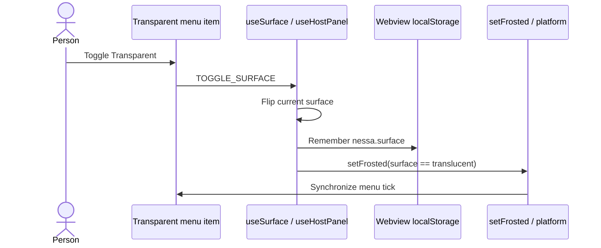

Code: [surface preference](../../../src/panel/adapters/surface.ts), [subscriptions](../../../src/panel/adapters/host-panel.ts), [guarded host calls](../../../src/host/window.ts), [platform host](../../../src-tauri/src/platform/mod.rs), [tray ownership](../../../src-tauri/src/tray.rs). Coverage: [host-window tests](../../../src/host/window.test.ts); native frost and real tray tick were not exercised here. Failure/risk: denied local storage falls back to translucent and does not prevent toggling (**designed degradation**). A host effect failure may leave rendering/menu state out of step with the requested surface (**hypothesis**, requires native verification).

## User flow: load, browse, and resynchronize the workspace

Both workspace layouts compose the same store and commands. Three columns show channels, the selected channel's session list, then panes; Sessions in sidebar expands sessions under channels. Layout choice is remembered; pane arrangement and source data are not saved between launches. Initial index load opens the first channel's newest session, a new-session home if the channel is empty, or nothing when no channel exists. Re-reading the index is the resync path for lost updates.

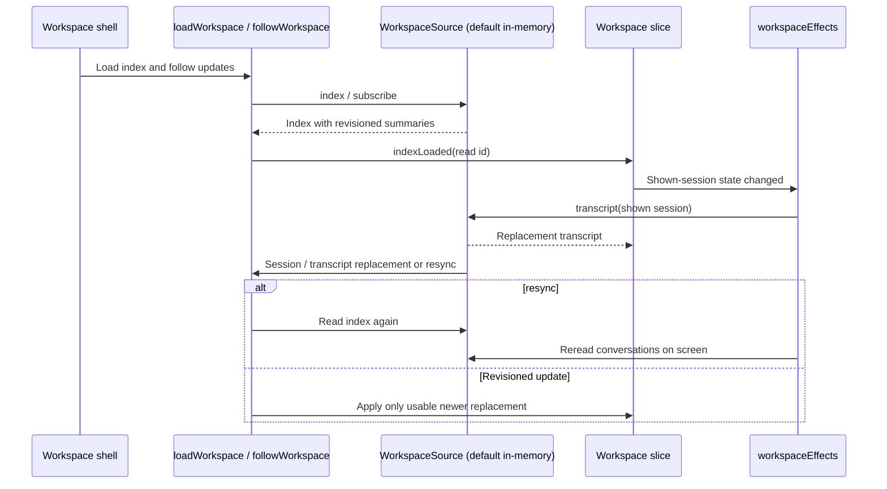

Code: [source contract](../../../src/desktop/workspace/application/ports.ts), [composition default](../../../src/desktop/dependencies.ts), [shell](../../../src/desktop/workspace/ui/layouts/workspace-shell.tsx), [commands](../../../src/desktop/workspace/adapters/store/commands.ts), [effects](../../../src/desktop/workspace/adapters/store/effects.ts), [update rules](../../../src/desktop/workspace/application/usecases/updates.ts), [retention](../../../src/desktop/workspace/model/retention.ts). Coverage: [updates tests](../../../src/desktop/workspace/application/usecases/updates.test.ts), especially `keeps an update that overtook a read, and a read that overtook an update`, `does not bring back a session removed before an older index read`, and resync overlap tests; [command tests](../../../src/desktop/workspace/adapters/store/commands.test.ts).

Failure/risk: source revisions start at 1, local provisional sessions at 0. Invalid source revisions are rejected/logged; contradictory index entries are left out by the consistency rules. Typed refusal produces UI copy; unexpected error logs and maps to `unavailable`. Failed transcript reads wait for **Try Again**, rather than retrying on every update. The port requires adapters to settle/timeout calls; the workspace does not itself impose a timeout (**adapter obligation**, important for a future gateway source). Retention keeps all pane conversations, at most 24 overview conversations, 8 otherwise-unshown conversations, and 256 removal entries; it is a bounded projection, not complete history.

## User flow: start a workspace session, send, and retry

**New Session** creates an unlisted draft with stable identity. First nonempty send starts its local summary at revision 0 and places a stable-ID message in the outbox. The source receives model, initiator, message identity, and provisional start metadata; its replacement transcript removes that outbox entry only when the transcript includes the message. The default source replies through its own scripted timers. Real model invocation belongs to the panel/gateway [chat flow](chat.md).

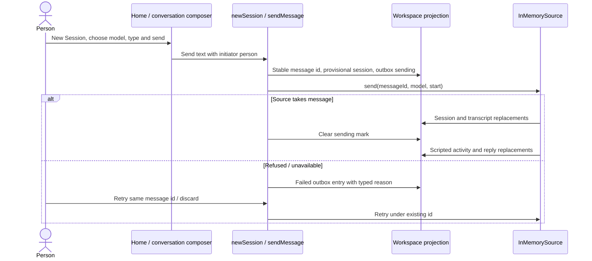

Code: [session use cases](../../../src/desktop/workspace/application/usecases/sessions.ts), [draft lifecycle](../../../src/desktop/workspace/model/session-lifecycle.ts), [command send/resend](../../../src/desktop/workspace/adapters/store/commands.ts), [in-memory source](../../../src/desktop/workspace/adapters/in-memory/in-memory-source.ts), [scripted replies](../../../src/desktop/workspace/adapters/in-memory/scripted-replies.ts), [conversation UI](../../../src/desktop/workspace/ui/panes/conversation.tsx). Coverage: [session tests](../../../src/desktop/workspace/application/usecases/sessions.test.ts) `keeps a sent message through any replacement until the source's conversation holds it`, `sends a refused message again in its place, and only a refused one`, `takes a session the source never began back to a new session's home when its last refused message goes`; [in-memory source tests](../../../src/desktop/workspace/adapters/in-memory/in-memory-source.test.ts).

Failure/risk: blank text or missing model/session returns `not-asked`; `unavailable` yields `unknown`, because completion may have occurred without acknowledgement. Discarding the last refused message of a never-started session restores its draft home when still shown. Retry reuses message identity but selects the current next-turn model (**inspection-confirmed behavior**); a future source must define identity agreement if model choice changes between retries. Drafts, outbox, fixture audit and replies are memory-only (**designed prototype limitation**).

## User flow: pin, archive, or close a workspace session view

Pin and archive call the source with an initiator and await its updates; the UI does not invent a successful pin/removal. Closing a pane affects layout, leaving an existing source session available to reopen. A draft that no pane shows is forgotten. Archiving a source session removes its view/state through the shared removal rule, creating a fresh draft if the last pane would otherwise have no session.

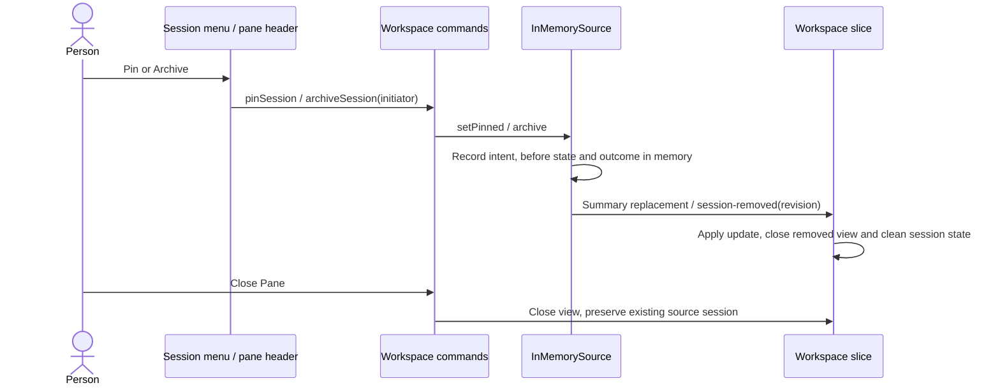

Code: [session actions](../../../src/desktop/workspace/ui/session-actions.tsx), [pin/archive commands](../../../src/desktop/workspace/adapters/store/commands.ts), [source audit](../../../src/desktop/workspace/adapters/in-memory/in-memory-source.ts), [removal cleanup](../../../src/desktop/workspace/application/usecases/updates.ts), [close pane](../../../src/desktop/workspace/application/usecases/panes.ts). Coverage: command/source tests for concurrent pins/archives and typed refusals; updates test `drops a removed session's conversation, failure and outbox, and a read that outlived it`; [lifecycle tests](../../../src/desktop/workspace/model/session-lifecycle.test.ts).

Failure/risk: unknown/provisional sessions return `not-asked` before pin/archive. Pin/archive refusals log and retain existing state; the command does not install a visible failure notice (**inspection-confirmed feedback limitation**). Fixture audit records are not durable gateway audit evidence. Native **Quit Nessa** separately follows the persisted `stopAgentsOnQuit` policy; it is not implied by close-pane or archive. See [runtime shutdown](runtime.md).

## User flow: open, split, resize, and close panes

Opening a session already shown focuses its existing pane. Opening beside uses measured room: prefer right, then below when no side was specified; ordinary open-beside may replace its target if no split fits, while new-session-beside refuses rather than obscuring a conversation with a blank draft. Split panes owns geometric rules; workspace commands own placement state and side-column fitting.

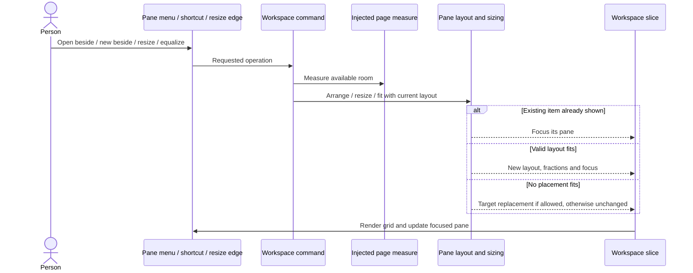

Code: [workspace pane use cases](../../../src/desktop/workspace/application/usecases/panes.ts), [pane commands](../../../src/desktop/workspace/adapters/store/commands.ts), [source bridge](../../../src/desktop/workspace/adapters/store/split-panes-source.ts), [split-pane map](../../../src/desktop/split-panes/index.ts), [layout rules](../../../src/desktop/split-panes/model/pane-layout.ts), [sizing](../../../src/desktop/split-panes/model/pane-sizing.ts), [window fit](../../../src/desktop/workspace/model/window-fit.ts). Tests: [pane use cases](../../../src/desktop/workspace/application/usecases/panes.test.ts), [layout](../../../src/desktop/split-panes/model/pane-layout.test.ts), [sizing](../../../src/desktop/split-panes/model/pane-sizing.test.ts), [window fit](../../../src/desktop/workspace/model/window-fit.test.ts). Browser contracts: [responsive](../../../verification/desktop/scripts/responsive.mjs), [safe area](../../../verification/desktop/scripts/safe-area.mjs). Related diagrams: [ADR 253](../../adr/done/253-split-panes-component.md).

Failure/risk: four panes/three columns and pane sizing constraints bound arrangements (nominal minimum 300×220, with spare-room fitting rules). No measured workspace means no new split placement. Closing/reflow changes focus to a remaining pane; closing the last session view starts a draft where a channel/model exists. Layout is not persisted (**designed limitation**). Browser frame and safe-area scripts were not run here, so geometry and animation are not validated by this trace.

## User flow: drag or move a session or pane

A session row or pane handle starts a carried-item drag. The split-pane module computes target zones and the candidate layout using the source's current room/layout; a ghost previews the drop. Side columns are not targets. Releasing commits the drop through the workspace command; middle zones replace/swap according to the carried item's kind, and edge zones split only when admissible. Keyboard pane nudges use the same layout authority.

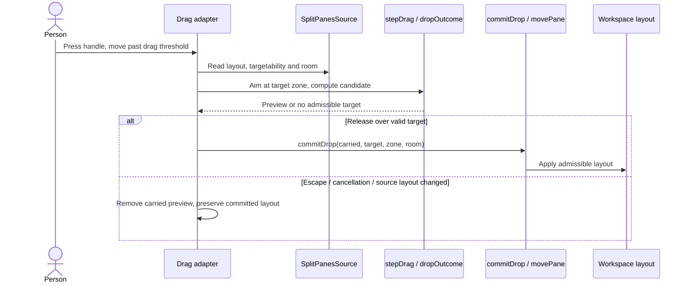

Code: [host drag options](../../../src/desktop/workspace/adapters/dom/split-panes-drag.ts), [drag adapter](../../../src/desktop/split-panes/adapters/dom/drag.ts), [drag states](../../../src/desktop/split-panes/model/drag.ts), [drop rules](../../../src/desktop/split-panes/model/drop.ts), [workspace commit](../../../src/desktop/workspace/adapters/store/commands.ts). Coverage: [drag DOM tests](../../../src/desktop/split-panes/adapters/dom/drag.test.tsx), [workspace drag tests](../../../src/desktop/workspace/adapters/dom/split-panes-drag.test.tsx), [drop model tests](../../../src/desktop/split-panes/model/drop.test.ts); [browser drag script](../../../verification/desktop/scripts/drag.mjs).

Failure/risk: source subscriptions cancel a drag when the underlying layout changes; no candidate means no drop. Reduced motion uses an immediate preview instead of an animated flight. These are implemented safeguards; pointer capture, cancellation and mid-flight geometry still need the browser script for runtime proof. Historical reduced-motion preview fix `6ca15f2d` is not a reproduced current failure.

## User flow: follow focus and route keyboard actions

Window bindings are a published table consumed by handlers, tooltips and Settings. `command` means Cmd on macOS and Ctrl elsewhere. Cmd/Ctrl+N creates a session; Shift+Cmd/Ctrl+N creates beside; Cmd/Ctrl+W closes the front view; Cmd/Ctrl+1–4 chooses a pane; Shift+Cmd/Ctrl+[ or ] steps focus; Ctrl+Alt+arrows moves panes. Focus adapters put the caret in a newly focused session composer or widget body, while preserving modal owners and deliberate list navigation.

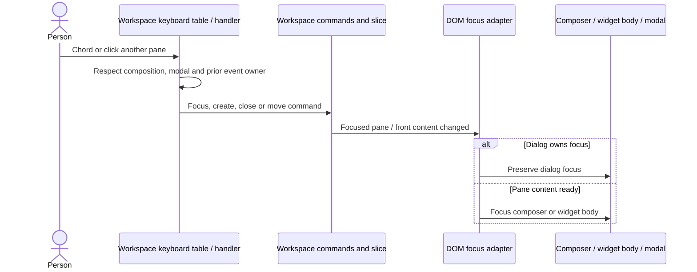

Code: [bindings](../../../src/desktop/workspace/ui/layouts/shortcuts.ts), [matching](../../../src/desktop/workspace/adapters/dom/shortcuts.ts), [focus adapter](../../../src/desktop/workspace/adapters/dom/focus.ts), [pane focus](../../../src/desktop/workspace/ui/panes/use-pane-focus.ts), [front-content close](../../../src/desktop/workspace/application/usecases/navigation.ts). Coverage: [focus tests](../../../src/desktop/workspace/adapters/dom/focus.test.tsx) `puts the caret in the new pane's composer after a split, ⌘N and ⌘W`, `leaves the caret in a dialog`; [shortcut tests](../../../src/desktop/workspace/ui/layouts/shortcuts.test.ts), [browser focus contract](../../../verification/desktop/scripts/focus.mjs).

Failure/risk: a widget occupying the window consumes close-front before a pane beneath; a pane widget's Escape does not close its pane. Settings makes the underlying desktop inert. Key ownership and IME composition are consequential; see the [widget exit order](#user-flow-step-back-from-a-widget-and-return-to-its-conversation). Browser/native focus behavior was not reproduced here.

## User flow: fold, reveal, and resize side columns

The titlebar and Cmd/Ctrl+B fold the sidebar; Alt+Cmd/Ctrl+S folds the session list in Three columns. Window fitting narrows/folds side columns to keep room for panes and restores them when the window widens. Resting at the left edge reveals a folded sidebar over the content. Leaving starts a delayed hide; entering the revealed sidebar cancels it. Docking while revealed retains the overlay until the docked copy opens beneath it.

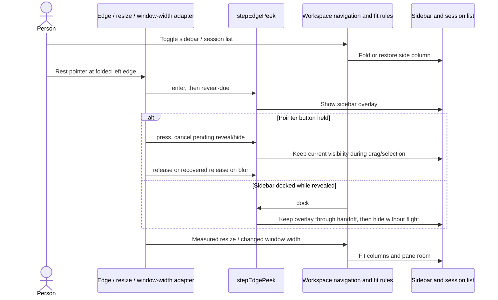

Code: [navigation/column fit](../../../src/desktop/workspace/application/usecases/navigation.ts), [window fit](../../../src/desktop/workspace/model/window-fit.ts), [width adapter](../../../src/desktop/workspace/adapters/dom/window-width.ts), [pure peek table](../../../src/desktop/model/edge-peek.ts), [peek timers/events](../../../src/desktop/adapters/use-edge-peek.ts), [shared resize edge](../../../src/desktop/ui/resize-edge.tsx). Coverage: [navigation tests](../../../src/desktop/workspace/application/usecases/navigation.test.ts), [peek model](../../../src/desktop/model/edge-peek.test.ts), [peek DOM](../../../src/desktop/adapters/use-edge-peek.test.tsx) `takes the window's blur as the release`, `comes after a carrying drag, which takes Escape on the window, whenever either began listening`; [responsive browser contract](../../../verification/desktop/scripts/responsive.mjs).

Failure/risk: stale timer events are ignored by the state machine; missed pointer releases are recovered on later enter/leave or blur. Escape closes the edge reveal before widget exit, while menu/dialog, carrying drag and composition owners retain priority. Settings has its own peek scope. Real pointer timing and overlay geometry remain unverified here; a unit timer result would not prove the composited handoff.

## User flow: expand and restore the Classic right panel

Classic is a separate shell option. Its right panel is an in-app surface rather than a split-pane session or native OS window. Its titlebar expand action fills the content region, preserves underlying widths/open states and leaves native controls available. Escape restores; the right-panel toggle leaves focus mode and closes that panel. Resizing can snap the center workspace closed, then restore it when its minimum fits again.

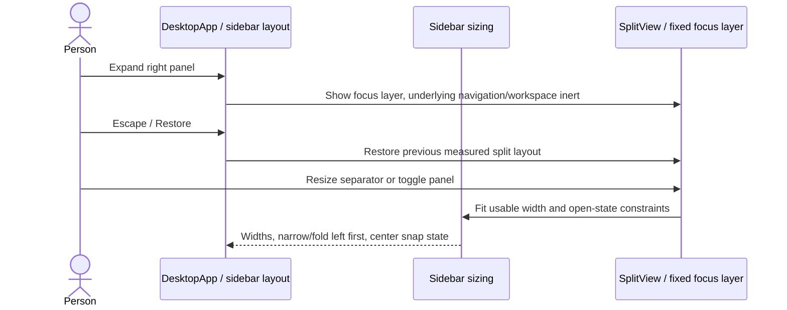

Code: [Classic shell](../../../src/desktop/ui/desktop-app.tsx), [sidebar layout adapter](../../../src/desktop/adapters/use-sidebar-layout.ts), [sizing rules](../../../src/desktop/adapters/sidebar-sizing.ts), [desktop stylesheet](../../../src/desktop/styles.css). Coverage: [sizing tests](../../../src/desktop/adapters/sidebar-sizing.test.ts) `gives the right its 200px minimum before the left, narrowing the left first`, `closes the right rather than shrinking it below 200px`, `gives the entire workspace to right when the workspace snaps closed`; [responsive verification](../../../verification/desktop/scripts/responsive.mjs). Related contract: [architecture desktop surface](../../ARCHITECTURE.md#minimal-desktop-surface).

Failure/risk: center workspace expanded minimum is 350px, sidebar minimum 200px and right-panel minimum 200px. Resizing the right edge preserves current left width where the sizing rules allow. Closed panels are inert. These shell constraints are separate from split-pane constraints; applying one layout's geometry assumptions to the other is a **test-design risk**, not a confirmed runtime defect. Classic's home composer cannot send until a callback is wired.

## User flow: search sessions and jump with the quick switcher

Cmd/Ctrl+K opens **Jump to**; Cmd/Ctrl+Backslash opens **Open beside**. Cmd/Ctrl+F searches the session list where present, otherwise opens the switcher. Search computes local fuzzy subsequence matches over titles/channel/agent names; it is not a gateway history query. Empty-query switcher rows offer a new session, requests needing attention and recent sessions. A nonempty query also offers starting a session with that text.

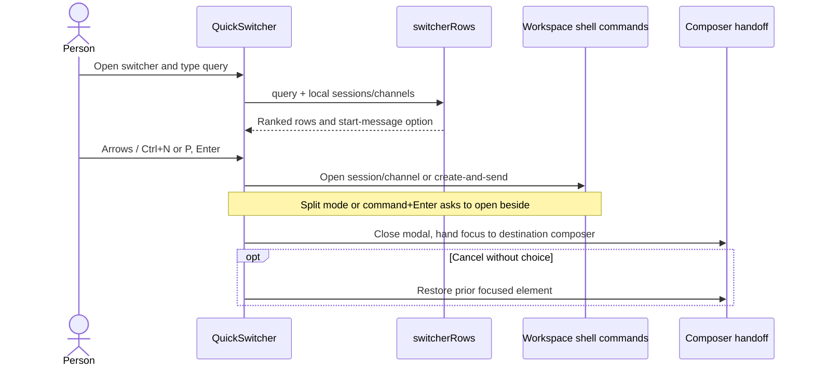

Code: [search model](../../../src/desktop/workspace/model/session-search.ts), [switcher UI and focus handoff](../../../src/desktop/workspace/ui/quick-switcher/quick-switcher.tsx), [session list](../../../src/desktop/workspace/ui/session-list/session-list.tsx), [shell pick routing](../../../src/desktop/workspace/ui/layouts/workspace-shell.tsx). Coverage: [search tests](../../../src/desktop/workspace/model/session-search.test.ts), [switcher focus tests](../../../src/desktop/workspace/ui/quick-switcher/quick-switcher.test.tsx) `calls the hand-off off when the person presses somewhere else first`; [layout tests](../../../src/desktop/workspace/ui/layouts/layouts.test.tsx).

Failure/risk: focus trap holds switcher input, and outside click/Escape cancels it. The delayed composer handoff is canceled if the person clicks elsewhere first. Search is bounded to current source summaries and capped result sets (**designed limitation**); typing an unmatched query still offers a first-message action, so Enter can create/send rather than merely dismiss a no-results search.

## User flow: review agents, answer requests, and reply from the overview

Choosing **Agents** or Cmd/Ctrl+0 opens an overview over the panes; underlying layouts stay measured. It groups Needs you, Running and Finished unseen, with Ongoing/All and time filtering. Selecting a row peeks at current activity, this turn's steps, latest text and approval without marking the session read. Opening the session returns to panes and marks it read there. The default overview displays fixture sessions, not deployed subagents.

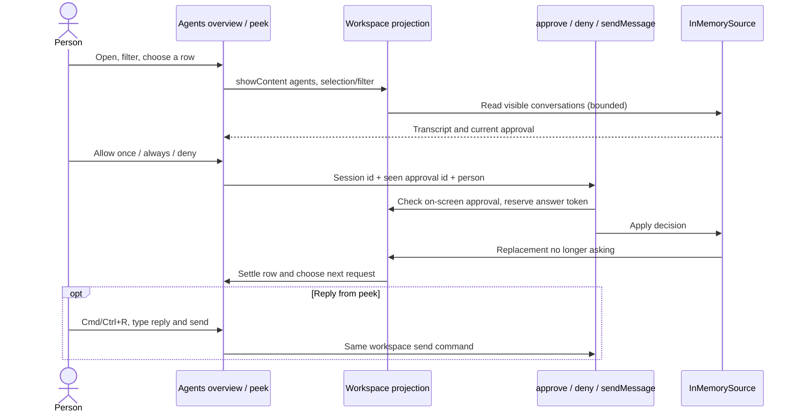

Code: [overview UI](../../../src/desktop/workspace/ui/overview/overview.tsx), [peek](../../../src/desktop/workspace/ui/overview/session-peek.tsx), [keys](../../../src/desktop/workspace/ui/overview/overview-keys.ts), [settling](../../../src/desktop/workspace/ui/overview/settling.ts), [overview rules](../../../src/desktop/workspace/application/usecases/overview.ts), [answer commands](../../../src/desktop/workspace/adapters/store/commands.ts). Coverage: [overview tests](../../../src/desktop/workspace/ui/overview/overview.test.tsx) `answers one request per press: a held key's repeats, or a press straight after, answer nothing more`, `shares one answer with a pane: an answer on its way from anywhere rests its buttons`, `says why an answer was not confirmed, and lets the person answer again`; [overview models](../../../src/desktop/workspace/model/overview/agents-glance.test.ts).

Failure/risk: duplicate answers return `answering`; off-screen or replaced approval returns `not-asked`. Unknown outcome leaves an explicit unconfirmed answer rather than assuming approval. Keyboard repeat/pause protections prevent one held key consuming successive requests. The view follows source summary revisions independently of transcript revisions, so peek and activity can lag each other (**designed replacement-view behavior**). “Allow always” here exercises fixture approval scope, not gateway permission persistence; see [real permissions](chat.md).

## User flow: open a widget inline, in a pane, or over the window

A transcript widget is a `(plugin, id)` reference resolved through a registry. Composition registers native plugins; the registry supports app-plugin register/unregister at runtime. **Only native plugins currently provide `useWidget` and place views.** `AppAnswer` reports a registered app plugin as `unshowable`; the sandboxed MCP App renderer/bridge is pending. The sample workspace registers the sample native plugin. Inline, pane and window are host **places**: “window” fills the desktop content region over the existing panes, not a detached OS window. Inline Open for a drawable native widget asks workspace commands to open beside the originating session or show over the content region.

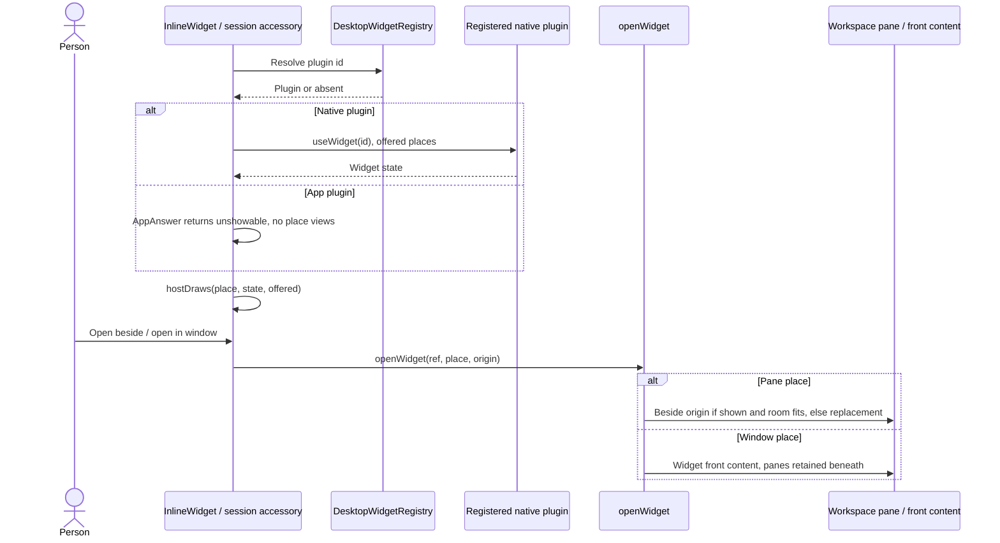

Code: [registry](../../../src/desktop/widgets/application/registry.ts), [plugin contract](../../../src/desktop/widgets/ui/plugin.ts), [native/app answer boundary](../../../src/desktop/widgets/ui/widget-answer.tsx), [host rendering table](../../../src/desktop/widgets/model/host-table.ts), [inline host](../../../src/desktop/widgets/ui/inline-widget.tsx), [host callbacks](../../../src/desktop/workspace/adapters/store/widget-hosts.ts), [widget pane](../../../src/desktop/workspace/ui/panes/widget-pane.tsx), [widget window](../../../src/desktop/workspace/ui/panes/widget-window.tsx), [reference codec](../../../src/desktop/workspace/model/pane-item.ts). Tests: [registry](../../../src/desktop/widgets/application/registry.test.ts), [host table](../../../src/desktop/widgets/model/host-table.test.ts), [rendered hosts](../../../src/desktop/widgets/ui/hosts.test.tsx), [workspace hosts](../../../src/desktop/workspace/ui/layouts/widgets.test.tsx), [reference identity](../../../src/desktop/workspace/model/pane-item.test.ts). Measured-place/browser contract: [widgets script](../../../verification/desktop/scripts/widgets.mjs). Related diagram: [widget design](../../adr/todo/326-widgets.md); real MCP transport and pending Apps renderer are mapped in [extensions UI](extensions-ui.md).

Failure/risk: duplicate native IDs throw at composition; duplicate runtime registration is a typed refusal, and native plugins cannot unregister. Missing/off/unshowable states display explicit host lines; unread states wait. An inline-ready widget without an inline view draws a title/Open row. Hosts do not fabricate retries or success. Widget identity includes the plugin as well as its id, and session keys use a separate codec domain. **Designed limitation:** the offered pane/window places do not implement native OS detachment, separate process/window state, or cross-window transfer.

## User flow: step back from a widget and return to its conversation

Host context gives a plugin size, focus and visibility; a view can register last-in-first-out Escape steps. The sample trail registers its detail's Back action, so Escape first exits detail. A window widget's next Escape returns to the panes as they were; a pane widget's Escape with no remaining detail does nothing. The origin trail focuses the existing conversation or opens it beside the widget.

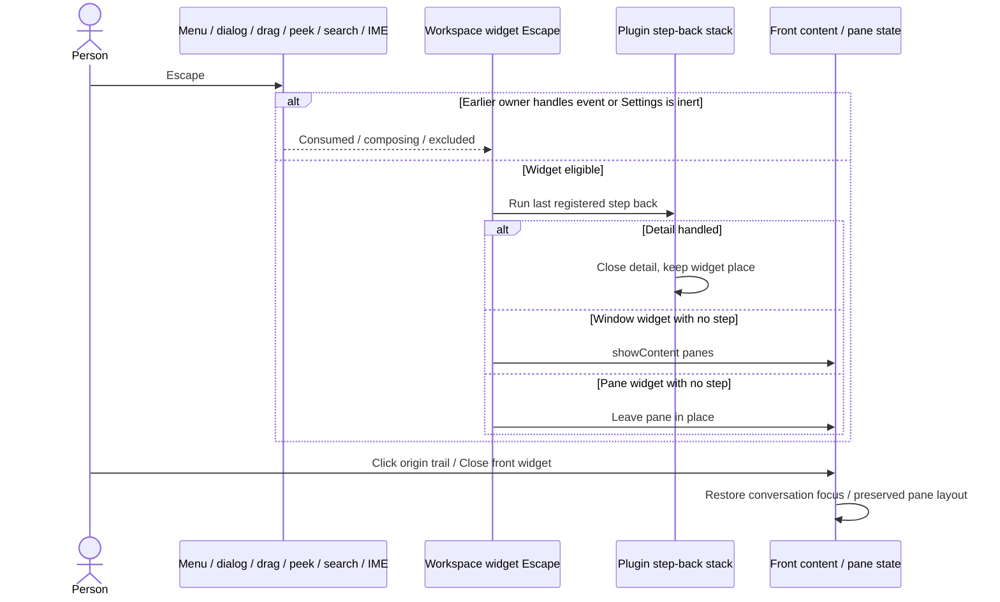

Code: [Escape ownership](../../../src/desktop/workspace/adapters/dom/widget-escape.ts), [Escape stack](../../../src/desktop/widgets/application/escape-stack.ts), [host context](../../../src/desktop/widgets/adapters/dom/host-context.ts), [widget trail](../../../src/desktop/workspace/ui/panes/widget-trail.tsx), [sample trail](../../../src/desktop/widgets/fixture/sample-plugin.tsx). Tests: [widget Escape](../../../src/desktop/workspace/adapters/dom/widget-escape.test.tsx) `leaves an Escape that ends a composition to its field`; [host integration](../../../src/desktop/workspace/ui/layouts/widgets.test.tsx) `replaces its widget with another opened there, drawn afresh: no step back of the last one's, the caret in its body`; [stack](../../../src/desktop/widgets/application/escape-stack.test.ts).

Failure/risk: stale widget instance state and Escape callbacks are lifecycle hazards; keyed/remounted views and stack cleanup have regressions in the integration tests. Earlier menu/dialog and IME ownership is respected. The planned MCP Apps iframe renderer will need its own key-routing contract; the implemented native React widget behavior does not prove that future integration. See [extensions UI](extensions-ui.md). Historical PR #364 fixes for widget reuse, Escape and header accessories are not asserted to remain broken.

## User flow: open, search, and change desktop settings

Sidebar identity or Cmd/Ctrl+, opens Settings over the current layout. The background is inert. A catalogue owns categories, tabs, names, descriptions and search keywords. A search hit selects the owning category/tab and highlights its row; keyboard tab-strip navigation supports arrows/Home/End. Theme/icon/layout/motion/window preferences are real local preferences; prototype controls are unsaved state, and pending actions are disabled. Escape does not close the Settings surface; use its return control.

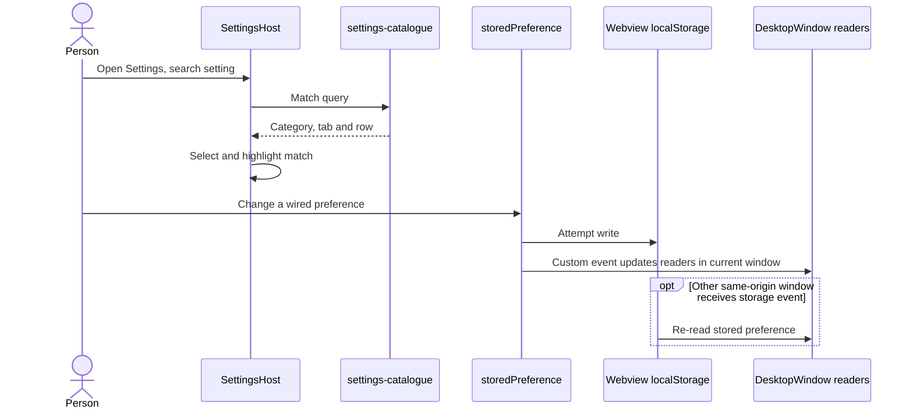

Code: [desktop Settings mount](../../../src/desktop/ui/desktop-window.tsx), [Settings surface](../../../src/desktop/settings/ui/settings-view.tsx), [catalogue](../../../src/desktop/settings/model/settings-catalogue.ts), [tab wiring](../../../src/desktop/settings/ui/settings-tabs.tsx), [prototype/pending controls](../../../src/desktop/settings/ui/settings-controls.tsx), [stored preferences](../../../src/desktop/adapters/stored-preference.ts), [layout choice](../../../src/desktop/adapters/workspace-layout-preference.ts). Coverage: [Settings view](../../../src/desktop/settings/ui/settings-view.test.tsx), [catalogue](../../../src/desktop/settings/model/settings-catalogue.test.ts), [preferences](../../../src/desktop/adapters/stored-preference.test.tsx), [desktop layout switching](../../../src/desktop/ui/desktop-window.test.tsx).

Failure/risk: blocked storage keeps a preference active within the current window via custom event but does not persist it. Unknown stored values parse to defaults. Prototype privacy/access-mode controls must not be mistaken for gateway policy changes (**designed limitation**). Catalogue layout restrictions disable controls outside their relevant layout. Native `settings.json` has a separate lenient startup/strict update contract: malformed or unreadable bytes are preserved; tray quit-policy changes refuse rather than overwrite them. Coverage: [native settings tests](../../../src-tauri/src/settings.rs) `an_update_refuses_a_malformed_file_and_leaves_its_bytes_alone`; [tray tests](../../../src-tauri/src/tray.rs) `the_toggle_keeps_the_keys_it_did_not_change`.

## User flow: personalize the home header and composer

Customize chooses a header picture or restores the built-in scene. The file is validated as an image up to 25 MB, kept in IndexedDB, and shown with an editable focal point/zoom. Done stores framing; cancel restores the retained framing. Drag, wheel/pinch, arrows, +/−, slider and Reset adjust placement. Decoded pixels supply a local palette; optional tint overlays the selected theme. Conversation slivers share the picture, animating a GIF only in the focused pane when configured.

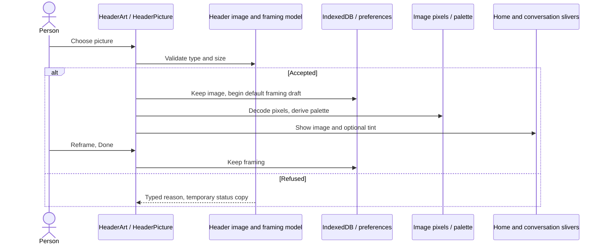

Code: [header coordinator and conversation sliver](../../../src/desktop/ui/header-art.tsx), [picture controls](../../../src/desktop/ui/header-picture.tsx), [image rules](../../../src/desktop/model/header-image.ts), [image storage](../../../src/desktop/adapters/header-image.ts), [palette](../../../src/desktop/model/image-palette.ts), [home composer](../../../src/desktop/ui/composer.tsx), [page-mode thresholds](../../../src/desktop/model/page-mode.ts). Coverage: [image model](../../../src/desktop/model/header-image.test.ts), [image adapter](../../../src/desktop/adapters/header-image.test.tsx), [read races](../../../src/desktop/adapters/header-image-read.test.tsx), [palette](../../../src/desktop/model/image-palette.test.ts), [page mode](../../../src/desktop/model/page-mode.test.ts), [pane picture](../../../src/desktop/workspace/ui/panes/pane-picture.test.tsx).

The home composer changes from card to page at seven rendered draft lines and returns at three, with hysteresis. Model/effort/Fast choices read the model catalogue; folder picking is disabled. In a workspace home, callbacks send to its local session; in Classic, the composer has no send callback and advertises its unavailability. These are distinct surfaces even when the chrome looks similar.

Failure/risk: image decode/palette failure preserves the selected theme without a palette; stale palette completion is ignored after image changes. Image storage and framing are webview-local, not uploaded attachment or workspace state (**designed limitation**); see [attachments](attachments.md) for message image transfer. A privacy/storage refusal or restart can remove unsaved changes. Browser picture crop and GIF animation were not exercised here.

## User flow: discover subagents and experimental features

At this head, **Advanced › Experimental** says “Nothing to try right now.” Desktop `subagents` and `experiments` plugin IDs appear in tests/examples, not as registered functional feature plugins in production composition. Agents overview is a workspace view, not a control for spawning SDK subagents. The sample plugin's trail exercises generic host mechanics and cannot establish experiment launch, validation, approval, cancellation or result persistence.

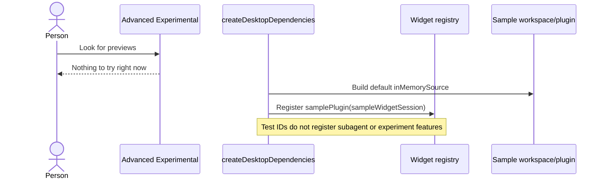

Code: [Experimental tab](../../../src/desktop/settings/ui/settings-tabs.tsx), [composition](../../../src/desktop/dependencies.ts), [fixture widget states](../../../src/desktop/widgets/fixture/sample-widgets.ts), [registry tests using illustrative IDs](../../../src/desktop/widgets/application/registry.test.ts), [pane identity tests](../../../src/desktop/workspace/model/pane-item.test.ts). Coverage: catalogue test `keeps experiments under Advanced, just before About, and not under General`. Related proposal: [widget ADR](../../adr/todo/326-widgets.md); runtime execution/subagent APIs are outside this desktop map and belong in [runtime](runtime.md). **Designed limitation:** no desktop subagent/experiment product flow is implemented by the sample host alone.

## User flow: trace verified pull-request contributions

These are Git-history-verified PRs, not issue numbers inferred from feature comments. Merge entries identify the PR; first-parent merge diffs confirm the scope. Squash subjects identify #353 and #374 as their final parenthetical numbers; their first references, #327 and #360, are issue numbers. A broad PR contribution does not mean every later line originated there.

| Verified PR | Git evidence | Contribution relevant to these flows |
| --- | --- | --- |
| [#251](https://github.com/nessalabs/nessa-agent/pull/251) | `132e2b72`, `Merge pull request #251 … desktop-app`; merge diff includes desktop entry, composition, settings/workspace and `desktop_window.rs` | Main desktop surface and workspace frontend |
| [#279](https://github.com/nessalabs/nessa-agent/pull/279) | `961dc78d`, `Merge pull request #279 … 253-split-panes`; merge diff includes split-pane model, adapters, UI and workspace integration | Reusable split-pane ownership and dragging/resizing |
| [#284](https://github.com/nessalabs/nessa-agent/pull/284) | `868bbd57`, `Merge pull request #284 … 283-overview-header` | Overview header work; inspect merge diff for exact row/layout change |
| [#288](https://github.com/nessalabs/nessa-agent/pull/288) | `f10d0c22`, `Merge pull request #288 … list-inset-alignment` | Session-list inset alignment |
| [#353](https://github.com/nessalabs/nessa-agent/pull/353) | `5a877ce8`, `feat(desktop): a pane holds a session or a widget (#327) (#353)` | Session/widget pane identity and host integration |
| [#364](https://github.com/nessalabs/nessa-agent/pull/364) | `c3151c07`, `Merge pull request #364 … 328-widget-hosts`; merge diff includes widget registry, hosts, Escape integration and tests | Inline/pane/window hosts, accessories, rendering/exit regression fixes |
| [#363](https://github.com/nessalabs/nessa-agent/pull/363) | `cd092666`, `Merge pull request #363 … 346-gateway-mcp-client` | MCP connection/tool UI plumbing; detailed transport flow in [extensions UI](extensions-ui.md) |
| [#374](https://github.com/nessalabs/nessa-agent/pull/374) | `52bc6cbc`, `feat(desktop): widget host size from nessa_ui's shared size observer (#360) (#374)` | Shared size observation for widget host context |

Read-only verification commands used were `git log --merges --format='%h %s'`, scoped `git log`, and `git diff-tree --no-commit-id --name-only -r <merge>^1 <merge>` for #251/#279/#284/#288/#364. No PR publication, branch creation, commits, or source changes were made for this map. The linked ADR numbers 238/253/326 and feature references #327/#328/#360 are decision/issue identifiers; they are not substituted for verified PR identities.
