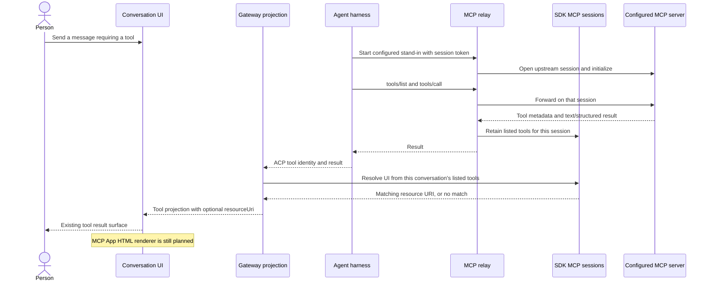
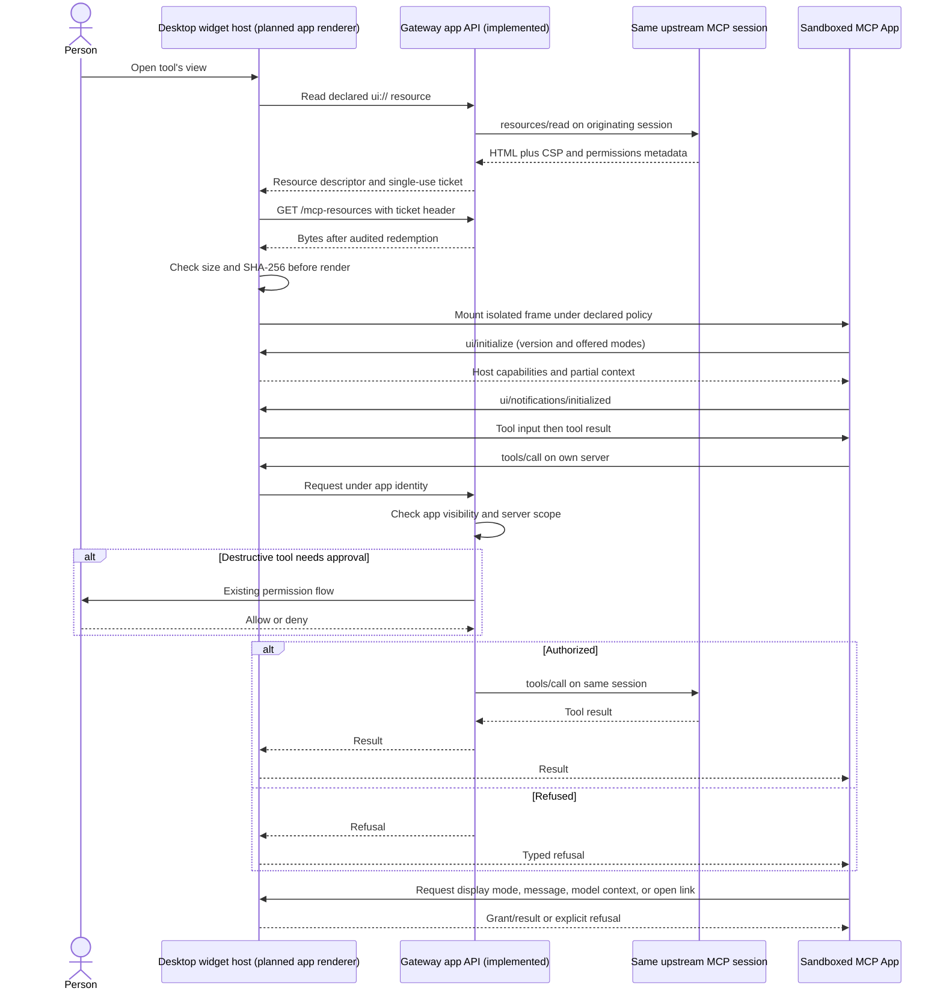
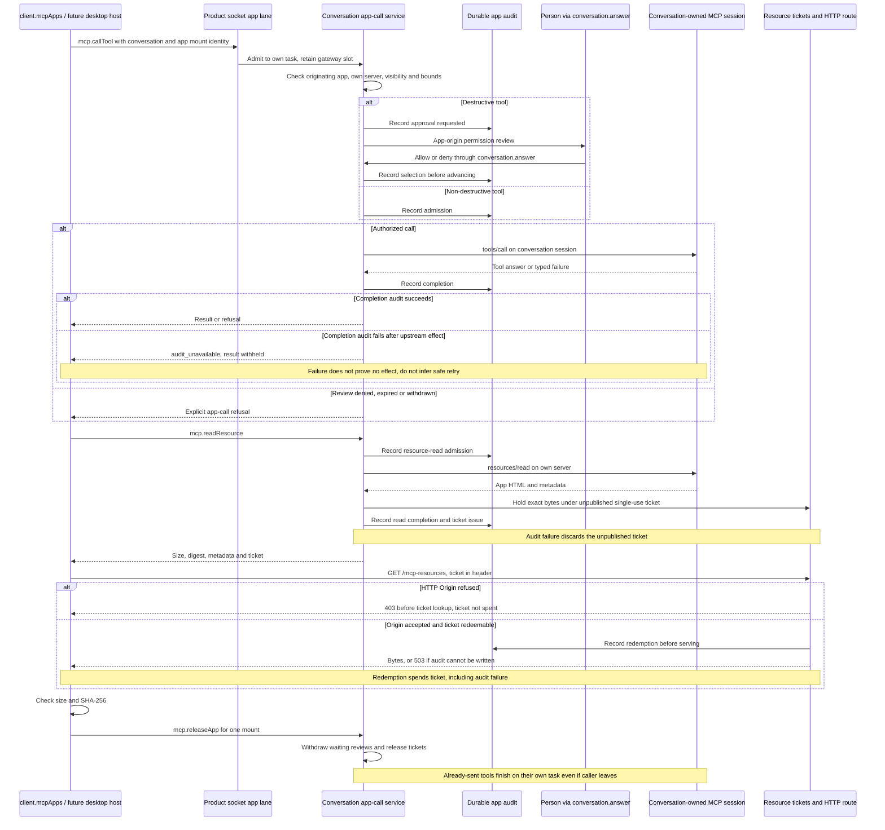
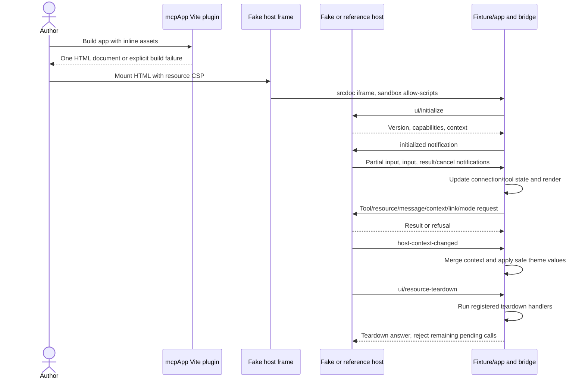
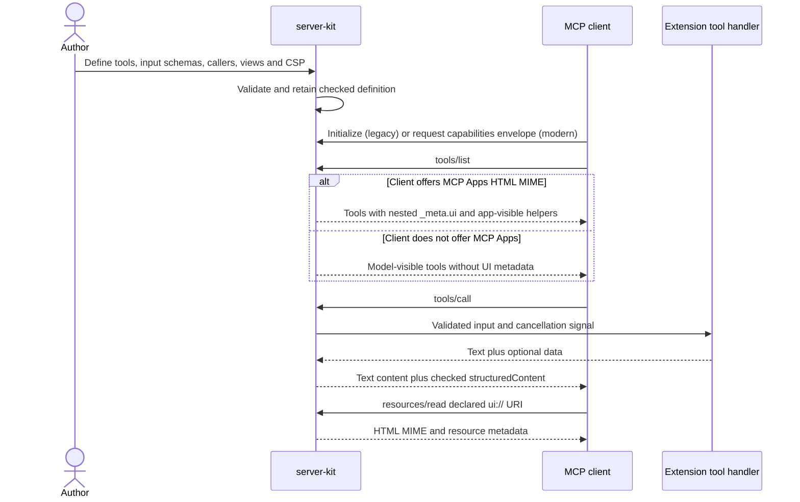
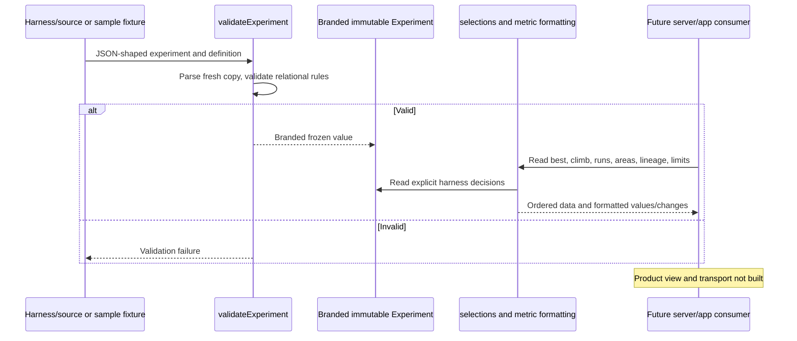
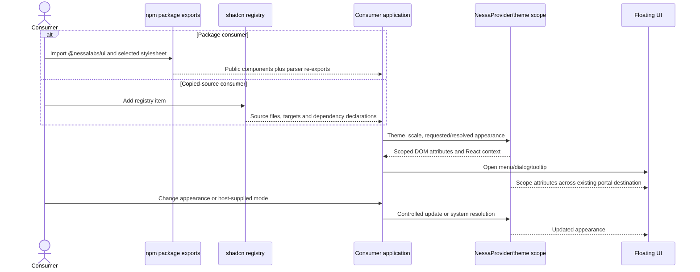
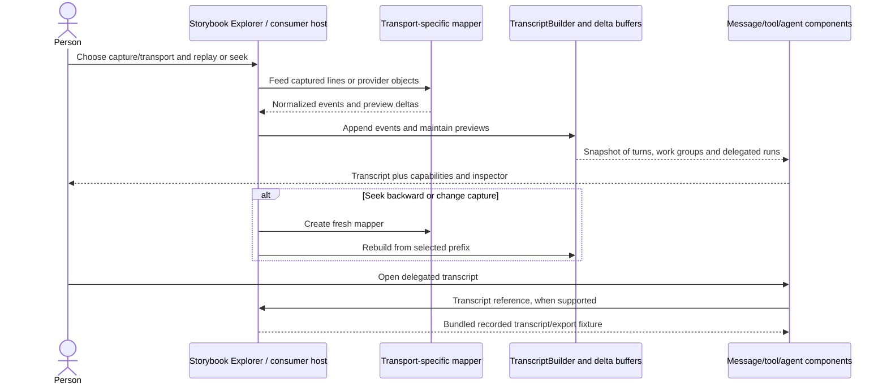
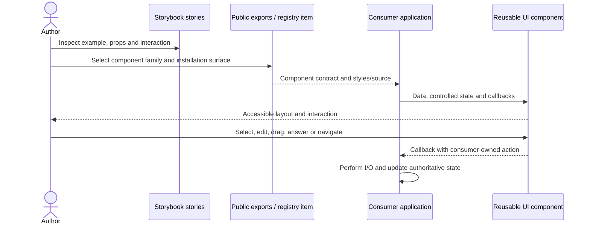

# Extensions, MCP Apps, and reusable UI

This is the cross-repository map for a person opening a tool's interactive view,
an extension author building that view, and a UI consumer rendering agent output.
Native desktop widget placement is in [desktop](desktop.md); sending messages and
reading tools are in [chat](chat.md); execution and approval ownership are in
[runtime](runtime.md); file surfaces are in [attachments](attachments.md); starting
the workshop and services is in [startup](startup.md).

Evidence baseline: `nessa-agent` `e3fe8cf8` (updated from `52bc6cbc` after PR #377), `nessa-extensions` `8dccc7fe`,
`nessa_ui` `8aaeb437` (2026-10-02). This map was checked against source, existing
tests, and local Git history. Linked tests describe regression evidence; they were
not executed for this documentation pass. “Implemented” means present in these
checkouts, not verified published to npm or exercised against a live third-party
host. PR links below come from merge commits or squash subjects in that history;
issue links denote planned work and are never counted as contributing PRs.

## User flow: see an MCP tool's result and discover its view

**Implemented:** the gateway owns upstream MCP sessions, lists tool UI metadata,
and projects a matching `ui://` resource URI onto the conversation tool. The
conversation also carries MCP identity and structured output. **Implemented backend
additions:** app resource/tool methods and ticket redemption
(PR #377). **Not implemented:** wiring a desktop app mount to those methods and
mounting an MCP App renderer.
A resource URI in a projection is not an openable card by itself.

Ownership and links:

- [MCP connection design and lifecycle tables](../../design/mcp-connections.md)
  and [gateway MCP module map](../../../crates/nessa-server/src/mcp_servers/mod.rs)
  explain session ownership and the stand-in. The [tool-UI adapter](../../../crates/nessa-server/src/mcp_servers/infrastructure/tool_uis.rs)
  asks for this conversation's list, not a global guessed match.
  Claude's structured results, which its harness reports only as text, come from
  the [results the stand-in forwarded](../../../crates/nessa-sdk/src/infrastructure/acp/sessions/forwarded.rs)
  ([forwarded results](../../design/mcp-connections.md#forwarded-results), #435).
- [SDK tool UI values](../../../crates/nessa-sdk/src/domain/mcp_apps/value_objects/tool_ui.rs)
  own URI bounds, visibility, and unique matching. [SDK MCP domain tests](../../../crates/nessa-sdk/tests/domain/mcp_apps.rs)
  and [MCP protocol/session tests](../../../crates/nessa-sdk/tests/infrastructure/mcp)
  cover metadata and connection boundaries.
- [Projection](../../../crates/nessa-server/src/conversation/application/projection.rs)
  attaches the URI at read time and incorporates it into the revision when present.
  [Conversation view](../../../src/conversation/application/view.ts) keeps optional
  `mcp`/`structuredContent`; [transcript adapter](../../../src/conversation/adapters/agent-stream/transcript.ts)
  parses structured results, with [adapter tests](../../../src/conversation/adapters/agent-stream/transcript.test.ts).
- Contributing PRs: [agent #355](https://github.com/nessalabs/nessa-agent/pull/355)
  (identity and structured ACP result), [#363](https://github.com/nessalabs/nessa-agent/pull/363)
  (gateway MCP client), [#367](https://github.com/nessalabs/nessa-agent/pull/367)
  and [#372](https://github.com/nessalabs/nessa-agent/pull/372)
  (conversation-keyed session opening and follow-up fixes).

Bug perspective: **designed limitation** — an ambiguous normalized tool name
produces no UI match rather than another tool's view (`ListedTool::ui_for`).
**Designed limitation** — old upstream handles do not survive a gateway restart;
do not treat a restored transcript as proof that its server session still exists.
For missing UI, first inspect raw tool identity, session ownership, listed metadata,
and the projection, then check renderer availability. See the lifecycle diagram
in [runtime](runtime.md) before diagnosing this as a rendering failure.

## User flow: open a tool's MCP App and interact with its host

**Proposed desktop integration, not shipped end to end.** The backend app APIs,
policy, reviews, audit, and resource tickets are implemented by PR #377; the
desktop renderer and `ui/*` host bridge remain absent. [ADR 344](../../adr/todo/344-mcp-ui.md)
defines the separate-origin sandbox, gateway app-call policy, and display mapping.
The standard bridge is implemented in `nessa-extensions` for development hosts;
that implementation does not supply the missing Nessa desktop host.

- Current [plugin contract](../../../src/desktop/widgets/ui/plugin.ts) distinguishes
  trusted native React widgets from `kind: "app"`. Its comment explicitly assigns
  sandbox and bridge to [issue #349](https://github.com/nessalabs/nessa-agent/issues/349).
  [Widget answer](../../../src/desktop/widgets/ui/widget-answer.tsx) returns
  `unshowable` for an app; [host tests](../../../src/desktop/widgets/ui/hosts.test.tsx)
  assert the fallback. No app renderer or host `ui/message`/context capability is
  hidden behind that marker.
- ADR mapping: `inline` → inline card; desktop `fullscreen` → pane beside the
  conversation; window placement serves sidebar entries; `pip` is not offered.
  See [desktop placement flows](desktop.md) for the implemented native hosts,
  Escape routing, focused pane, window view, and fallback behavior.
- Implemented backend policy: own server only, app-visible tools only, destructive-tool
  approval through gateway-owned app reviews, and audit per step. Agent approval mode
  does not bypass app review. [PR #377](https://github.com/nessalabs/nessa-agent/pull/377)
  supplies app methods after issue #348's session-token slices.
  Camera/microphone/clipboard declarations still depend on host
  grants and browser feature detection. CSP declarations are separate from tool
  permission and from a request to open an external link.
- Contributing PRs: [agent #350](https://github.com/nessalabs/nessa-agent/pull/350)
  records the design, [#364](https://github.com/nessalabs/nessa-agent/pull/364)
  supplies native widget hosts and the app placeholder, and [#374](https://github.com/nessalabs/nessa-agent/pull/374)
  moves host sizing onto the shared UI size observer.
  [#377](https://github.com/nessalabs/nessa-agent/pull/377) supplies the backend
  app-call API, without supplying the desktop renderer. The sequence above is an
  implementation target, not evidence these PRs shipped an MCP App host.

Bug perspective: **confirmed implementation gap** — registering an app widget
currently yields the cannot-show surface; reachable trigger and regression
evidence are in `hosts.test.tsx`. **Hypothesis for future host integration verification** — incorrect mount identity
or origin/CSP leakage needs testing when the desktop renderer lands. Backend
wrong-server/visibility/approval/ticket cases now have implementation and regression
evidence below; this is not a claim those checks were dynamically exercised here.

## User flow: call an app tool, approve it, or fetch its resource through the gateway

**Implemented backend and client, without a desktop renderer.** The authenticated
caller identifies a conversation, the originating tool (`executionId`, `toolId`),
and one mount (`instanceId`). The mount identity separates simultaneous inline
and pane instances, their outstanding reviews, and their resource tickets.

- [App-call design and state tables](../../design/mcp-app-calls.md) describe
  current behavior, including refusal, caller loss, audit failure and ticket
  lifecycle. [Policy](../../../crates/nessa-server/src/mcp_servers/domain/app_call.rs)
  permits only an originating MCP tool with UI, its own server and an app-visible
  listed tool. Arguments are one JSON object within 32 KiB; tool results are at
  most 56 KiB. A tool is destructive unless `readOnlyHint` is true or
  `destructiveHint` is false.
- [Service](../../../crates/nessa-server/src/conversation/application/service/app_calls.rs)
  owns each call's task and one of 32 gateway-wide slots. Socket app calls have
  four slots; `mcp.releaseApp` uses the separate control lane so waiting calls
  cannot block release. [App reviews](../../../crates/nessa-server/src/conversation/application/app_reviews.rs)
  appear in conversation permissions with app origin and settle once as allowed,
  denied, expired after five minutes, or withdrawn. They are not tied to a running
  agent execution and agent approval mode does not exempt them.
- [Audit adapter](../../../crates/nessa-server/src/conversation/infrastructure/mcp_app_audit.rs)
  keeps idempotent durable steps under a gateway-minted call ID, without retaining
  raw arguments, results or resource bytes. [Ticket storage](../../../crates/nessa-server/src/mcp_servers/infrastructure/resource_tickets.rs)
  and [HTTP redemption](../../../crates/nessa-server/src/mcp_servers/entrypoint/http.rs)
  serve held bytes once within 60 seconds. Tickets are header secrets, not URL
  parameters; replay/expiry/release returns the same empty 404. Redemption audit
  failure returns 503 without serving bytes and still spends the ticket.
  A disallowed HTTP Origin returns 403 before ticket lookup or redemption and
  does not spend the ticket.
- [Client API](../../../packages/nessa-client/src/presentation/mcp-apps-api.ts)
  offers `callTool`, `readResource`, `fetchResource` and `releaseApp`.
  Resource bytes travel over HTTP instead of the socket; `fetchResource` checks
  declared size and SHA-256 before handing bytes to a renderer.
- Existing regression evidence: [policy](../../../crates/nessa-server/tests/mcp_servers/app_call.rs),
  [call lifecycle](../../../crates/nessa-server/tests/conversation/app_calls.rs),
  [reviews](../../../crates/nessa-server/tests/conversation/app_reviews.rs),
  [audit](../../../crates/nessa-server/tests/conversation/mcp_app_audit.rs),
  [tickets](../../../crates/nessa-server/tests/mcp_servers/resource_tickets.rs),
  [HTTP route](../../../crates/nessa-server/tests/mcp_servers/http.rs),
  [gateway lanes](../../../crates/nessa-server/tests/mcp_servers/gateway.rs),
  [client API](../../../packages/nessa-client/src/presentation/mcp-apps-api.test.ts),
  and [HTTP client transport](../../../packages/nessa-client/src/transport/mcp-resource-fetch.test.ts).
  These newly pulled tests were read, not executed by this documentation update.
  Contributing PR: [agent #377](https://github.com/nessalabs/nessa-agent/pull/377),
  verified by squash commit `e3fe8cf8`.

Bug perspective: **designed limitation** — a disconnected caller or released mount
withdraws a waiting review but cannot undo an already-sent server call. Its own
retained task finishes and records the outcome. **Designed limitation** — resource
redemption spends the ticket even when its audit fails; reacquire rather than
retrying the same ticket. The Origin guard's earlier 403 does not redeem or spend
it. **Designed limitation** — tool completion audit can fail after the upstream
effect, returning `audit_unavailable` and withholding the result. That response
does not prove the tool did nothing and does not establish that automatic retry
is safe. **Integration boundary** — the methods and client checks
exist, but the missing desktop host must supply correct mount identities, map
`ui/*` messages, and enforce the sandbox's origin/CSP/browser grants. See
[runtime](runtime.md) for authoritative review and cleanup ordering.

## User flow: develop an MCP App in the fake host and reference host

**Implemented developer flow:** the private `@nessalabs/app-shell` package bundles
with an extension's browser app. Its fixture exercises real bridge messages;
it is not an experiment application or a published first-party extension.

| Responsibility | Implementation | Existing regression evidence |
| --- | --- | --- |
| Connection, pending requests, teardown, typed failures | [bridge](../../../../nessa-extensions/packages/app-shell/src/bridge/bridge.ts), [failures](../../../../nessa-extensions/packages/app-shell/src/bridge/failures.ts) | [bridge tests](../../../../nessa-extensions/packages/app-shell/src/bridge/bridge.test.ts): version mismatch, early calls, close/answer races, teardown errors, refused calls, display modes |
| Tool input/result/cancel ordering | [pure tool-call phases](../../../../nessa-extensions/packages/app-shell/src/bridge/tool-call.ts) | [ordering tests](../../../../nessa-extensions/packages/app-shell/src/bridge/tool-call.test.ts) |
| Window identity and untrusted wire parsing | [transport](../../../../nessa-extensions/packages/app-shell/src/protocol/transport.ts), [narrowing](../../../../nessa-extensions/packages/app-shell/src/protocol/narrow.ts) | [transport tests](../../../../nessa-extensions/packages/app-shell/src/protocol/transport.test.ts), [wire tests](../../../../nessa-extensions/packages/app-shell/src/protocol/wire.test.ts) |
| Isolated development frame and resource policy | [frame](../../../../nessa-extensions/packages/app-shell/src/fake-host/frame.ts), [CSP](../../../../nessa-extensions/packages/app-shell/src/fake-host/csp.ts) | [frame tests](../../../../nessa-extensions/packages/app-shell/src/fake-host/frame.test.ts), [CSP tests](../../../../nessa-extensions/packages/app-shell/src/fake-host/csp.test.ts) |
| React lifecycle and one scoped theme | [mount](../../../../nessa-extensions/packages/app-shell/src/react/mount.tsx), [bindings](../../../../nessa-extensions/packages/app-shell/src/react/bindings.tsx), [host theme](../../../../nessa-extensions/packages/app-shell/src/theming/host-theme.ts) | [bindings tests](../../../../nessa-extensions/packages/app-shell/src/react/bindings.test.tsx), [theme tests](../../../../nessa-extensions/packages/app-shell/src/theming/host-theme.test.ts) |
| Size notifications | [auto-resize](../../../../nessa-extensions/packages/app-shell/src/bridge/auto-resize.ts) | [auto-resize tests](../../../../nessa-extensions/packages/app-shell/src/bridge/auto-resize.test.ts) |
| Single self-contained resource | [build plugin](../../../../nessa-extensions/packages/app-shell/src/build/mcp-app.ts), [inliner](../../../../nessa-extensions/packages/app-shell/src/build/inline.ts) | [build tests](../../../../nessa-extensions/packages/app-shell/src/build/mcp-app.test.ts), [inline tests](../../../../nessa-extensions/packages/app-shell/src/build/inline.test.ts) |
| Standard-host compatibility and browser behavior | [reference lifecycle tests](../../../../nessa-extensions/packages/app-shell/src/conformance/lifecycle.test.ts), [browser spec](../../../../nessa-extensions/packages/app-shell/verification/app-shell.spec.ts) | [Playwright configuration](../../../../nessa-extensions/packages/app-shell/verification/playwright.config.ts) runs Chromium/WebKit; spec covers theme changes, unsafe values, sizing, granted/refused calls, fullscreen and teardown |

The [app-shell README](../../../../nessa-extensions/packages/app-shell/README.md)
is the module map and connection transition table. `HostThemeScope` uses safe
individual CSS properties and retains defaults for missing values; CSS font text
is not applied. Host context merges by field, while a supplied `styles` replaces
the previous styles wholesale. Optional `openai/*` fields are supported, not
required. The fake frame uses an opaque origin (`allow-scripts` without
`allow-same-origin`); a web host's separate-origin sandbox proxy is a different
host responsibility. Contributing PR: [extensions #9](https://github.com/nessalabs/nessa-extensions/pull/9).

Bug perspective: **designed limitation** — aborting a bridge request rejects the
app's wait but sends no tool cancellation to the host; forwarded work may still
finish (`bridge.test.ts`, aborted-call case). **Designed limitation** — tool
notifications carry no call identity; the phase machine tracks the current call,
reports malformed order, and ignores duplicate settlements. **Designed limitation**
— the build plugin does not inspect every arbitrary element URL; a leftover
runtime image URL can be refused by CSP even if the build passes. Test the built
document under the actual policy, rather than treating a successful bundle as
proof it renders. These are documented bounds, not newly reproduced defects.

## User flow: expose an extension tool with a view and text fallback

**Implemented library and fixtures:** `@nessalabs/server-kit` defines checked
tools/views and serves them over stdio or loopback streamable HTTP. This does not
mean `@nessalabs/experiments` has a runnable server yet.

- [Definition validation](../../../../nessa-extensions/packages/server-kit/src/definition.ts)
  owns the schema/caller/view contract, with [definition tests](../../../../nessa-extensions/packages/server-kit/src/definition.test.ts).
  [Server](../../../../nessa-extensions/packages/server-kit/src/server.ts)
  and [server tests](../../../../nessa-extensions/packages/server-kit/src/server.test.ts)
  cover UI negotiation, text fallback, app-only tools, input rejection,
  cancellation, malformed results/HTML and immutable checked output.
- [Negotiation](../../../../nessa-extensions/packages/server-kit/src/negotiation.ts)
  reads legacy capabilities from initialization and modern capabilities per
  request. A server does not declare a client MCP Apps capability of its own.
  A non-app client sees no listed view but can still read a known resource URI.
- [Transports](../../../../nessa-extensions/packages/server-kit/src/transports.ts)
  and [transport tests](../../../../nessa-extensions/packages/server-kit/src/transports.test.ts)
  cover real child-process stdio, modern HTTP, loopback Host/Origin refusal,
  exact paths, old-era refusal, and ending a call in flight.
- [Server-kit module map](../../../../nessa-extensions/packages/server-kit/README.md)
  links its negotiation table. Contributing PRs: [extensions #12](https://github.com/nessalabs/nessa-extensions/pull/12)
  and [#13](https://github.com/nessalabs/nessa-extensions/pull/13).

Bug perspective: **designed limitation** — HTTP is loopback-only and modern
`2026-07-28` only; legacy clients work over stdio. Public authenticated serving
is [issue #11](https://github.com/nessalabs/nessa-extensions/issues/11), so an old
HTTP client receiving an era refusal or a remote Origin receiving 403 is expected.
Visibility metadata is an offer to the host; app identity and destructive approval
must be enforced by that host, not inferred from `tools/list` alone.

## User flow: inspect experiment results through a validated definition

**Implemented domain and sample data only.** There is no experiments server,
interactive card, run-detail route, or application in this checkout. Those are
planned slices [#5](https://github.com/nessalabs/nessa-extensions/issues/5),
[#6](https://github.com/nessalabs/nessa-extensions/issues/6), and
[#7](https://github.com/nessalabs/nessa-extensions/issues/7).

- [Experiments module map](../../../../nessa-extensions/extensions/experiments/README.md)
  separates the pure `model/` from future server/app consumers.
  [Validation](../../../../nessa-extensions/extensions/experiments/model/validation.ts)
  is the only branded constructor; [validation tests](../../../../nessa-extensions/extensions/experiments/model/validation.test.ts)
  exercise schemas and relational rules both ways.
- [Selections](../../../../nessa-extensions/extensions/experiments/model/selections.ts)
  read `bestSoFar`, keep decisions, run order, areas, paths and guardrails; they
  do not recompute which run won from its score. [Selection tests](../../../../nessa-extensions/extensions/experiments/model/selections.test.ts)
  distinguish execution order from settlement order.
- [Metric formatter](../../../../nessa-extensions/extensions/experiments/model/metric.ts)
  owns units, decimals, exact rounding and change tone; [metric tests](../../../../nessa-extensions/extensions/experiments/model/metric.test.ts)
  cover rounding and bounded values. [Slice tests](../../../../nessa-extensions/extensions/experiments/model/slice.test.ts)
  and [path grammar tests](../../../../nessa-extensions/extensions/experiments/model/path-data.test.ts)
  protect reusable view inputs.
- [Samples](../../../../nessa-extensions/extensions/experiments/samples)
  span checkout hill-climbing, lower-is-better latency without areas/agents, and
  large counts. [Sample tests](../../../../nessa-extensions/extensions/experiments/samples/samples.test.ts)
  validate the fixtures. Contributing PR: [extensions #14](https://github.com/nessalabs/nessa-extensions/pull/14).

Bug perspective: **designed limitation** — display logic must preserve harness
decisions, metric-specific improvement direction, units, and declared noise.
**Hypothesis for future consumers** — sorting by score or assuming percent/high-is-
better would contradict the domain; latency and out-of-order settlement fixtures
provide concrete future regression cases. An “experiment card does not open”
report cannot yet be diagnosed against an experiments app implementation.

## User flow: consume UI packages or copied registry source and theme a surface

**Implemented distribution contracts:** a React package, dependency-free parser
package, and shadcn copied-source registry. Publication state is outside this
source-only map. The extension fixture currently uses its own CSS and a hand-read
UI token map pending npm consumption; it does not import the local UI checkout.

- [React package manifest](../../../../nessa_ui/packages/react/package.json)
  and [public barrel](../../../../nessa_ui/packages/react/src/index.ts) own imports.
  [Package README](../../../../nessa_ui/packages/react/README.md) explains
  `styles.css` (theme plus component utilities), `theme.css` (tokens), and
  `app.css` (opinionated application baseline). [Registry](../../../../nessa_ui/registry.json)
  and [generated items](../../../../nessa_ui/public/r) own copied-source paths.
- Nessa's current desktop is a separate source-linked consumer: its
  [manifest](../../../package.json) names `@nessa-ui/react` and the parser under
  `.vendor/nessa_ui`; [vendoring script](../../../scripts/ensure-nessa-ui.mjs)
  enforces [the revision pin](../../../nessa-ui-revision), currently `b9f54198`
  (UI PR #114). The standalone UI checkout is newer (`8aaeb437`, PR #117).
  A standalone workshop fix is not automatically present in the desktop's pinned
  UI source. See [startup](startup.md) for the pin check and refresh workflow.
- [NessaProvider](../../../../nessa_ui/packages/react/src/provider/nessa-provider.tsx),
  [scope](../../../../nessa_ui/packages/react/src/provider/nessa-scope.tsx),
  [color mode](../../../../nessa_ui/packages/react/src/provider/nessa-color-mode.ts),
  [theme scope](../../../../nessa_ui/packages/react/src/theme/nessa-theme-scope.tsx),
  and [portal container](../../../../nessa_ui/packages/react/src/lib/portal-container.tsx)
  separate appearance from layout. [Provider stories](../../../../nessa_ui/apps/storybook/stories/nessa-provider.stories.tsx)
  demonstrate nested scopes, system/controlled appearance and floating layers.
- [Package-artifact tests](../../../../nessa_ui/validation/tests/package-artifacts.test.ts),
  [registry-parity tests](../../../../nessa_ui/validation/tests/registry-parity.test.ts),
  [provider-surface tests](../../../../nessa_ui/validation/tests/provider-surface.test.ts),
  [theme-parity tests](../../../../nessa_ui/validation/tests/theme-parity.test.ts),
  and [SSR test](../../../../nessa_ui/packages/react/src/server-render.test.tsx)
  check distinct consumer surfaces. [Contributing](../../../../nessa_ui/CONTRIBUTING.md)
  explains parser-first publishing and pnpm rewriting `workspace:*`.
- Contributing PRs: [UI #56](https://github.com/nessalabs/nessa_ui/pull/56)
  (parser extraction), [#57](https://github.com/nessalabs/nessa_ui/pull/57)
  (registry barrel repair), [#71](https://github.com/nessalabs/nessa_ui/pull/71)
  (package naming), [#89](https://github.com/nessalabs/nessa_ui/pull/89)
  (one owner for appearance), and [#90](https://github.com/nessalabs/nessa_ui/pull/90)
  (provider context reaches rendering consumers).

Bug perspective: **confirmed historical defect, repaired** — parser extraction
trimmed the copied-source barrel, deleting the fold API for registry consumers;
PR #57 restored both star exports. The [current parser barrel](../../../../nessa_ui/packages/agent-stream/src/index.ts)
explains why package exports and registry imports require different checks.
**Designed limitation** — consumer callbacks own persistence and I/O, and choosing
the application CSS baseline changes the host document's defaults. A story working
with workspace resolution does not prove a packed package or copied item works.

## User flow: replay or render an agent stream in the workshop or a consumer app

**Implemented library plus workshop:** the parser normalizes captured provider
output; Storybook renders transcript, tools, plans, delegated work, approvals,
capabilities, usage and raw/event inspection. This workshop is not Nessa's gateway
execution service and does not execute the recorded tools.

- [Parser contract entry](../../../../nessa_ui/packages/agent-stream/src/contract.ts)
  and [events](../../../../nessa_ui/packages/agent-stream/src/events.ts) stop at
  normalized data. [Optional transcript fold](../../../../nessa_ui/packages/agent-stream/src/transcript)
  supplies incremental `TranscriptBuilder`; [copied-source barrel](../../../../nessa_ui/packages/agent-stream/src/index.ts)
  exposes both. [Parser guide](../../../../nessa_ui/docs/architecture/agent-stream-parsers.md)
  includes existing sequence diagrams for stream/fold and provider lifecycle.
- [Workshop story](../../../../nessa_ui/apps/storybook/stories/agent-stream.stories.tsx)
  selects a mapper from the capture's actual transport, appends incrementally,
  filters shared-bus events by session, and rebuilds on backward seek. Its
  prompts and linked child transcripts are host-owned fixture inputs, not
  information every provider wire contains.
- [Transport capability matrix](../../../../nessa_ui/packages/agent-stream/src/transports.ts)
  records `true`/`false`/`null` (observed/absent/unrecorded). Providers include
  OpenAI Agents SDK; Claude stream, Agent SDK and Messages API; Codex exec and
  app-server; Cursor stream; opencode run and server bus; and ACP adapters.
- [Parser regression suite](../../../../nessa_ui/packages/agent-stream/src/agent-stream.test.ts)
  plus [ACP](../../../../nessa_ui/packages/agent-stream/src/acp-stream.test.ts),
  [Codex](../../../../nessa_ui/packages/agent-stream/src/codex-stream.test.ts),
  [Claude SDK](../../../../nessa_ui/packages/agent-stream/src/claude-sdk-stream.test.ts),
  [Cursor](../../../../nessa_ui/packages/agent-stream/src/cursor-stream.test.ts),
  [opencode](../../../../nessa_ui/packages/agent-stream/src/opencode-stream.test.ts),
  and [OpenAI Agents](../../../../nessa_ui/packages/agent-stream/src/openai-agents-stream.test.ts)
  cover captured formats. [Storybook coverage tests](../../../../nessa_ui/validation/tests/storybook-coverage.test.ts)
  and [workshop package scripts](../../../../nessa_ui/apps/storybook/package.json)
  identify browser/reduced-motion/cross-engine checks.
- Contributing PRs: [UI #56](https://github.com/nessalabs/nessa_ui/pull/56),
  [#58](https://github.com/nessalabs/nessa_ui/pull/58)
  (decoder/artifact boundaries), [#87](https://github.com/nessalabs/nessa_ui/pull/87)
  (other engines and server checks). Product session/approval lifecycles are
  mapped separately in [runtime](runtime.md) and [chat](chat.md).

Bug perspective: **designed limitation** — a capability marked unrecorded is not
a supported capability; streaming and approvals vary by transport. Claude Agent
SDK approval happens in-process, not on the stream. Messages API results must be
supplied by the host; OpenAI Agents consumers explicitly call `finish()` after the
whole run, rather than equating one response's end with run completion.
**Hypothesis when integrating** — feeding the wrong transport mapper, folding a
shared bus without session filtering, or replaying deltas as committed messages
can yield missing, cross-session or duplicated UI. The workshop's transport
selection/filtering and parser fixtures are the starting evidence for those
reproductions, not a claim a current consumer has those bugs.

## User flow: discover reusable UI families for an application

This inventory groups consumer building blocks by responsibility. A calendar,
chart, toolbar or primitive in `nessa_ui` is not automatically a shipped Nessa
product feature. The [public barrel](../../../../nessa_ui/packages/react/src/index.ts),
[component source](../../../../nessa_ui/packages/react/src/components),
[workshop stories](../../../../nessa_ui/apps/storybook/stories), and
[registry](../../../../nessa_ui/registry.json) are the complete surface indexes.

| Family | Reusable surfaces and code | Workshop/test starting points and related product map |
| --- | --- | --- |
| Foundation and appearance | Button, Input, Badge, Card, Checkbox, StatusLabel, Meter, Delta, Stat, EmptyState; provider/theme/scale; `cn` | [design-system contract](../../../../nessa_ui/docs/architecture/design-system-contract.md), [accessibility checks](../../../../nessa_ui/validation/tests/accessibility.test.ts), [theme checks](../../../../nessa_ui/validation/tests/theme-parity.test.ts) |
| Shell, panes and navigation | [AppShell](../../../../nessa_ui/packages/react/src/composites/app-shell), [WindowDeck](../../../../nessa_ui/packages/react/src/components/window-deck), [SplitView](../../../../nessa_ui/packages/react/src/components/split-view), Sidebar, Breadcrumb, Tabs, SegmentedControl, PageOutline, ConversationRail, Pagination, TimelineHeader | [shell architecture](../../../../nessa_ui/docs/architecture/app-shell-layout.md), [AppShell stories](../../../../nessa_ui/apps/storybook/stories/app-shell.stories.tsx), WindowDeck layout/motion/shortcut tests; [desktop](desktop.md) |
| Floating actions and overlays | Drawer, Sheet, DropdownMenu, ContextMenu, PopoverSurface, SelectionTooltip, portal container | [interaction-stability checks](../../../../nessa_ui/validation/tests/interaction-stability.test.ts), [interaction debugging](../../../../nessa_ui/docs/testing/interaction-debugging.md); [desktop](desktop.md) |
| Conversation display | Message, MessageMarkdown, MessageActions, MessageScroller, ChatBubbles, ChatTabs, ChatOverlay, ChatAnnotations, ChatTray, ConversationHistory, TranscriptDivider | [agent-stream story](../../../../nessa_ui/apps/storybook/stories/agent-stream.stories.tsx), [history swipe tests](../../../../nessa_ui/packages/react/src/components/conversation-history-swipe.test.ts); [chat](chat.md) |
| Composition and selection | ChatComposer, rich/Markdown composer editors, PillComposer, SelectionTooltipCompose, ComposerQueue, ComposerAccessMode, searchable/sectioned listboxes, ModelPicker, model capabilities/controls | [composer stories](../../../../nessa_ui/apps/storybook/stories/chat-composer.stories.tsx), [queue stories](../../../../nessa_ui/apps/storybook/stories/composer-queue.stories.tsx); [chat](chat.md) |
| Agent/tool interaction | [ToolCall](../../../../nessa_ui/packages/react/src/components/tool-call.tsx), [ToolApproval](../../../../nessa_ui/packages/react/src/components/tool-approval.tsx), AgentActivity, AgentDetails, AgentNotification, TaskList, Questionnaire | [notification stories](../../../../nessa_ui/apps/storybook/stories/agent-notification.stories.tsx), [questionnaire stories](../../../../nessa_ui/apps/storybook/stories/questionnaire.stories.tsx); [runtime](runtime.md) |
| Files and developer content | FileDropZone, [FilePreview](../../../../nessa_ui/packages/react/src/components/file-preview), FileDiffList/cards, CodeBlock, CodeEditor, JsonTree, MathBlock, MermaidDiagram, Reference | File-kind/delimited-text tests, [Mermaid queue tests](../../../../nessa_ui/packages/react/src/components/mermaid-render-queue.test.ts); [attachments](attachments.md) |
| Source history and large collections | [GitHistory](../../../../nessa_ui/packages/react/src/components/git-history), [GitCommitDetails](../../../../nessa_ui/packages/react/src/components/git-commit-details.tsx), [VirtualList](../../../../nessa_ui/packages/react/src/components/virtual-list.tsx), Table | [Git stories](../../../../nessa_ui/apps/storybook/stories/git-history.stories.tsx), [virtual-list stories](../../../../nessa_ui/apps/storybook/stories/virtual-list.stories.tsx), Git layout tests; async detail loading remains host-owned |
| Scheduling and workflows | EventCalendar, [GanttChart](../../../../nessa_ui/packages/react/src/components/gantt-chart), Kanban, [WorkflowCanvas](../../../../nessa_ui/packages/react/src/components/workflow-canvas) | [calendar stories](../../../../nessa_ui/apps/storybook/stories/event-calendar.stories.tsx), Gantt scheduling/shortcut tests, workflow math tests; reusable UI, no implied backend scheduler |
| Charts and metrics | Sparkline, ChartTooltip, ProportionBar, FlowChart, RadarChart, PieChart, PriceChart, StockQuote, ActivityRings, chart geometry | [chart ramp contract](../../../../nessa_ui/docs/architecture/chart-series-ramp.md), [chart-tooltip stories](../../../../nessa_ui/apps/storybook/stories/chart-tooltip.stories.tsx), chart layout/geometry tests; experiments domain flow above supplies data, not these views |
| Visual identity and motion | RandomAvatar, AvatarStack, GradientSurface, MorphingMeshGradient, GeneratingSurface; icon/brand/model assets | [model/icon tests](../../../../nessa_ui/validation/tests/model-icons.test.ts), [performance checks](../../../../nessa_ui/validation/tests/performance.test.ts); visuals are reusable, not agent identity authorities |
| Shared measurement | [observeSize](../../../../nessa_ui/packages/react/src/lib/size-observer.ts) | [observer tests](../../../../nessa_ui/packages/react/src/lib/size-observer.test.ts), [measurement story](../../../../nessa_ui/apps/storybook/stories/size-observer.stories.tsx); native widget host uses it in agent PR #374 |

Representative contributing PRs for these families: [UI #73](https://github.com/nessalabs/nessa_ui/pull/73)
(Git operations and virtualization), [#74](https://github.com/nessalabs/nessa_ui/pull/74)
(deck and shell composition), [#83](https://github.com/nessalabs/nessa_ui/pull/83)
(Markdown/code editors), [#106](https://github.com/nessalabs/nessa_ui/pull/106)
(chart primitives), [#107](https://github.com/nessalabs/nessa_ui/pull/107)
(navigation/identity/empty-state additions), [#108](https://github.com/nessalabs/nessa_ui/pull/108)
(metrics/status), [#114](https://github.com/nessalabs/nessa_ui/pull/114)
(shared sizing), and [#117](https://github.com/nessalabs/nessa_ui/pull/117)
(auto-height deck shrink). This is a family index, not a claim that each primitive
has an independent product journey or that these are all its historical PRs.

Bug perspective: **designed limitation** — VirtualList has fixed-height rows;
consumer state must survive row unmounts, stable keys must identify rows, and
browser find requires disabling virtualization. Git detail loading and linked
resources are consumer callbacks. **Confirmed historical defects, repaired** —
provider context propagation (#90), repeated element sizing (#114), and auto-height
deck shrink (#117) have dedicated source/history evidence. **Hypothesis for a
consumer report** — stale async data, focus loss across portals, animation timing,
or row state loss requires reproducing the application composition, then the
owning story/test. Existing mathematical and contract checks alone do not prove
an arbitrary consumer's browser geometry or backend behavior.

## Coverage and verification boundaries

Covered: MCP identity/UI metadata to transcript; the implemented app-call backend
and explicit missing desktop app host; proposed sandbox and desktop
display/context/link integration; standard bridge,
theme, teardown and development hosts; server definition, negotiation and transport;
experiments domain/samples and planned UI; package/registry consumer differences;
workshop stream rendering and transport limitations; all reusable UI families
exported through the current public barrel.

Excluded from behavioral claims: extension npm release availability, ChatGPT or
other live third-party hosts, future remote authenticated extension serving,
unbuilt experiments server/app, absent desktop MCP App renderer/host bridge, and
exhaustive per-primitive browser verification. This documentation pass does not report new
passing tests or claim the proposals were exercised. Installation/startup evidence
belongs in [startup](startup.md); product-native geometry and widget lifecycle
belong in [desktop](desktop.md).
