# User flow: run an agent, review its tools, stop it, and recover its history

This map starts after an authorized conversation command reaches the gateway's
conversation service. It follows the Rust SDK, provider processes, installed
runtimes, MCP sessions, durable records, and passive history reads at checkout
`e3fe8cf8` (2026-10-02). Diagrams describe implemented paths, including failure
ordering; they are not evidence that a live vendor agent was exercised here.

Navigate to [chat commands and projections](chat.md), [startup and readiness](startup.md),
[attachment ownership](attachments.md), [desktop surfaces](desktop.md), or
[MCP Apps and extensions UI](extensions-ui.md). Canonical owners are the
[SDK guide index](../../../crates/nessa-sdk/docs/agent_execution/README.md),
[gateway chat guide](../../guides/gateway-chat.md), and
[architecture](../../ARCHITECTURE.md#agent-entry-point-and-local-sessions).

## User flow: a conversation opens its selected provider

A conversation retains its selected agent and model in metadata. A cold slot
resolves that recorded selection, acquires its SDK writer lease, and prepares
an `Agent` without provider I/O. The gateway then publishes the live slot and
starts a separate attachment owner. Create/read/queue responses can finish while
the attachment is waiting or starting. The SDK owns the queue during this wait.

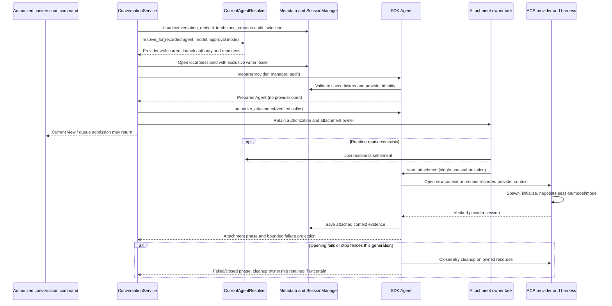

Trace points:

- [ConversationService::start_slot](../../../crates/nessa-server/src/conversation/application/service.rs)
  owns metadata admission, live-slot publication, and the readiness waiter.
- [CurrentAgentResolver](../../../crates/nessa-server/src/composition/current_agent.rs)
  observes managed launch and credentials afresh for cold slots; an already live
  slot retains its existing generation. [Installed launch](../../../crates/nessa-server/src/composition/installed_launch.rs)
  distinguishes ready, missing, unsupported host, and unreadable state.
- [Agent preparation and public controls](../../../crates/nessa-sdk/src/application/agent_execution/agents/agent.rs),
  [attachment orchestration](../../../crates/nessa-sdk/src/application/agent_execution/agents/attachment.rs),
  and [initialization](../../../crates/nessa-sdk/src/application/agent_execution/agents/initialization.rs)
  own generation-bound opening, cancellation, and publication.
- [ACP binding](../../../crates/nessa-sdk/src/infrastructure/acp/sessions/binding.rs),
  [configuration verification](../../../crates/nessa-sdk/src/infrastructure/acp/sessions/configuration.rs),
  and [provider identity](../../../crates/nessa-sdk/src/infrastructure/acp/sessions/identity.rs)
  implement the process/RPC boundary. Local `SessionId`, provider
  `ExecutionSessionId`, and per-submission `ExecutionId` are different identities.

Regression evidence: [startup controls](../../../crates/nessa-sdk/tests/application/agent_execution/agents/initialization/startup_control.rs),
[provider-opening tests](../../../crates/nessa-sdk/tests/application/agent_execution/providers/opening.rs),
[opening diagnostics](../../../crates/nessa-server/tests/conversation/opening_diagnostics.rs),
and [current-agent composition](../../../crates/nessa-server/tests/composition/current_agent.rs).
The composition tests explicitly cover installation refresh, a retained live
generation, missing/rotated credentials, and stop during native resolution.
These include substitutes and executable fixtures, not proof of current vendor service availability.

Bug tracing: for a view stuck at `starting`, distinguish a slot-resolution failure,
readiness wait, SDK attachment wait, and late attachment failure before looking at
model output. `Agent::prepare` success proves local preparation only. A failed
snapshot save must not be mistaken for successful attachment; uncertain cleanup
can keep ownership fenced after a visible failure. The admission
[state/ordering design](../../design/conversation-admission.md) is still labelled
a proposed candidate; use the current code and regression tests above as the
evidence for implemented behavior, not that document's status or intent.

## User flow: the first agent launch is warmed in the background

Warm-up performs a real disposable open and close, without submitting a prompt.
Composition starts preparation after listening. A conversation arriving during
that run joins it rather than launching a second cold warm-up. A warm-up result
is separate from the conversation's own provider result.

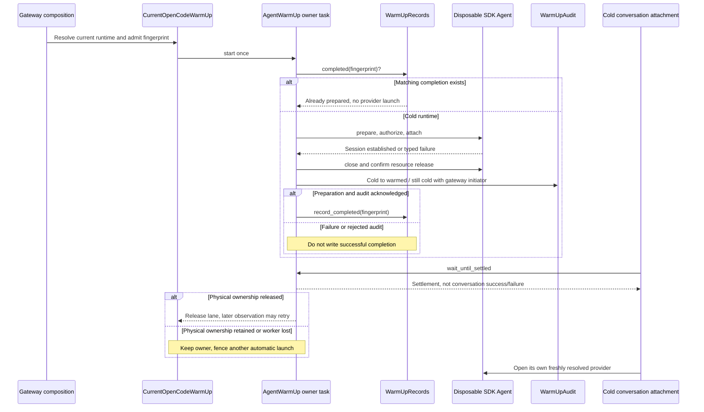

Owners: [AgentWarmUp](../../../crates/nessa-server/src/agent_warm_up/application/service.rs),
[four-part terminal projection](../../../crates/nessa-server/src/agent_warm_up/application/terminal.rs),
[fingerprint](../../../crates/nessa-server/src/agent_warm_up/domain/value_objects/runtime_fingerprint.rs),
[completion records](../../../crates/nessa-server/src/agent_warm_up/infrastructure/records.rs),
and [composition lane/readiness bridge](../../../crates/nessa-server/src/composition/warm_up.rs).
The four facts are preparation effect, launch ownership, audit delivery, and
completion-record delivery. A settled failure is not proof of physical release.
A different OpenCode fingerprint waits for release and then reobserves; it does
not retain a queued credential-bearing provider.

Tests: [warm-up service](../../../crates/nessa-server/tests/agent_warm_up/service.rs)
(`a_caller_arriving_mid_warm_up_joins_it_instead_of_launching_again`,
`cancelling_a_wait_neither_abandons_the_run_nor_starts_a_second`, audit/record
failure and panic cases), [lane interleavings](../../../crates/nessa-server/tests/composition/current_warm_up.rs),
and [failed warm-up versus conversation outcome](../../../crates/nessa-server/tests/conversation/prepared_runtime.rs).

Bug tracing: a missing completion record after successful process cleanup may be
an audit or record-write failure rather than another OS scan failure. The run's
`may_hold_resources` and terminal ownership decide whether another automatic
launch is safe. Do not replace them with an inference from an error string.

## User flow: select a model, approval preset, or reasoning effort

The gateway selects a model when creating a conversation and reopens that
conversation on its recorded model. The SDK's model capabilities and provider
identity are immutable for that Agent. There is no public in-place model switch
in this flow. The client picker is mapped in [chat](chat.md); changing selection
for a new conversation does not migrate another provider's stored context.

Approval presets have an implemented idle-session mutation path. Reasoning effort
has a Rust SDK mutation path for verified Claude/Codex levels; that API's existence
alone does not establish a product RPC or UI control using it.

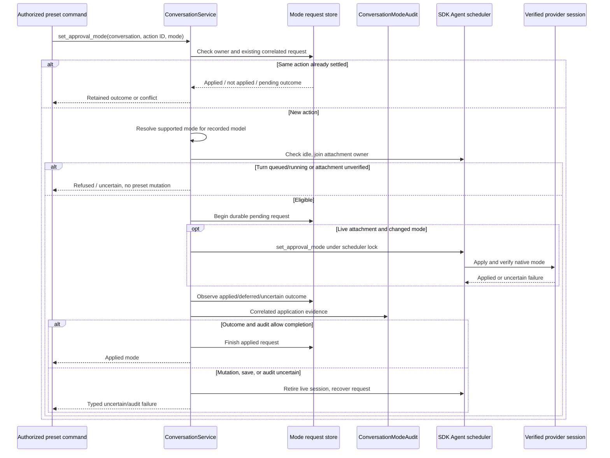

Code: [selection and preset orchestration](../../../crates/nessa-server/src/conversation/application/service.rs),
[mode audit](../../../crates/nessa-server/src/conversation/infrastructure/mode_audit.rs),
[model/mode resolution](../../../crates/nessa-server/src/composition/current_agent.rs),
[SDK mode/effort controls](../../../crates/nessa-sdk/src/application/agent_execution/agents/agent.rs),
and [ACP thought-level verification](../../../crates/nessa-sdk/src/infrastructure/acp/sessions/thought_level.rs).
For effort, catalog levels are narrowed to exact offered agent names; the provider's
reported selected level must match. Requested and applied/refused/failed evidence
is audited on a self-owned task. Queue admission retains the effort at admission.

Evidence: [conversation mode-change tests](../../../crates/nessa-server/tests/conversation/application.rs),
[launch configuration tests](../../../crates/nessa-server/tests/conversation/launch_configuration.rs),
[SDK effort tests](../../../crates/nessa-sdk/tests/application/agent_execution/agents/effort.rs),
and [provider operation-capability tests](../../../crates/nessa-sdk/tests/application/agent_execution/providers/operation_capabilities.rs).
[SDK capability guide](../../../crates/nessa-sdk/docs/agent_execution/agent.md#model-capabilities-and-provider-operations)
labels model-switch reporting, compaction reporting, pre-tool policy enforcement,
policy end-turn/session-close, and explicit permission deferral as
`UnsupportedNotImplemented`. Native question support is negotiated and profile-specific.

Bug tracing: verify metadata selection, provider identity, negotiated mode, and
the correlated mode request together. A lost metadata acknowledgement must not
cause a second provider mutation. A refused or unknown operation capability is
a designed limitation, not evidence that a picker successfully changed a live model.

## User flow: an admitted message streams through the SDK and settles

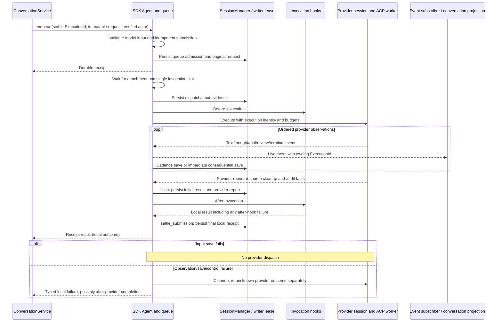

Code: [Agent invocation](../../../crates/nessa-sdk/src/application/agent_execution/agents/agent.rs),
[scheduling](../../../crates/nessa-sdk/src/application/agent_execution/agents/scheduling.rs),
[submission recovery](../../../crates/nessa-sdk/src/application/agent_execution/agents/submissions.rs),
[SessionManager](../../../crates/nessa-sdk/src/application/agent_execution/sessions/manager.rs),
[InvocationHistory agreement validator](../../../crates/nessa-sdk/src/domain/agent_execution/executions/entities/invocation_history.rs),
and [ACP worker](../../../crates/nessa-sdk/src/infrastructure/acp/executions/worker.rs).
The [scheduling guide](../../../crates/nessa-sdk/docs/agent_execution/scheduling.md)
maps FIFO enqueue, priority boundary steering, native injection, withdrawal, and
stable-ID retries. Immediate overlapping `invoke` is `Busy`; immediate invocation
does not have queued-receipt recovery. The gateway is not a second scheduler.

Tests: [queue/retry contracts](../../../crates/nessa-sdk/tests/application/agent_execution/scheduling/retries.rs),
[queue-order conformance](../../../crates/nessa-sdk/tests/application/agent_execution/agents/conformance/queue_order.rs),
[streaming persistence](../../../crates/nessa-sdk/tests/application/agent_execution/agents/streaming_persistence.rs),
and [terminal-settlement regressions](../../../crates/nessa-sdk/tests/application/agent_execution/agents/review_regressions/terminal_settlement.rs).

Bug tracing: provider result, local receipt, observation failure, scheduling
transition, cleanup confirmation, and audit acknowledgement describe different
facts. A provider completion can coexist with a local storage failure. EOF or
an empty event stream is not successful completion. A result future may be ready
before preceding text has been drained. A retry must preserve submission identity
and input; changing either is a new submission or a typed conflict.

## User flow: approve, deny, withdraw, or answer an agent's review

Tool events and permission reviews are correlated to the active execution.
Provider tool names and arguments are untrusted review input. The owning
execution aggregate decides whether a review is live; a detached copy of a
permission request cannot authorize anything.

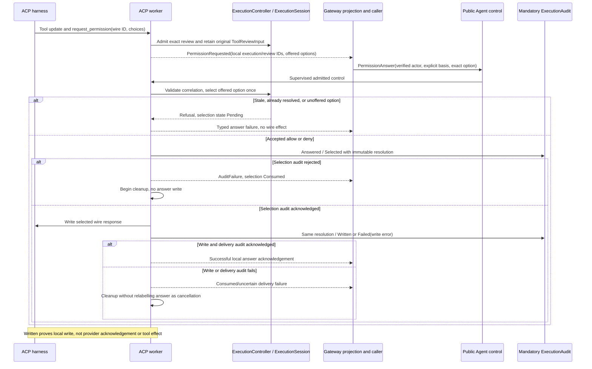

Owners: [PermissionAnswer and selection state](../../../crates/nessa-sdk/src/application/agent_execution/permissions/answer.rs),
[approval attribution](../../../crates/nessa-sdk/src/application/agent_execution/permissions/approval.rs),
[ExecutionController](../../../crates/nessa-sdk/src/application/agent_execution/executions/controller.rs),
[domain execution aggregate](../../../crates/nessa-sdk/src/domain/agent_execution/sessions/aggregates/execution_session.rs),
[permission entity](../../../crates/nessa-sdk/src/domain/agent_execution/permissions/entities/permission_request.rs),
[ACP worker answer/cancellation handlers](../../../crates/nessa-sdk/src/infrastructure/acp/executions/worker.rs),
and [gateway answer/cancel commands](../../../crates/nessa-server/src/conversation/application/service.rs).

The gateway injects [DurableExecutionAudit](../../../crates/nessa-server/src/conversation/infrastructure/audit.rs):
private per-record files, synced file and directory before acknowledgement. This
audit is independent of SDK conversation records and replacement views.
Both allowances and denials preserve provider-session identity, execution/review,
original input, offered option, selected effect/scope, verified actor, and basis.

Provider `$/cancel_request` withdraws only its matching pending permission;
explicit host cancellation retains its verified caller and custom reason.
Teardown seals command admission and drains already admitted answers/cancellations
before bulk cancellation. Dropping the caller's wait does not remove an admitted
decision. Runtime-owned declined-review notices retain selected and later write
stages; they are display evidence rather than a reusable grant or tool outcome.
The Claude binding offers once-only exact-request choices; persistent provider
choices are omitted, and no automatic stored rule engine is shipped here.

Agent-originated form questions use an immutable `AdmittedQuestion` containing
the admitted ask and its session/execution/ID. Answers validate choices against
that ask. This is a separate round trip from permission reviews and from MCP
elicitation; see [question evidence](../../../crates/nessa-sdk/src/application/agent_execution/executions/question.rs)
and [question/refusal values](../../../crates/nessa-sdk/src/domain/agent_execution/questions/value_objects/refusal.rs).
Question support is verified
for the pinned Claude profile with tools enabled; current Codex/OpenCode profiles
do not offer it.

Question-answer acknowledgement ordering (R3 correction design, before code):
the provider owns question consumption; the client owns whether a failed
command offers replay. A failed control preserves its conversation, execution,
and action IDs, and requires a current read followed by any new deliberate
answer. It does not recover a question-answer receipt.

| State / event ordering | Owning decision and intended observation | Regression evidence |
| --- | --- | --- |
| Offered ask; answer acknowledged | Provider validates and consumes exact ask; client returns correlated mutation acknowledgement. | Client question-answer acknowledgement test; SDK ACP question round trip. |
| Provider consumes answer; acknowledgement lost | Client returns uncertain `NessaConversationControlError`, retaining conversation/execution/action IDs and exposing no replay. Read shows closed ask; no second answer is sent. | Client lost-question-answer test; SDK consumed-question rejection. |
| Answer never reaches provider; response lost | Client still reports uncertain control with no replay because it cannot infer consumption. Read shows offered ask; a new deliberate answer uses a new action ID. | Client lost-question-answer test (before-consumption case). |
| Provider refuses before dispatch | Existing shared typed control refusal owner reports `uncertain: false`, preserving the action identity; no replay is offered. | Client question-answer typed-refusal test. |
| A correlated success reply is malformed/mismatched | Shared acknowledgement validator rejects it; outcome stays uncertain with no replay. | Client question-answer mismatched acknowledgement test. |

Tests: [allow/deny and audit/write interleavings](../../../crates/nessa-sdk/tests/infrastructure/acp/contracts/permissions/answers.rs),
[review cancellation and local declines](../../../crates/nessa-sdk/tests/infrastructure/acp/contracts/permissions.rs),
[domain permission authority](../../../crates/nessa-sdk/tests/domain/agent_execution/permissions/authority.rs),
[question admission/answers](../../../crates/nessa-sdk/tests/application/agent_execution/executions/questions.rs),
and [gateway audit](../../../crates/nessa-server/tests/conversation/audit.rs).
Answer tests include `close_cannot_overtake_an_admitted_answer`, dropped waiters,
bounded stalled audit, selection rejection, wire failure, and independent failures
retaining both ordering and confirmed physical cleanup.

Bug tracing: reload authoritative review state using the typed `selectionState`
(`Pending`, `Consumed`, or `Unknown`), not a diagnostic string. A consumed answer
with a failed response must not be resubmitted as a new tool execution. To explain
an allow/deny mismatch, correlate session + execution + review + offered option
and read the paired audit stages. An audit file or snapshot alone does not prove
the provider performed the tool.

## User flow: an MCP tool shares its upstream session with its app

Configured server commands belong to trusted composition. A tool call cannot
choose a new executable. Composition replaces each server entry supplied to
the harness with `nessa mcp-relay`. Each provider open receives a fresh grant;
its bearer token is carried in the stand-in environment, not printed in traces.

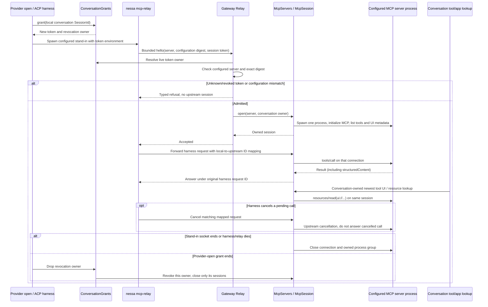

Owners: [MCP composition](../../../crates/nessa-server/src/composition/mcp_servers.rs),
[grants](../../../crates/nessa-server/src/mcp_servers/infrastructure/grants.rs),
[relay admission](../../../crates/nessa-server/src/mcp_servers/infrastructure/relay.rs),
[ACP stand-in grant retention](../../../crates/nessa-sdk/src/infrastructure/acp/sessions/stand_ins.rs),
[SDK session owner](../../../crates/nessa-sdk/src/infrastructure/mcp/servers.rs),
[request/answer cancellation](../../../crates/nessa-sdk/src/infrastructure/mcp/connection.rs),
[stand-in forwarding](../../../crates/nessa-sdk/src/infrastructure/mcp/stand_in.rs),
and [MCP process lifecycle](../../../crates/nessa-sdk/src/infrastructure/mcp/process.rs).
The relay hello is limited to 4,096 bytes and five seconds. A resumed provider
open gets a new grant. Revocation racing opening cannot leave a surviving session
under that grant. Two conversations do not share their MCP session.

The [MCP connections design/state tables](../../design/mcp-connections.md)
describe this implemented lifecycle. [UI lookup adapter](../../../crates/nessa-server/src/mcp_servers/infrastructure/tool_uis.rs)
and [tool MCP value](../../../crates/nessa-sdk/src/domain/agent_execution/tools/value_objects/mcp.rs)
feed the gateway-owned app calls below. The [extensions UI map](extensions-ui.md)
tracks the host boundary: these backend APIs are implemented, while the app
renderer, sandbox, and mount lifecycle integration remain absent.

Tests: [gateway grants/relay](../../../crates/nessa-server/tests/mcp_servers/mod.rs),
[SDK session isolation/revocation](../../../crates/nessa-sdk/tests/infrastructure/mcp/sessions.rs),
[forwarding and cancellation](../../../crates/nessa-sdk/tests/infrastructure/mcp/stand_in.rs),
[protocol bounds](../../../crates/nessa-sdk/tests/infrastructure/mcp/protocol.rs),
and [real local process fixtures](../../../crates/nessa-sdk/tests/infrastructure/mcp/process.rs).
These cover revoked-before/during-open, out-of-order tool-list replies, list refresh,
hidden tools refused before invocation, cancelled calls, repeated concurrent close,
and a stand-in's end stopping the server and descendants. The Python fixture is
a local protocol/process test, not a live third-party MCP service.

Bug tracing: a missing app can be a token refusal, config digest mismatch,
failed upstream launch/initialize/list, a hidden tool, stale list, closed owner,
or absent `_meta.ui`. Check the conversation-owned session before blaming the
renderer. Resource subscriptions are deliberately refused by the stand-in. A
request timeout sends cancellation upstream and can leave the connection usable;
an oversized/non-JSON frame terminates the session instead.

## User flow: an app calls a tool through gateway policy and review

PR [#377](https://github.com/nessalabs/nessa-agent/pull/377) implements the backend
half of app interactions. An app reference binds an execution, tool, and mount
instance; it is not permission to choose another server. The gateway checks
conversation ownership/write access, finds the originating tool in the current
projection, requires its UI metadata, and checks the target's app visibility on
the same conversation-owned upstream session. Destructive hints always require
a gateway-owned review, independently of the conversation approval mode.

| Entry point | Implemented authority and outcome |
| --- | --- |
| `mcp.callTool` | Same-server visible target, object arguments at most 32 KiB; gateway policy/refusal, optional review, and completion audit. Returns MCP result JSON at most 56 KiB; `isError: true` is a tool answer. |
| `conversation.answer` / `conversation.cancel` | Routes gateway app reviews before SDK reviews. App-origin reviews offer allow-once/deny-once and expire after five minutes. Exact execution/review identities are required. |
| `mcp.readResource` | Same originating app/server and validated `ui://` URI; one upstream read, resource metadata, and a single-use bearer ticket for held HTML bytes. |
| `GET /mcp-resources` | `x-nessa-resource-ticket` authorizes redemption without a second HTTP authentication step; trusted-origin check, one consumption, and redemption audit precede bytes. |
| `mcp.releaseApp` | Idempotently withdraws current waiting reviews and releases current unredeemed tickets for the exact mount; no permanent mount revocation or provider close. |

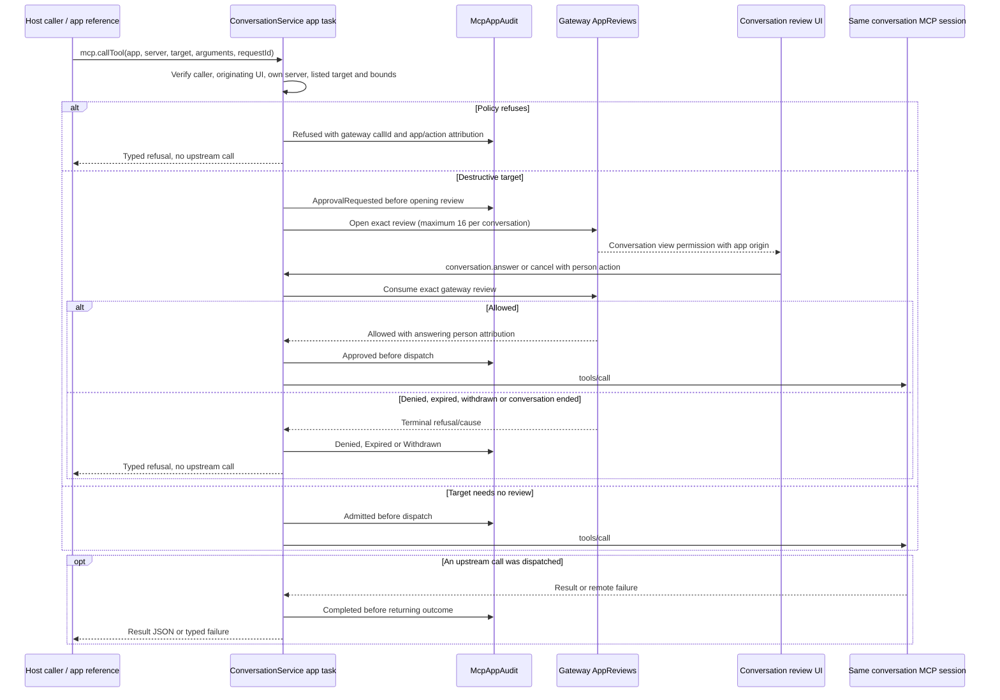

A gateway-generated call ID correlates phases separately from the caller's
request/action ID. Failure to record a pre-dispatch phase prevents that step;
a completion-audit failure can occur after the upstream effect. The socket lane has four slots; each owned service task retains one of 32
gateway-wide slots until it ends.
Caller disappearance withdraws a waiting review, preserving an answer that won
the race; an already dispatched call retains its completion/audit task. The
client does not automatically replay app calls and reports ambiguous outcomes
as uncertain errors.

Owners: [wire dispatch](../../../crates/nessa-server/src/product/mcp_apps.rs),
[app calls and audit ordering](../../../crates/nessa-server/src/conversation/application/service/app_calls.rs),
[policy](../../../crates/nessa-server/src/mcp_servers/domain/app_call.rs),
[review consumption and expiry](../../../crates/nessa-server/src/conversation/application/app_reviews.rs),
[same-session adapter](../../../crates/nessa-server/src/mcp_servers/infrastructure/apps.rs),
and [client API/error contract](../../../packages/nessa-client/src/presentation/mcp-apps-api.ts).
Tests: [app policy, review, cancellation, bounds and audit failure](../../../crates/nessa-server/tests/conversation/app_calls.rs),
[review identity](../../../crates/nessa-server/tests/conversation/app_reviews.rs),
[app audit](../../../crates/nessa-server/tests/conversation/mcp_app_audit.rs),
and [client calls](../../../packages/nessa-client/src/presentation/mcp-apps-api.test.ts).

## User flow: read an app resource once and release its ticket

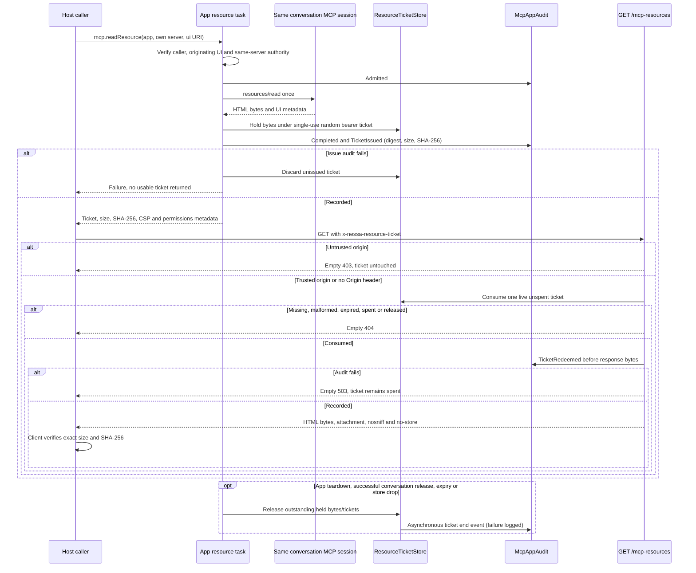

Tickets expire after 60 seconds. Per conversation, the store holds at most 64
tickets and 16 MiB; individual UI HTML is bounded to 4 MiB by the SDK resource
parser. Only ticket digests enter audit/storage. `HEAD` never redeems a ticket.
A successful response uses `text/html;profile=mcp-app`; the client fetch checks
length/digest and does not automatically retry redemption. Redemption awaits
audit without its own deadline. Expiry/release already frees bytes even if its
asynchronous audit event fails, so an end audit is not a guaranteed durable
cleanup receipt. These tickets are distinct from attachment/download tickets.

Owners: [ticket port and limits](../../../crates/nessa-server/src/conversation/application/mcp_apps.rs),
[ticket store and release sweeper](../../../crates/nessa-server/src/mcp_servers/infrastructure/resource_tickets.rs),
[HTTP redemption](../../../crates/nessa-server/src/mcp_servers/entrypoint/http.rs),
and [SDK UI resource parser](../../../crates/nessa-sdk/src/domain/mcp_apps/value_objects/ui_resource.rs).
Tests: [ticket consumption and release](../../../crates/nessa-server/tests/mcp_servers/resource_tickets.rs),
[HTTP origin, redemption and audit](../../../crates/nessa-server/tests/mcp_servers/http.rs),
and [resource issue/audit failure](../../../crates/nessa-server/tests/conversation/app_calls.rs).
Bug tracing: distinguish a policy refusal, waiting app-origin review, upstream
failure, issue-audit failure, spent ticket, fetch digest failure, and the currently
absent renderer. A lost response after dispatch/redemption requires reading the
correlated audit; replay can repeat a tool effect or spend a different ticket.

## User flow: install or replace a pinned agent runtime

This is explicit installation of Nessa's tested pin, not agent self-update.
Both `nessa install-agent` and the authenticated product install command reach
the same use case. A launch resolves the current pin through the runtime store;
the path printed by installation is a report, not a durable future launch handle.

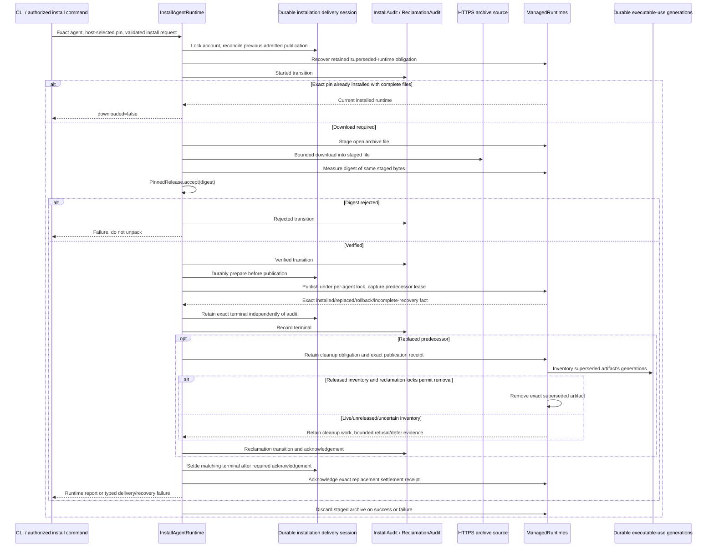

Owners: [install use case](../../../crates/nessa-server/src/agent_install/application/install.rs),
[release selection](../../../crates/nessa-server/src/agent_install/domain/release_selection.rs),
[pin acceptance](../../../crates/nessa-server/src/agent_install/domain/value_objects/pinned_release.rs),
[install transition state machine](../../../crates/nessa-server/src/agent_install/domain/entities/install_attempt.rs),
[delivery journal](../../../crates/nessa-server/src/agent_install/infrastructure/delivery/journal.rs),
[runtime store](../../../crates/nessa-server/src/agent_install/infrastructure/managed_runtimes.rs),
and [retained reclamation](../../../crates/nessa-server/src/agent_install/application/reclamation.rs).
For the full artifact layout, hashing, unpacking, locks, and failure table, see
[ADR 173](../../adr/done/173-fetch-agent-runtimes.md) and the
[runtime structure map](../../codebase-structure.md#installing-an-agent-runtime).

Managed spawn couples executable path to use authority. A bounded durable use
generation is admitted before process creation. It is released only after
confirmed no-spawn or process-tree cleanup; a dropped guard does not authorize
removing its artifact. Publication/reclamation rechecks the current artifact and
requires complete released-generation evidence. Runtime existence on disk cannot
invent a missing terminal publication fact after a crash.

Tests: [install ordering/failure](../../../crates/nessa-server/tests/agent_install/install.rs),
[publication delivery identity](../../../crates/nessa-server/tests/agent_install/publication_delivery.rs),
[durable delivery](../../../crates/nessa-server/tests/agent_install/delivery.rs),
[managed runtime store](../../../crates/nessa-server/tests/agent_install/managed_runtimes.rs),
[reclamation](../../../crates/nessa-server/tests/agent_install/reclamation.rs),
[runtime reclamation domain](../../../crates/nessa-server/tests/agent_install/runtime_reclamation.rs),
and [SDK executable-use cleanup](../../../crates/nessa-sdk/tests/infrastructure/acp/sessions/executable_use_cleanup.rs).

Bug tracing: distinguish download/hash refusal, store publication failure,
rollback/incomplete recovery, terminal retention, audit acknowledgement,
reclamation receipt, and settlement failure. A new artifact can be installed
while the command still fails to acknowledge delivery. Retrying audit alone
must not repeat download/publication/rollback. Retained predecessor files can be
intentional while a process still owns them; file existence is not permission
to launch that superseded pin.

## User flow: Stop cancels owned work and confirms process cleanup

The product Stop command is conversation close. Closing a tab normally detaches
its view. The panel also closes a proven-empty remote conversation when its
current view is idle and has no pending work, to release staged uploads; a tab
with history, work, or no current remote view does not take that cleanup path.
See [chat tab lifecycle](chat.md) and
[the closeTab owner](../../../src/conversation/adapters/store/slice.ts).
The SDK close fences queued/active work and the current
attachment generation; the provider's physical cleanup is a distinct outcome.

| User action | Owned runtime and retained data effect |
| --- | --- |
| Detach/close a tab | Normally detach the view; provider work can continue. The panel additionally closes a proven-empty remote idle conversation with no pending work to release uploads. |
| Stop / `conversation.close` | Stop admitted work and close the provider attachment; retain conversation ownership and committed history for later reopen. Attachment hold release has its own result. |
| Archive | Change list visibility; no process stop or history erasure. A new message can unarchive it. |
| Delete | Persist a tombstone to fence commands; stop owned work; ask the recorded agent to dispose of its private session; audit and erase SDK history, uploads, and summary. Retain ownership/tombstone and audit evidence. Incomplete erasure is retried. |

Provider-session disposal reports the binding's actual outcome: deleted,
archived, acknowledged, not listed, unsupported, or no handler. An archived
provider session is not claimed erased. A supported but currently unconfigured
agent leaves deletion unfinished; an unknown agent has a distinct no-handler
outcome. See [provider-session registry](../../../crates/nessa-server/src/conversation/application/provider_sessions.rs),
[binding adapter](../../../crates/nessa-server/src/conversation/infrastructure/provider_sessions.rs),
and [deletion ADR](../../adr/done/182-conversation-deletion.md).

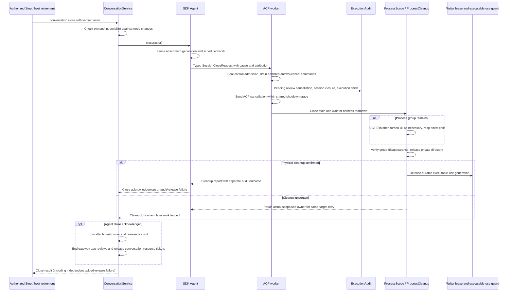

Owners: [Agent lifecycle](../../../crates/nessa-sdk/src/application/agent_execution/agents/lifecycle.rs),
[ACP worker teardown](../../../crates/nessa-sdk/src/infrastructure/acp/executions/worker.rs),
[ProcessScope](../../../crates/nessa-sdk/src/infrastructure/process.rs),
[retained cleanup owner](../../../crates/nessa-sdk/src/infrastructure/acp/sessions/cleanup.rs),
[close report types](../../../crates/nessa-sdk/src/application/agent_execution/providers/close.rs),
and [gateway close/retirement](../../../crates/nessa-server/src/conversation/application/service.rs).
The [transport guide](../../../crates/nessa-sdk/docs/agent_execution/transport.md#streaming-permission-and-close-contracts)
details write/startup/execution/grace/kill/audit deadlines. Prompt timeout defaults
to none; elapsed time or quiet output alone does not diagnose a stuck agent.
Injected clocks govern protocol deadlines; OS exit/reaping waits use real time.

Repeated close retries retained cleanup before restoration is permitted. A
later execution can resume the same provider context only after cleanup and
capability verification. Unsupported resume or missing provider history fails
explicitly instead of replaying old prompts into a new context. A known completed
provider result can win a race with close without being rewritten as cancelled.
Audit failure remains visible even when physical process cleanup succeeded.

Drop triggers supervised retry with bounded backoff, retaining the writer lease
and actual process/use target as necessary. The host must keep Tokio alive until
cleanup completes. Runtime shutdown is not proof that an external process stopped.

Tests: [process scope](../../../crates/nessa-sdk/tests/infrastructure/process.rs),
[automatic cleanup conformance](../../../crates/nessa-sdk/tests/application/agent_execution/agents/conformance/automatic_cleanup.rs),
[local cancellation](../../../crates/nessa-sdk/tests/application/agent_execution/agents/conformance/local_cancellation.rs),
[cleanup audit regressions](../../../crates/nessa-sdk/tests/application/agent_execution/agents/review_regressions/cleanup_audit.rs),
[first-stop ordering](../../../crates/nessa-sdk/tests/application/agent_execution/agents/coordination/first_stop.rs),
and [gateway retirement](../../../crates/nessa-server/tests/conversation/retirement.rs).

Nessa's own MCP shell tool has an additional lifecycle inside the MCP process.
[ShellService](../../../crates/nessa-mcp/src/shell/application/service.rs) records
admission before the runner starts; [ShepherdRunner](../../../crates/nessa-mcp/src/shell/infrastructure/runner.rs)
uses an owned process scope, explicit stop/deadline, cleanup confirmation, and
separate stdout/stderr closure checks before building its result. Completion
audit failure is retained in the result. [MCP shutdown](../../../crates/nessa-mcp/tests/mcp/shutdown.rs)
and [runner tests](../../../crates/nessa-mcp/tests/shell/infrastructure/runner.rs)
cover this inner layer. Provider-native shell/file tools are provider-owned.

Bug tracing: a cancelled receipt, terminated direct child, successful audit, and
released artifact-use generation are not interchangeable. Check the owned group,
private-directory cleanup, use-release acknowledgement, and separate audit report.
For incomplete shell output, inspect both pipe closure and output errors even
when the shell exit code is available.

## User flow: restart and restore committed conversation history

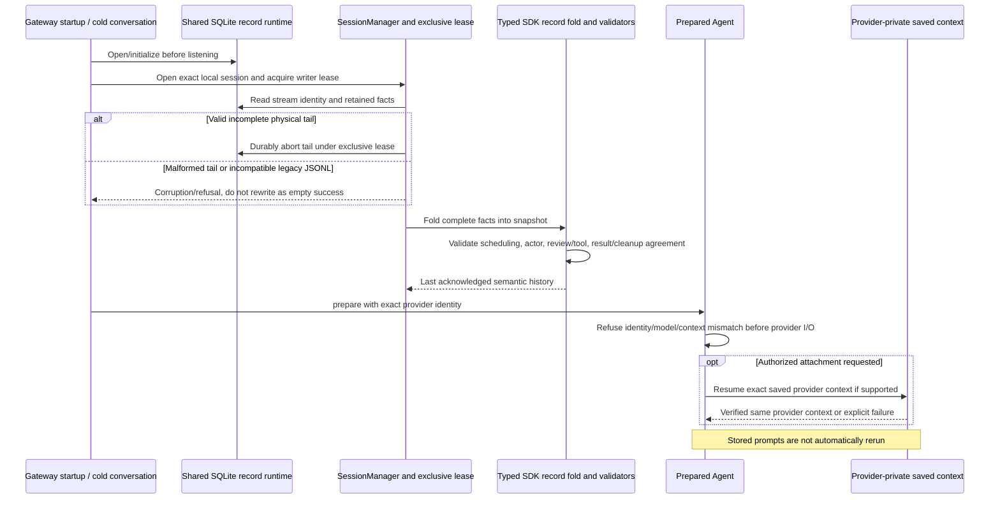

Owners: [RecordStorage](../../../crates/nessa-sdk/src/infrastructure/session_storage/record.rs),
[generation-aware writer](../../../crates/nessa-sdk/src/infrastructure/session_storage/record_writer.rs),
[physical fact framing](../../../crates/nessa-sdk/src/infrastructure/session_storage/stream_fact.rs),
[semantic snapshot fold](../../../crates/nessa-sdk/src/infrastructure/session_storage/snapshot/semantic.rs),
[restoration validation](../../../crates/nessa-sdk/src/application/agent_execution/sessions/validation.rs),
and [gateway runtime composition/shutdown](../../../crates/nessa-server/src/composition/root.rs).
[Semantic writer design](../../design/semantic-record-writer.md) owns physical
framing; the [Agent storage guide](../../../crates/nessa-sdk/docs/agent_execution/agent.md#session-manager-and-storage)
owns application semantics. Conversation ownership, selection, summaries,
tombstones, and receiver authority are in the separate
[metadata schema](../../../crates/nessa-server/src/conversation/infrastructure/schema.sql).

Live text/thoughts reach subscribers immediately. The first unsaved message starts
a fixed 100 ms deadline; 16 KiB of message payload or 64 message observations
flush earlier. Tool/review/terminal/settlement boundaries save accumulated messages
immediately. These are local SDK commit thresholds, not socket page limits.
Text since the last successful commit can be lost on crash. A failed save is not
returned by `SessionManager::snapshot` as committed.

Save generations let a retry acknowledge an already physically completed write
without duplicating it after a lost answer. Independent later equal observations
have different generations. Reset changes incarnation and reconciles uncertain
erase before another load/save. Gateway deletion tombstones block commands while
unfinished erasure is retried; empty replacement state alone does not prove all
old bytes were erased. Deletion UI and attachment release are mapped elsewhere.

Tests: [record storage restart/lease/reset and source access](../../../crates/nessa-sdk/tests/infrastructure/session_storage.rs),
[streaming cadence and save failures](../../../crates/nessa-sdk/tests/application/agent_execution/agents/streaming_persistence.rs),
[provider restoration](../../../crates/nessa-sdk/tests/application/agent_execution/agents/review_regressions/provider_restoration.rs),
and [gateway deletion recovery](../../../crates/nessa-server/tests/conversation/deletion.rs).
Additional physical writer/source regressions live with
[record writer](../../../crates/nessa-sdk/src/infrastructure/session_storage/record_writer.rs)
and [record source](../../../crates/nessa-sdk/src/infrastructure/session_storage/record_source.rs).

Bug tracing: compare local session, stream incarnation/schema, provider identity,
provider context, committed head, and scheduling evidence. Missing local settlement
does not establish provider success, cancellation, or a replayable input. Audit
is independent durable evidence; a UI view is a bounded projection, not an audit
store or portable provider history.

## User flow: an authorized receiver reads physical history without opening an agent

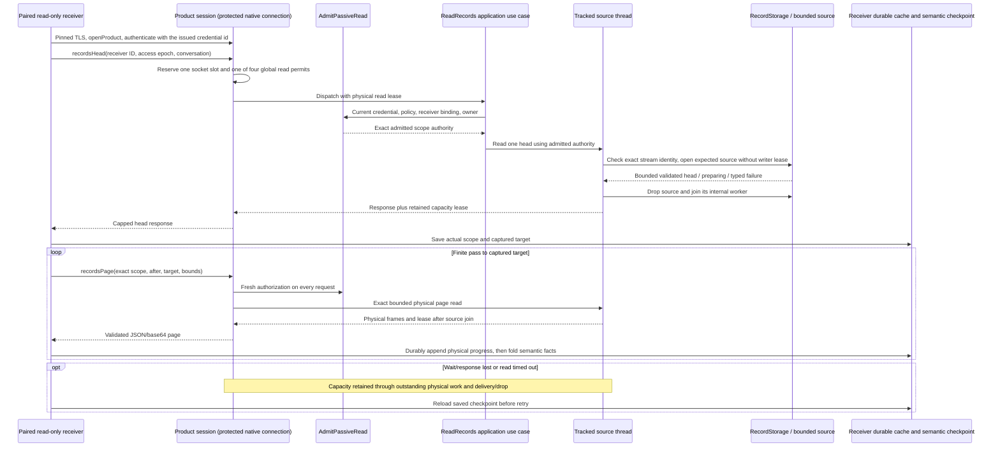

Owners: [passive admission](../../../crates/nessa-server/src/conversation/application/passive_read.rs),
[record read application](../../../crates/nessa-server/src/conversation/application/record_read/read.rs),
[tracked read source](../../../crates/nessa-server/src/conversation/infrastructure/record_read/source.rs),
[physical operation](../../../crates/nessa-server/src/conversation/infrastructure/record_read/operation.rs),
[socket capacity](../../../crates/nessa-server/src/product/socket.rs),
[product dispatch](../../../crates/nessa-server/src/product/record_read/dispatch.rs),
[page codec](../../../crates/nessa-server/src/product/record_read/wire.rs),
and [SDK physical source](../../../crates/nessa-sdk/src/infrastructure/session_storage/record_source.rs).
This path opens no Agent, provider process, or writer lease. Its thread joins the
SDK source worker before storage shutdown. Timeout delivery does not admit another
read while the original physical work still owns the socket/global lease.

The SDK source can page up to 64 records and 512 KiB; the product transport is
stricter: 16 records, 65,546 physical/page payload bytes, and 131,072 encoded response
bytes, from [generated product constants](../../../crates/nessa-server/src/product/generated.rs)
and their owner [product schema](../../../protocol/product/v1.json). Use the
smaller applicable ceiling. The one-per-socket and four-global permit owners are
[socket](../../../crates/nessa-server/src/product/socket.rs) and
[route state](../../../crates/nessa-server/src/product/state.rs).

Tests: [fresh receiver authorization](../../../crates/nessa-server/tests/conversation/passive_read.rs),
[physical scope and worker cleanup](../../../crates/nessa-server/tests/conversation/record_read/source.rs),
[gateway session protocol](../../../crates/nessa-server/tests/read_only_sync/gateway/session.rs),
[deadline streams](../../../crates/nessa-server/tests/read_only_sync/gateway/deadline_stream.rs),
[durable cache](../../../crates/nessa-server/tests/read_only_sync/infrastructure/cache.rs),
[protected native sessions](../../../crates/nessa-server/tests/device_pairing/infrastructure/protected.rs)
and [end-to-end receiver processes](../../../crates/nessa-server/tests/composition/read_only_online.rs).
Socket capacity/wire-boundary regressions also live in the owning socket/codec files.

The [authorized reads design](../../design/authorized-record-reads.md) is marked
implemented; its historical baseline/proposal wording must be read against current
code. The [read-only receiver design](../../design/read-only-sync-example.md)
and [receiver implementation](../../../crates/nessa-server/src/read_only_sync/mod.rs)
cover retained checkpoints. Downloaded physical position and applied semantic
position are different facts. The receiver pairs through native device
pairing and reads over the protected native channel
([device pairing slice 3](../../design/auth/device-pairing.md#protected-reads-over-the-native-channel-slice-3));
automatic device discovery and writable cross-device collaboration are outside
this read-only path.

Bug tracing: distinguish `source_preparing`, identity change, pruned history,
oversized record/response, stale receiver epoch, wrong owner/receiver, and read
timeout. A preparing source is not an empty conversation. Fresh authorization
can reject a later page after an earlier head was allowed. Do not call physical
download completion semantic application completion.

## Verified feature history

These are PR links established by local merge/squash history or an existing
implemented design's explicit PR link. Issue/ADR numbers are not promoted to PR
numbers. Commit links preserve the evidence when a PR groups several features.

| Implemented area | Verified feature PRs | Local history evidence |
| --- | --- | --- |
| SDK-owned startup/attachment admission | [#164](https://github.com/nessalabs/nessa-agent/pull/164), [#166](https://github.com/nessalabs/nessa-agent/pull/166) | Merge commits `ede5bab2`, `3fa4006b` |
| Managed launch, publication recovery, cleanup | [#167](https://github.com/nessalabs/nessa-agent/pull/167), [#178](https://github.com/nessalabs/nessa-agent/pull/178), [#183](https://github.com/nessalabs/nessa-agent/pull/183) | Merge commits `f333b96c`, `450a9a42`, `e95a775f` |
| Current OpenCode launch/readiness and warm-up | [#185](https://github.com/nessalabs/nessa-agent/pull/185) | Merge `ea2ec4a9`; includes current-generation warm-up changes |
| Native Claude/Codex on-demand installation; install outcomes | [#242](https://github.com/nessalabs/nessa-agent/pull/242), [#246](https://github.com/nessalabs/nessa-agent/pull/246) | Merges `cac640d7`, `7b0a40c0`; ADR **issue 173**, outcome **issues 244/245** |
| Per-conversation model/approval configuration and verified presets | [#236](https://github.com/nessalabs/nessa-agent/pull/236), [#237](https://github.com/nessalabs/nessa-agent/pull/237), [#240](https://github.com/nessalabs/nessa-agent/pull/240) | Merges `d7a2b83d`, `9f489f6f`, `03d40a91`; **issues 231/239** |
| Question round trip and immutable admitted-ask evidence | [#215](https://github.com/nessalabs/nessa-agent/pull/215), [#241](https://github.com/nessalabs/nessa-agent/pull/241) | Merges `2d034361`, `ff30ad35`; evidence hardening **issue 228** |
| Reasoning effort through verified Claude/Codex sessions | [#314](https://github.com/nessalabs/nessa-agent/pull/314) | Squash `48f3c00e`; follow-up semantics **issue 313** |
| Semantic record storage and bounded streaming commits | [#290](https://github.com/nessalabs/nessa-agent/pull/290), [#299](https://github.com/nessalabs/nessa-agent/pull/299) | Squashes `9d75a88c`, `4bc780f0`; streaming **issue 294** |
| SDK physical source and bounded terminal discovery | [#293](https://github.com/nessalabs/nessa-agent/pull/293), [#319](https://github.com/nessalabs/nessa-agent/pull/319) | Squash `2a143d7c`, merge `24a1fe57`; discovery **issue 315** |
| Authorized product reads and durable receiver | [#300](https://github.com/nessalabs/nessa-agent/pull/300), [#354](https://github.com/nessalabs/nessa-agent/pull/354) | Explicit PR links in authorized-reads design; squash `c2f3b0ec`; reads **issue 296**, admission **issue 295** |
| Gateway MCP client and structured tool identity/results | [#363](https://github.com/nessalabs/nessa-agent/pull/363), [#355](https://github.com/nessalabs/nessa-agent/pull/355) | Merge `cd092666`, squash `1bf01c87`; MCP client **issue 346**, ADR **344** |
| Conversation-keyed MCP grant lifecycle | [#367](https://github.com/nessalabs/nessa-agent/pull/367), [#372](https://github.com/nessalabs/nessa-agent/pull/372) | Squashes `25ed89d8`, `e927378f`; grant work **issue 348**, part a only |
| Gateway app policy, reviews, audit and resource tickets | [#377](https://github.com/nessalabs/nessa-agent/pull/377) | Squash `e3fe8cf8`; **issue 348**, part b; renderer still absent |
| Shell output closure | [#307](https://github.com/nessalabs/nessa-agent/pull/307) | Squash `7da63127` |

Inspect [mapped checkout commit](https://github.com/nessalabs/nessa-agent/commit/e3fe8cf8),
[MCP grant introduction](https://github.com/nessalabs/nessa-agent/commit/25ed89d8),
[record transport introduction](https://github.com/nessalabs/nessa-agent/commit/c2f3b0ec),
and [streaming commit introduction](https://github.com/nessalabs/nessa-agent/commit/4bc780f0).
No remote PR status was queried for this mapping pass.

## Bug-oriented verification notes and exclusions

| Classification | Finding / investigation trigger | Evidence and next boundary |
| --- | --- | --- |
| Confirmed documentation mismatch, not a runtime defect | The Agent guide introduction says the TypeScript client does not yet expose chat RPCs, while current gateway/architecture implement conversation commands. | Compare [Agent guide](../../../crates/nessa-sdk/docs/agent_execution/agent.md) with [product conversation dispatch](../../../crates/nessa-server/src/product/conversation.rs) and [gateway chat](../../guides/gateway-chat.md). Use code/current gateway contract for this map. |
| Designed limitation | Crash can lose text since the last successful bounded cadence commit. | [Message clock](../../../crates/nessa-sdk/src/application/agent_execution/sessions/message_commit_clock.rs) and streaming-persistence tests; inspect committed versus live projection. |
| Designed limitation | Stored prompts are not portable context and are not automatically replayed; missing/unsupported resume refuses continuation. | Provider identity, attachment restoration, and provider-restoration tests. |
| Designed limitation | Persistent permission grants, an automatic rule evaluator, in-place model-switch reporting, and MCP resource subscriptions are unavailable on these paths. | SDK capability/permission guide and MCP stand-in tests. |
| Hypothesis to investigate, not reproduced | A retained warm-up owner may explain later cold-open delay after apparent warm-up failure. | Inspect terminal launch ownership and current-warm-up uncertain-cleanup test before changing readiness handling. |
| Hypothesis to investigate, not reproduced | Lost permission answer acknowledgement could leave a consumed review while a client still shows its action. | Inspect typed selection state, paired Selected/Written/Failed audit, current view, and answer interleavings; do not resend a tool. |
| Confirmed client defect, corrected in this change | `answerQuestion` previously exposed mutation replay after a lost acknowledgement although the provider consumes the exact ask without same-action receipt recovery. It now uses the existing shared control contract: typed uncertainty, retained action/execution identity, no replay, and current-view reconciliation before a new deliberate action. | [Client regression cases](../../../packages/nessa-client/src/presentation/conversation-api.test.ts) failed before the fix (three cases returned `NessaConversationMutationError`) and pass after it; the full conversation suite passes 71 tests. [Shared control error owner](../../../packages/nessa-client/src/application/conversation-mutation-error.ts) and [ACP consumption](../../../crates/nessa-sdk/src/infrastructure/acp/executions/worker.rs). Lost acknowledgements are injected at the real client requester seam; no live vendor/network-fault reproduction claimed. |
| Hypothesis to investigate, not reproduced | A superseded artifact remaining on disk might be a correct retained-use obligation or failed release/settlement recovery. | Correlate publication preparation, exact terminal/receipt, executable-use generations, and reclamation audit. |
| Hypothesis to investigate, not reproduced | A missing MCP app may originate in conversation grant/list lifecycle before rendering. | Correlate token owner, configuration digest, session-owned tools list and resource lookup; see extensions UI map for downstream host behavior. |
| Hypothesis to investigate, not reproduced | Receiver timeout may retain capacity because physical source work has not joined. | Tracked source/lease and cancellation tests; capacity must not be freed from timeout response alone. |

The original map used source, test-definition, design, and local Git-history
tracing. The R3 correction subsequently ran the real client regression suite:
71 conversation tests pass; the broader client suite passes 507 of 509 in the
filesystem sandbox, and its two filesystem privacy failures pass all 39 targeted
cases with real ownership metadata outside that sandbox. Client typechecking and
changed-file formatting also pass. The focused SDK library test
`a_question_reaches_a_host_and_its_answer_reaches_the_agent` also passes: a real
local ACP fixture receives the accepted content, a second answer of the same
ask is refused, and the audit retains exactly its Selected/Written pair. This
executes SDK/provider process/audit layers; the client loss test substitutes its
requester, so a combined client → gateway → provider lost-ack run remains
unverified. Other linked tests remain inspectable
definitions unless explicitly reported here. Live vendor calls, installation
downloads, restart/crash experiments, and user-visible/network-fault reproductions
were not run. No defect is claimed from the remaining hypotheses above. Browser/UI behavior,
attachment conversion and upload, desktop service supervision/update, credentials
entry, remote provisioning/TLS, writable collaboration, and future provider/tool
hook proposals belong to other maps or unimplemented scope. Only this Markdown
file is owned by this mapping task.
