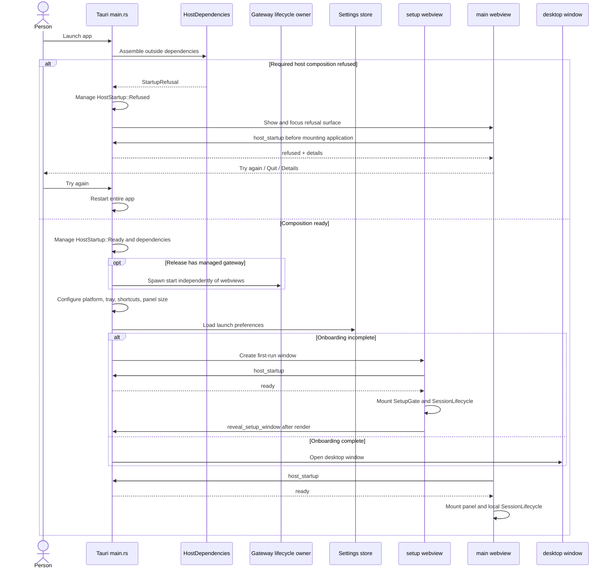
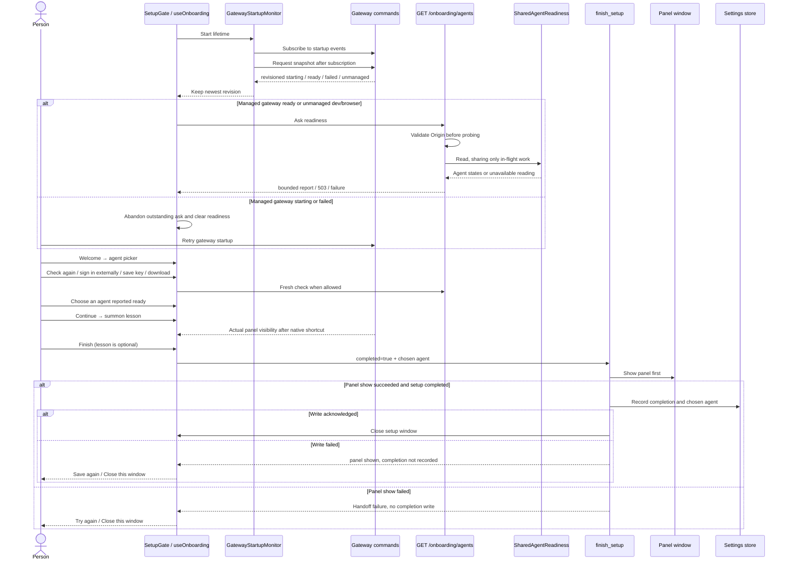
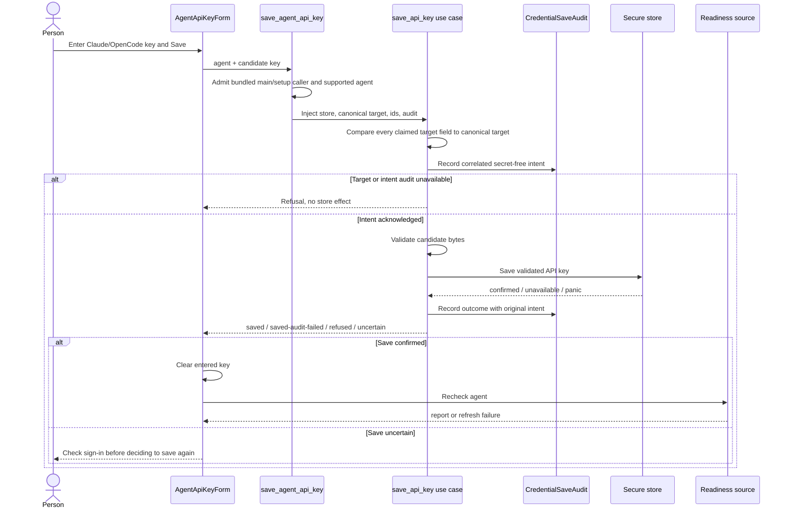
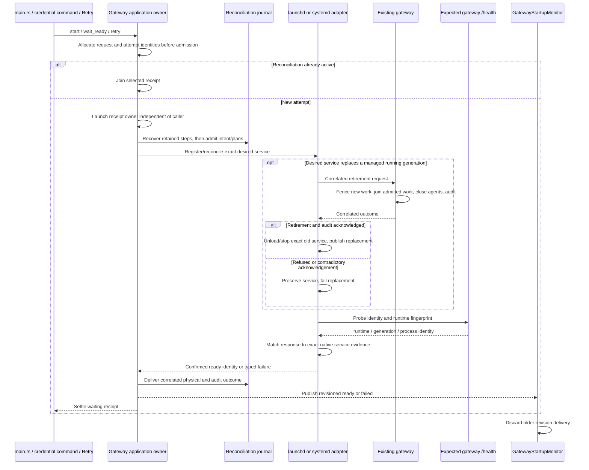
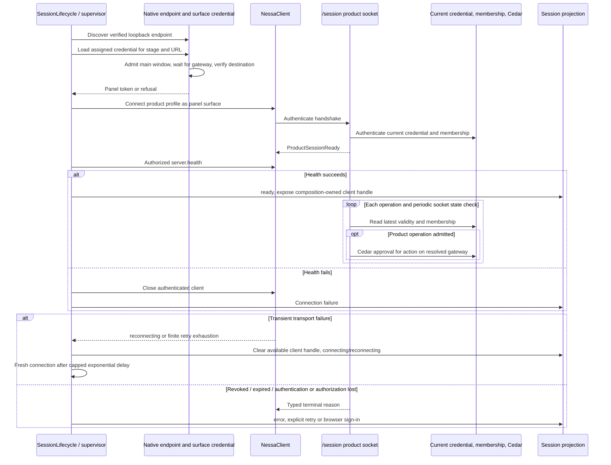
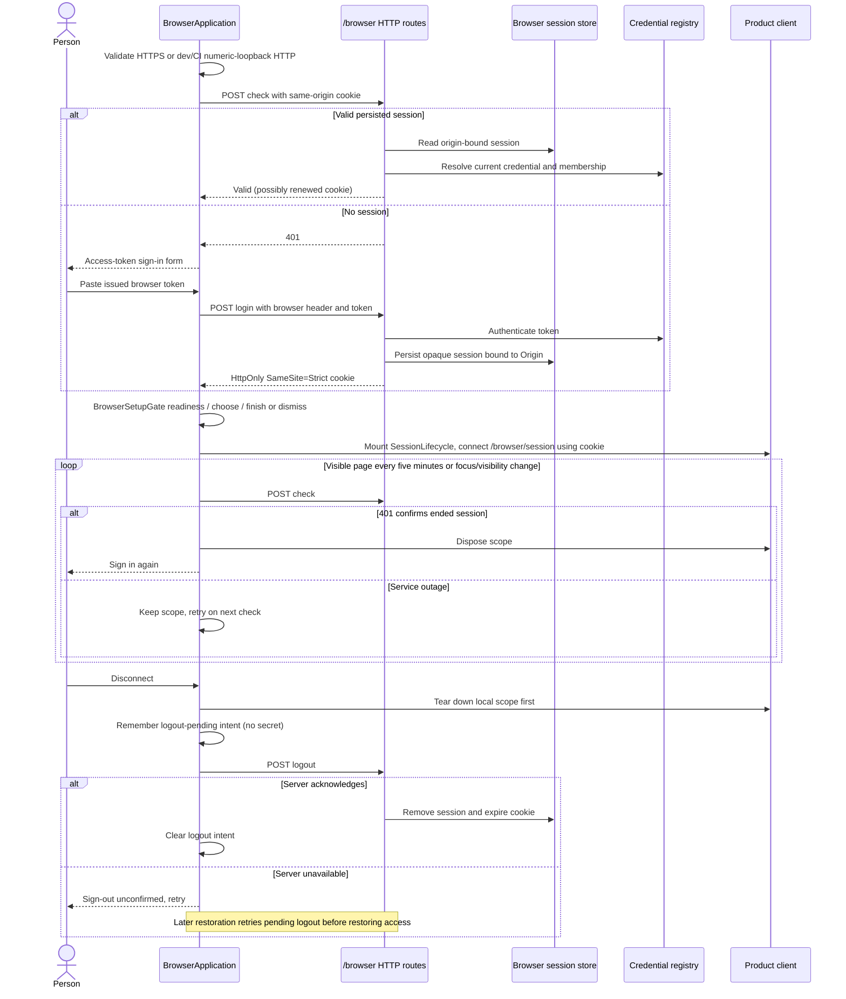
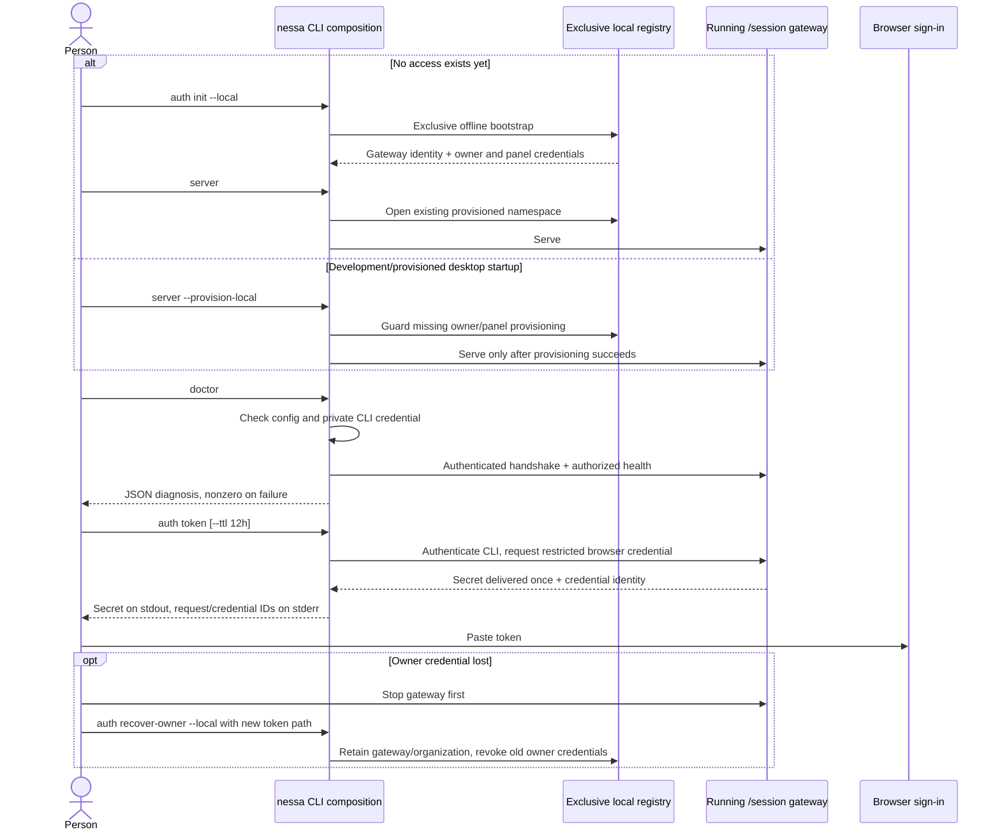

# User flow: launch Nessa, set up an agent, and recover a local connection

This map describes implemented behavior at `52bc6cbc`. It follows the floating
panel and first-run setup through the native host, gateway, authentication, and
provider readiness. It also covers browser sign-in and the CLI entry points that
establish or diagnose local access. Diagrams describe code paths, not an executed
end-to-end reproduction; the referenced tests were inspected, not run for this
documentation change.

Related maps: [chat](chat.md), [runtime](runtime.md),
[attachments](attachments.md), [desktop](desktop.md), and
[extensions UI](extensions-ui.md). The desktop workspace has a separate
composition root and sample source; opening it does not establish the panel's
gateway session (see the desktop map).

## Entry points and platform differences

| Person's entry | Actual startup owner and result | Evidence |
| --- | --- | --- |
| `just start [stage]` on Unix | Resolve one stage for host and frontend; refuse an occupied foreign gateway port before preflight repair; preflight; start a provisioned development gateway; poll `/health`; launch the dev app. On exit, stop the app job before its gateway job. | [recipe](../../../justfile), [preflight](../../../scripts/preflight.mjs), [port ownership](../../../scripts/free-gateway-port.mjs) |
| `just server` | Configure installed checkout harnesses and run `nessa server --provision-local`; it does not open a window. Existing credentials and existing agent configuration are guarded rather than rotated. | [package scripts](../../../package.json), [configuration script](../../../scripts/dev-agent-config.mjs), [local auth guide](../../guides/local-auth.md) |
| `just dev` / `pnpm app` | Debug Tauri host does **not** manage a gateway. The developer must run one separately or use `just start`. | [host composition](../../../src-tauri/src/composition.rs), [dev runner](../../../scripts/run-dev-app.sh) |
| `just dev` on Linux without a GUI, or with `CI` set | Execute `pnpm dev`; this is a browser development server, not a native Tauri window. With a GUI, native GTK/WebKit dependencies are checked. | [Linux recipe](../../../justfile) |
| `just web` / `pnpm dev` | Browser shell; native window calls no-op. Local backend uses same-origin browser authentication, not a native credential file. Scenario backend mounts the panel without `SessionLifecycle`. | [entry](../../../src/main.tsx), [browser composition](../../../src/composition/browser.tsx), [dependencies](../../../src/composition/dependencies.ts), [Vite proxy](../../../vite.config.ts) |
| Packaged release on macOS | Host starts the gateway independently of its webviews; `Launchd` stages and reconciles a stage-scoped service. App lifetime and gateway lifetime are distinct. | [main setup](../../../src-tauri/src/main.rs), [selection](../../../src-tauri/src/gateway/infrastructure/selection.rs), [macOS adapter](../../../src-tauri/src/gateway/infrastructure/macos.rs) |
| Packaged release on Linux | Same application owner, with systemd user-service reconciliation and Linux paths/evidence. A working user manager is a prerequisite; macOS launchd details do not describe this path. | [Linux adapter](../../../src-tauri/src/gateway/infrastructure/linux/mod.rs), [user manager](../../../src-tauri/src/gateway/infrastructure/linux/user_manager.rs), [domain systemd evidence](../../../src-tauri/src/gateway/domain/value_objects/systemd.rs) |
| Other release targets | Native gateway selection is explicitly unsupported. Windows recipes are present; their existence does not prove packaged gateway support. | [unsupported adapter](../../../src-tauri/src/gateway/infrastructure/unsupported.rs), [recipe caveat](../../../justfile) |

Stage/instance configuration selects private data and credentials. `prod` omits
the stage directory; other stages nest below the data root, and an instance adds
`instances/<instance>`. Explicit instances also isolate production. The data
root must be absolute and the namespace segments valid; a malformed namespace
does not fall back to another credential location. Stage ports come from the
[shared defaults](../../../protocol/defaults/gateway-ports.json), but current
endpoint discovery can publish a different actual listener.

## User flow: launch and choose the first surface

Host readiness means composition succeeded; gateway readiness is a separate
revisioned state. Tray, sizing, frost, and shortcut edge failures log and degrade
the surface. A required composition refusal manages an answer and returns
`Ok(())` to Tauri instead of allowing Tauri's setup callback to panic. The
refusal surface needs no working tray to quit. The frontend asks `hostStartup`
before mounting product state, but treats a rejected IPC question as ready;
that fallback is a diagnostic boundary to inspect if the app instead fails in
pieces.

Sources: [native startup refusal](../../../src-tauri/src/startup.rs),
[launch ordering](../../../src-tauri/src/main.rs),
[frontend first question](../../../src/main.tsx),
[refusal UI](../../../src/startup/ui/startup-refused.tsx), and
[static fallback document](../../../index.html). Tests:
[refusal markup](../../../src/startup/ui/startup-refused.test.ts) and the inline
`a_refusal_reaches_the_page_as_its_details` in `startup.rs`.
Window reveal, summon, close, taskbar, and tray behavior continue in
[desktop](desktop.md).

## User flow: complete setup, choose an agent, and learn the shortcut

Setup steps are `welcome → agent → summon → done`. Claude, Codex, and OpenCode
are all listed as supported adapters. Only a `ready` report makes a choice
selectable; `needs-authentication`, `not-installed`, `not-configured`, and
`unknown` remain distinct. A new report invalidates a now-unready choice while
the picker is still open. Past that step, the model deliberately preserves the
selection rather than silently undoing a decision on an unrelated screen.

`GET /onboarding/agents` is deliberately unauthenticated and discloses only
agent names and readiness states. Trusted Origin admission precedes any machine
probe; missing Origin is allowed for native/CLI probes. Concurrent callers
share a bounded in-flight probe, not a cached report. `AuthenticationUnknown`
maps to `needs-authentication` on this wire; an undetermined overall reading
returns 503. The frontend presents HTTP refusal/network failure as
`unreachable`, malformed JSON/report shape as `unreadable`, and absent or
unrecognized entries as unknown agents.

The frontend readiness controller coalesces active checks and discards an
abandoned answer. A managed gateway ready event abandons the previous check and
starts a new one; while starting/failed, checks are cleared. Unmanaged browser
and dev paths also ask on reaching the picker. Gateway subscription precedes
snapshot, and revisions prevent late snapshots/events undoing newer evidence.

Finishing records the agent; dismissing via close/Escape records no completion
and no agent, so first-run setup returns on the next launch. Both hand over to
the panel. The native host owns show/write/close ordering so a disappearing
webview cannot cancel a later completion write. A failed write keeps the setup
window available for **Save again**; a failed close offers **Close this window**
and preserves the controls. A browser surface hands over in place and remembers
the agent only within its dependency scope, without native persistence.

Sources and regression evidence:

- [model and transitions](../../../src/onboarding/model/onboarding.ts),
  [model tests](../../../src/onboarding/model/onboarding.test.ts),
  [coordinator](../../../src/onboarding/ui/use-onboarding.ts), and
  [gateway transition tests](../../../src/onboarding/ui/use-onboarding-startup.test.ts).
- [readiness controller](../../../src/onboarding/application/readiness-check.ts),
  [controller tests](../../../src/onboarding/application/readiness-check.test.ts),
  [HTTP mapping](../../../src/onboarding/adapters/agents.ts),
  [HTTP adapter tests](../../../src/onboarding/adapters/agents.test.ts),
  [server endpoint](../../../crates/nessa-server/src/agents/entrypoint/http.rs),
  [Origin tests](../../../crates/nessa-server/tests/agents/http.rs), and
  [shared probe tests](../../../crates/nessa-server/tests/agents/shared_readiness.rs).
- [handoff reducer](../../../src/onboarding/application/setup-handoff.ts),
  [recovery copy](../../../src/onboarding/application/setup-recovery.ts),
  [native show/write/close](../../../src-tauri/src/panel.rs),
  [handover tests](../../../src/onboarding/ui/setup-handover.test.ts), and
  [Strict Mode hook tests](../../../src/onboarding/ui/use-setup-handoff.test.ts).
- [choice lookup and caching](../../../src/composition/dependencies.ts): an
  absent choice is read again on later conversation creation; a confirmed
  choice is cached. A conversation created during the summon lesson can use
  the gateway default before setup writes the selection, and keeps that agent
  for its life. Further conversation behavior belongs to [chat](chat.md).

## User flow: save provider credentials and download a runtime

Provider API keys and gateway access tokens are different credentials. API-key
save accepts Claude and OpenCode, not Codex; Codex sign-in remains external.
Setup supplies a native sink, while the plain browser setup has none. The
desktop Settings catalogue is a frontend preference surface, not an alternate
provider-key writer (see [desktop](desktop.md)).

The macOS implementation writes the namespace-scoped login-keychain item whose
service/account mapping is published in
[credential defaults](../../../protocol/defaults/agent-credentials.json).
The non-macOS host adapter is explicitly unavailable; Linux service support does
not imply Linux secure-store support. Required intent audit failure prevents a
save; outcome audit failure after a confirmed write remains **saved**, with a
visible audit warning. A store failure/panic can be uncertain rather than proof
that the key was not written. Refresh failure after success says the key was
saved and asks for a readiness retry.

Gateway readiness and Claude cold process opening consume the injected
credential source; packaged OpenCode consumes a fresh exact-pin launch and
scoped API key per observation. Standalone OpenCode instead captures
`OPENCODE_API_KEY` at composition and does not promise live keychain refresh.
Existing provider slots retain their generation. These launch contracts continue
in [runtime](runtime.md).

Runtime download controls request authenticated `agents.installOptions` and
`agents.install` through the composition-owned session. UI never selects an
arbitrary download URL or executable path. The request uses a fresh UUID;
failure copy distinguishes storage, refused download, network download,
verification, busy, unavailable, and unconfirmed delivery. Installation may
continue after leaving the view. Success can report `cleanupPending`, and an
installed executable still requires the person's account/sign-in. Pinned
download, hash verification before unpack, publication, and retained cleanup
are mapped in [runtime](runtime.md).

Browser setup does not receive the native key sink or installation source:
[BrowserSetupGate](../../../src/composition/browser-gate.tsx) only passes
readiness and the chosen-agent handoff. Its
children, including `SessionLifecycle`, mount after the in-place setup ends.
Browser sign-in therefore precedes setup, and the product socket opens after
setup; browser sign-in itself is not the native first-run download path.

Evidence: [save UI](../../../src/onboarding/ui/agent-api-key-form.tsx),
[save UI tests](../../../src/onboarding/ui/agent-api-key-form.test.tsx),
[onboarding audit warning tests](../../../src/onboarding/ui/onboarding-credential-save.test.tsx),
[trusted command](../../../src-tauri/src/agent_credentials/infrastructure/commands.rs),
[save use case and inline tests](../../../src-tauri/src/agent_credentials/application/save_api_key.rs),
[macOS store](../../../src-tauri/src/agent_credentials/infrastructure/macos.rs),
[unsupported store](../../../src-tauri/src/agent_credentials/infrastructure/unsupported.rs),
[download adapter](../../../src/onboarding/adapters/agent-installations.ts),
[adapter tests](../../../src/onboarding/adapters/agent-installations.test.ts),
[downloads UI](../../../src/onboarding/ui/agent-downloads.tsx), and
[downloads UI tests](../../../src/onboarding/ui/agent-downloads.test.tsx).

## User flow: recover or update the managed gateway

The owner exposes `starting`, `ready`, and `failed` snapshots; an unmanaged
debug/browser path has no native service owner. `wait_ready` performs complete
reconciliation on credential load, rather than trusting a cached initial
success. Concurrent ordinary requests share one running receipt. The code also
has one pending successor for configuration-change evidence, but its public
`configuration_changed` method is currently test-only; do not read this as an
implemented live settings subscription.

Confirmed revalidation of the same identity keeps its ready revision. Changed
ready identity, failure, and recovery advance it. The monitor subscribes before
snapshot, discards older revisions, protects against stale Strict Mode
lifetimes, and retains a received event if its subsequent snapshot fails.
An unavailable monitor is explicitly presented as inability to read/retry
startup. The panel owes one session retry when startup becomes ready; once the
session connects, later failures need their own recovery.

Packaged readiness is stronger than HTTP 200: expected prepared-runtime
fingerprint, service generation, runtime-instance UUID, PID, and native service
identity must agree. Local endpoint discovery validates the published actual
listener against `/health` identity before the host permits a credential for
that destination. This correlation is not authentication. The recipe's simple
dev `/health` loop is a different readiness check.

Native adapters retain lifecycle intent, plans, attempted effects, observations,
physical results, and audit delivery as separate facts. Recovery observes and
settles an interrupted attempt rather than replaying its commands. Failed
retirement ordinarily preserves the old gateway. The explicit `data_missing`
exception permits native stop only when SDK cleanup proves nothing started by
that gateway still holds resources and conversation data is missing. macOS also
has one explicit pre-retirement-protocol path requiring exact service/listener
PID correlation. No listener found by port alone authorizes a stop.

The login shell's PATH is resolved once per host process, including a failed
resolution, so reloading a webview cannot retire the service because a profile
changed. Restart the app to pick up that change. The desktop app update check
and download/install/restart UI are separate from this gateway retirement
protocol; see [desktop](desktop.md).

Native service restart policy distinguishes transient failure from a startup
that another identical launch cannot repair. macOS uses
`KeepAlive: { SuccessfulExit: false }`; Linux units use `Restart=on-failure`
and a five-second restart delay. A managed gateway may exit zero for a permanent
startup refusal only after publishing `gateway-startup-failure.json` durably,
with its exact service generation and shared reason/exit-code meaning. If that
record cannot be published, it retains the nonzero status and native restart
behavior. A standalone gateway does not publish or erase a managed generation's
record. On a later successful managed start, only that generation's record is
forgotten. The host reads typed reasons and correlated native evidence; log
prose is diagnostic material, not stop/retry authority.

Sources: [application owner](../../../src-tauri/src/gateway/application/service.rs),
[host commands](../../../src-tauri/src/gateway/infrastructure/commands.rs),
[monitor](../../../src/startup/application/gateway-startup.ts),
[monitor tests](../../../src/startup/application/gateway-startup.test.ts),
[panel retry hook](../../../src/panel/ui/use-panel-startup.ts),
[panel retry tests](../../../src/panel/ui/use-panel-startup.test.ts),
[native endpoint admission](../../../src-tauri/src/gateway_endpoint/application/resolve.rs),
[endpoint tests](../../../src-tauri/tests/gateway_endpoint/application.rs),
[retirement adapter](../../../src-tauri/src/gateway/infrastructure/retirement.rs),
[managed startup failure record and inline tests](../../../crates/nessa-server/src/core/startup_failure.rs),
[server failure reporting](../../../crates/nessa-server/src/core/error.rs),
[macOS failure reader](../../../src-tauri/src/gateway/infrastructure/macos/startup.rs),
[Linux restart unit](../../../src-tauri/src/gateway/infrastructure/linux/unit.rs),
[runtime architecture](../../ARCHITECTURE.md#cross-cutting), and
[retirement refusal owner](../../../protocol/defaults/gateway-retirement-refusals.json).
Native lifecycle tests: [application ordering](../../../src-tauri/tests/gateway/application.rs),
[macOS startup](../../../src-tauri/tests/gateway/infrastructure/startup.rs),
[control](../../../src-tauri/tests/gateway/infrastructure/control.rs),
[generation](../../../src-tauri/tests/gateway/infrastructure/generation.rs),
and inline tests in the Linux adapter and its children.

## User flow: authenticate, reconnect, expire, or revoke a surface session

The native source only provides a credential to client ID `nessa-panel` at a
loopback WebSocket destination, and the native command additionally only admits
window label `main`. The assigned stage and endpoint are checked before reading
the private token. File permissions, owner, symlink/namespace safety, and size
are enforced; absence, refusal, wrong stage, invalid token, and unopenable file
remain distinct host errors. Dev without a managed gateway skips the gateway
wait but still applies credential checks.

The supervisor retries typed transient failures and exhausted SDK retries with
500 ms exponential backoff capped at 5 seconds, while honoring a longer
`retryAfterMs`. A successful connection resets attempts. It rejects callbacks
from stale generations and closes a client whose opening completes after
disposal. It retries only connection setup: it does not replay conversation
commands. Terminal errors require explicit retry. Browser composition recognizes
authentication failure and discards its authenticated scope, asking for sign-in
again. Already-admitted handlers can finish after revocation; later commands
must pass current-state admission.

Evidence: [native source](../../../src/session/adapters/client/credential-source.ts),
[source tests](../../../src/session/adapters/client/credential-source.test.ts),
[host credential and inline tests](../../../src-tauri/src/surface_credential.rs),
[session opening](../../../src/session/adapters/client/dev-session.ts),
[health failure tests](../../../src/session/adapters/client/dev-session.test.ts),
[supervisor](../../../src/session/adapters/lifecycle/supervisor.ts),
[supervisor tests](../../../src/session/adapters/lifecycle/supervisor.test.ts),
[session React lifetime](../../../src/session/adapters/lifecycle/session-lifecycle.tsx),
[terminal authentication classification](../../../src/session/adapters/client/authentication-failure.ts),
[socket admission and inline tests](../../../crates/nessa-server/src/product/socket.rs),
and [auth application](../../../crates/nessa-auth/src/application/session.rs).
Chat receipt uncertainty and reconnect refresh continue in [chat](chat.md).

## User flow: sign in, restore, renew, and sign out in the browser

Browser credential storage is server-side credential ID, bound Origin, and
lifetime evidence. The page does not persist tokens in local/session storage;
only logout intent is retained. HTTPS uses `__Host-nessa-session` with `Secure`;
permitted local HTTP uses `nessa-local-session`. Cookies are HttpOnly,
SameSite=Strict, Path `/`. Route admission requires trusted Origin and
`X-Nessa-Browser: 1`; browser session WebSocket admission still checks current
authorization. Idle lifetime is a rolling 30 days, constrained by current
credential validity; this is distinct from a browser token's optional expiry.

Sources: [browser composition](../../../src/composition/browser.tsx),
[browser auth and transport policy](../../../src/session/adapters/client/browser-auth.ts),
[browser auth tests](../../../src/session/adapters/client/browser-auth.test.ts),
[renewal adapter](../../../src/session/adapters/lifecycle/browser-renewal.ts),
[renewal tests](../../../src/session/adapters/lifecycle/browser-renewal.test.ts),
[local teardown ordering](../../../src/session/application/browser-session.ts),
[teardown tests](../../../src/session/application/browser-session.test.ts),
[server HTTP boundary](../../../crates/nessa-server/src/browser_session/entrypoint/http.rs),
[session application](../../../crates/nessa-server/src/browser_session/application/session.rs),
[lifetime](../../../crates/nessa-server/src/browser_session/domain/value_objects/lifetime.rs),
and [persistence tests](../../../crates/nessa-server/tests/browser_session/persistence.rs).

## User flow: bootstrap and diagnose access through the CLI

`nessa` without arguments prints help; `nessa server` serves existing state and
does not silently bootstrap. `--provision-local` is a guard, not token rotation.
Online `doctor` and `auth token` use the authenticated product protocol; they
do not open the live registry. Offline init/recovery need exclusive registry
access. Cloud selection fails explicitly; it does not redirect to local auth.
An untrustworthy registry is left unchanged, accompanied by a secret-free
refusal record, and cannot authorize serving.

Issued browser tokens receive `server.read` and `conversation.write` on the
authenticated gateway/organization, with a distinct member principal. Default
expiry is absent, capped by the caller credential; positive TTL can shorten it.
Issuance is not automatically retried because secret delivery is once-only.
Administrative issue/list/revoke and request IDs are documented in the
[local auth guide](../../guides/local-auth.md). Revocation survives restart;
attached clients close on their current-state check, and subsequent operations
are rejected. Owner recovery preserves gateway/organization identity and
separate panel grants; deleting the registry would create a different identity
boundary rather than rotate one token.

Code: [CLI parser](../../../crates/nessa-server/src/cli/entrypoint/arguments.rs),
[token application](../../../crates/nessa-server/src/cli/application/commands.rs),
[online composition](../../../crates/nessa-server/src/composition/cli.rs),
[offline auth composition](../../../crates/nessa-server/src/composition/auth_command.rs),
[provisioning](../../../crates/nessa-server/src/composition/local_auth.rs),
and [registry refusal](../../../crates/nessa-server/src/composition/credential_registry.rs).
Evidence: [CLI application tests](../../../crates/nessa-server/tests/cli/application.rs),
[CLI gateway tests](../../../crates/nessa-server/tests/cli/gateway.rs),
[provisioning tests](../../../crates/nessa-server/tests/composition/local_auth.rs),
[registry refusal tests](../../../crates/nessa-server/tests/credential_registry_refusal.rs),
and [process smoke script](../../../scripts/smoke-auth.mjs).

## Troubleshooting traces and review boundaries

| Classification | Trigger, trace, and expected/actual behavior | Evidence / next verification |
| --- | --- | --- |
| **Confirmed defect by source agreement; not reproduced here** | First-run setup mounts `SessionLifecycle` specifically to support authenticated downloads. `build_setup_window` creates native label `setup` and query `surface=setup`. Default connection first invokes `load_gateway_endpoint`, which rejects labels other than `main`; an explicit gateway URL skips that first refusal, but `load_surface_credential` likewise rejects setup before gateway wait or token read. Thus setup's own session cannot connect; installation offers consume `session.get()?.agents` and report unavailable. The panel's separate session does not populate setup's separate handle/store, and `finish_setup` shows the existing main window rather than relabeling setup. | [setup builder and handoff](../../../src-tauri/src/panel.rs), [setup mount](../../../src/main.tsx), [dependency-owned handle](../../../src/composition/dependencies.ts), [endpoint guard](../../../src-tauri/src/gateway_endpoint/entrypoint/command.rs), [native credential guard](../../../src-tauri/src/surface_credential.rs), [download consumer](../../../src/onboarding/adapters/agent-installations.ts). Existing `another_window_is_refused_before_the_gateway_is_asked_for_anything` explicitly asserts setup is rejected. Capability admission lists both windows in [default capability](../../../src-tauri/capabilities/default.json), so it supplies no alternate identity. A native first-run download reproduction is still needed; no fix is made by this map. |
| **Hypothesis** | A readiness HTTP request that never settles can hold the UI check busy indefinitely: `httpAgentReadiness` has no AbortSignal/deadline, and active checks coalesce until `read()` settles or gateway state/lifetime abandons them. The server reader has a deadline, but an unresponsive intermediary or incomplete response body is outside that server timer. Expected recovery would need a settled/abandoned frontend ask; Check again remains disabled while the check is pending, while repeated controller calls join the active one. | [fetch adapter](../../../src/onboarding/adapters/agents.ts), [check ownership](../../../src/onboarding/application/readiness-check.ts), [server bounds](../../../crates/nessa-server/src/agents/application/shared_readiness.rs). Verify with a controlled never-settling fetch; do not infer a real network incident from this static trace. |
| **Designed limitation** | Linux packaged gateway startup is implemented, but entering a provider API key through the native host cannot save it because the non-macOS credential-store adapter is unavailable. | [platform store selection](../../../src-tauri/src/agent_credentials/infrastructure/mod.rs), [unsupported store](../../../src-tauri/src/agent_credentials/infrastructure/unsupported.rs), [save status UI](../../../src/onboarding/ui/agent-api-key-form.tsx). External sign-in/runtime configuration and API-key-save capability must be distinguished. |
| **Designed limitation** | A conversation created while practising the summon shortcut can precede completion/choice persistence, use the gateway default, and retain that agent. Completing setup affects later creations, not the existing conversation's recorded agent. | [choice caching explanation and implementation](../../../src/composition/dependencies.ts), [handoff ordering](../../../src-tauri/src/panel.rs), [chat map](chat.md). |
| **Designed behavior to preserve** | A gateway startup event can outrun its snapshot, a session can fail while gateway recovery is finishing, and an old connection can finish after disposal. Revision comparison, one owed panel retry, and session generation checks handle these separate races. | [startup monitor tests](../../../src/startup/application/gateway-startup.test.ts), [panel retry tests](../../../src/panel/ui/use-panel-startup.test.ts), [supervisor tests](../../../src/session/adapters/lifecycle/supervisor.test.ts). |

No browser/native flow or test suite was executed for this map. macOS keychain,
launchd, Linux systemd user-manager behavior, upgrade retirement, real credential
revocation, and reconnect timing remain unverified in this workspace. Source
and regression references identify where to reproduce them. This map does not
claim a registry repair, provider login, runtime installation, or app launch
succeeded.

Scope exclusions: provider execution, scheduling, tool/permission transitions,
and executable reclamation belong to [runtime](runtime.md); message delivery,
saved tabs, conversation selection and archive/delete belong to [chat](chat.md);
file transfer and ticket lifecycle belong to [attachments](attachments.md);
native window layout and app updater controls belong to [desktop](desktop.md);
MCP Apps/widget surfaces belong to [extensions UI](extensions-ui.md). This map
traces their startup prerequisites and handoffs rather than duplicating them.

## Verified contributing history

These are pull requests verified by local merge subjects, not issue numbers
inferred from ADR filenames. They explain the implementation's contributing
history; current code and tests above remain the behavior authority.

| Verified PR | Local evidence | Relevant contribution |
| --- | --- | --- |
| [#169](https://github.com/nessalabs/nessa-agent/pull/169) | `edf95472`: `Merge pull request #169 ... ws3-startup-20260922` | Gateway startup work |
| [#184](https://github.com/nessalabs/nessa-agent/pull/184) | `64e97a04`: `Merge pull request #184 ... ws4-credentials-save-0924` | Credential-save work |
| [#185](https://github.com/nessalabs/nessa-agent/pull/185) | `ea2ec4a9`: `Merge pull request #185 ... ws1-opencode-readiness-current-0924` | Current OpenCode readiness |
| [#187](https://github.com/nessalabs/nessa-agent/pull/187) | `0af783f3`: `Merge pull request #187 ... ws8-linux-runtime-preparation-0924` | Linux runtime preparation |
| [#192](https://github.com/nessalabs/nessa-agent/pull/192) | `85749c30`: `Merge pull request #192 ... ws8-gateway-lifecycle-journal` | Durable gateway lifecycle journal |
| [#207](https://github.com/nessalabs/nessa-agent/pull/207) | `0efd1d9f`: `Merge pull request #207 ... ws8-linux-startup-recovery` | Linux startup recovery |
| [#219](https://github.com/nessalabs/nessa-agent/pull/219) | `ec31ad73`: `Merge pull request #219 ... linux-packaging-216` | Linux packaging |
| [#223](https://github.com/nessalabs/nessa-agent/pull/223) | `6a21ad7c`: `Merge pull request #223 ... fix/221-startup-refusals` | Host startup refusal and recovery UI |
| [#224](https://github.com/nessalabs/nessa-agent/pull/224) | `3ea2e19c`: `Merge pull request #224 ... worktree-onboarding-ui-polish` | Onboarding UI polish |
| [#234](https://github.com/nessalabs/nessa-agent/pull/234) | `790057cf`: `Merge pull request #234 ... 233-interactive-startup-timing` | Interactive gateway and startup timing |
| [#246](https://github.com/nessalabs/nessa-agent/pull/246) | `7b0a40c0`: `Merge pull request #246 ... 244-245-installation-contracts` | Runtime installation contracts |

Issue/ADR references are separate design context:
[ADR 0010 local authentication](../../adr/done/0010-local-authentication.md),
[ADR 173 fetch runtimes](../../adr/done/173-fetch-agent-runtimes.md), and
[architecture](../../ARCHITECTURE.md). Proposed remote TLS/device provisioning,
hosted identity adapters, and broader collaboration are excluded from the
implemented flow. This map does not turn a proposal into current behavior.
