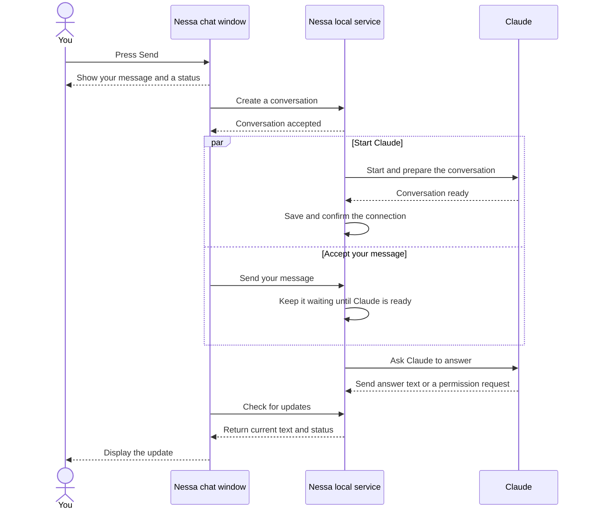
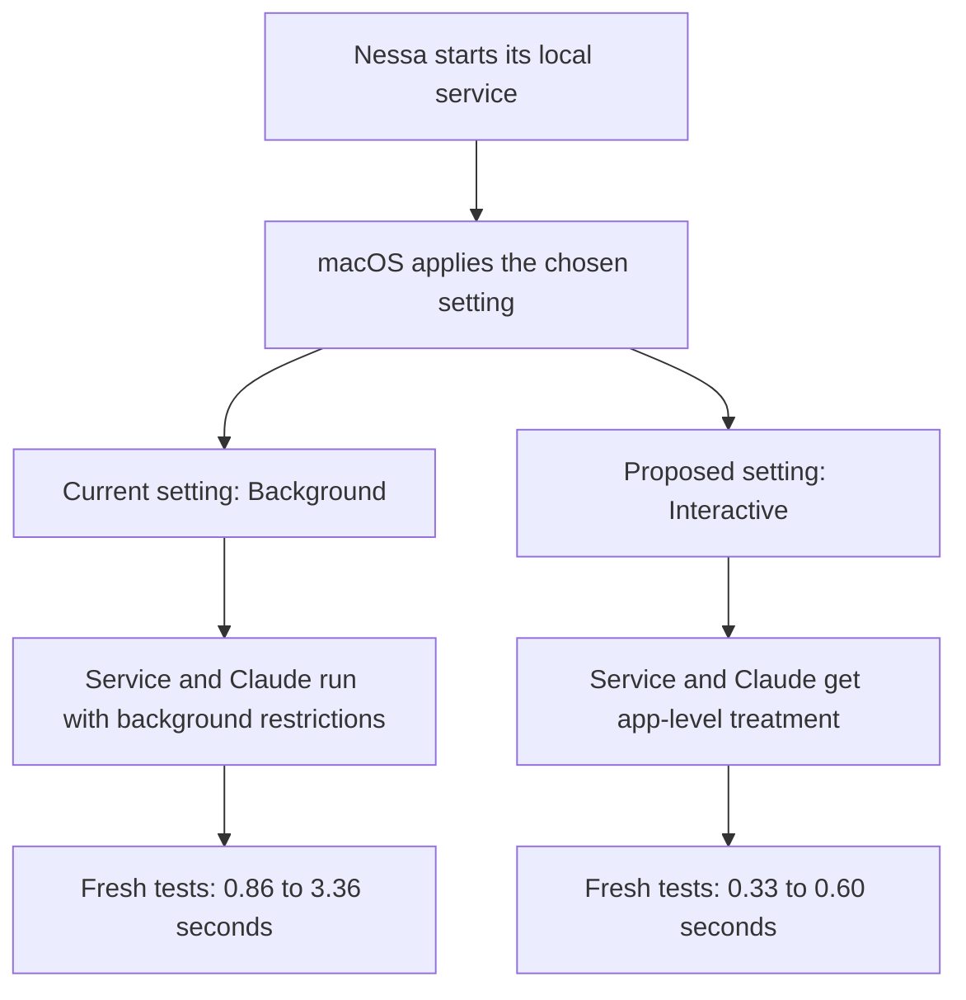
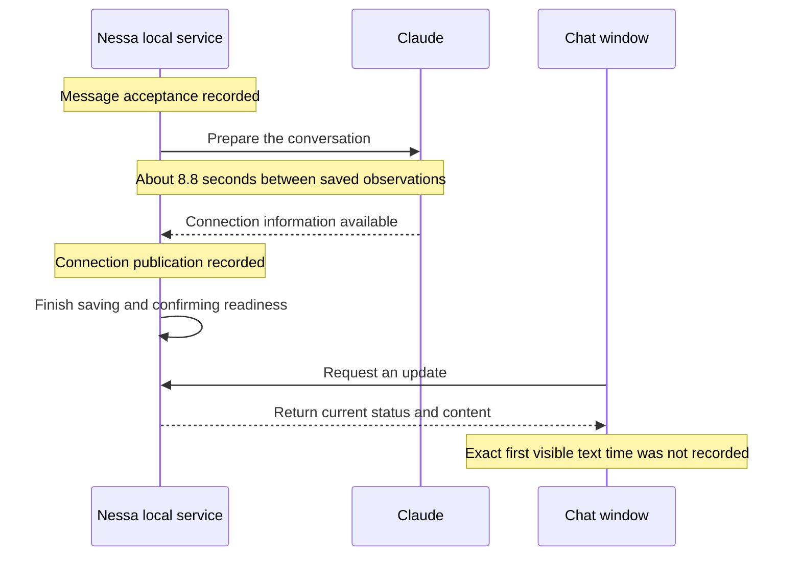

# Why Nessa sometimes takes too long to start

**Update after approval:** the macOS launch setting has now been changed to Interactive, and local startup/first-response timing logs have been added in this worktree. The gateway remains a separate service. This source change has not yet been installed in the running app. The investigation below describes the earlier Background setting and measurements.

Nessa currently tells macOS that its local service is background work. That service starts Claude, so Claude also runs under those restrictions. This is the strongest explanation we found for avoidable delay, although it does not prove what caused the original 45-second failure.

## What the tests showed

I started the same installed Claude software under different macOS settings. These tests stopped when Claude had created a conversation; they did not ask it to write an answer.

| How macOS treated the test | Time to create a Claude conversation |
| --- | --- |
| Background work — Nessa’s current setting | **0.86–3.36 seconds** |
| Interactive work — the proposed setting | **0.33–0.60 seconds** |

There were four tests for each setting. The middle result was about **1.5 seconds versus 0.4 seconds**: roughly **1.1 seconds faster** with the proposed setting. This was a small test on an already-used installation. It is evidence of improvement, not a promise that every startup will be this fast.

I also tested through the running Nessa service. It reported the conversation ready after about **1.4 seconds**. The original 45-second failure did not happen again during this investigation.

## What happens after you press Send

Nessa has three parts involved here: the chat window, a local service that coordinates the work, and Claude. The local service is called the *gateway* in the code.

This diagram shows a new conversation. Claude starts while Nessa accepts your message, so those steps can overlap.



**“Nessa accepted my message” and “Claude is ready” are different moments.** For a conversation where Claude is already running, Nessa can reuse that connection and skip the startup work.

Starting the Nessa app is another separate step. The app first makes sure its local service is running. That service can be healthy while Claude is still starting. Nessa also has an existing warm-up step; a first conversation can wait for that to finish.

## Where macOS can slow this down

The current background setting applies to the local service and the programs it starts. The fresh tests showed delays both while starting the Claude connection and while preparing the conversation.



The proposed setting should reduce this avoidable wait. Its tradeoff is that Nessa and Claude could compete more with other apps for computer resources. We should check responsiveness and energy use before calling the change finished.

## What we know about the two earlier slow conversations

**The 45-second failure:** Nessa stopped waiting while Claude was creating the conversation. We cannot see exactly what Claude was doing inside that step because its detailed output was not saved. Nessa discards that output because it can contain sensitive information.

A separate earlier test recorded about 41 seconds inside Claude initialization. However, the process settings changed during that test. It is useful evidence of a slow start, but it cannot prove the cause of the original failure.

**The later 8.8-second wait:** saved records confirm about 8.8 seconds between Nessa recording the message as accepted and recording that Claude’s connection was being published. This happened inside the local service. It does not measure how long the window took to draw the result. Those records are timestamped before their final save completes, so they do not give an exact “fully ready” time either.



That conversation finished about 30.7 seconds after message acceptance. Permission decisions and Claude’s work took part of that time. It would be misleading to call all 30.7 seconds “startup.”

## Why the status can be confusing

The window currently switches to **Thinking** immediately after Send. A later update can change it to **Starting the agent…**. That order can make it look as though Claude was already thinking when it was still starting.

While a conversation is active, the window normally waits about a quarter of a second between completed update requests. Slow requests or a busy computer can add more time. We did not measure the exact moment text appeared on screen.

I recommend showing **Starting** while a new connection is being prepared, then **Thinking** when the service confirms the appropriate state. This improves clarity; it does not make Claude start faster.

## What I propose doing next

1. **Give Nessa app-level treatment on macOS.** This is the most promising speed improvement. Apply it through Nessa’s normal service update process, and test startup, restarts, existing conversations and energy use.
2. **Record how long each startup step takes.** Record timings without copying messages or credentials into logs. This will tell us whether a future delay is in starting Claude, loading the conversation, saving state or updating the window. Add these measurements before judging the speed change.
3. **Make the status match what is happening.** Check both new and existing conversations, including failures and cancellation.

Increasing the 45-second limit would only let Nessa wait longer. The evidence does not yet justify that, a new pool of prestarted Claude sessions, or a larger redesign.

**Approved scope:** Interactive scheduling and local timing logs. UI changes were explicitly excluded. [Decision 233](../adr/done/233-responsive-gateway-startup.md) records the agreed scope, alternatives and follow-up work. The temporary test jobs were removed, and the empty test conversation was closed.

## Detailed evidence

The section below preserves the exact measurements, source locations and testing limits for anyone reviewing the implementation. You do not need it to understand the recommendation above.

<details>
<summary>Open technical measurements and source references</summary>

Measured 2026-09-27 UTC (September 26 Vancouver). Source checkout: `6a21ad7c7fc89b0381524ed1d32aa19bc29b0c81`. Managed worktree: `startup-investigation/nessa-agent`.

## What was measured

Installed runtime fingerprint: `5afa8ad42221395dfa3da0dac21780528f9141a409917f3809a23b9b922b4d58`. Its manifest/package files report Node 26.8.1, Claude ACP 0.76.0, Claude Agent SDK 0.3.257, target aarch64-apple-darwin. The manifest does not identify a source commit, so source tracing at the checkout above and installed-binary measurements are distinct evidence.

Host: macOS 26.6, build 25G72. Ordinary workstation load, no intentional stress or cache clearing; load averages sampled shortly after were 25.34 / 10.91 / 6.78. These are warm executable/cache trials, not fresh-install or controlled-load benchmarks.

The probes used the installed Node/ACP executable, the default Nessa workspace, Claude Sonnet 5, the inspected historical probe's Nessa MCP and restrictive Claude options, and an isolated process-audit directory. They sent ACP `initialize`, then `session/new`, and stopped without sending a prompt. No API key was extracted or copied. They used Claude's existing local sign-in, bypassing Nessa's per-open credential wrapper, storage, audit, and post-new configuration exchange. Consequently their end point is the `session/new` response, not full production attachment readiness.

Separate temporary jobs used Background, Interactive, and Standard in alternating order; each was booted out after its trial. Production policy, plist and gateway process were not altered. Each protocol probe had a 55-second outer measurement deadline, followed by bounded process-group cleanup. All completed successfully, and the temporary jobs and their provider process groups were absent at verification.

| Trial | Spawn→initialize reply (s) | Spawn→session/new reply (s) | Node priority / nice |
| --- | ---: | ---: | --- |
| Standalone 1 | 0.2192 | 1.0122 | 31 / 0 |
| Background 1 | 2.7826 | 3.3595 | 4 / 0 |
| Interactive 1 | 0.1265 | 0.4296 | 31 / 0 |
| Standard 1 | 0.3090 | 2.8666 | 46 / 0 |
| Interactive 2 | 0.1446 | 0.3471 | 31 / 0 |
| Background 2 | 0.3348 | 0.8635 | 4 / 0 |
| Standard 2 | 0.2210 | 0.7140 | 46 / 0 |
| Background 3 | 1.0706 | 1.7026 | 4 / 0 |
| Interactive 3 | 0.1898 | 0.6029 | 31 / 0 |
| Standard 3 | 0.1244 | 0.3400 | 20 / 0 |
| Interactive 4 | 0.1131 | 0.3317 | 31 / 0 |
| Background 4 | 0.6467 | 1.3043 | 4 / 0 |

Clock starts immediately before `Popen`; spawn itself took 1.2–2.7 ms. Sampling priority and sending initialize are included. Priority is a point observation, not a complete scheduler/QoS profile. Background median was 1.503 s, Interactive median 0.388 s: a descriptive 1.115-second (74%) difference in this small, unpaired warm sample. Standard median was 0.714 s but had a 2.867-second outlier. No p95 estimate is justified.

In trials 3–4, a strict parser retained only provider timing phase names and numeric durations from stderr. Background SDK-initialize phases were 522 and 536 ms; Interactive were 372 and 191 ms. Background settings phases were 83 and 95 ms versus Interactive 29 and 21 ms. The measured penalty occurs both before the ACP initialize response and during session creation. It is not exclusively a slow Rust gateway or exclusively model generation. In the installed ACP code, `sdk-initialize` times the await of `q.initializationResult()` after `query()` constructs/spawns the native Claude process; it does not isolate native startup, auth, MCP, or OS work inside that await.

Raw sanitized results: [measurements.json](evidence/startup-latency/measurements.json), [gateway.jsonl](evidence/startup-latency/gateway.jsonl), and [audit-boundaries.json](evidence/startup-latency/audit-boundaries.json). Temporary probe scripts remain in `/tmp/nessa-startup-investigation-20260927/`; the scripts use no generation request. The gateway probe used the existing local TypeScript client from the developer checkout, not a newly built client from this worktree.

## Production path and phase boundaries

### Gateway readiness, before a conversation

`src-tauri/src/main.rs:113` starts the composition-owned gateway independently of the webviews. The macOS adapter reconciles the complete launch definition, verifies/stages the runtime, performs authorized replacement when required, bootstraps launchd, then validates health against fingerprint, service generation, runtime instance and launchd PID. An already-matching healthy gateway is reused.

`src-tauri/src/gateway/infrastructure/macos/control.rs:998` owns gateway readiness polling: 75-second deadline, 100-ms polls, 500-ms liveness checks. This is a separate timeout from ACP's 45 seconds. In the gateway, `composition/root.rs:86` provisions/configures dependencies; after binding and endpoint publication it logs listening and starts warm-ups (`:205–218`). Health readiness does not imply a conversation provider is attached.

Configured warm-ups perform a disposable provider open/close once per recorded runtime identity, not a persistent reusable session pool (`composition/local_auth.rs:405–429`, `agent_warm_up/application/service.rs`). A first conversation may wait for that warm-up to settle before starting its own attachment; completed warm-up records allow skipping the disposable launch. A slow first-install warm-up can therefore be another waiting phase. No fresh gateway restart or cold-install timing was performed because the active production gateway was serving existing sessions.

### First message with a connected gateway

```text
UI sendDraft / beginSend
  → local user turn and immediate “thinking” state
  → host chosenAgent → client conversation.create → authenticated WebSocket
  → ConversationService.create → start_slot
      → resolver → SessionManager.open → Agent.prepare
      → authorize attachment → create projection/subscription
      → spawn independent attachment owner
  ← create response once the prepared Slot exists
  → conversation.send → Agent.enqueue → durable queue admission

Independent attachment owner
  → optional runtime warm-up wait → Agent.start_attachment
  → Starting audit → SessionManager.attach → provider.open
  → current credential read → executable-use admission / process spawn
  → ACP initialize → session/new → mode configuration / validation
  → persist provider context → context-publication audit → ready acknowledgement
  → queued invocation dispatch → ACP session/prompt

Provider observations → SDK events → gateway projection
  → conversation.read replacement view → Redux applyView → React status/text
```

Create and queue admission do not wait for attachment. Source anchors: `src/conversation/adapters/store/slice.ts:128–197`, `src/conversation/adapters/gateway/effects.ts:375–457`, `crates/nessa-server/src/conversation/application/service.rs:757–1010,1122–1362`, `crates/nessa-sdk/src/application/agent_execution/agents/agent.rs:207–290`, and `sessions/manager.rs:241–415` beneath the same SDK application directory.

Relevant alternate paths:

- Existing live Slot/provider: enqueue and dispatch into the existing session; no startup on every message.
- Saved history without a live provider: restore local snapshot, initialize ACP, resume the saved provider context, validate/configure, persist/publicize attachment, then dispatch. Unsupported resume or identity disagreement fails explicitly.
- Authorized automatic recovery after provider stop: queue owner authorizes another attachment; failed recovery settles pending work. It does not blindly resend an uncertain submission.
- Credential, configuration, capacity, storage, audit or input refusal: return the typed failure before the corresponding later effect. The UI restores a definitely refused draft; uncertain delivery retains its stable submission identity for reconciliation.
- Timeout, close, malformed reply or provider/configuration error during opening: worker cleanup precedes failed-open settlement; the gateway publishes failure through lifecycle/receipts, which the UI sees on a later read. Cleanup may extend elapsed time beyond the protocol deadline. A cancelled create waiter does not cancel the independent Slot/attachment owner.

### ACP timing and attachment

`CredentialedClaudeProvider::current` reads credentials at each open through a three-second wrapper (`crates/nessa-server/src/agents/infrastructure/credentialed_claude.rs:39,98–158`). The fresh standalone policy probes did not include that wrapper.

`WorkerFactory::start` performs executable-use admission and synchronous process spawn before worker startup creates the launch deadline (`crates/nessa-sdk/src/infrastructure/acp/sessions/binding.rs:150–218`). Therefore the 120-second launch budget does not bound all work from the UI click or even the whole provider-open operation.

`acp/executions/worker.rs:859–1001` then waits up to 120 seconds for initialize. After initialize, **one shared 45-second deadline** covers session/new or resume and the configuration exchanges. Claude's profile adds mode selection (`claude_acp/sessions/profile.rs:91–96`). `protocol/defaults/agent-startup-budgets.json` says “each exchange,” which is inaccurate for this implementation; its attribution of launch time solely to OS scanning also exceeds the available evidence. Neither wording was edited in this investigation.

ACP readiness still precedes full attachment: provider context must be saved, its publication audited, and acknowledged to the scheduler. Gateway Starting includes Waiting as well as Starting; it does not identify which internal phase is waiting.

### First visible status and first text

`beginSend` immediately sets local phase `thinking` (`src/conversation/application/usecases/send-draft.ts:64`). A successful replacement view later maps backend startup to “Starting the agent…” (`apply-view.ts:127–145`, `ui/thinking.tsx:29`). This can briefly show Thinking before Starting; it is a status semantics issue, not evidence that the model is already running.

Busy polling waits 250 ms after a read completes; idle polling waits 2 seconds (`src/conversation/ui/use-conversation.ts:37–48`, `adapters/gateway/polling.ts:9–19`). Overlapping reads are serialized. Under an unstalled active UI, projection visibility adds roughly 0–250 ms plus read/serialization/render time; hidden tabs, scheduling stalls and slow reads can exceed this. The production probe measured the API projection, not a DOM paint.

The historical permissions at `01:00:05.116Z` and `01:00:08.392Z`, and execution finish at `01:00:20.515Z`, are confirmed by durable records. The local snapshot contains the provider session identity tying these records to the earlier attachment. The 30.721 seconds between queue-admission and execution-finish audit observations includes permission waits and execution; it is not all startup. Existing text history does not establish the first visible token timestamp. No fresh generation or browser-paint measurement was made.

## Scheduling and observability

The policy is constructed at `src-tauri/src/gateway/infrastructure/macos.rs:1356–1362`. Installed `launchctl print gui/501/so.nessa.gateway.prod` reported `spawn type = background (5)` and PID 55049. `ps` showed priority 4 / nice 0 for that gateway and existing Node→Claude→nessa-mcp descendant chains. Setting nice alone would not address this evidence.

The local macOS `launchd.plist(5)` manual describes Background as work not directly requested by the user, Standard as the default with light CPU/I/O limits, and Interactive as app-equivalent resource policy when responsiveness depends on it. Adaptive changes based on XPC activity; this gateway's product traffic uses loopback WebSocket, so merely choosing Adaptive does not establish the required activity signal. The current transport provides no demonstrated promotion mechanism.

The full launch definition is compared for reuse (`macos.rs:1990`), and policy participates in generation/reconciliation. A source policy edit alone does not update an already loaded job; deployment must follow the existing managed replacement and audit path. Bypassing it with an ad hoc production priority adjustment would not validate the shipped fix.

`crates/nessa-sdk/src/infrastructure/process.rs:227–236` drains stderr without retaining it specifically because provider output can contain secrets. Successful startup RPCs lack phase-duration diagnostics; failure logging carries the phase/session (`service.rs:456–465`). Durable audit timestamps identify observation at entry to the sink, before its blocking write/fsync and acknowledgement (`crates/nessa-server/src/conversation/infrastructure/audit.rs:43–60`). The stored records establish eventual durable delivery, but their timestamps do not measure completion of that delivery or exact internal effect times. Gateway listening logs, audit records and UI state therefore cannot reconstruct all latency phases.

## Proposed changes, in priority order

| Priority | Smallest proposed change | Expected benefit | Risk and required validation |
| --- | --- | --- | --- |
| 1 | Change the managed macOS gateway from Background to Interactive, through the existing definition/replacement path. | Remove demonstrated scheduling penalty: approximately 1.1 s median improvement in this warm sample; potential larger tail benefit remains unproven. | More CPU/I/O competition and energy use while idle or serving many agents. Test full-definition matching, new generation and authorized replacement, retirement refusal, crash restart policy, and actual descendant policy. Repeat interleaved cold/warm and realistic-load runs; measure idle energy. Standard is a lower-resource alternative, but the current small sample is less consistent. |
| 2 | Add correlated, payload-free monotonic phase durations at existing host/provider/application boundaries; correct budget documentation. Implement diagnostics before judging the policy rollout. | No direct speedup; makes the next long stall attributable and separates policy benefit from storage, credential, warm-up and UI delays. | Logging overhead and accidental payload disclosure. Inject/use existing clock seams, bound event volume, allowlist fields, test success/error/timeout/close paths and absence of prompt/credential data. Do not make diagnostic delivery a second lifecycle authority. |
| 3 | Make initial local status say Starting/submitting until backend evidence permits Thinking, using the existing phase model where possible. | Immediate truthful feedback; zero expected reduction in backend latency. | Flicker or regression for already-attached sends. Test cold attach, live reuse, restored session, failed admission, uncertain receipt, stop and recovery with delayed replacement views. |
| 4 | Investigate individual residual phases only if new timing identifies them: credential read, warm-up wait, spawn, SDK initialization, context persistence or publication. | Unknown until measured. | Preserve credential refresh, exclusive ownership, audit acknowledgement and cleanup contracts. Use targeted injected-latency tests before optimizing. |

Suggested phase markers: host reconciliation begin/health-ready; warm-up wait begin/end; credential lookup; executable-use admission; process spawn; initialize; new/resume; configuration; context save; publication acknowledgement; first prompt dispatch; first provider event; first client view; first rendered status/text. Correlate by conversation and attachment generation, while keeping monotonic durations local to each process. Wall-clock timestamps alone should not be subtracted across unsynchronized processes.

Do not start with a larger timeout: it makes failure slower without removing scheduling pressure. Do not add a warm session pool or redesign polling first: warm-up already exists, live conversations already reuse their provider, and those changes add lifecycle complexity without evidence that they dominate. Raw stderr retention should remain an explicit bounded diagnostic facility, if needed, rather than default logging.

## Review scope and remaining uncertainty

Verified source relationships: create acknowledgement versus attachment; queue ownership versus dispatch; ACP result versus durable context/publication; local/provider session identity in historical evidence; backend lifecycle versus UI replacement view; complete launch definition versus installed policy. A separate trace reviewer followed the UI/server/SDK edges. This is an investigation, not a claim that all lifecycle interleavings have been tested.

At the end of the investigation, no production source, timeout, scheduling policy, or UI behavior had been changed. The subsequent approved source change is recorded at the top of this report. No build/test suite was run for unchanged application code. Report links, arithmetic, source anchors, job cleanup and workspace diff were checked. The diagnostic production conversation remains a closed empty record, preserving its audit evidence.

Unverified: cold installed gateway startup, first-execution OS scanning, precise CPU-versus-I/O contribution, p95/p99, direct UI paint/first-token latency, other providers/platforms, and the exact internal phase of the original timeout. Approval is requested only before implementing any of the proposals above, as explicitly required by the task.

</details>


## Desktop transcript delivery experiment (#532)

Base: current origin/main `1fc01f0fe43acd710d62ab7f272526718e01a545`,
observed October 5, 2026 (Vancouver). Initial measurements used `a6ccd3959`;
the gateway-source implementation is byte-identical between those base commits. This experiment changes desktop delivery,
not provider startup, durable admission, permissions or audit ordering.

The summary timer rests one second between list rounds. Active transcript reads
have an independent 250 ms timer. A single background admission set and minimum
start spacing apply to both timers; the existing read adapter owns foreground
serialization, removal/relisting and call-deadline fences. A subscription
generation fences both summary and transcript answers. Source disposal fences
late work through the existing injected clock and read lifecycle.

| Row | Ordering | Intended behavior | Regression |
| --- | --- | --- | --- |
| F1 | Ready active text before next tick | Read by the next 250 ms tick, without a list | F1 |
| F2 | Summary and unrelated read stay pending | Independent conversation updates | F2/F7 |
| F7 | Several ticks pass a held read | One admitted background read, no burst when it answers | F2/F7 |
| F3 | Unsubscribe/resubscribe before answer | Earlier answer discarded; new generation reads | F3 |
| F4 | Active read fails | Next successful summary emits resync | F4 |
| F5 | Send against idle transcript; then turn rests | Invalidate on send, read fast, stop at rest | F5 |
| F6 | Dispose before answer | Discard answer and stop both scheduling timers | F6 |
| F8 | Send invalidation read crosses a subscription change or failure | Retain invalidation until a live successful read | F8 |
| F9 | Summary answer crosses subscription change | Discard prior generation's list | F9 |
| F10 | Foreground index/read activates a cached idle conversation | Applied state starts active scheduling | F10 (index/transcript) |
| F11 | Summary answers between active ticks | Shared minimum read-start spacing prevents an extra request | F11 |
| F12 | Background admission waits behind a foreground read | Actual transport dispatch restarts minimum spacing; admission is not dispatch | F12 |
| R9/S3c | Removal/relisting overtakes old read/gone answer | Existing bounded retry reads the relisted conversation | Existing R9/S3c |

For unblocked regular-phase polling, nominal wait falls from up to 1,000 ms
to up to 250 ms: up to 750 ms less, with transport/mapping/browser scheduling
added. This is not an unconditional 250 ms maximum: a background read queued
behind foreground work can dispatch between timer ticks. The next tick may
skip to preserve spacing (F12: dispatch at 900 ms, then 1,250 ms), adding tick
quantization. Blocked requests still depend on their deadlines or completion. For N watched
active conversations, up to 4N reads/second replaces about N reads/second:
up to 3N extra requests/second (180N/minute). Slow reads are single-flight;
idle views read only when the list changes or a send invalidates them. Payload
bytes and gateway CPU depend on transcript length; request counts alone do not
establish production cost. Summary frequency is unchanged and list deadlines
still bound slow rounds.

### Evidence and limits

Twenty deterministic publication phases measured ready-view-to-source delivery:

| Measurement | Original source | Experiment |
| --- | --- | --- |
| Minimum / median / maximum polling wait | 764 / 893 / 999 ms | 14 / 143 / 249 ms |
| Reads for one active conversation over ten seconds | 10 | 40 |
| Summary lists over ten seconds | 10 | 10 |

Every paired sample improved by 750 ms. These phases deliberately fall in the
first 250 ms after a whole-second boundary, so they demonstrate the maximum
polling-wait reduction, not a random arrival distribution or a production average.
The experiment source was temporarily replaced with the exact original source; nine
new regressions failed, including the measurement's 250 ms limit. Restoring the
source made all tests pass. Separate mutations of single-flight, subscription
generation, send invalidation, failure/cancellation invalidation, idle pacing minimum read spacing and actual-dispatch spacing each made their targeted tests fail. F10's foreground
index/transcript tests and F12's queued-background dispatch test failed before
their review corrections and passed after.

Raw samples and request counts are in
[deterministic.json](../../verification/desktop/evidence/message-sync/deterministic.json).
Reproduce with `pnpm exec vitest run
src/desktop/workspace/adapters/gateway/gateway-source.test.ts -t M1`; temporarily
restore this file from the base commit for the original measurement, confirm the
source changed, then restore the experiment and rerun. Do not mutate a shared
verification tree while another check is running.

Browser verification has **not passed**. Chromium download returned an invalid
ZIP and its executable is missing. WebKit downloaded but requires unavailable
system libraries; `playwright install-deps chromium webkit` failed with
`setgroups ... Operation not permitted` and exit 100. `message-sync.mjs` and
`run-all.mjs --skip-perf --channel bundled` both report could-not-run launches.
There are no browser timing samples or screenshots. The verification-only Vite configuration adds the fixture to the normal
production inputs without packaging it in the application. Its production build
and preview succeeded, and the script reached browser launch after confirming
the fixture title. The fixture/script remain unverified in a real browser; the 600 ms delivery assertion is a target, not an
observed result. Before adoption, run both engines/layouts and a browser revert
probe, save the browser timing/request output and screenshots, and evaluate
full-view payload bytes/CPU for longer conversations.

`pnpm test:e2e:scripted --channel bundled` reports `Verdict: could-not-run`:
the gateway did not build because Cargo is absent. The full frontend gate also
cannot pass: developer-tool tests need `just` and Cargo; architecture/protocol
checks need Cargo/rustfmt. These capability failures are not waived. No provider
startup, durable admission, audit or physical-cleanup paths were changed or
measured. Project-board mutation is unavailable through the exposed GitHub tools
and GitHub CLI is absent; issue tracking is updated through the connector.

Review round 1 found the missing scheduling handoff after foreground state
application (F10). It is fixed at `applyList`/`applyRead`, with both entry paths
covered. Round 2 found that admission spacing was not dispatch spacing when a background
read waited behind a foreground read, and that the default application build did
not include the fixture. The scheduling design was revisited: background admission
owns one slot while queued; the existing read owner marks actual transport dispatch
through an internal callback, which restarts the same pacing deadline. There is no
second read queue or new lifecycle flag. This separates reservation from execution
without inferring either from a response. F12 enforces the ordering. A verification-only
Vite configuration adds the production fixture through the shared preview owner.
Round 3 reported no additional adapter correctness defects, but its performance
finding remains open: the production timing harness needs CPU-throttled calibrated
runs and computed max/median statistics before it can satisfy the performance gate.
Its raw phase samples and two frame opportunities do not provide that evidence.
The unconditional 250 ms documentation claim was narrowed above (minor finding).
After three rounds the remaining issue is evidence ownership, not another adapter
state: reuse the existing performance sampler/calibration owner for Chromium,
record WebKit's separate unthrottled delivery checks honestly, then run the browser
revert probe, screenshots and scripted gateway evidence in a capable environment.
The draft pull request preserves this finding and the capability failures for handoff. Merge is blocked until required browser, scripted, CI and review
evidence pass; user authorization to merge does not waive those gates.
