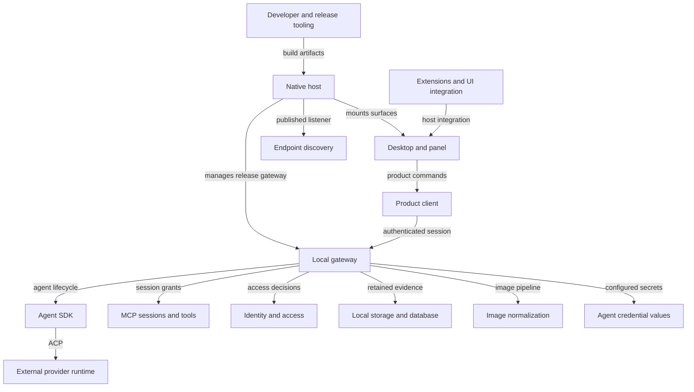
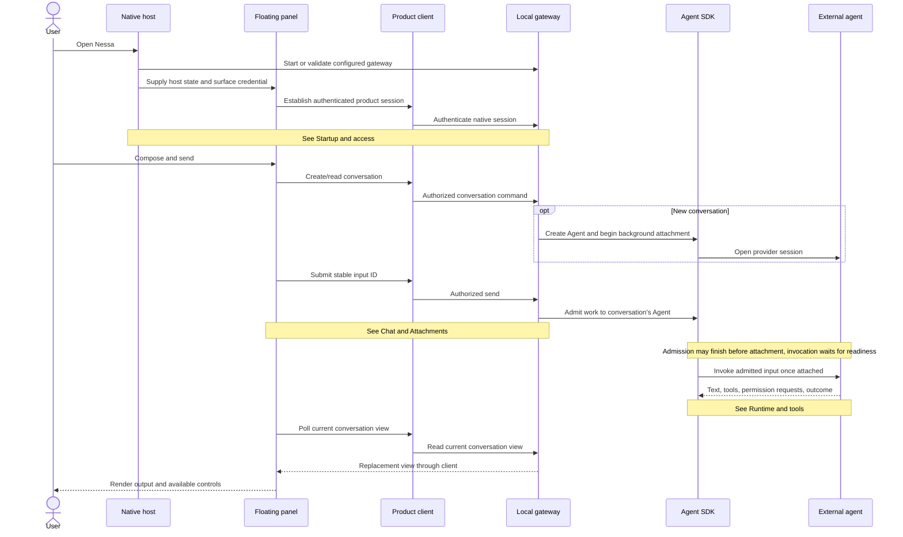

# Nessa system

These pages explain what happens when you use Nessa and which part handles each
step. Choose a diagram box to open a service, then a feature and its individual
flows. The sidebar gives another route through the same pages.

## System overview

This is a **component map**, not a state machine: these components coexist.
Arrows describe selected composition and data relationships, not exclusive states.
The external provider process is intentionally a boundary, not a fictional
Nessa service. Some desktop flows are fixture-backed; their pages retain that fact.

## Opening Nessa and sending a message

Nessa lets a person work with an external agent through a conversation. In the native panel, the host starts or checks the gateway and the panel signs in. Send accepts the input before the agent necessarily starts it. The panel then reads updated conversation views.

The browser connects to an existing gateway using its browser session. The native desktop also reads the local gateway; an ordinary browser preview uses sample data. This native panel sequence does not describe every screen. See [desktop connection modes](services/desktop/workspace/README.md#connection-modes).

## Browse the system

| Area | Start here |
| --- | --- |
| Native startup, onboarding, windows and managed gateway | [Native host](services/host/README.md) |
| Conversation surface, tabs, workspace, panes and widgets | [Desktop and panel](services/desktop/README.md) |
| Connection authority, wire requests and uncertainty | [Product client](services/client/README.md) |
| Product admission, current views, attachments and app calls | [Local gateway](services/gateway/README.md) |
| Provider attachment, scheduling, execution and durable history | [Agent SDK](services/sdk/README.md) |
| Upstream sessions, relay grants, app tools and local shell | [MCP](services/mcp/README.md) |
| Credentials, membership, access and refusal evidence | [Identity and access](services/auth/README.md) |
| Publication, durability and database opening | [Local storage](services/storage/README.md) |
| Stateless image processing | [Images](services/images/README.md) |
| Endpoint discovery and listener publication | [Endpoint](services/endpoint/README.md) |
| Validated agent secret namespaces | [Credential values](services/credentials/README.md) |
| MCP Apps and external UI package boundaries | [Extensions and UI](services/extensions/README.md) |
| Runtime assembly and release operations | [Tooling](services/tooling/README.md) |

## How this stays useful

- [Repository sweep](inventory.md): what was inspected and where state is owned.
- [Gaps and improvements](gaps.md): evidence-backed limits and next work.
- [Authoring and maintenance](authoring.md): document contract and statechart notation.
- [Risk evidence](risks.md): existing reproductions, corrections and exclusions.
- [Flow-map provenance](provenance.md): historical baselines, contributing PRs and original inspection limits.

Charts are **reading models**. Source types and their owning transitions remain
runtime authority; linked tests are evidence to inspect, not a claim they ran in
this sweep. New pages distinguish implemented, fixture, proposed, mixed, and
reference content. The old flow maps have moved into this hierarchy; they no
longer have a separate authoritative location.
