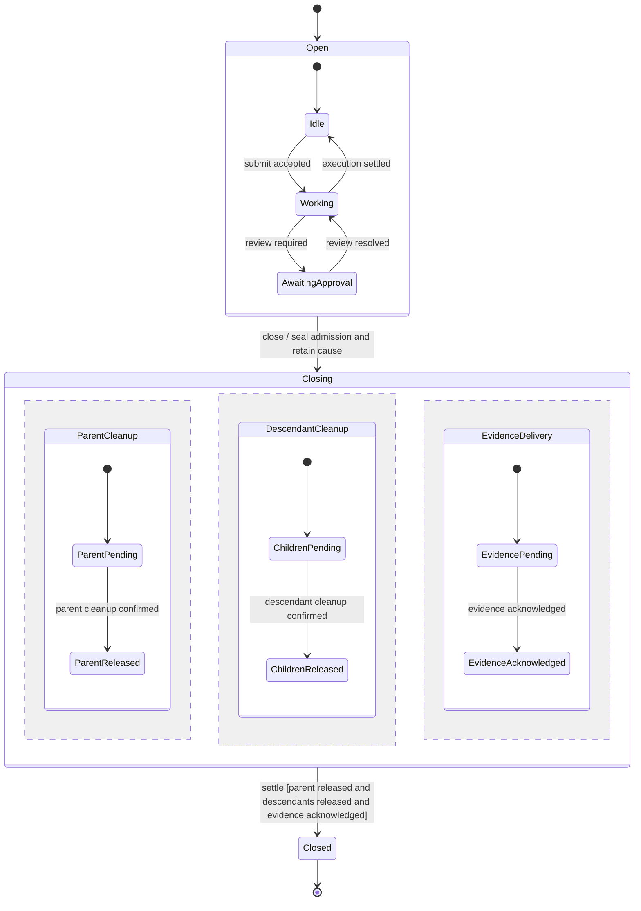

# Authoring and maintaining statecharts

## Statechart principles

[Harel's 1987 paper](https://www.state-machine.com/doc/Harel87.pdf) uses nested
states to refine behavior, concurrent regions to describe activity that coexists,
and events to coordinate it. A configuration is the set of states currently
active: one alternative in an exclusive region, and an active configuration in
each concurrent region. Shared outer transitions can replace repeated inner
transitions. History distinguishes a default entry from a return to a previous
configuration; it does not establish storage durability.

In Nessa, apply these ideas to the actual owner rather than inventing one giant
application state. Keep attachment, admission, execution, provider cleanup,
commit acknowledgement and transport connectivity separately identifiable.
A component diagram organizes services; it does not imply that only one service
exists at a time. Mermaid is our rendering notation, not a complete implementation
of the paper's semantics.

The paper supplies the modeling concepts. Event queues, conflict priority,
asynchronous effects and crash recovery need an explicit contract for the owner
being modeled. The suggestions below help write that contract; they do not claim
that existing Nessa lifecycles share one scheduler or implement the paper's full
formalism. The [coding standards](../../CODING_STANDARDS.md#gates) own the design
and review requirements, including gates 10, 13 and 15.

## Start with the owner and its lifetime

Name what one chart instance follows: one Agent lifetime, one submission, one
permission request or one provider attachment. Identify the domain owner, the
identity that correlates its events, and when that identity stops being usable.
A conversation ID may locate a conversation while a lifetime or attempt ID
distinguishes successive operations within it. Explain which one delayed events
carry, and where that agreement is checked.

Describe the boundary of the chart before naming states. An Agent can be idle
while its transport reconnects; a submission can have a saved result while its
final scheduling write is pending. Separate charts or regions make those facts
visible. Avoid a single status that tries to answer all three questions.

State hierarchy and instance ownership answer different questions. A nested
`Working` state refines one Agent's `Open` state. A child Agent is another
instance, with its own lifecycle and identity, linked to a parent instance by
ownership. Draw the ownership relationship separately and name the events that
cross it. Drawing a child inside a parent state box alone does not define child
creation, cancellation or recursive cleanup.

## Use hierarchy for shared behavior

Group states when they share a meaningful enclosing condition and behavior.
For example, `Idle`, `Working` and `AwaitingApproval` can refine `Open`; one
transition from `Open` to `Closing` can describe closure from those substates.
The inner states still explain their own activity without repeating the shared
close rule.

Explain how entry chooses an initial substate, which enclosing handlers apply,
and which states a transition exits and enters. A transition between two inner
states need not leave their enclosing state. Distinguish an internal event that
keeps the configuration from a self-transition that exits and re-enters a state:
the latter may stop and restart its activity.

If an enclosing and an inner transition can both consume the same event, show
how the conflict is resolved. Do not infer “deepest wins” or “outermost wins”
from drawing position. Mutually exclusive guards often make the decision clearer
than adding priority. When priority is intentional, name it and explain its
effect on the losing transition.

## Use concurrent regions for separately evolving facts

Concurrent, or orthogonal, regions describe facts that coexist and can advance
separately. They do not imply separate OS threads. Use them when flattening the
chart would create combinations such as `ParentReleasedButChildrenPending`.
For different decision owners, linked charts may be clearer than regions inside
one owner's chart.

Give each region its entry configuration and events. Name shared facts, the owner
of synchronization, and the condition permitting an enclosing transition. If one
event affects several regions, explain whether their changes form one local
decision or arrive as separately correlated events. A cross-region guard needs
a coherent view of the facts it reads.

### Illustrative parent closure

This is a **proposed authoring example**, not a chart of an implemented subagent
contract. It follows one parent lifetime. Closure seals admission, retains its
cause and starts parent cleanup, descendant cleanup and evidence delivery.

The regions retain separate progress; their completion dependencies belong to
the owning contract. Final evidence may depend on the physical cleanup outcomes.
`Closed` means this example's owner has confirmed all three conditions. A timeout
or uncertain provider outcome leaves the affected obligation unresolved; another
region's success cannot stand in for it. The states below simplify those failure
and retry paths, which an implementation design would expand in its owning chart
and ordering table.



Here `--` separates concurrent regions. Entering `Closing` enters their default
pending states and schedules their effects. Matching outcomes advance each
region; the coordinator checks the `settle` guard after entry and after each
relevant outcome, including the case with no descendants. A repeated `close`
keeps the first cause and joins the existing cleanup rather than re-entering
`Closing` and starting it again. Required evidence delivery and physical cleanup
remain separate, so failed delivery does not stop needed cleanup.

`ChildrenReleased` covers owned startup reservations and late constructors as
well as attached children; a snapshot of currently running children is not enough
to confirm it. `EvidenceAcknowledged` covers all required records for this
closure, including final cleanup outcomes, rather than just its initial intent.

## Write the event contract

An arrow names a possible transition. Its surrounding section explains how that
transition is selected and what the rest of the machine does. For each owner,
make these choices readable beside the chart or link its owning design table:

| Question | What to explain |
| --- | --- |
| Event origin and identity | Caller command, internal event, timeout or adapter outcome; target lifetime and operation/attempt correlation. |
| Ordering | Where an event becomes owned, how queued events are ordered, and what wins when close and completion are ready together. Arrival at different processes does not create a global order. |
| Selection and conflict | Enabled source configurations, guard inputs and their authority, mutually exclusive alternatives, and any explicit priority. Explain compatible transitions in separate regions too. |
| Event outcome | Handled with or without a state change; refused with a typed reason; deferred until a named condition; or deliberately ignored with its observable meaning. A false guard alone does not select one of these outcomes. |
| Deferred events | Who retains them, count/byte limits, when they become eligible, and what close, expiry or caller loss does to them. |
| Actions and activities | Which states exit and enter, the order of exit/transition/entry actions, and which ongoing activities start, stop or remain owned. An exit request does not prove physical termination. |
| Internal communication | Which events an action emits, who receives them, whether they run in the current local decision or later, and how a cycle or continuously ready stream is bounded. |

Avoid leaving failure, duplicate and stale events under an unexplained “otherwise”
arrow. For example, a delayed cleanup outcome for another lifetime can be ignored
for current state while still retaining diagnostic evidence. A conflicting result
for the current attempt may require a typed failure and a barrier to new work.
Explain those meanings separately.

### Local decisions and asynchronous effects

For a new lifecycle, a useful starting profile is to serialize **local state
decisions** for each owner. Select an event, validate its correlation, evaluate
guards against a coherent configuration, and apply the selected transitions
before accepting the next event. Identify the point at which competing commands
become admitted or refused. This is a local guarantee, not an atomic transaction
with a database, network peer or provider process.

Keep slow effects outside that decision. An action can return an effect request
carrying the lifetime and attempt identity; application code runs it through its
port and returns a correlated success, failure or uncertain outcome as another
event. The owner then decides whether the outcome still applies. Describe the
handoff and its supervision so cancellation or caller loss does not leave an
effect without an owner. Holding an admission lock through cleanup makes it
harder to accept the events needed to finish that cleanup.

Show waiting for acknowledgement as state or a separate fact. A locally selected
decision, a save attempt, a committed record and an external effect are different
observations. For the closure example, admission is sealed before cleanup is
awaited; reporting audited success also waits for evidence acknowledgement.
An uncertain save or cleanup outcome needs its own recovery meaning.

For an existing lifecycle, document the actual queue, lock or task selection and
its limits. A chart cannot claim atomicity, priority or fairness that the owning
implementation and regression evidence do not establish.

## Repository document contract

The website lives outside this repository. It reads these files through a
configured repository root. Markdown remains reviewable and useful without the
website. A document has YAML frontmatter followed by normal Markdown:

```yaml
---
id: sdk-provider
title: Provider attachment
kind: statechart
status: implemented
summary: Provider attachment and its cleanup ownership
parent: sdk
sources:
  - crates/nessa-sdk/src/application/agent_execution/agents/lifecycle.rs
diagramLinks: {}
---
```

IDs are stable lowercase
kebab-case values. `parent` is another document ID or null for a system root.
Kinds are `system`, `service`, `feature`, `flow`, `statechart`, `operation`,
`contract`, and `guide`. Status is `implemented`, `mixed`, `fixture`, `proposed`,
or `reference`; source evidence and verification exclusions explain that label.
The loader rejects duplicate IDs, missing parents, cycles and unresolved diagram
links. Each `sources` entry is a repository-relative path. `diagramLinks` maps
Mermaid node IDs to document IDs for drill-down; ordinary Markdown links also
work. Folder paths organize the files, while parent metadata owns the browsing
hierarchy. Do not add another navigation manifest.

## Diagram explanations

Keep state and guard explanations in the owning page's Markdown. The optional
`diagramDetails` frontmatter list connects a diagram element to one of those
sections. It does not repeat the explanation:

```yaml
diagramDetails:
  - diagram: 0
    node: Admission
    section: Call admission
  - diagram: 0
    edge:
      from: Admission
      to: Refused
      label: Origin, scope, visibility or bounds rejected
    section: Admission refusal rules
```

Use `diagramDetails` with `stateDiagram-v2` or a component `flowchart`/`graph`.
Component maps still use `diagramLinks` for navigation. Sequence diagrams explain
order in Details; their messages do not receive inspector bindings. `diagram` is the zero-based order of the fenced
Mermaid block in that page.
An entry selects either a `node` or an `edge`. The node IDs, edge endpoints and
edge label match the chart source; `section` is the exact plain heading text
read by the loader, unique within the page. Headings inside a quote or list do
not define an inspector section. The section includes its nested headings
and ends at the next heading of the same or higher level. Distinct labels can
identify different transitions between the same two states.

For a component map, select an ordinary node or an edge with a plain label.
Subgraph groups and edges to those groups cannot carry inspector details. Two
edges with the same endpoints and label are ambiguous. Distinct Mermaid element
identities must also be unique. Health reports those cases instead of guessing
which element should open an explanation.

Use plain transition labels written as-is. Labels containing Mermaid entity
codes such as `#quot;`, HTML markup, Markdown strings or a literal `|` cannot receive detail bindings; the
browser reports the unsupported label in Settings → Health. A Mermaid block
can contain at most 100,000 UTF-16 code units as written, including frontmatter,
directives and comments. The browser and loader apply this same bound. Split a
larger model into diagrams owned by the relevant services or lifecycles.

A detail section may be the reader's first encounter with this part of Nessa.
Start with two short paragraphs in plain English: what is happening, what
allows or prevents the next step, and what happens afterward. Explain chart
notation in words where it is used. For example, `[time >= issuance]` means
“the requested time is no earlier than the credential's creation.”

Use a short sequence when it helps show who passes work to whom and in what
order. Include the important refusal or uncertain outcome, but leave the full
call path in source. Do not add a sequence to every page or turn every function
into a diagram node. States belong in statecharts; parts that coexist belong in
component maps.

Keep two or three useful source or evidence links in Further reading. The full
source list stays in frontmatter. Do not move walls of function names and test
names into Technical notes. Compact and Standard provide short explanations;
Full displays the authored section, including its useful examples. The complete
page and its sequences are available in Details.

Use short sentences and ordinary words. Avoid em dashes, filler and slogans.
Preserve important conditions and uncertainty in the opening explanation.
Several selectors can point to one section when they explain the same decision.
A missing explanation is a documentation gap, rather than permission to infer
behavior from a label.

In the browser, a `+` marks an available explanation or a deeper document.
`diagramLinks` continues to own navigation between documents. A detail section
opens in the right inspector; a node with both kinds of depth can offer the
related document from that inspector. The complete page remains available in
Details. Diagram detail preferences change presentation: Full displays the
authored explanation, and does not launch an agent or change repository files.
If an explanation contains a Mermaid block, the inspector links to that
block in Details rather than rendering a second interactive copy.
The compact view must preserve access to the transition's meaning even when
its label is visually hidden.

## Reading statechart notation

| Notation | Meaning to establish on the owning page |
| --- | --- |
| State box | The named configuration of one entity or operation, with its owner and identity. |
| Nested state | A refinement of the enclosing state; explain shared transitions and entry behavior. |
| Concurrent regions | Configurations that can coexist; name synchronization and cross-region guards. |
| `event [guard] / action` | The trigger, condition required for this transition, and resulting action. A rejected guard needs a defined alternative outcome. |
| Initial or final marker | Entry to or completion of the modeled operation. Completion alone does not prove cleanup or erasure. |
| `H` / `H*` in Harel's notation | Shallow history restores the previous immediate substate; deep history restores the previous nested configuration. State what is remembered, by whom, for how long, and the default when no history exists. |

The history notation explains the paper; it does not assert that a Mermaid
renderer supports those symbols or that Nessa implements such a state. Use an
explicitly named restoration operation when that better describes the actual
code. A stored record, a browser tab and a running provider session have
different lifetimes and cannot substitute for one another.

## What to put on a page

Start with what the page follows and what the reader can expect. Explain the
important states, triggers, pass/fail conditions and uncertainty. Link the source
for exact types and detailed checks, rather than retyping them. Put diagrams near the behavior they explain. A pure value
contract or a component inventory does not need an invented lifecycle.
Keep one complete user-goal index per feature.
Use `event [guard] / action` on arrows when all three are meaningful. A final
marker ends the modeled operation; it does not assert a resource was deleted.

For independent facts, use a small chart per owner or concurrent regions with
`--` inside a composite state. Explain synchronization and cross-region guards.
Do not draw a successful receipt as proof of provider completion, or an IO error
as proof that publication never happened. Keep audit acknowledgement distinct
from physical effect.

### History and durable recovery

History remembers a previous configuration on re-entry. Durable recovery asks
what can be established after a process stops. Explain them separately: which
states or facts are retained, what acknowledges the save, and what fresh evidence
is needed before an external operation can resume. State the default when no
history exists and when remembered history is cleared.

Name exactly what survives: in-memory tabs, browser references, committed records,
checkpoints or provider context. Reconnect does not imply command replay;
restored records do not imply re-execution. Do not add an `H` node that promises
unsupported resume semantics. In the proposed closure example, a retained
closing lifetime would resume reconciliation of cleanup obligations; opening a
new lifetime would not reactivate its former children.

### Connect the chart to code and evidence

Use the page's `sources` and a few focused links to connect states and transition
sections to their owning domain operations, application effects and regression
cases. Keep the ordering table in its owning ADR or design document, with row
references where useful. One transition section can explain several arrows that
share the same decision. Types can represent exclusive states while separately
stored facts represent concurrent regions; the diagram need not dictate the
implementation's object layout.

Describe verification by behavior rather than arrow count. Useful evidence
includes accepted transitions, false guards with their refusal/defer/ignore
outcomes, shared enclosing transitions from different substates, simultaneous
readiness and different event orders across regions. Include repeated commands,
stale outcomes, caller loss, cleanup failure and restoration where they affect
the chart. The canonical design-table and review gates remain in the
[standards](../../CODING_STANDARDS.md#local-code-review-gate).

State properties that hold across sequences, alongside the tests or types that
enforce them. For the proposed closure example, candidate properties are that
sealed admission admits no new child, confirmed closure implies released
descendants and acknowledged evidence, and a repeated close preserves its first
cause. Generated event sequences or bounded interleaving exploration can expose
cases that individual transition tests miss. These are proposed test targets,
not guarantees established by this guide.

Separate safety (“this invalid configuration is unreachable”) from liveness
(“cleanup eventually finishes”). A progress claim needs its assumptions: the
provider eventually confirms release, required storage becomes available, and
the owner continues receiving execution time. A timeout proves that a deadline
passed; it does not prove termination. Explain what remains owned when those
assumptions fail.

## Workflow as the code changes

1. Locate the existing owner and page using the service hierarchy and source links.
2. Re-read that owner's code and relevant regression cases before changing its chart.
3. Follow the repository's [design-order and review requirements](../../CODING_STANDARDS.md#gates) in their canonical document. Tables in existing design records remain evidence; this atlas does not retype those requirements.
4. Change the owning Markdown, then validate metadata, links, and Mermaid rendering with the standalone browser's checks.
5. Update gap/risk dispositions when evidence changes. Keep proposals separate from implemented behavior; retain historical reproduction context.

Generated image previews are optional output, never a second editable chart.
The browser renders SVG directly from fenced Mermaid in Markdown. This atlas is
for documentation; it does not dispatch tools, derive production guards from
English, or replace Rust/TypeScript domain code. Executable state definitions
would be a separate explicit design decision with an owner and regression proof.
