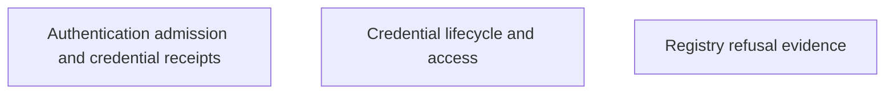

# Identity and access

Nessa checks who can access a gateway and its conversations. Credentials, current membership and permissions determine whether an action is allowed.

These pages explain credential lifetime, sign-in checks and safe refusal of damaged credential storage.

## Owner map

These boxes open related pages. They are parts of the system, rather than mutually exclusive runtime states.

## Browse this area

- [Authentication admission and credential receipts](auth-admission.md)
- [Credential lifecycle and access](auth-credential.md)
- [Registry refusal evidence](auth-registry-refusal.md)
