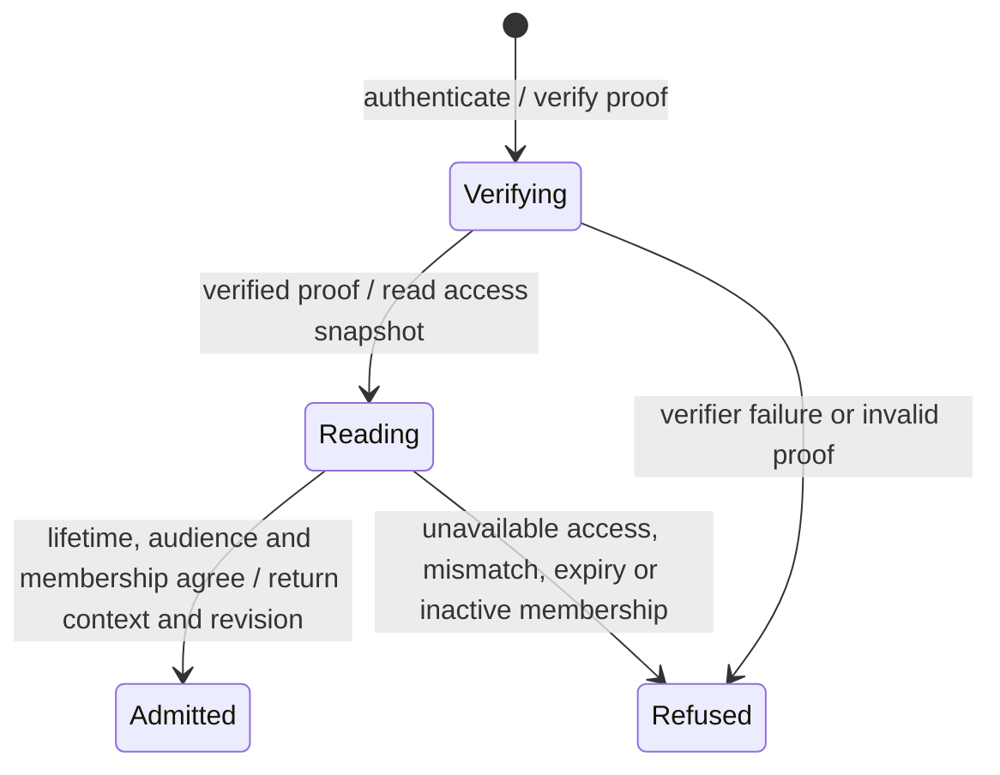
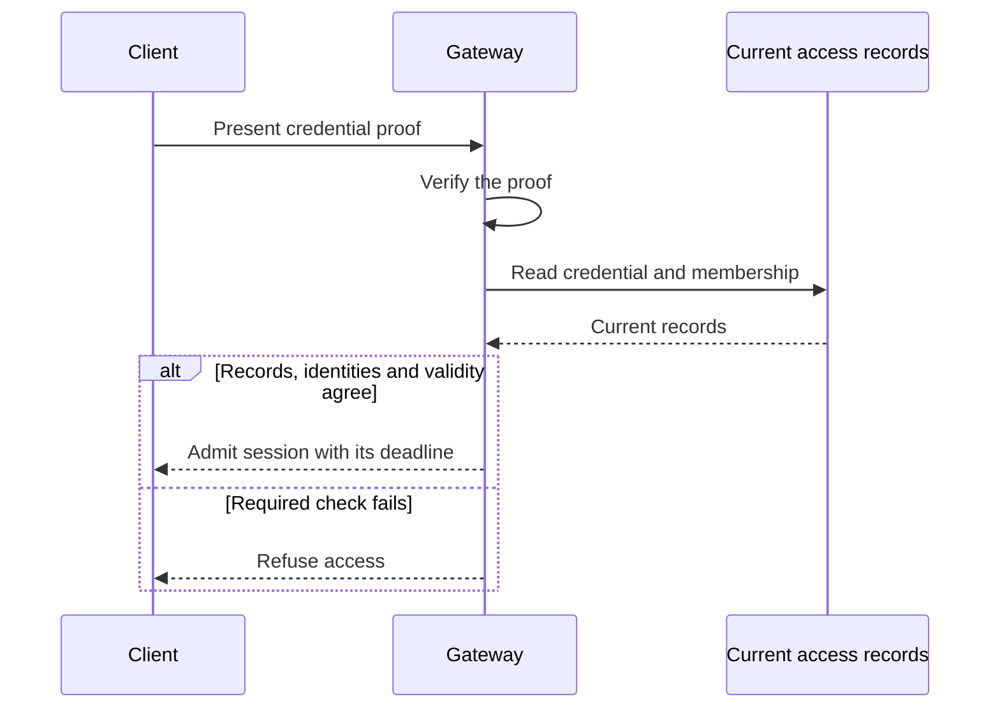

# Authentication admission and credential receipts

Before Nessa accepts a sign-in, it checks the proof of identity and the person's current access. This chart follows those checks for one request.

A successful sign-in identifies the caller. Each later action still needs its own permission check. The chart does not describe a stored session or the state of a network connection.

## Verifying proof

Nessa first checks the proof supplied with the sign-in request. A credential ID on its own is not enough: the proof must be verified by the trusted sign-in code for the intended server.

If verification fails, the request stops here. If it succeeds, Nessa uses the verified credential ID to look up current access. Any expiry attached to the proof also limits how long that sign-in can remain valid.

## Reading current access

A valid proof is only the first check. Nessa then reads the credential and membership together, so it can decide whether that person has access now.

It refuses access if the record belongs to another credential or server, the proof or credential is outside its valid time, the person and organization do not match, or membership is inactive. If the records cannot be read, it cannot finish the check.

## Admitted identity and deadline

All sign-in checks passed. Nessa returns who the caller is, which organization and membership they belong to, and which credential and server were checked.

If the proof or credential expires, the sign-in uses the earlier deadline. This result does not grant every action: the caller must respect that deadline, and later actions are checked against current access.

## Refused admission

The sign-in request did not pass the checks, so no authenticated session is returned. The reason may be invalid proof, a mismatch in the identity records, an expired or revoked credential, inactive membership, or an unavailable dependency.

A refusal here is the result of this one request. It does not revoke the credential, close a connection, save a rejection record or decide whether retrying is useful.

## Resume and current-session checks

Returning to an existing session still requires a fresh access check. Nessa verifies the saved session proof and reads the current credential and membership. Revoked or expired credentials, inactive membership and mismatched identities are refused.

Using an already authenticated session also reads current access. It refuses a record older than the one checked at sign-in and checks that the identities still match. Passing this check does not by itself grant an action.

## Credential command receipts

When a credential is created, its secret is returned once. Retrying the same creation request returns the current credential information and the original change evidence, but not the secret. If the secret was lost, recovery requires an explicit revoke-and-reissue step.

A credential can have been revoked since that first request. A retry can therefore show a currently revoked credential alongside the original record of its creation. That does not mean creation ran again.

## Further reading

[Source](../../../../crates/nessa-auth/src/application/session.rs) · [Related source](../../../../crates/nessa-auth/src/application/ports.rs)
