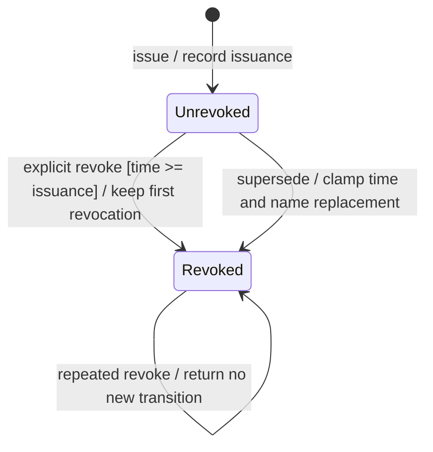
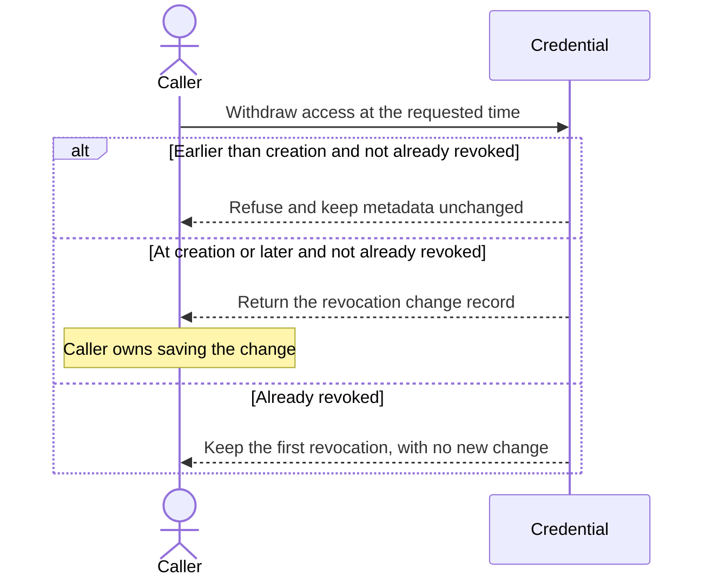
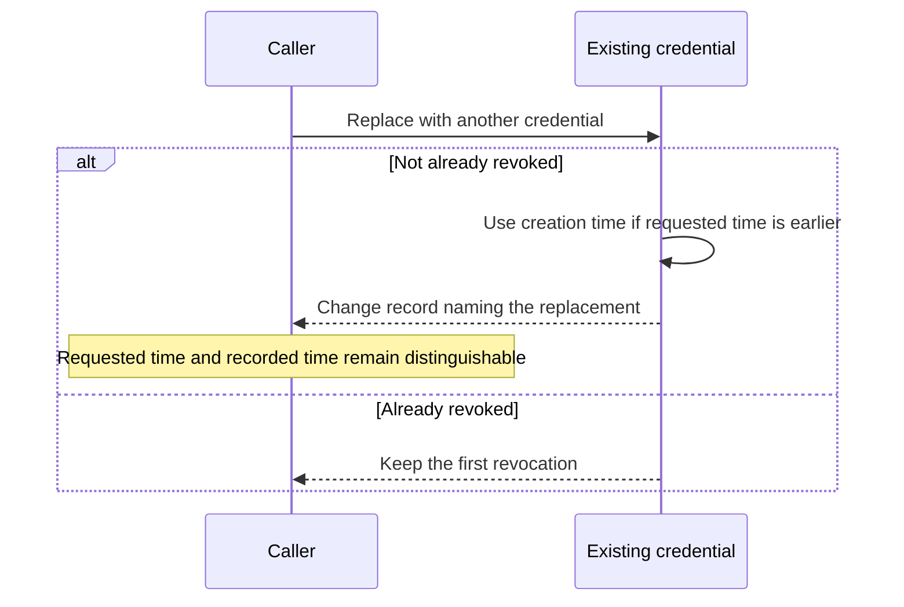

# Credential lifecycle and access

A credential is a way to prove who is asking for access. This chart shows whether its record has been revoked; that means that access has been withdrawn.

A credential that has not been revoked can still be expired or lack permission for an action. Those checks happen separately. This chart describes the credential record; it does not describe a connection or the delivery of a secret.

## Unrevoked credential

The credential has not been revoked. Its record says who it belongs to, which organization and server it is for, and when it can be used.

“Unrevoked” does not mean it is usable right now. It cannot be used before its creation time or at or after its expiry time. Nessa also checks the person's membership and the permission needed for each action.

## Revoked credential

The credential's access has been withdrawn. Once that revocation is recorded, the credential fails the lifetime check, even if the clock reads an earlier time.

The first accepted revocation time is kept. Revoking does not change who owns the credential, its creation or expiry time, or its listed permissions. The revocation time is a record of the change, not a scheduled future switch.

## Explicit revocation

Revoking a credential means withdrawing its access. The requested time must be when the credential was created or later, even if it has already expired. An earlier time is rejected, and the record stays unchanged.

The first accepted request marks the credential as revoked and prepares a record of who requested the change and when. That record still has to be saved by the calling code. The rule `[time >= issuance]` on the arrow means “the requested time is no earlier than creation.”

## Supersession

A new credential can replace an old one. This withdraws access from the old credential and records which new credential replaced it.

If the replacement request carries a time earlier than the old credential's creation, Nessa records the revocation at the creation time instead. It still keeps the original request time in the change evidence. An already revoked credential keeps its first revocation.

## Repeated revocation

Revoking the same credential again leaves the first revocation intact. It does not change the time or create another change record, even if the later request supplies an earlier time. Replacing an already revoked credential behaves the same way.

A reply to a repeated command can still include the original saved evidence. That is different from making the change again. Similarly, retrying credential creation does not reveal its secret a second time.

## Current access and storage refusal

Nessa checks access again when a session is authenticated, resumed or used. A successful sign-in does not guarantee that a credential or membership will stay valid for later actions.

Nessa can also refuse to open an unsafe or damaged credential store while preserving the file or lock. That is a storage problem; it does not mean a credential was revoked.

## Further reading

[Source](../../../../crates/nessa-auth/src/domain/models.rs) · [Related source](../../../../crates/nessa-auth/src/domain/transition.rs)
