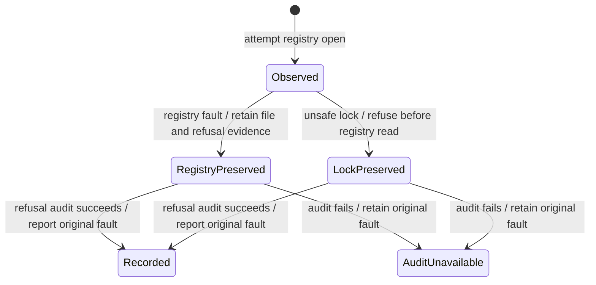

# Registry refusal evidence

Nessa refuses to use a credential file if it is damaged, too large, has an unsupported format, or is unsafe to open. It leaves the file unchanged so the problem can be investigated without destroying the original.

The refusal record describes the problem without exposing secrets. Failure to save that record does not make the file safe or replace the original error. This chart follows a refusal, not every attempt to open a credential file.

## Further reading

[Source](../../../../crates/nessa-auth/src/application/credential_registry.rs)
